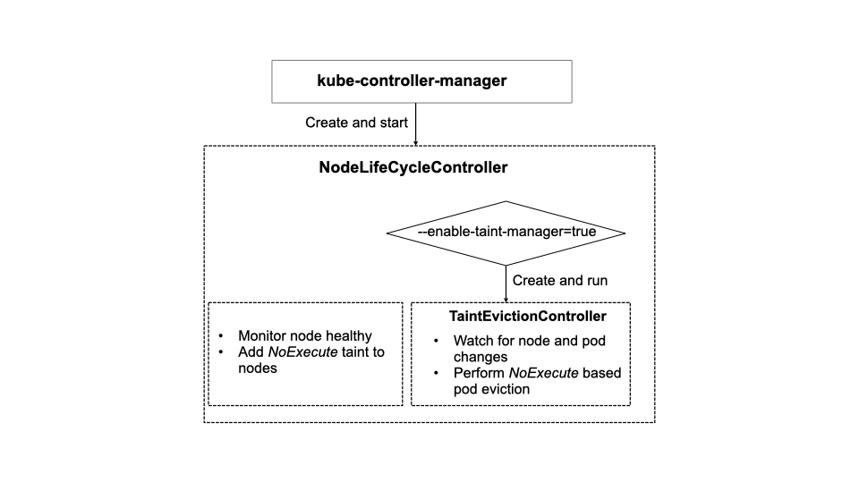
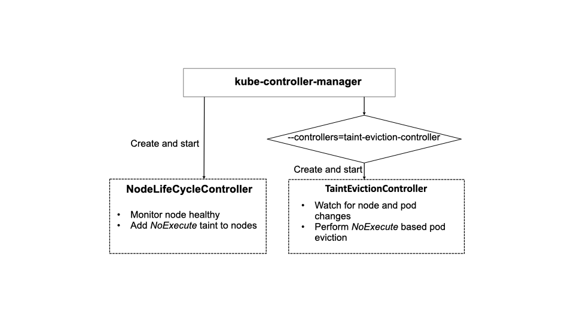

# KEP-3902:  Decouple Taint-based Pod Eviction from Node Lifecycle Controller 
<!-- toc -->
- [Release Signoff Checklist](#release-signoff-checklist)
- [Summary](#summary)
- [Motivation](#motivation)
  - [Goals](#goals)
  - [Non-Goals](#non-goals)
- [Proposal](#proposal)
  - [User Stories (Optional)](#user-stories-optional)
    - [Story](#story)
  - [Notes/Constraints/Caveats (Optional)](#notesconstraintscaveats-optional)
  - [Risks and Mitigations](#risks-and-mitigations)
- [Design Details](#design-details)
  - [Proposed Controllers](#proposed-controllers)
  - [Implementation](#implementation)
  - [Test Plan](#test-plan)
      - [Prerequisite testing updates](#prerequisite-testing-updates)
      - [Unit tests](#unit-tests)
      - [Integration tests](#integration-tests)
      - [E2E tests](#e2e-tests)
  - [Graduation Criteria](#graduation-criteria)
    - [Alpha](#alpha)
    - [Beta](#beta)
    - [GA](#ga)
  - [Upgrade / Downgrade Strategy](#upgrade--downgrade-strategy)
  - [Version Skew Strategy](#version-skew-strategy)
- [Production Readiness Review Questionnaire](#production-readiness-review-questionnaire)
  - [Feature Enablement and Rollback](#feature-enablement-and-rollback)
  - [Rollout, Upgrade and Rollback Planning](#rollout-upgrade-and-rollback-planning)
  - [Monitoring Requirements](#monitoring-requirements)
  - [Dependencies](#dependencies)
  - [Scalability](#scalability)
  - [Troubleshooting](#troubleshooting)
- [Implementation History](#implementation-history)
- [Drawbacks](#drawbacks)
- [Alternatives](#alternatives)
- [Infrastructure Needed (Optional)](#infrastructure-needed-optional)
- [Note](#note)
<!-- /toc -->

## Release Signoff Checklist

Items marked with (R) are required *prior to targeting to a milestone / release*.

- [X]  (R) Enhancement issue in release milestone, which links to KEP dir in [kubernetes/enhancements](https://git.k8s.io/enhancements) (not the initial KEP PR)
- [X]  (R) KEP approvers have approved the KEP status as `implementable`
- [X]  (R) Design details are appropriately documented
- [ ]  (R) Test plan is in place, giving consideration to SIG Architecture and SIG Testing input (including test refactors)
    - [ ]  e2e Tests for all Beta API Operations (endpoints)
    - [ ]  (R) Ensure GA e2e tests meet requirements for [Conformance Tests](https://github.com/kubernetes/community/blob/master/contributors/devel/sig-architecture/conformance-tests.md)
    - [ ]  (R) Minimum Two Week Window for GA e2e tests to prove flake free
- [ ]  (R) Graduation criteria is in place
    - [ ]  (R) [all GA Endpoints](https://github.com/kubernetes/community/pull/1806) must be hit by [Conformance Tests](https://github.com/kubernetes/community/blob/master/contributors/devel/sig-architecture/conformance-tests.md)
- [ ]  (R) Production readiness review completed
- [ ]  (R) Production readiness review approved
- [ ]  "Implementation History" section is up-to-date for milestone
- [ ]  User-facing documentation has been created in [kubernetes/website](https://git.k8s.io/website), for publication to [kubernetes.io](https://kubernetes.io/)
- [ ]  Supporting documentation—e.g., additional design documents, links to mailing list discussions/SIG meetings, relevant PRs/issues, release notes

## Summary

In Kubernetes, `NodeLifecycleController` applies predefined `NoExecute` taints (e.g., `Unreachable`, `NotReady`) when the nodes are determined to be unhealthy. After the nodes get tainted, `TaintManager` does its due diligence to start deleting running pods on those nodes based on `NoExecute` taints, which can be added by anyone.

In this KEP, we propose to decouple `TaintManager` that performs taint-based pod eviction from `NodeLifecycleController` and make them two separate controllers: `NodeLifecycleController` to add taints to unhealthy nodes and `TaintManager` to perform pod deletion on nodes tainted with NoExecute effect.

This separation not only improves code organization but also makes it easier to improve `TaintManager` or build custom `TaintManager`.

## Motivation
`NodeLifecycleController` combines two independent functions: 
   * Adding a pre-defined set of `NoExecute` taints to nodes based on the node conditions 
   * Performing pod eviction on `NoExecute` taints

Splitting the `NodeLifecycleController` based on the above functionalities will help to disentangle code and make future extensions to either component manageable.

### Goals

* Move taint-based eviction implementation out of `NodeLifecycleController` into a separate and independent taint-manager to enhance separation of concerns, maintainability. 

### Non-Goals

The main focus of the KEP is on the separation of concerns between `NodeLifecycleController` and `TaintManager`, which will improve code organization and enable future extensions to `TaintManager`. While it is true that the separation allows cluster operators to build custom `TaintManager` and disable the default `TaintManager`, this is a side-effect of the change rather than the main goal. the KEP emphasizes the benefits of the separation of concerns and briefly mention the option to disable the default TaintManager as a potential side-effect.

The non-goals are the following.
* Introduce extra maintenance burden or regression after the code reorganization
* Introduce incompatible behavior of `NodeLifecycleController` or `TaintManager`
* Extend and enhance the current built-in APIs for customization of node taint-based eviction, including additional fields, more flexible communication protocols, webhooks and CRD references, etc.
* Actual extension and enhancement  of the current `TaintManager`.

## Proposal

### User Stories (Optional)

While this split is for improving the code maintainability, an effect of this change is that it allows cluster-admins to extend and enhance the default `TaintManager` and even replace the default `TaintManager` with a custom implementation. However, discussing such use-cases for extending `TaintManager` or writing  custom `TaintManager` is beyond the scope of this KEP. 

#### Story

### Notes/Constraints/Caveats (Optional)

### Risks and Mitigations

Compared with a single combined controller, the risks of using two separate controllers include the following.
* Slightly increase the communication overhead from applying node taints to performing pod eviction.
* Make cancellation of pod eviction and un-tainting nodes harder. 

However, the performance overhead of the split controllers is expected to be small, and pod eviction cancellation and un-tainting nodes are not common use cases. Splitting `NodeLifecycleController` is more beneficial by promoting a cleaner design and enhancing the overall maintainability and extensibility in the long term.

## Design Details

In Kubernetes version 1.27 and earlier, the `NoExecuteTaintManager` component is included within the `NodeLifecycleController`.

### Proposed Controllers

The proposed design refactors `NodeLifecycleController` into two independent controllers, which are managed by `kube-controller-manager`.

1. `NodeLifecycleController` monitors node health and adds `NotReady` and `Unreachable` taints to nodes 
2. `NoExecuteTaintManager` watches for node and pod updates,  and performs `NoExecute` taint based pod eviction

The existing  kube-controller-manager flag `--controllers` can be used to optionally disable the `NoExecuteTaintManager`.

### Implementation

A new `NodeLifecycleManager` is implemented by removing taint-manager related code from `controller/nodelifecycle/node_lifecycle_controller.go`.

A new `NoExecuteTaintManager` is created as a top-level controller managed by` kube-controller-manager`. Its implementation is based on the current taint-manager from `controller/nodelifecycle/taint-manager.go`.   

The creation and startup of the default taint-manager is performed by `kube-controller-manager`. A feature gate `SeparateTaintManager` controls whether to use the split `TaintManager` or  roll back to the old `NodeLifecycleController`.

### Test Plan

[x] I/we understand the owners of the involved components may require updates to existing tests to make this code solid enough prior to committing the changes necessary to implement this enhancement.

##### Prerequisite testing updates

Kubernetes already has a good coverage of node `No-Execute` eviction. We will add tests only for the changed code.

#####  Unit tests
- `pkg/controller/taintmanager`: 2023-06-03 - 0% (to add)
  - Enable and disable the new `TaintManager`
  - The new `TaintManager` acts on node taints properly
- `pkg/controller/apis/config/v1alpha1`: 2023-06-03 - 0% 
  - Test new configuration  
- `pkg/controller/nodelifecycle`: 2023-06-03 - 74.8%
  - Test the combined controller
- `pkg/controller/nodelifecycle/scheduler`: 2023-06-03 - 90%
  - Test the combined controller

#####  Integration tests
- Verify the ability to enable and disable the default `TaintManager`.
- Verify the new `TaintManager`to act on node taints properly.

##### E2E tests
- Verify the new controllers to pass the existing E2E and conformance tests using the split `TaintManager`.
- Manually test rollback and the `upgrade->downgrade->upgrade` path to verify it can pass the existing e2e tests. 

### Graduation Criteria

#### Alpha

Since there are no new API changes, we can skip Alpha and go to Beta directly.

#### Beta

* Support `kube-controller-manager` flag `--controllers=-taint-manager` to disable the default taint-manager.
* Unit and e2e tests completed and passed.
* Performance and scalability tests to verify there is non-negligible performance degradation in node taint-based eviction.
* Update documents to reflect the changes.

#### GA

* Fix all reported bugs if any.

### Upgrade / Downgrade Strategy

A feature gate `SeparateTaintManager`  enables and disables the new feature. When the feature is turned on, a user can use `kube-controller-manager`'s flag to disable the default `TaintManager`.

### Version Skew Strategy

## Production Readiness Review Questionnaire

### Feature Enablement and Rollback

###### How can this feature be enabled / disabled in a live cluster?

- [X] Feature gate (also fill in values in `kep.yaml`)
  - Feature gate name: SeparateTaintManager
  - Components depending on the feature gate: kube-controller-manager

###### Does enabling the feature change any default behavior?
No, the default `NodeLifecycleManager` and `TaintManager` behavior will stay the same.

###### Can the feature be disabled once it has been enabled (i.e. can we roll back the enablement)?
Yes. Once rolled back, `TaintManager` is enabled along with `NodeLifecycleController`.

###### What happens if we reenable the feature if it was previously rolled back?
The feature will work as usual.

###### Are there any tests for feature enablement/disablement?
No enablement/disablement tests are needed since this is in-memory feature and just regular tests with the feature being enabled/disabled do the job.

### Rollout, Upgrade and Rollback Planning

<!--
This section must be completed when targeting beta to a release.
-->

###### How can a rollout or rollback fail? Can it impact already running workloads?
This is an opt-in feature, and it does not change any default behavior. Unless there is a bug in the implementation, a  rollout can not fail. If a rollout does fail, running workloads will not be evicted properly on tainted nodes. We don't except a rollback can fail.

###### What specific metrics should inform a rollback?
A significantly changing number of pod evictions (`taint_manager_pod_evictions_total`) and/or a substantial increase in pod eviction latency (`taint_manager_pod_eviction_latency`) in Kubernetes.

###### Were upgrade and rollback tested? Was the upgrade->downgrade->upgrade path tested?
The upgrade will be tested in the planned unit and e2e tests. The rollback and upgrade-downgrade-upgrade path will
be tested manually (see [Test Plan](#test-plan) section).  

###### Is the rollout accompanied by any deprecations and/or removals of features, APIs, fields of API types, flags, etc.?
No

### Monitoring Requirements

###### How can an operator determine if the feature is in use by workloads?
It can be determined by if the feature gate `SeparateTaintManager` is used or not.

###### How can someone using this feature know that it is working for their instance?
- [x] Other (treat as last resort)
  - Details: Node taints and taint-based pod eviction should work as usual and there is no significant change in the number pod evictions and pod eviction latency.  

###### What are the reasonable SLOs (Service Level Objectives) for the enhancement?
The performance of node taint-based eviction should remain the same level as before.

###### What are the SLIs (Service Level Indicators) an operator can use to determine the health of the service?
The metrics for both `NodeLifecycleController` and `TaintManager`'s queues should stay the same levels as before, the number of pod evictions and pod eviction latency. 

- [X] Metrics
  - Metric name: `taint_manager_pod_evictions_total`, `taint_manager_pod_eviction_latency` 
  - Components exposing the metric: `kube-controller-manager`

###### Are there any missing metrics that would be useful to have to improve observability of this feature?
No

### Dependencies

###### Does this feature depend on any specific services running in the cluster?
No

### Scalability

###### Will enabling / using this feature result in any new API calls?
No

###### Will enabling / using this feature result in introducing new API types?
No

###### Will enabling / using this feature result in any new calls to the cloud provider?
No

###### Will enabling / using this feature result in increasing size or count of the existing API objects?
No

###### Will enabling / using this feature result in increasing time taken by any operations covered by existing SLIs/SLOs?
It may slightly increase the time of pod eviction. 

###### Will enabling / using this feature result in non-negligible increase of resource usage (CPU, RAM, disk, IO, ...) in any components?
No

###### Can enabling / using this feature result in resource exhaustion of some node resources (PIDs, sockets, inodes, etc.)?
No

### Troubleshooting

###### How does this feature react if the API server and/or etcd is unavailable?
The same behavior as the current version: fail to add taint and/or evict pods on tainted nodes.

###### What are other known failure modes?
No

###### What steps should be taken if SLOs are not being met to determine the problem?
If the pod eviction latency increases significantly, validate if the communication between `NodeLifecycleController` and `TaintManager` works. If the number of pod evictions is abnormal, run tests to verify the `TaintManager` works properly.

## Implementation History

* 2023-03-06: Initial KEP published. 

## Drawbacks

## Alternatives

Keeping the code as-is is an option, but it will make future extension of `TaintManager` harder and less flexible.  

## Infrastructure Needed (Optional)

N/A

## Note
`taint-manager`, `TaintManager` and `NoExecuteTaintManager` are used interchangeably in this doc.
