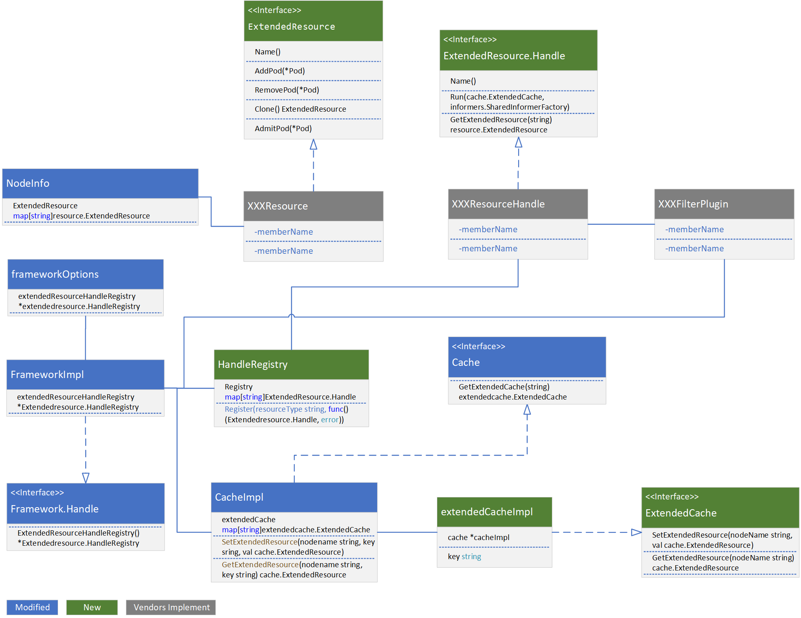
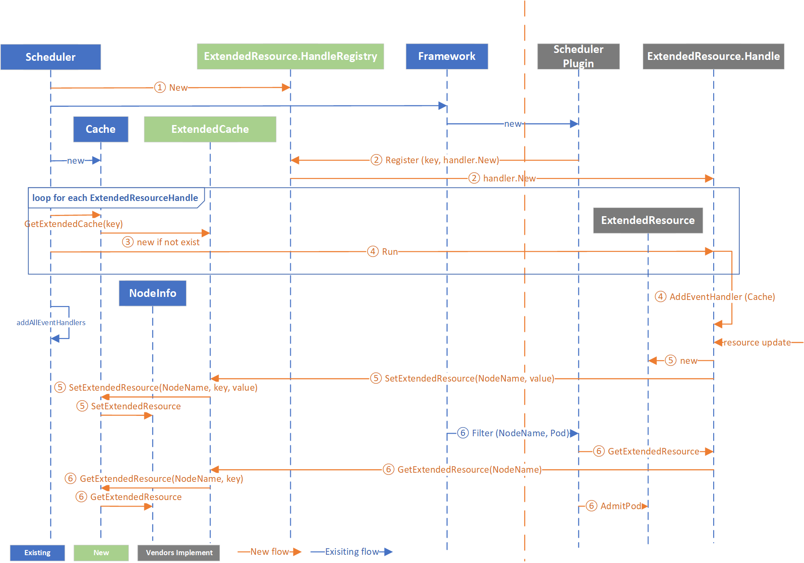

# KEP-4187: A Generic Scheduler Cache Extension for Scheduler Plugins

<!-- toc -->
- [Release Signoff Checklist](#release-signoff-checklist)
- [Summary](#summary)
- [Motivation](#motivation)
  - [Goals](#goals)
  - [Non-Goals](#non-goals)
- [Proposal](#proposal)
  - [User Stories](#user-stories)
    - [Disk IO Aware Scheduling](#disk-io-aware-scheduling)
    - [Resource Sharing Among Multiple Scheduler Plugins](#resource-sharing-among-multiple-scheduler-plugins)
  - [Risks and Mitigations](#risks-and-mitigations)
- [Design Details](#design-details)
  - [Data Structure and Interface](#data-structure-and-interface)
    - [New Interfaces](#new-interfaces)
    - [Modified Interfaces](#modified-interfaces)
    - [New Data Structures](#new-data-structures)
    - [Modified Data Structures](#modified-data-structures)
    - [Modified Functions](#modified-functions)
  - [An Example of a Scheduler Plugin using the Cache Extension](#an-example-of-a-scheduler-plugin-using-the-cache-extension)
    - [Example Implementation of an Extended Resource Handle](#example-implementation-of-an-extended-resource-handle)
    - [Example Implementation of a Scheduler Plugin](#example-implementation-of-a-scheduler-plugin)
  - [Test Plan](#test-plan)
      - [Unit tests](#unit-tests)
      - [Integration tests](#integration-tests)
      - [e2e tests](#e2e-tests)
  - [Graduation Criteria](#graduation-criteria)
  - [Upgrade / Downgrade Strategy](#upgrade--downgrade-strategy)
  - [Version Skew Strategy](#version-skew-strategy)
- [Production Readiness Review Questionnaire](#production-readiness-review-questionnaire)
  - [Feature Enablement and Rollback](#feature-enablement-and-rollback)
  - [Rollout, Upgrade and Rollback Planning](#rollout-upgrade-and-rollback-planning)
  - [Monitoring Requirements](#monitoring-requirements)
  - [Dependencies](#dependencies)
  - [Scalability](#scalability)
  - [Troubleshooting](#troubleshooting)
- [Implementation History](#implementation-history)
- [Drawbacks](#drawbacks)
- [Alternatives](#alternatives)
- [Infrastructure Needed (Optional)](#infrastructure-needed-optional)
<!-- /toc -->

## Release Signoff Checklist

Items marked with (R) are required *prior to targeting to a milestone / release*.

- [ ] (R) Enhancement issue in release milestone, which links to KEP dir in [kubernetes/enhancements] (not the initial KEP PR)
- [ ] (R) KEP approvers have approved the KEP status as `implementable`
- [ ] (R) Design details are appropriately documented
- [ ] (R) Test plan is in place, giving consideration to SIG Architecture and SIG Testing input (including test refactors)
  - [ ] e2e Tests for all Beta API Operations (endpoints)
  - [ ] (R) Ensure GA e2e tests meet requirements for [Conformance Tests](https://github.com/kubernetes/community/blob/master/contributors/devel/sig-architecture/conformance-tests.md) 
  - [ ] (R) Minimum Two Week Window for GA e2e tests to prove flake free
- [ ] (R) Graduation criteria is in place
  - [ ] (R) [all GA Endpoints](https://github.com/kubernetes/community/pull/1806) must be hit by [Conformance Tests](https://github.com/kubernetes/community/blob/master/contributors/devel/sig-architecture/conformance-tests.md) 
- [ ] (R) Production readiness review completed
- [ ] (R) Production readiness review approved
- [ ] "Implementation History" section is up-to-date for milestone
- [ ] User-facing documentation has been created in [kubernetes/website], for publication to [kubernetes.io]
- [ ] Supporting documentation—e.g., additional design documents, links to mailing list discussions/SIG meetings, relevant PRs/issues, release notes

## Summary

This proposal aims at extending the [scheduler cache](https://github.com/kubernetes/kubernetes/blob/v1.28.0/pkg/scheduler/internal/cache/cache.go#L57) for scheduler plugins that  handles extended resources.

The **core idea** behind the proposal provides more flexible interfaces/method that one or more scheduler plugins can implement to do customized management (e.g. accounting) of extended resources.

## Motivation

The goal of scheduling in Kubernetes is to make the best placement decision. The scheduler filters and scores node candidates based on resource requests, affinity rules and more. Kubernetes provides a plugin mechanism to support customized scheduling strategy. For scheduling first-class resources (such as CPU, RAM, ephemeral storage) and countable devices (such as GPU, FPGA which are supported through Kubernetes device plugin), the plugin manages the resources in the scheduler cache. For those resources involving more complicated specification and accounting model (e.g. [NodeResourceTopology](https://github.com/kubernetes-sigs/scheduler-plugins/blob/master/pkg/noderesourcetopology/README.md) scheduler plugin, [Trimaran](https://github.com/kubernetes-sigs/scheduler-plugins/blob/master/pkg/trimaran/README.md) plugin or disk IO scheduler plugin), each scheduler plugin usually caches and manages the allocable/consumed resources in its independent cache for customized accounting. These scheduler plugins also need to watch and handle Pod/Node events to update consumed resources. This leads to many duplicate code logic and implementation because all these scheduler plugins and the scheduler watch the same Pod/Node events. As each scheduler plugin’ cache and the scheduler cache are managed and updated independently without syncing, data version mismatch between the scheduler cache and the scheduler plugin’s cache could happen, which would lead to unexpected system behavior.

Moving the cache creation/management logic, list/watch mechanism, event handling flow as well common data structures to a centralized cache extension will simplify the scheduler plugin developer’s life and avoid data inconsistency issue.

### Goals

- Make the scheduler easier to be extended for complicated resource handling
- Simplify the scheduler plugin development

### Non-Goals

- Replace the device plugin mechanism
- Convert existing scheduler plugins to use the cache extension

## Proposal

The proposal is to extend the scheduler’s cache for scheduler plugins with customized extended resources. It introduces a generic extension to the scheduler cache to hold extended resources, which includes resource telemetry data gathered from the low-level metrics collectors. It also introduces new interfaces and methods to manage the life cycle of the extended resources, such as the resource creation, update, and deletion. It also defines user-friendly APIs for the scheduler plugin developers to describe resources and customize their counting methods.

### User Stories

#### Disk IO Aware Scheduling

There are emerging requirements to guarantee critical workloads’ disk IO performance. Current K8S scheduler only provides CPU/RAM and ephemeral storage aware scheduling, but it does not provide disk io resource scheduling. When we use existing scheduler framework to develop the disk IO aware scheduler plugin, we need to  create a separate cache in the scheduler plugin to save the disk IO related information such as available capacity and re-implement the pod/node events handling logic. Due to the independent event handling processes, different scheduling plugins (e.g. in-tree scheduling plugin and the customized out-of-tree scheduling plugin) may make the scheduling decision based on resource information snapshotted at different time points, which may result in unnecessary scheduling failure. For instance, right after pod1 is created on node1, pod1 is deleted. Suppose that the in-tree NodeResourcesFit plugin gets the deletion notification at time t1 and the out-of-tree disk io plugin gets the deletion notification at time t2. It could happen that the two scheduler plugins make their scheduling decision at a time point between t1 and t2. In this case, the resource availability information based on which the two scheduler plugins make their decisions would diverge, which may result in scheduling failure or unnecessary pod preemption. With the cache extension, the first-class resource used by NodeResourcesFit plugin and the io resource used by disk io plugin are updated through one event notification and there will be no divergence of resource information. This reduces the probability of pod rescheduling or preemption.

#### Resource Sharing Among Multiple Scheduler Plugins

In existing k8s, the first-class resources are saved in the scheduler cache. Therefore the k8s in-tree scheduler plugins and the out-of-tree scheduler plugins can both access those resources. If we create an extension of the scheduler cache, then those vendor-specific resources saved in the cache extension can also be shared by multiple out-of-tree scheduler plugins.

### Risks and Mitigations

## Design Details

### Data Structure and Interface

The class diagram below describes the new data structures, modification of the existing data structures, and the new interfaces including **their attributes, operations (or methods), and the relationships** among them. 


#### New Interfaces

- The ExtendedResource interface has been defined to manage the resource capacity/attributes, customize resource calculation model. The AddPod, RemovePod methods are invoked when a Pod is created on a node or removed from a node.  The AdmitPod method is invoked when a plugin checks whether the resource fits for a pod during the filtering stage. Scheduler plugin developers should implement this interface (e.g. XXXResource) to customize their extended resource availability calculation and check of resource fit for a new pod .

- The ExtendedCache interface has been defined to set and get the ExtendedResource in the cache extension by node name.  

- The ExtendedResource.Handle is in charge of managing resource changes and updating changes to ExtendedResource.  The Run method is called soon after the scheduler plugin is initialized. The GetExtendedResource method returns the corresponding ExtendedResource by node name. The scheduler plugin developers should implement this interface (e.g., XXXResourceHandle) to customize the update methods of resources’ available capacity.

#### Modified Interfaces

- framework Handle has been extended to return the ExtendedResource.Handle Registry for scheduler plugins to register handles.

- The Cache interface has been extended to include the ability to retrieve extended cache by resource type. After the resource handle is registered, the extended cache of that resource is added to CacheImpl.

#### New Data Structures

- extendedCacheImpl has two fields, the "cacheImpl" field holds the implementation function for the cache interface, and the "key" field holds the resource type.  extendedCacheImpl implements the ExtendedCache.

- HandleRegistry is a collection of ExtendedResource.Handles which consists of a Registry and a Register method. The key of the Registry is the resource type and the value of the Registry is the corresponding ExtendedResource.Handle to the resource type. The Register method is invoked when a new ExtendedResource.Handle is registered in the Handle registry.

#### Modified Data Structures

- A collection of ExtendedResources, where the key is the resource type, has been added as a new ExtendedResource field to the NodeInfo struct.

- frameworkImpl has been extended to return the ExtendedResource.Handle Registry for the scheduler plugins to register ExtendedResource.Handle.

- CacheImpl has been extended to manage a collection of ExtendedCaches which keeps track of the all the registered extendedCacheImpl instances (extendedCacheImpl implements the ExtendedCache interface which encapsulates the cacheImpl and a resource type).

- frameworkOptions has been extended to include the HandleRegistry which would be passed to frameworkImpl to register the ExtendedResource.Handle.

#### Modified Functions

- The update and Clone methods of NodeInfo structs has been extended to include the extended resources.

- Scheduler has been modified to initialize the ExtendedResource’s HandleRegistry and pass the registry to frameworks, set ExtendedCache in CacheImpl and invoke the Run method of each registered handle.

```go
// New returns a Scheduler

func New(client clientset.Interface, … opts ...Option) (*Scheduler, error) {
…
     // Initialize the Handle registry
+    extendedResourceHandleRegistry := extendedhandleregistry.New()

    profiles, err := profile.NewMap(options.profiles, registry, recorderFactory, stopCh,
        …
        
     // Pass the Handle registry as a framework option to frameworkImpl
+    frameworkruntime.WithExtendedResourceHandleRegistry(extendedResourceHandleRegistry),
    )
    …
    
    schedulerCache := internalcache.New(durationToExpireAssumedPod, stopEverything)

+    // iterate all handles in the extended resource registry and run the handle
+    for key, handle := range extendedResourceHandleRegistry.Registry {
+        handle.Run(schedulerCache.GetExtendedCache(key), +informerFactory)
+    }
    …
}
```

The diagram below illustrates the interaction between a new scheduler plugin and the cache extension.
- ① A ExtendedResource.HandleRegistry is instantiated when a scheduler instance is created
- ② During the framework initialization, each scheduler plugin is instantiated, and the ExtendedResource.Handle is registered and instantiated in the HandleRegistry
- ③ The scheduler creates an extendedCacheImpl object which implements ExtendedCache for each ExtendedResource.Handle if it does not exist
- ④ The scheduler runs all the ExtendedResource.Handle to initialize the Handle
- ⑤ ExtendedResource Handle creates the Extendedresource and updates the allocable resource in the cache extension through the ExtendedCache interface
- ⑥ Leveraging ExtendedResource.Handle,the scheduler plugin makes scheduling decisions based on the cached resource retrieved through the ExtendedCache interface during the scheduling cycle




### An Example of a Scheduler Plugin using the Cache Extension

#### Example Implementation of an Extended Resource Handle

- Implement the ExtendedResource interface to customize the resource's aggregation methods. In the code snippet below, a FakeExtendedResource is defined which could be increased or decreased in the AddPod and RemovePod functions.
```go
// FakeExtendedResource implements the ExtendedResource
type FakeExtendedResource struct {
    availableCapacity int64
}

// Aggregate the resource
func (pc *FakeExtendedResource) AddPod(pod *v1.Pod) error {
    req := ParsePodRequest(pod)
    if req <= 0 {
        return err
    }

    pc. availableCapacity -= mapRequest(req) // the mapRequest function maps the req to the estimated to-be-used FakeExtendedResource
    return nil
}

// remove the resource consumed by the pod
func (pc *FakeExtendedResource) RemovePod(pod *v1.Pod) error {
    req := ParsePodRequest(pod)
    if req <= 0 {
        return err
    }

    pc. availableCapacity += mapRequest(req)
    return nil
}
```

- Implement the ExtendedResource.Handle which is used to keep the resource's allocable resource update-to-date. Custom Resource(CR) is one of the methods to update the resource allocable resource by a third-party agent or a system admin. And the Handle watches the resource changes and updates the extended resource accordingly. The example uses a self-defined CR, and the CR includes two fields: nodeName and fakeResource. The fakeResource stands for the actual allocable fake resource and nodeName stands for the name of the specific node. 
``` go
type Handle struct {
    cache cache.ExtendedCache
}

func (fh *Handle) Run(c cache.ExtendedCache, f informers.SharedInformerFactory) error {

    fh.cache = c
    client, err := versioned.NewForConfig(config)
    fakeResourceInformerFactory := externalin.NewSharedInformerFactory(client, 0)

    nodeInformer := fakeResourceInformerFactory.Ioi().V1().NodeFakeResourceStatuses().Informer()

    nodeInformer.AddEventHandler(clientcache.ResourceEventHandler{
        Handler: clientcache.ResourceEventHandlerFuncs{
            AddFunc:    fh.addResource,
            UpdateFunc: fh.updateResource,
            DeleteFunc: fh.deleteResource,
        },
    })
}

func (fh *Handle) updateResource(oldObj, newObj interface{}) {
    …
    oldVal := old.Spec.FakeResource
    newVal := new.Spec.FakeResource

    if oldVal != newVal {
        res := fh.cache.GetExtendedResource(new.Spec.NodeName)
        res.(*FakeExtendedResource).SetAvail(newVal)
        fh.cache.SetExtendedResource(new.Spec.NodeName, res)
    }
}
```

#### Example Implementation of a Scheduler Plugin

A scheduler plugin is to be implemented to initialize the extended resource handles, register them in the registry and fetch the extended resources through the handles at these hook points.
``` go
// New initializes a new plugin and returns it.
func New(_ runtime.Object, h framework.Handle) (framework.Plugin, error) {
    // initialize the extended resource handles and register them in the registry
   extendedResourceHandle, err := h.ExtendedResourceHandleRegistry().Register(ResourceType, func() (extendedresource.Handle, error) {
        return &FakeResourceHandle{}, nil
    })

   plugin := &FakePlugin{
        erh: []extendedresource.Handle{extendedResourceHandle},
    }
    return plugin, nil
}
```

At the filter hook point, the extended resource is retrieved through the extended resource handle that was created during the initialization phase.

```go
type FakePlugin struct {
    erh []extendedresource.Handle
}

func (fp *FakePlugin) Filter(ctx context.Context, cycleState *framework.CycleState, pod *v1.Pod, nodeInfo *framework.NodeInfo) *framework.Status {
    req := ParsePodRequest(pod)
    …

    nodeName := nodeInfo.Node().Name
    resource := fp.erh[0].GetExtendedResource(nodeName)
    req, avail := resource.AdmitPod(pod)
    if req > avail {
        return framework.NewStatus(framework.Unschedulable, …)
    }
    return framework.NewStatus(framework.Success)
}
```

### Test Plan

[ ] I/we understand the owners of the involved components may require updates to
existing tests to make this code solid enough prior to committing the changes necessary
to implement this enhancement.
##### Unit tests

Unit tests will cover the sanity check of code changes that implements the feature.

##### Integration tests

##### e2e tests

End-to-end testing depends on a scheduler plugin which implements the ExtendedResource interface, the ExtendedResource.Handle interface (e.g, the FakeResource in the example), and an IO driver which updates the extended resource’s available capacity at runtime.

To make it simple, a CR could be used to track the resource’s available capacity. The IO driver would be simulated by updating the CR’s available capacity. The available capacities in the cache extension could be logged at runtime and be checked against the capacities in CR. New pods with resource request annotations could be created to test the interactions between the scheduler plugin and the cache extension.

### Graduation Criteria

<!--
**Note:** *Not required until targeted at a release.*

Define graduation milestones.

These may be defined in terms of API maturity, [feature gate] graduations, or as
something else. The KEP should keep this high-level with a focus on what
signals will be looked at to determine graduation.

Consider the following in developing the graduation criteria for this enhancement:
- [Maturity levels (`alpha`, `beta`, `stable`)][maturity-levels]
- [Feature gate][feature gate] lifecycle
- [Deprecation policy][deprecation-policy]

Clearly define what graduation means by either linking to the [API doc
definition](https://kubernetes.io/docs/concepts/overview/kubernetes-api/#api-versioning)
or by redefining what graduation means.

In general we try to use the same stages (alpha, beta, GA), regardless of how the
functionality is accessed.

[feature gate]: https://git.k8s.io/community/contributors/devel/sig-architecture/feature-gates.md
[maturity-levels]: https://git.k8s.io/community/contributors/devel/sig-architecture/api_changes.md#alpha-beta-and-stable-versions
[deprecation-policy]: https://kubernetes.io/docs/reference/using-api/deprecation-policy/

Below are some examples to consider, in addition to the aforementioned [maturity levels][maturity-levels].

#### Alpha

- Feature implemented behind a feature flag
- Initial e2e tests completed and enabled

#### Beta

- Gather feedback from developers and surveys
- Complete features A, B, C
- Additional tests are in Testgrid and linked in KEP

#### GA

- N examples of real-world usage
- N installs
- More rigorous forms of testing—e.g., downgrade tests and scalability tests
- Allowing time for feedback

**Note:** Generally we also wait at least two releases between beta and
GA/stable, because there's no opportunity for user feedback, or even bug reports,
in back-to-back releases.

**For non-optional features moving to GA, the graduation criteria must include
[conformance tests].**

[conformance tests]: https://git.k8s.io/community/contributors/devel/sig-architecture/conformance-tests.md

#### Deprecation

- Announce deprecation and support policy of the existing flag
- Two versions passed since introducing the functionality that deprecates the flag (to address version skew)
- Address feedback on usage/changed behavior, provided on GitHub issues
- Deprecate the flag
-->

### Upgrade / Downgrade Strategy

<!--
If applicable, how will the component be upgraded and downgraded? Make sure
this is in the test plan.

Consider the following in developing an upgrade/downgrade strategy for this
enhancement:
- What changes (in invocations, configurations, API use, etc.) is an existing
  cluster required to make on upgrade, in order to maintain previous behavior?
- What changes (in invocations, configurations, API use, etc.) is an existing
  cluster required to make on upgrade, in order to make use of the enhancement?
-->

### Version Skew Strategy

<!--
If applicable, how will the component handle version skew with other
components? What are the guarantees? Make sure this is in the test plan.

Consider the following in developing a version skew strategy for this
enhancement:
- Does this enhancement involve coordinating behavior in the control plane and nodes?
- How does an n-3 kubelet or kube-proxy without this feature available behave when this feature is used?
- How does an n-1 kube-controller-manager or kube-scheduler without this feature available behave when this feature is used?
- Will any other components on the node change? For example, changes to CSI,
  CRI or CNI may require updating that component before the kubelet.
-->

## Production Readiness Review Questionnaire

<!--

Production readiness reviews are intended to ensure that features merging into
Kubernetes are observable, scalable and supportable; can be safely operated in
production environments, and can be disabled or rolled back in the event they
cause increased failures in production. See more in the PRR KEP at
https://git.k8s.io/enhancements/keps/sig-architecture/1194-prod-readiness.

The production readiness review questionnaire must be completed and approved
for the KEP to move to `implementable` status and be included in the release.

In some cases, the questions below should also have answers in `kep.yaml`. This
is to enable automation to verify the presence of the review, and to reduce review
burden and latency.

The KEP must have a approver from the
[`prod-readiness-approvers`](http://git.k8s.io/enhancements/OWNERS_ALIASES)
team. Please reach out on the
[#prod-readiness](https://kubernetes.slack.com/archives/CPNHUMN74) channel if
you need any help or guidance.
-->

### Feature Enablement and Rollback

<!--
This section must be completed when targeting alpha to a release.
-->

###### How can this feature be enabled / disabled in a live cluster?

<!--
Pick one of these and delete the rest.

Documentation is available on [feature gate lifecycle] and expectations, as
well as the [existing list] of feature gates.

[feature gate lifecycle]: https://git.k8s.io/community/contributors/devel/sig-architecture/feature-gates.md
[existing list]: https://kubernetes.io/docs/reference/command-line-tools-reference/feature-gates/
-->

- [ ] Feature gate (also fill in values in `kep.yaml`)
  - Feature gate name:
  - Components depending on the feature gate:
- [ ] Other
  - Describe the mechanism:
  - Will enabling / disabling the feature require downtime of the control
    plane?
  - Will enabling / disabling the feature require downtime or reprovisioning
    of a node?

###### Does enabling the feature change any default behavior?

<!--
Any change of default behavior may be surprising to users or break existing
automations, so be extremely careful here.
-->

###### Can the feature be disabled once it has been enabled (i.e. can we roll back the enablement)?

<!--
Describe the consequences on existing workloads (e.g., if this is a runtime
feature, can it break the existing applications?).

Feature gates are typically disabled by setting the flag to `false` and
restarting the component. No other changes should be necessary to disable the
feature.

NOTE: Also set `disable-supported` to `true` or `false` in `kep.yaml`.
-->

###### What happens if we reenable the feature if it was previously rolled back?

###### Are there any tests for feature enablement/disablement?

<!--
The e2e framework does not currently support enabling or disabling feature
gates. However, unit tests in each component dealing with managing data, created
with and without the feature, are necessary. At the very least, think about
conversion tests if API types are being modified.

Additionally, for features that are introducing a new API field, unit tests that
are exercising the `switch` of feature gate itself (what happens if I disable a
feature gate after having objects written with the new field) are also critical.
You can take a look at one potential example of such test in:
https://github.com/kubernetes/kubernetes/pull/97058/files#diff-7826f7adbc1996a05ab52e3f5f02429e94b68ce6bce0dc534d1be636154fded3R246-R282
-->

### Rollout, Upgrade and Rollback Planning

<!--
This section must be completed when targeting beta to a release.
-->

###### How can a rollout or rollback fail? Can it impact already running workloads?

<!--
Try to be as paranoid as possible - e.g., what if some components will restart
mid-rollout?

Be sure to consider highly-available clusters, where, for example,
feature flags will be enabled on some API servers and not others during the
rollout. Similarly, consider large clusters and how enablement/disablement
will rollout across nodes.
-->

###### What specific metrics should inform a rollback?

<!--
What signals should users be paying attention to when the feature is young
that might indicate a serious problem?
-->

###### Were upgrade and rollback tested? Was the upgrade->downgrade->upgrade path tested?

<!--
Describe manual testing that was done and the outcomes.
Longer term, we may want to require automated upgrade/rollback tests, but we
are missing a bunch of machinery and tooling and can't do that now.
-->

###### Is the rollout accompanied by any deprecations and/or removals of features, APIs, fields of API types, flags, etc.?

<!--
Even if applying deprecation policies, they may still surprise some users.
-->

### Monitoring Requirements

<!--
This section must be completed when targeting beta to a release.

For GA, this section is required: approvers should be able to confirm the
previous answers based on experience in the field.
-->

###### How can an operator determine if the feature is in use by workloads?

<!--
Ideally, this should be a metric. Operations against the Kubernetes API (e.g.,
checking if there are objects with field X set) may be a last resort. Avoid
logs or events for this purpose.
-->

###### How can someone using this feature know that it is working for their instance?

<!--
For instance, if this is a pod-related feature, it should be possible to determine if the feature is functioning properly
for each individual pod.
Pick one more of these and delete the rest.
Please describe all items visible to end users below with sufficient detail so that they can verify correct enablement
and operation of this feature.
Recall that end users cannot usually observe component logs or access metrics.
-->

- [ ] Events
  - Event Reason: 
- [ ] API .status
  - Condition name: 
  - Other field: 
- [ ] Other (treat as last resort)
  - Details:

###### What are the reasonable SLOs (Service Level Objectives) for the enhancement?

<!--
This is your opportunity to define what "normal" quality of service looks like
for a feature.

It's impossible to provide comprehensive guidance, but at the very
high level (needs more precise definitions) those may be things like:
  - per-day percentage of API calls finishing with 5XX errors <= 1%
  - 99% percentile over day of absolute value from (job creation time minus expected
    job creation time) for cron job <= 10%
  - 99.9% of /health requests per day finish with 200 code

These goals will help you determine what you need to measure (SLIs) in the next
question.
-->

###### What are the SLIs (Service Level Indicators) an operator can use to determine the health of the service?

<!--
Pick one more of these and delete the rest.
-->

- [ ] Metrics
  - Metric name:
  - [Optional] Aggregation method:
  - Components exposing the metric:
- [ ] Other (treat as last resort)
  - Details:

###### Are there any missing metrics that would be useful to have to improve observability of this feature?

<!--
Describe the metrics themselves and the reasons why they weren't added (e.g., cost,
implementation difficulties, etc.).
-->

### Dependencies

<!--
This section must be completed when targeting beta to a release.
-->

###### Does this feature depend on any specific services running in the cluster?

<!--
Think about both cluster-level services (e.g. metrics-server) as well
as node-level agents (e.g. specific version of CRI). Focus on external or
optional services that are needed. For example, if this feature depends on
a cloud provider API, or upon an external software-defined storage or network
control plane.

For each of these, fill in the following—thinking about running existing user workloads
and creating new ones, as well as about cluster-level services (e.g. DNS):
  - [Dependency name]
    - Usage description:
      - Impact of its outage on the feature:
      - Impact of its degraded performance or high-error rates on the feature:
-->

### Scalability

<!--
For alpha, this section is encouraged: reviewers should consider these questions
and attempt to answer them.

For beta, this section is required: reviewers must answer these questions.

For GA, this section is required: approvers should be able to confirm the
previous answers based on experience in the field.
-->

###### Will enabling / using this feature result in any new API calls?

<!--
Describe them, providing:
  - API call type (e.g. PATCH pods)
  - estimated throughput
  - originating component(s) (e.g. Kubelet, Feature-X-controller)
Focusing mostly on:
  - components listing and/or watching resources they didn't before
  - API calls that may be triggered by changes of some Kubernetes resources
    (e.g. update of object X triggers new updates of object Y)
  - periodic API calls to reconcile state (e.g. periodic fetching state,
    heartbeats, leader election, etc.)
-->

###### Will enabling / using this feature result in introducing new API types?

<!--
Describe them, providing:
  - API type
  - Supported number of objects per cluster
  - Supported number of objects per namespace (for namespace-scoped objects)
-->

###### Will enabling / using this feature result in any new calls to the cloud provider?

<!--
Describe them, providing:
  - Which API(s):
  - Estimated increase:
-->

###### Will enabling / using this feature result in increasing size or count of the existing API objects?

<!--
Describe them, providing:
  - API type(s):
  - Estimated increase in size: (e.g., new annotation of size 32B)
  - Estimated amount of new objects: (e.g., new Object X for every existing Pod)
-->

###### Will enabling / using this feature result in increasing time taken by any operations covered by existing SLIs/SLOs?

<!--
Look at the [existing SLIs/SLOs].

Think about adding additional work or introducing new steps in between
(e.g. need to do X to start a container), etc. Please describe the details.

[existing SLIs/SLOs]: https://git.k8s.io/community/sig-scalability/slos/slos.md#kubernetes-slisslos
-->

###### Will enabling / using this feature result in non-negligible increase of resource usage (CPU, RAM, disk, IO, ...) in any components?

<!--
Things to keep in mind include: additional in-memory state, additional
non-trivial computations, excessive access to disks (including increased log
volume), significant amount of data sent and/or received over network, etc.
This through this both in small and large cases, again with respect to the
[supported limits].

[supported limits]: https://git.k8s.io/community//sig-scalability/configs-and-limits/thresholds.md
-->

###### Can enabling / using this feature result in resource exhaustion of some node resources (PIDs, sockets, inodes, etc.)?

<!--
Focus not just on happy cases, but primarily on more pathological cases
(e.g. probes taking a minute instead of milliseconds, failed pods consuming resources, etc.).
If any of the resources can be exhausted, how this is mitigated with the existing limits
(e.g. pods per node) or new limits added by this KEP?

Are there any tests that were run/should be run to understand performance characteristics better
and validate the declared limits?
-->

### Troubleshooting

<!--
This section must be completed when targeting beta to a release.

For GA, this section is required: approvers should be able to confirm the
previous answers based on experience in the field.

The Troubleshooting section currently serves the `Playbook` role. We may consider
splitting it into a dedicated `Playbook` document (potentially with some monitoring
details). For now, we leave it here.
-->

###### How does this feature react if the API server and/or etcd is unavailable?

###### What are other known failure modes?

<!--
For each of them, fill in the following information by copying the below template:
  - [Failure mode brief description]
    - Detection: How can it be detected via metrics? Stated another way:
      how can an operator troubleshoot without logging into a master or worker node?
    - Mitigations: What can be done to stop the bleeding, especially for already
      running user workloads?
    - Diagnostics: What are the useful log messages and their required logging
      levels that could help debug the issue?
      Not required until feature graduated to beta.
    - Testing: Are there any tests for failure mode? If not, describe why.
-->

###### What steps should be taken if SLOs are not being met to determine the problem?

## Implementation History

<!--
Major milestones in the lifecycle of a KEP should be tracked in this section.
Major milestones might include:
- the `Summary` and `Motivation` sections being merged, signaling SIG acceptance
- the `Proposal` section being merged, signaling agreement on a proposed design
- the date implementation started
- the first Kubernetes release where an initial version of the KEP was available
- the version of Kubernetes where the KEP graduated to general availability
- when the KEP was retired or superseded
-->

## Drawbacks

<!--
Why should this KEP _not_ be implemented?
-->

## Alternatives

<!--
What other approaches did you consider, and why did you rule them out? These do
not need to be as detailed as the proposal, but should include enough
information to express the idea and why it was not acceptable.
-->

## Infrastructure Needed (Optional)

<!--
Use this section if you need things from the project/SIG. Examples include a
new subproject, repos requested, or GitHub details. Listing these here allows a
SIG to get the process for these resources started right away.
-->