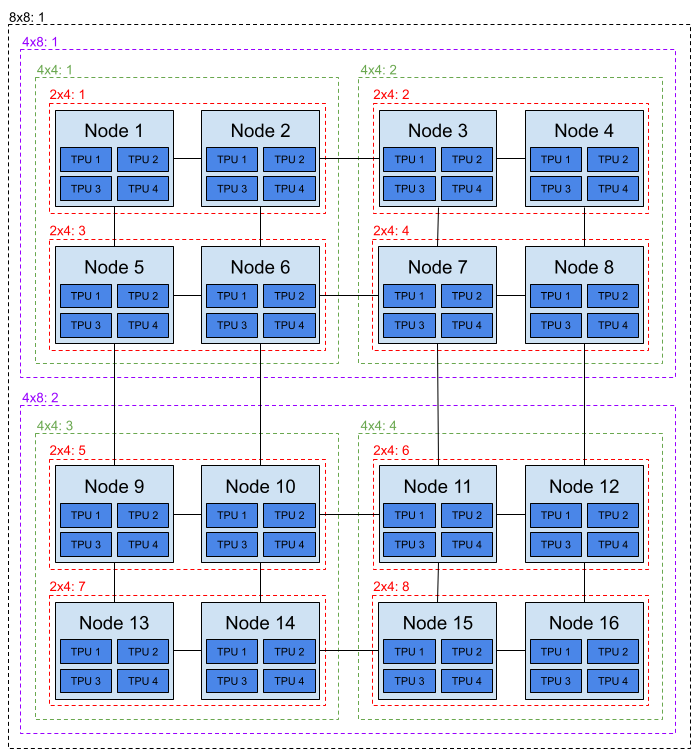

# [KEP-4815](https://github.com/kubernetes/enhancements/issues/4815): DRA: Add support for partitionable devices

<!-- toc -->
- [Release Signoff Checklist](#release-signoff-checklist)
- [Summary](#summary)
- [Motivation](#motivation)
  - [Dynamic allocation of Multi-Instance GPUs (MIG) on NVIDIA hardware](#dynamic-allocation-of-multi-instance-gpus-mig-on-nvidia-hardware)
  - [Multi-host Tensor Processing Unit (TPU) scheduling](#multi-host-tensor-processing-unit-tpu-scheduling)
  - [Goals](#goals)
  - [Non-Goals](#non-goals)
- [Proposal](#proposal)
  - [Risks and Mitigations](#risks-and-mitigations)
    - [Partial scheduling of pods for multi-host devices](#partial-scheduling-of-pods-for-multi-host-devices)
    - [Validation moved from admission to runtime](#validation-moved-from-admission-to-runtime)
- [Design Details](#design-details)
  - [Limits](#limits)
  - [Validation](#validation)
    - [Future options](#future-options)
  - [Defining device partitions in terms of consumed capacity in a device](#defining-device-partitions-in-terms-of-consumed-capacity-in-a-device)
  - [Defining multi-host devices](#defining-multi-host-devices)
    - [Multi-host scheduling limitations](#multi-host-scheduling-limitations)
  - [Putting it all together for the MIG use-case](#putting-it-all-together-for-the-mig-use-case)
  - [Using DRA for the multi-host use-case](#using-dra-for-the-multi-host-use-case)
  - [Test Plan](#test-plan)
      - [Prerequisite testing updates](#prerequisite-testing-updates)
      - [Unit tests](#unit-tests)
      - [Integration tests](#integration-tests)
      - [e2e tests](#e2e-tests)
  - [Graduation Criteria](#graduation-criteria)
    - [Alpha](#alpha)
    - [Beta](#beta)
    - [GA](#ga)
  - [Upgrade / Downgrade Strategy](#upgrade--downgrade-strategy)
  - [Version Skew Strategy](#version-skew-strategy)
- [Production Readiness Review Questionnaire](#production-readiness-review-questionnaire)
  - [Feature Enablement and Rollback](#feature-enablement-and-rollback)
  - [Rollout, Upgrade and Rollback Planning](#rollout-upgrade-and-rollback-planning)
  - [Monitoring Requirements](#monitoring-requirements)
  - [Dependencies](#dependencies)
  - [Scalability](#scalability)
  - [Troubleshooting](#troubleshooting)
- [Implementation History](#implementation-history)
- [Drawbacks](#drawbacks)
- [Alternatives](#alternatives)
<!-- /toc -->

## Release Signoff Checklist

Items marked with (R) are required *prior to targeting to a milestone / release*.

- [x] (R) Enhancement issue in release milestone, which links to KEP dir in [kubernetes/enhancements] (not the initial KEP PR)
- [x] (R) KEP approvers have approved the KEP status as `implementable`
- [x] (R) Design details are appropriately documented
- [ ] (R) Test plan is in place, giving consideration to SIG Architecture and SIG Testing input (including test refactors)
  - [ ] e2e Tests for all Beta API Operations (endpoints)
  - [ ] (R) Ensure GA e2e tests meet requirements for [Conformance Tests](https://github.com/kubernetes/community/blob/master/contributors/devel/sig-architecture/conformance-tests.md) 
  - [ ] (R) Minimum Two Week Window for GA e2e tests to prove flake free
- [ ] (R) Graduation criteria is in place
  - [ ] (R) [all GA Endpoints](https://github.com/kubernetes/community/pull/1806) must be hit by [Conformance Tests](https://github.com/kubernetes/community/blob/master/contributors/devel/sig-architecture/conformance-tests.md) 
- [x] (R) Production readiness review completed
- [x] (R) Production readiness review approved
- [x] "Implementation History" section is up-to-date for milestone
- [ ] User-facing documentation has been created in [kubernetes/website], for publication to [kubernetes.io]
- [ ] Supporting documentation—e.g., additional design documents, links to mailing list discussions/SIG meetings, relevant PRs/issues, release notes

<!--
**Note:** This checklist is iterative and should be reviewed and updated every time this enhancement is being considered for a milestone.
-->

[kubernetes.io]: https://kubernetes.io/
[kubernetes/enhancements]: https://git.k8s.io/enhancements
[kubernetes/kubernetes]: https://git.k8s.io/kubernetes
[kubernetes/website]: https://git.k8s.io/website

## Summary

One of the original use-cases for Dynamic Resource Allocation (DRA) was the
ability to dynamically allocate partitions of a full device (in addition to
the full device itself). Whereas the traditional device plugin API forces users
to statically partition devices ahead of time, DRA was designed to allow those
partitions to be created on demand. This leads to increased resource
utilization as the size of each partitioned device can be matched in real-time
to the workload requesting it.

Devices represented in DRA don't necessarily have to be a single unit connected
to a single machine, but can also be a logical device comprised of multiple
devices connected to multiple machines. Similar to the single device partitioning,
users might require either the full multi-host device or a subset.

As DRA has evolved from what we now call "classic" DRA to "structured
parameters" this ability to dynamically partition devices has been lost.
This KEP proposes a method to bring this capability back within the framework
that "structured parameters" provides. Additionally, it provides primitives to
represent both full devices and their partitions in a more compact way than is
possible today.

Note that the extensions proposed in this KEP are completely transparent to the
end-user. In 1.31, it is already possible to select a device partition via a
`ResourceClaim`, so long as the device vendor has pre-partitioned its devices
and advertised them as such inside  a `ResourceSlice`. The user-facing
mechanism to select these devices doesn't change with the extensions proposed
in this KEP. Instead, the proposed extensions provide the ability for a vendor
to advertise "overlapping" partitions, such that the scheduler will never
allocate conflicting ones at the same time. This, in turn, gives the vendor the
opportunity to dynamically create these partitions *after* they have been
allocated, rather than requiring them to be created before.

## Motivation

We have several motivating examples for supporting partitionable devices with
DRA, with the first two described in detail in this document. Additional details
of the other use-cases can be found
[here](https://docs.google.com/document/d/1lXGfnrBixRIMW9ESa-mv09Kisb2myVFV_A3nqPJ4FCQ/edit?usp=sharing).

* Partitioning a single GPU into smaller partitions.
* Multi-host scheduling of interconnected TPUs.
* SR-IOV
* Multi-host logical groupings to avoid deadlocks in LeaderWorkSet scheduling
* Single-host allocations of multiple TPUs in valid topologies
* Single-host allocations of multiple Inferentia and Trainium device in valid topologies

### Dynamic allocation of Multi-Instance GPUs (MIG) on NVIDIA hardware

MIG devices are represented as fixed-size partitions
of a full GPU that consume a portion of its capacity across multiple
dimensions. These dimensions include things like number of JPEG engines, number
of multiprocessors, and the allocation of a specific set of fixed-size memory
slices.

In general, the exact capacity needed to instantiate a given MIG device is
defined by its MIG "profile". Multiple instances of a MIG profile can be
instantiated into concrete MIG devices if and only if enough resources are
available to accommodate it.

For example, the following table shows all of the MIG profiles available on an
NVIDIA A100 40GB GPU:

| Profile Name | Memory Size | Memory Slices | Multiprocessors | Copy Engines | Decoders | Encoders | JPEG Engines | OFA Engines |
|--------------|-------------|---------------|-----------------|--------------|----------|----------|--------------|-------------|
|   7g.40gb    |   40192Mi   |       8       |       98        |      7       |    5     |    0     |      1       |      1      |
|   4g.20gb    |   19968Mi   |       4       |       56        |      4       |    2     |    0     |      0       |      0      |
|   3g.20gb    |   19968Mi   |       4       |       42        |      3       |    2     |    0     |      0       |      0      |
|   2g.10gb    |    9856Mi   |       2       |       28        |      2       |    1     |    0     |      0       |      0      |
|   1g.10gb    |    9856Mi   |       2       |       14        |      1       |    1     |    0     |      0       |      0      |
|  1g.5gb+me   |    4864Mi   |       1       |       14        |      1       |    1     |    0     |      1       |      1      |
|   1g.5gb     |    4864Mi   |       1       |       14        |      1       |    0     |    0     |      0       |      0      |

Zooming in on a single dimension (memory slices), the following diagram shows
the physical layout where multiple instances of each profile "could" be
instantiated (so long as enough resources are available to accommodate them).
Only those instances which do not overlap vertically can be allocated
simultaneously (because otherwise they would consume the same physical memory
slice). The X in some of the columns denotes slots where a particular profile
*could* fit in terms of consuming memory slices, but there are not enough of
the other required resources for that profile available to accommodate it.

```
+------------+------------+------------+------------+------------+------------+------------+------------+
| MemSlice 0 | MemSlice 1 | MemSlice 2 | MemSlice 3 | MemSlice 4 | Memslice 5 | MemSlice 6 | MemSlice 7 |
+------------+------------+------------+------------+------------+------------+------------+------------+
|                                                 7g.40gb                                               |
+------------+------------+------------+------------+------------+------------+------------+------------+
|                       4g.20gb                     |                         X                         |
+------------+------------+------------+------------+------------+------------+------------+------------+
|                       3g.20gb                     |                       3g.20gb                     |
+------------+------------+------------+------------+------------+------------+------------+------------+
|          2g.10gb        |          2g.10gb        |          2g.10gb        |            X            |
+------------+------------+------------+------------+------------+------------+------------+------------+
|          1g.10gb        |          1g.10gb        |          1g.10gb        |          1g.10gb        |
+------------+------------+------------+------------+------------+------------+------------+------------+
|   1g.5gb   |   1g.5gb   |   1g.5gb   |   1g.5gb   |   1g.5gb   |   1g.5gb   |   1g.5gb   |     X      |
+------------+------------+------------+------------+------------+------------+------------+------------+
| 1g.5gb+me  | 1g.5gb+me  | 1g.5gb+me  | 1g.5gb+me  | 1g.5gb+me  | 1g.5gb+me  | 1g.5gb+me  |     X      |
+------------+------------+------------+------------+------------+------------+------------+------------+
```

The most important thing to note from all of this is that partitioning a GPU
into a set of MIG devices is not as simple as slicing it up into a set of
fixed-size, non-overlapping partitions. Instead, one can think of a GPU as a
"bag" of resources that can be pulled together in a discrete set of ways to
construct a MIG device with a particular profile. When instatiating a MIG
device with a particular profile, the set of resources available to other MIG
devices (or the full GPU itself) gets depleted.

In other words, the allocation of one MIG device may nullify the
ability to allocate some subset of other possible MIG devices (but not all of
them). A MIG device is considered allocatable so long as the full GPU has
enough *unallocated* capacity to satisfy its capacity constraints across all
dimensions. If any single dimension is unavailable, that MIG device cannot be
allocated (but others might still be able to).

For example, the following `ResourceClaim` can be used to select a set of
non-overlapping MIG devices from a specific GPU.
```yaml
apiVersion: resource.k8s.io/v1
kind: ResourceClaim
metadata:
  name: mig-devices
spec:
  spec:
    devices:
      requests:
      - name: mig-1g-5gb-0
        exactly:
          deviceClassName: mig.nvidia.com
          selectors:
          - cel:
              expression: "device.attributes['gpu.nvidia.com'].profile == '1g.5gb'"
      - name: mig-1g-5gb-1
        exactly:
          deviceClassName: mig.nvidia.com
          selectors:
          - cel:
              expression: "device.attributes['gpu.nvidia.com'].profile == '1g.5gb'"
      - name: mig-2g-10gb
        exactly:
          deviceClassName: mig.nvidia.com
          selectors:
          - cel:
              expression: "device.attributes['gpu.nvidia.com'].profile == '2g.10gb'"
      - name: mig-3g-20gb
        exactly:
          deviceClassName: mig.nvidia.com
          selectors:
          - cel:
              expression: "device.attributes['gpu.nvidia.com'].profile == '3g.20gb'"
      constraints:
      - requests: []
        matchAttribute: "gpu.nvidia.com/parentUUID"
```

This would result in the following set of non-overlapping partitions:
```
+------------+------------+------------+------------+------------+------------+------------+------------+
| MemSlice 0 | MemSlice 1 | MemSlice 2 | MemSlice 3 | MemSlice 4 | Memslice 5 | MemSlice 6 | MemSlice 7 |
+------------+------------+------------+------------+------------+------------+------------+------------+
|                         X                         |                       3g.20gb                     |
+------------+------------+------------+------------+------------+------------+------------+------------+
|            X            |          2g.10gb        |            X            |            X            |
+------------+------------+------------+------------+------------+------------+------------+------------+
|   1g.5gb   |   1g.5gb   |     X      |     X      |     X      |     X      |     X      |     X      |
+------------+------------+------------+------------+------------+------------+------------+------------+
```

Note that the YAML provided above is actually a *working* example for
allocating MIG devices with the NVIDIA DRA driver for GPUs in Kubernetes 1.31.
However, it requires that the MIG profiles being requested are pre-partitioned
on a GPU ahead of time.

In contrast, the extensions proposed in this KEP allow this partitioning to be
done *after* the scheduler has allocated these devices, keeping the GPU free to
be partitioned in different ways until the actual user-workload requesting them
has been submitted.

### Multi-host Tensor Processing Unit (TPU) scheduling

TPUs are connected to VMs, usually four TPUs per VM. In order to run large
workloads that require multiple TPUs, groups of TPUs can be connected over
a high-speed inter-chip interconnect, which is important to achieve the best
performance. However, not all TPUs in the group are connected to each other,
so we need to consider the topology when we make decisions about the allocation
of TPUs to workloads.

Due to the topology, only certain specific slices of TPUs can be used.
For example, in a 64 TPU node pool there will be 16 VMs, each with 4
TPUs. This allows for a number of possible multi-VM slices of different
sizes:
* 8x8 slice, which provides 64 TPUs across 16 nodes (shown in black)
* 4x8 slices, which provides 32 TPUs across 8 nodes (shown in purple)
* 4x4 slices, which provides 16 TPUs across 4 nodes (shown in green)
* 2x4 slices, which provides 8 TPUs across 2 nodes (shown in red)



For example, a user can request a 4x4 slice of TPUs with a `ResourceClaim`
like the following:

```yaml
apiVersion: resource.k8s.io/v1
kind: ResourceClaim
metadata:
  name: tpu-device
spec:
  spec:
    devices:
      requests:
      - name: 4x4-tpu
        exactly:
          deviceClassName: tpu.google.com
          selectors:
          - cel:
              expression: 'device.capacity['google-tpu'].tpus == quantity("16")
```
There are four "good" allocations for this request:
* All TPUs on nodes 1, 2, 5, and 6.
* All TPUs on nodes 3, 4, 7, and 8.
* All TPUs on nodes 9, 10, 13, and 14.
* All TPUs on nodes 11, 12, 15, and 16.
A request like the one above must be allocated one of the four 4x4 slices
or it should not succeed. A request asking for just 16 TPUs will likely
result in allocation of TPUs across many VMs and without the interconnect,
leading to poor performance. So we need to allow users to request a 
partition of a device (in this case a 8x8 slice of TPUs) and account for
the fact that this uses some of the capacity required for other slices.

With these motivating examples in mind. We define the following goals and
non-goals of this KEP.

### Goals

* Introduce the ability for "structured parameters" DRA to allocate both full
  devices and fixed-size partitions of full devices (across multiple
  dimensions). Both full devices and their valid set of partitions must be
  explicitly listed in a ResourceSlice for the scheduler to consider them for
  allocation.

* Keep the user-facing mechanism to request a full device or one of its
  partitions the same. In 1.31, it is already possible to select a device
  partition via a `Resourceclaim`, so long as the device vendor has
  pre-partitioned its devices and advertised them in a `ResourceSlice`. The
  user-facing mechanism to select these devices shouldn't change -- only the
  ability for the vendor to advertise "overlapping" partitions, such that the
  scheduler will never allocate conflicting ones at the same time.

### Non-Goals

* Allow a user to allocate arbitrarily-sized partitions of a device. In other
  words, only those partitions explicitly defined by a `ResourceSlice` will be
  allocatable by a user. Arbitrary slicing is out of scope for this KEP.

## Proposal

At a high level, this proposal is based around two new concepts:

1. Counter sets, which is a construct for defining the resources available for
   sharing among partitions of a single physical device. Each counter set specifies
   a set of named counters, each of which represent a resource that is available
   in limited quanitities. Drivers will typically create a counter set that
   specifies all the available resources, in the form of counters, of a physical
   device and then define the partitions available for DRA. Each
   partition will specify how many counters it will consume from the counter set,
   which allows the scheduler to keep track of available counters in a counter set
   and decide whether a partition can be allocated. A device will
   separately define the capacities that are accessible to the user for the partition.

1. Node selection delegated to devices. Node selection can be delegated to
   each individual device, which allows different devices in the same
   `ResourceSlice` to be available from different nodes. This provides
   the flexibility to describe multi-host scenarios where a single logical
   device might span multiple nodes.

The implementation of these concepts requires several changes to the
ResourceSlice API. It introduces a new field on the `ResourceSliceSpec`, namely
`SharedCounters` field which defines a list of `CounterSet`s. It also introduces
a new field `PerDeviceNodeSelection` on the `ResourceSliceSpec` and new fields
on the device that mirrors the node selector fields on the `ResourceSlice`.

1. The `SharedCounters` field is a list of named `CounterSet`s. Each defines a set of counters
   that is available for devices. This makes it possible to define overlapping
   partitions of devices, while still making sure that no device can be allocated
   if the necessary counters (i.e. resources) are not available. Each counter is
   identified by its name and the name of its set. Nesting counters inside sets was
   chosen because it enables referencing a mixin
   ([KEP-5234](https://github.com/kubernetes/enhancements/tree/master/keps/sig-scheduling/5234-dra-resourceslice-mixins))
   with a list of counters in different counter sets and it makes it possible
   to align groups of counters with the underlying physical devices.

1. Introduce a new field, `ConsumesCounters` under `Device`. It specifies
   the amount the device will draw for the counters in the referenced `CounterSet`.
   Therefore, if the amount drawn from the counters isn't available in the
   `CounterSet`, the device can not be allocated. Only references
   to `CounterSet`s in the same `ResourceSlice` is supported.

1. Add a new field `PerDeviceNodeSelection` to the `ResourceSliceSpec` and the
   fields `NodeName`, `NodeSelector` and `AllNodes` on the `Device`.

      1. The `PerDeviceNodeSelection` field is of type boolean and is mutually
      exclusive with the existing node selection fields in the `ResourceSliceSpec`
      (`NodeName`, `NodeSelector`, and `AllNodes`). If the value of this field is
      `true`, then the node association must be specified on each device. `ResourceSlices`
      with this field set must be published by a control plane component rather
      than a driver running on the node, as it prevents the driver from finding
      all `ResourceSlices` by filtering on `NodeName`.

      1. The fields `NodeName`, `NodeSelector`, and `AllNodes` fields mirror the
      fields on the `ResourceSliceSpec` and are mutually exclusive. Setting
      `NodeName` means the device is available on a specific node, setting the
      `NodeSelector` field means the device is available on all nodes matching
      the selector, while setting the `AllNodes` field to `true` means the
      device is available on all nodes in the cluster.

The `SharedCounters` field is mutually exlusive with the `Devices` field, meaning
that `SharedCounters` must always be specified in a different `ResourceSlice` than
devices consuming the counters. They must however be in the same resource pool with
the same `Generation`. The value in `Spec.Pool.ResourceSliceCount` should include
all `ResourceSlices` in the pool, regardless of whether they include devices,
counter sets or neither.

With these additions in place, the scheduler has everything it needs to support
the dynamic allocation of full devices, their (possibly overlapping)
fixed-size partitions, and multi-host devices. That is to say, the scheduler now has
the ability to track the counters consumed by allocated devices. More details
on the actual algorithm the scheduler follows to make allocation decisions
based on the counter sets can be found in the Design Details section below.

### Risks and Mitigations

#### Partial scheduling of pods for multi-host devices

With multi-host devices, there will typically be multiple pods sharing a single
`ResourceClaim`. DRA guarantees that the pods will not end up on nodes that are not
part of the multi-host device. But it can not guarantee that all pods will be
scheduled, since pods will be subject to any other constraints (like sufficient
CPU and memory) during scheduling.

These challenges are being addressed as part of the gang scheduling effort that
also includes alignment with DRA.

#### Validation moved from admission to runtime

By allowing cross-`ResourceSlice` references, we will not be able to validate
that the references can actually be resolved during admission since we are only
able to validate a `ResourceSlice` in isolation. This means that users will not
discover mistakes until a `ResourceClaim` actually tries to allocate a device
that belongs to the resource pool.

An invalid resource pool will not prevent a pod from getting scheduled if devices
can be allocated from valid resource pools. For requests with `AllocationMode: All`,
this means that those can not be satisfied if any of the devices available on the node
is in an invalid resource pool. Only if a pod can't be scheduled on any of the nodes in
the cluster _and_ an invalid resource pool were encountered on at least one of the nodes,
will the system return an error. This error will be surfaced as a scheduling error that
will be added in the `Pod` status.

Four types of validation will be performed by the allocator:
* The name of devices are unique within each resource pool. This validation is already included
  in the allocator.
* The name of counter sets are unique with in resource pool.
* Consumed counter sets must exist within the resource pool.
* Consumed counters within consumed counter sets must exist in the counter set.

This change leads to a more complex and a less user-friendly UX. However, `ResourceSlices`
are created by drivers, so issues here would mean a bug in the driver.

## Design Details

The exact set of proposed API changes can be seen below:
```go
// ResourceSliceSpec contains the information published by the driver in one ResourceSlice.
type ResourceSliceSpec struct {
  ...

  // PerDeviceNodeSelection defines whether the access from nodes to
  // resources in the pool is set on the ResourceSlice level or on each
  // device. If it is set to true, every device defined the ResourceSlice
  // must specify this individually.
  //
  // Exactly one of NodeName, NodeSelector, AllNodes, and PerDeviceNodeSelection
  // must be set.
  //
  // +optional
  // +oneOf=NodeSelection
  // +featureGate=DRAPartitionableDevices
  PerDeviceNodeSelection bool

  // SharedCounters defines a list of counter sets, each of which
  // has a name and a list of counters available.
  //
  // The names of the counter sets must be unique in the resource pool.
  //
  // The maximum number of counter sets is 8.
  //
  // +optional
  // +listType=atomic
  // +featureGate=DRAPartitionableDevices
  SharedCounters []CounterSet
}

// CounterSet defines a named set of counters
// that are available to be used by devices defined in the
// resource pool.
//
// The counters are not allocatable by themselves, but
// can be referenced by devices. When a device is allocated,
// the portion of counters it uses will no longer be available for use
// by other devices.
type CounterSet struct {
  // Name defines the name of the counter set.
  // It must be a DNS label.
  //
  // +required
  Name string

  // Counters defines the set of counters for this CounterSet
  // The name of each counter must be unique in that set and must be a DNS label.
  //
  // The maximum number of counters in a counter set is 32.
  //
  // +required
  Counters map[string]Counter
}

// Device represents one individual hardware instance that can be selected based
// on its attributes.
// +k8s:deepcopy-gen=true
type Device struct {
  // Name is unique identifier among all devices managed by
  // the driver in the pool. It must be a DNS label.
  //
  // +required
  Name string

  // Attributes defines the set of attributes for this device.
  // The name of each attribute must be unique in that set.
  //
  // The maximum number of attributes and capacities combined is 32.
  //
  // +optional
  Attributes map[QualifiedName]DeviceAttribute

  // Capacity defines the set of capacities for this device.
  // The name of each capacity must be unique in that set.
  //
  // The maximum number of attributes and capacities combined is 32.
  //
  // +optional
  Capacity map[QualifiedName]DeviceCapacity

  // ConsumesCounters defines a list of references to sharedCounters
  // and the set of counters that the device will
  // consume from those counter sets.
  //
  // There can only be a single entry per counterSet.
  //
  // The maximum number of counter sets per device is 2. The total number
  // of consumed counters across all devices in a single ResourceSlice
  // must not exceed 2048.
  //
  // +optional
  // +listType=atomic
  // +featureGate=DRAPartitionableDevices
  ConsumesCounters []DeviceCounterConsumption

  // NodeName identifies the node where the device is available.
  //
  // Must only be set if Spec.PerDeviceNodeSelection is set to true.
  // At most one of NodeName, NodeSelector and AllNodes can be set.
  //
  // +optional
  // +oneOf=DeviceNodeSelection
  // +featureGate=DRAPartitionableDevices
  NodeName *string

  // NodeSelector defines the nodes where the device is available.
  //
  // Must use exactly one term.
  //
  // Must only be set if Spec.PerDeviceNodeSelection is set to true.
  // At most one of NodeName, NodeSelector and AllNodes can be set.
  //
  // +optional
  // +oneOf=DeviceNodeSelection
  // +featureGate=DRAPartitionableDevices
  NodeSelector *core.NodeSelector

  // AllNodes indicates that all nodes have access to the device.
  //
  // Must only be set if Spec.PerDeviceNodeSelection is set to true.
  // At most one of NodeName, NodeSelector and AllNodes can be set.
  //
  // +optional
  // +oneOf=DeviceNodeSelection
  // +featureGate=DRAPartitionableDevices
  AllNodes *bool
}

// DeviceCounterConsumption defines a set of counters that
// a device will consume from a CounterSet.
type DeviceCounterConsumption struct {
  // CounterSet is the name of the set from which the
  // counters defined will be consumed.
  //
  // +required
  CounterSet string

  // Counters defines the counters that will be consumed by the device.
  //
  // The maximum number of counters in a single DeviceCounterConsumption
  // is 32. The total number of counters across all DeviceCounterConsumptions
  // in a ResourceSlice is 2048.
  //
  // +required
  Counters map[string]Counter
}

// Counter describes a quantity that multiple devices consume when in use.
type Counter struct {
  // Value defines how much of a certain device counter is available.
  //
  // +required
  Value resource.Quantity
}
```

As mentioned previously, the main features being added here are (1) the
ability to express that multiple devices draw from the same set of counters, so
allocation of one device might make other devices unallocatable, and (2) the
ability to define multi-host devices.

### Limits
The size of a resource in Kubernetes is limited by etcd, meaning that we need to make
sure that users can not create `ResourceSlice`s that exceed the limit. To give users
flexibility on how they set up their `ResourceSlices`, we are doing two things:

* `SharedCounters` must be defined in a separate `ResourceSlice`, meaning that the
  counter sets will not contribute towards the resource limit on the `ResourceSlice`s
  that define devices. We can use this same pattern in other situations, for example
  with Mixins.
* We enforce some limits across the full `ResourceSlice` rather than on
  individual fields.

The per-field limits in a `ResourceSlice` are:
* The maximum number of devices is 128.
* The maximum combined number of capacities and attributes per device is 32.
* The maximum number of device counter consumptions per device is 2.
* The maximum number of counters per device counter consumption is 32.
* The maximum number of taints per device is 4.
* The maximum number of counter sets is 8.
* The maximum number of counters per counter set is 32.

The ResourceSlice-wide limits are:
* The total number of consumed counters across all devices in a ResourceSlice
  must not exceed 2048.

### Validation

We will validate as much as possible during admission, but we will not be able
to validate whether references in `DeviceCounterConsumption` points to counter sets
that actually exists. Similarly, we will not be able to identify ambigous references,
where there are multiple counter sets within a single resource pool with the same name.

The allocator will perform additional validation when it tries to use the ResourceSlices for
allocation. It will:
* Only consider devices from complete resource pools.
* Abort scheduling of the pod and report a fatal error if any of the complete resource pools
  fail validation.

This makes sure any errors are discovered as soon as possible and we avoid situations where
some devices from a resource pool might be eligible while others are not. This could lead to
situations that would be very difficult to root cause.
The drawback of this solution is that any error in the `ResourceSlices` for a node will
prevent all devices from that node from being allocated. Also, a `ResourceSlice` with
the node selector `AllNodes: true` will prevent devices from all nodes from being allocated.

To try to prevent this situations from happening, we will add client-side validation in the
ResourceSlice controller helper, so that any errors in the ResourceSlices will be caught before
they even are applied to the APIServer. This will only work for drivers that use the helper
code, but it will minimize the chances that the Allocator will find errors during the allocation phase.

#### Future options

We can further improve the experience here by introducing a controller that can validate that all references within a resource pool
are valid. It can then update a status on all `ResourceSlices` in the resource pool and export
metrics that allows administrators to monitor and quickly discover any issues regarding
invalid resource pools.
The controller can only do full validation for complete pools, i.e. when all `ResourceSlices`
in the pool is on the same generation, but some validation can be done even on incomplete
pools.
Validation with a controller will still be asynchronous, so the UX is not as good as validation during admission.
This is less of an issue here though, since `ResourceSlices` are created by drivers and
we can add logic for this in the kubeletplugin library that is used by most drivers.
This is not in scope for the current KEP, but mentioned here as a possible improvement that
can be introduced later.

### Defining device partitions in terms of consumed capacity in a device

A simple example demonstrating how counter sets can be used
to define multiple, allocatable partitions of a single overarching device can be
seen below.

```yaml
apiVersion: resource.k8s.io/v1
kind: ResourceSlice
metadata:
  name: counter-slice
spec:
  driver: "resource-driver.example.com"
  pool:
    generation: 1
    name: "my-pool"
    resourceSliceCount: 2
  sharedCounters:
  - name: gpu-0-counter-set
    counters:
      memory: 
        value: 40Gi
---
apiVersion: resource.k8s.io/v1
kind: ResourceSlice
metadata:
  name: device-slice
spec:
  driver: "resource-driver.example.com"
  pool:
    generation: 1
    name: "my-pool"
    resourceSliceCount: 2
  nodeName: "my-node"
  devices:
  - name: gpu-0
    capacity:
      memory: 
        value: 40Gi
    consumesCounters:
    - counterSet: gpu-0-counter-set
      counters:
        memory: 
          value: 40Gi
  - name: gpu-0-partition-0
    capacity:
      memory: 
        value: 10Gi
    consumesCounters:
    - counterSet: gpu-0-counter-set
      counters:
        memory: 
          value: 10Gi
  - name: gpu-0-partition-1
    capacity:
      memory: 
        value: 10Gi
    consumesCounters:
    - counterSet: gpu-0-counter-set
      counters:
        memory: 
          value: 10Gi
  - name: gpu-0-partition-2
    capacity:
      memory: 
        value: 10Gi
    consumesCounters:
    - counterSet: gpu-0-counter-set
      counters:
        memory: 
          value: 10Gi
  - name: gpu-0-partition-3
    capacity:
      memory: 
        value: 10Gi
    consumesCounters:
    - counterSet: gpu-0-counter-set
      counters:
        memory: 
          value: 10Gi
```

In this example, five devices are defined: a full GPU called "gpu-0" and four
partitions of "gpu-0" called "gpu-0-partion-0", "gpu-0-partion-1",
"gpu-0-partion-2", and "gpu-0-partion-3" respectively. The physical GPU is
represented as a counter set, from which all five devices consume counters.

The scheduler must track the available amount of each counter in all counter sets
as devices gets allocated and deallocated, making sure that the committed counters
never exceeds what is available.

Allocated resources are tracked in the ResourceClaims and that is where the
scheduler currently gets information about which devices are available. Using
this information, the scheduler can compute the available counters for each
counter set. Since each device specifically defines the counters it consumes,
there is no ambiguity about which counters are being used by an allocated device.

When the scheduler tries to allocate devices for a new ResourceClaim, it will
go through the list of devices and check which of them are available. Since it
knows the available amount for all counters in all counter set, it can easily
check whether a specific device can be allocated.

Note that since the scheduler will go through these in order and select the first
(not best) fit, it is recommended that ResourceSlices include devices in
smallest-to-largest order. Otherwise, the largest one will always be allocated.
This may be improved through scoring mechanisms, but that is outside of the scope
of this KEP. It is being tracked in https://github.com/kubernetes/enhancements/issues/4970.

### Defining multi-host devices

An example of a small 4x4 TPU slice with its partitions will look like the
example below. Since the devices in the slice is connected to multiple nodes,
it will typically be the responsibility of a central controller to publish the
ResourceSlice.

```yaml
apiVersion: resource.k8s.io/v1
kind: ResourceSlice
metadata:
  name: device-slice
spec:
  driver: tpu.dra.example.com
  pool:
    generation: 1
    name: "my-pool"
    resourceSliceCount: 2
  sharedCounters:
  - name: tpu-counter-set
    counters:
      tpus-node-1:
        value: "4"
      tpus-node-2:
        value: "4"
      tpus-node-5:
        value: "4"
      tpus-node-6:
        value: "4"
---
apiVersion: resource.k8s.io/v1
kind: ResourceSlice
metadata:
  name: device-slice
spec:
  driver: tpu.dra.example.com
  pool:
    generation: 1
    name: "my-pool"
    resourceSliceCount: 2
  perDeviceNodeSelection: true
  devices:
  # 4x4 slice
  - name: tpu-4x4-1
    nodeSelector:
      nodeSelectorTerms:
      - matchExpressions:
        - key: kubernetes.io/hostname
          operator: IN
          values:
          - node-1
          - node-2
          - node-5
          - node-6
    capacity:
      tpus: "16"
    consumesCounters:
    - counterSet: tpu-counter-set
      counters:
        tpus-node-1:
          value: "4"
        tpus-node-2:
          value: "4"
        tpus-node-5:
          value: "4"
        tpus-node-6:
          value: "4"
  # 2x4 slices
  - name: tpu-2x4-1
    nodeSelector:
      nodeSelectorTerms:
      - matchExpressions:
        - key: kubernetes.io/hostname
          operator: IN
          values:
          - node-1
          - node-2
    capacity:
      tpus: "8"
    consumesCounters:
    - counterSet: tpu-couner-set
      counters:
        tpus-node-1:
          value: "4"
        tpus-node-2:
          value: "4"
  - name: tpu-2x4-2
    nodeSelector:
      nodeSelectorTerms:
      - matchExpressions:
        - key: kubernetes.io/hostname
          operator: IN
          values:
          - node-5
          - node-6
    capacity:
      tpus: "8"
    consumesCounters:
    - counterSet: tpu-pool
      counters:
        tpus-node-5:
          value: "4"
        tpus-node-6:
          value: "4"
  # 2x2 slices
  - name: tpu-2x2-1
    nodeName: node-1
    capacity:
      tpus: "4"
    consumesCounters:
    - counterSet: tpu-pool
      counters:
        tpus-node-1:
          value: "4"
  - name: tpu-2x2-2
    nodeName: node-2
    capacity:
      tpus: "4"
    consumesCounters:
    - counterSet: tpu-pool
      counters:
        tpus-node-2:
          value: "4"
  - name: tpu-2x2-3
    nodeName: node-5
    capacity:
      tpus: "4"
    consumesCounters:
    - counterSet: tpu-pool
      counters:
        tpus-node-5:
          value: "4"
  - name: tpu-2x2-4
    nodeName: node-6
    capacity:
      tpus: "4"
    consumesCounters:
    - counterSet: tpu-pool
      counters:
        tpus-node-6:
          value: "4"
```

In the example we defined a single 4x4 slice. That means 16 TPUs and with
4 TPUs per node, the device is available across four nodes. The node selector
on the devices selects the 4 nodes used by this device. In the example it
does with by the `IN` operator on the `kubernetes.io/hostname` key, but this
could also be just a regular selector on a single label set on all nodes.

The `SharedCounters` declares the available counter sets. It needs to handle the
TPU availability on each node separately, since the TPUs are not interchangibly
between nodes. The granularity required here depends on which devices are being
made available, but for this example doing availability per-node is sufficient.
The devices declares the counters they consume from the counter set, allowing the
scheduler to determine which devices are still allocatable when some of the
counters has been used by other allocated devices.

In the typical case, when a multi-host device is requested, the workload would
have a number of pods that equals the number of nodes that make up the device.
These pods will share the device, so they must be set up with a shared
ResourceClaim. When the scheduler attempts to schedule the first pod for the
workload, it will find a device that matches the request and allocate it for the
ResourceClaim. Once the a device has been allocated for the claim, this also
restricts the nodes where future pods using the device can be scheduled. To make
sure that future pods will only be attempted for scheduling on eligible nodes, the
scheduler will use `nodeName` or `nodeSelector` value from the device to determine the
`nodeSelector` field on the `AllocationResult` in the `ResourceClaim`, rather
than the `nodeName` or `nodeSelector` from the `ResourceSlice`. This makes sure
that pods sharing the `ResourceClaim` can not get scheduled on nodes that aren't
part of the device.

#### Multi-host scheduling limitations
The shared `ResourceClaim` and the device node selectors only guarantee that
the pods for the workload will not be scheduled on nodes that are not part of
the multi-host device. However, there is no guarantee that they can get scheduled on
the nodes that make up the device, since that will be subject to any other
constraints (like sufficient CPU and memory) during the scheduling process.

Similarly, it is possible for users to create workloads that references multiple
`ResourceClaim`s. These might reference different multi-host devices which might
have node selectors that are only partially overlapping or not overlapping at
all. In this situation, none or only a subset of the pods might end up being
scheduled.

DRA does not guarantee that all or none of the pods can be scheduled (i.e.
group scheduling), so handling those situations will be up to the user or
higher-level frameworks. The effort to support gang scheduling in the
kube scheduler will provide a better story here.

### Putting it all together for the MIG use-case

The example in the previous section only lists a **single** "memory" capacity
on "gpu-0" that gets divided evenly across 4 possible sub-partitions. While
this simple use case is certainly supported, it is not representative of the
more complex use-cases we envision the extensions in this KEP to be used for.
Specifically, for partitioning devices across multiple dimensions, such as is
necessary to support the MIG use-case for NVIDIA GPUs described previously.

With MIG, one can think of a GPU as a "bag" of resources that can be pulled
together in a discrete set of ways to construct a MIG device with a particular
"profile". These resources include things like "memory", "number of JPEG
engines", "discrete memory slices on the physical GPU die", etc.

Using the capacity pool to represent the "bag" of capacities, we can define
a set of devices that pull specific capacity from that pool.

For example, a counter set for an NVIDIA A100 GPU looks as follows:
```yaml
sharedCounters:
- name: gpu-0-counter-set
  counters:
    copy-engines:
      value: "7"
    decoders:
      value: "5"
    encoders:
      value: "0"
    jpeg-engines:
      value: "1"
    memory:
      value: 40Gi
    memorySlice0:
      value: "1"
    memorySlice1:
      value: "1"
    memorySlice2:
      value: "1"
    memorySlice3:
      value: "1"
    memorySlice4:
      value: "1"
    memorySlice5:
      value: "1"
    memorySlice6:
      value: "1"
    memorySlice7:
      value: "1"
    multiprocessors:
      value: "98"
    ofa-engines:
      value: "1"
```

Three example devices representing MIG partitions can be defined as follows:
```yaml
devices:
- name: gpu-0-mig-1g.5gb-0
  attributes:
    ...
  capacity:
    copy-engines:
      value: "1"
    decoders:
      value: "0"
    encoders:
      value: "0"
    jpeg-engines:
      value: "0"
    memory:
      value: 4864Mi
    memorySlice0:
      value: "1"
    multiprocessors:
      value: "14"
    ofa-engines:
      value: "0"
  consumesCounters:
  - counterSet: gpu-0-counter-set
    counters:
      copy-engines:
        value: "1"
      decoders:
        value: "0"
      encoders:
        value: "0"
      jpeg-engines:
        value: "0"
      memory:
        value: 4864Mi
      memorySlice0:
        value: "1"
      multiprocessors:
        value: "14"
      ofa-engines:
        value: "0"
- name: gpu-0-mig-1g.5gb-1
  attributes:
    ...
  capacity:
    copy-engines:
      value: "1"
    decoders:
      value: "0"
    encoders:
      value: "0"
    jpeg-engines:
      value: "0"
    memory:
      value: 4864Mi
    memorySlice1:
      value: "1"
    multiprocessors:
      value: "14"
    ofa-engines:
      value: "0"
  consumesCounters:
  - counterSet: gpu-0-counter-set
    counters:
      copy-engines:
        value: "1"
      decoders:
        value: "0"
      encoders:
        value: "0"
      jpeg-engines:
        value: "0"
      memory:
        value: 4864Mi
      memorySlice1:
        value: "1"
      multiprocessors:
        value: "14"
      ofa-engines:
        value: "0"
- name: gpu-0-mig-2g.10gb-0-1
  attributes:
    ...
  capacity:
    copy-engines:
      value: "2"
    decoders:
      value: "1"
    encoders:
      value: "0"
    jpeg-engines:
      value: "0"
    memory:
      value: 9856Mi
    memorySlice0:
      value: "1"
    memorySlice1:
      value: "1"
    multiprocessors:
      value: "28"
    ofa-engines:
      value: "0"
  consumesCounters:
  - counterSet: gpu-0-counter-set
    counters:
      copy-engines:
        value: "2"
      decoders:
        value: "1"
      encoders:
        value: "0"
      jpeg-engines:
        value: "0"
      memory:
        value: 9856Mi
      memorySlice0:
        value: "1"
      memorySlice1:
        value: "1"
      multiprocessors:
        value: "28"
      ofa-engines:
        value: "0"
```

The first two MIG devices can be allocated together because there is enough
capacity across all dimensions in the full GPU's capacity to satisfy both of
them simultaneously. However, neither of the first two MIG devices can be
allocated together with the third one because they compete on the capacity
available in the full GPU across its "memorySlice0" and "memorySlice1"
dimensions respectively.

A comprehensive example of the actual MIG partitions that would be created for
a 2 GPU DGXA100 server that demonstrates the use of counter sets can be found
[here](https://gist.github.com/mortent/ddda505e2499c872549fa831dd2459c4).

### Using DRA for the multi-host use-case

In order to allocate a 2x4 TPU slice using the ResourceSlice
[shown above](#defining-multi-host-devices), a ResourceClaim like the
following can be used:

```yaml
apiVersion: resource.k8s.io/v1
kind: ResourceClaim
metadata:
  name: tpu-consumer-resource-claim
spec:
  devices:
    requests:
    - name: tpu-request
      exactly:
        deviceClassName: tpu.google.com
        selectors:
        - cel:
            expression: 'device.capacity["tpu.google.com"].tpus == quantity("8")'
```

This simply requests a device with 8 TPUs. Since there are 4 TPUs per node, this requires
two pods, one for each node. A Deployment can be used to create the necessary number of
pods:

```yaml
apiVersion: apps/v1
kind: Deployment
metadata:
  name: tpu-consumer
spec:
  replicas: 2
  selector:
    matchLabels:
      app: tpu-consumer
  template:
    metadata:
      labels:
        app: tpu-consumer
    spec:
      affinity:
        podAntiAffinity:
          requiredDuringSchedulingIgnoredDuringExecution:
          - weight: 100
            podAffinityTerm:
              labelSelector:
                matchLabels:
                  app: tpu-consumer
              topologyKey: kubernetes.io/hostname
      resourceClaims:
      - name: "tpu"
        resourceClaimName: tpu-consumer-resource-claim
      containers:
      - name: workload
        image: my-app
        command: ["/bin/program"]
        resources:
          claims:
          - name: "tpu"
```

Since the PodSpec references a ResourceClaim rather than a ResourceClaimTemplate, they will
share the ResourceClaim. This will then also restrict the pods to run on the nodes that are
targeted by the node selector on the allocated device. Now, in order to be able to take
advantage of the TPUs that are connected to the two nodes, the pods need to be scheduled
on separate nodes. The antiaffinity stanza in the PodSpec makes sure this happens.

An alternative way to make sure the pods are scheduled on different nodes is to use both
a shared claim for the logical multi-host device and separate single-node per-pod claims. This
will force the pods to end up on separate nodes.


### Test Plan

<!--
[testing-guidelines]: https://git.k8s.io/community/contributors/devel/sig-testing/testing.md
-->

[x] I/we understand the owners of the involved components may require updates to
existing tests to make this code solid enough prior to committing the changes necessary
to implement this enhancement.

##### Prerequisite testing updates

##### Unit tests

<!--
Additionally, for Alpha try to enumerate the core package you will be touching
to implement this enhancement and provide the current unit coverage for those
in the form of:
- <package>: <date> - <current test coverage>
The data can be easily read from:
https://testgrid.k8s.io/sig-testing-canaries#ci-kubernetes-coverage-unit

This can inform certain test coverage improvements that we want to do before
extending the production code to implement this enhancement.
- `<package>`: `<date>` - `<test coverage>`
-->

Start of v1.32 development cycle (v1.32.0-alpha.1-178-gd9c46d8ecb1):

- `k8s.io/dynamic-resource-allocation/cel`: 88.8%
- `k8s.io/dynamic-resource-allocation/structured`: 82.7%
- `k8s.io/kubernetes/pkg/controller/resourceclaim`: 70.0%
- `k8s.io/kubernetes/pkg/scheduler/framework/plugins/dynamicresources`: 72.9%

We have integration tests that validates the theoretical maximum size of the
ResourceSlice resource to make sure it remains within the size limitations
of etcd.

Start of v1.36 development cycle (01/04/2026):
- `k8s.io/dynamic-resource-allocation/cel`: 85.2%
- `k8s.io/dynamic-resource-allocation/structured`: 33.3%
- `k8s.io/kubernetes/pkg/controller/resourceclaim`: 75.4%
- `k8s.io/kubernetes/pkg/kubelet/cm/dra`: 83.2%
- `k8s.io/kubernetes/pkg/kubelet/cm/dra/plugin`: 83.5%
- `k8s.io/kubernetes/pkg/kubelet/cm/dra/state`: 44.2%
- `k8s.io/kubernetes/pkg/scheduler/framework/plugins/dynamicresources`: 81.5%

##### Integration tests

<!--
This question should be filled when targeting a release.
For Alpha, describe what tests will be added to ensure proper quality of the enhancement.

For Beta and GA, add links to added tests together with links to k8s-triage for those tests:
https://storage.googleapis.com/k8s-triage/index.html
-->

Integration tests to verify performance have been added
[here](https://github.com/kubernetes/kubernetes/tree/master/test/integration/scheduler_perf/dra/partitionabledevices).
These tests also serve as correctness tests, but additional integration tests will
be added to improve coverage.

##### e2e tests

<!--
This question should be filled when targeting a release.
For Alpha, describe what tests will be added to ensure proper quality of the enhancement.

For Beta and GA, add links to added tests together with links to k8s-triage for those tests:
https://storage.googleapis.com/k8s-triage/index.html

We expect no non-infra related flakes in the last month as a GA graduation criteria.
-->

E2e tests have been added for the Partitionable Devices feature:

- source code: https://github.com/kubernetes/kubernetes/blob/b2ac9e206fdd912f35f2ab5b3c5b5243303ba14b/test/e2e/dra/dra.go#L1789-L1867
- job: https://testgrid.k8s.io/sig-node-dynamic-resource-allocation#ci-kind-dra-all&include-filter-by-regex=DRAPartitionableDevices
- triage: https://storage.googleapis.com/k8s-triage/index.html?test=DRAPartitionableDevices

### Graduation Criteria

#### Alpha

- Feature implemented behind a feature flag
- Initial e2e tests completed and enabled

#### Beta

- Gather feedback
- Additional tests are in Testgrid and linked in KEP
- Define the alignment and possible integration with Kueue
- Improve the story for group scheduling

#### GA

- 3 examples of vendors making use of the extensions proposed in this KEP
- Scalability tests that mirror real-world usage as determined by user feedback
- Allowing time for feedback

### Upgrade / Downgrade Strategy

The usual Kubernetes upgrade and downgrade strategy applies for in-tree
components. Vendors must take care that upgrades and downgrades work with the
drivers that they provide to customers.

### Version Skew Strategy

The API extensions added through this KEP is as new fields on the
`ResourceSliceSpec` and `Device` types. All the fields are behind
a feature flag. The kube-scheduler is expected to match the kube-apiserver minor version, 
but may be up to one minor version older (to allow live upgrades).
In the release it's been added, the feature is disabled by default and not recognized by other components. 
Whoever enabled the feature manually would take the risk of component like kube-scheduler being old and not recognize 
the fields. After one releases, it should work perfectly.

Since all API extensions are embedded in this way, there is no risk for
version skew downgrades because these devices will never have existed in older
clusters. For upgrades, it will be the responsibility of the user to make sure
that all components in the cluster have been updated to a version that supports
the feature. If they are not, components might not see all fields in a ResourceSlice
and therefore make "incorrect" decisions.
For downgrades, the user first has to disable the use of partitionable devices in
DRA drivers before making changes to the cluster which disable the feature.

## Production Readiness Review Questionnaire

### Feature Enablement and Rollback

###### How can this feature be enabled / disabled in a live cluster?

- [x] Feature gate (also fill in values in `kep.yaml`)
  - Feature gate name: DRAPartitionableDevices
  - Components depending on the feature gate:
    - kube-apiserver
    - kube-scheduler

###### Does enabling the feature change any default behavior?

No

###### Can the feature be disabled once it has been enabled (i.e. can we roll back the enablement)?

Yes. Applications that were already deployed and are running will continue to
work. They will also continue to work when restarted because the CDI devices that
have been prepared for them won't change across the restart.

The DRA driver itself should also be able to survive a rollback, so long as it
has been written to advertise any partitions as "pre-partitioned" devices. It
will just lose the ability to set up new partitions dynamically.

We are making backwards-incompatible changes to the Partitionable Devices feature
as part of a new revision of the alpha API between the 1.34 and 1.35 versions. 
This will not impact enablement/disablement of the feature if here is is no upgrade
or downgrade across those versions in between.

If either the APIServer or the scheduler have been upgraded to the revised version
of the Partitionable Devices API, allocation of devices will fail as described in the 
[Rollout, Upgrade and Rollback Planning](#rollout-upgrade-and-rollback-planning) section.

###### What happens if we reenable the feature if it was previously rolled back?

The scheduler may lose track of what devices it has allocated to what pods. Any
pods that had previously allocated devices with the feature enabled will need
to be deleted to ensure they are freed back to their corresponding driver and
the accounting for them is updated in the scheduler.

###### Are there any tests for feature enablement/disablement?

Objects with the API additions introduced in the KEP are never written by
Kubernetes components themselves. They are written by 3rd-party drivers.
However, the scheduler does consume these objects and track information from
them in order to make scheduling decisions.

Unit tests exists in the scheduler that verifies that enabling /
disabling of the DRAPartitionableDevices feature gate is non-disruptive to the
scheduler.

### Rollout, Upgrade and Rollback Planning

###### How can a rollout or rollback fail? Can it impact already running workloads?

We are making backwards-incompatible changes to the Partitionable Devices feature
between the 1.34 and 1.35 versions. The changes impacts the ResourceSlice API and
the schedulers assumptions around the structure of `ResourceSlice` objects. This means
that the changes only impact DRA drivers that have implemented the Partitionable
Devices feature.

If a cluster on version 1.34 or earlier have `ResourceSlice` objects using the
fields added by the Partitionable Devices feature, they will be considered as
part of invalid resource pools on clusters with version 1.35 or later, since we
no longer allow the `SharedCounters` and `Devices` fields to be set in the same
`ResourceSlice`. But allocation of devices from valid resource pools will still
work.

Similarly, a cluster on version 1.35 using the Partitionable Devices feature is
downgraded to 1.34 (or earlier), devices in resource pools using the feature will
not work since the scheduler will not be able to match consumed counters in devices
with counter sets defined in separate `ResourceSlices`.

Drivers and `ResourceSlices` using the Partitionable Devices feature should be
removed from the cluster before upgrade/downgrade between 1.34 and 1.35.

For upgrade to 1.36 where the Partitionable Devices feature has been promoted
to beta, workloads will not be impacted unless a driver is running that publishes
ResourceSlices that uses the Partitionable Devices feature. If a driver starts
publishing ResourceSlices that uses the feature before it has been completely
rolled out, it can cause failure to schedule pods or a failure to run the pods
on the nodes. Drivers should only use the feature once it has been fully
rolled out in the cluster. This will not affect running workloads unless they
have to be restarted.

###### What specific metrics should inform a rollback?

One indicator are unexpected restarts of the cluster control plane
components (kube-scheduler, apiserver, kube-controller-manager).

If the scheduler_pending_pods metric in the kube-scheduler suddenly increases of
remains constant, it can suggest that pods are no longer gettings scheduled which
might be due to a problem with the DRA scheduler plugin. Another are an increase
in the number of pods that fail to start, as indicated by the
kubelet_started_containers_errors_total metric.

In all cases further analysis of logs and pod events is needed to determine
whether errors are related to this feature.

###### Were upgrade and rollback tested? Was the upgrade->downgrade->upgrade path tested?

This will be done manually before transition to beta by bringing up a KinD cluster with kubeadm
and changing the feature gate for individual components.

Roundtripping of API types is covered by unit tests.

###### Is the rollout accompanied by any deprecations and/or removals of features, APIs, fields of API types, flags, etc.?

No

### Monitoring Requirements

###### How can an operator determine if the feature is in use by workloads?

There will be `ResourceSlices` in the cluster with either:
* the `spec.SharedCounters` field set, meaning that counter sets are defined in at least one of
  the resource pools
* the `spec.perDeviceNodeSelection` field is set to `true`, meaning that devices within a single
  `ResourceSlice` might have different node selectors.

This would mean that there are drivers running that are using the Partitionable Devices feature and
that devices are being advertised that rely on the feature.

The feature is in use by workloads if any of those devices have been allocated to `ResourceClaims`.

###### How can someone using this feature know that it is working for their instance?

- [x] API .status
  - Other field: `.status.allocation.devices.results.device` for a ResourceClaim references a device
    from a resource pool that has `ResourceSlices` using the Partitionable Devices feature.

###### What are the reasonable SLOs (Service Level Objectives) for the enhancement?

Existing DRA and related SLOs continue to apply.

###### What are the SLIs (Service Level Indicators) an operator can use to determine the health of the service?

These are the same as for the main DRA feature:

- [x] Metrics
  - Metric name: resourceclaim_controller_create_total
  - Metric name: resourceclaim_controller_create_failures_total
  - Metric name: resourceclaim_controller_resource_claims
  - Metric name: resourceclaim_controller_allocated_resource_claims
  - Metric name: workqueue with name="resource_claim"
  - Metric name: scheduler_pending_pods

###### Are there any missing metrics that would be useful to have to improve observability of this feature?

No

### Dependencies

###### Does this feature depend on any specific services running in the cluster?

This feature depends on the DRA structured parameters feature being enabled, and on DRA drivers being deployed.
There are no requirements beyond those already needed for DRA structured parameters.

### Scalability

No. The API extensions in this KEP are limited to the existing `ResourceSlice`
object, with no additional requirements to consume this object by additional
components.

###### Will enabling / using this feature result in introducing new API types?

No. The this KEP proposes extensions to an existing type, but not a new type itself.

###### Will enabling / using this feature result in any new calls to the cloud provider?

No.

###### Will enabling / using this feature result in increasing size or count of the existing API objects?

Yes. With the extensions proposed in this KEP, individual
`ResourceSlices` have additional fields available to them, thus increasing
their overall signature. A separate Mixins feature was previously part of this
change, but will now be handled separately. It will add features that let
users define devices in a more compact way and thereby reducing the size of API
objects. But it is ultimately up to how 3rd party vendors decide to use them.

The decision to require that `ResourceSlice` objects can only contain either
`SharedCounters` or `Devices` was made to prevent having to enforce overly strict
validation to make sure that `ResourceSlice` objects can't exceed the etcd limit.

With this design, the worst-case ResourceSlice becomes:
* For ResourceSlice with devices: 1,129,821 bytes
* For ResourceSlice with shared counters: 35,700 bytes

###### Will enabling / using this feature result in increasing time taken by any operations covered by existing SLIs/SLOs?

Yes. The time to allocate a device to a claim (and thus schedule the first pod
that references that claim) will be affected.

###### Will enabling / using this feature result in non-negligible increase of resource usage (CPU, RAM, disk, IO, ...) in any components?

No.

###### Can enabling / using this feature result in resource exhaustion of some node resources (PIDs, sockets, inodes, etc.)?

No.

### Troubleshooting

The troubleshooting section in https://github.com/kubernetes/enhancements/tree/master/keps/sig-node/4381-dra-structured-parameters#troubleshooting
still applies. The only additional failure modes comes from version skew
in the cluster and the troubleshooting steps provided through the link above
should be sufficient to determine the cause.

###### How does this feature react if the API server and/or etcd is unavailable?

See https://github.com/kubernetes/enhancements/tree/master/keps/sig-node/4381-dra-structured-parameters#how-does-this-feature-react-if-the-api-server-andor-etcd-is-unavailable.

###### What are other known failure modes?

See https://github.com/kubernetes/enhancements/tree/master/keps/sig-node/4381-dra-structured-parameters#what-are-other-known-failure-modes.

###### What steps should be taken if SLOs are not being met to determine the problem?

## Implementation History

- Kubernetes 1.32: KEP accepted as "implementable".
- Kubernetes 1.33: Implemented as an alpha feature.
- Kubernetes 1.36: Partitionable Devices graduates to beta.

## Drawbacks

It adds complexity to the scheduler.

## Alternatives

Many different approaches were considered. Some of them have similarities with
the chosen approach while others are pretty different. Note that the Mixins feature
was originally part of this KEP, but has since been moved into a separate KEP.

Specifically, the following eight alternative proposals were considered:

**Option 1:** Top-level, single "bag" of resources with no mixins

This approach is similar to what is described in this KEP, except that all
shared resources are provided via a single abstract "bag" of resources rather
than being attached to any particular device. Additionally, there was no notion
of a mixin to help reduce the footprint of a ResourceSlice, but this is
somewhat orthogonal to the proposals ability to support partitionable devices.

This approach was ultimately discarded for four reasons. First, having an
abstract "bag" of resources not tied to any particular device was perceived
as non-intuitive since the resources actually ARE tied to some physical device
that can be allocated. Second, having just a single "bag" of resources meant
that every resource in that bag needed to be prefaced with some notion of the
device that would ultimately be pulling form it. This was overly verbose and
error prone. Third, there was no support for nested partitioning,
which is necessary for supporting the two-level partitioning scheme that MIG
provides, as well as for supporting SRIOV devices. Fourth, there is no ability
to share attributes across devices like we have in this KEP using mixins.

**Option 2:** Top-level, multiple "bags" of resources with no mixins

This approach is similar to option 1, except that multiple, named resource
groups could be created, from which different devices could pull their
resources. This change made it so that each "bag" of resources could be tied to
a particular device (and its partitions) without needing to embed the name of
the device on the resource name itself. This made for a more compact
representation as well as reference to resources from a device.

This approach was rejected for similar reasons as option 1: i.e. having an
abstract "bag" of resources not tied to any particular device was perceived as
non-intuitive and there is no support for nested partitioning or sharing of
attributes.

**Option 3:** Top-level, multiple "bags" of resources with shared attributes

This option is identical to option 2 except that we introduced an abstraction
similar to the mixins described in this KEP. This change allowed us to overcome
1 of the 4 reasons to reject this option, but the other 3 were still valid.

**Option 4:** Top-level, "DeviceShape" defining common capacities and resources for a device

This option is similar to option 3 except that it combines the shared resources
of a device and its common attributes into a top-level abstraction called a
"DeviceShape". As part of this, a "DeviceShape" would explicitly define what
partitions could exist for such a device (without needing to explicitly list
them out in a ResoruceSlice itself). Actual device instances in the
ResourceSlice would then reference a given DeviceShape to define both its own
device as well as any of its partitions.

This approach was ultimately rejected because it was not flexible enough to
express the fact that every device (and its partitions) need some number of
device specific attributes. It also didn't allow for nested partitions or the
ability to create devices that are the "combination" of resources from more
than one source.

All of that said, these "DeviceShapes" paved the way for the mixin idea that is
included in this KEP.

**Option 5:** Top-level, "DeviceShape" with DSL to fill in common capacities and resources for a devic

This option is similar to option 4 except that it generalized the construction
of a device in terms of its "DeviceShape" by introducing a DSL templating
language to "fill in" any device specific attributes when referenced.

This approach was ultimately rejected because of the complexity of maintaining
/ understanding such a templating language embedded in the YAML. It also still
didn't allow nested partitions because of the way the "DeviceShapes" were
constructed.

**Option 6:** Top-level, "PartitionTemplates" defining common capacities and resources for a device or its partitions

This approach is similar to option 4 except that there is not a single device
shape with embedded partitions. Instead top-level devices and their partitions
could each be defined in terms of a "PartitionTemplate" that would be
referenced by a specific device when instantiated. This is essentially what has
now become mixins, with the exception that this option allowed one
"PartitionTemplate" to extend another "PartitionTemplate" whereas mixins must
be standalone. An earlier iteration of mixins also had this "inherit"
capability, but it made the ResourceSlice less readable since you had to
back-track recursively through all such mixins to figure out exactly what set
of attributes/capacities were being added to a device.

This approach was not outright "rejected", but rather has morphed into what is
now being proposed in this KEP, just with different names for the various
abstractions.

**Option 7:**

This approach is essentially option 6, but with all "common" mixins pushed out
to their own object rather than included in each ResoureSlice. This seems
logical to do on the surface, however it becomes complicated when you start to
think about which component owns the life-cycle of these shared objects (and
what happens if they are missing). Its not something we have completely
ruled-out as a future enhancement since without them there is ALOT of redudant
information repeated in each ResourceSlice. However, it is out of scope of the
current KEP and may be considered in a later one.

**Option 8:**

This approach doesn't treat the capacities of the physical device as separate
from the devices published through the API (i.e. as a "bag" of resources).
Instead a hierarchy of devices are defined, with references between then defining
which devices consumes capacities shared with other devices. By walking the directed
graph formed by the references and tracking available capacity for all devices, the
scheduler can determine which devices are allocatable. This design didn't separate
the capacities a device consumes from the capacities it advertises, which makes
tracking available devices difficult and also makes it difficult to model some
types of devices. This approach also used mixin system that is similar to the chosen
design.


See the following for more details on the first seven of the alternate approaches
discussed above:
https://github.com/kubernetes-sigs/wg-device-management/issues/20. The eight option
is described in more detail in https://github.com/kubernetes/enhancements/pull/4874.
