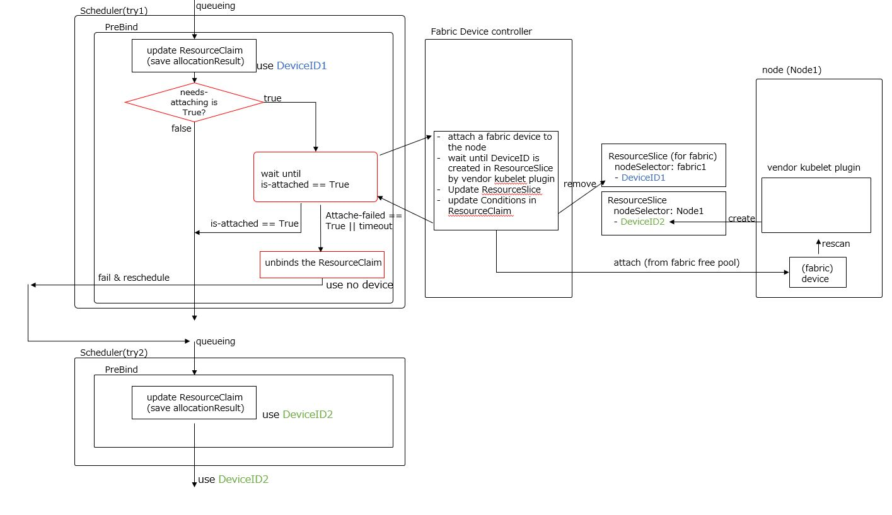

<!--
**Note:** When your KEP is complete, all of these comment blocks should be removed.

To get started with this template:

- [x] **Pick a hosting SIG.**
  Make sure that the problem space is something the SIG is interested in taking
  up. KEPs should not be checked in without a sponsoring SIG.
- [x] **Create an issue in kubernetes/enhancements**
  When filing an enhancement tracking issue, please make sure to complete all
  fields in that template. One of the fields asks for a link to the KEP. You
  can leave that blank until this KEP is filed, and then go back to the
  enhancement and add the link.
- [x] **Make a copy of this template directory.**
  Copy this template into the owning SIG's directory and name it
  `NNNN-short-descriptive-title`, where `NNNN` is the issue number (with no
  leading-zero padding) assigned to your enhancement above.
- [x] **Fill out as much of the kep.yaml file as you can.**
  At minimum, you should fill in the "Title", "Authors", "Owning-sig",
  "Status", and date-related fields.
- [x] **Fill out this file as best you can.**
  At minimum, you should fill in the "Summary" and "Motivation" sections.
  These should be easy if you've preflighted the idea of the KEP with the
  appropriate SIG(s).
- [x] **Create a PR for this KEP.**
  Assign it to people in the SIG who are sponsoring this process.
- [ ] **Merge early and iterate.**
  Avoid getting hung up on specific details and instead aim to get the goals of
  the KEP clarified and merged quickly. The best way to do this is to just
  start with the high-level sections and fill out details incrementally in
  subsequent PRs.

Just because a KEP is merged does not mean it is complete or approved. Any KEP
marked as `provisional` is a working document and subject to change. You can
denote sections that are under active debate as follows:

```
<<[UNRESOLVED optional short context or usernames ]>>
Stuff that is being argued.
<<[/UNRESOLVED]>>
```

When editing KEPS, aim for tightly-scoped, single-topic PRs to keep discussions
focused. If you disagree with what is already in a document, open a new PR
with suggested changes.

One KEP corresponds to one "feature" or "enhancement" for its whole lifecycle.
You do not need a new KEP to move from beta to GA, for example. If
new details emerge that belong in the KEP, edit the KEP. Once a feature has become
"implemented", major changes should get new KEPs.

The canonical place for the latest set of instructions (and the likely source
of this file) is [here](/keps/NNNN-kep-template/README.md).

**Note:** Any PRs to move a KEP to `implementable`, or significant changes once
it is marked `implementable`, must be approved by each of the KEP approvers.
If none of those approvers are still appropriate, then changes to that list
should be approved by the remaining approvers and/or the owning SIG (or
SIG Architecture for cross-cutting KEPs).
-->
# [KEP-5007](https://github.com/kubernetes/enhancements/issues/5007): DRA: Device Binding Conditions

<!--
This is the title of your KEP. Keep it short, simple, and descriptive. A good
title can help communicate what the KEP is and should be considered as part of
any review.
-->

<!--
A table of contents is helpful for quickly jumping to sections of a KEP and for
highlighting any additional information provided beyond the standard KEP
template.

Ensure the TOC is wrapped with
  <code>&lt;!-- toc --&rt;&lt;!-- /toc --&rt;</code>
tags, and then generate with `hack/update-toc.sh`.
-->

<!-- toc -->
- [Release Signoff Checklist](#release-signoff-checklist)
- [Summary](#summary)
- [Motivation](#motivation)
  - [Goals](#goals)
  - [Non-Goals](#non-goals)
- [Proposal](#proposal)
  - [PreBind Process](#prebind-process)
  - [Handling attachment failures](#handling-attachment-failures)
  - [User Stories (Optional)](#user-stories-optional)
    - [Story 1: Asynchronous Device Initialization](#story-1-asynchronous-device-initialization)
    - [Story 2: Fabric-Attached GPU Allocation](#story-2-fabric-attached-gpu-allocation)
    - [Story 3: Gang Scheduling with Deferred Binding](#story-3-gang-scheduling-with-deferred-binding)
  - [Notes/Constraints/Caveats (Optional)](#notesconstraintscaveats-optional)
  - [Risks and Mitigations](#risks-and-mitigations)
- [Design Details](#design-details)
  - [DRA Scheduler Plugin Design Overview](#dra-scheduler-plugin-design-overview)
    - [Device Enhancements](#device-enhancements)
    - [DeviceRequestAllocationResult Enhancements](#devicerequestallocationresult-enhancements)
    - [Scheduler DRA Plugin Modifications](#scheduler-dra-plugin-modifications)
    - [PreBind Phase Timeout](#prebind-phase-timeout)
    - [Timeout Behavior for BindingConditions](#timeout-behavior-for-bindingconditions)
  - [Alternative approach](#alternative-approach)
  - [Test Plan](#test-plan)
      - [Prerequisite testing updates](#prerequisite-testing-updates)
      - [Unit tests](#unit-tests)
      - [Integration tests](#integration-tests)
      - [e2e tests](#e2e-tests)
  - [Graduation Criteria](#graduation-criteria)
    - [Alpha](#alpha)
    - [Beta](#beta)
    - [GA](#ga)
    - [Deprecation](#deprecation)
  - [Upgrade / Downgrade Strategy](#upgrade--downgrade-strategy)
  - [Version Skew Strategy](#version-skew-strategy)
- [Production Readiness Review Questionnaire](#production-readiness-review-questionnaire)
  - [Feature Enablement and Rollback](#feature-enablement-and-rollback)
  - [Rollout, Upgrade and Rollback Planning](#rollout-upgrade-and-rollback-planning)
  - [Monitoring Requirements](#monitoring-requirements)
  - [Dependencies](#dependencies)
  - [Scalability](#scalability)
  - [Troubleshooting](#troubleshooting)
- [Implementation History](#implementation-history)
- [Drawbacks](#drawbacks)
- [Alternatives](#alternatives)
- [Infrastructure Needed (Optional)](#infrastructure-needed-optional)
<!-- /toc -->

## Release Signoff Checklist

<!--
**ACTION REQUIRED:** In order to merge code into a release, there must be an
issue in [kubernetes/enhancements] referencing this KEP and targeting a release
milestone **before the [Enhancement Freeze](https://git.k8s.io/sig-release/releases)
of the targeted release**.

For enhancements that make changes to code or processes/procedures in core
Kubernetes—i.e., [kubernetes/kubernetes], we require the following Release
Signoff checklist to be completed.

Check these off as they are completed for the Release Team to track. These
checklist items _must_ be updated for the enhancement to be released.
-->

Items marked with (R) are required *prior to targeting to a milestone / release*.

- [ ] (R) Enhancement issue in release milestone, which links to KEP dir in [kubernetes/enhancements] (not the initial KEP PR)
- [ ] (R) KEP approvers have approved the KEP status as `implementable`
- [ ] (R) Design details are appropriately documented
- [ ] (R) Test plan is in place, giving consideration to SIG Architecture and SIG Testing input (including test refactors)
  - [ ] e2e Tests for all Beta API Operations (endpoints)
  - [ ] (R) Ensure GA e2e tests meet requirements for [Conformance Tests](https://github.com/kubernetes/community/blob/master/contributors/devel/sig-architecture/conformance-tests.md) 
  - [ ] (R) Minimum Two Week Window for GA e2e tests to prove flake free
- [ ] (R) Graduation criteria is in place
  - [ ] (R) [all GA Endpoints](https://github.com/kubernetes/community/pull/1806) must be hit by [Conformance Tests](https://github.com/kubernetes/community/blob/master/contributors/devel/sig-architecture/conformance-tests.md) 
- [ ] (R) Production readiness review completed
- [ ] (R) Production readiness review approved
- [ ] "Implementation History" section is up-to-date for milestone
- [ ] User-facing documentation has been created in [kubernetes/website], for publication to [kubernetes.io]
- [ ] Supporting documentation—e.g., additional design documents, links to mailing list discussions/SIG meetings, relevant PRs/issues, release notes

<!--
**Note:** This checklist is iterative and should be reviewed and updated every time this enhancement is being considered for a milestone.
-->

[kubernetes.io]: https://kubernetes.io/
[kubernetes/enhancements]: https://git.k8s.io/enhancements
[kubernetes/kubernetes]: https://git.k8s.io/kubernetes
[kubernetes/website]: https://git.k8s.io/website

## Summary

This KEP introduces BindingConditions, a mechanism that defers Pod binding until external resources (e.g., fabric-attached GPUs, FPGAs) are confirmed ready.
Unlike current scheduling, which assumes immediate readiness, this feature prevents premature binding and improves reliability for asynchronous or failure-prone resources.

While the original motivation for this KEP was to support fabric-attached devices in composable disaggregated infrastructure, the proposed mechanism is designed to be broadly applicable.
BindingConditions enable the scheduler to defer Pod binding until external resources (such as attachable devices, remote accelerators, or programmable hardware) are confirmed to be ready.
This allows for more deterministic scheduling and avoids premature binding that could lead to Pod failures or manual intervention.

The mechanism is not tied to any specific hardware model or infrastructure.
It can support a wide range of use cases, including:
- Fabric-attached GPUs that require dynamic attachment via PCIe or CXL switches
- FPGAs that need time-consuming reprogramming before use

If device preparation fails (e.g., due to contention or hardware error), the scheduler may clear the allocation and allow the Pod to be reconsidered for scheduling.
This fallback behavior is part of error handling, but the primary goal is to enable more robust and predictable scheduling by explicitly modeling readiness before binding.

## Motivation

As AI and ML workloads become increasingly common in Kubernetes environments, the demand for high-performance computing resources continues to grow.
At the same time, energy efficiency and flexible infrastructure utilization are becoming critical for sustainable operations.

Composable Disaggregated Infrastructure (CDI) has emerged as a promising approach to address these needs.
In CDI, hardware resources such as CPUs, memory, and GPUs are disaggregated and pooled, allowing them to be dynamically composed into custom server configurations.
Fabric-attached devices — such as GPUs connected via PCIe or CXL switches — are a key component of this model.

In Kubernetes, these fabric devices may be shared across clusters and exposed via `ResourceSlice`.
However, when device attachment occurs only after a Pod is scheduled, there is a risk that the device may not be available at the time of attachment, leading to Pod failures or manual intervention.

To address this, we propose a mechanism — `BindingConditions` — that allows the scheduler to defer Pod binding until the required device is confirmed to be ready.
This improves reliability by avoiding premature binding and enables better coordination with external device controllers.

While the original motivation came from fabric-attached devices, the mechanism is designed to be broadly applicable.
It can support other scenarios where resource readiness is asynchronous or failure-prone, such as remote accelerators or gang scheduling.
This proposal focuses on enabling readiness-aware binding as a general scheduling enhancement.

Moving to beta aims to validate the feature at scale, gather real-world feedback, and ensure integration with related components such as Cluster Autoscaler.

### Goals

1. **Enable Readiness-Aware Binding**:  
   Introduce a mechanism (`BindingConditions`) that allows the scheduler to defer Pod binding until external resources are confirmed to be ready.
   This improves scheduling reliability and avoids premature binding in environments where resource preparation is asynchronous or failure-prone.

2. **Define Binding and Failure Conditions Explicitly**:  
   Allow device providers to specify `BindingConditions` and `BindingFailureConditions` that the scheduler can evaluate during the PreBind phase.

3. **Prioritize Devices Based on Readiness**:  
   When multiple candidate devices are available, the scheduler should prefer devices in the following order:
   1. Devices without any `BindingConditions` (i.e., immediately usable)
   2. Devices with `BindingConditions` (i.e., require preparation)

   This prioritization naturally favors node-local devices over fabric-attached ones, assuming the latter require preparation.

### Non-Goals

- Defining a complete model for fabric-attached device coordination.
- While this KEP introduces a mechanism that supports such use cases, broader architectural questions — such as how to model attachment workflows or coordinate between node-local and fabric-aware components — will be addressed in follow-up discussions.
- Defining autoscaling strategies for fabric-attached devices (covered in future proposals).
- Guaranteeing zero rescheduling in all failure scenarios.
- A mechanism to safely move devices between different pools, achieving this as a happy-path flow without relying on re-scheduling triggered by BindingFailureConditions.

## Proposal

This proposal introduces a mechanism that allows the scheduler to defer Pod binding until external resources are confirmed to be ready.
This is achieved by extending the `ResourceSlice` and `DeviceRequestAllocationResult` APIs with the following fields:

- `BindingConditions`: a list of condition keys that must be satisfied (i.e., set to `True`) before binding can proceed.
- `BindingFailureConditions`: a list of condition keys that, if any are `True`, indicate that binding should be aborted and the Pod rescheduled.
- `BindsToNode`: a boolean field (optional) that indicates whether the scheduler should set the nodename to the ResourceClaim's nodeSelector during the scheduling process.
  When set to true, the scheduler records the selected node name in the claim(in the `PreBind` phase), effectively reserving the resource for that specific node.
  This is particularly useful for external controllers during the PreBind phase, as they can retrieve the node name from the claim and perform node-specific operations such as device attachment or preparation.

Each entry in `BindingConditions` and `BindingFailureConditions` must be a valid Kubernetes condition type string (e.g., `dra.example.com/is-prepared`).
These are interpreted as keys in the `.status.conditions` field of the corresponding `ResourceClaim`.
External controllers are responsible for updating these condition keys with standard Kubernetes condition semantics (`type`, `status`, `reason`, `message`, `lastTransitionTime`).

The scheduler evaluates only the `status` field of these conditions:
- All `BindingConditions` must have `status: "True"` to proceed with binding.
- If any `BindingFailureConditions` has `status: "True"`, the binding is aborted.

These fields are introduced as alpha features and require enabling the `DRADeviceBindingConditions` and `DRAResourceClaimDeviceStatus` feature gates.
`DRAResourceClaimDeviceStatus` is required because it controls whether these binding conditions can be set in the ResourceClaim status.

This mechanism enables readiness-aware scheduling for resources that require asynchronous preparation, such as fabric-attached devices or remote accelerators.
It allows the scheduler to make binding decisions based on up-to-date readiness information, improving reliability and avoiding premature binding.

**Beta Changes (Planned):**
- Timeout configuration via scheduler arguments.
- Additional improvements may be added based on alpha feedback.

### PreBind Process

During the scheduling cycle, the DRA scheduler plugin selects a suitable `ResourceSlice` for each `ResourceClaim` and copies relevant metadata into the `AllocationResult` of the claim.
This includes:

- `BindingConditions`
- `BindingFailureConditions`

In the `PreBind` phase, the scheduler evaluates the readiness of the selected device by checking the following:

1. **All `BindingConditions` must be `True`**  
   These conditions represent readiness signals (e.g., "device attached", "controller acknowledged") that must be satisfied before binding can proceed.

2. **No `BindingFailureConditions` may be `True`**  
   If any failure condition is set, the scheduler aborts the binding attempt and clears the allocation.

3. **Timeout Handling**  
   If `BindingConditions` are not all satisfied within the timeout, the scheduler treats this as a timeout failure.
   The allocation is cleared, and the Pod is returned to the scheduling queue for reconsideration.

This mechanism ensures that Pods are only bound to nodes when the associated devices are confirmed to be ready, avoiding premature binding and improving scheduling reliability.

External controllers (e.g., composable DRA controllers) are responsible for monitoring the `ResourceClaim` and updating the condition statuses as device preparation progresses.
This coordination allows the scheduler to make informed binding decisions without requiring tight coupling between the scheduler and device-specific logic.

### Handling attachment failures

If device preparation fails — for example, due to fabric contention, hardware error, or controller-side timeout — the external controller (e.g., a composable DRA controller) should update the condition status in the `ResourceClaim`'s `allocationResult` to reflect the failure.
This is typically done by setting one or more `BindingFailureConditions` to `True`.
It should also ensure that the device is not picked again.
It can do that by removing the device from the ResourceSlice, adding a [device taint](https://github.com/kubernetes/enhancements/issues/5055), or by changing the node selector, either at the ResourceSlice level or using per-device node selectors from the [partitionable devices](https://github.com/kubernetes/enhancements/issues/4815).
There is no guarantee that the scheduler will receive those updates in time for the next pod scheduling cycle, but eventually it will.

The scheduler will detect this during the `PreBind` phase and respond by:

1. **Aborting the binding cycle**: The Pod will not be bound to the node.
2. **Clearing the allocation**: The `ResourceClaim` is unbound from the `ResourceSlice`, making the resource available for other Pods.
3. **Requeuing the Pod**: The Pod is returned to the scheduling queue for reconsideration.

This failure-handling path is intended as an exception, not the primary scheduling model.
The preferred approach is for the scheduler to wait until all `BindingConditions` are satisfied, and only proceed with binding when the device is confirmed to be ready.

By modeling readiness explicitly and handling failures gracefully, this mechanism improves scheduling reliability and avoids leaving Pods in unrecoverable states.

### User Stories (Optional)

<!--
Detail the things that people will be able to do if this KEP is implemented.
Include as much detail as possible so that people can understand the "how" of
the system. The goal here is to make this feel real for users without getting
bogged down.
-->

#### Story 1: Asynchronous Device Initialization

A user deploys a Pod that requires a specialized FPGA device.
The device must be reprogrammed before use, which takes several minutes.
The device controller exposes a `BindingCondition` indicating that initialization is in progress.

The scheduler waits in the `PreBind` phase until the FPGA is ready.
If initialization completes successfully, the Pod is bound and started.
If the process fails, a `BindingFailureCondition` is set, and the Pod is rescheduled.
This avoids binding the Pod to a node where the device is not yet usable.

#### Story 2: Fabric-Attached GPU Allocation

The composable controller exposes the GPU as a `ResourceSlice` with a `BindingCondition` indicating that attachment is required.
A user submits a Pod that requests a GPU managed by a composable infrastructure system.
The GPU is not yet attached to any node and must be dynamically connected via a PCIe fabric.

The scheduler selects a node and defers binding until the controller completes the attachment and updates the condition to `True`.
Once the device is ready, the scheduler proceeds with binding.
If the attachment fails or times out, the Pod is rescheduled.
This ensures that the Pod is only bound when the device is truly usable.

#### Story 3: Gang Scheduling with Deferred Binding

A user runs a distributed training job that requires multiple Pods to be scheduled together, each with a GPU.
The job controller coordinates the scheduling and uses `BindingConditions` to delay binding until all Pods are ready to proceed.

Once all Pods have satisfied their readiness conditions, the scheduler binds them simultaneously.
This ensures that the job starts in a coordinated fashion, avoiding partial execution or resource waste.

note: This is a speculative use case and not currently supported.

### Notes/Constraints/Caveats (Optional)

<!--
What are the caveats to the proposal?
What are some important details that didn't come across above?
Go in to as much detail as necessary here.
This might be a good place to talk about core concepts and how they relate.
-->

- **Maximum Number of Conditions**: The maximum number of `BindingConditions` and `BindingFailureConditions` per device is limited to 4.
  This constraint ensures that the scheduler can efficiently evaluate conditions without excessive overhead and that the worst-case size of a ResourceSlice does not grow too much.

- **External Controller Dependency**: The effectiveness of `BindingConditions` relies on accurate and timely updates from external controllers (e.g., composable DRA controllers).
  Any delays or inaccuracies in these updates can impact scheduling reliability.

- **Error Handling**: If `BindingConditions` are not satisfied within the specified timeout, or if any `BindingFailureConditions` are set to `True`, the scheduler will clear the allocation and reschedule the Pod.
  This fallback behavior is intended as an error recovery mechanism, not the primary scheduling model.

### Risks and Mitigations

<!--
What are the risks of this proposal, and how do we mitigate? Think broadly.
For example, consider both security and how this will impact the larger
Kubernetes ecosystem.

How will security be reviewed, and by whom?

How will UX be reviewed, and by whom?

Consider including folks who also work outside the SIG or subproject.
-->

**What if the scheduler restarts while the DRA plugin is waiting for the device(s) to be bound?**

The scheduler's restart should not pose an issue, as the decision to wait is based on the Conditions of the ResourceClaim.
However, care must be taken to ensure that condition updates are persisted correctly.
If the scheduler restarts while a Pod is waiting in PreBind, it will re-evaluate the ResourceClaim's condition status.
Since readiness is tracked via API server state, the scheduler can resume waiting or proceed based on the current values.
Controllers should avoid transient or inconsistent condition states that could lead to incorrect scheduling decisions.
After a scheduler restart, if the device attachment is not yet complete, the scheduler will wait again at PreBind.
If the attachment is complete, it will pass through PreBind.

**Scheduler does not guarantee to pick up the same node for the Pod after the reschedule (after binding failure)**

Status: Addressed in this [KEP](https://github.com/kubernetes/enhancements/issues/5278)

Basically scheduler should select the same node, however we need to consider the following scenarios:
 - In case of a failure, we might want to try a different node.
 - During rescheduling, if another pod is deployed on that node and uses the resources, the rescheduled pod might not be able to be deployed. Therefore, we need logic to prioritize the rescheduled pod on that node.

[Node nomination](https://kubernetes.io/docs/concepts/scheduling-eviction/pod-priority-preemption/#user-exposed-information) would solve this.
If node nomination is not available, processing flow is as follows.
If the pod is assigned to another node after the scheduler restarts, additional device will be attached to that node.
If the device attached to the original node is not used, user can manually detach the device.
(Of course, we can leave it attached to that node for future use by the Pod.)

This issue needs to be resolved before the beta is released.

**Pods which are not bound yet (in api-server) and not unschedulable (in api-server) are not visible by cluster autoscaler, so there is a risk that the node will be turned down.**

Status: Addressed in this [KEP](https://github.com/kubernetes/enhancements/issues/5278)

Regarding collaboration with the Cluster Autoscaler, using node nomination can address the issue.
This issue needs to be resolved before the beta is released.

**The in-flight events cache may grow too large when waiting in PreBind.**

Status: Fixed in kubernetes/kubernetes#129967.

To address the PreBind concern, the solution is to modify the scheduling framework to flush the in-flight events cache before PreBind.
This prevents issues in the scheduling queue caused by keeping pods at PreBind for an extended period.
This issue will be addressed separately as outlined in kubernetes/kubernetes#129967.
This issue needs to be resolved before the beta is released.

## Design Details

### DRA Scheduler Plugin Design Overview

This document outlines the design of the DRA Scheduler Plugin.
Key additions include `BindingConditions` and `BindingFailureConditions` for device identification and preparation, enhancements to `DeviceRequestAllocationResult`, and the process for handling `ResourceSlice` upon attachment failure.

The diagram below illustrates the interaction between the scheduler, ResourceClaim, and external controller during the PreBind phase.
It shows how the scheduler waits for readiness conditions to be met before proceeding with binding, and how failure conditions or timeouts trigger rescheduling.
This flow ensures that Pods are only bound when the associated device is confirmed to be usable.


#### Device Enhancements

To indicate that the device is a Fabric device or other device that requires some preparation (e.g. attachment), some fields are added to the `Device` within `ResourceSliceSpec`.
These fields will be used by the controller that exposes the `ResourceSlice` to notify whether the device is a fabric device.

```go
// Device represents one individual hardware instance that can be selected based
// on its attributes. Besides the name, exactly one field must be set.
type Device struct {
  ...
  // BindsToNode indicates if the usage of an allocation involving this device
  // has to be limited to exactly the node that was chosen when allocating the claim.
  // If set to true, the scheduler will set the ResourceClaim.Status.Allocation.NodeSelector
  // to match the node where the allocation was made.
  //
  // This is an alpha field and requires enabling the DRADeviceBindingConditions and DRAResourceClaimDeviceStatus
  // feature gates.
  //
  // +optional
  // +featureGate=DRADeviceBindingConditions,DRAResourceClaimDeviceStatus
  BindsToNode *bool

  // BindingConditions defines the conditions for proceeding with binding.
  // All of these conditions must be set in the per-device status
  // conditions with a value of True to proceed with binding the pod to the node
  // while scheduling the pod.
  //
  // The maximum number of binding conditions is 4.
  // All entries are condition types, which means
  // they must be labels.
  //
  // This is an alpha field and requires enabling the DRADeviceBindingConditions and DRAResourceClaimDeviceStatus
  // feature gates.
  //
  // +optional
  // +listType=atomic
  // +featureGate=DRADeviceBindingConditions,DRAResourceClaimDeviceStatus
  BindingConditions []string

  // BindingFailureConditions defines the conditions for binding failure.
  // They may be set in the per-device status conditions.
  // If any is true, a binding failure occurred.
  //
  // The maximum number of binding conditions is 4.
  // All entries are condition types, which means
  // they must be labels.
  //
  // This is an alpha field and requires enabling the DRADeviceBindingConditions and DRAResourceClaimDeviceStatus
  // feature gates.
  //
  // +optional
  // +listType=atomic
  // +featureGate=DRADeviceBindingConditions,DRAResourceClaimDeviceStatus
  BindingFailureConditions []string
}

const (
    BindingConditionsMaxSize    = 4
    BindingFailureConditionsMaxSize = 4
)
```

#### DeviceRequestAllocationResult Enhancements

The `BindingConditions` and `BindingFailureConditions` fields within `DeviceRequestAllocationResult` are used to indicate the status of the device attachment.
These fields will contain a list of conditions, each representing a specific state or event related to the device.

For this feature, following fields are added:

```go
// DeviceRequestAllocationResult contains the allocation result for one request.
type DeviceRequestAllocationResult struct {
 ...
  // BindingConditions contains a copy of the BindingConditions
  // from the corresponding ResourceSlice at the time of allocation.
  //
  // This is an alpha field and requires enabling the DRADeviceBindingConditions and DRAResourceClaimDeviceStatus
  // feature gates.
  //
  // +optional
  // +listType=atomic
  // +featureGate=DRADeviceBindingConditions,DRAResourceClaimDeviceStatus
  BindingConditions []string

  // BindingFailureConditions contains a copy of the BindingFailureConditions
  // from the corresponding ResourceSlice at the time of allocation.
  //
  // This is an alpha field and requires enabling the DRADeviceBindingConditions and DRAResourceClaimDeviceStatus
  // feature gates.
  //
  // +optional
  // +listType=atomic
  // +featureGate=DRADeviceBindingConditions,DRAResourceClaimDeviceStatus
  BindingFailureConditions []string
  ...
}
```

#### Scheduler DRA Plugin Modifications

When `BindsToNode: true` is set, the scheduler DRA plugin will perform the following steps:

1. **Set NodeSelector in api-server**: During the `PreBind` phase, propagate the `NodeName` to the `ResourceClaim`'s `NodeSelector` to the api-server.

If Conditions are present, the scheduler DRA plugin will additionally perform the following steps:

2. **Copy Conditions**: Copy `BindingConditions` and `BindingFailureConditions` from `ResourceSlice.Device` to `DeviceRequestAllocationResult`.
3. **Wait for Conditions**: Wait for the following conditions:
   - Wait until all conditions in the BindingConditions are `True` before proceeding to Bind.
   - If any one of the conditions in the BindingFailureConditions becomes `True`, clear the allocation in the `ResourceClaim` and reschedule the Pod.
   - If the preparation of a device takes longer than the timeout period, clear the allocation in the `ResourceClaim` and reschedule the Pod.

To support these steps, for example, a DRA driver can include the following definitions in BindingConditions or BindingFailureConditions within a ResourceSlice:

```go
const (
    // IsPrepared indicates the device ready state.
    // If NeedToPreparing is True and IsPrepared is True, the scheduler proceeds to Bind.
    IsPrepared = "dra.example.com/is-prepared"

    // PreparingFailed indicates the device preparation failed state.
    // If PreparingFailed is True, the scheduler will clear the allocation in the ResourceClaim and reschedule the Pod.
    PreparingFailed = "dra.example.com/preparing-failed"
)
```

Note: There is a concern that the in-flight events cache may grow too large when waiting in PreBind.
To address this, the scheduling framework will be modified to flush the in-flight events cache before PreBind.
This prevents issues in the scheduling queue caused by keeping pods at PreBind for an extended period.
This issue will be addressed separately as outlined in kubernetes/kubernetes#129967.

#### PreBind Phase Timeout

If the device attachment is successful, we expect it to take no longer than 5 minutes.
The scheduler has 10 minutes as the default timeout.

Even if the conditions indicating that the device is attached or that the attachment failed are not updated, setting a timeout will prevent the scheduler from waiting indefinitely in the PreBind phase.

#### Timeout Behavior for BindingConditions
  To ensure Pods are not indefinitely blocked during the PreBind phase, a timeout mechanism is introduced for evaluating BindingConditions in ResourceClaim.

```go
// AllocationResult contains attributes of an allocated resource.
type AllocationResult struct {
  ...
  // AllocationTimestamp stores the time when the resources were allocated.
  // This field is not guaranteed to be set, in which case that time is unknown.
  //
  // This is an alpha field and requires enabling the DRADeviceBindingConditions and DRAResourceClaimDeviceStatus
  // feature gate.
  //
  // +optional
  // +featureGate=DRADeviceBindingConditions,DRAResourceClaimDeviceStatus
  AllocationTimestamp *metav1.Time
}
```

- **Triggering Timeout**:
A timeout is triggered if all BindingConditions in ResourceClaim.status.conditions do not reach status: "True" within the duration specified in the timeout.

- **Timeout Behavior**:
When a timeout occurs:

  - **Trigger**: Timeout occurs if all BindingConditions remain unset within the configured duration.
  - **Behavior**: When triggered, the scheduler aborts binding, clears the allocation, and requeues the Pod.
  - **Default Duration**: 10 minutes (configurable via scheduler arguments).
  - **Rationale for AllocationTimestamp**: Ensures consistent timeout handling for shared claims and multi-claim Pods.

- **Timeout Duration**:
The default timeout is 10 minutes and can be configured via scheduler arguments.

- **AllocationTimestamp**:
The `AllocationTimestamp` field in the `AllocationResult` records the exact time when the resource allocation occurred—specifically, when the scheduler began waiting for the binding conditions to be satisfied.
This field is particularly important in the following scenarios:
  - Multiple Pods sharing a single ResourceClaim: Since each Pod may be scheduled at a different time, it becomes ambiguous which scheduling event should serve as the basis for timeout evaluation.
    By recording the initial allocation time, `AllocationTimestamp` ensures consistent timeout behavior across all Pods referencing the same claim.
  - A single Pod with multiple ResourceClaims: Each claim may have distinct readiness conditions and timeout requirements.
    `AllocationTimestamp` allows the scheduler to manage timeouts independently for each claim, based on when its allocation began.

By anchoring timeout evaluation to a well-defined point in time, `AllocationTimestamp` helps prevent Pods from being indefinitely blocked in the PreBind phase and ensures reliable scheduling behavior in complex resource configurations.

### Alternative approach
This alternative approach is specific to Composable Disaggregated Infrastructure (CDI) environments.
It provides a different way to handle device readiness for fabric-attached devices, and is not intended as a general replacement for BindingConditions.

This section introduces another possible approach: using a "device autoscaler" to manage device attachment and detachment, similar to how the Cluster Autoscaler adds or removes nodes.
Instead of having the scheduler wait for devices to become ready, the autoscaler would monitor unschedulable Pods and try to attach the necessary devices in the background.
This approach could work alongside the BindingConditions mechanism, but it follows a different idea — letting the system react to scheduling failures instead of waiting for readiness before scheduling.

The key points and main process flow of this alternative proposal are as follows:

The scheduler references only node-local ResourceSlices.
If there are no available resources in the node-local ResourceSlices, the scheduler marks the Pod as unschedulable without waiting in the PreBind phase of the ResourceClaim.
And then, device autoscaler tries to attach new devices.
And it also try to detach devices if they have not been used for a period of time.
This is similar to the concept of CA.

However, if CA and device autoscaler is running independently, CA may add a node with a device at the same time as the device autoscaler attaches the device.
This is a wasted resource addition.
Therefore, there is the following idea that putting device-scale functionality in CA.

To handle fabric resources in CA, we implement the Processor for composable system within CA.
This Processor identifies unschedulable Pods and determines if attaching a fabric ResourceSlice device to an existing node would make scheduling possible.
If so, the Processor instructs the attachment of the resource, using the composable Operator for the actual attachment process.
If attaching the fabric ResourceSlice does not make scheduling possible, the Processor determines whether to add a new node as usual.

After the device is attached, the vendor DRA updates the node-local ResourceSlices.
The vendor DRA needs a rescan function to update the Pool/ResourceSlice.
The scheduler can then assign the node-local ResourceSlice devices to the unschedulable Pod, operating the same as the usual DRA from this point.

### Test Plan

<!--
**Note:** *Not required until targeted at a release.*
The goal is to ensure that we don't accept enhancements with inadequate testing.

All code is expected to have adequate tests (eventually with coverage
expectations). Please adhere to the [Kubernetes testing guidelines][testing-guidelines]
when drafting this test plan.

[testing-guidelines]: https://git.k8s.io/community/contributors/devel/sig-testing/testing.md
-->

[x] I/we understand the owners of the involved components may require updates to
existing tests to make this code solid enough prior to committing the changes necessary
to implement this enhancement.

##### Prerequisite testing updates

<!--
Based on reviewers feedback describe what additional tests need to be added prior
implementing this enhancement to ensure the enhancements have also solid foundations.
-->

##### Unit tests

<!--
In principle every added code should have complete unit test coverage, so providing
the exact set of tests will not bring additional value.
However, if complete unit test coverage is not possible, explain the reason of it
together with explanation why this is acceptable.
-->

<!--
Additionally, for Alpha try to enumerate the core package you will be touching
to implement this enhancement and provide the current unit coverage for those
in the form of:
- <package>: <date> - <current test coverage>
The data can be easily read from:
https://testgrid.k8s.io/sig-testing-canaries#ci-kubernetes-coverage-unit

This can inform certain test coverage improvements that we want to do before
extending the production code to implement this enhancement.
-->

- `k8s.io/kubernetes/pkg/scheduler/framework/plugins/dynamicresources`: `2025-05-26` - `79.3`
- `k8s.io/dynamic-resource-allocation/resourceclaim`: `2025-05-26` : `90.9`
- `k8s.io/dynamic-resource-allocation/resourceslice`: `2025-05-26` : `75.3` 
- `k8s.io/dynamic-resource-allocation/structured`: `2025-05-26` : `91.4` 

##### Integration tests

<!--
Integration tests are contained in k8s.io/kubernetes/test/integration.
Integration tests allow control of the configuration parameters used to start the binaries under test.
This is different from e2e tests which do not allow configuration of parameters.
Doing this allows testing non-default options and multiple different and potentially conflicting command line options.
-->

<!--
This question should be filled when targeting a release.
For Alpha, describe what tests will be added to ensure proper quality of the enhancement.

For Beta and GA, add links to added tests together with links to k8s-triage for those tests:
https://storage.googleapis.com/k8s-triage/index.html
-->

- Simulate a controller updating ResourceClaim conditions
- Verify scheduler behavior on success, failure, and timeout
- Simulate multiple Pods referencing the same ResourceClaim with BindingConditions to verify the scheduler's behavior during the PreBind phase.

##### e2e tests

<!--
This question should be filled when targeting a release.
For Alpha, describe what tests will be added to ensure proper quality of the enhancement.

For Beta and GA, add links to added tests together with links to k8s-triage for those tests:
https://storage.googleapis.com/k8s-triage/index.html

We expect no non-infra related flakes in the last month as a GA graduation criteria.
-->

- Verify Pod scheduling with BindingConditions under normal, timeout, and failure scenarios.
- Validate node nomination behavior after rescheduling.
- Stress test with 1000 Pods waiting in PreBind to measure scheduler latency.

### Graduation Criteria

#### Alpha

- Initial implementation is completed and enabled

#### Beta

- Gather feedback from developers and surveys
  - Feedback from CoHDI (https://github.com/CoHDI)
    - Dynamic device scaling can be achieved using the following basic functionalities of BindingCondition:
      - Creation of ResourceSlices with BindingCondition.
      - Allocation of devices from ResourceSlices with BindingCondition to Pods.
      - An external controller (e.g., dynamic-device-scaler) monitors and modifies the state of ResourceClaims allocated to Pods. This modification, specifically the setting of BindingFailureCondition, triggers Pod rescheduling.
    - Even if a Pod experiences a scheduling timeout, no issues were detected in its subsequent operation if the conditions are met.
    - No issues such as deadlocks have been detected within the scheduler or DRA framework.
    - A few bugs were identified in the external controller (CoHDI component), but all of them were resolvable with fixes and do not indicate a fatal problem with the use of BindingCondition.
    - Scenarios where devices in a ResourceSlice for a resource pool decrease were also tested, with no issues detected.
    - Please refer [here](https://github.com/CoHDI/composable-dra-driver/tree/main/doc/Usecase_and_feedback_for_BindingCondition.md) for more details.
    - In this use case, the attachment scenario for moving devices between different pools is achieved through re-scheduling triggered by BindingFailureConditions. However, there remains an issue that device migration needs to be implemented using BindingConditions as a happy‑path flow. This will be addressed in a separate KEP and will be considered out of scope for the beta-graduation criteria.
  - Feedback form NVIDIA DRA Driver (https://github.com/NVIDIA/k8s-dra-driver-gpu)
    - ComputeDomain is an NVIDIA GPU Operator concept that groups multiple Kubernetes pods into a secure, isolated domain so they can share GPU memory across nodes using Multi‑Node NVLink and IMEX technology.
    - BindingConditions let Kubernetes delay pod start until the ComputeDomain's prerequisites are truly ready - specifically, until IMEX daemons are scheduled and healthy - without resorting to fail‑and‑retry loops.
    - This yields faster, more predictable pod startup and a simpler driver/controller design because the pod is only bound once all ComputeDomain resources signal ready via BindingConditions.
    - Please refer [here](https://github.com/NVIDIA/k8s-dra-driver-gpu/issues/653) for more details.
- Resolve the issues listed in the following:  
  https://github.com/kubernetes/kubernetes/issues/135472

#### GA

- Feature enabled by default.
- No major bugs reported in two consecutive releases.
- Verified scalability in clusters with 5000+ nodes.
- PRR approved and observability metrics in place.

#### Deprecation
<!--
- Announce deprecation and support policy of the existing flag
- Two versions passed since introducing the functionality that deprecates the flag (to address version skew)
- Address feedback on usage/changed behavior, provided on GitHub issues
- Deprecate the flag
-->

### Upgrade / Downgrade Strategy

<!--
If applicable, how will the component be upgraded and downgraded? Make sure
this is in the test plan.

Consider the following in developing an upgrade/downgrade strategy for this
enhancement:
- What changes (in invocations, configurations, API use, etc.) is an existing
  cluster required to make on upgrade, in order to maintain previous behavior?
- What changes (in invocations, configurations, API use, etc.) is an existing
  cluster required to make on upgrade, in order to make use of the enhancement?
-->

This feature exposes new fields such as `BindingConditions` in the
`ResourceClaim` and `ResourceSlice`, the fields will either be present or not.

This feature uses the DRA interface and will follow standard Kubernetes feature flag semantics.

### Version Skew Strategy

<!--
If applicable, how will the component handle version skew with other
components? What are the guarantees? Make sure this is in the test plan.

Consider the following in developing a version skew strategy for this
enhancement:
- Does this enhancement involve coordinating behavior in the control plane and nodes?
- How does an n-3 kubelet or kube-proxy without this feature available behave when this feature is used?
- How does an n-1 kube-controller-manager or kube-scheduler without this feature available behave when this feature is used?
- Will any other components on the node change? For example, changes to CSI,
  CRI or CNI may require updating that component before the kubelet.
-->

Older schedulers, or schedulers with the feature flag disabled, will not see the values in the new fields, and so will proceed to binding even if the ResourceSlice contains BindingConditions. The exact behavior when the Pod reaches the kubelet will depend on the driver; in many cases it is likely the associated Pods will fail in this case.

## Production Readiness Review Questionnaire

<!--

Production readiness reviews are intended to ensure that features merging into
Kubernetes are observable, scalable and supportable; can be safely operated in
production environments, and can be disabled or rolled back in the event they
cause increased failures in production. See more in the PRR KEP at
https://git.k8s.io/enhancements/keps/sig-architecture/1194-prod-readiness.

The production readiness review questionnaire must be completed and approved
for the KEP to move to `implementable` status and be included in the release.

In some cases, the questions below should also have answers in `kep.yaml`. This
is to enable automation to verify the presence of the review, and to reduce review
burden and latency.

The KEP must have a approver from the
[`prod-readiness-approvers`](http://git.k8s.io/enhancements/OWNERS_ALIASES)
team. Please reach out on the
[#prod-readiness](https://kubernetes.slack.com/archives/CPNHUMN74) channel if
you need any help or guidance.
-->

### Feature Enablement and Rollback

<!--
This section must be completed when targeting alpha to a release.
-->

###### How can this feature be enabled / disabled in a live cluster?

<!--
Pick one of these and delete the rest.

Documentation is available on [feature gate lifecycle] and expectations, as
well as the [existing list] of feature gates.

[feature gate lifecycle]: https://git.k8s.io/community/contributors/devel/sig-architecture/feature-gates.md
[existing list]: https://kubernetes.io/docs/reference/command-line-tools-reference/feature-gates/
-->

- [x] Feature gate (also fill in values in `kep.yaml`)
  - Feature gate name: DRADeviceBindingConditions
  - Components depending on the feature gate: kube-scheduler and kube-apiserver
- [ ] Other
  - Describe the mechanism:
  - Will enabling / disabling the feature require downtime of the control
    plane?
  - Will enabling / disabling the feature require downtime or reprovisioning
    of a node?

###### Does enabling the feature change any default behavior?

<!--
Any change of default behavior may be surprising to users or break existing
automations, so be extremely careful here.
-->
No.

###### Can the feature be disabled once it has been enabled (i.e. can we roll back the enablement)?

<!--
Describe the consequences on existing workloads (e.g., if this is a runtime
feature, can it break the existing applications?).

Feature gates are typically disabled by setting the flag to `false` and
restarting the component. No other changes should be necessary to disable the
feature.

NOTE: Also set `disable-supported` to `true` or `false` in `kep.yaml`.
-->
Yes. No existing claims or running pods will be affected.
This feature affects only the allocation of devices during scheduling/binding.

###### What happens if we reenable the feature if it was previously rolled back?

The feature will begin working again.
If a Pod requests a resource that has BindingConditions, the Pod will wait in
the PreBind phase until all BindingConditions are set to True.

###### Are there any tests for feature enablement/disablement?

<!--
The e2e framework does not currently support enabling or disabling feature
gates. However, unit tests in each component dealing with managing data, created
with and without the feature, are necessary. At the very least, think about
conversion tests if API types are being modified.

Additionally, for features that are introducing a new API field, unit tests that
are exercising the `switch` of feature gate itself (what happens if I disable a
feature gate after having objects written with the new field) are also critical.
You can take a look at one potential example of such test in:
https://github.com/kubernetes/kubernetes/pull/97058/files#diff-7826f7adbc1996a05ab52e3f5f02429e94b68ce6bce0dc534d1be636154fded3R246-R282
-->

Enablement/disablement of this feature is tested as part of the unit test and integration tests.

### Rollout, Upgrade and Rollback Planning

<!--
This section must be completed when targeting beta to a release.
-->

###### How can a rollout or rollback fail? Can it impact already running workloads?

<!--
Try to be as paranoid as possible - e.g., what if some components will restart
mid-rollout?

Be sure to consider highly-available clusters, where, for example,
feature flags will be enabled on some API servers and not others during the
rollout. Similarly, consider large clusters and how enablement/disablement
will rollout across nodes.
-->

It is safest to perform rollout and feature enablement in the following order:

1. Enable the feature gate on the kube-apiserver
2. Enable the feature gate on the kube-scheduler
3. Deploy the DRA driver that publishes ResourceSlice with BindingConditions
4. Deploy the controller related to that device ( = the binding controller)

For rollback, it is recommended to reverse this order.

An example of a rollout failure would be when step 3 is completed but step 4 is not.
In this situation, a Pod may be allocated to a device with BindingConditions and remain in a scheduling wait state.
However, since the binding controller responsible for provisioning the device is not deployed, the provisioning never occurs, and scheduling cannot succeed.

###### What specific metrics should inform a rollback?

<!--
What signals should users be paying attention to when the feature is young
that might indicate a serious problem?
-->

Two metrics will be introduced.

- `scheduler_dra_bindingconditions_allocations_total` (type: `CounterVec`)
  - This metric counts the number of scheduling attempts (PreBind executions) in which BindingConditions are required.
  - The metric includes a label `status` - `"success"`, `"failure"`, or `"timeout"`, allowing operators to understand the processing result of BindingConditions.
  - By tracking this metric over time, operators can determine, at each point in time, whether the BindingConditions feature is being used

- `scheduler_dra_bindingconditions_prebind_duration_seconds` (type: `HistogramVec`)
  - This metric observes the full PreBind duration for DRA flows.
  - The metric includes a label `status` - `"success"`, `"failure"`, or `"timeout"`, allowing operators to classify the duration by processing status.
  - The metric includes a label `requires_bindingconditions` - `"true"` or `"false"`, allowing operators to switch the duration based on with or without BindingConditions.

When a timeout occurs in BindingConditions, the Pod is repeatedly re-scheduled, which leads to an increase in the `scheduler_dra_bindingconditions_allocations_total` metric with the label `status=timeout`.

Additionally, since the waiting time within the Pre-Bind phase increases, the `scheduler_dra_bindingconditions_prebind_duration_seconds` metric - especially the higher latency histogram buckets with labels `requires_bindingconditions=true` - will show elevated counts.

In all cases further analysis of logs and pod events is needed to determine whether errors are related to this feature.

###### Were upgrade and rollback tested? Was the upgrade->downgrade->upgrade path tested?

<!--
Describe manual testing that was done and the outcomes.
Longer term, we may want to require automated upgrade/rollback tests, but we
are missing a bunch of machinery and tooling and can't do that now.
-->

This was tested before promotion to beta, using `PRESERVE_ETCD=true hack/local-up-cluster.sh` and `test/e2e/dra/test-driver/dra-test-driver.go` (with minor customizations to enable BindingConditions). Pods using ResourceClaims started in one version could be removed by the other. When the feature is disabled, the new fields were ignored.

###### Is the rollout accompanied by any deprecations and/or removals of features, APIs, fields of API types, flags, etc.?

<!--
Even if applying deprecation policies, they may still surprise some users.
-->

No

### Monitoring Requirements

<!--
This section must be completed when targeting beta to a release.

For GA, this section is required: approvers should be able to confirm the
previous answers based on experience in the field.
-->

###### How can an operator determine if the feature is in use by workloads?

<!--
Ideally, this should be a metric. Operations against the Kubernetes API (e.g.,
checking if there are objects with field X set) may be a last resort. Avoid
logs or events for this purpose.
-->

Operators can determine whether this feature is being used by workloads by checking the metric `scheduler_dra_bindingconditions_allocations_total`.
By tracking this metric over time, operators can determine, at each point in time, whether the BindingConditions feature is being used.

###### How can someone using this feature know that it is working for their instance?

<!--
For instance, if this is a pod-related feature, it should be possible to determine if the feature is functioning properly
for each individual pod.
Pick one more of these and delete the rest.
Please describe all items visible to end users below with sufficient detail so that they can verify correct enablement
and operation of this feature.
Recall that end users cannot usually observe component logs or access metrics.
-->

We can confirm that the feature is working correctly for our instance by
observing the following Pod conditions:

- The Pod's Event logs show "BindingConditionsPending", and
- The Pod's Status is "Running".

###### What are the reasonable SLOs (Service Level Objectives) for the enhancement?

<!--
This is your opportunity to define what "normal" quality of service looks like
for a feature.

It's impossible to provide comprehensive guidance, but at the very
high level (needs more precise definitions) those may be things like:
  - per-day percentage of API calls finishing with 5XX errors <= 1%
  - 99% percentile over day of absolute value from (job creation time minus expected
    job creation time) for cron job <= 10%
  - 99.9% of /health requests per day finish with 200 code

These goals will help you determine what you need to measure (SLIs) in the next
question.
-->

We aim to ensure that the overhead introduced by the scheduler's waiting
mechanism in the PreBind phase is minimal. While the overhead mainly depends
on the responsiveness of external controllers (e.g., composable DRA controllers)
in updating ResourceClaim conditions, the scheduler's internal processing time
from detecting an updated ResourceClaim to completing the binding should be
consistently low.

###### What are the SLIs (Service Level Indicators) an operator can use to determine the health of the service?

<!--
Pick one more of these and delete the rest.
-->

This can be determined by monitoring the histogram metric `scheduler_dra_bindingconditions_prebind_duration_seconds`
with the labels `"status=success"` and `"requires_bindingconditions=true"`.  
This metric shows the time it takes for BindingConditions to be processed and for the Pod to be scheduled.  
If this duration increases, it indicates that the SLI is degrading.

###### Are there any missing metrics that would be useful to have to improve observability of this feature?

<!--
Describe the metrics themselves and the reasons why they weren't added (e.g., cost,
implementation difficulties, etc.).
-->

No

### Dependencies

<!--
This section must be completed when targeting beta to a release.
-->

This feature depends on the Dynamic Resource Allocation feature and the
DRAResourceClaimDeviceStatus feature gate.

###### Does this feature depend on any specific services running in the cluster?

<!--
Think about both cluster-level services (e.g. metrics-server) as well
as node-level agents (e.g. specific version of CRI). Focus on external or
optional services that are needed. For example, if this feature depends on
a cloud provider API, or upon an external software-defined storage or network
control plane.

For each of these, fill in the following—thinking about running existing user workloads
and creating new ones, as well as about cluster-level services (e.g. DNS):
  - [Dependency name]
    - Usage description:
      - Impact of its outage on the feature:
      - Impact of its degraded performance or high-error rates on the feature:
-->

- [External controller]
  - Usage description:  
    The external controller is responsible for provisioning the resource state and satisfying BindingConditions so that the scheduler can complete the scheduling process.
    - Impact of its outage on the feature:  
      If the external controller is not deployed or is completely unavailable, Pods that require devices with BindingConditions will remain in a pending state. Scheduling cannot succeed because the controller never provisions the device or updates the conditions.
    - Impact of its degraded performance or high error rates on the feature:  
      If the controller is slow or error-prone, scheduling latency will increase significantly. Pods may experience long delays before becoming runnable, and in some cases, scheduling may fail if timeouts occur.

### Scalability

<!--
For alpha, this section is encouraged: reviewers should consider these questions
and attempt to answer them.

For beta, this section is required: reviewers must answer these questions.

For GA, this section is required: approvers should be able to confirm the
previous answers based on experience in the field.
-->

###### Will enabling / using this feature result in any new API calls?

<!--
Describe them, providing:
  - API call type (e.g. PATCH pods)
  - estimated throughput
  - originating component(s) (e.g. Kubelet, Feature-X-controller)
Focusing mostly on:
  - components listing and/or watching resources they didn't before
  - API calls that may be triggered by changes of some Kubernetes resources
    (e.g. update of object X triggers new updates of object Y)
  - periodic API calls to reconcile state (e.g. periodic fetching state,
    heartbeats, leader election, etc.)
-->

Yes, there will be additional Get() and Watch() calls to ResourceClaim for communication
with the external controller. However, these calls are executed with a
backoff interval and are therefore negligible.

###### Will enabling / using this feature result in introducing new API types?

<!--
Describe them, providing:
  - API type
  - Supported number of objects per cluster
  - Supported number of objects per namespace (for namespace-scoped objects)
-->

No, enabling this feature will not introduce new API types.

###### Will enabling / using this feature result in any new calls to the cloud provider?

<!--
Describe them, providing:
  - Which API(s):
  - Estimated increase:
-->

Only if the external controller uses features of the cloud provider.

###### Will enabling / using this feature result in increasing size or count of the existing API objects?

<!--
Describe them, providing:
  - API type(s):
  - Estimated increase in size: (e.g., new annotation of size 32B)
  - Estimated amount of new objects: (e.g., new Object X for every existing Pod)
-->

Yes, enabling this feature may increase the size of existing objects such as
ResourceSlice and ResourceClaim. Specifically, the following fields are added.
These are considered negligible because the increase is at most about 100 bytes
per device.

**Added fields:**

For each Device in ResourceSlice:
- BindsToNode
- BindingConditions
- BindingFailureConditions

For AllocationResult in ResourceClaim:
- AllocationTimestamp

For each DeviceRequestAllocationResult in ResourceClaim:
- BindingConditions
- BindingFailureConditions

###### Will enabling / using this feature result in increasing time taken by any operations covered by existing SLIs/SLOs?

<!--
Look at the [existing SLIs/SLOs].

Think about adding additional work or introducing new steps in between
(e.g. need to do X to start a container), etc. Please describe the details.

[existing SLIs/SLOs]: https://git.k8s.io/community/sig-scalability/slos/slos.md#kubernetes-slisslos
-->

Yes, when this feature is enabled and if devices corresponding to
BindingConditions exists in the k8s cluster, there is a potential impact on the
time it takes for a Pod to transition from creation to a Running state, as well
as on Pod creation throughput. This is due to waiting for status updates from
external controllers in the scheduler's PreBind phase.

This impact can be observed through the metric `scheduler_dra_bindingconditions_prebind_duration_seconds`.
By switching `requires_bindingconditions="true"/"false"`, it's possible to choose to display only requests that exclude BindingConditions, allowing to verify the transition times limited to requests involving BindingConditions.

###### Will enabling / using this feature result in non-negligible increase of resource usage (CPU, RAM, disk, IO, ...) in any components?

<!--
Things to keep in mind include: additional in-memory state, additional
non-trivial computations, excessive access to disks (including increased log
volume), significant amount of data sent and/or received over network, etc.
This through this both in small and large cases, again with respect to the
[supported limits].

[supported limits]: https://git.k8s.io/community//sig-scalability/configs-and-limits/thresholds.md
-->

No, CPU utilization will slightly increase for evaluating BindingConditions,
but this increase is negligible, because these operations are processed with a
backoff interval. And the addition of fields to existing structs will also
slightly increase memory consumption, but as mentioned in the previous item,
its impact is negligible.

###### Can enabling / using this feature result in resource exhaustion of some node resources (PIDs, sockets, inodes, etc.)?

<!--
Focus not just on happy cases, but primarily on more pathological cases
(e.g. probes taking a minute instead of milliseconds, failed pods consuming resources, etc.).
If any of the resources can be exhausted, how this is mitigated with the existing limits
(e.g. pods per node) or new limits added by this KEP?

Are there any tests that were run/should be run to understand performance characteristics better
and validate the declared limits?
-->

No, there is no such resource consumption.

### Troubleshooting

<!--
This section must be completed when targeting beta to a release.

For GA, this section is required: approvers should be able to confirm the
previous answers based on experience in the field.

The Troubleshooting section currently serves the `Playbook` role. We may consider
splitting it into a dedicated `Playbook` document (potentially with some monitoring
details). For now, we leave it here.
-->

###### How does this feature react if the API server and/or etcd is unavailable?

This feature is part of the scheduler's functionality. Regardless of whether
this feature is used or not, Pods will not be able to be scheduled.

###### What are other known failure modes?

<!--
For each of them, fill in the following information by copying the below template:
  - [Failure mode brief description]
    - Detection: How can it be detected via metrics? Stated another way:
      how can an operator troubleshoot without logging into a master or worker node?
    - Mitigations: What can be done to stop the bleeding, especially for already
      running user workloads?
    - Diagnostics: What are the useful log messages and their required logging
      levels that could help debug the issue?
      Not required until feature graduated to beta.
    - Testing: Are there any tests for failure mode? If not, describe why.
-->

Failure of the external controller, or the absence of a corresponding external
controller, will lead to a scheduling timeout, causing Pods that were waiting
in the PreBind phase to be re-queued for scheduling.

- Detection: Timeout of scheduling using the BindingConditions feature can be detected from the metrics.
- Mitigations: To prevent resources using the BindingConditions feature from being deployed, stop the controller that generates ResourceSlices with BindingConditions, and then delete those ResourceSlices.
- Diagnostics: Depends on the implementation of external controllers corresponding to BindingConditions.
- Testing: From the scheduler's perspective, this has been addressed through integration tests and unit tests, which confirm that timeouts do not occur under appropriate conditions and verify the behavior after a timeout occurs.

###### What steps should be taken if SLOs are not being met to determine the problem?

It depends on the implementation of external controllers.

## Implementation History

<!--
Major milestones in the lifecycle of a KEP should be tracked in this section.
Major milestones might include:
- the `Summary` and `Motivation` sections being merged, signaling SIG acceptance
- the `Proposal` section being merged, signaling agreement on a proposed design
- the date implementation started
- the first Kubernetes release where an initial version of the KEP was available
- the version of Kubernetes where the KEP graduated to general availability
- when the KEP was retired or superseded
-->

- 2024-12: Initial proposal drafted and discussed in SIG scheduling, WG device management.
- 2025-03: KEP revised to introduce BindingConditions as a general mechanism.
- 2025-05: Updated KEP submitted for review.
- 2025-06: Improve some API descriptions, and clarify that "fail and reschedule" is an anti-pattern.
- 2025-08: Updated KEP for promotion to beta

## Drawbacks

<!--
Why should this KEP _not_ be implemented?
-->

- Adds complexity to the scheduler's PreBind phase, which may impact scheduling latency in large clusters.
- Relies on external controllers to update readiness conditions correctly and promptly. Misbehaving controllers could cause Pods to be stuck or rescheduled unnecessarily.
- May introduce subtle bugs if condition semantics are not well-defined or consistently implemented across different device types.
- Requires careful coordination with Cluster Autoscaler and other scheduling extensions to avoid conflicts or inefficiencies.

## Alternatives

<!--
What other approaches did you consider, and why did you rule them out? These do
not need to be as detailed as the proposal, but should include enough
information to express the idea and why it was not acceptable.
-->

- Implementing readiness checks entirely outside the scheduler, using a controller that marks Pods as schedulable only when devices are ready. This would avoid modifying the scheduler but reduce scheduling flexibility.
- Using taints and tolerations to delay scheduling until devices are ready. This approach is less granular and harder to manage dynamically.
- Relying solely on retry mechanisms after Pod failure, without modeling readiness explicitly. This leads to poor user experience and inefficient resource usage.

## Infrastructure Needed (Optional)

<!--
Use this section if you need things from the project/SIG. Examples include a
new subproject, repos requested, or GitHub details. Listing these here allows a
SIG to get the process for these resources started right away.
-->
