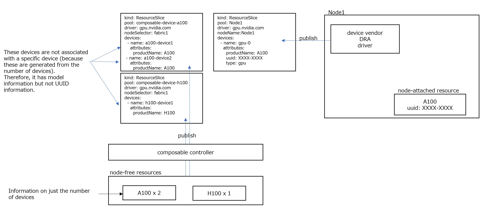

<!--
**Note:** When your KEP is complete, all of these comment blocks should be removed.

To get started with this template:

- [x] **Pick a hosting SIG.**
  Make sure that the problem space is something the SIG is interested in taking
  up. KEPs should not be checked in without a sponsoring SIG.
- [x] **Create an issue in kubernetes/enhancements**
  When filing an enhancement tracking issue, please make sure to complete all
  fields in that template. One of the fields asks for a link to the KEP. You
  can leave that blank until this KEP is filed, and then go back to the
  enhancement and add the link.
- [x] **Make a copy of this template directory.**
  Copy this template into the owning SIG's directory and name it
  `NNNN-short-descriptive-title`, where `NNNN` is the issue number (with no
  leading-zero padding) assigned to your enhancement above.
- [x] **Fill out as much of the kep.yaml file as you can.**
  At minimum, you should fill in the "Title", "Authors", "Owning-sig",
  "Status", and date-related fields.
- [x] **Fill out this file as best you can.**
  At minimum, you should fill in the "Summary" and "Motivation" sections.
  These should be easy if you've preflighted the idea of the KEP with the
  appropriate SIG(s).
- [x] **Create a PR for this KEP.**
  Assign it to people in the SIG who are sponsoring this process.
- [ ] **Merge early and iterate.**
  Avoid getting hung up on specific details and instead aim to get the goals of
  the KEP clarified and merged quickly. The best way to do this is to just
  start with the high-level sections and fill out details incrementally in
  subsequent PRs.

Just because a KEP is merged does not mean it is complete or approved. Any KEP
marked as `provisional` is a working document and subject to change. You can
denote sections that are under active debate as follows:

```
<<[UNRESOLVED optional short context or usernames ]>>
Stuff that is being argued.
<<[/UNRESOLVED]>>
```

When editing KEPS, aim for tightly-scoped, single-topic PRs to keep discussions
focused. If you disagree with what is already in a document, open a new PR
with suggested changes.

One KEP corresponds to one "feature" or "enhancement" for its whole lifecycle.
You do not need a new KEP to move from beta to GA, for example. If
new details emerge that belong in the KEP, edit the KEP. Once a feature has become
"implemented", major changes should get new KEPs.

The canonical place for the latest set of instructions (and the likely source
of this file) is [here](/keps/NNNN-kep-template/README.md).

**Note:** Any PRs to move a KEP to `implementable`, or significant changes once
it is marked `implementable`, must be approved by each of the KEP approvers.
If none of those approvers are still appropriate, then changes to that list
should be approved by the remaining approvers and/or the owning SIG (or
SIG Architecture for cross-cutting KEPs).
-->
# [KEP-5007](https://github.com/kubernetes/enhancements/issues/5007): DRA Device Attach Before Pod Scheduled

<!--
This is the title of your KEP. Keep it short, simple, and descriptive. A good
title can help communicate what the KEP is and should be considered as part of
any review.
-->

<!--
A table of contents is helpful for quickly jumping to sections of a KEP and for
highlighting any additional information provided beyond the standard KEP
template.

Ensure the TOC is wrapped with
  <code>&lt;!-- toc --&rt;&lt;!-- /toc --&rt;</code>
tags, and then generate with `hack/update-toc.sh`.
-->

<!-- toc -->
- [Release Signoff Checklist](#release-signoff-checklist)
- [Summary](#summary)
- [Motivation](#motivation)
  - [Goals](#goals)
  - [Non-Goals](#non-goals)
- [Proposal](#proposal)
  - [User Stories (Optional)](#user-stories-optional)
    - [Story 1](#story-1)
    - [Story 2](#story-2)
  - [Notes/Constraints/Caveats (Optional)](#notesconstraintscaveats-optional)
  - [Risks and Mitigations](#risks-and-mitigations)
- [Design Details](#design-details)
  - [DRA Scheduler Plugin Design Overview](#dra-scheduler-plugin-design-overview)
    - [Device Attribute Additions](#device-attribute-additions)
    - [<code>AllocatedDeviceStatus</code> Additions](#allocateddevicestatus-additions)
    - [Scheduler DRA plugin Additions](#scheduler-dra-plugin-additions)
    - [PreBind Phase Timeout](#prebind-phase-timeout)
    - [Handling ResourceSlices Upon Failure of Attachment](#handling-resourceslices-upon-failure-of-attachment)
  - [Composable Controller Design Overview](#composable-controller-design-overview)
  - [Alternative approach](#alternative-approach)
  - [Test Plan](#test-plan)
      - [Prerequisite testing updates](#prerequisite-testing-updates)
      - [Unit tests](#unit-tests)
      - [Integration tests](#integration-tests)
      - [e2e tests](#e2e-tests)
  - [Graduation Criteria](#graduation-criteria)
  - [Upgrade / Downgrade Strategy](#upgrade--downgrade-strategy)
  - [Version Skew Strategy](#version-skew-strategy)
- [Production Readiness Review Questionnaire](#production-readiness-review-questionnaire)
  - [Feature Enablement and Rollback](#feature-enablement-and-rollback)
  - [Rollout, Upgrade and Rollback Planning](#rollout-upgrade-and-rollback-planning)
  - [Monitoring Requirements](#monitoring-requirements)
  - [Dependencies](#dependencies)
  - [Scalability](#scalability)
  - [Troubleshooting](#troubleshooting)
- [Implementation History](#implementation-history)
- [Drawbacks](#drawbacks)
- [Alternatives](#alternatives)
- [Infrastructure Needed (Optional)](#infrastructure-needed-optional)
<!-- /toc -->

## Release Signoff Checklist

<!--
**ACTION REQUIRED:** In order to merge code into a release, there must be an
issue in [kubernetes/enhancements] referencing this KEP and targeting a release
milestone **before the [Enhancement Freeze](https://git.k8s.io/sig-release/releases)
of the targeted release**.

For enhancements that make changes to code or processes/procedures in core
Kubernetes—i.e., [kubernetes/kubernetes], we require the following Release
Signoff checklist to be completed.

Check these off as they are completed for the Release Team to track. These
checklist items _must_ be updated for the enhancement to be released.
-->

Items marked with (R) are required *prior to targeting to a milestone / release*.

- [ ] (R) Enhancement issue in release milestone, which links to KEP dir in [kubernetes/enhancements] (not the initial KEP PR)
- [ ] (R) KEP approvers have approved the KEP status as `implementable`
- [ ] (R) Design details are appropriately documented
- [ ] (R) Test plan is in place, giving consideration to SIG Architecture and SIG Testing input (including test refactors)
  - [ ] e2e Tests for all Beta API Operations (endpoints)
  - [ ] (R) Ensure GA e2e tests meet requirements for [Conformance Tests](https://github.com/kubernetes/community/blob/master/contributors/devel/sig-architecture/conformance-tests.md) 
  - [ ] (R) Minimum Two Week Window for GA e2e tests to prove flake free
- [ ] (R) Graduation criteria is in place
  - [ ] (R) [all GA Endpoints](https://github.com/kubernetes/community/pull/1806) must be hit by [Conformance Tests](https://github.com/kubernetes/community/blob/master/contributors/devel/sig-architecture/conformance-tests.md) 
- [ ] (R) Production readiness review completed
- [ ] (R) Production readiness review approved
- [ ] "Implementation History" section is up-to-date for milestone
- [ ] User-facing documentation has been created in [kubernetes/website], for publication to [kubernetes.io]
- [ ] Supporting documentation—e.g., additional design documents, links to mailing list discussions/SIG meetings, relevant PRs/issues, release notes

<!--
**Note:** This checklist is iterative and should be reviewed and updated every time this enhancement is being considered for a milestone.
-->

[kubernetes.io]: https://kubernetes.io/
[kubernetes/enhancements]: https://git.k8s.io/enhancements
[kubernetes/kubernetes]: https://git.k8s.io/kubernetes
[kubernetes/website]: https://git.k8s.io/website

## Summary

To achieve efficient management of fabric devices, we propose adding the following features to the Kubernetes scheduler's DRA plugin.
Fabric devices are those that are not directly connected to the server and require attachment to the server for use.

In the current DRA implementation, fabric devices are attached after the scheduling decision, which leads to the following issue:

Fabric devices may be contested by other clusters.
In scenarios where attachment occurs after scheduling, there is a risk that the resource cannot be attached at the time of attachment, causing the container to remain in the "Container Creating" state.

To address this issue, we propose a feature that allows the DRA scheduler plugin to wait for the device to be attached.
If attaching fails, the scheduler will retry and attempt to schedule the pod elsewhere.

## Motivation

As AI and ML become popular in container (K8s) environment, enormous computational resources are required more and more.
On the other hand, efforts toward energy efficiency are also required for the realization of a sustainable society.
It is expected to achieve the conflicting requirements that providing higher performance and reducing power consumption simultaneously.
Recently, a new server architecture called Composable Disaggregated Infrastructure is emerged.

In a traditional server, hardware resources such as CPUs, memory, and GPUs reside within the server.
Composable Disaggregated Infrastructure decomposes these hardware resources and makes them available as resource pools.
We can combine these resources by software definition so that we can create custom-made servers.

Composable system is composed of resource pool and Composable Manager software.
In Resource pool all components are connected to PCIe or CXL switches.
Composable Manager controls the switches so as to create composed baremetals by software definition.
It has Composable API and Operator or Kubernetes may call the API.
Once composed baremetals are created user can install any operating system or container infrastructure.

This flexibility extends further with the use of fabric devices.
Fabric devices can be used by multiple Kubernetes clusters, not just a single one.
Each cluster expose the device as a ResourceSlice, allowing for efficient utilization of the device.

In this scenario, the ResourceSlice representing a same fabric device might be selected in multiple Kubernetes clusters simultaneously.
If the attachment fails in one cluster, the pod will remain in a failed state in kubelet.

By having the scheduler wait for the fabric device to be attached, we can reschedule the pod if the attachment fails.
This approach is superior because it avoids unnecessary waiting and allows for immediate rescheduling.

### Goals

1. **Enhance the DRA Scheduling Process**: 
Implement a feature that allows the scheduling process to wait for the completion of fabric device attachment.
This ensures that pods are only scheduled once the necessary fabric devices are successfully attached, improving reliability and efficiency.

2. **Attribute Information for Fabric Devices**: 
Add attribute information that clearly distinguishes fabric devices requiring attachment.
This will help in accurately identifying and managing these devices within the Kubernetes environment.

3. **Prioritize Device Allocation**:
Implement a prioritization mechanism for device allocation, favoring devices directly connected to the node over attached fabric devices.
This hierarchy ensures optimal performance and resource utilization.
For example, the order of preference would be: Node-local devices > Attached fabric devices > Pre-attached fabric devices.

### Non-Goals

<!--
What is out of scope for this KEP? Listing non-goals helps to focus discussion
and make progress.
-->

## Proposal

The basic idea is the following:

1. **Adding Attributes to ResourceSlice**:
   - Add an attribute to `ResourceSlice` to indicate fabric devices. This key is predefined as part of the attributes.

2. **Waiting for Device Attachment in PreBind**:
   - For fabric devices, the scheduler waits for the device attachment to complete during the `PreBind` phase.

3. **PreBind Process**:
   The overall flow of the `PreBind` process is as follows:

   - **Updating ResourceClaim**:
     - The scheduler DRA plugin updates the `ResourceClaim` to notify the Composable DRA Controllers that device attachment is needed. 
     This is the same as the existing `PreBind` process.
     - In addition to the existing operations, the update to the `ResourceClaim` includes setting the necessary values in the `AllocatedDeviceStatus` conditions.

   - **Monitoring and Preparation by Composable DRA Controllers**:
     - Composable DRA Controllers monitor the `ResourceClaim`. If a device that requires preparation is associated with the `ResourceClaim`, they perform the necessary preparations.
     - Once the preparation is complete, they set the conditions to `true`.

   - **Completion of the PreBind Phase**:
     - Once all conditions are met, the `PreBind` phase is completed, and the scheduler proceeds to the next step.

### User Stories (Optional)

<!--
Detail the things that people will be able to do if this KEP is implemented.
Include as much detail as possible so that people can understand the "how" of
the system. The goal here is to make this feel real for users without getting
bogged down.
-->

#### Story 1

#### Story 2

### Notes/Constraints/Caveats (Optional)

<!--
What are the caveats to the proposal?
What are some important details that didn't come across above?
Go in to as much detail as necessary here.
This might be a good place to talk about core concepts and how they relate.
-->

### Risks and Mitigations

<!--
What are the risks of this proposal, and how do we mitigate? Think broadly.
For example, consider both security and how this will impact the larger
Kubernetes ecosystem.

How will security be reviewed, and by whom?

How will UX be reviewed, and by whom?

Consider including folks who also work outside the SIG or subproject.
-->

**What if the scheduler restarts while the DRA plugin is waiting for the device(s) to be bound?**

The scheduler's restart should not pose an issue, as the decision to wait is based on the Conditions of the ResourceClaim.
After a scheduler restart, if the device attachment is not yet complete, the scheduler will wait again at PreBind.
If the attachment is complete, it will pass through PreBind.

**Scheduler does not guarantee to pick up the same node for the Pod after the restart**

Basically scheduler should select the same node, however we need to consider the following scenarios:
 - In case of a failure, we might want to try a different node.
 - During rescheduling, if another pod is deployed on that node and uses the resources, the rescheduled pod might not be able to be deployed.
   Therefore, we need logic to prioritize the rescheduled pod on that node.

Node nomination would solve this.
If node nomination is not available, processing flow is as follows.
If the pod is assigned to another node after the scheduler restarts, additional device will be attached to that node.
If the device attached to the original node is not used, user can manually detach the device.
(Of course, we can leave it attached to that node for future use by the Pod.)

This issue needs to be resolved before the beta is released.

**Pods which are not bound yet (in api-server) and not unschedulable (in api-server) are not visible by cluster autoscaler, so there is a risk that the node will be turned down.**

Regarding collaboration with the Cluster Autoscaler, using node nomination can address the issue.
This issue needs to be resolved before the beta is released.

**The in-flight events cache may grow too large when waiting in PreBind.**

To address the PreBind concern, the solution is to modify the scheduling framework to flush the in-flight events cache before PreBind. 
This prevents issues in the scheduling queue caused by keeping pods at PreBind for an extended period.
This issue will be addressed separately as outlined in kubernetes/kubernetes#129967.
This issue needs to be resolved before the beta is released.

## Design Details

### DRA Scheduler Plugin Design Overview

This document outlines the design of the DRA Scheduler Plugin, focusing on the handling of fabric devices.
Key additions include new attributes for device identification, enhancements to `AllocatedDeviceStatus`, and the process for handling `ResourceSlices` upon attachment failure.
The composable controller design is also discussed, emphasizing efficient utilization of fabric devices.


#### Device Attribute Additions

To indicate whether a device is a fabric device, an attribute is added to the `Basic` within `Device`.
This attribute will be used by the controller that exposes the `ResourceSlice` to notify whether the device is a fabric device.
To avoid impacting existing DRA functionality, the default value of this attribute is set to `false`.

```go
// Device represents one individual hardware instance that can be selected based
// on its attributes. Besides the name, exactly one field must be set.
type Device struct {
    // Name is unique identifier among all devices managed by
    // the driver in the pool. It must be a DNS label.
    //
    // +required
    Name string

    // Basic defines one device instance.
    //
    // +optional
    // +oneOf=deviceType
    Basic *BasicDevice
}

// BasicDevice represents a basic device instance.
type BasicDevice struct {
    // Attributes defines the set of attributes for this device.
    // The name of each attribute must be unique in that set.
    //
    // The maximum number of attributes and capacities combined is 32.
    //
    // +optional
    Attributes map[QualifiedName]DeviceAttribute
    ...

}

...
// DeviceAttribute must have exactly one field set.
type DeviceAttribute struct {
	// The Go field names below have a Value suffix to avoid a conflict between the
	// field "String" and the corresponding method. That method is required.
	// The Kubernetes API is defined without that suffix to keep it more natural.

	// IntValue is a number.
	//
	// +optional
	// +oneOf=ValueType
	IntValue *int64

	// BoolValue is a true/false value.
	//
	// +optional
	// +oneOf=ValueType
	BoolValue *bool

	// StringValue is a string. Must not be longer than 64 characters.
	//
	// +optional
	// +oneOf=ValueType
	StringValue *string

	// VersionValue is a semantic version according to semver.org spec 2.0.0.
	// Must not be longer than 64 characters.
	//
	// +optional
	// +oneOf=ValueType
	VersionValue *string
}
```

To indicate a fabric device, the following attribute will be added:

```yaml
attributes:
  kubernetes.io/needs-attaching:
    boolValue: "true"
```

#### `AllocatedDeviceStatus` Additions

The `Conditions` field within `AllocatedDeviceStatus` is used to indicate the status of the device attachment.
This field will contain a list of conditions, each representing a specific state or event related to the device.

For this feature, the NodeName and following `ConditionType` constants are added:

```go
// AllocatedDeviceStatus contains the status of an allocated device, if the
// driver chooses to report it. This may include driver-specific information.
type AllocatedDeviceStatus struct {
...
    // NodeName contains the name of the node where the device needs to be attached.
    //
    // +optional
    NodeName string 
}

const(
  DRADeviceNeedAttachType = "kubernetes.io/needs-attaching"
  DRADeviceIsAttachType = "kubernetes.io/is-attached"
  DRADeviceAttachFailType = "kubernetes.io/attach-failed"
)
```

#### Scheduler DRA plugin Additions
When `kubernetes.io/needs-attaching: true` is set, the scheduler DRA plugin is expected to do the following at `PreBind`:

1. Set `AllocatedDeviceStatus.NodeName`.
2. Add an `AllocatedDeviceStatus` with a condition of `Type: kubernetes.io/needs-attaching` and `Status: True`.
3. Wait for a condition with `Type: kubernetes.io/is-attached` and `Status: True` in `PreBind` before proceeding.
4. Reject the pod when observing a condition with `Type: kubernetes.io/attach-failed` and `Status: True`.

Note: There is a concern that the in-flight events cache may grow too large when waiting in PreBind.
To address the PreBind concern, the solution is to modify the scheduling framework to flush the in-flight events cache before PreBind. 
This prevents issues in the scheduling queue caused by keeping pods at PreBind for an extended period.
This issue will be addressed separately as outlined in kubernetes/kubernetes#129967.

#### PreBind Phase Timeout

If the device attachment is successful, we expect it to take no longer than 5 minutes.
However, to account for potential update lags, we would like to set a fixed timeout for the scheduler to 10 minutes.

Even if the conditions `Type: kubernetes.io/is-attached` or `Type: kubernetes.io/attach-failed` are not updated, setting a timeout will prevent the scheduler from waiting indefinitely in the PreBind phase.

#### Handling ResourceSlices Upon Failure of Attachment

During the scheduling cycle, the DRA plugin reserves a `ResourceSlice` for the `ResourceClaim`.
In the binding cycle, the reserved `ResourceSlice` is assigned during `PreBind`.

If a fabric device is selected, the scheduler waits for the device attachment during `PreBind`.
The composable controller performs the attachment operation by checking the flag of the `ResourceClaim`.
If the attachment fails, the following steps are taken:

1. **Update ResourceClaim**: The composable controller updates the `AllocatedDeviceStatus` to indicate the failure of the attachment by setting a condition with `Type: kubernetes.io/attach-failed` and `Status: True`.
2. **Fail the Binding Cycle**: The scheduler detects the failed attachment condition and fails the binding cycle. This prevents the pod from proceeding with an unattached device.
3. **Unbind ResourceClaim and ResourceSlice**: The scheduler DRA plugin unbinds the `ResourceClaim` and `ResourceSlice` in `Unreserve`, clearing the allocation to prevent the fabric device from being used in the `ResourceClaim`.
4. **Retry Scheduling**: In the next scheduling cycle, the scheduler attempts to bind the `ResourceClaim` again.

### Composable Controller Design Overview

Our controller's philosophy is to efficiently utilize fabric devices.
Therefore, we prefer to allocate devices directly connected to the node over attached fabric devices (e.g., Node-local devices > Attached fabric devices > Pre-attached fabric devices).

This design aims to efficiently utilize fabric devices, prioritizing node-local devices to improve performance.
The composable controller manages fabric devices that can be attached and detached.
Therefore, it publishes a list of free fabric devices as `ResourceSlices`.

The structure we are considering is as follows:

```yaml
# Composable controller publishes this pool
kind: ResourceSlice
pool: composable-device
driver: gpu.nvidia.com
nodeSelector: fabric1
devices:
  - name: device1
    attributes:
      ...
      kubernetes.io/needs-attaching:
        boolValue: "true"
  - name: device2
    attributes:
      ...
      kubernetes.io/needs-attaching:
        boolValue: "true"
```

The vendor's DRA kubelet plugin will also publish the devices managed by the vendor as `ResourceSlices`.

```yaml
# Vendor DRA kubelet plugin publishes this pool
kind: ResourceSlice
pool: Node1
driver: gpu.nvidia.com
nodeName: Node1
devices:
  - name: device3
  ...
```

During the scheduling cycle, the DRA plugin reserves a `ResourceSlice` for the `ResourceClaim`.
In the binding cycle, the reserved `ResourceSlice` is assigned during `PreBind`.
If a fabric device is selected, the scheduler waits for the device attachment during `PreBind`.
The composable controller performs the attachment operation by checking the flag of the `ResourceClaim`.
Once the attachment is complete, the controller updates the `ResourceClaim` to indicate the completion of the attachment.
The scheduler receives this update, completes the `PreBind`.

The composable controller removes device1 from the composable-device pool.
```yaml
# Composable controller publishes this pool
kind: ResourceSlice
pool: composable-device
driver: gpu.nvidia.com
nodeSelector: fabric1
devices:
  - name: device2
  ...
```

If the vendor's plugin responds to hotplug, device1 will appear in the ResourceSlice published by the vendor.
```yaml
# Vendor DRA kubelet plugin publishes this pool
kind: ResourceSlice
pool: Node1
driver: gpu.nvidia.com
nodeName: Node1
devices:
  - name: device3
  ...
  - name: device1
  ...
```

Composable DRA controller exposes free devices list on the fabric that is not yet connected to a node as a ResourceSlice.
Controller refreshes the ResourceSlice periodically (every 10 seconds). 
This means that it reflects the latest list of devices on the fabric.
It does not "detect attach or detach to nodes and update them immediately in event handlers, etc."
This is because it is difficult for a Composable DRA running on K8s to cover all cases where a ResourceSlice needs to be updated, such as when a new device is physically added to the fabric.
We also expect vendor DRAs to periodically update the list of devices connected to the node as a ResourceSlice. This requires the rescan function to be run periodically.

Devices in composable ResourceSlice has a unique device name.
However, that the device name is not an identifying name (for example, UUID).
In Composable System, users attach devices by specifying the model name and number of devices they need.
And until the device is actually attached to the node, the user does not know which specific individual is attached.

Because of this concept, the Pool and ResourceSlice exposed by Composable DRA controller are separate for each model.
The devices in the Pool for each model have unique device names, but are essentially information about how many devices of this model are in the ResourceSlice.
Composable DRA controoler also add a model name and so on into the attributes of each device.



### Alternative approach
Instead of implementing the solution within the scheduler, we can use "device autoscaler" which is a device version of ClusterAutoscaler(CA).
The key points and main process flow of this alternative proposal are as follows:

The scheduler references only node-local ResourceSlices.
If there are no available resources in the node-local ResourceSlices, the scheduler marks the Pod as unschedulable without waiting in the PreBind phase of the ResourceClaim.
And then, device autoscaler tries to attach new devices.
And it also try to detach devices if they have not been used for a period of time.
This is similar to the concept of CA.

However, if CA and device autoscaler is running independently, CA may add a node with a device at the same time as the device autoscaler attaches the device. 
This is a wasted resource addition.
Therefore, there is the following idea that putting device-scale functionality in CA.

To handle fabric resources in CA, we implement the Processor for composable system within CA.
This Processor identifies unschedulable Pods and determines if attaching a fabric ResourceSlice device to an existing node would make scheduling possible.
If so, the Processor instructs the attachment of the resource, using the composable Operator for the actual attachment process.
If attaching the fabric ResourceSlice does not make scheduling possible, the Processor determines whether to add a new node as usual.

After the device is attached, the vendor DRA updates the node-local ResourceSlices.
The vendor DRA needs a rescan function to update the Pool/ResourceSlice. 
The scheduler can then assign the node-local ResourceSlice devices to the unschedulable Pod, operating the same as the usual DRA from this point.

### Test Plan

<!--
**Note:** *Not required until targeted at a release.*
The goal is to ensure that we don't accept enhancements with inadequate testing.

All code is expected to have adequate tests (eventually with coverage
expectations). Please adhere to the [Kubernetes testing guidelines][testing-guidelines]
when drafting this test plan.

[testing-guidelines]: https://git.k8s.io/community/contributors/devel/sig-testing/testing.md
-->

[ ] I/we understand the owners of the involved components may require updates to
existing tests to make this code solid enough prior to committing the changes necessary
to implement this enhancement.

##### Prerequisite testing updates

<!--
Based on reviewers feedback describe what additional tests need to be added prior
implementing this enhancement to ensure the enhancements have also solid foundations.
-->

##### Unit tests

<!--
In principle every added code should have complete unit test coverage, so providing
the exact set of tests will not bring additional value.
However, if complete unit test coverage is not possible, explain the reason of it
together with explanation why this is acceptable.
-->

<!--
Additionally, for Alpha try to enumerate the core package you will be touching
to implement this enhancement and provide the current unit coverage for those
in the form of:
- <package>: <date> - <current test coverage>
The data can be easily read from:
https://testgrid.k8s.io/sig-testing-canaries#ci-kubernetes-coverage-unit

This can inform certain test coverage improvements that we want to do before
extending the production code to implement this enhancement.
-->

- `<package>`: `<date>` - `<test coverage>`

##### Integration tests

<!--
Integration tests are contained in k8s.io/kubernetes/test/integration.
Integration tests allow control of the configuration parameters used to start the binaries under test.
This is different from e2e tests which do not allow configuration of parameters.
Doing this allows testing non-default options and multiple different and potentially conflicting command line options.
-->

<!--
This question should be filled when targeting a release.
For Alpha, describe what tests will be added to ensure proper quality of the enhancement.

For Beta and GA, add links to added tests together with links to k8s-triage for those tests:
https://storage.googleapis.com/k8s-triage/index.html
-->

- <test>: <link to test coverage>

##### e2e tests

<!--
This question should be filled when targeting a release.
For Alpha, describe what tests will be added to ensure proper quality of the enhancement.

For Beta and GA, add links to added tests together with links to k8s-triage for those tests:
https://storage.googleapis.com/k8s-triage/index.html

We expect no non-infra related flakes in the last month as a GA graduation criteria.
-->

- <test>: <link to test coverage>

### Graduation Criteria

#### Alpha

- Initial implementation is completed and enabled

#### Beta

- Gather feedback from developers and surveys
- Resolove the following issues
  - Scheduler does not guarantee to pick up the same node for the Pod after the restart
  - If Scheduler picks up another node for the Pod after the restart, devices are unnecessarily left on the original nodes
    (Composable DRA controller needs to have the function to detach a device automatically if it is not used by a Pod for a certain period of time)
  - Pods which are not bound yet (in api-server) and not unschedulable (in api-server) are not visible by cluster autoscaler, so there is a risk that the node will be turned down
  - The in-flight events cache may grow too large when waiting in PreBind
- Additional tests are in Testgrid and linked in KEP

#### GA

TBD

#### Deprecation
<!--
- Announce deprecation and support policy of the existing flag
- Two versions passed since introducing the functionality that deprecates the flag (to address version skew)
- Address feedback on usage/changed behavior, provided on GitHub issues
- Deprecate the flag
-->

### Upgrade / Downgrade Strategy

<!--
If applicable, how will the component be upgraded and downgraded? Make sure
this is in the test plan.

Consider the following in developing an upgrade/downgrade strategy for this
enhancement:
- What changes (in invocations, configurations, API use, etc.) is an existing
  cluster required to make on upgrade, in order to maintain previous behavior?
- What changes (in invocations, configurations, API use, etc.) is an existing
  cluster required to make on upgrade, in order to make use of the enhancement?
-->

### Version Skew Strategy

<!--
If applicable, how will the component handle version skew with other
components? What are the guarantees? Make sure this is in the test plan.

Consider the following in developing a version skew strategy for this
enhancement:
- Does this enhancement involve coordinating behavior in the control plane and nodes?
- How does an n-3 kubelet or kube-proxy without this feature available behave when this feature is used?
- How does an n-1 kube-controller-manager or kube-scheduler without this feature available behave when this feature is used?
- Will any other components on the node change? For example, changes to CSI,
  CRI or CNI may require updating that component before the kubelet.
-->

## Production Readiness Review Questionnaire

<!--

Production readiness reviews are intended to ensure that features merging into
Kubernetes are observable, scalable and supportable; can be safely operated in
production environments, and can be disabled or rolled back in the event they
cause increased failures in production. See more in the PRR KEP at
https://git.k8s.io/enhancements/keps/sig-architecture/1194-prod-readiness.

The production readiness review questionnaire must be completed and approved
for the KEP to move to `implementable` status and be included in the release.

In some cases, the questions below should also have answers in `kep.yaml`. This
is to enable automation to verify the presence of the review, and to reduce review
burden and latency.

The KEP must have a approver from the
[`prod-readiness-approvers`](http://git.k8s.io/enhancements/OWNERS_ALIASES)
team. Please reach out on the
[#prod-readiness](https://kubernetes.slack.com/archives/CPNHUMN74) channel if
you need any help or guidance.
-->

### Feature Enablement and Rollback

<!--
This section must be completed when targeting alpha to a release.
-->

###### How can this feature be enabled / disabled in a live cluster?

<!--
Pick one of these and delete the rest.

Documentation is available on [feature gate lifecycle] and expectations, as
well as the [existing list] of feature gates.

[feature gate lifecycle]: https://git.k8s.io/community/contributors/devel/sig-architecture/feature-gates.md
[existing list]: https://kubernetes.io/docs/reference/command-line-tools-reference/feature-gates/
-->

- [x] Feature gate (also fill in values in `kep.yaml`)
  - Feature gate name: DRADeviceAttachDuringScheduling
  - Components depending on the feature gate: kube-scheduler
- [ ] Other
  - Describe the mechanism:
  - Will enabling / disabling the feature require downtime of the control
    plane?
  - Will enabling / disabling the feature require downtime or reprovisioning
    of a node?

###### Does enabling the feature change any default behavior?

<!--
Any change of default behavior may be surprising to users or break existing
automations, so be extremely careful here.
-->
No.

###### Can the feature be disabled once it has been enabled (i.e. can we roll back the enablement)?

<!--
Describe the consequences on existing workloads (e.g., if this is a runtime
feature, can it break the existing applications?).

Feature gates are typically disabled by setting the flag to `false` and
restarting the component. No other changes should be necessary to disable the
feature.

NOTE: Also set `disable-supported` to `true` or `false` in `kep.yaml`.
-->
Yes. No existing claims or running pods will be affected.
This feature affects only the allocation of devices during scheduling/binding.

###### What happens if we reenable the feature if it was previously rolled back?

The feature will begin working again.
If a device that needs to be attached is selected, PreBind will wait for the device to be attached.

###### Are there any tests for feature enablement/disablement?

<!--
The e2e framework does not currently support enabling or disabling feature
gates. However, unit tests in each component dealing with managing data, created
with and without the feature, are necessary. At the very least, think about
conversion tests if API types are being modified.

Additionally, for features that are introducing a new API field, unit tests that
are exercising the `switch` of feature gate itself (what happens if I disable a
feature gate after having objects written with the new field) are also critical.
You can take a look at one potential example of such test in:
https://github.com/kubernetes/kubernetes/pull/97058/files#diff-7826f7adbc1996a05ab52e3f5f02429e94b68ce6bce0dc534d1be636154fded3R246-R282
-->

Unit tests will be written.

### Rollout, Upgrade and Rollback Planning

<!--
This section must be completed when targeting beta to a release.
-->
Will consider in the beta timeframe.
###### How can a rollout or rollback fail? Can it impact already running workloads?

<!--
Try to be as paranoid as possible - e.g., what if some components will restart
mid-rollout?

Be sure to consider highly-available clusters, where, for example,
feature flags will be enabled on some API servers and not others during the
rollout. Similarly, consider large clusters and how enablement/disablement
will rollout across nodes.
-->
Will consider in the beta timeframe.
###### What specific metrics should inform a rollback?

<!--
What signals should users be paying attention to when the feature is young
that might indicate a serious problem?
-->
Will consider in the beta timeframe.
###### Were upgrade and rollback tested? Was the upgrade->downgrade->upgrade path tested?

<!--
Describe manual testing that was done and the outcomes.
Longer term, we may want to require automated upgrade/rollback tests, but we
are missing a bunch of machinery and tooling and can't do that now.
-->
Will consider in the beta timeframe.
###### Is the rollout accompanied by any deprecations and/or removals of features, APIs, fields of API types, flags, etc.?

<!--
Even if applying deprecation policies, they may still surprise some users.
-->
Will consider in the beta timeframe.
### Monitoring Requirements

<!--
This section must be completed when targeting beta to a release.

For GA, this section is required: approvers should be able to confirm the
previous answers based on experience in the field.
-->
Will consider in the beta timeframe.
###### How can an operator determine if the feature is in use by workloads?

<!--
Ideally, this should be a metric. Operations against the Kubernetes API (e.g.,
checking if there are objects with field X set) may be a last resort. Avoid
logs or events for this purpose.
-->
Will consider in the beta timeframe.
###### How can someone using this feature know that it is working for their instance?

<!--
For instance, if this is a pod-related feature, it should be possible to determine if the feature is functioning properly
for each individual pod.
Pick one more of these and delete the rest.
Please describe all items visible to end users below with sufficient detail so that they can verify correct enablement
and operation of this feature.
Recall that end users cannot usually observe component logs or access metrics.
-->
Will consider in the beta timeframe.

- [ ] Events
  - Event Reason: 
- [ ] API .status
  - Condition name: 
  - Other field: 
- [ ] Other (treat as last resort)
  - Details:

###### What are the reasonable SLOs (Service Level Objectives) for the enhancement?

<!--
This is your opportunity to define what "normal" quality of service looks like
for a feature.

It's impossible to provide comprehensive guidance, but at the very
high level (needs more precise definitions) those may be things like:
  - per-day percentage of API calls finishing with 5XX errors <= 1%
  - 99% percentile over day of absolute value from (job creation time minus expected
    job creation time) for cron job <= 10%
  - 99.9% of /health requests per day finish with 200 code

These goals will help you determine what you need to measure (SLIs) in the next
question.
-->
Will consider in the beta timeframe.

###### What are the SLIs (Service Level Indicators) an operator can use to determine the health of the service?

<!--
Pick one more of these and delete the rest.
-->
Will consider in the beta timeframe.

- [ ] Metrics
  - Metric name:
  - [Optional] Aggregation method:
  - Components exposing the metric:
- [ ] Other (treat as last resort)
  - Details:

###### Are there any missing metrics that would be useful to have to improve observability of this feature?

<!--
Describe the metrics themselves and the reasons why they weren't added (e.g., cost,
implementation difficulties, etc.).
-->
Will consider in the beta timeframe.

### Dependencies

<!--
This section must be completed when targeting beta to a release.
-->
Will consider in the beta timeframe.

###### Does this feature depend on any specific services running in the cluster?

<!--
Think about both cluster-level services (e.g. metrics-server) as well
as node-level agents (e.g. specific version of CRI). Focus on external or
optional services that are needed. For example, if this feature depends on
a cloud provider API, or upon an external software-defined storage or network
control plane.

For each of these, fill in the following—thinking about running existing user workloads
and creating new ones, as well as about cluster-level services (e.g. DNS):
  - [Dependency name]
    - Usage description:
      - Impact of its outage on the feature:
      - Impact of its degraded performance or high-error rates on the feature:
-->

### Scalability

<!--
For alpha, this section is encouraged: reviewers should consider these questions
and attempt to answer them.

For beta, this section is required: reviewers must answer these questions.

For GA, this section is required: approvers should be able to confirm the
previous answers based on experience in the field.
-->

###### Will enabling / using this feature result in any new API calls?

<!--
Describe them, providing:
  - API call type (e.g. PATCH pods)
  - estimated throughput
  - originating component(s) (e.g. Kubelet, Feature-X-controller)
Focusing mostly on:
  - components listing and/or watching resources they didn't before
  - API calls that may be triggered by changes of some Kubernetes resources
    (e.g. update of object X triggers new updates of object Y)
  - periodic API calls to reconcile state (e.g. periodic fetching state,
    heartbeats, leader election, etc.)
-->

###### Will enabling / using this feature result in introducing new API types?

<!--
Describe them, providing:
  - API type
  - Supported number of objects per cluster
  - Supported number of objects per namespace (for namespace-scoped objects)
-->

###### Will enabling / using this feature result in any new calls to the cloud provider?

<!--
Describe them, providing:
  - Which API(s):
  - Estimated increase:
-->

###### Will enabling / using this feature result in increasing size or count of the existing API objects?

<!--
Describe them, providing:
  - API type(s):
  - Estimated increase in size: (e.g., new annotation of size 32B)
  - Estimated amount of new objects: (e.g., new Object X for every existing Pod)
-->

###### Will enabling / using this feature result in increasing time taken by any operations covered by existing SLIs/SLOs?

<!--
Look at the [existing SLIs/SLOs].

Think about adding additional work or introducing new steps in between
(e.g. need to do X to start a container), etc. Please describe the details.

[existing SLIs/SLOs]: https://git.k8s.io/community/sig-scalability/slos/slos.md#kubernetes-slisslos
-->

###### Will enabling / using this feature result in non-negligible increase of resource usage (CPU, RAM, disk, IO, ...) in any components?

<!--
Things to keep in mind include: additional in-memory state, additional
non-trivial computations, excessive access to disks (including increased log
volume), significant amount of data sent and/or received over network, etc.
This through this both in small and large cases, again with respect to the
[supported limits].

[supported limits]: https://git.k8s.io/community//sig-scalability/configs-and-limits/thresholds.md
-->

###### Can enabling / using this feature result in resource exhaustion of some node resources (PIDs, sockets, inodes, etc.)?

<!--
Focus not just on happy cases, but primarily on more pathological cases
(e.g. probes taking a minute instead of milliseconds, failed pods consuming resources, etc.).
If any of the resources can be exhausted, how this is mitigated with the existing limits
(e.g. pods per node) or new limits added by this KEP?

Are there any tests that were run/should be run to understand performance characteristics better
and validate the declared limits?
-->

### Troubleshooting

<!--
This section must be completed when targeting beta to a release.

For GA, this section is required: approvers should be able to confirm the
previous answers based on experience in the field.

The Troubleshooting section currently serves the `Playbook` role. We may consider
splitting it into a dedicated `Playbook` document (potentially with some monitoring
details). For now, we leave it here.
-->

###### How does this feature react if the API server and/or etcd is unavailable?

###### What are other known failure modes?

<!--
For each of them, fill in the following information by copying the below template:
  - [Failure mode brief description]
    - Detection: How can it be detected via metrics? Stated another way:
      how can an operator troubleshoot without logging into a master or worker node?
    - Mitigations: What can be done to stop the bleeding, especially for already
      running user workloads?
    - Diagnostics: What are the useful log messages and their required logging
      levels that could help debug the issue?
      Not required until feature graduated to beta.
    - Testing: Are there any tests for failure mode? If not, describe why.
-->

###### What steps should be taken if SLOs are not being met to determine the problem?

## Implementation History

<!--
Major milestones in the lifecycle of a KEP should be tracked in this section.
Major milestones might include:
- the `Summary` and `Motivation` sections being merged, signaling SIG acceptance
- the `Proposal` section being merged, signaling agreement on a proposed design
- the date implementation started
- the first Kubernetes release where an initial version of the KEP was available
- the version of Kubernetes where the KEP graduated to general availability
- when the KEP was retired or superseded
-->

## Drawbacks

<!--
Why should this KEP _not_ be implemented?
-->

## Alternatives

<!--
What other approaches did you consider, and why did you rule them out? These do
not need to be as detailed as the proposal, but should include enough
information to express the idea and why it was not acceptable.
-->

## Infrastructure Needed (Optional)

<!--
Use this section if you need things from the project/SIG. Examples include a
new subproject, repos requested, or GitHub details. Listing these here allows a
SIG to get the process for these resources started right away.
-->
