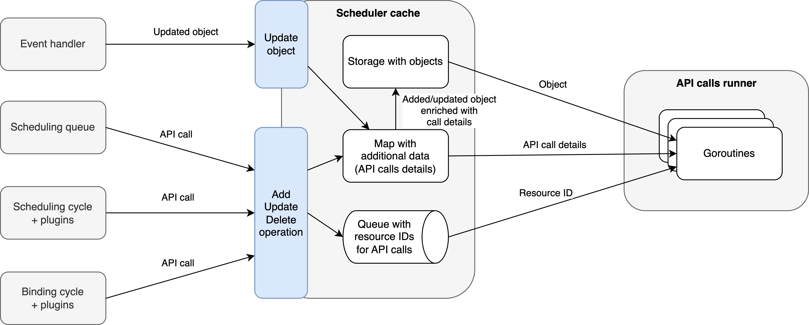

# KEP-5229: Asynchronous API calls during scheduling

<!--
A table of contents is helpful for quickly jumping to sections of a KEP and for
highlighting any additional information provided beyond the standard KEP
template.

Ensure the TOC is wrapped with
  <code>&lt;!-- toc --&rt;&lt;!-- /toc --&rt;</code>
tags, and then generate with `hack/update-toc.sh`.
-->

<!-- toc -->
- [Release Signoff Checklist](#release-signoff-checklist)
- [Summary](#summary)
- [Motivation](#motivation)
  - [Goals](#goals)
  - [Non-Goals](#non-goals)
- [Proposal](#proposal)
  - [API calls categorization](#api-calls-categorization)
  - [1: How to handle Pod rescheduling while waiting for the API call to complete](#1-how-to-handle-pod-rescheduling-while-waiting-for-the-api-call-to-complete)
    - [Use advanced queue and don't block the Pod from being scheduled in the meantime](#use-advanced-queue-and-dont-block-the-pod-from-being-scheduled-in-the-meantime)
  - [2: What component should handle the API calls](#2-what-component-should-handle-the-api-calls)
    - [2.1: Make the API calls queued in a separate component](#21-make-the-api-calls-queued-in-a-separate-component)
    - [2.2: Send API calls through a kube-scheduler's cache](#22-send-api-calls-through-a-kube-schedulers-cache)
  - [Notes/Constraints/Caveats (Optional)](#notesconstraintscaveats-optional)
  - [Risks and Mitigations](#risks-and-mitigations)
    - [Asynchronous API call failure](#asynchronous-api-call-failure)
    - [Object updated by an external component causing a race with the scheduler](#object-updated-by-an-external-component-causing-a-race-with-the-scheduler)
    - [API calls added at a higher rate than execution rate leading to memory explosion](#api-calls-added-at-a-higher-rate-than-execution-rate-leading-to-memory-explosion)
    - [Pod is retried based on an old object](#pod-is-retried-based-on-an-old-object)
- [Design Details](#design-details)
  - [Proposal C: Create a separate component managing API calls, but treat the cache as a middleware](#proposal-c-create-a-separate-component-managing-api-calls-but-treat-the-cache-as-a-middleware)
  - [Summary of API call management](#summary-of-api-call-management)
    - [Enqueueing a new API call](#enqueueing-a-new-api-call)
    - [Enqueueing another API call for the same object](#enqueueing-another-api-call-for-the-same-object)
    - [Receiving object update through event handlers](#receiving-object-update-through-event-handlers)
    - [Executing the API call](#executing-the-api-call)
    - [Enqueueing an API call while a previous one is in-flight](#enqueueing-an-api-call-while-a-previous-one-is-in-flight)
    - [Waiting for the API call to finish](#waiting-for-the-api-call-to-finish)
    - [Retrying API calls](#retrying-api-calls)
  - [Test Plan](#test-plan)
      - [Prerequisite testing updates](#prerequisite-testing-updates)
      - [Unit tests](#unit-tests)
      - [Integration tests](#integration-tests)
      - [e2e tests](#e2e-tests)
  - [Graduation Criteria](#graduation-criteria)
    - [Alpha](#alpha)
    - [Beta](#beta)
    - [GA](#ga)
  - [Upgrade / Downgrade Strategy](#upgrade--downgrade-strategy)
  - [Version Skew Strategy](#version-skew-strategy)
- [Production Readiness Review Questionnaire](#production-readiness-review-questionnaire)
  - [Feature Enablement and Rollback](#feature-enablement-and-rollback)
  - [Rollout, Upgrade and Rollback Planning](#rollout-upgrade-and-rollback-planning)
  - [Monitoring Requirements](#monitoring-requirements)
  - [Dependencies](#dependencies)
  - [Scalability](#scalability)
  - [Troubleshooting](#troubleshooting)
- [Implementation History](#implementation-history)
- [Drawbacks](#drawbacks)
- [Alternatives](#alternatives)
    - [1.1: Handle API calls in the scheduling queue](#11-handle-api-calls-in-the-scheduling-queue)
    - [1.2: Handle API calls in the handleSchedulingFailure](#12-handle-api-calls-in-the-handleschedulingfailure)
    - [2.1: Just dispatch goroutines](#21-just-dispatch-goroutines)
  - [Alternative design proposals](#alternative-design-proposals)
    - [Proposal A: Create a separate component managing API calls](#proposal-a-create-a-separate-component-managing-api-calls)
    - [Proposal B: Make a scheduler's cache managing API calls](#proposal-b-make-a-schedulers-cache-managing-api-calls)
- [Infrastructure Needed (Optional)](#infrastructure-needed-optional)
<!-- /toc -->

## Release Signoff Checklist

Items marked with (R) are required *prior to targeting to a milestone / release*.

- [x] (R) Enhancement issue in release milestone, which links to KEP dir in [kubernetes/enhancements] (not the initial KEP PR)
- [x] (R) KEP approvers have approved the KEP status as `implementable`
- [x] (R) Design details are appropriately documented
- [x] (R) Test plan is in place, giving consideration to SIG Architecture and SIG Testing input (including test refactors)
  - [ ] e2e Tests for all Beta API Operations (endpoints)
  - [ ] (R) Ensure GA e2e tests meet requirements for [Conformance Tests](https://github.com/kubernetes/community/blob/master/contributors/devel/sig-architecture/conformance-tests.md) 
  - [ ] (R) Minimum Two Week Window for GA e2e tests to prove flake free
- [x] (R) Graduation criteria is in place
  - [ ] (R) [all GA Endpoints](https://github.com/kubernetes/community/pull/1806) must be hit by [Conformance Tests](https://github.com/kubernetes/community/blob/master/contributors/devel/sig-architecture/conformance-tests.md) 
- [x] (R) Production readiness review completed
- [x] (R) Production readiness review approved
- [ ] "Implementation History" section is up-to-date for milestone
- [ ] User-facing documentation has been created in [kubernetes/website], for publication to [kubernetes.io]
- [ ] Supporting documentation—e.g., additional design documents, links to mailing list discussions/SIG meetings, relevant PRs/issues, release notes

<!--
**Note:** This checklist is iterative and should be reviewed and updated every time this enhancement is being considered for a milestone.
-->

[kubernetes.io]: https://kubernetes.io/
[kubernetes/enhancements]: https://git.k8s.io/enhancements
[kubernetes/kubernetes]: https://git.k8s.io/kubernetes
[kubernetes/website]: https://git.k8s.io/website

## Summary

This KEP proposes making all API calls during scheduling asynchronous, by introducing a new kube-scheduler-wide way of handling such calls.

## Motivation

Scheduling performance is crucial. One of the bottlenecks is the API calls done during the scheduling cycle. 
The binding cycle is already asynchronous, but it would still be beneficial to re-evaluate whether the current model of busy-waiting goroutines is good long-term.

Making one universal approach for handling API calls in the kube-scheduler could allow these calls to be consistent and better control the number of dispatched goroutines.
Already asynchronous calls could also be migrated to this approach.

### Goals

- P0: Make the scheduling cycle free of blocking API calls, i.e., make all API calls asynchronous.
- P0: Make the solution extendable for custom/future use cases.
- P1: Skip some types of updates if they soon become irrelevant by consecutive updates.

### Non-Goals

- Prioritize high-importance updates (like binding) over low-importance ones if updates to the kube-apiserver get throttled.
- Change how the already asynchronous procedures, such as the binding cycle or asynchronous preemption goroutines, actually work.
  They should remain asynchronous and continue to wait for the API calls to finish before proceeding.
  Any further refinements to these stages could be added in future revisions of this KEP or in the separate ones.

## Proposal

There are a few ways to make API calls asynchronous.
They are introduced below to facilitate discussion and identify the most suitable solution.

These questions have to be answered:
1) How to handle Pod rescheduling while waiting for the API call to complete
2) What component should handle the API calls

Also, races (collisions) between multiple API calls for a single object should be mitigated by the design.

Note that this KEP focuses on making individual API calls asynchronous. Some procedures, such as the binding cycle or asynchronous preemption,
will still be separate goroutines with the ability to wait for the (async) API calls to finish.
This way, dependencies between calls that rely on each other won't need to be implemented.

### API calls categorization

Before selecting the best approach, the kube-scheduler's API calls have to be analyzed against the goals.
The following operations involve API calls during the main scheduling cycle and have to be made asynchronous (1st goal):

1) Updating a Pod status in `handleSchedulingFailure` when a Pod is unschedulable.
2) [Feature proposal: [#130668](https://github.com/kubernetes/kubernetes/issues/130668)] Updating the status of a Pod that is rejected by the `PreEnqueue` plugins in the scheduling queue.

These API calls are already asynchronous in their own ways:

3) [Feature proposal: [KEP-5278](https://github.com/kubernetes/enhancements/issues/5278)] Set `nominatedNodeName` in delayed binding scenarios.
4) Preemption - `ClearNominatedNodeName` and Pod eviction (made asynchronous by [KEP-4832](https://github.com/kubernetes/enhancements/issues/4832)).
5) Pod binding - is in the asynchronous binding phase.

All three of the above API calls could be migrated to the new mechanism.

In-tree plugins' operations that involve non-Pod API calls during scheduling and could be made asynchronous
(but don't have to be supported from the very beginning):

6) Volume binding - is in the `PreBind` phase, hence asynchronous.
7) DRA ResourceClaim deallocating in `PostFilter`.
8) DRA removing `ReservedFor` in `Unreserve`.
9) DRA ResourceClaims binding - is in the `PreBind` phase, hence asynchronous.
10) [Feature proposal: [KEP-5004](https://github.com/kubernetes/enhancements/issues/5278)] Extended resource feature will add `ResourceClaim` creation API call to the `PreBind` phase.
11) Other potential DRA features.

API calls relevance order in which they could cancel less relevant calls for the same Pod (3rd goal):

- Pod deletion caused by preemption (4) should cancel all Pod-based API calls for such a Pod.
- Pod binding (5) should cancel Pod status update API calls (1 - 3), because they are no longer relevant.
- Updating Pod status (1, 2) and setting `nominatedNodeName` (3) should cancel previous such updates.
  Both are calls to the `status` subresource of a Pod, so they should overwrite (merge) the previous calls properly
  when the newest status is stored in-memory.
- API calls for non-Pod resources (6 - 11) should be further analyzed as they are not likely to consider the Pod-based API calls,
  hence implementing those shouldn't block making (1 - 2) calls asynchronous.

There is no need to send two API calls for one Pod, because more relevant calls should override less relevant ones,
and status updates can be combined into one call.
There is no scenario in which two API calls, but for different Pods, or even **any** two API calls that do not involve the same object,
should be canceled or merged, so the relevance order between them should not be analyzed.

In terms of API call priority, the order might be different (non-goal, but considered):

- Pod binding (5) should have the highest priority as this is the main purpose of the kube-scheduler.
- Pod deletion caused by preemption (4) should also be important to free up space for high-priority Pods.
- Updating Pod status (1, 2) could be less important and called if there is space for it.
  It's worth considering if setting `nominatedNodeName` (3) should have the same priority or higher,
  because the higher delay might affect other components like Cluster Autoscaler or Karpenter.
- API calls for non-Pod resources (6 - 11) could be analyzed case by case, but are likely equally important to (5) or (4).

### 1: How to handle Pod rescheduling while waiting for the API call to complete

There are multiple possible ways to handle such API calls, especially for Pod status updates.
Other (potential) use cases should also be considered when choosing the solution.
Three ways were analyzed, but the non-blocking approach, presented below, was selected.

#### Use advanced queue and don't block the Pod from being scheduled in the meantime

This approach allows the Pod to enter the scheduling queue and be scheduled again even before the status update API call completes, without blocking it.
This requires implementing advanced logic for queueing API calls in the kube-scheduler and migrating **all** Pod-based API calls done during scheduling to this method,
including the binding API call. The new component should be able to resolve any conflicts in the incoming API calls and cluster status updates as well as parallelize them properly,
e.g., don't parallelize two updates of the same Pod. This requires [making the API calls queued in a separate component](#21-make-the-api-calls-queued-in-a-separate-component) or
[sending API calls through a kube-scheduler's cache](#22-send-api-calls-through-a-kube-schedulers-cache), presented below, to be implemented.

All Pod-based scenarios (1 - 5) could and should be implemented when choosing this approach.
Still, a single error reporting path for Pod condition updates could be considered but wouldn't be required.

Pros:
- Allows the Pod to be scheduled again even before the API call completes, which could reduce end-to-end Pod startup latency.
- Simplifies introducing new API calls to the kube-scheduler assuming the collision handling logic is implemented correctly.

Cons:
- Requires implementing complex, advanced queueing logic.
- Necessitates migrating **all** Pod-based API calls to this method, but introduces unification, which could be desirable.
- Implementing collision resolution (e.g., for same-Pod updates) is complex, but could allow optimizing the number of API calls overall.

### 2: What component should handle the API calls

Another thing worth considering is how to indeed make the API calls asynchronous and which component should be responsible for this.
Two alternatives were considered. Ultimately, both contributed to the design of the final architecture,
which consists of both queueing and caching approaches.

#### 2.1: Make the API calls queued in a separate component

To make asynchronous dispatching more advanced, a queueing in a separate component approach could be explored.
A new component might understand what the API calls are intended to do and eventually delay, skip, or merge them,
e.g., don't set `nominatedNodeName` when Pod binding is enqueued.
Initially, it could be a framework, which might be extended in the future, e.g., by introducing the possibility of setting delays.

If two update API calls for the same Pod are enqueued the merging mechanism should be introduced to handle such case.
See [API calls categorization](#api-calls-categorization) for more details.

Pros:
- Allows for advanced goroutine dispatching logic.
- Can potentially delay, skip, or merge API calls based on type (e.g., skip `nominatedNodeName` if binding is pending).
- All collisions could be resolved at the new component level, not relying on higher-level mechanisms.
- Allows supporting all scenarios without additional structures.
- Provides a framework that can be extended in the future.

Cons:
- Requires complex logic to handle potential conflicts between different update types for the same Pod.
- Needs a clear strategy for how to update the in-memory Pod object during scheduling.
- Requires extra steps to cache the updated objects.

#### 2.2: Send API calls through a kube-scheduler's cache

A second approach could be to have a consistent Pod state in the kube-scheduler itself first and then change it through the API.
This means that all API calls would have to go through the kube-scheduler's cache, change the Pod there, and after that, execute.
However, Pod updates might come from outside the kube-scheduler, e.g., a user changes the spec or another component changes the status.
This extended cache would have to merge the internal state of the Pod with the external state,
including the Pod update made by the kube-scheduler that will come as an event as well.
Now, the Pod object stored in the cache is based only on events that come to the kube-scheduler.

Another thing to think of is that the cache stores only the bound Pods. The rest of the Pods are stored in the scheduling queue,
so once again, API calls might need to go through the scheduling queue itself.

The cache proposal would still need to reuse some ideas of the first approach to achieve merging or skipping API calls.

Pros:
- Aims for a consistent internal state of the Pod within the kube-scheduler before calling the API, possibly simplifying conflict resolution.
- Allows for advanced goroutine dispatching logic.
- All collisions could be resolved at the cache, not relying on higher-level mechanisms.
- Can potentially delay, skip, or merge API calls based on type (e.g., skip `nominatedNodeName` if binding is pending),
  but merging would be possible if it stores additional data (what fields should be updated, etc.).

Cons:
- Requires the cache to handle and merge updates coming from both the kube-scheduler's internal actions and external API events.
- The cache currently only stores bound Pods, requiring integration with the scheduling queue for pending Pods.
- Complex logic is needed to handle external updates arriving while an internal update is pending or in progress.

### Notes/Constraints/Caveats (Optional)

<!--
What are the caveats to the proposal?
What are some important details that didn't come across above?
Go in to as much detail as necessary here.
This might be a good place to talk about core concepts and how they relate.
-->

### Risks and Mitigations

#### Asynchronous API call failure

When an asynchronous API call fails, the caller should be able to handle this.
This can be done by using an `OnFailure` channel that passes the error, allowing callers to react accordingly.
For current API calls, this will be enough - updating Pod status failures are already unhandled (only logged), so this KEP won't make that situation worse.
However, more graceful handling, such as retries, could be added in the future.

It could be riskier when previous calls were skipped or overwritten and a subsequent call fails.
This results in losing previous decisions (outside the kube-scheduler) as well as the last change not being applied externally.
This should still be handled correctly, as a failed binding will result in applying a failed Pod status anyway,
and a Pod with binding canceled because of deletion (preemption) could still be retried.
Nevertheless, this risk should be taken into consideration when extending feature usage in the future and should be properly documented in the code.

Another aspect is caching: applying a change to a cache should be reversible.
This could be done by storing two versions of an object (like in AssumeCache) and restoring the older version in case of a failure.
However, for basic usage, this won't be required for Pod-based API calls.

#### Object updated by an external component causing a race with the scheduler

If a single field can be updated by both the scheduler and another component, making the update API call asynchronous might extend the race window.
One such case is the `NominatedNodeName` use case, extended by [KEP-5278](https://github.com/kubernetes/enhancements/issues/5278).

However, in this KEP, we assume that the default kube-scheduler should have precedence when applying updates to objects (Pods),
and any custom logic could be implemented by changing the default if needed.

#### API calls added at a higher rate than execution rate leading to memory explosion

As pending API calls will be stored in the scheduler, slower processing of these calls, while maintaining a high frequency of additions, might result in significant memory usage.
This can already occur, for example, when many Pods are waiting to be bound simultaneously.
However, if it turns out to be a real problem, a timeout could be added to the API call that will limit the time the call might spend in the queue, discarding it afterward.

#### Pod is retried based on an old object

Since a Pod won't be blocked from retrying scheduling when an status update API call for that Pod is being executed, it might enter the next scheduling cycle before the call completes.
However, the `PodScheduled` condition is not used during scheduling, and `NominatedNodeName` is reflected in the `nominator`, so having an outdated Pod object won't cause any harm.
Still, any future use cases might introduce issues here, so caching the updates could be considered to fully mitigate this risk.

#### Out-of-tree plugins start using asynchronous API calls framework

The framework should be designed to handle such custom use cases, but it should be explicitly documented what capabilities are allowed (and supported) for out-of-tree plugins.
For example, adding a new Pod-based API call might require changes in the original implementations.
Not all use cases might be covered by the first release of this feature, but eventually, they should be fully supported and documented accordingly.

## Design Details

This section describes the most important design details. Three proposals based on the above ideas that combine queueing, caching,
and a separate component for managing API calls were considered. Ultimately, proposal C was selected,
and the details of proposals A and B can be found in the [alternative design proposals](#alternative-design-proposals) section at the end of the KEP.
Specifically, see [proposal A](#proposal-a-create-a-separate-component-managing-api-calls) for the proposed `APIQueue` structure.

### Proposal C: Create a separate component managing API calls, but treat the cache as a middleware


This proposal combines the strengths of proposals A and B by making a cache a middleware between scheduling/binding cycles, plugins, and event handlers.
This way, we could achieve the cache advantages of proposal B, while also allowing multiple caches to coexist.
Direct API queue operations would still be possible (e.g., for some out-of-tree plugins that don't need to cache any object).

The `APIQueue` design from proposal A could be largely reused in this approach. If an object needs to be modified, it would first go through the cache,
then be added to the API queue, and, based on the result, properly stored in the cache. This decoupled approach would allow adding a `StatusUpdateCall` through the scheduler's cache,
but for example, a `ResourceClaimUpdate` could go through the DRA manager, simplifying the adaptation of this KEP.

This proposal could be implemented as a second step extension of proposal A.

### Summary of API call management

Below is a summary of the steps in API call management that would be introduced by the proposals above.

#### Enqueueing a new API call

Having a separate component (`APIQueue` in proposal A and partially C) would make the API calls explicit to the caller by directly calling `Add()` on the `APIQueue`.
This means it will be visible from the scheduler or plugins that an API call will be sent, and various options could be easily passed.

Using a cache (proposal B and C), the API call will be hidden and executed implicitly when needed, based on the cache's internal logic.
It's questionable how to pass some options to the API call, e.g., an `OnFinish` channel or additional metadata. Error handling might also be less verbose for the caller.

Updating a cache with API call details would be similar across all proposals. Given the details, it would be possible to know precisely which fields will be updated by the API call.
Some `Update()` method could then apply these changes to an object, and the result could be stored in the cache. If any future update appears, it will be routed similarly.

In all proposals, if there isn't any API call already enqueued for a given object, its UID will be added to the queue that will later be consumed by the API calls runner.
In other scenarios, more advanced logic will be required. See the section below for more details.

#### Enqueueing another API call for the same object

Another API call for the same object could be enqueued, while the previous one is still waiting to be executed.
Based on API calls categorization, some updates might need to be merged. This logic has to be implemented and could be achieved similarly for all three proposals.
In general, given the API calls categorization, the calls could be simply merged by overwriting the details with the new ones, if applicable.
For `StatusUpdateCall`, merging will check if the `NominatedNodeName` or Pod condition changed and then overwrite these fields accordingly.

Skipping or overwriting less or more important API calls could be done by configuring an importance value for each `CallType`
and then making a decision based on comparison while adding a new API call. Not all API calls would need to implement their merging strategy.
Merging should also allow deciding if the API call should be removed from the queue when the update reverts a previous one that wasn't executed yet.

In proposal A and C, the merging strategy (`Merge()` method in `APICall`) would implement this merging logic.
In proposal B, some other configurable method would need to be designed to implement this.

Merging, overwriting, or skipping a call could get more complicated if the previous API call is already in flight.
See the [enqueueing an API call while a previous one is in-flight](#enqueueing-an-api-call-while-a-previous-one-is-in-flight) section for more details.
In proposal B, setting the merging strategy might be more complicated and could require providing custom logic through some interfaces.

#### Receiving object update through event handlers

An object might get updated or deleted externally in the meantime, while some API call is enqueued for the same object.
One such scenario might be setting `NominatedNodeName` by an external component (see [KEP-5278](https://github.com/kubernetes/enhancements/issues/5278)).
For Pod status updates themselves, making an update based on the old object wouldn't cause trouble,
because of the strategic merge patch used – it will just overwrite the Pod condition or `NominatedNodeName` if needed.
It is assumed that the scheduler should overwrite all such updates according to the actual needs,
and if it's not expected, custom logic could always be added using an `APICall` interface.

However, to support other potential use cases and have the newest object possible in the cache (proposals B and C, and optionally A),
merging the object received by event handlers with API call details should also be added.
It would work similarly to updating a cache in the section above.

It also should be defined how to handle such external updates if the API call is completed and the scheduler is waiting for the update to come in event handlers.
The `ResourceVersion` of the object could be used to distinguish it, i.e., apply the API call details
as long as the `ResourceVersion` of the received object is older than the version returned by the update API call.

#### Executing the API call

In all three proposals, executing the API call could be done by having a goroutine (API calls runner) that will check if there is any goroutine available in the pool
(could be a configurable number) and it will try to fetch the first resource ID from a queue. Then, in the new goroutine, the API call for this resource will be executed, and after it completes,
it will be freed for the next call.

#### Enqueueing an API call while a previous one is in-flight

One other possible scenario occurs when an API call is executing (is in-flight) and a new API call for the same object is added.
If both calls have the same type, standard merging logic could be applied. This involves adjusting the new API call with the in-flight call's details
to reflect the changes that are already in-flight and avoid repeating them in the next call
(note that the in-flight call should still be stored in the map with details, but not in the queue with resource IDs).

#### Waiting for the API call to finish

In some use cases, the caller would like to wait for the asynchronous API call to finish.
This could be achieved by passing an `OnFinish` channel along with the call that will receive the API call result (nil or error).
This way, already asynchronous calls like binding can be easily migrated to the new mechanism just by blocking on the call completion,
as binding is already asynchronous. This channel could be easily used with proposal A,
but proposals B and C would require passing it through cache methods, which could be less readable.

#### Retrying API calls

As API calls are getting overwritten or skipped, failure of one call might end up in losing multiple operations.
That's why, for retryable errors, it should be possible to re-enqueue the API call and try it again soon
Such logic could be explored, but having an `OnFinish` channel and handling errors by the caller should be enough for the actual use cases.

For example, if a binding API call fails, the binding cycle procedure for that Pod will be notified via the `OnFinish` channel.
It will then invoke a failure handler that re-adds the Pod to the scheduling queue to retry.

If no procedure tracks the `OnFinish` handler of a call (e.g., for a status update), the error will be unhandled (only logged).
This aligns with the current implementation, and status updates aren't critical enough to implement more advanced retry logic.
Update conflicts also won't be an issue for status updates, as a strategic merge patch is used,
and the update will overwrite a condition and `NominatedNodeName` if a conflict occurs.

### Test Plan

[x] I/we understand the owners of the involved components may require updates to
existing tests to make this code solid enough prior to committing the changes necessary
to implement this enhancement.

##### Prerequisite testing updates

##### Unit tests

<!--
In principle every added code should have complete unit test coverage, so providing
the exact set of tests will not bring additional value.
However, if complete unit test coverage is not possible, explain the reason of it
together with explanation why this is acceptable.
-->

<!--
Additionally, for Alpha try to enumerate the core package you will be touching
to implement this enhancement and provide the current unit coverage for those
in the form of:
- <package>: <date> - <current test coverage>
The data can be easily read from:
https://testgrid.k8s.io/sig-testing-canaries#ci-kubernetes-coverage-unit

This can inform certain test coverage improvements that we want to do before
extending the production code to implement this enhancement.
-->

- `pkg/scheduler`: `2025-06-09` - `69.6%`
- `pkg/scheduler/backend/cache`: `2025-06-09` - `85.7%`

##### Integration tests

<!--
Integration tests are contained in k8s.io/kubernetes/test/integration.
Integration tests allow control of the configuration parameters used to start the binaries under test.
This is different from e2e tests which do not allow configuration of parameters.
Doing this allows testing non-default options and multiple different and potentially conflicting command line options.
-->

<!--
This question should be filled when targeting a release.
For Alpha, describe what tests will be added to ensure proper quality of the enhancement.

For Beta and GA, add links to added tests together with links to k8s-triage for those tests:
https://storage.googleapis.com/k8s-triage/index.html
-->

- [`k8s.io/kubernetes/test/integration/schedule`](https://github.com/kubernetes/kubernetes/tree/master/test/integration/scheduler)
  - Modify and add test cases covering the feature (with feature flag enabled and disabled), including handling unschedulable pods, preemption and binding.
- [scheduler_perf](https://github.com/kubernetes/kubernetes/tree/master/test/integration/scheduler_perf) 
  - Add test cases measuring performance of scenarios that use asynchronous API calls (with feature flag enabled and disabled).
  - Performance improvement should be visible for `Unschedulable` test case.

##### e2e tests

The feature is scoped within the kube-scheduler internally, so there is no interaction between other components.
The whole feature should be already covered by integration tests.

### Graduation Criteria

#### Alpha

N/A

#### Beta

- Implement a feature behind a feature flag and enable it by default.
- Migrate all Pod-based API calls done during scheduling and binding to the asynchronous version.
- Implement all tests from [Test Plan](#test-plan).

#### GA

- Gather feedback from users and fix reported bugs.

### Upgrade / Downgrade Strategy

**Upgrade**

During the beta period, the feature gate `SchedulerAsyncAPICalls` is enabled by default, so users don't need to opt in.
This is a purely in-memory feature for the kube-scheduler, so no special actions are required outside the scheduler.

**Downgrade**

Users need to disable the feature gate.

### Version Skew Strategy

This is a purely in-memory feature for the kube-scheduler, and hence there is no version skew strategy.

## Production Readiness Review Questionnaire

### Feature Enablement and Rollback

###### How can this feature be enabled / disabled in a live cluster?

- [x] Feature gate (also fill in values in `kep.yaml`)
  - Feature gate name: `SchedulerAsyncAPICalls`
  - Components depending on the feature gate: kube-scheduler

###### Does enabling the feature change any default behavior?

Pod scheduling might be retried even if the API call hasn't yet been executed.
For instance, a Pod might be retried before its `PodScheduled` condition is set to `false` (indicating it's unschedulable).
Consequently, external components that would rely on a strict ordering of `applying a condition -> retrying a Pod` might be less informed.

Moreover, some API calls might be canceled. In such cases, if the Pod is bound shortly after,
the `PodScheduled` condition might not be set to `false` at all, as the binding takes precedence.

###### Can the feature be disabled once it has been enabled (i.e. can we roll back the enablement)?

Yes.
The feature can be disabled in Beta version by restarting the kube-scheduler with the feature-gate off.

###### What happens if we reenable the feature if it was previously rolled back?

The kube-scheduler again starts to run API calls asynchronously.

###### Are there any tests for feature enablement/disablement?

Given it's a purely in-memory feature and enablement/disablement requires restarting the component 
(to change the value of the feature flag), having feature tests is enough.

### Rollout, Upgrade and Rollback Planning

###### How can a rollout or rollback fail? Can it impact already running workloads?

The partial failure in the rollout isn't there because the kube-scheduler is the only component to roll out this feature.
But, if upgrading the kube-scheduler itself fails somehow, new Pods won't be scheduled anymore,
while Pods, which are already scheduled, won't be affected in any case.

###### What specific metrics should inform a rollback?

- `pending_async_api_calls` metric is large or growing abnormally
- `async_api_call_execution_total` value with `result` indicating error is large even if there are no issues with kube-apiserver
- `async_api_call_duration_seconds` visibly increased even if there are no issues with kube-apiserver
- `event_handling_duration_seconds` visibly increased
- `scheduling_attempt_duration_seconds` visibly increased

###### Were upgrade and rollback tested? Was the upgrade->downgrade->upgrade path tested?

No. This feature is an in-memory feature of the scheduler
and thus calculations start from the beginning every time the scheduler is restarted.
So, just upgrading it and upgrade->downgrade->upgrade are both the same.

###### Is the rollout accompanied by any deprecations and/or removals of features, APIs, fields of API types, flags, etc.?

No

### Monitoring Requirements

###### How can an operator determine if the feature is in use by workloads?

Check `async_api_call_execution_total`, `async_api_call_duration_seconds` and `pending_async_api_calls`  metrics, and if their values are changing with each processed pod.

###### How can someone using this feature know that it is working for their instance?

N/A

###### What are the reasonable SLOs (Service Level Objectives) for the enhancement?

In the default scheduler, we should see the throughput around 100-150 pods/s ([ref](https://perf-dash.k8s.io/#/?jobname=gce-5000Nodes&metriccategoryname=Scheduler&metricname=LoadSchedulingThroughput&TestName=load)),
and this feature shouldn't bring any regression there.

Based on that `schedule_attempts_total` shouldn't grow less than 100 per second
and `scheduling_algorithm_duration_seconds` in average shouldn't be higher than 10 ms,
if there is a sufficient number of pending pods in the cluster.

###### What are the SLIs (Service Level Indicators) an operator can use to determine the health of the service?

- [x] Metrics
  - Metric name:
    - `async_api_call_execution_total`
    - `async_api_call_duration_seconds` 
    - `pending_async_api_calls` 
    - `scheduling_attempt_duration_seconds`
    - `event_handling_duration_seconds`
    - `pod_scheduling_sli_duration_seconds`
  - Components exposing the metric: kube-scheduler

###### Are there any missing metrics that would be useful to have to improve observability of this feature?

- `async_api_call_execution_total` with `call_type` and `result` labels to indicate how many async API calls with specific `call_type` completed with that `result`.
- `async_api_call_duration_seconds` with `call_type` and `result` labels to indicate how long it took for async API calls with specific `call_type` to complete with that `result`.
- `pending_async_api_calls` with `call_type` label to indicate how many async API calls are enqueued for specific `call_type`.

### Dependencies

###### Does this feature depend on any specific services running in the cluster?

No

### Scalability

###### Will enabling / using this feature result in any new API calls?

No

###### Will enabling / using this feature result in introducing new API types?

No

###### Will enabling / using this feature result in any new calls to the cloud provider?

No

###### Will enabling / using this feature result in increasing size or count of the existing API objects?

No

###### Will enabling / using this feature result in increasing time taken by any operations covered by existing SLIs/SLOs?

Not visibly end-to-end - binding API call could be slightly delayed by routing through the API queue.

###### Will enabling / using this feature result in non-negligible increase of resource usage (CPU, RAM, disk, IO, ...) in any components?

Memory usage within the kube-scheduler might increase due to the queue storing pending API calls.
Memory increase is expected to be linear with the number of pending API calls.

The number of goroutines will also increase to dispatch API calls, which could affect the CPU usage of the kube-scheduler.

###### Can enabling / using this feature result in resource exhaustion of some node resources (PIDs, sockets, inodes, etc.)?

No

### Troubleshooting

<!--
This section must be completed when targeting beta to a release.

For GA, this section is required: approvers should be able to confirm the
previous answers based on experience in the field.

The Troubleshooting section currently serves the `Playbook` role. We may consider
splitting it into a dedicated `Playbook` document (potentially with some monitoring
details). For now, we leave it here.
-->

###### How does this feature react if the API server and/or etcd is unavailable?

If API server is unavailable, the API calls will result in a failure.
Scheduler already handle such cases (retry scheduling in most of them) and this feature should not make a change here.
See [retrying API calls](#retrying-api-calls) section for more details.

###### What are other known failure modes?

Unknown

###### What steps should be taken if SLOs are not being met to determine the problem?

## Implementation History

<!--
Major milestones in the lifecycle of a KEP should be tracked in this section.
Major milestones might include:
- the `Summary` and `Motivation` sections being merged, signaling SIG acceptance
- the `Proposal` section being merged, signaling agreement on a proposed design
- the date implementation started
- the first Kubernetes release where an initial version of the KEP was available
- the version of Kubernetes where the KEP graduated to general availability
- when the KEP was retired or superseded
-->

- 8th Apr 2025: The initial KEP is submitted.

## Drawbacks

<!--
Why should this KEP _not_ be implemented?
-->

## Alternatives

There were other alternatives considered in two topics:
1) Where and how to handle API calls during queueing and scheduling.
2) How to make the API calls asynchronous.

#### 1.1: Handle API calls in the scheduling queue

One possible approach is to send the API calls through a scheduling queue.
This allows delaying putting the pod into `unschedulablePods` after updating the pod.
This prevents race conditions from parallel updates of a single pod because, during the API call,
the pod is in-flight and thus not eligible for rescheduling.

A new method could be added to the `PriorityQueue`, which will take the function to be called asynchronously.
It should also make sure the pod is stored in `inFlightPods` to register the cluster events that will happen during the asynchronous part.
Calling `AddUnschedulableIfNotPresent` at the end ensures there won't be any race with the asynchronous pod update.
Because the pod would need to be in `inFlightPods` during the API call, the size of `inFlightEvents` might increase,
but as long as the API call executes quickly, there won't be a significant memory pressure.

Example solution could look like:

```go
// Author: @sanposhiho
func (p *PriorityQueue) AddUnschedulableAsync(pInfo *framework.QueuedPodInfo, fn func() error) {
	// Make sure the Pod is in inFlightPods before starting the goroutine

	go func() { // Or another way of dispatching
		// Run fn first 
		if err := fn(); err != nil { ... }

		// Push the pod back to the unschedQ after completing fn().
		p.AddUnschedulableIfNotPresent(...)
	}()
}
```

This way, we could cover pod status updates during the failure handler (1) and pod status updates for `PreEnqueue` plugins (2).
Asynchronous preemption (4) could be migrated to this approach by adding a possibility to return a function from `PostFilter` plugins in `PostFilterResult`
and calling this function probably in the failure handler together with the status update.

However, this method cannot be used for setting the `nominatedNodeName` scenario (3) because this operation occurs in the successful scheduling as well.
Therefore, additional effort would have to be made to specifically ensure that the `nominatedNodeName` doesn't collide with a potential status update.
Probably, before this status update in the failure handler, the code should try to cancel the set `nominatedNodeName` API call or wait until it finishes.
After that, it should proceed with setting the unschedulable status via the API. The binding call might similarly need to wait.

Another aspect to consider is how to dispatch the goroutines, as discussed in [how to make the API calls asynchronous](#2-how-to-make-the-api-calls-asynchronous) section.

Pros:
- Allows delaying putting unschedulable pods back to the queue until the API update completes.
- Prevents race conditions for parallel updates of a single pod by delaying the `AddUnschedulableIfNotPresent` call.
- Can easily cover status updates for both scheduling failures and `PreEnqueue` failures.
- Asynchronous preemption could be migrated to this approach, increasing consistency.

Cons:
- Handling of failures might not be consistent, requiring `AddUnschedulableAsync` to be called in two places.
- Delaying the `AddUnschedulableAsync` call increases pod queuing latency because the initial backoff timestamp is set there.
- Cannot be used for the `nominatedNodeName` scenario, requiring additional effort and separate handling.
- Might visibly increase the size of `inFlightEvents` if API calls are slow or if there are many calls.


#### 1.2: Handle API calls in the handleSchedulingFailure

Another approach could be to make all unschedulable status update API calls within `handleSchedulingFailure`.
This would make this handler the only error reporting path. Synchronous API calls within this handler could be made asynchronous,
but additional effort would be needed to prevent race conditions. This could be achieved by blocking the retries of the pod using `PreEnqueue`
(similar to asynchronous preemption) or by implementing advanced queueing logic.

This way, again, we could cover pod status updates during the failure handler (1),
but pod status updates for `PreEnqueue` plugins (2) will require more refactoring by either:
- Running a simplified scheduling cycle for pods that were rejected by the `PreEnqueue` to update the pod condition.
  This might negatively impact scheduling performance because a portion of the scheduling cycles will be spent for pods that are ultimately unschedulable
  Moreover, `PreEnqueue` plugins might also need to be called within this simplified scheduling cycle, 
  or alternatively, `PreFilter` plugins could implement the necessary PreEnqueue logic, duplicating it.
- Calling `handleSchedulingFailure` directly from the scheduling queue when a pod is rejected by the `PreEnqueue`. 
  This might be feasible, although it would create a circular dependency between the scheduling queue and the handler;
  however, it wouldn't have the same performance implications as the solution above.

Asynchronous preemption could also be migrated to this approach by exposing a function,
provided that the blocking behavior in `PreEnqueue` is consistent with the actual preemption blocking mechanism.

Again, for setting the `nominatedNodeName` scenario (3), this method cannot be used because this operation occurs in the successful scheduling as well. 
Therefore, additional effort would have to be made to specifically ensure that the `nominatedNodeName` doesn't collide with a potential status update.

Pros:
- Makes the failure handler the single path of reporting unschedulable status errors.
- Asynchronous preemption could potentially be migrated to this approach, increasing consistency.
- Pod would be immediately put into the scheduling queue, starting the backoff timer right away.

Cons:
- Requires additional effort to prevent race conditions for updates.
- Handling PreEnqueue rejections requires significant refactoring (implementing a `simplified scheduling cycle or direct `handleSchedulingFailure` call).
  - Simplified scheduling cycle for `PreEnqueue` rejections could impact performance and duplicate `PreEnqueue` logic.
  - Direct `handleSchedulingFailure` call would introduce circular dependency.
- Cannot be used for the `nominatedNodeName` scenario, requiring additional effort and separate handling.


#### 2.1: Just dispatch goroutines

With appropriate handling of races during updates, we could just dispatch goroutines with API calls.
A potential drawback is that we won't limit the number of these goroutines and won't be able to, e.g., delay the calls.
Limiting goroutines could still be easily achieved by having some group with a limited number of goroutines and a simple queue that will store pending calls.
Some delay might potentially appear due to side effects, especially when there will be problems with the kube-apiserver,
so some higher-level mechanism such as (1.1) or (1.2) would need to prevent pod update races.

Pros:
- Simple to implement if the appropriate race handling is chosen.
- Can easily be extended with a simple queue and worker pool to limit number of goroutines.

Cons:
- Does not inherently support delaying calls.
- Higher-level mechanisms (like 1.1 or 1.2) would be needed to prevent pod update races.
- `nominatedNodeName` scenario support would require more effort in (1.1) or (1.2).
- Prevents from further optimizations, e.g. can't merge two API calls.

### Alternative design proposals

Three design proposals were considered, but the [proposal C](#proposal-c-create-a-separate-component-managing-api-calls-but-treat-the-cache-as-a-middleware) was selected to be implemented.
Below, another two proposals are presented for comparison.

#### Proposal A: Create a separate component managing API calls


Implementing an API queue could be made by adding a new component to the scheduler that will have to understand the API calls' details
as well as be (potentially) able to modify the cache (see dotted lines in the diagram). This approach would provide an extensible interface and understand the precedence of API calls.
Having a new component on its own would cause the cache to be less informed, i.e., not updated with API calls' details, providing the scheduler with outdated data.
It could be prevented by making an API queue a middleware between the event handler and a cache (dotted lines). This won't have to be fully implemented in the first place (only support a subset of use cases),
but will allow handling multiple cached storages that are currently in the scheduler, i.e., scheduler cache, nominator, DRA manager (`claimTracker`), and volume binding `AssumeCache`.

The interface for the new component could look like the following:

```go
type APICallType string

const (
	StatusUpdateCall APICallType = "status_update"
	BindingCall      APICallType = "binding"
	PreemptionCall   APICallType = "preemption"
	// PVCBinding etc.
)

// APICall describes the API call to be made and store all required data to make the call,
// e.g. fields that should be updated or object to be added/removed.
type APICall interface {
  // CallType returns an API call type. This should be unique across all APICall implementations that could be in the queue at one moment.
	CallType() APICallType
	// UID returns UID of an object that this call is related to
	UID() types.UID
	// Execute makes the actual API call
	Execute(client clientset.Interface) error
	// Merge merges two API calls with the same APICallType into one
	Merge(oldObj APICall) (bool, error)
  
	// Not required from the very beginning:

	// Update updates the obj using APICall details and returns the new version
	Update(obj any) (any, error)
}

type QueuedAPICall struct {
	APICall
	// OnFinish is a channel where the API call result is sent.
	// It allows to synchronize on the call completeness, e.g., in binding
	// and handle its result well.
	OnFinish chan<- error
}

type APIQueue struct {
	...
}

func (aq *APIQueue) Add(apiCall QueuedAPICall) error {
	// If API call for specific UID is already enqueued,
	// check the callType and skip, replace or merge the call depending on precedence.
	...
}

func (aq *APIQueue) Update(obj any) (any, error) {
	// Update the object using API call details if any is enqueued for its UID.
	...
}

func (aq *APIQueue) Run() {
	// Dispatch limited number of goroutines if queue is non empty.
	...
}
```

APIQueue would provide an `Add()` method would would be used to enqueue an API call that has to be executed.
`APICall` would provide all required methods to handle it, especially `Execute()` for running, `Merge()` for merging it with the same call type (e.g. `StatusUpdateCall`) that is already enqueued.
There should be only one `APICall` implementation with the same `CallType` at any given moment (prevented by `APIQueue`), but extending this behavior could be considered in the future.
Supporting a cache would need adding `Update()` method that would take the object and update it with API call details (e.g., set NominatedNodeName in a Pod that will be soon updated by the call).
This updated object could be then stored in the cache, and having the call details would allow to know what fields would need to be changed if any future update occurs before the API call is executed.

#### Proposal B: Make a scheduler's cache managing API calls



This approach differs from the previous one. Instead of creating a separate component, this would reuse the scheduler's cache to handle API calls.
Its advantage would be keeping a consistent state of the updated object in the scheduler and invisibly dispatching API calls if needed.
The largest caveat could be refactoring the scheduler's cache if non-Pod API call would have to be supported - the cache is currently split into multiple, more specialized caches,
i.e., scheduler cache, nominator, DRA manager (`claimTracker`), and volume binding `AssumeCache`. This means that the scheduler's cache might need to be extended by these use cases or
be able to support those custom storage options using some interfaces. Having a cache would still require storing additional metadata (details), similar to proposal A,
required to make the API calls and to be able to handle incoming updates from the event handler properly (store information about what the API call will change and be able to apply them on an updated object).

It would also require adding specialized methods to the cache to consume details needed to merge the calls and objects properly; for instance, the default `UpdatePod` method might not be useful,
because it would be too generic for our use cases. Supporting out-of-tree plugins might also be harder, as it would require making the cache extensible to store some custom objects
and somehow add new methods.


## Infrastructure Needed (Optional)

<!--
Use this section if you need things from the project/SIG. Examples include a
new subproject, repos requested, or GitHub details. Listing these here allows a
SIG to get the process for these resources started right away.
-->
