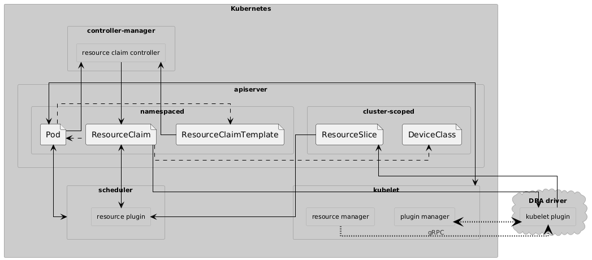
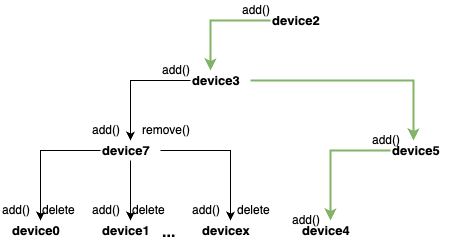

<!--
**Note:** When your KEP is complete, all of these comment blocks should be removed.

To get started with this template:

- [ ] **Pick a hosting SIG.**
  Make sure that the problem space is something the SIG is interested in taking
  up. KEPs should not be checked in without a sponsoring SIG.
- [ ] **Create an issue in kubernetes/enhancements**
  When filing an enhancement tracking issue, please make sure to complete all
  fields in that template. One of the fields asks for a link to the KEP. You
  can leave that blank until this KEP is filed, and then go back to the
  enhancement and add the link.
- [ ] **Make a copy of this template directory.**
  Copy this template into the owning SIG's directory and name it
  `NNNN-short-descriptive-title`, where `NNNN` is the issue number (with no
  leading-zero padding) assigned to your enhancement above.
- [ ] **Fill out as much of the kep.yaml file as you can.**
  At minimum, you should fill in the "Title", "Authors", "Owning-sig",
  "Status", and date-related fields.
- [ ] **Fill out this file as best you can.**
  At minimum, you should fill in the "Summary" and "Motivation" sections.
  These should be easy if you've preflighted the idea of the KEP with the
  appropriate SIG(s).
- [ ] **Create a PR for this KEP.**
  Assign it to people in the SIG who are sponsoring this process.
- [ ] **Merge early and iterate.**
  Avoid getting hung up on specific details and instead aim to get the goals of
  the KEP clarified and merged quickly. The best way to do this is to just
  start with the high-level sections and fill out details incrementally in
  subsequent PRs.

Just because a KEP is merged does not mean it is complete or approved. Any KEP
marked as `provisional` is a working document and subject to change. You can
denote sections that are under active debate as follows:

```
<<[UNRESOLVED optional short context or usernames ]>>
Stuff that is being argued.
<<[/UNRESOLVED]>>
```

When editing KEPS, aim for tightly-scoped, single-topic PRs to keep discussions
focused. If you disagree with what is already in a document, open a new PR
with suggested changes.

One KEP corresponds to one "feature" or "enhancement" for its whole lifecycle.
You do not need a new KEP to move from beta to GA, for example. If
new details emerge that belong in the KEP, edit the KEP. Once a feature has become
"implemented", major changes should get new KEPs.

The canonical place for the latest set of instructions (and the likely source
of this file) is [here](/keps/NNNN-kep-template/README.md).

**Note:** Any PRs to move a KEP to `implementable`, or significant changes once
it is marked `implementable`, must be approved by each of the KEP approvers.
If none of those approvers are still appropriate, then changes to that list
should be approved by the remaining approvers and/or the owning SIG (or
SIG Architecture for cross-cutting KEPs).
-->
# KEP-5254: DRA: Constraints with CEL

<!-- toc -->
- [Release Signoff Checklist](#release-signoff-checklist)
- [Summary](#summary)
- [Motivation](#motivation)
  - [Background](#background)
  - [Goals](#goals)
  - [Non-Goals](#non-goals)
- [Proposal](#proposal)
  - [User Stories](#user-stories)
    - [Allocating ‘connected’ devices](#allocating-connected-devices)
    - [Allocating a slice of connected devices of desired shape](#allocating-a-slice-of-connected-devices-of-desired-shape)
  - [Risks and Mitigations](#risks-and-mitigations)
    - [Runaway expressions](#runaway-expressions)
    - [Performance at scale](#performance-at-scale)
      - [Mitigation](#mitigation)
- [Design Details](#design-details)
  - [Components diagram](#components-diagram)
  - [kube-apiserver Updates](#kube-apiserver-updates)
  - [kube-scheduler Updates](#kube-scheduler-updates)
    - [Non-monotonic constraint evaluation](#non-monotonic-constraint-evaluation)
    - [Existing constraint interface](#existing-constraint-interface)
    - [New add method for celDeviceConstraint](#new-add-method-for-celdeviceconstraint)
    - [New remove method for celDeviceConstraint](#new-remove-method-for-celdeviceconstraint)
  - [Allocation Example](#allocation-example)
- [Test Plan](#test-plan)
  - [Prerequisite testing updates](#prerequisite-testing-updates)
  - [Unit tests](#unit-tests)
  - [Integration tests](#integration-tests)
  - [e2e tests](#e2e-tests)
- [Graduation Criteria](#graduation-criteria)
  - [Alpha](#alpha)
- [Production Readiness Review Questionnaire](#production-readiness-review-questionnaire)
  - [Feature Enablement and Rollback](#feature-enablement-and-rollback)
  - [Rollout, Upgrade and Rollback Planning](#rollout-upgrade-and-rollback-planning)
  - [Monitoring Requirements](#monitoring-requirements)
  - [Dependencies](#dependencies)
    - [DRA driver](#dra-driver)
    - [CEL support](#cel-support)
  - [Scalability](#scalability)
  - [Troubleshooting](#troubleshooting)
- [Implementation History](#implementation-history)
- [Infrastructure Needed (Optional)](#infrastructure-needed-optional)
<!-- /toc -->

## Release Signoff Checklist

<!--
**ACTION REQUIRED:** In order to merge code into a release, there must be an
issue in [kubernetes/enhancements] referencing this KEP and targeting a release
milestone **before the [Enhancement Freeze](https://git.k8s.io/sig-release/releases)
of the targeted release**.

For enhancements that make changes to code or processes/procedures in core
Kubernetes—i.e., [kubernetes/kubernetes], we require the following Release
Signoff checklist to be completed.

Check these off as they are completed for the Release Team to track. These
checklist items _must_ be updated for the enhancement to be released.
-->

Items marked with (R) are required *prior to targeting to a milestone / release*.

- [] (R) Enhancement issue in release milestone, which links to KEP dir in [kubernetes/enhancements] (not the initial KEP PR)
- [] (R) KEP approvers have approved the KEP status as `implementable`
- [x] (R) Design details are appropriately documented
- [x] (R) Test plan is in place, giving consideration to SIG Architecture and SIG Testing input (including test refactors)
  - [ ] e2e Tests for all Beta API Operations (endpoints)
  - [ ] (R) Ensure GA e2e tests meet requirements for [Conformance Tests](https://github.com/kubernetes/community/blob/master/contributors/devel/sig-architecture/conformance-tests.md) 
  - [ ] (R) Minimum Two Week Window for GA e2e tests to prove flake free
- [ ] (R) Graduation criteria is in place
  - [ ] (R) [all GA Endpoints](https://github.com/kubernetes/community/pull/1806) must be hit by [Conformance Tests](https://github.com/kubernetes/community/blob/master/contributors/devel/sig-architecture/conformance-tests.md) 
- [x] (R) Production readiness review completed
- [] (R) Production readiness review approved
- [] "Implementation History" section is up-to-date for milestone
- [ ] User-facing documentation has been created in [kubernetes/website], for publication to [kubernetes.io]
- [ ] Supporting documentation—e.g., additional design documents, links to mailing list discussions/SIG meetings, relevant PRs/issues, release notes

<!--
**Note:** This checklist is iterative and should be reviewed and updated every time this enhancement is being considered for a milestone.
-->

[kubernetes.io]: https://kubernetes.io/
[kubernetes/enhancements]: https://git.k8s.io/enhancements
[kubernetes/kubernetes]: https://git.k8s.io/kubernetes
[kubernetes/website]: https://git.k8s.io/website

## Summary

This KEP defines an extension of the DRA structured parameters KEP #4381 (4381-dra-structured-parameters). 

The original KEP introduced a new API to specify a structured approach for describing resources a pod needs. Typically, such resources are devices like a GPU or other accelerators. The API supports:

* Network-attached devices. The existing device plugin API is limited to hardware on a node.
* Sharing of allocated devices between multiple containers or pods. The device plugin API currently cannot share devices at all. It could be extended to share devices between containers in a single pod, but supporting sharing between pods would need a completely new API similar to the one in this KEP.
* Using a device that is expensive to initialize multiple times in different pods. This is not possible at the moment.
* Custom parameters that describe device configuration. With the current Pod API, annotations have to be used to capture such parameters and then hacks are needed to access them from a CSI driver or device plugin.

The original KEP added support for MatchAttribute constraint, requiring all devices in question to have a specific attribute and that its type and value are the same across those devices. This KEP introduces a new CEL (Common Expression Language) based constraint for device selection. 

As hardware architectures become more complex, workloads need to ensure optimal device allocation based on any topology and connectivity. This KEP defines a new constraint type in the DRA API for describing how devices should be selected based on their relationships with each other. 

This feature is governed by a feature gate DRACELDeviceConstraint in kube-apiserver, kube-controller-manager and kube-scheduler, defaulting to false. 

## Motivation

### Background

DRA supports specifying constraints for device allocation. Currently, it supports the MatchAttribute constraint, which ensures that all selected devices have a specific attribute and the type and value of this attribute are consistent across these devices. This enhancement proposal aims to add a new constraint type that will allow a group of devices to be evaluated against a CEL expression. 

This feature was previously identified as a potential future extension in the original KEP for structured parameters, and this proposal seeks to implement that extension. [Reference](https://github.com/kubernetes/enhancements/blame/b00718dfdb496a2e4180d22312be339f3b1107b0/keps/sig-node/4381-dra-structured-parameters/README.md#L1521)


### Goals

* New API - Facilitate API to let end users specify a CEL expression to select an optimal device set.

* Compatibility - Be compatible with rest of the user experience of DRA - rest of the spec for specifying the ResourceClaim should stay as is.

* Co-exist with MatchAttribute - this new constraint will be defined alongside MatchAttribute constraint. Users can specify zero, one, or both these constraints in their ResourceClaim. Constraints will be evaluated in the order in which they are specified in the ResourceClaim. 

* Support any hardware topology - the CEL expression can be made flexible to any topology, e.g. ring, grid, etc.

### Non-Goals

* This KEP will overtime benefit from CEL enhancements / usability improvements. Currently it will utilize the CEL version already available in the code base and does not aim to bring in any CEL updates. 

* Monotonic evaluation of devices is a non goal. We do not want to assume any order in the way the devices are added to the set being evaluated. We cannot conclude on the evaluation result until the full set is available. 

## Proposal

### User Stories

#### Allocating ‘connected’ devices

As a user, I want to allocate my workloads onto mla (Machine Learning Accelerator) devices, but only require a subset of devices. These devices should be connected to each other. Running my workload on just 4 devices is sufficient. I know that the administrator has created an "mla.example.com" DeviceClass and set up the hardware. The vendor for the device has given me a reference ResourceClaimTemplate to select "connected" set of devices. The hardware uses ring topology where two connected devices / neighbors - have contiguous device ids.

I can create the following Pod and ResourceClaimTemplate:

```
apiVersion: resource.k8s.io/v1beta1
kind: ResourceClaimTemplate
metadata:
  namespace: default
  name: 4-connected-devices
spec:
  spec:
    devices:
      requests:
      - name: mla-request
        deviceClassName: mla.example.com
        allocationMode: ExactCount
        count: 4
      constraints:
      - requests: ["mla-request"]
        cel:
          expression: "size(devices) == 4 && \
             devices.map(d, d.attributes['mla.example.com'].deviceid).max() - \
             devices.map(d, d.attributes['mla.example.com'].deviceid).min() == 3"
---
apiVersion: v1
kind: Pod
metadata:
  namespace: default
  name: pod0
spec:
  containers:
  - name: ctr0
    ...
    resources:
      claims:
      - name: mla
  resourceClaims:
  - name: mla
    resourceClaimTemplateName: 4-connected-devices
```
I know that this will create a ResourceClaim named 4-connected-devices in the default namespace which will give me any 4 contiguous devices. Example output:

```
apiVersion: resource.k8s.io/v1beta1
kind: ResourceClaim
metadata:
  ...
  name: pod0-mla-vvhh9
  namespace: default
spec:
    devices:
      constraints:
      - cel:
          expression: size(devices) == 4 && devices.map(d, d.attributes['mla.example.com'].index).max() - devices.map(d, d.attributes['mla.example.com'].index).min() == 3
        requests:
        - mla-request
      requests:
      - allocationMode: ExactCount
        count: 4
        deviceClassName: mla.example.com
        name: mla-request
  status:
    allocation:
      devices:
        results:
        - device: mla-0
          driver: mla.example.com
          pool: dra-example-driver-cluster-worker
          request: mla-request
        - device: mla-1
          driver: mla.example.com
          pool: dra-example-driver-cluster-worker
          request: mla-request
        - device: mla-2
          driver: mla.example.com
          pool: dra-example-driver-cluster-worker
          request: mla-request
        - device: mla-3
          driver: mla.example.com
          pool: dra-example-driver-cluster-worker
          request: mla-request
    ...
```
The pod will be allocated on the 4 connected devices - mla0, mla1, mla2, and mla3, for example.

#### Allocating a slice of connected devices of desired shape

As a user, I want to allocate my workloads onto mlaExample devices, but only require a subset of devices in a specific shape. These devices should be “connected”. I know that the device topology allows creating a 2x2 connected grid.  Running my workload on just 4 devices is sufficient. The administrator has created an "mla.example.com" DeviceClass and set up the hardware, surfacing attributes like "row" and "col". The vendor for the device has given me a reference ResourceClaimTemplate to select "connected" set of devices of desired shape.

I can create the following Pod and ResourceClaimTemplate:

```
apiVersion: resource.k8s.io/v1beta1
kind: ResourceClaimTemplate
metadata:
  namespace: default
  name: 2x2-device-grid
spec:
  spec:
    devices:
      requests:
      - name: mla-request
        deviceClassName: mla.example.com
        allocationMode: ExactCount
        count: 4
      constraints:
      - requests: ["mla-request"]
        cel:
          expression: "size(devices) == 4 &&
                        devices.all(d,
                            devices.filter(other,
                                d != other &&
                                ((d.attributes["mla.example.com"].row == other.attributes["mla.example.com"].row &&
                                  (d.attributes["mla.example.com"].col == other.attributes["mla.example.com"].col + 1 ||
                                   d.attributes["mla.example.com"].col == other.attributes["mla.example.com"].col - 1)) ||
                                 (d.attributes["mla.example.com"].col == other.attributes["mla.example.com"].col &&
                                  (d.attributes["mla.example.com"].row == other.attributes["mla.example.com"].row + 1 ||
                                   d.attributes["mla.example.com"].row == other.attributes["mla.example.com"].row - 1))
                                )
                            ).size() >= 2
                        )"
---
apiVersion: v1
kind: Pod
metadata:
  namespace: default
  name: pod0
spec:
  containers:
  - name: ctr0
    ...
    resources:
      claims:
      - name: mla
  resourceClaims:
  - name: mla
    resourceClaimTemplateName: 2x2-device-grid
```
I know that this will create a ResourceClaim named 2x2-device-grid in the default namespace, which will have the following output:

```
apiVersion: resource.k8s.io/v1beta1
kind: ResourceClaim
metadata:
  ...
  name: pod0-mla-hlw4p
  namespace: default
spec:
  devices:
    constraints:
    - cel:
        expression: "size(devices) == 4 &&
                        devices.all(d,
                            devices.filter(other,
                                d != other &&
                                ((d.attributes["%[1]s"].row == other.attributes["%[1]s"].row &&
                                  (d.attributes["%[1]s"].col == other.attributes["%[1]s"].col + 1 ||
                                   d.attributes["%[1]s"].col == other.attributes["%[1]s"].col - 1)) ||
                                 (d.attributes["%[1]s"].col == other.attributes["%[1]s"].col &&
                                  (d.attributes["%[1]s"].row == other.attributes["%[1]s"].row + 1 ||
                                   d.attributes["%[1]s"].row == other.attributes["%[1]s"].row - 1))
                                )
                            ).size() >= 2
                        )"
      requests:
      - mla-request
    requests:
    - allocationMode: ExactCount
      count: 4
      deviceClassName: mla.example.com
      name: mla-request
status:
  allocation:
    devices:
      results:
      - device: mla-0
        driver: mla.example.com
        pool: dra-example-driver-cluster-worker
        request: mla-request
      - device: mla-1
        driver: mla.example.com
        pool: dra-example-driver-cluster-worker
        request: mla-request
      - device: mla-5
        driver: mla.example.com
        pool: dra-example-driver-cluster-worker
        request: mla-request
      - device: mla-4
        driver: mla.example.com
        pool: dra-example-driver-cluster-worker
        request: mla-request
    ...
```

The pod will be allocated on the 4 connected devices - mla0, mla1, mla4, and mla5, for example which are connected in the topology of my hardware.

### Risks and Mitigations

#### Runaway expressions

A malicious or buggy workload can specify CEL expressions that degrade the performance of constraint evaluation and scheduling. We will specify a limit on evaluation cost for the expression. There is already a mechanism to cap this today with CEL selectors that we can reuse [Reference](https://github.com/kubernetes/kubernetes/blob/6188e5cb7b2f106b047493b7b498c1882723cab4/pkg/apis/resource/types.go#L910-L933). Additionally, the scheduler supports a configurable timeout during filtering that can limit this evaluation [Reference](https://github.com/kubernetes/kubernetes/pull/132033).

#### Performance at scale

The feature depends on exhaustive search for devices. The worst-case performance impact of calculating all combinations is comparable to that of the pathological test case for existing MatchAttribute constraint. Scalability testing is needed to validate the performance of allocation.

Additionally, with the introduction of [workload-aware scheduling](https://github.com/kubernetes/kubernetes/issues/132192), the performance might take a hit as filtering can be executed multiple times. 

##### Mitigation

To minimize the performance impact, users are recommended to trim down the solution space using existing filtering mechanisms before utilizing this constraint type, i.e. define it in the spec template after mechanisms such as CEL selectors and MatchAttribute. This will limit how many device combinations need to be evaluated. The feature is not expected to reach the scheduler timeout as the combination space has been reduced by previous filtering. 

Note: Users are discouraged from specifying a CEL expression which takes into account the order of devices since this will result in permutational complexity instead of combinational complexity. If users specify expensive queries, it should be noted that the evaluation cost limit and scheduler timeout described earlier will limit the exhaustive search.  

For example, if there are 12 devices to choose from and a user specifies needing 6 of those devices, the maximum number of calculations taken should be: 

12C6 = 12! / (6!)(6!) = 924

If the user specifies an order in which these devices should be evaluated, i.e. set should contain device0 first, then device1, device2, etc., this will result in permutational complexity, and is strongly discouraged. Feature will not work and return an error in this case since it crosses the preset threshold for evaluation cost.

## Design Details

### Components diagram



The following components must be implemented / modified in Kubernetes:

1. kube-apiserver: DeviceConstraint API must be extended to include the new CEL constraint field. Also DeviceConstraint validation logic must be extended. [Reference](https://github.com/kubernetes/kubernetes/blob/6188e5cb7b2f106b047493b7b498c1882723cab4/pkg/apis/resource/validation/validation.go#L317)

2. kube-scheduler: Filter step of the scheduling framework must be modified to evaluate the new CEL constraint. This is done by updating logic for current Allocate workflow.

These changes will impact three core Kubernetes components: kube-apiserver for the API extensions and validation, kube-scheduler for the constraint evaluation logic, and kube-controller-manager for handling ResourceClaimTemplates that use the new constraint type.

### kube-apiserver Updates

The exact set of proposed API changes can be seen below (`...` is used in places where new fields
are added to existing types):
```go
// DeviceConstraint must have exactly one field set besides Requests.
type DeviceConstraint struct {
  ...
  
  // A CEL expression which compares different devices and returns
  // true if they match.
  //
  // +optional
  // +oneOf=ConstraintType
  // +featureGate=DRACELDeviceConstraint
  CEL *CELDeviceConstraint `json:"cel,omitempty" protobuf:"bytes,3,opt,name=cel"`
}
type CELDeviceConstraint struct {
  // Expression is a CEL expression which evaluates a group of devices. It
  // must evaluate to true when the devices under consideration satisfy
  // the desired criteria, and false when they do not. Any other result
  // is an error and causes allocation of devices to abort.
  //
  // The expression's input is an object named "devices", which is a set of
  // "device" objects. The "device" object carries the following properties:
  //  - driver (string): the name of the driver which defines this device.
  //  - attributes (map[string]object): the device's attributes, grouped by prefix
  //    (e.g. device.attributes["dra.example.com"] evaluates to an object with all
  //    of the attributes which were prefixed by "dra.example.com".
  //  - capacity (map[string]object): the device's capacities, grouped by prefix.
  //
  // +required
  Expression string `json:"expression" protobuf:"bytes,1,name=expression"`
}
```

### kube-scheduler Updates

The kube-scheduler is responsible for selecting devices to allocate based on this new CELDeviceConstraint. The scheduler already supports selecting devices according to MatchAttribute - this KEP will extend that to also support CELDeviceConstraint.

#### Non-monotonic constraint evaluation 

Unlike matchAttribute constraint, cel constraint evaluation for devices is not monotonic since the expression needs to be evaluated against full set of devices.

For example, if using monotonic evaluation:

```
Given a CEL constraint to find 4 contiguous devices.

1. device_0 is added to the device set. 
   Constraint is evaluated - no constraints are violated.

2. device_2 is added to the device set. 
   Constraint is evaluated - constraint is violated because 0 and 2 are not contiguous. Aborts
```

In the above example, `device_1` could have been added to the above device set, and the contiguous device constraint would have been satisfied. Since we cannot assume sorted order of the devices, we must ensure devices are evaluated after correct number of devices are added to the device set. 

#### Existing constraint interface

The new constraint needs to implement the below interface that exists in the Allocate workflow:

```go
type constraint interface {
    // add is called whenever a device is about to be allocated. It must
    // check whether the device matches the constraint and if yes,
    // track that it is allocated.
    add(requestName, subRequestName string, device *draapi.BasicDevice, deviceID DeviceID) bool

    // For every successful add there is exactly one matching removed call
    // with the exact same parameters.
    remove(requestName, subRequestName string, device *draapi.BasicDevice, deviceID DeviceID)
}
```
We define celDeviceConstraint which will satisfy the above interface. Internally, it will keep state about devices being evaluated together.

```go
// celDeviceConstraint evaluates the selected set of devices against the given cel expression.
// The evaluation needs to be done once all devices have been added to the set.
type celDeviceConstraint struct {
    logger       klog.Logger 
    requestNames sets.Set[string]
    expression   string
    celCache     *cel.Cache

    devices    []*draapi.BasicDevice
    numDevices int
}
```

#### New add method for celDeviceConstraint

Devices are added to a device set, as long as the number of devices specified in the spec is not met (set in DeviceRequest). Once the number of devices is met, the constraint is evaluated.

```go
// Only evaluate when we have all devices
m.logger.V(7).Info("devices added so far ", "current", len(m.devices), "expected", m.numDevices)
if m.numDevices > len(m.devices) {
    // We haven't collected all devices yet
    m.logger.V(7).Info("Collecting devices", "current", len(m.devices), "expected", m.numDevices)
    return true
}

var deviceList []cel.Device
for _, dev := range m.devices {
    var converted resourceapi.BasicDevice
    if err := draapi.Convert_api_BasicDevice_To_v1beta1_BasicDevice(dev, &converted, nil); err != nil {
        m.logger.Error(err, "Failed to convert device for CEL evaluation")
        return false
    }
    deviceList = append(deviceList, cel.Device{
        Driver:     deviceID.Driver.String(),
        Attributes: converted.Attributes,
        Capacity:   converted.Capacity,
    })
}
```

If the constraint evaluation fails, we remove the last device that was added from the set of devices. This ensures that new combinations of devices can be evaluated.

```go
m.logger.V(7).Info("Evaluating expression %s", m.expression)
matches, details, err := expr.DevicesMatch(context.Background(), deviceList) // DevicesMatch handles CEL expression evaluation
if err != nil {
    m.logger.Error(err, "Expression evaluation failed")
   // remove the last device we added. For others, there will be a remove call
   m.devices = m.devices[:len(m.devices)-1] 
    return false
}

if !matches {
    m.logger.V(7).Info("Devices don't satisfy expression",
        "actualCost", ptr.Deref(details.ActualCost(), 0))
    // remove the last device we added. For others, there will be a remove call
    m.devices = m.devices[:len(m.devices)-1]
    return false
}
```

#### New remove method for celDeviceConstraint

This remove() function is called when devices in the set do not produce an evaluation result of true. Remove is called exactly once for each successfully added device. 

When evaluating the constraint, we evaluate against the whole device set. If the constraint is not met, remove gets called for every successfully added device. In remove method, we remove that specific device from internal state of the evaluator. 

```go
if m.requestNames.Len() > 0 && !m.matches(requestName, subRequestName) {
    return
}

// Find and remove only the specific device from the slice
for i := 0; i < len(m.devices); i++ {
    if m.devices[i] == device { // Compare the actual device pointers
        // Remove this specific device by shifting remaining elements
        copy(m.devices[i:], m.devices[i+1:])
        // Shrink slice by one
        m.devices = m.devices[:len(m.devices)-1]
        break
    }
}

m.logger.V(7).Info("Reset constraint state for re-evaluation")
```

### Allocation Example

Consider a node with 8 devices. We will use a CEL expression constraint to find 4 contiguous devices. The add / remove would work like this: (Note: devices can be added to the device set in any order)



Step by Step:

1. device2 is added to the device set using add() function. Device set is [device2]
    1. Expression not evaluated because # of devices in set == 1, which doesn’t match expected 4.
2. device3 is added. Device set is [device2, device3]
    1. Expression not evaluated
3. device7 is added. Device set is [device2, device3, device7]
    1. Expression not evaluated
4. device0 is added. Device set is [device2, device3, device7, device0]
    1. Requested devices == # of devices in set, expression is evaluated. 
    2. Expression returns false. device0 is deleted from device set. Device set is [device2, device3, device7]
5. Step 4 is repeated for the remaining devices (device1, device4, device5, device6)
6. All devices have been added to device set but expressions returned false (from step 5). Rollback occurs and remove() is called on device7. Device set is [device2, device3]
7. device5 is added. Device set is [device2, device3, device5]
    1. Expression not evaluated.
8. device4 is added. Device set is [device2, device3, device5, device4]
    1. Requested devices == # of devices in set, expression is evaluated. 
    2. Expression returns true. Valid allocation of 4 contiguous devices has been found. 

CELDeviceConstraint algorithm depends on the exhaustive search done by allocator today to run through all combinations of the devices. 

## Test Plan

<!--
**Note:** *Not required until targeted at a release.*
The goal is to ensure that we don't accept enhancements with inadequate testing.

All code is expected to have adequate tests (eventually with coverage
expectations). Please adhere to the [Kubernetes testing guidelines][testing-guidelines]
when drafting this test plan.

[testing-guidelines]: https://git.k8s.io/community/contributors/devel/sig-testing/testing.md
-->

[x] I/we understand the owners of the involved components may require updates to
existing tests to make this code solid enough prior to committing the changes necessary
to implement this enhancement.

### Prerequisite testing updates

None

### Unit tests

<!--
Generated with:

go test -cover ./pkg/apis/resource/validation  ./staging/src/k8s.io/dynamic-resource-allocation/structured | sed -e 's/.*\(k8s.io[a-z/-]*\).*coverage: \(.*\) of statements/- `\1`: \2/' | sort

-->

Unit tests will be added for the `allocator.go` file (scheduler unit tests), and `validation_resourceclaim_test.go` file (API unit tests). We will validate that the existing coverage percentage does not drop due to addition of this feature.

Rough coverage numbers after running current POC code (WIP) are listed below. 

- `k8s.io/dynamic-resource-allocation/cel`: 72.3%
- `k8s.io/dynamic-resource-allocation/structured`: 90.2%
- `k8s.io/kubernetes/pkg/controller/resourceclaim`: 74.2%
- `k8s.io/kubernetes/pkg/kubelet/cm/dra`: 78.4%
- `k8s.io/kubernetes/pkg/kubelet/cm/dra/plugin`: 90.3%
- `k8s.io/kubernetes/pkg/kubelet/cm/dra/state`: 46.2%
- `k8s.io/kubernetes/pkg/scheduler/framework/plugins/dynamicresources`: 79.3%

### Integration tests

<!--
This question should be filled when targeting a release.
For Alpha, describe what tests will be added to ensure proper quality of the enhancement.

For Beta and GA, add links to added tests together with links to k8s-triage for those tests:
https://storage.googleapis.com/k8s-triage/index.html
-->

The scheduler plugin and resource claim controller are covered by the workloads in [test/integration/scheduler_perf/dra/performance-config.yaml](https://github.com/kubernetes/kubernetes/blob/6188e5cb7b2f106b047493b7b498c1882723cab4/test/integration/scheduler_perf/dra/performance-config.yaml). This already supports the MatchAttribute constraint. Here, we can add integration tests for CELDeviceConstraint expressions. These tests will need to examine large scale resource slices for scheduler performance.

### e2e tests

<!--
This question should be filled when targeting a release.
For Alpha, describe what tests will be added to ensure proper quality of the enhancement.

For Beta and GA, add links to added tests together with links to k8s-triage for those tests:
https://storage.googleapis.com/k8s-triage/index.html

We expect no non-infra related flakes in the last month as a GA graduation criteria.
-->

End-to-end testing depends on a working DRA driver and a container runtime with CDI support. 

e2e testing for DRA exists in [test/e2e/dra/dra.go](https://github.com/kubernetes/kubernetes/blob/6188e5cb7b2f106b047493b7b498c1882723cab4/test/e2e/dra/dra.go), which supports testing MatchAttribute constraint. We will update the existing DRA driver to add similar tests for CELDeviceConstraint expressions.


## Graduation Criteria

### Alpha

- Feature implemented behind a feature flag
- Initial e2e tests completed and enabled

## Production Readiness Review Questionnaire

<!--

Production readiness reviews are intended to ensure that features merging into
Kubernetes are observable, scalable and supportable; can be safely operated in
production environments, and can be disabled or rolled back in the event they
cause increased failures in production. See more in the PRR KEP at
https://git.k8s.io/enhancements/keps/sig-architecture/1194-prod-readiness.

The production readiness review questionnaire must be completed and approved
for the KEP to move to `implementable` status and be included in the release.

In some cases, the questions below should also have answers in `kep.yaml`. This
is to enable automation to verify the presence of the review, and to reduce review
burden and latency.

The KEP must have a approver from the
[`prod-readiness-approvers`](http://git.k8s.io/enhancements/OWNERS_ALIASES)
team. Please reach out on the
[#prod-readiness](https://kubernetes.slack.com/archives/CPNHUMN74) channel if
you need any help or guidance.
-->

### Feature Enablement and Rollback

###### How can this feature be enabled / disabled in a live cluster?

- [x] Feature gate (also fill in values in `kep.yaml`)
  - Feature gate name: DRACELDeviceConstraint
  - Components depending on the feature gate:
    - kube-apiserver
    - kube-scheduler
    - kube-controller-manager

Feature gates in kube-apiserver, kube-scheduler, and kube-controller-manager must all be enabled for the feature to work. 

###### Does enabling the feature change any default behavior?

No

###### Can the feature be disabled once it has been enabled (i.e. can we roll back the enablement)?

Yes, through feature gates. If the feature gate is disabled in kube-apiserver, kube-scheduler, or kube-controller-manager, the feature will not work. Existing running Pods continue unaffected. New workloads cannot use the feature, and pod creation will fail if attempting to use the feature. Existing pods that need rescheduling will remain in pending state. Pod description will notify users to enable the feature gate. The reason for not allowing existing pods to re-schedule is because users expect optimal placement for these pods, which cannot happen when the feature is disabled.

###### What happens if we reenable the feature if it was previously rolled back?

Any new incoming workloads will be able to leverage the feature. There will be no impact on running workloads.

###### Are there any tests for feature enablement/disablement?

Tests for apiserver will cover disabling the feature. This primarily matters for the extended ResourceClaimSpec: the new fields must be preserved during updates even when the feature is disabled.

### Rollout, Upgrade and Rollback Planning

<!--
This section must be completed when targeting beta to a release.
-->

###### How can a rollout or rollback fail? Can it impact already running workloads?

<!--
Try to be as paranoid as possible - e.g., what if some components will restart
mid-rollout?

Be sure to consider highly-available clusters, where, for example,
feature flags will be enabled on some API servers and not others during the
rollout. Similarly, consider large clusters and how enablement/disablement
will rollout across nodes.
-->

Workloads not using ResourceClaims should not be impacted.
Workloads not using the feature should not be impacted.
Already running pods should not be impacted.

When a rollout fails, kube-controller-manager fails to create ResourceClaims from ResourceClaimTemplates for workloads using this feature. Those Pods will not get scheduled. Bugs in kube-scheduler might lead to not scheduling Pods that could run or worse, schedule Pods that should not run. 

###### What specific metrics should inform a rollback?

<!--
What signals should users be paying attention to when the feature is young
that might indicate a serious problem?
-->

After enabling the feature, if the `scheduler_pending_pods` metric in the kube-scheduler suddenly increases, then perhaps scheduling no longer works as intended. 

Additionally, if no new pods are created in the cluster, but ` scheduler_pending_pods` metric remains constant, this will indicate that no pods have been scheduled.

###### Were upgrade and rollback tested? Was the upgrade->downgrade->upgrade path tested?

<!--
Describe manual testing that was done and the outcomes.
Longer term, we may want to require automated upgrade/rollback tests, but we
are missing a bunch of machinery and tooling and can't do that now.
-->

This will be done manually before transition to beta by bringing up a KinD cluster with kubeadm and changing the feature gate for individual components.
Validation of API types is covered by unit tests.

###### Is the rollout accompanied by any deprecations and/or removals of features, APIs, fields of API types, flags, etc.?

<!--
Even if applying deprecation policies, they may still surprise some users.
-->

No

### Monitoring Requirements

<!--
This section must be completed when targeting beta to a release.

For GA, this section is required: approvers should be able to confirm the
previous answers based on experience in the field.
-->

###### How can an operator determine if the feature is in use by workloads?

<!--
Ideally, this should be a metric. Operations against the Kubernetes API (e.g.,
checking if there are objects with field X set) may be a last resort. Avoid
logs or events for this purpose.
-->

There will be ResourceClaims with non-empty ResourceClaimSpec.DeviceClaim.CELDeviceConstraint field

We can emit metrics for CEL constraint and match attribute constraint to track feature usage. 

###### How can someone using this feature know that it is working for their instance?

<!--
For instance, if this is a pod-related feature, it should be possible to determine if the feature is functioning properly
for each individual pod.
Pick one more of these and delete the rest.
Please describe all items visible to end users below with sufficient detail so that they can verify correct enablement
and operation of this feature.
Recall that end users cannot usually observe component logs or access metrics.
-->

This feature will be working for their instance if their pod is in a running state, and if the resource claims created reference the cel constraint.

###### What are the reasonable SLOs (Service Level Objectives) for the enhancement?

<!--
This is your opportunity to define what "normal" quality of service looks like
for a feature.

It's impossible to provide comprehensive guidance, but at the very
high level (needs more precise definitions) those may be things like:
  - per-day percentage of API calls finishing with 5XX errors <= 1%
  - 99% percentile over day of absolute value from (job creation time minus expected
    job creation time) for cron job <= 10%
  - 99.9% of /health requests per day finish with 200 code

These goals will help you determine what you need to measure (SLIs) in the next
question.
-->

###### What are the SLIs (Service Level Indicators) an operator can use to determine the health of the service?

<!--
Pick one more of these and delete the rest.
-->

- [x] Metrics
  - Metric name: `plugin_execution_duration_seconds`
  - Metric name: `plugin_evaluation_total`
  - Components exposing the metric: kube-scheduler
- [ ] Other (treat as last resort)
  - Details:

###### Are there any missing metrics that would be useful to have to improve observability of this feature?

<!--
Describe the metrics themselves and the reasons why they weren't added (e.g., cost,
implementation difficulties, etc.).
-->

We can add metrics to track when the new CEL device constraint or matchAttribute are used in ResourceClaims to surface information on usage patterns.

```
Metric name: resourceclaim_controller_with_cel_constraint{claim_name, template_name}
Metric name: resourceclaim_controller_with_match_attribute_constraint{claim_name, template_name}
Metric name: resourceclaim_controller_with_cel_constraint_latency{claim_name, template_name}
Metric name: cel_expression_constraint_cost
```

Importantly, `cel_expression_constraint_cost` can track actual cost of evaluating DRA constraints with CEL expressions using the [ActualCost()](https://pkg.go.dev/github.com/google/cel-go/cel#EvalDetails.ActualCost) function from CEL.

### Dependencies

<!--
This section must be completed when targeting beta to a release.
-->

#### DRA driver

As also required by the original KEP, third-party DRA drivers must be installed in the cluster, in order to surface resource information. This will be provided by hardware vendors.

#### CEL support

Currently, this KEP depends on CEL version cel-go v0.23.2 for specifying the device constraint. 


###### Does this feature depend on any specific services running in the cluster?

Third-party DRA driver

<!--
Think about both cluster-level services (e.g. metrics-server) as well
as node-level agents (e.g. specific version of CRI). Focus on external or
optional services that are needed. For example, if this feature depends on
a cloud provider API, or upon an external software-defined storage or network
control plane.

For each of these, fill in the following—thinking about running existing user workloads
and creating new ones, as well as about cluster-level services (e.g. DNS):
  - [Dependency name]
    - Usage description:
      - Impact of its outage on the feature:
      - Impact of its degraded performance or high-error rates on the feature:
-->

### Scalability

<!--
For alpha, this section is encouraged: reviewers should consider these questions
and attempt to answer them.

For beta, this section is required: reviewers must answer these questions.

For GA, this section is required: approvers should be able to confirm the
previous answers based on experience in the field.
-->

###### Will enabling / using this feature result in any new API calls?

This feature maintains the same API call patterns as existing DRA with structured parameters. 

###### Will enabling / using this feature result in introducing new API types?

No. It will modify the existing ResourceClaimTemplate API.

###### Will enabling / using this feature result in non-negligible increase of resource usage (CPU, RAM, disk, IO, ...) in any components?

Resource consumption will scale with the number of device combinations being evaluated, varying based on specific allocation patterns. 

###### Can enabling / using this feature result in resource exhaustion of some node resources (PIDs, sockets, inodes, etc.)?

No change in node resources. 

### Troubleshooting

<!--
This section must be completed when targeting beta to a release.

For GA, this section is required: approvers should be able to confirm the
previous answers based on experience in the field.

The Troubleshooting section currently serves the `Playbook` role. We may consider
splitting it into a dedicated `Playbook` document (potentially with some monitoring
details). For now, we leave it here.
-->

###### How does this feature react if the API server and/or etcd is unavailable?

The Kubernetes control plane will be down, so no new Pods can get scheduled.

###### What are other known failure modes?

<!--
For each of them, fill in the following information by copying the below template:
  - [Failure mode brief description]
    - Detection: How can it be detected via metrics? Stated another way:
      how can an operator troubleshoot without logging into a master or worker node?
    - Mitigations: What can be done to stop the bleeding, especially for already
      running user workloads?
    - Diagnostics: What are the useful log messages and their required logging
      levels that could help debug the issue?
      Not required until feature graduated to beta.
    - Testing: Are there any tests for failure mode? If not, describe why.
-->

**kube-scheduler cannot allocate ResourceClaims.**

**Detection**: When pods fail to get scheduled, kube-scheduler reports that through events and pod status. For DRA, messages include "cannot allocate all claims" (insufficient resources) and "ResourceClaim not created yet" (user or kube-controller-manager haven't created the ResourceClaim yet). The "unschedulable_pods" metric will have pods counted under the "dynamicresources" plugin label.

To troubleshoot, "kubectl describe" can be used on (in this order) Pod and ResourceClaim.

**Mitigations:** When resources should be available but don't get advertised in ResourceSlices, debugging must focus on the DRA driver, with trouble-shooting instructions provided by the vendor.

When ResourceClaims for ResourceClaimTemplates don't get created, the log output of the kube-controller-manager will have more information.

When a given CEL expression fails to compile, the kube-scheduler log will log a message indicating that.

**Diagnostics**: In kube-scheduler, -v=4 enables simple progress reporting in the "dynamicresources" plugin. -v=5 provides more information about each plugin method. The special status results mentioned above also get logged.

**Testing**: E2E testing should cover CEL expressions for main use cases and testing for known failure scenarios.


###### What steps should be taken if SLOs are not being met to determine the problem?

SLO breached due to too many devices - Mitigation will be through reducing number of devices in a resource slice. Additional mitigation can be via using combination of device selectors and CEL expression constraint to reduce the number of devices being subject to constraint evaluation.

## Implementation History

- 1.34: first KEP revision

## Infrastructure Needed (Optional)

<!--
Use this section if you need things from the project/SIG. Examples include a
new subproject, repos requested, or GitHub details. Listing these here allows a
SIG to get the process for these resources started right away.
-->

Initially, all development will happen inside the main Kubernetes repository. The mock driver can be developed inside test/e2e/dra. For the generic part of that driver, i.e. the code that other drivers can reuse, and other common code a new staging repo [k8s.io/dynamic-resource-allocation](http://k8s.io/dynamic-resource-allocation) is needed.
