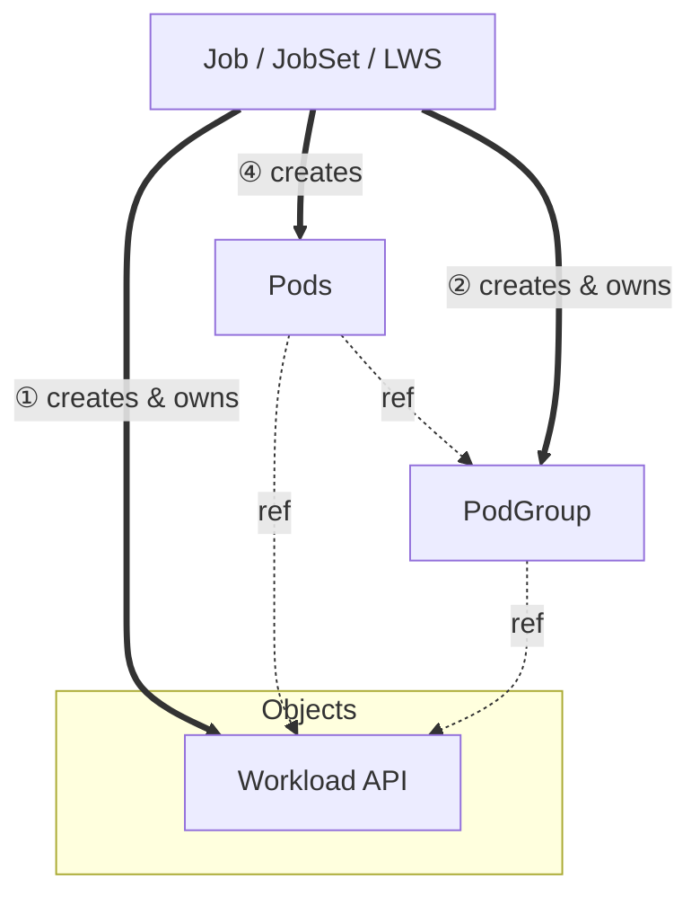

# KEP-5832: Decouple PodGroup from Workload API

<!-- toc -->
- [Release Signoff Checklist](#release-signoff-checklist)
- [Summary](#summary)
- [Motivation](#motivation)
  - [Goals](#goals)
  - [Non-Goals](#non-goals)
- [Proposal](#proposal)
  - [User Stories](#user-stories)
    - [Independent PodGroup Lifecycle](#independent-podgroup-lifecycle)
    - [PodGroup-Level Status](#podgroup-level-status)
    - [Controller Scalability](#controller-scalability)
  - [Notes/Constraints/Caveats (Optional)](#notesconstraintscaveats-optional)
  - [Risks and Mitigations](#risks-and-mitigations)
- [Design Details](#design-details)
  - [API](#api)
    - [1. <code>Pod</code> API](#1-pod-api)
    - [2. <code>PodGroup</code> API](#2-podgroup-api)
  - [SchedulingPolicy Reference vs. Copy/Inline in PodGroup](#schedulingpolicy-reference-vs-copyinline-in-podgroup)
  - [PodGroup Creation Ordering](#podgroup-creation-ordering)
  - [Backward Compatibility for PodGroup Transition](#backward-compatibility-for-podgroup-transition)
  - [PodGroup Status Lifecycle](#podgroup-status-lifecycle)
  - [Scheduler Changes](#scheduler-changes)
    - [Informers and Watches](#informers-and-watches)
    - [GangScheduling plugin](#gangscheduling-plugin)
  - [Ownership and Object Relationship](#ownership-and-object-relationship)
  - [Naming Convention](#naming-convention)
  - [Future Plans](#future-plans)
    - [Hierarchical PodGroups](#hierarchical-podgroups)
  - [Test Plan](#test-plan)
      - [Prerequisite testing updates](#prerequisite-testing-updates)
      - [Unit tests](#unit-tests)
      - [Integration tests](#integration-tests)
      - [e2e tests](#e2e-tests)
  - [Graduation Criteria](#graduation-criteria)
    - [Alpha](#alpha)
    - [Beta](#beta)
    - [GA](#ga)
  - [Upgrade / Downgrade Strategy](#upgrade--downgrade-strategy)
  - [Version Skew Strategy](#version-skew-strategy)
- [Production Readiness Review Questionnaire](#production-readiness-review-questionnaire)
  - [Feature Enablement and Rollback](#feature-enablement-and-rollback)
  - [Rollout, Upgrade and Rollback Planning](#rollout-upgrade-and-rollback-planning)
  - [Monitoring Requirements](#monitoring-requirements)
  - [Dependencies](#dependencies)
  - [Scalability](#scalability)
  - [Troubleshooting](#troubleshooting)
- [Implementation History](#implementation-history)
- [Drawbacks](#drawbacks)
- [Alternatives](#alternatives)
- [Infrastructure Needed (Optional)](#infrastructure-needed-optional)
<!-- /toc -->

## Release Signoff Checklist

Items marked with (R) are required *prior to targeting to a milestone / release*.

- [x] (R) Enhancement issue in release milestone, which links to KEP dir in [kubernetes/enhancements] (not the initial KEP PR)
- [ ] (R) KEP approvers have approved the KEP status as `implementable`
- [x] (R) Design details are appropriately documented
- [x] (R) Test plan is in place, giving consideration to SIG Architecture and SIG Testing input (including test refactors)
  - [ ] e2e Tests for all Beta API Operations (endpoints)
  - [ ] (R) Ensure GA e2e tests meet requirements for [Conformance Tests](https://github.com/kubernetes/community/blob/master/contributors/devel/sig-architecture/conformance-tests.md)
  - [ ] (R) Minimum Two Week Window for GA e2e tests to prove flake free
- [ ] (R) Graduation criteria is in place
  - [ ] (R) [all GA Endpoints](https://github.com/kubernetes/community/pull/1806) must be hit by [Conformance Tests](https://github.com/kubernetes/community/blob/master/contributors/devel/sig-architecture/conformance-tests.md) within one minor version of promotion to GA
- [ ] (R) Production readiness review completed
- [ ] (R) Production readiness review approved
- [ ] "Implementation History" section is up-to-date for milestone
- [ ] User-facing documentation has been created in [kubernetes/website], for publication to [kubernetes.io]
- [ ] Supporting documentation—e.g., additional design documents, links to mailing list discussions/SIG meetings, relevant PRs/issues, release notes

## Summary

This KEP proposes decoupling the PodGroup API from the Workload API by introducing
PodGroup as a standalone runtime object. In the [current design](https://github.com/kubernetes/enhancements/tree/master/keps/sig-scheduling/4671-gang-scheduling),
PodGroups are embedded within the Workload spec, which creates challenges around immutability, scaling, and lifecycle management. Under this proposal, the following changes are proposed:

- `Workload` becomes a scheduling policy definition that specifies what workload behavior should be applied
- `PodGroup` becomes a runtime object that is automatically created by true controllers (Job, JobSet, LeaderWorkerSet)
when they create workloads, rather than being embedded within the Workload spec. It will be created based on the
`podGroupTemplate` defined in the referenced Workload.

## Motivation

The current design embeds PodGroups within the Workload spec which creates several architectural challenges:

- `Workload` represents long-lived configuration-intent, whereas `PodGroups` represent transient units of scheduling. Tying runtime execution units to the persistent definition object violates separation of concerns.
- Extending the Workload object to track the runtime status for all PodGroups would lead to significant scalability issues.
  - *Size Limit*: Large Workloads (i.e., large number of PodGroups) may easily hit the 1.5MB etcd object limit.
  - *Contention*: Updating the status of a single PodGroup would require read-modify-write on the central massive Workload object.
  - *Lifecycle coupling*: Standalone `PodGroup` objects enable other resources (i.e., ResourceClaims) to be owned by and garbage-collected with specific scheduling units, rather than the entire Workload or individual Pods.

By decoupling `PodGroup` as a standalone runtime object:

- `Workload` becomes scheduling policy object that defines scheduling constraints and requirements
- `PodGroupTemplate` provides the blueprint for runtime PodGroup creation
- `PodGroup` is a controller-owned runtime object with its own lifecycle that represents a single scheduling unit.

### Goals

- Decouple `PodGroup` lifecycle from `Workload` lifecycle
- Enhance status ownership by making `PodGroup` status tracks podGroup-level runtime state
- Simplify integration with `Workload` API and true controllers
- Ensure proper ownership of `PodGroup`

### Non-Goals

- Change pod creation responsibility
- Replace or modify true workload[^1] controllers
- Modify existing Workload API beyond decoupling
- Change current gang-scheduler plugin algorithm

## Proposal

> This KEP depends heavily on [KEP-4671: Gang Scheduling using Workload Object](https://github.com/kubernetes/enhancements/tree/master/keps/sig-scheduling/4671-gang-scheduling) and is building on its foundations and assumes the knowledge of the concepts introduced there.

 The KEP introduces the `PodGroup` API in `scheduling.k8s.io/v1alpha1` as a standalone runtime object that is created based on the `podGroupTemplate` defined in the referenced `Workload` API. Each `PodGroup` represents a single scheduling policy for in a batch workloads with flat PodGroups. More details about the north star vision is stated in the design doc [^4].

```yaml
apiVersion: scheduling.k8s.io/v1alpha1
kind: PodGroup
metadata:
  name: pd-1
  namespace: ns-1
spec:
  workloadRef:
    name: training-workload
  podGroupTemplateName: pd-1-template
  schedulingPolicy:
    gang:
      minCount: 2
status:
  conditions:
  - type: PodGroupScheduled
    status: "True"
```

### User Stories

#### Independent PodGroup Lifecycle

As a user running LWS(LeaderWorkerSet), I want to observe and manage a leader pod and its associated worker pods as a single unit.

#### PodGroup-Level Status

I have a large-scale training job with multiple replicas, and want to observe the scheduling status of each PodGroup independently, so I can identify which specific replica is having scheduling issues.

#### Controller Scalability  

As a workload controller author, I want `PodGroup` status to be stored in a separate object, so that per-replica scheduling updates do not require read-modify-write operations on a large, shared `Workload` object, which would otherwise create scalability and contention issues at scale.

### Notes/Constraints/Caveats (Optional)

### Risks and Mitigations

- Increase API calls volume: More objects means more API calls for creation, updates, and watches. The mitigation is split the responsibility.`Workload` is rarely updated (as a policy object) while `PodGroup` handles runtime state. In addition, `PodGroups` allow per-replica sharding of status updates.

- Consistency: State is spread across multiple objects (`Workload` and `PodGroup`). The mitigation is that the `PodGroup` inlines all runtime state making it self-contained.

- Race conditions during objects creation: While the design requires controllers to create objects in order (`Workload` -> `PodGroup` -> `Pods`), there is still a possibility of race condition to happen anyway. The mitigation is to introduce admission controller to validate the object creation order. In addition, `UnschedulableAndUnresolvable` status will be set to serve as last line of defense if `Pods` are created before `PodGroup` is created.

- Increased etcd size: New object per replica which means more objects in etcd. The mitigation is `PodGroups` are owned by controllers with `ownerReferences`, so they are automatically garbage collected when the replica is deleted. Also, each `PodGroup` object is small (~1KB) compared to potentially large `Workload` object (~1.5MB) with the embedded `PodGroup` design.

## Design Details

### API

#### 1. `Pod` API

The `Pod` API will have a new field `PodGroupName` to reference the `PodGroup` runtime object that this pod belongs to, since each `PodGroup` object represents a single replica instance. While `PodGroupReplicaKey` and `PodGroup` fields are **Tombstoned** (effectively removed)

```go
type WorkloadReference struct {
   // Name defines the name of the Workload object (Policy) this Pod belongs to.
   // +required
   Name string

    // Tombstoned 
    // change from +required to +optional
    PodGroup string

    // Tombstoned 
    // change from +required to +optional
    PodGroupReplicaKey string

    //New field

   // PodGroupName is the name of the Runtime PodGroup object that tracks 
   // the collective status of this group.
   // +optional
   PodGroupName string

   // PodGroupReplicaKey will be deprecated
}
```

**Why do we need Pod to reference its PodGroup?**
The scheduler needs to efficiently be able to answer questions like "give me all pods from that PodGroup" or "are those two pods from the same PodGroup?".

If PodGroup used a selector to find its pods, every scheduling cycle would require evaluating the selector across pods (since labels can change, we need to handle mutability). 

In addition, we learned that explicit pointers perform better which is a pretty important aspect here, specially in the scalability area.

**Why is podGroupName an explicit field in PodSpec rather than using ownerReferences or labels?**
This decision was mainly based on the mutability requirement for this field. So far, we don't see any use case where `Pods` would need to move between `PodGroups`. Therefore, the decision was make `PodGroupName` an immutable field.
If we allow for mutations, we need to handle many corner cases (i.e., I'm scheduling a gang, I found nodes for all pods, but suddenly one of the pods was removed from my `PodGroup`, etc.).

**If PodTemplate is immutable in the true workload object, how controllers should set PodGroupName per-pod?**
There are two main cases:
(a) Controller-managed PodGroups: when a controller creates a Pod, it determines the creation context that allow it to define the PodGroup this Pod should belong to. This is similar to the pattern in [DaemonSet controller](https://github.com/kubernetes/kubernetes/blob/master/pkg/controller/daemon/daemon_controller.go#L1028-L1029), where during pod creation we explicitly set the NodeAffinity for each pod.

For hierarchical controllers ( i.e., JobSet), when there's a 1:1 mapping between lower-level workload and PodGroup, the higher-level controller can manage PodGroups and set `podGroupName` in the `PodTemplate` of the child workloads.

(b) User-managed PodGroups: users can manage PodGroup themselves by setting `podGroupName` directly in the `PodTemplate`. Note this is distinct from "bring your own Workload" where a user might reference a custom Workload (to change scheduling policy, gang configuration, TAS constraints, etc.) but still expect the controller to create PodGroups based on that Workload's template. User-managed PodGroups is specifically for cases where the user wants to control PodGroup creation.

#### 2. `PodGroup` API

The `PodGroup` type will be defined with the following structure:

```go
// API Group: scheduling.k8s.io/v1alpha1

// PodGroup represents a runtime instance of pods grouped for gang scheduling.
// PodGroups are created by workload controllers (Job, LWS, JobSet, etc...) from
// Workload.podGroupTemplates. Each PodGroup corresponds to one replica of the workload.
type PodGroup struct {
   metav1.TypeMeta
   
   // Standard object's metadata.
   // Name must be a DNS subdomain.
   //
   // +optional
   metav1.ObjectMeta

   // Spec defines the desired state of the PodGroup.
   // +required
   Spec PodGroupSpec

   // Status represents the current observed state of the PodGroup.
   // +optional
   Status PodGroupStatus
}

// PodGroupSpec defines the desired state of a PodGroup.
type PodGroupSpec struct {
   // WorkloadRef references the Workload that defines the policy.
   // This allows the scheduler to locate the scheduling policy.
   // +required
   WorkloadRef *corev1.ObjectReference

   // PodGroupTemplateName references the PodGroupTemplate name that defines 
   // the template for this PodGroup.
   // +required
   PodGroupTemplateName string

   // SchedulingPolicy defines the scheduling policy for this instance of the PodGroup.
   // It is copied from the template on PodGroup creation.
   // +required
   SchedulingPolicy *PodGroupSchedulingPolicy
}

type PodGroupStatus struct {
   // Conditions represent the latest observations of the PodGroup's state.
   //
   // Known condition types:
   // - "PodGroupScheduled": Indicates whether the scheduling requirement has been satisfied.
   //   - Status=True: All required pods have been assigned to nodes.
   //   - Status=False: Scheduling failed (i.e., timeout, unschedulable, etc.).
   //   - Status=Unknown: Scheduling is in progress.
   //
   // +optional
   Conditions []metav1.Condition
}
```

### SchedulingPolicy Reference vs. Copy/Inline in PodGroup

We evaluated two architectural approaches for linking PodGroup to its scheduling policy:
- Reference: where PodGroup points to `Workload.PodGroupTemplates[x]` 
- Copy/Inline: where PodGroup contains an inline copy of the policy (snapshot on creation)

The Reference model offers a single source of truth and lower write amplification, but introduces "action at a distance" 
semantics where modifying a Workload can break all existing PodGroups.

The Copy/Inline model makes PodGroup a self-contained object, matching the familiar `ReplicaSet.spec.template` in `Pod` 
pattern. It reduces blast radius (Workload changes only affect newly created PodGroups) and simplifies debugging. 

We propose adopting Copy/Inline for Alpha. If scalability concerns emerge, the model can be extended by adding an optional 
reference field alongside the inline policy (with validation ensuring exactly one is set), preserving a mitigation path.

While this argument works both ways, stability and extensibility are concrete risks we should address from the start, 
whereas performance concerns remain theoretical.

### PodGroup Creation Ordering

Since `PodGroup` is a runtime object created by true workload[^1] controllers, strict creation ordering (`PodGroup` must exist before `Pods`) is required to ensure the consistency of the scheduling policy.

**Semantics:**
- Pods with `workloadRef.podGroupName` set to a non-existent `PodGroup` are marked as `UnschedulableAndUnresolvable`
- The scheduler re-enqueues these pods when the `PodGroup` is created (via informer Add event)

This allows controllers to handle transient race conditions during object creation.

**Controller Responsibility:**
True workload[^1] controllers are responsible for creating `PodGroup` and `Workload` objects before creating `Pods`. the required order is:
1. Create `Workload` object
2. Create `PodGroup` runtime object
3. Create `Pods` with `workloadRef.podGroupName` set to the name of the newly created `PodGroup`

### Backward Compatibility for PodGroup Transition

An important design consideration that we need to discuss is how to handle the transition period when PodGroup doesn't exist yet (legacy behavior [KEP 4671](https://github.com/kubernetes/enhancements/tree/master/keps/sig-scheduling/4671-gang-scheduling)). Hence, we need to allow pods to reference `Workload` objects using `workloadRef.podGroup[]` and `workloadRef.podGroupReplicaKey` without a standalone `PodGroup` object. 

This KEP needs to ensure that this change:

- Doesn't break existing clusters during upgrade
- Can handle existing pods that reference non-existing `Workloads` that don't have `PodGroups` yet.
- Allows gradual controller adoption so eventually we can enable strict PodGroup-first ordering

To support migration from the embedded `PodGroup` model, we propose the following:

**1. Phase migration:**

- **Phase 1 (alpha):** Soft validation
  - Pods referencing non-existing `Workload` or `PodGroup` will remain pending until objects created
  - Pods using legacy `Workload.podGroup[]` continue to work normally
  - True controllers[^1] can create `PodGroup` objects in any order
  - Scheduler automatically re-queues pods when `PodGroup` is created

- **Phase 2 (beta):** Strict validation
  - Pods referencing non-existing `Workload` or `PodGroup` will fail as unschedulable
  - Legacy[^3] pods still work with deprecation warnings
  - Users can opt-in for admission-time rejection by enabling `ValidatingAdmissionPolicy`.
  - Admission-time validation can be optional and requires user's opt-in.

- **Phase 3 (GA):** Remove soft validation
  - All pods with `workloadRef.podGroupName` will fail as unschedulable if the `PodGroup` does not exist.
  - Legacy check will be removed from the scheduler.
  - True controllers[^1] must create `PodGroup` before Pods.
  - `PodGroupName` becomes a required field for pods when using gang scheduling.

**2. Handle upgrade scenario:**

- **Scenario 1:** Existing clusters with legacy `workloadRef.podGroup[]` (no `pod.spec.workloadRef.podGroupName`)
  - Cluster is upgraded with existing pods have `workloadRef.podGroup[]` and `workloadRef.podGroupReplicaKey` but `pod.spec.workloadRef.podGroupName` is empty/unset
  - `PreEnqueue` checks if the `PodGroupName` is set
  - Since `PodGroupName` is empty/unset, `PreEnqueue` uses legacy[^3] validation logic
  - Pod continues scheduling as before

- **Scenario 2:** New workload with `PodGroup` runtime object
  - True controller creates objects in order:
      1. `Workload` object with `PodGroupTemplate`
      2. `PodGroup` runtime object referencing the `Workload`
      3. `Pods` with `workloadRef.podGroupName` set to the name of the newly created `PodGroup`
  - `PreEnqueue` checks if the `PodGroupName` is set
  - If `PodGroupName` is set, the scheduler looks up `PodGroup` object
  - If found, scheduler validates `PodGroup.spec.workloadRef` matches pod's `workloadRef.name`
  - Pod enters scheduling queue when eligible for scheduling

- **Scenario 3:** Pods created before `PodGroup` exists (race condition)
  - True controller creates `Workload` object
  - Then it creates pods with `workloadRef.podGroupName` before creating `PodGroup` object
  - `PreEnqueue` looks up `PodGroupName` and not found
  - Scheduler returns `UnschedulableAndUnresolvable` with message "waiting for PodGroup "<PodGroupName>" to appear in scheduling queue"
  - Pod remains pending (not rejected)
  - True controller creates `PodGroup` object
  - Scheduler receives `PodGroup` Add event via informer
  - Scheduler re-enqueues pods waiting this `PodGroup`
  - `PreEnqueue` retries and finds `PodGroup` object
  - Pod enters scheduling queue when eligible for scheduling
  
- **Scenario 4:** Mixed clusters with both legacy[^3] and new podGroups (co-existence)
  - True controller A creates pods with `workloadRef.podGroup[]` and `workloadRef.podGroupReplicaKey`
  - True controller B creates `PodGroup` object and pods with `workloadRef.podGroupName`
  - Scheduler handles both types (scenario 1 and 2)
  - Both workloads schedule successfully

### PodGroup Status Lifecycle

The `PodGroup.Status` is managed by kube-scheduler and true workload[^1] controllers. For alpha we will introduce `Conditions` field, more fields will be added for beta and GA.

The controller is responsible for initializing the `PodGroupScheduled` condition when a new PodGroup is created.

- When a `PodGroup` is created, the controller initializes the `PodGroupScheduled` condition with status `Unknown`
- For basic scheduling policy, when the pod related to the `PodGroup` gets scheduled, the scheduler updates the `PodGroupScheduled` condition to `True`
- If pods are unschedulable(i.e., timeout, resources, affinity, etc.), the scheduler updates the `PodGroupScheduled` condition to `False` and sets the reason fields accordingly

### Scheduler Changes

> These changes build upon the scheduler framework introduced in [KEP-4671](https://github.com/kubernetes/enhancements/tree/master/keps/sig-scheduling/4671-gang-scheduling).

When a pod with `workloadRef` is submitted for scheduling, the kube-scheduler performs the following lookup chain:

- Read `pod.spec.workloadRef.podGroupName` to identify the PodGroup
- Lookup the `PodGroup` object in the scheduler's cache
- Read `podGroup.spec.workloadRef` and `podGroup.spec.podGroupTemplateName`
- Lookup the `Workload` object and locate the corresponding `podGroupTemplate` and retrieve the scheduling policy from the template

If any object in this chain is missing, the pod remains unschedulable until all required objects are created and observed by the scheduler.

#### Informers and Watches

The kube-scheduler will add a new informer to watch `PodGroup` objects alongside `Workload` informer.

#### GangScheduling plugin

And the GangScheduling plugin will maintain both listers for `Workload` and `PodGroup`. In addition to the following changes:

**1. PreEnqueue**: The extension will check if the `Workload` and `PodGroup` objects exist. If not, it will return `UnschedulableAndUnresolvable` status. Then check if the Pod scheduling requirement is met for gang scheduling (based on `PodGroupTemplate`).

**2. Permit**: The extension waits for all pods in the `PodGroup` to reach permit stage by using each pod's `workloadRef` to identify the `PodGroup` that the pod belongs to.

**3. EventsToRegister (Enqueue)**: The extension will register new event for `PodGroup` object is created.

**4. PostBind**:
The kube-scheduler will update `PodGroup.Status` to reflect scheduling policy progress.

### Ownership and Object Relationship

The `PodGroup` API introduces an ownership hierarchy within `Workload`, `PodGroup`, and `Pod` objects.



The `PodGroup` object is created and owned by the true workload [^1] controller. When the controller needs to create pods that require gang scheduling, it first creates a `PodGroup` based on the `podGroupTemplate` that is defined in `WorkloadReference`.This ensures automatic garbage collection when the parent object is deleted.

Pods reference their PodGroup via `workloadRef.podGroupTemplateName`. The scheduler uses this reference to look up the `PodGroup`, then follows `WorkloadReference` to locate the `Workload` to identify the scheduling policy. The scheduler requires the `PodGroup` to exist before scheduling pods that reference it.

### Naming Convention

- `PodGroup` names must be unique within the namespace.
- The name must be a valid DNS subdomain[^2].
- The controller that creates the `PodGroup` is responsible for generating the name based on the above convention.

### Future Plans

#### Hierarchical PodGroups

We plan to extend `PodGroup` and `Workload` APIs to support hierarchical PodGroups structure for advanced batch workloads. Potential features include:

- Allow `PodGroup` objects to reference parent `PodGroup` for hierarchical scheduling structures.
- Ensure parent `PodGroup` is scheduled before child `PodGroup` to define ordering constraints.
- Parent `PodGroup` status is able to reflect the collective state of children `PodGroup`s.
- Support dynamic creation and deletion of child `PodGroup` without affecting the parent.

### Test Plan

[x] I/we understand the owners of the involved components may require updates to
existing tests to make this code solid enough prior to committing the changes necessary
to implement this enhancement.

##### Prerequisite testing updates

##### Unit tests

- k8s.io/kubernetes/pkg/apis/scheduling/v1alpha1: `2026-01-23` - `62.7%`
- k8s.io/kubernetes/pkg/apis/scheduling/validation: `2026-01-23` - `97.8%`
- k8s.io/kubernetes/pkg/scheduler: `2026-01-23` - `81.7%`

##### Integration tests

We will add integration tests for `PodGroup`  to ensure the basic functionalities of `PodGroup` including:

- Pods belonging to a `PodGroup` are scheduled together
- `PodGroup` status is updated correctly
- `PodGroup` is garbage collected when the replica is deleted
- Pods linked to the non-existing workload or podGroup are not scheduled
- Pods get unblocked when workload and podGroup is created and observed by scheduler
- Pods are not scheduled if there is no space for the whole PodGroup

##### e2e tests

We will add basic API tests for the the new `PodGroup` API for alpha release. More tests will be added for beta release.

### Graduation Criteria

#### Alpha

- `PodGroup` is introduced behind `GenericWorkloadPodGroup` feature flag
- API tests for `PodGroup` API are added and passing
- kube-scheduler implements the `PodGroup` API

#### Beta

- Workload and PodGroup APIs are able to get integrated with true workload[^1] controllers
- e2e tests for `PodGroup` are added and passing

#### GA

- TBD in for Beta release

### Upgrade / Downgrade Strategy

This KEP is completely additive and can safely fallback to the original behavior on downgrade.

### Version Skew Strategy

- For kubelets: The feature is limited to the control plane, so the version skew with nodes (kubelets) doesn't matter.
- For true workload[^1] controllers: Controllers running older versions continue to work with embedded PodGroups
- For kube-apiserver: For the new API, the old version of components in particular kube-apiserver may not handle those. Thus, users should not set those fields before confirming all control-plane instances were upgraded to the version supporting those.
- For kube-scheduler: This is purely kube-scheduler in-memory feature, so the skew doesn't really matter, since there is always only single kube-scheduler instance being a leader.

## Production Readiness Review Questionnaire

### Feature Enablement and Rollback

###### How can this feature be enabled / disabled in a live cluster?

- [x] Feature gate
  - Feature gate name: GenericWorkloadPodGroup
  - Components depending on the feature gate:
    - kube-apiserver
    - kube-scheduler
- [ ] Other
  - Describe the mechanism:
  - Will enabling / disabling the feature require downtime of the control
    plane?
  - Will enabling / disabling the feature require downtime or reprovisioning
    of a node?

###### Does enabling the feature change any default behavior?

No. PodGroup objects will only be triggered by the existence of Workload objects and those are not yet created automatically behind the scenes.

###### Can the feature be disabled once it has been enabled (i.e. can we roll back the enablement)?

Yes. The `GenericWorkloadPodGroup` feature gate needs to be switched off to disable the feature.

- Cluster running new feature  with `GenericWorkloadPodGroup=true` and needs to rollback
- API server restarts:
  - New pods cannot set `podGroupName`
  - New `PodGroup` objects cannot be created
- Existing `PodGroup` objects remain in etcd but are ignored
- Scheduler restarts:
  - All pods use legacy[^3] validation path (since `podGroupName` is empty)
  - Existing pods with `podGroupName` already set continue to have it
- For existing pods with `podGroupName`:
  - Scheduler still attempts to validate `podGroupName`
  - `PodGroup` lookup may fail if objects were deleted
  - Pods become unschedulable until admin intervenes (deletes and recreates pods)

###### What happens if we reenable the feature if it was previously rolled back?

The feature will start working again. However, there might be some Workload objects already stored in etcd and may affect the behavior of some of the existing workloads.

###### Are there any tests for feature enablement/disablement?

No.

### Rollout, Upgrade and Rollback Planning

###### How can a rollout or rollback fail? Can it impact already running workloads?

###### What specific metrics should inform a rollback?

###### Were upgrade and rollback tested? Was the upgrade->downgrade->upgrade path tested?

###### Is the rollout accompanied by any deprecations and/or removals of features, APIs, fields of API types, flags, etc.?

No.

### Monitoring Requirements

###### How can an operator determine if the feature is in use by workloads?

###### How can someone using this feature know that it is working for their instance?

- [ ] Events
  - Event Reason:
- [x] API .status
  - Condition name: `PodGroupScheduled`
  - Other field:
- [ ] Other (treat as last resort)
  - Details:

###### What are the reasonable SLOs (Service Level Objectives) for the enhancement?

###### What are the SLIs (Service Level Indicators) an operator can use to determine the health of the service?

- [ ] Metrics
  - Metric name:
  - [Optional] Aggregation method:
  - Components exposing the metric:
- [ ] Other (treat as last resort)
  - Details:

###### Are there any missing metrics that would be useful to have to improve observability of this feature?

### Dependencies

###### Does this feature depend on any specific services running in the cluster?

### Scalability

###### Will enabling / using this feature result in any new API calls?

Yes.

1. Watching for PodGroups:

- API call type: **list** and / or **watch** PodGroups
- estimated throughput: < XX/s
- originating component: kube-scheduler

1. Status updates:

- API call type: **update** and / or **patch** PodGroups
- estimated throughput: < XX/s
- originating component: kube-scheduler

###### Will enabling / using this feature result in introducing new API types?

Yes. New API type `PodGroup`

###### Will enabling / using this feature result in any new calls to the cloud provider?

No.

###### Will enabling / using this feature result in increasing size or count of the existing API objects?

No.

###### Will enabling / using this feature result in increasing time taken by any operations covered by existing SLIs/SLOs?

No. (Need to check if we should add Workload or Pod into the SLIs/SLOs time)

###### Will enabling / using this feature result in non-negligible increase of resource usage (CPU, RAM, disk, IO, ...) in any components?

The increase of CPU/MEM consumption of kube-apiserver and kube-scheduler should be negligible percentage of the current resource usage.

###### Can enabling / using this feature result in resource exhaustion of some node resources (PIDs, sockets, inodes, etc.)?

No.

### Troubleshooting

###### How does this feature react if the API server and/or etcd is unavailable?

###### What are other known failure modes?

###### What steps should be taken if SLOs are not being met to determine the problem?

## Implementation History

- 2026-01-23: KEP Created for alpha release

## Drawbacks

## Alternatives

## Infrastructure Needed (Optional)

[^1]: The true workload controller refers to either in-tree or out-of-tree objects controllers like Job, JobSet, LeaderWorkerSet, etc.

[^2]: DNS subdomain is a naming convention defined in [RFC 1123](https://tools.ietf.org/html/rfc1123) that Kubernetes uses for most resource names.

[^3]: "Legacy" in this context refers to the KEP-4671 where pods use `workloadRef.podGroup` (template name) and `workloadRef.podGroupReplicaKey` without a standalone `PodGroup` runtime object.

[^4]: [API Proposal: Decoupled PodGroup and Workload API
](https://docs.google.com/document/d/1B3kLWh_U1a2g-VQ6ExokMjmb7pA8lGkF9MafSSg3JmQ/edit?tab=t.0)