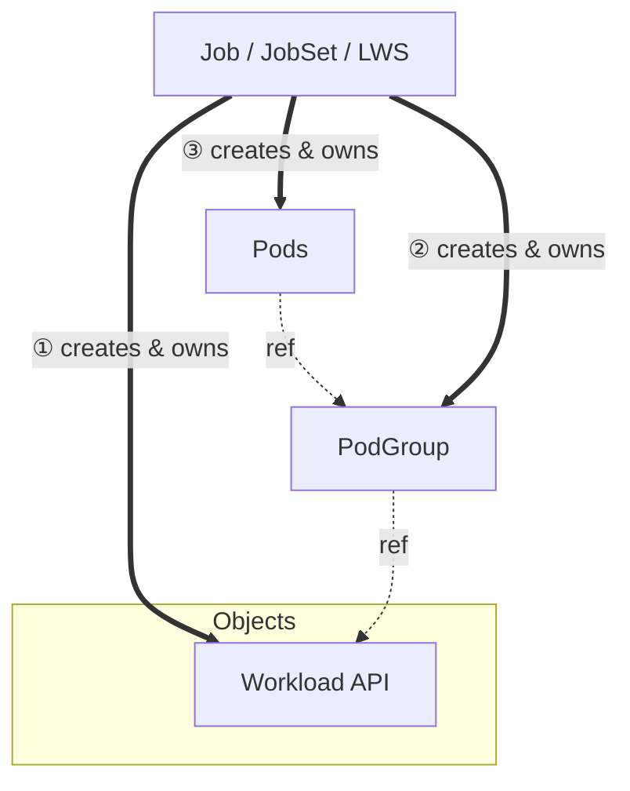

# KEP-5832: Decouple PodGroup from Workload API

<!-- toc -->
- [Release Signoff Checklist](#release-signoff-checklist)
- [Summary](#summary)
- [Motivation](#motivation)
  - [Goals](#goals)
  - [Non-Goals](#non-goals)
- [Proposal](#proposal)
  - [User Stories](#user-stories)
    - [Independent PodGroup Lifecycle](#independent-podgroup-lifecycle)
    - [PodGroup-Level Status](#podgroup-level-status)
    - [Controller Scalability](#controller-scalability)
  - [Notes/Constraints/Caveats](#notesconstraintscaveats)
  - [Risks and Mitigations](#risks-and-mitigations)
- [Design Details](#design-details)
  - [APIs](#apis)
    - [1. Updated <code>Workload</code> API](#1-updated-workload-api)
    - [2. Updated <code>Pod</code> API](#2-updated-pod-api)
    - [3. <code>PodGroup</code> API](#3-podgroup-api)
  - [Deletion Protection](#deletion-protection)
  - [SchedulingPolicy Reference vs. Copy/Inline in PodGroup](#schedulingpolicy-reference-vs-copyinline-in-podgroup)
  - [PodGroup Creation Ordering](#podgroup-creation-ordering)
  - [PodGroup Status Lifecycle](#podgroup-status-lifecycle)
  - [Scheduler Changes](#scheduler-changes)
    - [Informers and Watches](#informers-and-watches)
    - [GangScheduling plugin](#gangscheduling-plugin)
  - [Ownership and Object Relationship](#ownership-and-object-relationship)
  - [Naming Convention](#naming-convention)
  - [Future Plans](#future-plans)
    - [Hierarchical PodGroups](#hierarchical-podgroups)
  - [Test Plan](#test-plan)
      - [Prerequisite testing updates](#prerequisite-testing-updates)
      - [Unit tests](#unit-tests)
      - [Integration tests](#integration-tests)
      - [e2e tests](#e2e-tests)
  - [Graduation Criteria](#graduation-criteria)
    - [Alpha](#alpha)
    - [Beta](#beta)
    - [GA](#ga)
  - [Upgrade / Downgrade Strategy](#upgrade--downgrade-strategy)
  - [Version Skew Strategy](#version-skew-strategy)
- [Production Readiness Review Questionnaire](#production-readiness-review-questionnaire)
  - [Feature Enablement and Rollback](#feature-enablement-and-rollback)
  - [Rollout, Upgrade and Rollback Planning](#rollout-upgrade-and-rollback-planning)
  - [Monitoring Requirements](#monitoring-requirements)
  - [Dependencies](#dependencies)
  - [Scalability](#scalability)
  - [Troubleshooting](#troubleshooting)
- [Implementation History](#implementation-history)
- [Drawbacks](#drawbacks)
- [Alternatives](#alternatives)
    - [Embedded PodGroups (Status Quo)](#embedded-podgroups-status-quo)
    - [Support both embedded and standalone PodGroup](#support-both-embedded-and-standalone-podgroup)
- [Infrastructure Needed (Optional)](#infrastructure-needed-optional)
<!-- /toc -->

## Release Signoff Checklist

Items marked with (R) are required *prior to targeting to a milestone / release*.

- [x] (R) Enhancement issue in release milestone, which links to KEP dir in [kubernetes/enhancements] (not the initial KEP PR)
- [x] (R) KEP approvers have approved the KEP status as `implementable`
- [x] (R) Design details are appropriately documented
- [x] (R) Test plan is in place, giving consideration to SIG Architecture and SIG Testing input (including test refactors)
  - [ ] e2e Tests for all Beta API Operations (endpoints)
  - [ ] (R) Ensure GA e2e tests meet requirements for [Conformance Tests](https://github.com/kubernetes/community/blob/master/contributors/devel/sig-architecture/conformance-tests.md)
  - [ ] (R) Minimum Two Week Window for GA e2e tests to prove flake free
- [ ] (R) Graduation criteria is in place
  - [ ] (R) [all GA Endpoints](https://github.com/kubernetes/community/pull/1806) must be hit by [Conformance Tests](https://github.com/kubernetes/community/blob/master/contributors/devel/sig-architecture/conformance-tests.md) within one minor version of promotion to GA
- [ ] (R) Production readiness review completed
- [ ] (R) Production readiness review approved
- [x] "Implementation History" section is up-to-date for milestone
- [ ] User-facing documentation has been created in [kubernetes/website], for publication to [kubernetes.io]
- [x] Supporting documentation—e.g., additional design documents, links to mailing list discussions/SIG meetings, relevant PRs/issues, release notes

## Summary

This KEP proposes decoupling the `PodGroup` API from the `Workload` API by introducing
`PodGroup` as a standalone runtime object. In the [current design](https://github.com/kubernetes/enhancements/tree/master/keps/sig-scheduling/4671-gang-scheduling),
PodGroups are embedded within the Workload spec, which creates challenges around immutability, scaling, and lifecycle management. Under this proposal, the following changes are proposed:

- `Workload` becomes a static template defining scheduling hierarchy and scheduling policy definition that specifies what workload behavior should be applied
- `PodGroup` becomes a runtime self-contained runtime scheduling unit for a group of pods that encapsulates both the 
scheduling policy and status. It is automatically created by true controllers (Job, JobSet, LeaderWorkerSet)
when they create workloads, rather than being embedded within the Workload spec. It will be created based on the
`podGroupTemplate` defined in the referenced Workload.

## Motivation

The current design embeds PodGroups within the Workload spec which creates several architectural challenges:

- `Workload` represents long-lived configuration-intent, whereas `PodGroups` represent transient units of scheduling. Tying runtime execution units to the persistent definition object violates separation of concerns
- Lifecycle coupling for standalone `PodGroup` objects, which enables other resources (i.e., ResourceClaims) to be owned by and garbage-collected with specific scheduling units, rather than the entire `Workload` or individual `Pods`
- Extending the Workload object to track the runtime status for all PodGroups would lead to significant scalability issues
  - *Size Limit*: Large Workloads (i.e., large number of PodGroups) may easily hit the 1.5MB etcd object limit
  - *Contention*: Updating the status of a single `PodGroup` would require read-modify-write on the central massive Workload object

By decoupling `PodGroup` as a standalone runtime object:

- `Workload` becomes scheduling policy object that defines scheduling constraints and requirements
- `PodGroupTemplate` provides the blueprint for runtime `PodGroup` creation
- `PodGroup` is a controller-owned runtime object with its own lifecycle that represents a single scheduling unit.

### Goals

- Decouple `PodGroup` lifecycle from `Workload` lifecycle
- Enhance status ownership by making `PodGroup` status tracks podGroup-level runtime state
- Simplify integration with `Workload` API and true controllers
- Ensure proper ownership of `PodGroup`

### Non-Goals

- Change pod creation responsibility
- Replace or modify true workload[^1] controllers
- Modify existing Workload API beyond decoupling
- Change current gang-scheduler plugin algorithm

## Proposal

> This KEP depends heavily on [KEP-4671: Gang Scheduling using Workload Object](https://github.com/kubernetes/enhancements/tree/master/keps/sig-scheduling/4671-gang-scheduling) and is building on its foundations and assumes the knowledge of the concepts introduced there.

The proposal introduces the `PodGroup` API in `scheduling.k8s.io/v1alpha2` as a standalone runtime object that is
created based on the `podGroupTemplate` defined in the referenced `Workload` API. Each `PodGroup` represents a self-contained scheduling unit that encapsulates the scheduling policy and runtime state. More details about the north star vision is stated in the design doc [^3].

```yaml
apiVersion: scheduling.k8s.io/v1alpha2
kind: PodGroup
metadata:
  name: pd-1
  namespace: ns-1
spec:
  podGroupTemplateRef:
    workloadName: training-workload
    podGroupTemplateName: pd-1-template
  schedulingPolicy:
    gang:
      minCount: 2
status:
  conditions:
  - type: PodGroupScheduled
    status: "True"
```

### User Stories

#### Independent PodGroup Lifecycle

As a user running LWS(LeaderWorkerSet), I want to observe and manage a leader pod and its associated worker pods as a single unit.

#### PodGroup-Level Status

I have a large-scale training job with multiple replicas, and want to observe the scheduling status of each `PodGroup` independently, so I can identify which specific replica is having scheduling issues.

#### Controller Scalability  

As a workload controller author, I want `PodGroup` status to be stored in a separate object, so that per-replica scheduling updates do not require read-modify-write operations on a large, shared `Workload` object, which would otherwise create scalability and contention issues at scale.

### Notes/Constraints/Caveats

### Risks and Mitigations

- Increase API calls volume: More objects means more API calls for creation, updates, and watches. The mitigation is split the responsibility. The `Workload` object is rarely updated (as a template object) while `PodGroup` handles runtime state. In addition, `PodGroups` allow per-replica sharding of status updates.

- Consistency: State is spread across multiple objects (`Workload` and `PodGroup`). The mitigation is that the `PodGroup` inlines all runtime state making it self-contained.

- Race conditions during objects creation: While the design requires controllers to create objects in order (`Workload` -> `PodGroup` -> `Pods`), there is still a possibility of race condition to happen anyway. The mitigation is to introduce admission controller to validate the object creation order. In addition, `UnschedulableAndUnresolvable` status will be set to serve as last line of defense if `Pods` are created before `PodGroup` is created or `PodGroup` object was deleted in the meantime.

- Increased etcd size: New object per replica which means more objects in etcd. The mitigation is `PodGroups` are owned by controllers with `ownerReferences`, so they are automatically garbage collected when the replica is deleted. Also, each `PodGroup` object is small (~1KB) compared to potentially large `Workload` object (~1.5MB) with the embedded `PodGroup` design.

## Design Details

### APIs

#### 1. Updated `Workload` API

The `Workload` API will rename the field `podGroup` to `podGroupTemplate`  to clarify the distinction between policy templates and runtime objects.

In [KEP-4671](https://github.com/kubernetes/enhancements/tree/master/keps/sig-scheduling/4671-gang-scheduling), the Workload spec contained podGroups[] which defined both the scheduling policy and served as the embedded runtime representation. With `PodGroup` now a standalone runtime object, we rename the Workload field to podGroupTemplates[] to clarify its new role as a policy definition:

```go
type WorkloadSpec struct {
  ...
    // PodGroupTemplates is the list of templates that make up the Workload.
    // The maximum number of podGroupTemplates is 8. This field is immutable.
    //
    // +optional
    // +listType=map
    // +listMapKey=name
    PodGroupTemplates []PodGroupTemplate
}

type PodGroupTemplate struct {
  // The same as in KEP-4671
}
```

#### 2. Updated `Pod` API

The `Pod` API will replace the field `spec.workloadRef` with `spec.schedulingGroup` to reference the `PodGroup` runtime
object name `podGroupName` and other scheduling context that this pod belongs to, since each `PodGroup` object represents 
a single replica instance. This aligns with the decoupling architecture for the `PodGroup` from `Workload` and allows for future extensibility.

```go
type PodSpec struct {
	...
	
    // WorkloadRef is tombstoned since the field in 1.36 was replaced with SchedulingGroup.
    // WorkloadRef *WorkloadReference
	
	// SchedulingGroup provides a reference to the immediate scheduling runtime grouping object that this Pod 
	// belongs to. In the current implementation, this is always a PodGroup, but it may evolve in the future to support
	// other concepts like PodSubGroups.
	// This field is used by the scheduler to identify the PodGroup and apply the
	// correct group scheduling policies. The PodGroup object referenced
	// by this field may not exist at the time the Pod is created.
	// This field is immutable, but a PodGroup object with the same name
	// may be recreated with different policies. Doing this during pod scheduling
	// may result in the placement not conforming to the expected policies.
	//
	// +featureGate=GenericWorkload
	// +optional
	SchedulingGroup *PodSchedulingGroup
}

// PodSchedulingGroup identifies the runtime scheduling group instance that a Pod belongs to. 
// The scheduler uses this information to apply workload-aware scheduling semantics.
type PodSchedulingGroup struct {
    // PodGroupName specifies the name of the standalone PodGroup object 
    // that represents the runtime instance of this group.
    // +optional
    // +oneOf=GroupSelection
    PodGroupName *string `json:"podGroupName,omitempty"`
}
```

**Why do we need Pod to reference its PodGroup?**
The scheduler needs to efficiently be able to answer questions like "give me all pods from that `PodGroup`" or "are those two pods from the same `PodGroup`?".

If `PodGroup` used a selector to find its pods, every scheduling cycle would require evaluating the selector across pods (since labels can change, we need to handle mutability). 

In addition, we learned that explicit pointers perform better which is a pretty important aspect here, specially in the scalability area.

**Why is podGroupName an explicit field in PodSpec rather than using ownerReferences or labels?**
This decision was mainly based on the mutability requirement for this field. So far, we don't see any use case where `Pods` would need to move between `PodGroups`. Therefore, the decision was make `PodGroupName` an immutable field.
If we allow for mutations, we need to handle many corner cases (i.e., I'm scheduling a gang, I found nodes for all pods, but suddenly one of the pods was removed from my `PodGroup`, etc.).

**If PodTemplate is immutable in the true workload object, how controllers should set PodGroupName per-pod?**
There are two main cases:
(a) Controller-managed PodGroups: when a controller creates a Pod, it determines the creation context that allow it to define the `PodGroup` this Pod should belong to. This is similar to the pattern in [DaemonSet controller](https://github.com/kubernetes/kubernetes/blob/master/pkg/controller/daemon/daemon_controller.go#L1028-L1029), where during pod creation we explicitly set the NodeAffinity for each pod.

For hierarchical controllers ( i.e., JobSet), when there's a 1:1 mapping between lower-level workload and `PodGroup`, the higher-level controller can manage PodGroups and set `podGroupName` in the `PodTemplate` of the child workloads.

(b) User-managed PodGroups: users can manage `PodGroup` themselves by setting `podGroupName` directly in the `PodTemplate`. Note this is distinct from "bring your own Workload" where a user might reference a custom Workload (to change scheduling policy, gang configuration, TAS constraints, etc.) but still expect the controller to create PodGroups based on that Workload's template. User-managed PodGroups is specifically for cases where the user wants to control `PodGroup` creation.

#### 3. `PodGroup` API

The `PodGroup` type will be defined with the following structure:

```go
// API Group: scheduling.k8s.io/v1alpha2

// PodGroup represents a runtime instance of pods grouped for gang scheduling.
// PodGroups are created by workload controllers (Job, LWS, JobSet, etc...) from
// Workload.podGroupTemplates. Each PodGroup corresponds to one replica of the workload.
type PodGroup struct {
    metav1.TypeMeta
    
    // Standard object's metadata.
    // Name must be a DNS subdomain.
    //
    // +optional
    metav1.ObjectMeta
    
    // Spec defines the desired state of the PodGroup.
    // +required
    Spec PodGroupSpec
    
    // Status represents the current observed state of the PodGroup.
    // +optional
    Status PodGroupStatus
}

// PodGroupSpec defines the desired state of a PodGroup.
type PodGroupSpec struct {
    // PodGroupTemplateRef references the PodGroupTemplate within the Workload object that was used to create
	// the PodGroup.
    // +optional
    PodGroupTemplateRef *PodGroupTemplateReference
    
    // SchedulingPolicy defines the scheduling policy for this instance of the PodGroup.
    // It is copied from the template on PodGroup creation.
    // +required
    SchedulingPolicy *PodGroupSchedulingPolicy
}

// PodGroupTemplateReference references the PodGroupTemplate name within 
// the Workload object.
type PodGroupTemplateReference struct {
   // WorkloadName defines the name of the Workload object this PodGroup is part of.
   //
   // +optional
   WorkloadName string

  // PodGroupTemplateName references the PodGroupTemplate name that was used to
  // create this PodGroup.
  //
  // +optional
   PodGroupTemplateName string
}

type PodGroupStatus struct {
   // Conditions represent the latest observations of the PodGroup's state.
   //
   // Known condition types:
   // - "PodGroupScheduled": Indicates whether the scheduling requirement has been satisfied.
   //   - Status=True: All required pods have been assigned to nodes.
   //   - Status=False: Scheduling failed (i.e., timeout, unschedulable, etc.).
   //
   // Known reasons for PodGroupScheduled condition:
   // - "Scheduled": All required pods have been successfully scheduled.
   // - "Unschedulable": The PodGroup cannot be scheduled due to resource constraints,
   //   affinity/anti-affinity rules, or insufficient capacity for the gang.
   // - "SchedulingGated": One or more pods in the PodGroup have scheduling gates
   //   that must be cleared before scheduling can proceed.
   // - "Preempted": The PodGroup was preempted to make room for higher-priority workloads.
   // - "Timeout": The PodGroup failed to schedule within the configured timeout.
   //
   // +optional
   Conditions []metav1.Condition
}
```

### Deletion Protection

The `PodGroup` lifecycle needs to make sure that `PodGroup` will not be deleted while any pod that references it is in a non-terminal phase (i.e. not `Succeeded` or `Failed`). 

`PodGroup` objects are created with a dedicated finalizer that a dedicated controller for `PodGroup` is responsible for removing only when the deletion-safe condition is met. The mechanism for this is:
- Each `PodGroup` is created with a dedicated finalizer. If `PodGroup` objects exist without this finalizer (i.e., created before the feature), the controller adds it when processing them
- The controller watches `PodGroup` and `Pod` objects. For a `PodGroup` that has `deletionTimestamp` set and still has the finalizer (a deletion candidate), it checks whether all pods that reference this `PodGroup` have reached a terminal phase (`Succeeded` or `Failed`)
- If all referencing pods are terminal, only then the controller removes the finalizer, allowing the `PodGroup` to be deleted
- Any referencing pod is non-terminal, the controller leaves the finalizer in place and re-enqueues (i.e., on pod updates)
- To find the referencing pods, we can use an index keyed by `schedulingGroup.podGroupName` (and optionally namespace) so the controller can efficiently list pods that reference a given `PodGroup`

Deletion protection is not required for alpha (nice-to-have), however it is required for beta graduation.

### SchedulingPolicy Reference vs. Copy/Inline in PodGroup

We evaluated two architectural approaches for linking `PodGroup` to its scheduling policy:
- Reference: where `PodGroup` points to `Workload.PodGroupTemplates[x]` 
- Copy/Inline: where `PodGroup` contains an inline copy of the policy (snapshot on creation)

The Reference model offers a single source of truth and lower write amplification, but introduces "action at a distance" 
semantics where modifying a Workload can break all existing PodGroups.

The Copy/Inline model makes `PodGroup` a self-contained object, matching the familiar `ReplicaSet.spec.template` in `Pod` 
pattern. It reduces blast radius (Workload changes only affect newly created PodGroups) and simplifies debugging. 

We propose adopting Copy/Inline for Alpha. If scalability concerns emerge, the model can be extended by adding an optional 
reference field alongside the inline policy (with validation ensuring exactly one is set), preserving a mitigation path.

While this argument works both ways, stability and extensibility are concrete risks we should address from the start, 
whereas performance concerns remain theoretical.

### PodGroup Creation Ordering

Since `PodGroup` is a runtime object created by true workload[^1] controllers, strict creation ordering (`PodGroup` must exist before `Pods`) is required to ensure the consistency of the scheduling policy.

**Semantics:**
- Pods with `schedulingGroup.podGroupName` set to a non-existent `PodGroup` are marked as `UnschedulableAndUnresolvable`
- The scheduler re-enqueues these pods when the `PodGroup` is created (via informer Add event)

This allows controllers to handle transient race conditions during object creation.

**Controller Responsibility:**
True workload[^1] controllers are responsible for creating `PodGroup` and `Workload` objects before creating `Pods`. the required order is:
1. Create `Workload` object
2. Create `PodGroup` runtime object
3. Create `Pods` with `schedulingGroup.podGroupName` set to the name of the newly created `PodGroup`

### PodGroup Status Lifecycle

The `PodGroup.Status` is managed by kube-scheduler to reflect the scheduling status. 
For alpha, we will introduce `Conditions` field with the `PodGroupScheduled` condition type, but more fields may be added for beta and GA.

`PodGroup` status mirrors `Pod` status semantics:
- If pods are unschedulable(i.e., timeout, resources, affinity, etc.), the scheduler updates the `PodGroupScheduled` condition to `False` and sets the reason fields accordingly.
- If pods are scheduled, the scheduler updates the `PodGroupScheduled` condition to `True` after the last pod in the gang completes binding.

For basic scheduling policy, when the pod related to the `PodGroup` gets scheduled, the scheduler updates the `PodGroupScheduled` condition to `True`.

### Scheduler Changes

> These changes are built upon the scheduler framework changes introduced in [KEP-4671](https://github.com/kubernetes/enhancements/tree/master/keps/sig-scheduling/4671-gang-scheduling).

The main change is that The scheduler reads the `PodGroup` objects instead of the `Workload`. If the `PodGroup` is missing, the pod remains unschedulable until the `PodGroup` is created and observed by the scheduler.

#### Informers and Watches

The kube-scheduler will add a new informer to watch `PodGroup` objects and stop watching `Workload` objects.

#### GangScheduling plugin

The GangScheduling plugin will maintain a lister for `PodGroup` and check if the `PodGroup` object exists along with the `Workload` object. This is in addition to the following changes:

**1. PreEnqueue**: The extension will check if the `PodGroup` object exist. If not, it will return `UnschedulableAndUnresolvable` status. Then check if the Pod scheduling requirement is met for gang scheduling (based on minCount value in `PodGroup` object).

**2. Permit**: The extension waits for all pods in the `PodGroup` to reach permit stage by using each pod's `schedulingGroup.podGroupName` to identify the `PodGroup` that the pod belongs to.

**3. EventsToRegister (Enqueue)**: The extension will register new event for `PodGroup` object is created.

**4. Update PodGroup Status**: The kube-scheduler sets `PodGroupScheduled=True` after the group passed the Permit phase. If `PodGroup` is unschedulable, the scheduler sets `PodGroupScheduled=False` whenever a gang is conditionally accepted (waiting for preemption) or reject

### Ownership and Object Relationship

The `PodGroup` API introduces an ownership hierarchy within `Workload`, `PodGroup`, and `Pod` objects.



The `PodGroup` object is created and owned by the true workload controller [^1]. When the controller needs to create pods that require gang scheduling, it first creates the `Workload` object if not exists yet and then creates a `PodGroup` based on the `podGroupTemplate` that is defined in this `Workload`.This ensures automatic garbage collection when the parent object is deleted.

Pods reference their `PodGroup` via `schedulingGroup.podGroupName`, which allows the scheduler to look up for the `PodGroup` object. The scheduler requires both `Workload` and `PodGroup` objects to exist before scheduling pods that reference it.

### Naming Convention

- `PodGroup` names must be unique within the namespace.
- The name must be a valid DNS subdomain[^2].
- The controller that creates the `PodGroup` is responsible for generating the name based on the above convention.

### Future Plans

#### Hierarchical PodGroups

We plan to extend `PodGroup` and `Workload` APIs to support hierarchical PodGroups structure for advanced batch workloads. Potential features include:

- Allow `PodGroup` objects to reference parent `PodGroup` for hierarchical scheduling structures.
- Design Hierarchical `PodGroup` lifecycle management and status tracking.

### Test Plan

[x] I/we understand the owners of the involved components may require updates to
existing tests to make this code solid enough prior to committing the changes necessary
to implement this enhancement.

##### Prerequisite testing updates

##### Unit tests

- k8s.io/kubernetes/pkg/apis/scheduling/v1alpha1: `2026-01-23` - `62.7%`
- k8s.io/kubernetes/pkg/apis/scheduling/validation: `2026-01-23` - `97.8%`
- k8s.io/kubernetes/pkg/scheduler: `2026-01-23` - `81.7%`

##### Integration tests

We will add integration tests for `PodGroup`  to ensure the basic functionalities of `PodGroup` including:

- Pods belonging to a `PodGroup` are scheduled together
- `PodGroup` status is updated correctly
- `PodGroup` is garbage collected when the replica is deleted
- Pods linked to the non-existing workload or podGroup are not scheduled
- Pods get unblocked when workload and podGroup is created and observed by scheduler
- Pods are not scheduled if there is no space for the whole `PodGroup`

##### e2e tests

We will add basic API tests for the the new `PodGroup` API for alpha release. More tests will be added for beta release.

### Graduation Criteria

#### Alpha

- This KEP will reuse the `GenericWorkload` feature flag to enable the `PodGroup` API
- Add `PodGroup` API with the validation
- kube-scheduler implementation is switched to be based on PodGroup API
- e2e tests for `PodGroup` are added and passing. These tests will be promoted to conformance tests later

#### Beta

- Both `Workload` and `PodGroup` APIs are integrated (alpha) with at least one true workload[^1] controller
- A deletion protection mechanism is implemented for `PodGroup` objects amd finalizer is added to the API.
- All e2e tests for `PodGroup` are added and graduate to conformance tests

#### GA

- TBD in for Beta release

### Upgrade / Downgrade Strategy

Standard procedures for features introducing new API fields should be used:
- kube-apiserver is required to be upgraded first before any other components that use the new API.
- Since the `PodGroup` has dependency on `Workload` API, the feature gate for it needs to be enabled.
- On downgrade, kube-scheduler should be downgraded first (to stop processing the new fields) before kube-apiserver is downgraded.

Note that downgrade kube-apiserver will not result in clearing the new fields for objects that already have them set in etcd. Therefore, existing `PodGroup` objects remain in etcd but are ignored.


### Version Skew Strategy

The feature is limited to the control plane, so the version skew with nodes (kubelets) doesn't matter.

Only kube-apiserver and kube-scheduler are involved in the feature. The new API is added and used by scheduler, thus kube-apiserver is required to run in not older version than kube-scheduler. This is purely kube-scheduler in-memory feature, so the skew doesn't really matter, since there is always only single kube-scheduler instance being a leader.

## Production Readiness Review Questionnaire

### Feature Enablement and Rollback

###### How can this feature be enabled / disabled in a live cluster?

- [x] Feature gate
  - Feature gate name: GenericWorkload
  - Components depending on the feature gate:
    - kube-apiserver
    - kube-scheduler
- [ ] Other
  - Describe the mechanism:
  - Will enabling / disabling the feature require downtime of the control
    plane?
  - Will enabling / disabling the feature require downtime or reprovisioning
    of a node?

###### Does enabling the feature change any default behavior?

No. `PodGroup` objects will only be triggered by the existence of Workload objects and those are not yet created automatically behind the scenes.

###### Can the feature be disabled once it has been enabled (i.e. can we roll back the enablement)?

Yes, the changes in this proposal can be disabled along with other Workload API related features by disabling the `GenericWorkload` feature gate in kube-scheduler which will effectively disable workload-aware scheduling completely.

The new API changes and admission can also be disabled by disabling the feature gate in kube-apiserver. However, this will not result in clearing the new fields for objects that already have them set in storage. Therefore, existing `PodGroup` objects remain in etcd but are ignored.

###### What happens if we reenable the feature if it was previously rolled back?

The feature will start working again. However, there might be some Workload objects already stored in etcd and may affect the behavior of some of the existing workloads.

###### Are there any tests for feature enablement/disablement?

The scheduler changes are purely in-memory and doesn't require any dedicated enablement/disablement tests. The logic will be covered by regular feature tests.

For the newly introduced APIs, dedicated enablement/disablement tests at the kube-apiserver registry layer will be added in alpha release.

### Rollout, Upgrade and Rollback Planning

###### How can a rollout or rollback fail? Can it impact already running workloads?

###### What specific metrics should inform a rollback?

###### Were upgrade and rollback tested? Was the upgrade->downgrade->upgrade path tested?

###### Is the rollout accompanied by any deprecations and/or removals of features, APIs, fields of API types, flags, etc.?

No.

### Monitoring Requirements

###### How can an operator determine if the feature is in use by workloads?

###### How can someone using this feature know that it is working for their instance?

- [ ] Events
  - Event Reason:
- [x] API .status
  - Condition name: `PodGroupScheduled`
  - Other field:
- [ ] Other (treat as last resort)
  - Details:

###### What are the reasonable SLOs (Service Level Objectives) for the enhancement?

###### What are the SLIs (Service Level Indicators) an operator can use to determine the health of the service?

- [ ] Metrics
  - Metric name:
  - [Optional] Aggregation method:
  - Components exposing the metric:
- [ ] Other (treat as last resort)
  - Details:

###### Are there any missing metrics that would be useful to have to improve observability of this feature?

### Dependencies

###### Does this feature depend on any specific services running in the cluster?

### Scalability

###### Will enabling / using this feature result in any new API calls?

Yes.

1. Watching for PodGroups:

- API call type: **list** and / or **watch** PodGroups
- estimated throughput: < XX/s
- originating component: kube-scheduler

1. Status updates:

- API call type: **update** and / or **patch** PodGroups
- estimated throughput: < XX/s
- originating component: kube-scheduler

###### Will enabling / using this feature result in introducing new API types?

Yes. New API type `PodGroup`

###### Will enabling / using this feature result in any new calls to the cloud provider?

No.

###### Will enabling / using this feature result in increasing size or count of the existing API objects?

Yes, minimal increase in size of existing Pod objects.

###### Will enabling / using this feature result in increasing time taken by any operations covered by existing SLIs/SLOs?

No. (Need to check if we should add Workload or Pod into the SLIs/SLOs time)

###### Will enabling / using this feature result in non-negligible increase of resource usage (CPU, RAM, disk, IO, ...) in any components?

Since the scheduler replaces the Workload informer with a PodGroup informer, it's expected there can be more PodGroups than Workloads,
kube-scheduler and kube-apiserver load may grow with PodGroup cardinality. The increase is expected to remain reasonable 
under typical use but could be non-negligible on clusters with very large numbers of concurrent PodGroups.

###### Can enabling / using this feature result in resource exhaustion of some node resources (PIDs, sockets, inodes, etc.)?

No.

### Troubleshooting

###### How does this feature react if the API server and/or etcd is unavailable?

###### What are other known failure modes?

###### What steps should be taken if SLOs are not being met to determine the problem?

## Implementation History

- 2026-01-23: KEP Created for alpha release
- 2026-02-06: KEP Updated to sync with API decision of keep Workload API in alpha release

## Drawbacks

## Alternatives

#### Embedded PodGroups (Status Quo)

`PodGroups` remain embedded within the `Workload` object, with no standalone `PodGroup` API.

**Pros:**
- Single object to learn and look up, synchronize, and manage mutations
- No coordination required across API objects
- Fastest time to market (graduate to beta)

**Cons:**
- Lifecycle management is getting complex.
- DRA integration is difficult
- Scalability is limited by `Workload` object size (1.5MB etcd limit)
- Per-`PodGroup` status within a large `Workload` may be misleading to users and hit scalability limits

#### Support both embedded and standalone PodGroup

Support both embedded `PodGroups` inside `Workload` and external standalone `PodGroups`.

**Pros:**
- Allows sharding when using external `PodGroups`
- Decoupled lifecycle supported for external `PodGroups`

**Cons:**
- Two top-level object types without clear responsibility split
- `Workload` is an aggregating object but can also contain `PodGroups`
- Users who created internal/embedded PodGroups are stuck if they need to change (requires workload recreation)
- Exposed to all limitations of embedded option, combined with unintuitive additional external `PodGroups`
- Most complex to reason about and maintain

For more details about the alternatives, please refer to the [PodGroup as top-level object document](https://docs.google.com/document/d/1zVdNyMGuSi861Uw16LAKXzKkBgZaICOWdPRQB9YAwTk/edit?resourcekey=0-bD8cjW_B6ZfOpSGgDrU6Mg&tab=t.0).

## Infrastructure Needed (Optional)

[^1]: The true workload controller refers to either in-tree or out-of-tree objects controllers like Job, JobSet, LeaderWorkerSet, etc.

[^2]: DNS subdomain is a naming convention defined in [RFC 1123](https://tools.ietf.org/html/rfc1123) that Kubernetes uses for most resource names.

[^3]: [API Proposal: Decoupled `PodGroup` and Workload API
](https://docs.google.com/document/d/1B3kLWh_U1a2g-VQ6ExokMjmb7pA8lGkF9MafSSg3JmQ/edit?tab=t.0)