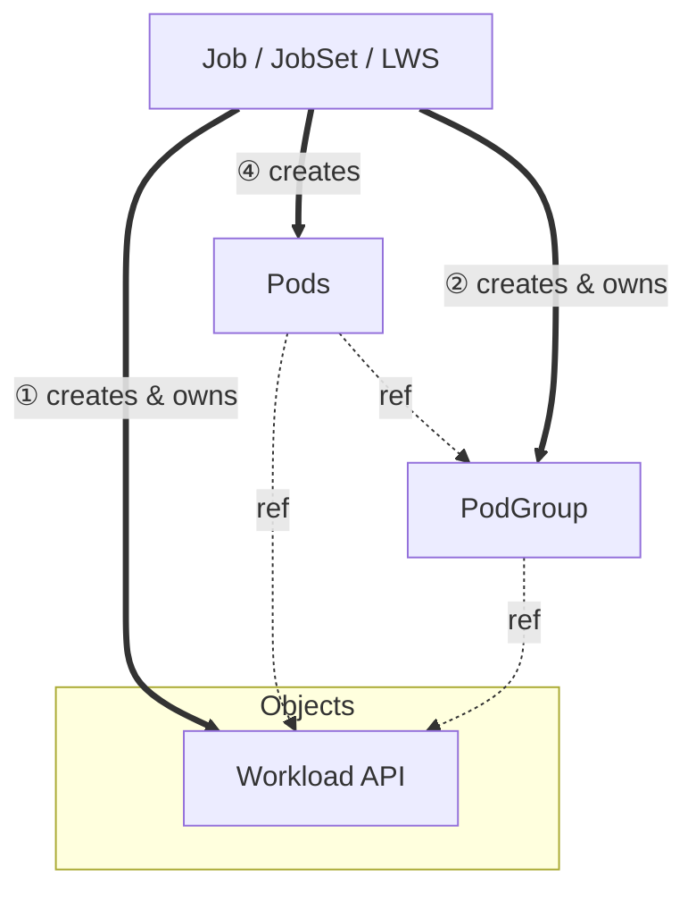

# KEP-5832: Decouple PodGroup from Workload API

<!-- toc -->
- [Release Signoff Checklist](#release-signoff-checklist)
- [Summary](#summary)
- [Motivation](#motivation)
  - [Goals](#goals)
  - [Non-Goals](#non-goals)
- [Proposal](#proposal)
  - [User Stories (Optional)](#user-stories-optional)
    - [Story 1: Scaling a Training Job](#story-1-scaling-a-training-job)
  - [Notes/Constraints/Caveats (Optional)](#notesconstraintscaveats-optional)
  - [Risks and Mitigations](#risks-and-mitigations)
- [Design Details](#design-details)
  - [API](#api)
    - [1. <code>Pod</code> API](#1-pod-api)
    - [2. <code>PodGroup</code> API](#2-podgroup-api)
  - [Scheduler Changes](#scheduler-changes)
    - [Informers and Watches](#informers-and-watches)
    - [GangScheduling plugin](#gangscheduling-plugin)
  - [Ownership and Object Relationship](#ownership-and-object-relationship)
  - [Naming Convention](#naming-convention)
  - [Future Plans](#future-plans)
    - [Hierarchical PodGroups](#hierarchical-podgroups)
  - [Test Plan](#test-plan)
      - [Prerequisite testing updates](#prerequisite-testing-updates)
      - [Unit tests](#unit-tests)
      - [Integration tests](#integration-tests)
      - [e2e tests](#e2e-tests)
  - [Graduation Criteria](#graduation-criteria)
    - [Alpha](#alpha)
    - [Beta](#beta)
    - [GA](#ga)
  - [Upgrade / Downgrade Strategy](#upgrade--downgrade-strategy)
  - [Version Skew Strategy](#version-skew-strategy)
- [Production Readiness Review Questionnaire](#production-readiness-review-questionnaire)
  - [Feature Enablement and Rollback](#feature-enablement-and-rollback)
  - [Rollout, Upgrade and Rollback Planning](#rollout-upgrade-and-rollback-planning)
  - [Monitoring Requirements](#monitoring-requirements)
  - [Dependencies](#dependencies)
  - [Scalability](#scalability)
  - [Troubleshooting](#troubleshooting)
- [Implementation History](#implementation-history)
- [Drawbacks](#drawbacks)
- [Alternatives](#alternatives)
- [Infrastructure Needed (Optional)](#infrastructure-needed-optional)
<!-- /toc -->

## Release Signoff Checklist

Items marked with (R) are required *prior to targeting to a milestone / release*.

- [x] (R) Enhancement issue in release milestone, which links to KEP dir in [kubernetes/enhancements] (not the initial KEP PR)
- [ ] (R) KEP approvers have approved the KEP status as `implementable`
- [x] (R) Design details are appropriately documented
- [x] (R) Test plan is in place, giving consideration to SIG Architecture and SIG Testing input (including test refactors)
  - [ ] e2e Tests for all Beta API Operations (endpoints)
  - [ ] (R) Ensure GA e2e tests meet requirements for [Conformance Tests](https://github.com/kubernetes/community/blob/master/contributors/devel/sig-architecture/conformance-tests.md)
  - [ ] (R) Minimum Two Week Window for GA e2e tests to prove flake free
- [ ] (R) Graduation criteria is in place
  - [ ] (R) [all GA Endpoints](https://github.com/kubernetes/community/pull/1806) must be hit by [Conformance Tests](https://github.com/kubernetes/community/blob/master/contributors/devel/sig-architecture/conformance-tests.md) within one minor version of promotion to GA
- [ ] (R) Production readiness review completed
- [ ] (R) Production readiness review approved
- [ ] "Implementation History" section is up-to-date for milestone
- [ ] User-facing documentation has been created in [kubernetes/website], for publication to [kubernetes.io]
- [ ] Supporting documentation—e.g., additional design documents, links to mailing list discussions/SIG meetings, relevant PRs/issues, release notes

## Summary

This KEP proposes decoupling the PodGroup API from the Workload API by introducing
PodGroup as a standalone runtime object. In the [current design](https://github.com/kubernetes/enhancements/tree/master/keps/sig-scheduling/4671-gang-scheduling), 
PodGroups are embedded within the Workload spec, which creates challenges around immutability, scaling, and lifecycle management. Under this proposal, the following changes are proposed:

- `Workload` becomes a scheduling policy definition that specifies what workload behavior should be applied
- `PodGroup` becomes a runtime object that is automatically created by true controllers (Job, JobSet, LeaderWorkerSet)
when they create workloads, rather than being embedded within the Workload spec. It will be created based on the
`podGroupTemplate` defined in the referenced Workload.

## Motivation

The current design embeds PodGroups within the Workload spec, creating several integration challenges:

- PodGroups often have shorter lifecycles than the `Workloa` itself, modifying a single `PodGroup` (i.e., the leader podGroup in LWS) requires recreating the entire Workload.
- Extending the Workload object to store the runtime status for all PodGroups would lead to significant scalability issues.
  - *Size Limit*: Large Workloads (i.e. large number of PodGroups) may easily hit the 1.5MB etcd object limit.
  - *Contention*: Updating the status of a single PodGroup would require read-modify-write on the central massive Workload object.
In addition, any status change triggers watches for all controllers observing the Workload.

By decoupling `PodGroup` as a standalone runtime object:

- `Workload` defines scheduling policy that describes scheduling constraints and requirements.
- `PodGroupTemplate` provides the blueprint for runtime PodGroup creation.
- `PodGroup` becomes a mutable, controller-owned object with its own lifecycle

### Goals

- Decouple `PodGroup` lifecycle from `Workload` lifecycle
- Enhance status ownership by making `PodGroup` status tracks podGroup-level runtime state
- Simplify integration with `Workload` API and true controllers
- Ensure proper ownership of `PodGroup`

### Non-Goals

- Change pod creation responsibility
- Replace or modify true workload[^1] controllers
- Modify existing Workload API beyond decoupling
- Change current gang-scheduler plugin algorithm

## Proposal

> This KEP depends heavily on
> [KEP-4671: Gang Scheduling using Workload Object](https://github.com/kubernetes/enhancements/tree/master/keps/sig-scheduling/4671-gang-scheduling).
> It is building on foundations and assumes the knowledge of the concepts introduced there.

 The KEP introduces the `PodGroup` API in `scheduling.k8s.io/v1alpha1` as a standalone runtime object that is created based on the `podGroupTemplate` defined in the referenced `Workload` API. Each `PodGroup` represents a single scheduling policy for in a batch workloads with flat PodGroups.

```yaml
apiVersion: scheduling.k8s.io/v1alpha1
kind: PodGroup
metadata:
  name: pd-1
  namespace: ns-1
spec:
  workloadRef:
    name: training-workload
  podGroupTemplateRef:
    name: pd-1-template
status:
  scheduledPods: 2
  conditions:
  - type: PodGroupScheduled
    status: "True"
    lastTransitionTime: "2024-01-26T10:00:00Z"
    reason: MinCountSatisfied
    message: "All required pods (2/2) have been assigned to nodes"
```

### User Stories (Optional)

#### Story 1: Scaling a Training Job

As a user running distributed training jobs, I want to scale my job parallelism from 4 to 8 workers without recreating the Workload object.

### Notes/Constraints/Caveats (Optional)

### Risks and Mitigations

TBD

## Design Details

### API

#### 1. `Pod` API

The `Pod` API will have a new field `podGroupName` to reference the `PodGroup` runtime object. While `PodGroupReplicaKey` will be deprecated, since each `PodGroup` object represents a single replica instance.

```go
type WorkloadReference struct {
   // Name defines the name of the Workload object (Policy) this Pod belongs to.
   // +required
   Name string

   // PodGroupName is the name of the Runtime PodGroup object that tracks 
   // the collective status of this group.
   // +required
   PodGroupName string

   // PodGroupReplicaKey will be deprecated
}
```

#### 2. `PodGroup` API

The `PodGroup` type will be defined with the following structure:

```go
// API Group: scheduling.k8s.io/v1alpha1

// PodGroup represents a runtime instance of pods grouped for gang scheduling.
// PodGroups are created by workload controllers (Job, LWS, JobSet, etc...) from
// Workload.podGroupTemplates. Each PodGroup corresponds to one replica of the workload.
type PodGroup struct {
   metav1.TypeMeta
   
   // Standard object's metadata.
   // Name must be a DNS subdomain.
   //
   // +optional
   metav1.ObjectMeta

   // Spec defines the desired state of the PodGroup.
   // +required
   Spec PodGroupSpec

   // Status represents the current observed state of the PodGroup.
   // +optional
   Status PodGroupStatus
}

// PodGroupSpec defines the desired state of a PodGroup.
type PodGroupSpec struct {
   // WorkloadRef references the Workload that defines the policy.
   // This allows the scheduler to locate the static policy.
   // +required
   WorkloadRef *corev1.ObjectReference

   // PodGroupTemplateName references the PodGroupTemplate name that defines 
   // the template for this PodGroup.
   // +required
   PodGroupTemplateName string
}

type PodGroupStatus struct {
   // Conditions represent the latest observations of the PodGroup's state.
   //
   // Known condition types:
   // - "PodGroupScheduled": Indicates whether the gang scheduling requirement has been satisfied.
   //   - Status=True: All required pods have been assigned to nodes.
   //   - Status=False: Scheduling failed (i.e., timeout, unschedulable, etc.).
   //   - Status=Unknown: Scheduling is in progress.
   //
   // +optional
   Conditions []metav1.Condition

   // ScheduledPods is the count of pods that have been assigned to nodes.
   // +optional
   ScheduledPods int32
}
```

### Scheduler Changes

> These changes build upon the scheduler framework introduced in [KEP-4671](https://github.com/kubernetes/enhancements/tree/master/keps/sig-scheduling/4671-gang-scheduling).

When a pod with `workloadRef` is submitted for scheduling, the kube-scheduler performs the following lookup chain:

- Read `pod.spec.workloadRef.podGroupName` to identify the PodGroup
- Lookup the `PodGroup` object in the scheduler's cache
- Read `podGroup.spec.workloadRef` and `podGroup.spec.podGroupTemplateName`
- Lookup the `Workload` object and locate the corresponding `podGroupTemplate` and retrieve the scheduling policy from the template

If any object in this chain is missing, the pod remains unschedulable until all required objects are created and observed by the scheduler.

#### Informers and Watches

The kube-scheduler will add a new informer to watch `PodGroup` objects alongside `Workload` informer:

```go
// PodGroupInformer provides access to a shared informer and lister for
// PodGroups.
type PodGroupInformer interface {
	Informer() cache.SharedIndexInformer
	Lister() schedulingv1alpha1.PodGroupLister
}

// podGroupInformer provides access to a shared informer and lister for PodGroups.
type podGroupInformer struct {
	factory          internalinterfaces.SharedInformerFactory
	tweakListOptions internalinterfaces.TweakListOptionsFunc
	namespace        string
}

// PodGroups returns a PodGroupInformer.
func (v *version) PodGroups() PodGroupInformer {
	return &podGroupInformer{factory: v.factory, namespace: v.namespace, tweakListOptions: v.tweakListOptions}
}
```

#### GangScheduling plugin

And the GangScheduling plugin will maintain both listers for `Workload` and `PodGroup`. In addition to the following changes:

**1. PreEnqueue**: The extension will check if the `Workload` and `PodGroup` objects exist. If not, it will return `UnschedulableAndUnresolvable` status. Then check if the Pod scheduling requirement is met for gang scheduling (based on `PodGroupTemplate`).

**2. Permit**: The extension waits for all pods in the `PodGroup` to reach permit stage. It will use `PodGroup` object to identify gang membership instead of `workloadRef` + `ReplicaKey`.

**3. EventsToRegister (Enqueue)**: The extension will register new event for `PodGroup` object is created.

**4. PostBind**:
The kube-scheduler will update `PodGroup.Status` to reflect gang scheduling progress.

### Ownership and Object Relationship

The `PodGroup` API introduces an ownership hierarchy within `Workload`, `PodGroup`, and `Pod` objects.



The `PodGroup` object is created and owned by the true workload [^1] controller. When the controller needs to create pods that require gang scheduling, it first creates a `PodGroup` based on the `podGroupTemplate` that is defined in `WorkloadReference`.This ensures automatic garbage collection when the parent object is deleted.

Pods reference their PodGroup via `workloadRef.podGroupTemplateName`. The scheduler uses this reference to look up the `PodGroup`, then follows `WorkloadReference` to locate the `Workload` to identify the scheduling policy. The scheduler requires the `PodGroup` to exist before scheduling pods that reference it.

### Naming Convention

- `PodGroup` names must be unique within the namespace.
- The name must be a valid DNS subdomain[^2].
- The controller that creates the `PodGroup` is responsible for generating the name based on the above convention.

### Future Plans

#### Hierarchical PodGroups

We plan to extend `PodGroup` and `Workload` APIs to support hierarchical PodGroups structure for advanced batch workloads. Potential features include:

- Allow `PodGroup` objects to reference parent `PodGroup` for hierarchical scheduling structures.
- Ensure parent `PodGroup` is scheduled before child `PodGroup` to define ordering constraints.
- Parent `PodGroup` status is able to reflect the collective state of children `PodGroup`s.
- Support dynamic creation and deletion of child `PodGroup` without affecting the parent.

### Test Plan

[x] I/we understand the owners of the involved components may require updates to
existing tests to make this code solid enough prior to committing the changes necessary
to implement this enhancement.

##### Prerequisite testing updates

##### Unit tests

- k8s.io/kubernetes/pkg/apis/scheduling/v1alpha1: `2026-01-23` - `62.7%`
- k8s.io/kubernetes/pkg/apis/scheduling/validation: `2026-01-23` - `97.8%`
- k8s.io/kubernetes/pkg/scheduler: `2026-01-23` - `81.7%`

##### Integration tests

We will add integration tests for `PodGroup`  to ensure the basic functionalities of `PodGroup` including:

- Pods belonging to a `PodGroup` are scheduled together
- `PodGroup` status is updated correctly
- `PodGroup` is garbage collected when the replica is deleted
- Pods linked to the non-existing workload or podGroup are not scheduled
- Pods get unblocked when workload or podGroup is created and observed by scheduler
- Pods are not scheduled if there is no space for the whole PodGroup

##### e2e tests

We will add basic API tests for the the new `PodGroup` API for alpha release. More tests will be added for beta release.

### Graduation Criteria

#### Alpha

- `PodGroup` is introduced behind `GenericWorkloadPodGroup` feature flag
- API tests for `PodGroup` API are added and passing
- kube-scheduler implements the `PodGroup` API

#### Beta

- Workload and PodGroup APIs are able to get integrated with true workload[^1] controllers
- e2e tests for `PodGroup` are added and passing

#### GA

- TBD in for Beta release

### Upgrade / Downgrade Strategy

> This KEP is completely additive and can safely fallback to the original behavior on downgrade.

### Version Skew Strategy

- For kubelets: The feature is limited to the control plane, so the version skew with nodes (kubelets) doesn't matter.
- For true workload[^1] controllers: Controllers running older versions continue to work with embedded PodGroups
- For kube-apiserver: For the new API, the old version of components in particular kube-apiserver may not handle those. Thus, users should not set those fields before confirming all control-plane instances were upgraded to the version supporting those.
- For kube-scheduler: This is purely kube-scheduler in-memory feature, so the skew doesn't really matter, since there is always only single kube-scheduler instance being a leader.

## Production Readiness Review Questionnaire

### Feature Enablement and Rollback

###### How can this feature be enabled / disabled in a live cluster?

- [x] Feature gate
  - Feature gate name: GenericWorkloadPodGroup
  - Components depending on the feature gate:
    - kube-apiserver
    - kube-scheduler
- [ ] Other
  - Describe the mechanism:
  - Will enabling / disabling the feature require downtime of the control
    plane?
  - Will enabling / disabling the feature require downtime or reprovisioning
    of a node?

###### Does enabling the feature change any default behavior?

No. PodGroup objects will only be triggered by the existence of Workload objects and those are not yet created automatically behind the scenes.

###### Can the feature be disabled once it has been enabled (i.e. can we roll back the enablement)?

Yes. The `GenericWorkloadPodGroup` feature gate needs to be switched off to disable the feature.

###### What happens if we reenable the feature if it was previously rolled back?

The feature will start working again. However, there might be some Workload objects already stored in etcd and may affect the behavior of some of the existing workloads.

###### Are there any tests for feature enablement/disablement?

No.

### Rollout, Upgrade and Rollback Planning

###### How can a rollout or rollback fail? Can it impact already running workloads?

###### What specific metrics should inform a rollback?

###### Were upgrade and rollback tested? Was the upgrade->downgrade->upgrade path tested?

###### Is the rollout accompanied by any deprecations and/or removals of features, APIs, fields of API types, flags, etc.?

No.

### Monitoring Requirements

###### How can an operator determine if the feature is in use by workloads?

###### How can someone using this feature know that it is working for their instance?

- [ ] Events
  - Event Reason:
- [x] API .status
  - Condition name: `PodGroupScheduled`
  - Other field: `ScheduledPods`
- [ ] Other (treat as last resort)
  - Details:

###### What are the reasonable SLOs (Service Level Objectives) for the enhancement?

###### What are the SLIs (Service Level Indicators) an operator can use to determine the health of the service?

- [ ] Metrics
  - Metric name:
  - [Optional] Aggregation method:
  - Components exposing the metric:
- [ ] Other (treat as last resort)
  - Details:

###### Are there any missing metrics that would be useful to have to improve observability of this feature?

### Dependencies

###### Does this feature depend on any specific services running in the cluster?

### Scalability

###### Will enabling / using this feature result in any new API calls?

Yes.

1. Watching for PodGroups:

- API call type: LIST+WATCH PodGroups
- estimated throughput: < XX/s
- originating component: kube-scheduler

1. Status updates:

- API call type: PUT/PATCH PodGroups
- estimated throughput: < XX/s
- originating component: kube-scheduler

###### Will enabling / using this feature result in introducing new API types?

Yes. New API type `PodGroup`

###### Will enabling / using this feature result in any new calls to the cloud provider?

No.

###### Will enabling / using this feature result in increasing size or count of the existing API objects?

No.

###### Will enabling / using this feature result in increasing time taken by any operations covered by existing SLIs/SLOs?

No. (Need to check if we should add Workload or Pod into the SLIs/SLOs time)

###### Will enabling / using this feature result in non-negligible increase of resource usage (CPU, RAM, disk, IO, ...) in any components?

The increase of CPU/MEM consumption of kube-apiserver and kube-scheduler should be negligible percentage of the current resource usage.

###### Can enabling / using this feature result in resource exhaustion of some node resources (PIDs, sockets, inodes, etc.)?

No.

### Troubleshooting

###### How does this feature react if the API server and/or etcd is unavailable?

###### What are other known failure modes?

###### What steps should be taken if SLOs are not being met to determine the problem?

## Implementation History

## Drawbacks

## Alternatives

## Infrastructure Needed (Optional)

[^1]: The true workload controller refers to either in-tree or out-of-tree objects controllers like Job, JobSet, LeaderWorkerSet, etc.

[^2]: DNS subdomain is a naming convention defined in [RFC 1123](https://tools.ietf.org/html/rfc1123) that Kubernetes uses for most resource names.
