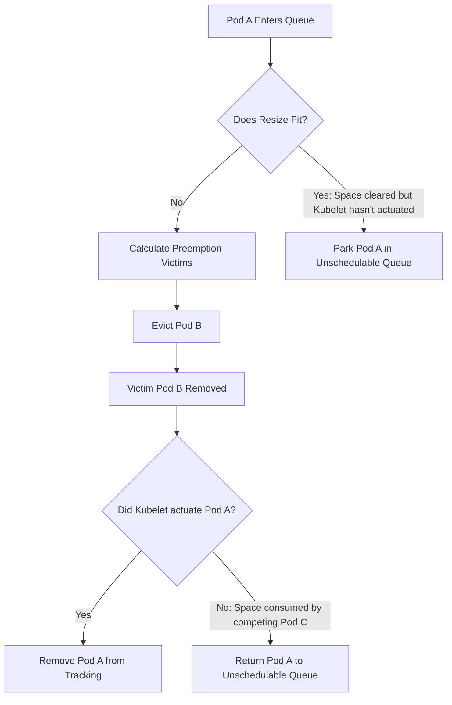

<!--
**Note:** When your KEP is complete, all of these comment blocks should be removed.

Follow the guidelines of the [documentation style guide].
In particular, wrap lines to a reasonable length, to make it
easier for reviewers to cite specific portions, and to minimize diff churn on
updates.

[documentation style guide]: https://github.com/kubernetes/community/blob/master/contributors/guide/style-guide.md

To get started with this template:

- [ ] **Pick a hosting SIG.**
  Make sure that the problem space is something the SIG is interested in taking
  up. KEPs should not be checked in without a sponsoring SIG.
- [ ] **Create an issue in kubernetes/enhancements**
  When filing an enhancement tracking issue, please make sure to complete all
  fields in that template. One of the fields asks for a link to the KEP. You
  can leave that blank until this KEP is filed, and then go back to the
  enhancement and add the link.
- [ ] **Make a copy of this template directory.**
  Copy this template into the owning SIG's directory and name it
  `NNNN-short-descriptive-title`, where `NNNN` is the issue number (with no
  leading-zero padding) assigned to your enhancement above.
- [ ] **Fill out as much of the kep.yaml file as you can.**
  At minimum, you should fill in the "Title", "Authors", "Owning-sig",
  "Status", and date-related fields.
- [ ] **Fill out this file as best you can.**
  At minimum, you should fill in the "Summary" and "Motivation" sections.
  These should be easy if you've preflighted the idea of the KEP with the
  appropriate SIG(s).
- [ ] **Create a PR for this KEP.**
  Assign it to people in the SIG who are sponsoring this process.
- [ ] **Merge early and iterate.**
  Avoid getting hung up on specific details and instead aim to get the goals of
  the KEP clarified and merged quickly. The best way to do this is to just
  start with the high-level sections and fill out details incrementally in
  subsequent PRs.

Just because a KEP is merged does not mean it is complete or approved. Any KEP
marked as `provisional` is a working document and subject to change. You can
denote sections that are under active debate as follows:

```
<<[UNRESOLVED optional short context or usernames ]>>
Stuff that is being argued.
<<[/UNRESOLVED]>>
```

When editing KEPS, aim for tightly-scoped, single-topic PRs to keep discussions
focused. If you disagree with what is already in a document, open a new PR
with suggested changes.

One KEP corresponds to one "feature" or "enhancement" for its whole lifecycle.
You do not need a new KEP to move from beta to GA, for example. If
new details emerge that belong in the KEP, edit the KEP. Once a feature has become
"implemented", major changes should get new KEPs.

The canonical place for the latest set of instructions (and the likely source
of this file) is [here](/keps/NNNN-kep-template/README.md).

**Note:** Any PRs to move a KEP to `implementable`, or significant changes once
it is marked `implementable`, must be approved by each of the KEP approvers.
If none of those approvers are still appropriate, then changes to that list
should be approved by the remaining approvers and/or the owning SIG (or
SIG Architecture for cross-cutting KEPs).
-->
# KEP-5836: Scheduler Preemption for In-Place Pod Resize

<!--
This is the title of your KEP. Keep it short, simple, and descriptive. A good
title can help communicate what the KEP is and should be considered as part of
any review.
-->

<!--
A table of contents is helpful for quickly jumping to sections of a KEP and for
highlighting any additional information provided beyond the standard KEP
template.

Ensure the TOC is wrapped with
  <code>&lt;!-- toc --&rt;&lt;!-- /toc --&rt;</code>
tags, and then generate with `hack/update-toc.sh`.
-->

<!-- toc -->
- [Release Signoff Checklist](#release-signoff-checklist)
- [Summary](#summary)
- [Motivation](#motivation)
  - [Goals](#goals)
  - [Non-Goals](#non-goals)
- [Proposal](#proposal)
  - [User Stories (Optional)](#user-stories-optional)
    - [Story 1: Pods in the Deferred resize status no longer require manual interversion.](#story-1-pods-in-the-deferred-resize-status-no-longer-require-manual-interversion)
    - [Story 2: Reduction of disruption for critical workloads.](#story-2-reduction-of-disruption-for-critical-workloads)
    - [Story 3: Driving cluster autoscaling](#story-3-driving-cluster-autoscaling)
  - [Risks and Mitigations](#risks-and-mitigations)
    - [Performance impact](#performance-impact)
    - [Interaction with workload-aware preemption](#interaction-with-workload-aware-preemption)
    - [Race between a Deferred resize and a new higher-priority pod](#race-between-a-deferred-resize-and-a-new-higher-priority-pod)
    - [Shifting Preemption Victims during Scheduler Restart](#shifting-preemption-victims-during-scheduler-restart)
- [Design Details](#design-details)
  - [How Deferred Resizes will integrate into the Scheduling Queue](#how-deferred-resizes-will-integrate-into-the-scheduling-queue)
    - [Avoid Conflicting Sources of Truth for the Pod](#avoid-conflicting-sources-of-truth-for-the-pod)
  - [Processing Deferred Resizes in the Scheduling Queue](#processing-deferred-resizes-in-the-scheduling-queue)
  - [Scheduler Restart and State Recovery](#scheduler-restart-and-state-recovery)
  - [Scheduler Resource Reservation](#scheduler-resource-reservation)
  - [Kubelet-Scheduler Preemption Interaction](#kubelet-scheduler-preemption-interaction)
    - [Reconsideration Race Conditions](#reconsideration-race-conditions)
  - [Preemption Policies](#preemption-policies)
  - [Pod Priority, Graceful Termination, and Pod Disruption Budget](#pod-priority-graceful-termination-and-pod-disruption-budget)
  - [Failures and Reconsideration of Deferred pods](#failures-and-reconsideration-of-deferred-pods)
    - [ResizeUnschedulable Pod Condition](#resizeunschedulable-pod-condition)
    - [Handling retries](#handling-retries)
  - [Preventing breaking custom PostFilterPlugins](#preventing-breaking-custom-postfilterplugins)
  - [Node-level Preemption Policy for In-Place Pod Resize](#node-level-preemption-policy-for-in-place-pod-resize)
    - [Kubelet Preemption](#kubelet-preemption)
  - [Test Plan](#test-plan)
      - [Prerequisite testing updates](#prerequisite-testing-updates)
      - [Unit tests](#unit-tests)
      - [Integration tests](#integration-tests)
      - [e2e tests](#e2e-tests)
  - [Graduation Criteria](#graduation-criteria)
    - [Alpha](#alpha)
    - [Beta](#beta)
    - [GA](#ga)
  - [Upgrade / Downgrade Strategy](#upgrade--downgrade-strategy)
  - [Version Skew Strategy](#version-skew-strategy)
- [Production Readiness Review Questionnaire](#production-readiness-review-questionnaire)
  - [Feature Enablement and Rollback](#feature-enablement-and-rollback)
  - [Rollout, Upgrade and Rollback Planning](#rollout-upgrade-and-rollback-planning)
  - [Monitoring Requirements](#monitoring-requirements)
  - [Dependencies](#dependencies)
  - [Scalability](#scalability)
  - [Troubleshooting](#troubleshooting)
- [Implementation History](#implementation-history)
- [Drawbacks](#drawbacks)
- [Alternatives](#alternatives)
  - [Separate scheduling queue](#separate-scheduling-queue)
  - [Implementing prioritized resizes logic](#implementing-prioritized-resizes-logic)
  - [Preemption Policies](#preemption-policies-1)
  - [Avoid Conflicting Sources of Truth for the Pod](#avoid-conflicting-sources-of-truth-for-the-pod-1)
  - [Kubelet-Scheduler Preemption Interaction](#kubelet-scheduler-preemption-interaction-1)
  - [Persistent Preemption State across Restarts](#persistent-preemption-state-across-restarts)
  - [Node-Level Preemption Policy API Options](#node-level-preemption-policy-api-options)
    - [1. Scheduler Honors Node Annotation Directly (Rejected)](#1-scheduler-honors-node-annotation-directly-rejected)
    - [2. Node Labels (Rejected)](#2-node-labels-rejected)
    - [3. Node Field (Rejected)](#3-node-field-rejected)
    - [4. Separate API Object (Rejected)](#4-separate-api-object-rejected)
    - [5. Node Condition (Rejected)](#5-node-condition-rejected)
<!-- /toc -->

## Release Signoff Checklist

<!--
**ACTION REQUIRED:** In order to merge code into a release, there must be an
issue in [kubernetes/enhancements] referencing this KEP and targeting a release
milestone **before the [Enhancement Freeze](https://git.k8s.io/sig-release/releases)
of the targeted release**.

For enhancements that make changes to code or processes/procedures in core
Kubernetes—i.e., [kubernetes/kubernetes], we require the following Release
Signoff checklist to be completed.

Check these off as they are completed for the Release Team to track. These
checklist items _must_ be updated for the enhancement to be released.
-->

Items marked with (R) are required *prior to targeting to a milestone / release*.

- [x] (R) Enhancement issue in release milestone, which links to KEP dir in [kubernetes/enhancements] (not the initial KEP PR)
- [x] (R) KEP approvers have approved the KEP status as `implementable`
- [x] (R) Design details are appropriately documented
- [x] (R) Test plan is in place, giving consideration to SIG Architecture and SIG Testing input (including test refactors)
  - [ ] e2e Tests for all Beta API Operations (endpoints)
  - [ ] (R) Ensure GA e2e tests meet requirements for [Conformance Tests](https://github.com/kubernetes/community/blob/master/contributors/devel/sig-architecture/conformance-tests.md)
  - [ ] (R) Minimum Two Week Window for GA e2e tests to prove flake free
- [x] (R) Graduation criteria is in place
  - [ ] (R) [all GA Endpoints](https://github.com/kubernetes/community/pull/1806) must be hit by [Conformance Tests](https://github.com/kubernetes/community/blob/master/contributors/devel/sig-architecture/conformance-tests.md) within one minor version of promotion to GA
- [x] (R) Production readiness review completed
- [x] (R) Production readiness review approved
- [ ] "Implementation History" section is up-to-date for milestone
- [ ] User-facing documentation has been created in [kubernetes/website], for publication to [kubernetes.io]
- [ ] Supporting documentation—e.g., additional design documents, links to mailing list discussions/SIG meetings, relevant PRs/issues, release notes

<!--
**Note:** This checklist is iterative and should be reviewed and updated every time this enhancement is being considered for a milestone.
-->

[kubernetes.io]: https://kubernetes.io/
[kubernetes/enhancements]: https://git.k8s.io/enhancements
[kubernetes/kubernetes]: https://git.k8s.io/kubernetes
[kubernetes/website]: https://git.k8s.io/website

## Summary

<!--
This section is incredibly important for producing high-quality, user-focused
documentation such as release notes or a development roadmap. It should be
possible to collect this information before implementation begins, in order to
avoid requiring implementors to split their attention between writing release
notes and implementing the feature itself. KEP editors and SIG Docs
should help to ensure that the tone and content of the `Summary` section is
useful for a wide audience.

A good summary is probably at least a paragraph in length.
-->

[In-Place Pod Resize](https://github.com/kubernetes/enhancements/issues/1287) reached GA in 1.35, allowing pod resizing 
without restarts. However, unlike traditional pod recreation, in-place resizes that exceed node capacity do not currently 
trigger the preemption of lower-priority pods. Instead, they remain in a `Deferred` resize status and require manual 
intervention. We propose that the Scheduler actively creates space for resize requests by preempting lower-priority pods,
following the same preemption logic used when scheduling new pods.

## Motivation

<!--
This section is for explicitly listing the motivation, goals, and non-goals of
this KEP.  Describe why the change is important and the benefits to users. The
motivation section can optionally provide links to [experience reports] to
demonstrate the interest in a KEP within the wider Kubernetes community.

[experience reports]: https://github.com/golang/go/wiki/ExperienceReports
-->

The introduction of In-Place Pod Resize gives platform teams new ways to optimize cloud resources without restarting pods, 
marking a significant shift in how Kubernetes operates. This is especially powerful when In-Place Pod Resize is integrated
with higher-level autoscaling controllers such as VPA's new `InPlaceOrRecreate` mode. However, users currently lack a 
way to control scale-up behavior when a node lacks the capacity to fulfill the request. Consequently, workloads may face 
disruptions such as being moved to a larger node, or suffering an OOM-kill because memory could not be scaled up in-place.

Scheduler preemption eliminates the gap by introducing an configurable ability to free up capacity on a fully-utilized
node to allow the scale up to succeed in-place.

### Goals

<!--
List the specific goals of the KEP. What is it trying to achieve? How will we
know that this has succeeded?
-->

1. Introduce the ability to instruct the Scheduler to preempt lower-priority pods to make room for a `Deferred` resize.
2. Introduce a new Scheduler-owned condition in the pod status to communicate when preemption is insufficient to free up capacity.
3. Keep the preemption behavior for `Deferred` resizes aligned with the preemption behavior for newly created pods. 

### Non-Goals

<!--
What is out of scope for this KEP? Listing non-goals helps to focus discussion
and make progress.
-->

1. Perform the entire scheduling cycle (including binding, DRA, etc) on `Deferred` resizes; the Scheduler should trigger 
preemption and nothing more. 
2. Coordinate with higher-level autoscalers such as VPA or CA on the preemption decision. This will be considered out
of scope for this KEP, but may be considered as a future enhancement. 

## Proposal

<!--
This is where we get down to the specifics of what the proposal actually is.
This should have enough detail that reviewers can understand exactly what
you're proposing, but should not include things like API designs or
implementation. What is the desired outcome and how do we measure success?.
The "Design Details" section below is for the real
nitty-gritty.
-->

In-Place Pod Resize requests that result in a `Deferred` resize status will trigger scheduler preemption, keeping the 
behavior aligned with scheduler preemption for newly created pods. 

The Scheduler will watch for `Deferred` resizes. To make room for the resize, it will try to preempt (evict) lower-priority pods to make the resize possible. The Kubelet today watches for pod removals, and will react to the eviction by reattempting the previously `Deferred` resize. 

If there are not enough lower-priority pods on the node to make space for the resize, the Scheduler will need to expose this 
information in the pod status. This would allow external controllers to provision additional capacity, if desired. This will 
be exposed as a new `ResizeUnschedulable` pod condition owned by the Scheduler, as described in more detail below. 

### User Stories (Optional)

<!--
Detail the things that people will be able to do if this KEP is implemented.
Include as much detail as possible so that people can understand the "how" of
the system. The goal here is to make this feel real for users without getting
bogged down.
-->

#### Story 1: Pods in the Deferred resize status no longer require manual interversion.

Users are enabled to instruct the system to automatically evict lower-priority workloads rather than the resize 
request sitting there indefinitely.

#### Story 2: Reduction of disruption for critical workloads.

The Scheduler would preferentially evict lower-priority pods before an external controller, such as  VPA's 
[InPlaceOrRecreate mode](https://github.com/kubernetes/autoscaler/tree/master/vertical-pod-autoscaler/enhancements/4016-in-place-updates-support#in-place-updates), 
would be forced to fall back to the more disruptive action of evicting and recreating the critical pod itself.

#### Story 3: Driving cluster autoscaling

If a pod managed by a workload controller is preempted, the corresponding controller will likely create new pods
in response to the preemption, which will appear in the scheduling queue. By moving the 
resource deficit from an indefinite Deferred status into the active scheduling queue, preempted pods will naturally trigger cluster autoscalers to provision new capacity. 

### Risks and Mitigations

<!--
What are the risks of this proposal, and how do we mitigate? Think broadly.
For example, consider both security and how this will impact the larger
Kubernetes ecosystem.

How will security be reviewed, and by whom?

How will UX be reviewed, and by whom?

Consider including folks who also work outside the SIG or subproject.
-->

#### Performance impact

If there are a significant number of deferred pods, periodic processing of those pods can affect
scheduling throughput. To mitigate this, deferred pods will only be reconsidered if something
on the node has changed that could make preemption succeed.

#### Interaction with workload-aware preemption

With workload-aware preemption, the resize may end up triggering preemption of a potentially large
workload. In these cases, the preempted workload would always be lower priority than the pod 
that is being resized, so we consider this working as intended.

#### Race between a Deferred resize and a new higher-priority pod

From the scheduler's view, once the spec is updated, the resources are already reserved. It doesn't matter from the scheduler perspective whether the resize has been actuated by the Kubelet yet.

This means that if a new, higher-priority pod comes in and the only way to fit it is by taking the space the Deferred pod is trying to grow into, the standard preemption logic applies. This might mean the resizing pod itself gets evicted if it’s the best victim candidate. While we would rather not kill pods unnecessarily, this behavior is consistent with the rest of the scheduler's logic.

#### Shifting Preemption Victims during Scheduler Restart

If a `Deferred` resize was mid-preemption when the scheduler crashed or restarted, the new scheduler instance might select a different victim 
pod than the original instance did. This can happen due to:

*   Changes in cluster state (new pods, node updates) during the scheduler's downtime.
*   Non-deterministic tie-breaking when multiple low-priority pods satisfy the resource requirement equally well.

In specific edge cases, this leads to redundant preemption. "Victim A" (targeted by the first scheduler) and "Victim B" (targeted by the second scheduler) may both be terminated to satisfy a single resize request.

Mitigations:
*   **Idempotency:** The `Delete` API is idempotent. If the scheduler picks the same victim upon restart, the API server simply acknowledges the 
request without further disruption.
*   **Acceptable Waste:** In the Kubernetes priority model, ensuring the success of a higher-priority workload (the resizing pod) justifies the 
potential loss of multiple lower-priority victims during a rare control-plane failure.

## Design Details

<!--
This section should contain enough information that the specifics of your
change are understandable. This may include API specs (though not always
required) or even code snippets. If there's any ambiguity about HOW your
proposal will be implemented, this is the place to discuss them.
-->

### How Deferred Resizes will integrate into the Scheduling Queue

In the [UpdatePod event handler](https://github.com/kubernetes/kubernetes/blob/60433d43cf0bb83a2ac7d5e767137b3d510026ec/pkg/scheduler/eventhandlers.go#L147) that the Scheduler already has, the Scheduler will check to see if a pod has recently been marked as having a `Deferred` resize. If so, the pod will be added to the scheduling queue. 

The scheduling queue will be shared between new pods and `Deferred` pods, using existing queuing logic to sort them by their current scheduling priority. 

The `UpdatePod` event handler will also watch for:
* **If the pod's resources changed from last time**: We need to update our view of the pod, and move it to the active queue if it is not there already.
* **If the deferred condition is removed**: We will remove it from whatever queue it's currently in.

*See alternative considerations for separate scheduling queues [here](#separate-scheduling-queue) and prioritized resize logic [here](#implementing-prioritized-resizes-logic).*


#### Avoid Conflicting Sources of Truth for the Pod

Adding a snapshot of a deferred pod directly to the scheduling queue introduces complications. The pod would exist in two places simultaneously: the cache and the 
scheduling queue. Any further pod update would require updating both locations, necessitating special handling. There may be places where the scheduler makes assumptions
that the pod lies in a single place, so we must handle this with care.

To avoid the need to update the deferred pod in two different places, we can instead add to the scheduling queue a reference to the pod in the cache. This can be 
implemented by changing the Pod stored in PodInfo to instead be an interface with a method GetPod to return the pod:

```go
type PodGetter interface {
    GetPod() *v1.Pod
}
```

* **For existing scenarios** (i.e. scheduling new pods): The implementation of `GetPod()` can simply return the pod that is stored. The goal is to have identical logic 
and behavior as today.
* **For deferred resize scenarios**: The implementation of `GetPod()` can return the pod from the pod cache directly. This would mean we no longer have to store the pod 
separately, and updates to the pod in the cache will automatically propagate to the scheduling queue. We may need to 'snapshot' the deferred pod right before the 
binding / preemption cycle, to ensure it's not changing throughout.

While the `PodGetter` interface provides a live reference to the cache, the Scheduler will perform a local snapshot/clone of the Pod object at the start of its individual scheduling cycle. This ensures that even if the Kubelet or another controller updates the Pod status in the cache during the Preemption calculation, the Scheduler operates on a consistent, immutable view of the resize request for that cycle.

This doesn't solve all the "double counting" issues though; we would still need to temporarily remove the pod from the node snapshot when making preemption calculations
as described in the section below.

*See alternative considerations for how to handle the scheduler having two places to find the deferred pod [here](#avoid-conflicting-sources-of-truth-for-the-pod-1).*

### Processing Deferred Resizes in the Scheduling Queue

When processing `Deferred` resizes, the Scheduler will still perform a standard scheduling cycle. It will perform the normal scheduling and 
binding evaluation, but will restrict its node evaluation search exclusively to the node the deferred pod is already running on. 

In most cases, this restricted search will result in a `FitError`, which allows the Scheduler to naturally cascade into the preemption phase. However, if a `FitError` 
is not received (e.g., if cluster topology shifts free up space on the target node) and the resize now appears to fit, we will still move the deferred resize pod to the 
`Unschedulable` queue. This ensures that we maintain full tracking of the deferred pod resize request until the `Deferred` condition is completely removed by the 
Kubelet. The precise necessity for keeping the pod parked in the `Unschedulable` queue in these scenarios is described in more detail below in [Reconsideration Race Conditions](#reconsideration-race-conditions).

Within the preemption plugin, the search for victims must be restricted to the same node as the `Deferred` pod. Due to workload-aware preemption, though the space needs 
to be freed up on the same node as the `Deferred` pod, this can result in preemption of pods on other nodes. 

Furthermore, the Scheduler needs to temporarily remove the `Deferred` pod from the node snapshot during calculations to ensure its current resource usage doesn't 
interfere with the preemption logic.

Taking all this into account, the logic for processing a `Deferred` resize is as follows:

1. **Identify Deferred Status**: Confirm the pod has a `Deferred` resize and is already bound to a node.
2. **Evaluate Fit and Trigger Preemption**: Perform normal node evaluation restricted to the current node. If the resize fits on the node, move the pod into the Unschedulable queue and skip victim selection (see [Reconsideration Race Conditions](#reconsideration-race-conditions) for more details).
3. **Trigger Preemption**  If a `FitError` occurs, initiate the Scheduler preemption logic.
4. **Isolate Node**: Within the Preemption plugin, narrow the victim search exclusively to the pod's node, noting that this may still result in pods on other nodes being preempted due to workload-aware preemption.
5. **Snapshot Adjustment**: Temporarily remove the `Deferred` pod from the node snapshot to calculate required space accurately.
6. **Calculate Victims**: Identify suitable preemption victims and then restore the pod to the snapshot. The preemption logic should run only the logic for the resource-fit check, skipping filters that are relevant only to initial scheduling, such as affinity/anti-affinity rules and topology spread constraints.
7. **Update Status**: Report the success or failure of the preemption attempt in the pod status using the new ResizeUnschedulable condition. The pod should then be added to the Unschedulable queue to keep it tracked until the `Deferred` condition is removed by the Kubelet.
8. **Reevaluation**: When the victim pod is removed, the scheduler will be triggered to move all Unschedulable pods (including the Deferred resize pod) into the scheduling queue, resulting in reevaluation.

### Scheduler Restart and State Recovery

Because the scheduler's internal `activeQ` and `Unschedulable` pods pool are maintained
in-memory, a scheduler restart clears the state of all pods currently undergoing preemption
for a resize. To prevent these pods from remaining in a `Deferred` state indefinitely,
the scheduler must proactively re-identify them upon startup.

*   **Cold-Start Re-Queueing:** Upon initialization and completion of the initial cache sync,
the scheduler will perform a one-time scan of all pods with the `Deferred` condition.
*   **Re-evaluation:** Once in the queue, these pods will undergo the standard evaluation flow
(Node Fit -> Preemption).

*See risk considerations for shifting victims [here](#shifting-preemption-victims-during-scheduler-restart) and alternative considerations for persistent state [here](#persistent-preemption-state-across-restarts).*

### Scheduler Resource Reservation

Because the Scheduler uses max(spec, allocated, actual) when determining resource fit, Kubelet allocation of existing 
resize requests will take precedence over re-scheduling of the evicted pod. This means that the Scheduler does not
need to take any special action to ensure the resources are reserved.

### Kubelet-Scheduler Preemption Interaction

No changes are required to the Kubelet. Currently, the Kubelet monitors pod removals, including evictions, and will 
automatically retry a resize as soon as it detects that a victim pod has been cleared.

#### Reconsideration Race Conditions

It is possible that the kubelet will choose to resize a different pod than the one that triggered the eviction. Consider
the case where Pod A has a deferred resize and triggers the eviction of Pod B. In the meantime, a higher-priority resize of 
Pod C may be requested. In this case, the kubelet will correctly prioritize the resize of Pod C over the resize of Pod A.
In this case, we will need to ensure that Pod A stays in the scheduling queue until its resize can complete successfully, 
including any additional evictions it may trigger.

We can model deferred resize retries analogous to the way standard scheduling already works today. 
For standard pods, if a pod cannot be scheduled:
1. It triggers preemption.
2. It sets the standard `Unschedulable` condition.
3. It gets moved to the `Unschedulable` queue.
4. When the preemption victim is finally removed, all unschedulable pods get moved back to the active (or backoff) queue.

With deferred resize, we can follow a parallel path:
1. The resize request triggers preemption.
2. It sets a custom `Unresizable` condition.
3. It gets moved to the `Unschedulable` queue.
4. When the preemption victim is removed, all unschedulable pods get moved back to the active (or backoff) queue.

However, a notable race condition arises: the Kubelet may not finish resizing either Pod A or Pod C before the scheduler evaluates Pod A again. During this reevaluation, the scheduler will observe that the resize now 'fits' on the node during its node fit checks. 

To protect against this race, we park the resize back into the `Unschedulable` queue. The lifecycle then resolves via one of three eventualities:
- **Pod A is correctly resized**: It loses its deferred condition. The scheduler observes this through watches and discards it from tracking.
- **Pod C is resized**: (Even though the scheduler preempted for Pod A). There is now no longer enough room for Pod A's resize, which safely remains in the `Unschedulable` queue.
- **Both Pod A and Pod C get resized**: Both lose deferred conditions and are removed from scheduling queue tracking entirely.

The following diagram illustrates the flow:



*See alternative considerations for the deferred resize lifecycle [here](#kubelet-scheduler-preemption-interaction-1).*

### Preemption Policies

The existing preemption policies for scheduling new pods will now also apply to `Deferred` resizes.

This means that the default `preemptionPolicy`, `PreemptLowerPriority`, will allow the resize of pods of that 
PriorityClass to preempt lower-priority pods. If `preemptionPolicy` is set to `Never`, the resize of 
pods in that `PriorityClass` will be non-preempting.

We considered creating a separate, independent preemption policy for `Deferred` resizes, but introducing this divergence adds 
unnecessary complexity for both users and maintainers:
  * Users would now be required to manage two different preemption behaviors for one pod.
  * The behavior may end up hard to predict, where a pod can preempt upon starting, but not to grow. 
  * We would have to define the matrix of interactions between two independent preemption fields, leading to ambiguous states 
  (e.g. what happens if `preemptionPolicy` is set to `Never` but `resizePreemptionPolicy` is set to `PreemptLowerPriority`)?
  * Adds code complexity, including updates to the Pod API, validation logic, and new branches in the Scheduler.

If a pod is marked with `preemptionPolicy: PreemptLowerPriority`, the user has already communicated that this workload
is more important than lower-priority tasks. Whether that importance is manifested during initial placement or vertical 
scale-up, the intent of the priority remains the same.

*See alternative considerations for preemption policies [here](#preemption-policies-1).*


### Pod Priority, Graceful Termination, and Pod Disruption Budget

Because we are reusing the existing Scheduling preemption logic, the behavior will be aligned with existing preemption
behavior for new pods. This means:

  * Pods will be preempted according to their Pod Priority.
  * The graceful termination period of victim pods will be honored.
  * PodDisruptionBudget is supported, but not guaranteed. 

### Failures and Reconsideration of Deferred pods

#### ResizeUnschedulable Pod Condition

The Scheduler will own a new `ResizeUnschedulable` condition type in the pod status, set by the core scheduler as part
of handling scheduling failures.

This condition will be present only after a preemption attempt fails. For example: 

```yaml
status:
  conditions:
  - type: ResizeUnschedulable
    status: "True"
    reason: PreemptionFailed
    message: "Preemption on node 'node-1' failed to free 2GiB of Memory required for pod resize."
    lastTransitionTime: "2026-02-23T15:23:13Z"
```

The `reason` will be set to `PreemptionFailed` and the `message` will provide more
details about the failure.

The Scheduler will remove this condition when the pod is no longer in the `Deferred` state, or if it has a successful preemption attempt in the future.

#### Handling retries

To ensure efficiency and avoid unnecessary reconciliation loops, the Scheduler will treat `Deferred` resizes that fail preemption as a 
standard `FitError` (Unschedulable). By classifying the resize failure this way, the existing Scheduler retry and backoff 
logic is triggered automatically, requiring no new dedicated retry infrastructure.

1.  **Queue Placement**: When a preemption attempt fails to find enough victims on the node to satisfy the resize, the pod is moved to 
the `unschedulablePods` pool within the scheduling queue.
2.  **Triggering Re-entry**: Because the pod is in the `unschedulablePods` pool, it will be moved back to the `activeQ` (or 
`backoffQ`) automatically when cluster events occur that could potentially change the outcome of the preemption logic. These events 
include:
    * **Pod Deletion**: A pod on the same node is deleted or removed (freeing up capacity).
    * **Pod Downsize**: A pod on the same node has its resource requests decreased.
    * **Node Update**: The node's `Allocatable` resources increase (e.g., via a Kubelet config update).
3.  **Backoff Mechanism**: Standard exponential backoff will apply. This ensures that "stuck" resize requests do not degrade the 
scheduling throughput for the rest of the cluster.

By utilizing the existing `movePodsToActiveOrBackoffQueue` logic and treating the resize deficit as a native scheduling constraint, we 
ensure that `Deferred` resizes do not consume excessive CPU cycles unless the cluster state has changed in a way that makes success 
plausible.

To prevent 'thundering herd' issues where unrelated node activity causes resizes to be reevaluted unnecessarily, a pod will only be moved back to the `activeQ` when the pod deletion, pod downsize, or node update events occur on the same node as the pod being resized.  

### Preventing breaking custom PostFilterPlugins

Currently, scheduler preemption is implemented as a PostFilterPlugin. While the [PostFilterPlugin interface](https://github.com/kubernetes/kubernetes/blob/ab1a54911670bbc1792062c5ed5fbcc3df9dfcb1/staging/src/k8s.io/kube-scheduler/framework/interface.go#L534) 
allows for custom implementations, existing customs plugins may not handle `Deferred` resizes correctly. To prevent 
breaking changes, plugins must be able to communicate to the Scheduler whether they support Deferred resize logic,
with the default being `false`.

We propose a new, optional interface that PostFilterPlugins can implement to signal this support:

```go
// ResizeInterestedPlugin is an optional interface for PostFilter plugins.
type ResizeInterestedPlugin interface {
    // ShouldHandleDeferredResize allows a plugin to opt-in or opt-out 
    // of the scheduling cycle for a deferred resize.
    ShouldHandleDeferredResize(ctx context.Context, pod *v1.Pod, nodeName string) bool
}
```

Then, in [`runPostFilterPlugin`](https://github.com/kubernetes/kubernetes/blob/85e4e386d449578d9d220ccd5261b83088bff592/pkg/scheduler/framework/runtime/framework.go#L1148), 
we can explicitly check whether this plugin implements the interface to determine if the PostFilterPlugin should be 
run for `Deferred` resizes:

```go
func (f *frameworkImpl) runPostFilterPlugin(ctx context.Context, pl fwk.PostFilterPlugin, state fwk.CycleState, pod *v1.Pod, filteredNodeStatusMap fwk.NodeToStatusReader) (*fwk.PostFilterResult, *fwk.Status) {
  if resources.IsPodResizeDeferred(pod) {
    if ri, ok := pl.(ResizeInterestedPlugin); !ok || !ri.ShouldHandleDeferredResize(ctx, pod, nodeName) {
      // If the plugin does not support handling deferred resizes, skip it.
      return framework.NewStatus(framework.Unschedulable, "plugin does not support deferred resizes"), nil
    }
  }

  ... // Otherwise, run the PostFilter plugin as normal.
}
```

The default preemption plugin will implement the `ResizeInterestedPlugin` interface, where `ShouldHandleDeferredResize`, 
will always return true.

### Node-level Preemption Policy for In-Place Pod Resize

To avoid unnecessary disruption on nodes that have their own autoscaling solutions (such as resizable nodes), cluster operators need a way to disable scheduler-triggered preemption specifically when it is caused by an in-place pod resize request on those nodes. This protects critical workloads by preventing the scheduler from preempting low-priority pods to make room for a higher-priority resize, allowing the system to prefer node upsizing over preemption-induced disruption.

We propose using a standard Kubernetes annotation on the `Node` object to configure this policy:
`scheduler.policy/disable-pod-resize-preemption: "true"`

**Architectural Constraints and Mechanism:**
To maintain the scheduler's architectural integrity, the scheduler **will not** inspect this node 
annotation directly. The scheduler's preemption logic is designed to operate on pods and their priorities, and introducing direct node-level inspection would add unnecessary coupling and complexity.

Furthermore, this policy is strictly limited to pod resize requests and does not apply to new pod scheduling. In a mixed cluster (containing both resizable and non-resizable nodes), applying a preemption-disabling policy to new pod scheduling on a resizable node would cause the scheduler to simply select victims on a non-resizable node instead, defeating the purpose of the policy. For in-place pod resize, however, preemption is already strictly confined to the target node where the pod is running.

Therefore, the decision to have the Kubelet manage this policy via the Pod status (rather than 
the Scheduler reading the Node annotation directly) is driven by two factors: first, maintaining 
a pod-centric scheduler preemption design; and second, ensuring the policy remains strictly 
coupled to the resize lifecycle (which Kubelet owns) rather than general scheduling.

Instead, the mechanism relies on cooperation between the Kubelet and the Scheduler via the Pod status:
1.  **Configuration**: A cluster operator (or an autoscaler) adds the annotation `scheduler.policy/disable-pod-resize-preemption: "true"` to a Node.
2.  **Kubelet Inspection**: The Kubelet watches its own Node object and caches this configuration.
3.  **Pod Status Update**: When the Kubelet evaluates an In-Place Pod Resize request and determines it must be `Deferred` due to insufficient capacity, it checks the node annotation.
4.  **Signaling the Scheduler**: If the annotation is set to `"true"`, the Kubelet updates the Pod's status by setting a new Kubelet-owned condition: `ResizePreemptionDisabled` to `True` (with Reason: `NodePolicyEnforced` and an appropriate message).
5.  **Scheduler Action**: The Scheduler, in its `UpdatePod` event handler and scheduling queue processing, will inspect the Pod's conditions. If a `Deferred` pod has `ResizePreemptionDisabled: True`, the Scheduler **will not** add the pod to the scheduling queue for preemption retry, and will ignore it for preemption purposes. The pod will remain `Deferred` without triggering cluster disruption.

To handle the case where the resize preemption policy may change while a pod is in the `Deferred` state, the Kubelet will update the Pod's conditions whenever the node annotation changes. Additionally, the Scheduler will watch for changes to the `ResizePreemptionDisabled` condition on pods in the `Deferred` state, and will update the scheduling queue accordingly. 

**Multiple Owner Support:**
In environments with multiple controllers (e.g., multiple autoscalers) managing the same node, conflicts can arise. To support this, the Kubelet will honor the policy if *any* annotation matching the pattern `*.scheduler.policy/disable-pod-resize-preemption: "true"` is present, or if the standard annotation is present. This allows different controllers to own their specific prefixed annotation (e.g., `cluster-autoscaler.scheduler.policy/disable-pod-resize-preemption: "true"`) without overwriting each other's configuration.

*See alternative considerations for the node-level preemption policy API [here](#node-level-preemption-policy-api-options).*

#### Kubelet Preemption

The Kubelet contains internal preemption logic to ensure that critical pods (those with `PriorityClass` corresponding to `system-node-critical` or `system-cluster-critical`) can be admitted and run. With In-Place Pod Resize, this extends to Kubelet-side preemption when a critical pod requests a resize that exceeds available node capacity.

We propose that this Kubelet-side preemption for resize **must also honor** the node-level preemption policy.
If the node annotation `scheduler.policy/disable-pod-resize-preemption: "true"` (or a valid prefixed version) is present, the Kubelet **must not** preempt existing pods on the node to accommodate the resize request of a critical pod. Instead, the Kubelet will mark the critical pod's resize as `Deferred` and set the `ResizePreemptionDisabled` condition to `True`, just as it would for a non-critical pod.

This ensures a consistent operational model for the node: *no pods will be preempted to satisfy any resize request*, preserving the stability of all workloads on the node and forcing the system to rely on node autoscaling (upsizing) to resolve the resource deficit.


### Test Plan

<!--
**Note:** *Not required until targeted at a release.*
The goal is to ensure that we don't accept enhancements with inadequate testing.

All code is expected to have adequate tests (eventually with coverage
expectations). Please adhere to the [Kubernetes testing guidelines][testing-guidelines]
when drafting this test plan.

[testing-guidelines]: https://git.k8s.io/community/contributors/devel/sig-testing/testing.md
-->

[x] I/we understand the owners of the involved components may require updates to
existing tests to make this code solid enough prior to committing the changes necessary
to implement this enhancement.

##### Prerequisite testing updates

<!--
Based on reviewers feedback describe what additional tests need to be added prior
implementing this enhancement to ensure the enhancements have also solid foundations.
-->

##### Unit tests

<!--
In principle every added code should have complete unit test coverage, so providing
the exact set of tests will not bring additional value.
However, if complete unit test coverage is not possible, explain the reason of it
together with explanation why this is acceptable.
-->

<!--
Additionally, for Alpha try to enumerate the core package you will be touching
to implement this enhancement and provide the current unit coverage for those
in the form of:
- <package>: <date> - <current test coverage>
The data can be easily read from:
https://testgrid.k8s.io/sig-testing-canaries#ci-kubernetes-coverage-unit

This can inform certain test coverage improvements that we want to do before
extending the production code to implement this enhancement.
-->

- k8s.io/kubernetes/pkg/apis/scheduling/v1alpha1: `2026-02-23` - `62.7%`
- k8s.io/kubernetes/pkg/apis/scheduling/validation: `2026-02-23` - `97.8%`
- k8s.io/kubernetes/pkg/scheduler: `2026-02-23` - `81.7%`

##### Integration tests

<!--
Integration tests are contained in https://git.k8s.io/kubernetes/test/integration.
Integration tests allow control of the configuration parameters used to start the binaries under test.
This is different from e2e tests which do not allow configuration of parameters.
Doing this allows testing non-default options and multiple different and potentially conflicting command line options.
For more details, see https://github.com/kubernetes/community/blob/master/contributors/devel/sig-testing/testing-strategy.md

If integration tests are not necessary or useful, explain why.
-->

<!--
This question should be filled when targeting a release.
For Alpha, describe what tests will be added to ensure proper quality of the enhancement.

For Beta and GA, document that tests have been written,
have been executed regularly, and have been stable.
This can be done with:
- permalinks to the GitHub source code
- links to the periodic job (typically https://testgrid.k8s.io/sig-release-master-blocking#integration-master), filtered by the test name
- a search in the Kubernetes bug triage tool (https://storage.googleapis.com/k8s-triage/index.html)
-->

We will create integration test(s) to ensure basic functionalities:

- A lower-priority pod can be preempted by a higher-priority `Deferred` resize.
- Several lower-priority pods can be preempted by a higher-priority `Deferred` resize.
- Non-preempting pods according to the `preemptionPolicy` do not trigger preemption.
- In cases where preemption is insufficient, the Scheduler marks the pod with the `ResizeUnschedulable` condition.

##### e2e tests

<!--
This question should be filled when targeting a release.
For Alpha, describe what tests will be added to ensure proper quality of the enhancement.

For Beta and GA, document that tests have been written,
have been executed regularly, and have been stable.
This can be done with:
- permalinks to the GitHub source code
- links to the periodic job (typically a job owned by the SIG responsible for the feature), filtered by the test name
- a search in the Kubernetes bug triage tool (https://storage.googleapis.com/k8s-triage/index.html)

We expect no non-infra related flakes in the last month as a GA graduation criteria.
If e2e tests are not necessary or useful, explain why.
-->

We will create a single e2e test to ensure that a lower-priority pod can be preempted by
a higher-priority `Deferred` resize, and that the Kubelet successfully actuates the `Deferred`
resize after the preemption completes. 

### Graduation Criteria

<!--
**Note:** *Not required until targeted at a release.*

Define graduation milestones.

These may be defined in terms of API maturity, [feature gate] graduations, or as
something else. The KEP should keep this high-level with a focus on what
signals will be looked at to determine graduation.

Consider the following in developing the graduation criteria for this enhancement:
- [Maturity levels (`alpha`, `beta`, `stable`)][maturity-levels]
- [Feature gate][feature gate] lifecycle
- [Deprecation policy][deprecation-policy]

Clearly define what graduation means by either linking to the [API doc
definition](https://kubernetes.io/docs/concepts/overview/kubernetes-api/#api-versioning)
or by redefining what graduation means.

In general we try to use the same stages (alpha, beta, GA), regardless of how the
functionality is accessed.

[feature gate]: https://git.k8s.io/community/contributors/devel/sig-architecture/feature-gates.md
[maturity-levels]: https://git.k8s.io/community/contributors/devel/sig-architecture/api_changes.md#alpha-beta-and-stable-versions
[deprecation-policy]: https://kubernetes.io/docs/reference/using-api/deprecation-policy/

Below are some examples to consider, in addition to the aforementioned [maturity levels][maturity-levels].

#### Alpha

- Feature implemented behind a feature flag
- Initial e2e tests completed and enabled

#### Beta

- Gather feedback from developers and surveys
- Complete features A, B, C
- Additional tests are in Testgrid and linked in KEP
- More rigorous forms of testing—e.g., downgrade tests and scalability tests
- All functionality completed
- All security enforcement completed
- All monitoring requirements completed
- All testing requirements completed
- All known pre-release issues and gaps resolved

**Note:** Beta criteria must include all functional, security, monitoring, and testing requirements along with resolving all issues and gaps identified

#### GA

- N examples of real-world usage
- N installs
- Allowing time for feedback
- All issues and gaps identified as feedback during beta are resolved

**Note:** GA criteria must not include any functional, security, monitoring, or testing requirements.  Those must be beta requirements.

**Note:** Generally we also wait at least two releases between beta and
GA/stable, because there's no opportunity for user feedback, or even bug reports,
in back-to-back releases.

**For non-optional features moving to GA, the graduation criteria must include
[conformance tests].**

[conformance tests]: https://git.k8s.io/community/contributors/devel/sig-architecture/conformance-tests.md

#### Deprecation

<!--
- Announce deprecation and support policy of the existing flag
- Two versions passed since introducing the functionality that deprecates the flag (to address version skew)
- Address feedback on usage/changed behavior, provided on GitHub issues
- Deprecate the flag
-->

#### Alpha

- Feature and API implemented behind a feature flag
- Initial e2e tests completed and enabled

#### Beta

- Gather feedback from alpha
- Metrics are defined and implemented
- Additional integration tests are implemented and linked in KEP
- Interaction with workload aware scheduling is clarified
- Address scenarios where a preemption victim's grace period exceeds the time window allocated for executing the resize operation (such as VPA's fallback time limit).

#### GA

- Allowing time for feedback
- All issues and gaps identified as feedback during beta are resolved
- Additional GA requirements TBD at Beta release

### Upgrade / Downgrade Strategy

<!--
If applicable, how will the component be upgraded and downgraded? Make sure
this is in the test plan.

Consider the following in developing an upgrade/downgrade strategy for this
enhancement:
- What changes (in invocations, configurations, API use, etc.) is an existing
  cluster required to make on upgrade, in order to maintain previous behavior?
- What changes (in invocations, configurations, API use, etc.) is an existing
  cluster required to make on upgrade, in order to make use of the enhancement?
-->

Standard procedures for features introducing new API fields should be used:
  - On upgrade, kube-apiservers should be upgraded first before kube-scheduler can
    use the new pod condition `ResizeUnschedulable`
  - On downgrade, kube-schedulers should be downgraded first (to stop using the new
    fields) before kube-apiservers are downgraded; note that downgrade of
    kube-apiserver(s) and/or disabling the new API fields will not clear their
    contents for objects already stored in the storage (etcd).

### Version Skew Strategy

<!--
If applicable, how will the component handle version skew with other
components? What are the guarantees? Make sure this is in the test plan.

Consider the following in developing a version skew strategy for this
enhancement:
- Does this enhancement involve coordinating behavior in the control plane and nodes?
- How does an n-3 kubelet or kube-proxy without this feature available behave when this feature is used?
- How does an n-1 kube-controller-manager or kube-scheduler without this feature available behave when this feature is used?
- Will any other components on the node change? For example, changes to CSI,
  CRI or CNI may require updating that component before the kubelet.
-->

Version skew between control plane and kubelet does not need any special handling; n-3 kubelet already
marks resizes without enough capacity as `Deferred` and retries when room is made. 

Kube-scheduler must not be newer than kube-apiserver. Besides that, there are no version skew considerations
that need to be made.

## Production Readiness Review Questionnaire

<!--

Production readiness reviews are intended to ensure that features merging into
Kubernetes are observable, scalable and supportable; can be safely operated in
production environments, and can be disabled or rolled back in the event they
cause increased failures in production. See more in the PRR KEP at
https://git.k8s.io/enhancements/keps/sig-architecture/1194-prod-readiness.

The production readiness review questionnaire must be completed and approved
for the KEP to move to `implementable` status and be included in the release.

In some cases, the questions below should also have answers in `kep.yaml`. This
is to enable automation to verify the presence of the review, and to reduce review
burden and latency.

The KEP must have a approver from the
[`prod-readiness-approvers`](http://git.k8s.io/enhancements/OWNERS_ALIASES)
team. Please reach out on the
[#prod-readiness](https://kubernetes.slack.com/archives/CPNHUMN74) channel if
you need any help or guidance.
-->

### Feature Enablement and Rollback

<!--
This section must be completed when targeting alpha to a release.
-->

###### How can this feature be enabled / disabled in a live cluster?

<!--
Pick one of these and delete the rest.

Documentation is available on [feature gate lifecycle] and expectations, as
well as the [existing list] of feature gates.

[feature gate lifecycle]: https://git.k8s.io/community/contributors/devel/sig-architecture/feature-gates.md
[existing list]: https://kubernetes.io/docs/reference/command-line-tools-reference/feature-gates/
-->

- [x] Feature gate (also fill in values in `kep.yaml`)
  - Feature gate name: SchedulerPreemptionForPodResize
  - Components depending on the feature gate: kube-apiserver, kube-scheduler, kubelet

###### Does enabling the feature change any default behavior?

<!--
Any change of default behavior may be surprising to users or break existing
automations, so be extremely careful here.
-->

If users already have PriorityClasses defined in their cluster, and are already using In-Place Pod Resize,
`Deferred` resizes will now trigger preemption of lower-priority pods. 

###### Can the feature be disabled once it has been enabled (i.e. can we roll back the enablement)?

<!--
Describe the consequences on existing workloads (e.g., if this is a runtime
feature, can it break the existing applications?).

Feature gates are typically disabled by setting the flag to `false` and
restarting the component. No other changes should be necessary to disable the
feature.

NOTE: Also set `disable-supported` to `true` or `false` in `kep.yaml`.
-->

Yes, the feature can be rolled back by disabling the feature gate. 

###### What happens if we reenable the feature if it was previously rolled back?

The feature will start working again; `Deferred` resizes will trigger preemption of lower-priority pods. 

###### Are there any tests for feature enablement/disablement?

<!--
The e2e framework does not currently support enabling or disabling feature
gates. However, unit tests in each component dealing with managing data, created
with and without the feature, are necessary. At the very least, think about
conversion tests if API types are being modified.

Additionally, for features that are introducing a new API field, unit tests that
are exercising the `switch` of feature gate itself (what happens if I disable a
feature gate after having objects written with the new field) are also critical.
You can take a look at one potential example of such test in:
https://github.com/kubernetes/kubernetes/pull/97058/files#diff-7826f7adbc1996a05ab52e3f5f02429e94b68ce6bce0dc534d1be636154fded3R246-R282
-->

The scheduler logic will be covered by regular feature tests.

For the newly introduced API, dedicated enablement/disablement tests at the kube-apiserver registry layer will be added in alpha release.

### Rollout, Upgrade and Rollback Planning

<!--
This section must be completed when targeting beta to a release.
-->

###### How can a rollout or rollback fail? Can it impact already running workloads?

<!--
Try to be as paranoid as possible - e.g., what if some components will restart
mid-rollout?

Be sure to consider highly-available clusters, where, for example,
feature flags will be enabled on some API servers and not others during the
rollout. Similarly, consider large clusters and how enablement/disablement
will rollout across nodes.
-->

###### What specific metrics should inform a rollback?

<!--
What signals should users be paying attention to when the feature is young
that might indicate a serious problem?
-->

###### Were upgrade and rollback tested? Was the upgrade->downgrade->upgrade path tested?

<!--
Describe manual testing that was done and the outcomes.
Longer term, we may want to require automated upgrade/rollback tests, but we
are missing a bunch of machinery and tooling and can't do that now.
-->

###### Is the rollout accompanied by any deprecations and/or removals of features, APIs, fields of API types, flags, etc.?

<!--
Even if applying deprecation policies, they may still surprise some users.
-->

### Monitoring Requirements

<!--
This section must be completed when targeting beta to a release.

For GA, this section is required: approvers should be able to confirm the
previous answers based on experience in the field.
-->

###### How can an operator determine if the feature is in use by workloads?

<!--
Ideally, this should be a metric. Operations against the Kubernetes API (e.g.,
checking if there are objects with field X set) may be a last resort. Avoid
logs or events for this purpose.
-->

###### How can someone using this feature know that it is working for their instance?

<!--
For instance, if this is a pod-related feature, it should be possible to determine if the feature is functioning properly
for each individual pod.
Pick one more of these and delete the rest.
Please describe all items visible to end users below with sufficient detail so that they can verify correct enablement
and operation of this feature.
Recall that end users cannot usually observe component logs or access metrics.
-->

- [ ] Events
  - Event Reason: 
- [ ] API .status
  - Condition name: 
  - Other field: 
- [ ] Other (treat as last resort)
  - Details:

###### What are the reasonable SLOs (Service Level Objectives) for the enhancement?

<!--
This is your opportunity to define what "normal" quality of service looks like
for a feature.

It's impossible to provide comprehensive guidance, but at the very
high level (needs more precise definitions) those may be things like:
  - per-day percentage of API calls finishing with 5XX errors <= 1%
  - 99% percentile over day of absolute value from (job creation time minus expected
    job creation time) for cron job <= 10%
  - 99.9% of /health requests per day finish with 200 code

These goals will help you determine what you need to measure (SLIs) in the next
question.
-->

###### What are the SLIs (Service Level Indicators) an operator can use to determine the health of the service?

<!--
Pick one more of these and delete the rest.
-->

- [ ] Metrics
  - Metric name:
  - [Optional] Aggregation method:
  - Components exposing the metric:
- [ ] Other (treat as last resort)
  - Details:

###### Are there any missing metrics that would be useful to have to improve observability of this feature?

<!--
Describe the metrics themselves and the reasons why they weren't added (e.g., cost,
implementation difficulties, etc.).
-->

### Dependencies

<!--
This section must be completed when targeting beta to a release.
-->

###### Does this feature depend on any specific services running in the cluster?

<!--
Think about both cluster-level services (e.g. metrics-server) as well
as node-level agents (e.g. specific version of CRI). Focus on external or
optional services that are needed. For example, if this feature depends on
a cloud provider API, or upon an external software-defined storage or network
control plane.

For each of these, fill in the following—thinking about running existing user workloads
and creating new ones, as well as about cluster-level services (e.g. DNS):
  - [Dependency name]
    - Usage description:
      - Impact of its outage on the feature:
      - Impact of its degraded performance or high-error rates on the feature:
-->

### Scalability

<!--
For alpha, this section is encouraged: reviewers should consider these questions
and attempt to answer them.

For beta, this section is required: reviewers must answer these questions.

For GA, this section is required: approvers should be able to confirm the
previous answers based on experience in the field.
-->

###### Will enabling / using this feature result in any new API calls?

<!--
Describe them, providing:
  - API call type (e.g. PATCH pods)
  - estimated throughput
  - originating component(s) (e.g. Kubelet, Feature-X-controller)
Focusing mostly on:
  - components listing and/or watching resources they didn't before
  - API calls that may be triggered by changes of some Kubernetes resources
    (e.g. update of object X triggers new updates of object Y)
  - periodic API calls to reconcile state (e.g. periodic fetching state,
    heartbeats, leader election, etc.)
-->

For most of the logic, we are not introducing any new API calls. The Scheduler is already watching for pod updates. The node
and pod states are cached in the Scheduler's memory, and is updated when the Informer receives an update. 

When preemption is insufficient to make room for a resize, the Scheduler will make a new API call to update the pod status
with the new `ResizeUnschedulable` condition.

###### Will enabling / using this feature result in introducing new API types?

<!--
Describe them, providing:
  - API type
  - Supported number of objects per cluster
  - Supported number of objects per namespace (for namespace-scoped objects)
-->

No.

###### Will enabling / using this feature result in any new calls to the cloud provider?

<!--
Describe them, providing:
  - Which API(s):
  - Estimated increase:
-->

No.

###### Will enabling / using this feature result in increasing size or count of the existing API objects?

<!--
Describe them, providing:
  - API type(s):
  - Estimated increase in size: (e.g., new annotation of size 32B)
  - Estimated amount of new objects: (e.g., new Object X for every existing Pod)
-->

The new condition in the pod status will increase the size of pod objects, only when the condition is present.

###### Will enabling / using this feature result in increasing time taken by any operations covered by existing SLIs/SLOs?

<!--
Look at the [existing SLIs/SLOs].

Think about adding additional work or introducing new steps in between
(e.g. need to do X to start a container), etc. Please describe the details.

[existing SLIs/SLOs]: https://git.k8s.io/community/sig-scalability/slos/slos.md#kubernetes-slisslos
-->

No.

###### Will enabling / using this feature result in non-negligible increase of resource usage (CPU, RAM, disk, IO, ...) in any components?

<!--
Things to keep in mind include: additional in-memory state, additional
non-trivial computations, excessive access to disks (including increased log
volume), significant amount of data sent and/or received over network, etc.
This through this both in small and large cases, again with respect to the
[supported limits].

[supported limits]: https://git.k8s.io/community//sig-scalability/configs-and-limits/thresholds.md
-->

No.

###### Can enabling / using this feature result in resource exhaustion of some node resources (PIDs, sockets, inodes, etc.)?

<!--
Focus not just on happy cases, but primarily on more pathological cases
(e.g. probes taking a minute instead of milliseconds, failed pods consuming resources, etc.).
If any of the resources can be exhausted, how this is mitigated with the existing limits
(e.g. pods per node) or new limits added by this KEP?

Are there any tests that were run/should be run to understand performance characteristics better
and validate the declared limits?
-->

No.

### Troubleshooting

<!--
This section must be completed when targeting beta to a release.

For GA, this section is required: approvers should be able to confirm the
previous answers based on experience in the field.

The Troubleshooting section currently serves the `Playbook` role. We may consider
splitting it into a dedicated `Playbook` document (potentially with some monitoring
details). For now, we leave it here.
-->

###### How does this feature react if the API server and/or etcd is unavailable?

###### What are other known failure modes?

<!--
For each of them, fill in the following information by copying the below template:
  - [Failure mode brief description]
    - Detection: How can it be detected via metrics? Stated another way:
      how can an operator troubleshoot without logging into a master or worker node?
    - Mitigations: What can be done to stop the bleeding, especially for already
      running user workloads?
    - Diagnostics: What are the useful log messages and their required logging
      levels that could help debug the issue?
      Not required until feature graduated to beta.
    - Testing: Are there any tests for failure mode? If not, describe why.
-->

###### What steps should be taken if SLOs are not being met to determine the problem?

## Implementation History

<!--
Major milestones in the lifecycle of a KEP should be tracked in this section.
Major milestones might include:
- the `Summary` and `Motivation` sections being merged, signaling SIG acceptance
- the `Proposal` section being merged, signaling agreement on a proposed design
- the date implementation started
- the first Kubernetes release where an initial version of the KEP was available
- the version of Kubernetes where the KEP graduated to general availability
- when the KEP was retired or superseded
-->

2026-02-23: KEP Created for alpha release


## Drawbacks

<!--
Why should this KEP _not_ be implemented?
-->

## Alternatives

<!--
What other approaches did you consider, and why did you rule them out? These do
not need to be as detailed as the proposal, but should include enough
information to express the idea and why it was not acceptable.
-->

### Separate scheduling queue

We considered keeping `Deferred` resizes in a separate scheduling queue from new pods. However, the interaction and
prioritization between these two queues was difficult to reason about. It is simpler and more intuitive to consider
`Deferred` resizes as warranting largely the same behavior as new pods with regards to preemption, so keeping them
together in a single queue made more sense.

### Implementing prioritized resizes logic

The Kubelet has a priority order that it attempts to retry `Deferred` resizes, as [defined here](https://github.com/kubernetes/enhancements/tree/master/keps/sig-node/1287-in-place-update-pod-resources#priority-of-resize-requests).

We considered integrating a similar prioritization logic for the `Deferred` resizes in the scheduling queue. However,
this adds a lot of complexity for questionable benefit. Scheduler preemption today considers only Pod Priority,
and unless there is a strong use case to do something more complex, the preemption behavior for `Deferred` resizes 
should stay aligned with that of new pods.

### Preemption Policies

We considered creating a separate, independent preemption policy for `Deferred` resizes, but introducing this divergence adds 
unnecessary complexity for both users and maintainers:
  * Users would now be required to manage two different preemption behaviors for one pod.
  * The behavior may end up hard to predict, where a pod can preempt upon starting, but not to grow. 
  * We would have to define the matrix of interactions between two independent preemption fields, leading to ambiguous states 
  (e.g. what happens if `preemptionPolicy` is set to `Never` but `resizePreemptionPolicy` is set to `PreemptLowerPriority`)?
  * Adds code complexity, including updates to the Pod API, validation logic, and new branches in the Scheduler.

If a pod is marked with `preemptionPolicy: PreemptLowerPriority`, the user has already communicated that this workload
is more important than lower-priority tasks. Whether that importance is manifested during initial placement or vertical 
scale-up, the intent of the priority remains the same.

### Avoid Conflicting Sources of Truth for the Pod

We considered a few different ways to handle the fact that the pod would now exist in two places: the cache and the 
scheduling queue.

1. **Late Cache Lookups**: Store the deferred pod itself in the queue, but inspect the cache as a fallback gating layer right before usage.
2. **Manual Updates**: Directly perform parallel updates to both structures in tandem, manually avoiding double-counting constraints in downstream logic.

### Kubelet-Scheduler Preemption Interaction

We considered introducing a mechanism to communicate to the Kubelet exactly which resize event initiated a preemption cascade. This would eliminate opportunistic race conditions between the Kubelet and the scheduler. However, this adds a lot of complexity for arguably worse behavior.

For example, if a higher-priority resize is requested while room is being made by evicting a lower-priority pod, we want to honor the priority. We want the higher-priority pod to get resized, and the other deferred pod to be put back into the scheduling queue. By avoiding explicit signaling, we let Kubernetes naturally honor pod priority; the Kubelet can allocate capacity to the highest-priority workload, and the displaced pod safely returns to the scheduling queue.

### Persistent Preemption State across Restarts

We considered introducing a mechanism to persist the scheduler’s preemption decisions to ensure consistency across restarts and avoid the 
"shifting victims" risk.

This approach introduces the significant architectural complexity of statefulness. The minor risk of occasional redundant preemption during a 
restart is preferable to a complicated and stateful scheduling model.

### Node-Level Preemption Policy API Options

We identified several API options for implementing the node-level preemption policy before selecting Node Annotations.

#### 1. Scheduler Honors Node Annotation Directly (Rejected)
*   **Description**: The scheduler would directly watch Node objects, check for the `scheduler.policy/disable-pod-resize-preemption` annotation, and skip preemption if present.
*   **Why Rejected**: This violates the core scheduler design principle that preemption logic should be pod-centric, not node-centric. It couples the scheduler to specific node configurations and complicates the preemption plugin. Furthermore, since this policy applies *only* to resize and not initial scheduling, embedding this check directly in the scheduler's generic preemption path is inappropriate. It also prevents the Kubelet from honoring the policy for its own internal preemption.

#### 2. Node Labels (Rejected)
*   **Description**: Setting the policy via a node label, e.g., `kubectl label node <node-name> scheduler.policy/disable-pod-resize-preemption="true"`.
*   **Why Rejected**: Labels are intended for identifying and grouping objects (e.g., for node selectors or affinity). They are not meant for carrying fine-grained configuration or policy intent. Annotations are the standard Kubernetes mechanism for attaching non-identifying metadata and configuration, making them a better fit.

#### 3. Node Field (Rejected)
*   **Description**: Introducing a new field within the `Node` spec or status, e.g., `spec.preemptionPolicies.disablePreemptionForPodResize: true`.
*   **Why Rejected**: This requires a core Kubernetes API change to the `Node` object. Such changes are heavyweight, require extensive review, and increase API churn. Since this policy is specific to the In-Place Pod Resize feature and primarily benefits specific environments (resizable nodes), introducing a permanent field in the core `Node` API is not justified when annotations provide sufficient extensibility.

#### 4. Separate API Object (Rejected)
*   **Description**: Defining a new API object (e.g., a `NodePreemptionPolicy` CRD) to manage preemption policies outside the core `Node` object, linked via a node selector.
*   **Why Rejected**: This approach is too heavyweight for a simple boolean toggle. It introduces the overhead of managing a new API type, implementing new controllers, and increasing memory usage in the control plane to cache these objects. The operational complexity outweighs the benefits.

#### 5. Node Condition (Rejected)
*   **Description**: Representing the policy status using a Node Condition, e.g., `type: PodResizePreemptionDisabled, status: "True"`.
*   **Why Rejected**: Node Conditions are designed to report the *current observable state* of a node (e.g., `Ready`, `DiskPressure`) as determined by the Kubelet or other controllers. They are not intended to be used by operators to *configure* desired behavior. Furthermore, conditions do not easily support the "multiple owner" scenario (e.g., multiple autoscalers) where multiple entities need to independently express their intent without overwriting each other.

