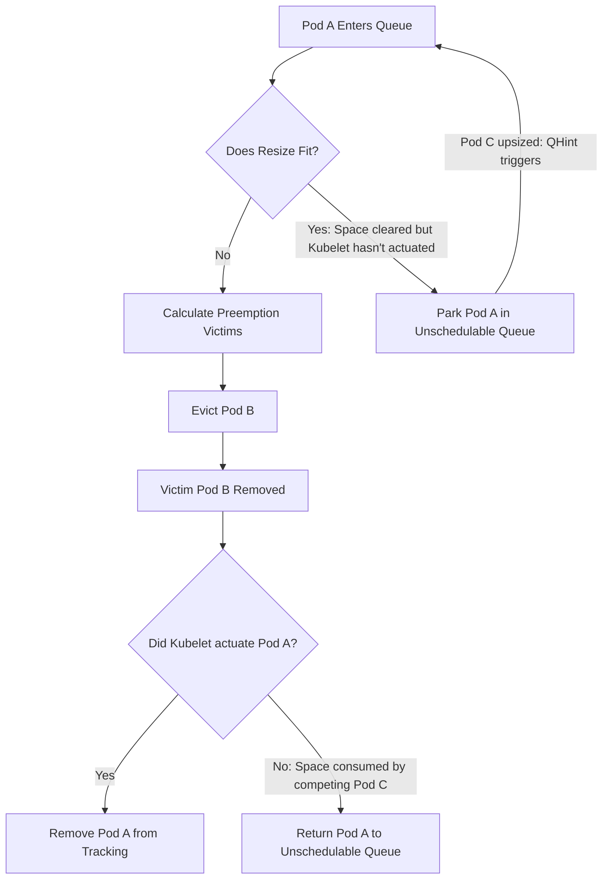

<!--
**Note:** When your KEP is complete, all of these comment blocks should be removed.

Follow the guidelines of the [documentation style guide].
In particular, wrap lines to a reasonable length, to make it
easier for reviewers to cite specific portions, and to minimize diff churn on
updates.

[documentation style guide]: https://github.com/kubernetes/community/blob/master/contributors/guide/style-guide.md

To get started with this template:

- [ ] **Pick a hosting SIG.**
  Make sure that the problem space is something the SIG is interested in taking
  up. KEPs should not be checked in without a sponsoring SIG.
- [ ] **Create an issue in kubernetes/enhancements**
  When filing an enhancement tracking issue, please make sure to complete all
  fields in that template. One of the fields asks for a link to the KEP. You
  can leave that blank until this KEP is filed, and then go back to the
  enhancement and add the link.
- [ ] **Make a copy of this template directory.**
  Copy this template into the owning SIG's directory and name it
  `NNNN-short-descriptive-title`, where `NNNN` is the issue number (with no
  leading-zero padding) assigned to your enhancement above.
- [ ] **Fill out as much of the kep.yaml file as you can.**
  At minimum, you should fill in the "Title", "Authors", "Owning-sig",
  "Status", and date-related fields.
- [ ] **Fill out this file as best you can.**
  At minimum, you should fill in the "Summary" and "Motivation" sections.
  These should be easy if you've preflighted the idea of the KEP with the
  appropriate SIG(s).
- [ ] **Create a PR for this KEP.**
  Assign it to people in the SIG who are sponsoring this process.
- [ ] **Merge early and iterate.**
  Avoid getting hung up on specific details and instead aim to get the goals of
  the KEP clarified and merged quickly. The best way to do this is to just
  start with the high-level sections and fill out details incrementally in
  subsequent PRs.

Just because a KEP is merged does not mean it is complete or approved. Any KEP
marked as `provisional` is a working document and subject to change. You can
denote sections that are under active debate as follows:

```
<<[UNRESOLVED optional short context or usernames ]>>
Stuff that is being argued.
<<[/UNRESOLVED]>>
```

When editing KEPS, aim for tightly-scoped, single-topic PRs to keep discussions
focused. If you disagree with what is already in a document, open a new PR
with suggested changes.

One KEP corresponds to one "feature" or "enhancement" for its whole lifecycle.
You do not need a new KEP to move from beta to GA, for example. If
new details emerge that belong in the KEP, edit the KEP. Once a feature has become
"implemented", major changes should get new KEPs.

The canonical place for the latest set of instructions (and the likely source
of this file) is [here](/keps/NNNN-kep-template/README.md).

**Note:** Any PRs to move a KEP to `implementable`, or significant changes once
it is marked `implementable`, must be approved by each of the KEP approvers.
If none of those approvers are still appropriate, then changes to that list
should be approved by the remaining approvers and/or the owning SIG (or
SIG Architecture for cross-cutting KEPs).
-->
# KEP-5836: Scheduler Preemption for In-Place Pod Resize

<!--
This is the title of your KEP. Keep it short, simple, and descriptive. A good
title can help communicate what the KEP is and should be considered as part of
any review.
-->

<!--
A table of contents is helpful for quickly jumping to sections of a KEP and for
highlighting any additional information provided beyond the standard KEP
template.

Ensure the TOC is wrapped with
  <code>&lt;!-- toc --&rt;&lt;!-- /toc --&rt;</code>
tags, and then generate with `hack/update-toc.sh`.
-->

<!-- toc -->
- [Release Signoff Checklist](#release-signoff-checklist)
- [Summary](#summary)
- [Motivation](#motivation)
  - [Goals](#goals)
  - [Non-Goals](#non-goals)
- [Proposal](#proposal)
  - [User Stories (Optional)](#user-stories-optional)
    - [Story 1: Pods in the Deferred resize status no longer require manual interversion.](#story-1-pods-in-the-deferred-resize-status-no-longer-require-manual-interversion)
    - [Story 2: Reduction of disruption for critical workloads.](#story-2-reduction-of-disruption-for-critical-workloads)
    - [Story 3: Driving cluster autoscaling](#story-3-driving-cluster-autoscaling)
  - [Risks and Mitigations](#risks-and-mitigations)
    - [Performance impact](#performance-impact)
    - [Interaction with workload-aware preemption](#interaction-with-workload-aware-preemption)
    - [Race between a Deferred resize and a new higher-priority pod](#race-between-a-deferred-resize-and-a-new-higher-priority-pod)
    - [Shifting Preemption Victims during Scheduler Restart](#shifting-preemption-victims-during-scheduler-restart)
      - [Risk of Additional Preemption](#risk-of-additional-preemption)
- [Design Details](#design-details)
  - [How Deferred Resizes Integrate into the Scheduling Queue](#how-deferred-resizes-integrate-into-the-scheduling-queue)
    - [Detecting Deferred Resizes in UpdatePod](#detecting-deferred-resizes-in-updatepod)
    - [Queueing Hints in NodeResourcesFit](#queueing-hints-in-noderesourcesfit)
    - [Scheduler Restart and State Recovery](#scheduler-restart-and-state-recovery)
    - [Conflicting Sources of Truth for the Pod](#conflicting-sources-of-truth-for-the-pod)
  - [Processing Deferred Resizes in the Scheduling Cycle](#processing-deferred-resizes-in-the-scheduling-cycle)
    - [<code>NodeName</code> Plugin: Node Restriction via the PreFilter Phase](#nodename-plugin-node-restriction-via-the-prefilter-phase)
    - [<code>NodeResourcesFit</code> Plugin: Calculating Resource Fit in the Filter Phase](#noderesourcesfit-plugin-calculating-resource-fit-in-the-filter-phase)
      - [Handling Node Evaluation Results](#handling-node-evaluation-results)
    - [<code>DefaultPreemption</code> Plugin: Preemption Mechanism Adjustments in the PostFilter Phase](#defaultpreemption-plugin-preemption-mechanism-adjustments-in-the-postfilter-phase)
    - [Summary of Scheduling Cycle Flow](#summary-of-scheduling-cycle-flow)
  - [Scheduler Resource Reservation](#scheduler-resource-reservation)
  - [Kubelet-Scheduler Preemption Interaction](#kubelet-scheduler-preemption-interaction)
    - [Reconsideration Race Conditions](#reconsideration-race-conditions)
  - [Preemption Policies](#preemption-policies)
  - [Pod Priority, Graceful Termination, and Pod Disruption Budget](#pod-priority-graceful-termination-and-pod-disruption-budget)
  - [Node-level Preemption Policy for In-Place Pod Resize](#node-level-preemption-policy-for-in-place-pod-resize)
    - [Kubelet-Scheduler Policy Coordination and Status Propagation](#kubelet-scheduler-policy-coordination-and-status-propagation)
    - [Multiple Owner Support](#multiple-owner-support)
    - [Policy Scope: Exclusivity to Pod Resize](#policy-scope-exclusivity-to-pod-resize)
    - [Kubelet Preemption](#kubelet-preemption)
    - [PodResizePreemptionDisabled Pod Condition](#podresizepreemptiondisabled-pod-condition)
      - [Scheduler Action](#scheduler-action)
  - [Failures and Reconsideration of Deferred pods](#failures-and-reconsideration-of-deferred-pods)
    - [Failure Handler Adjustments for Deferred Pods](#failure-handler-adjustments-for-deferred-pods)
  - [Scope of Interaction with Workload-Aware Preemption](#scope-of-interaction-with-workload-aware-preemption)
  - [Test Plan](#test-plan)
      - [Prerequisite testing updates](#prerequisite-testing-updates)
      - [Unit tests](#unit-tests)
      - [Integration tests](#integration-tests)
      - [e2e tests](#e2e-tests)
  - [Graduation Criteria](#graduation-criteria)
    - [Alpha](#alpha)
    - [Beta](#beta)
    - [GA](#ga)
  - [Upgrade / Downgrade Strategy](#upgrade--downgrade-strategy)
  - [Version Skew Strategy](#version-skew-strategy)
- [Production Readiness Review Questionnaire](#production-readiness-review-questionnaire)
  - [Feature Enablement and Rollback](#feature-enablement-and-rollback)
  - [Rollout, Upgrade and Rollback Planning](#rollout-upgrade-and-rollback-planning)
  - [Monitoring Requirements](#monitoring-requirements)
  - [Dependencies](#dependencies)
  - [Scalability](#scalability)
  - [Troubleshooting](#troubleshooting)
- [Implementation History](#implementation-history)
- [Drawbacks](#drawbacks)
- [Alternatives](#alternatives)
  - [Separate scheduling queue](#separate-scheduling-queue)
  - [Implementing prioritized resizes logic](#implementing-prioritized-resizes-logic)
  - [Preemption Policies](#preemption-policies-1)
  - [Conflicting Sources of Truth for the Pod](#conflicting-sources-of-truth-for-the-pod-1)
  - [Kubelet-Scheduler Preemption Interaction](#kubelet-scheduler-preemption-interaction-1)
  - [Tracking Preemption Nominations to Avoid Double Preemption](#tracking-preemption-nominations-to-avoid-double-preemption)
    - [Option 1: Accept Double Preemption (Alpha Decision)](#option-1-accept-double-preemption-alpha-decision)
    - [Option 2: Internal Nomination Tracking (In-Memory struct)](#option-2-internal-nomination-tracking-in-memory-struct)
    - [Option 3: Reuse NominatedNodeName (NNN)](#option-3-reuse-nominatednodename-nnn)
    - [Option 4: Check Pod spec.nodeName in DefaultPreemption](#option-4-check-pod-specnodename-in-defaultpreemption)
  - [Node-Level Preemption Policy API Options](#node-level-preemption-policy-api-options)
    - [1. Node Annotations (Rejected)](#1-node-annotations-rejected)
    - [2. Scheduler Honors Node Field Directly (Rejected)](#2-scheduler-honors-node-field-directly-rejected)
    - [3. Node Labels (Rejected)](#3-node-labels-rejected)
    - [4. Separate API Object (Rejected)](#4-separate-api-object-rejected)
    - [5. Node Condition (Rejected)](#5-node-condition-rejected)
<!-- /toc -->

## Release Signoff Checklist

<!--
**ACTION REQUIRED:** In order to merge code into a release, there must be an
issue in [kubernetes/enhancements] referencing this KEP and targeting a release
milestone **before the [Enhancement Freeze](https://git.k8s.io/sig-release/releases)
of the targeted release**.

For enhancements that make changes to code or processes/procedures in core
Kubernetes—i.e., [kubernetes/kubernetes], we require the following Release
Signoff checklist to be completed.

Check these off as they are completed for the Release Team to track. These
checklist items _must_ be updated for the enhancement to be released.
-->

Items marked with (R) are required *prior to targeting to a milestone / release*.

- [x] (R) Enhancement issue in release milestone, which links to KEP dir in [kubernetes/enhancements] (not the initial KEP PR)
- [x] (R) KEP approvers have approved the KEP status as `implementable`
- [x] (R) Design details are appropriately documented
- [x] (R) Test plan is in place, giving consideration to SIG Architecture and SIG Testing input (including test refactors)
  - [ ] e2e Tests for all Beta API Operations (endpoints)
  - [ ] (R) Ensure GA e2e tests meet requirements for [Conformance Tests](https://github.com/kubernetes/community/blob/master/contributors/devel/sig-architecture/conformance-tests.md)
  - [ ] (R) Minimum Two Week Window for GA e2e tests to prove flake free
- [x] (R) Graduation criteria is in place
  - [ ] (R) [all GA Endpoints](https://github.com/kubernetes/community/pull/1806) must be hit by [Conformance Tests](https://github.com/kubernetes/community/blob/master/contributors/devel/sig-architecture/conformance-tests.md) within one minor version of promotion to GA
- [x] (R) Production readiness review completed
- [x] (R) Production readiness review approved
- [ ] "Implementation History" section is up-to-date for milestone
- [ ] User-facing documentation has been created in [kubernetes/website], for publication to [kubernetes.io]
- [ ] Supporting documentation—e.g., additional design documents, links to mailing list discussions/SIG meetings, relevant PRs/issues, release notes

<!--
**Note:** This checklist is iterative and should be reviewed and updated every time this enhancement is being considered for a milestone.
-->

[kubernetes.io]: https://kubernetes.io/
[kubernetes/enhancements]: https://git.k8s.io/enhancements
[kubernetes/kubernetes]: https://git.k8s.io/kubernetes
[kubernetes/website]: https://git.k8s.io/website

## Summary

<!--
This section is incredibly important for producing high-quality, user-focused
documentation such as release notes or a development roadmap. It should be
possible to collect this information before implementation begins, in order to
avoid requiring implementors to split their attention between writing release
notes and implementing the feature itself. KEP editors and SIG Docs
should help to ensure that the tone and content of the `Summary` section is
useful for a wide audience.

A good summary is probably at least a paragraph in length.
-->

[In-Place Pod Resize](https://github.com/kubernetes/enhancements/issues/1287) reached GA in 1.35, allowing pod resizing 
without restarts. However, unlike traditional pod recreation, in-place resizes that exceed node capacity do not currently 
trigger the preemption of lower-priority pods. Instead, they remain in a `Deferred` resize status and require manual 
intervention. We propose that the Scheduler actively creates space for resize requests by preempting lower-priority pods,
following the same preemption logic used when scheduling new pods.

## Motivation

<!--
This section is for explicitly listing the motivation, goals, and non-goals of
this KEP.  Describe why the change is important and the benefits to users. The
motivation section can optionally provide links to [experience reports] to
demonstrate the interest in a KEP within the wider Kubernetes community.

[experience reports]: https://github.com/golang/go/wiki/ExperienceReports
-->

The introduction of In-Place Pod Resize gives platform teams new ways to optimize cloud resources without restarting pods, 
marking a significant shift in how Kubernetes operates. This is especially powerful when In-Place Pod Resize is integrated
with higher-level autoscaling controllers such as VPA's new `InPlaceOrRecreate` mode. However, users currently lack a 
way to control scale-up behavior when a node lacks the capacity to fulfill the request. Consequently, workloads may face 
disruptions such as being moved to a larger node, or suffering an OOM-kill because memory could not be scaled up in-place.

Scheduler preemption eliminates the gap by introducing an configurable ability to free up capacity on a fully-utilized
node to allow the scale up to succeed in-place.

### Goals

<!--
List the specific goals of the KEP. What is it trying to achieve? How will we
know that this has succeeded?
-->

1. Introduce the ability to instruct the Scheduler to preempt lower-priority pods to make room for a `Deferred` resize.
2. Keep the preemption behavior for `Deferred` resizes aligned with the preemption behavior for newly created pods. 

### Non-Goals

<!--
What is out of scope for this KEP? Listing non-goals helps to focus discussion
and make progress.
-->

1. Perform the entire scheduling cycle (including binding, DRA, etc) on `Deferred` resizes; the Scheduler should trigger 
preemption and nothing more. 
2. Coordinate with higher-level autoscalers such as VPA or CA on the preemption decision. This is considered out
of scope for this KEP, but may be considered as a future enhancement. 
3. Changing the source of truth for resize allocations. The Kubelet remains responsible for evaluating incoming resize requests, and the scheduler must account for cases where the Kubelet's runtime decisions differ from the scheduler's calculated predictions.

## Proposal

<!--
This is where we get down to the specifics of what the proposal actually is.
This should have enough detail that reviewers can understand exactly what
you're proposing, but should not include things like API designs or
implementation. What is the desired outcome and how do we measure success?.
The "Design Details" section below is for the real
nitty-gritty.
-->

In-Place Pod Resize requests that result in a `Deferred` resize status trigger scheduler preemption, keeping the 
behavior aligned with scheduler preemption for newly created pods. 

The Scheduler watches for `Deferred` resizes. To make room for the resize, it tries to preempt (evict) lower-priority pods to make the resize possible. The Kubelet today watches for pod removals and reacts to the eviction by reattempting the previously `Deferred` resize. 

### User Stories (Optional)

<!--
Detail the things that people will be able to do if this KEP is implemented.
Include as much detail as possible so that people can understand the "how" of
the system. The goal here is to make this feel real for users without getting
bogged down.
-->

#### Story 1: Pods in the Deferred resize status no longer require manual interversion.

Users are enabled to instruct the system to automatically evict lower-priority workloads rather than the resize 
request sitting there indefinitely.

#### Story 2: Reduction of disruption for critical workloads.

The Scheduler would preferentially evict lower-priority pods before an external controller, such as  VPA's 
[InPlaceOrRecreate mode](https://github.com/kubernetes/autoscaler/tree/master/vertical-pod-autoscaler/enhancements/4016-in-place-updates-support#in-place-updates), 
would be forced to fall back to the more disruptive action of evicting and recreating the critical pod itself.

#### Story 3: Driving cluster autoscaling

If a pod managed by a workload controller is preempted, the corresponding controller will likely create new pods
in response to the preemption, which will appear in the scheduling queue. By moving the 
resource deficit from an indefinite Deferred status into the active scheduling queue, preempted pods will naturally trigger cluster autoscalers to provision new capacity. 

### Risks and Mitigations

<!--
What are the risks of this proposal, and how do we mitigate? Think broadly.
For example, consider both security and how this will impact the larger
Kubernetes ecosystem.

How will security be reviewed, and by whom?

How will UX be reviewed, and by whom?

Consider including folks who also work outside the SIG or subproject.
-->

#### Performance impact

If there are a significant number of deferred pods, periodic processing of those pods can affect scheduling throughput. To mitigate this, deferred pods are only reconsidered if something on the node has changed that could make preemption succeed.

#### Interaction with workload-aware preemption

With workload-aware preemption, the resize may end up triggering preemption of a potentially large workload. In these cases, the preempted workload would always be lower priority than the pod that is being resized, so we consider this working as intended.

#### Race between a Deferred resize and a new higher-priority pod

From the scheduler's view, once the spec is updated, the resources are already reserved. It doesn't matter from the scheduler perspective whether the resize has been actuated by the Kubelet yet.

This means that if a new, higher-priority pod comes in and the only way to fit it is by taking the space the Deferred pod is trying to grow into, the standard preemption logic applies. This might mean the resizing pod itself gets evicted if it’s the best victim candidate. While we would rather not kill pods unnecessarily, this behavior is consistent with the rest of the scheduler's logic.

#### Shifting Preemption Victims during Scheduler Restart

If a `Deferred` resize was mid-preemption when the scheduler crashed or restarted, the new scheduler instance might select a different victim pod than the original instance did. This can happen due to:

*   Changes in cluster state (new pods, node updates) during the scheduler's downtime.
*   Non-deterministic tie-breaking when multiple low-priority pods satisfy the resource requirement equally well.

In specific edge cases, this leads to redundant preemption. "Victim A" (targeted by the first scheduler) and "Victim B" (targeted by the second scheduler) may both be terminated to satisfy a single resize request.

Mitigations:
*   **Idempotency:** The `Delete` API is already idempotent. If the scheduler picks the same victim upon restart, the API server simply acknowledges the request without further disruption.
*   **Acceptable Waste:** In the Kubernetes priority model, ensuring the success of a higher-priority workload (the resizing pod) justifies the potential loss of multiple lower-priority victims during a rare control-plane failure.

To address double preemption risks across scheduler restarts and long graceful termination periods, we are exploring tracking mechanisms (such as using the pod's nominated node name). We will fully evaluate these options and finalize the approach for Beta; see details in [Tracking Preemption Nominations to Avoid Double Preemption](#tracking-preemption-nominations-to-avoid-double-preemption).

##### Risk of Additional Preemption

The Scheduler (via the `NodeResourcesFit` plugin) assumes the resources of pods to be `max(desired, allocated, actual)`. This ensures that the node does not end up overcommitted in the event that Kubelet actuates a resize while the new pod is being scheduled. This behavior is correct for scheduling of newly created pods.

However, this logic results in potentially unnecessary preemption during scheduler-evaluation of `Deferred` pods. 

The Kubelet determines resource fit in the event of a resize by assuming resources as: 
- For the pod that is being resized, use `max(desired, allocated, actual)`. 
- For all other pods on the node, use `max(allocated, actual)` (ignoring desired). 

Consider this case with 4 pods, all `Deferred`:

- Pod1 (high priority): desired=X, allocated=X/2, actuated=X/2
- Pod2,3,4 (low priority): desired=2X, allocated=X/2, actuated=X/2
- Node allocatable=2X

If we use `max(desired, allocated, actual)` for all pods, then: 

1. Preemption logic first removes all candidate pods, so it sees node is using X (Pod 1's max). 
2. The Scheduler first tries to reprieve pod 2 which is assumed to have max(2X, X/2, X/2) resources. 2X + X = 3X, which is more than node allocatable 2X. The Scheduler determines this pod cannot be reprieved.
3. The Scheduler goes through the same process for pods 3 and 4, and determines that they cannot be reprieved.

All 3 pods (Pod 2, 3, and 4) would be preempted, even though it was only necessary to preempt one of them.

To prevent unnecessary preemption, the `NodeResourcesFit` plugin would need to likewise assume resources in the same way as the Kubelet when evaluating deferred pods, while maintaining its existing behavior for scheduling new pods.

If we use our modified logic, where only the resizing pod uses `max(desired, allocated, actual)` and the remaining pods use `max(allocated, actual)`, then:

1. Preemption logic first removes all candidate pods, so it sees node is using X (Pod 1's max).
2. The Scheduler first tries to reprieve pod 2, which assumed to have max(X/2, X/2) resources.  X/2 + X = 1.5X, which is less than node allocatable 2X, so pod 2 is reprieved.
3. The Scheduler tries to reprieve pod 3, which assumes to have max(X/2, X/2) resources. X/2 + 1.5X = 2X, which still fits within the node allocatable 2X, so pod 3 is reprieved.
4. The Scheduler tries to reprieve pod 4, which assumes to have max(X/2, X/2) resources. X/2 + 2X = 2.5X, which is more than node allocatable 2X, so pod 4 is not reprieved.

This results in only 1 pod (Pod 4) being preempted.

Such a modification to the `NodeResourceFit` plugin is out of scope for alpha due to its wide ranging implications across the scheduler. However, we will reconsider this decision prior to beta.

## Design Details

<!--
This section should contain enough information that the specifics of your
change are understandable. This may include API specs (though not always
required) or even code snippets. If there's any ambiguity about HOW your
proposal will be implemented, this is the place to discuss them.
-->

### How Deferred Resizes Integrate into the Scheduling Queue

The scheduling queue is shared between new pods and `Deferred` pods, using existing queuing logic to sort them by their current scheduling priority. 

*See alternative considerations for separate scheduling queues [here](#separate-scheduling-queue) and prioritized resize logic [here](#implementing-prioritized-resizes-logic).*

#### Detecting Deferred Resizes in UpdatePod

The [UpdatePod event handler](https://github.com/kubernetes/kubernetes/blob/60433d43cf0bb83a2ac7d5e767137b3d510026ec/pkg/scheduler/eventhandlers.go#L147) is responsible for maintaining the state of the scheduling queue based on changes to the pod objects, and includes logic to handle pods with a `Deferred` resize:

* **If the deferred condition is added to a pod**: The Scheduler adds the pod to the scheduling queue.
* **If the deferred condition is removed**: The Scheduler removes the pod from whatever queue it's currently in. This can occur if the user reverts the resize request or if the Kubelet is able to satisfy the resize request due to other pods being removed or downsized.

#### Queueing Hints in NodeResourcesFit

If the `Deferred` pod's spec (desired) resources change (which can happen if the desired resources are updated before the previously requested resize can complete), the Scheduler updates its view of the pod by leveraging `NodeResourcesFit` queueing hints (QHints). The `NodeResourcesFit` QHint for target pod updates detects this change and automatically moves the pod back to the active queue if resource changes are detected.

#### Scheduler Restart and State Recovery

Because the scheduler's internal `activeQ` and `Unschedulable` pods pool are maintained in-memory, a scheduler restart clears the state of all pods currently undergoing preemption for a resize. To prevent these pods from remaining in a `Deferred` state indefinitely,
the scheduler must proactively re-identify them upon startup.

*   **Cold-Start Re-Queueing:** As part of initialization, the scheduler adds deferred pods to the scheduling queue in the `AddPod` event handler.
*   **Re-evaluation:** Once in the queue, these pods undergo the standard evaluation flow
(Node Fit -> Preemption).

*See risk considerations for shifting victims [here](#shifting-preemption-victims-during-scheduler-restart) and alternative considerations for double preemption mitigation [here](#tracking-preemption-nominations-to-avoid-double-preemption).*

#### Conflicting Sources of Truth for the Pod

Adding a snapshot of a deferred pod directly to the scheduling queue means the pod exists in two places simultaneously: the scheduling cache and the scheduling queue. Any subsequent pod updates (such as resize requests, priority updates, or label changes) must be propagated to both the cache and the queue in parallel.

The primary risk with this approach is ensuring that no existing or future scheduler logic implicitly assumes a pod has a single unique representation or reference. We must audit the scheduler codebase to ensure that:
1. Pod updates correctly target both locations. The pod should be updated in the cache first, then in the queue, to make any divergences between the two more predictable.
2. No downstream scheduling or preemption logic relies on strict pointer equality of pod objects across the cache and queue boundaries.
3. Resource double-counting is avoided on the target node by excluding the pod's additional resources during resource fit calculations as described in the section below.

*See alternative considerations for how to handle this without dual representation (such as using a dynamic `PodGetter` interface) [here](#conflicting-sources-of-truth-for-the-pod-1).*

### Processing Deferred Resizes in the Scheduling Cycle

When processing a pod with a `Deferred` resize, the scheduler runs it through a modified scheduling cycle. Rather than evaluating the pod as if it were brand-new to the cluster, the cycle is restricted exclusively to resource capacity checks and preemption logic. This differs from standard scheduling in two key ways:

* **Targeted Node Search**: Candidate node evaluation is restricted solely to the node the deferred pod is already running on.
* **Bypassing Irrelevant Constraints**: All scheduling plugins irrelevant to direct resource capacity fitting (such as node affinity, pod anti-affinity, and topology spread constraints) are bypassed.

To achieve this cleanly and without hardcoding specific plugin names on the framework side, we adjust all irrelevant plugins to be skipped when processing `Deferred` pods.

Only **`NodeName`**, **`NodeResourcesFit`**,  and **`DefaultPreemption`** plugins implement handling for processing `Deferred` pods. All other plugins are modified to implement the `PreFilter` interface and return `Skip` for `Deferred` pods, which results in the plugin being bypassed for deferred resize scheduling cycles. Out-of-tree plugin developers are advised to align their implementation for handling of `Deferred` pods.

#### `NodeName` Plugin: Node Restriction via the PreFilter Phase

The `NodeName` plugin is adjusted to implement the `PreFilter` phase. Because the deferred resize pod is already bound to and running on a host, the scheduler limits the candidate search space at the start of the scheduling cycle. If a pod specifies `Spec.NodeName`, its `PreFilter` returns a `PreFilterResult` containing only that node. This restricts the candidate node evaluation search space to just the pod's currently assigned node.

#### `NodeResourcesFit` Plugin: Calculating Resource Fit in the Filter Phase

The `NodeResourcesFit` plugin will run its `PreFilter` and `Filter` phases for deferred resize pods. It runs a modified resource-fit check to specially handle `Deferred` pods.

To prevent the double-counting of resources when a deferred-resize pod is evaluated for scheduling or preemption fit on its assigned node, the `NodeResourcesFit` plugin is adjusted to leverage the scheduler cache's existing resource accounting logic. 

If the pod is already assigned to the node being evaluated, the scheduler's cache has already factored the pod's resource footprint into the node's aggregated requested resources (`nodeInfo.Requested`), so the plugin uses `nodeInfo.Requested` directly in most cases.

However, in the event that the pod taken from the queue has resource requests diverging from the pod taken from the cache (which can happen due to some race conditions), the plugin will look up the pod in `NodeInfo` and adjust the node's requested resources by adding the difference, assuming the pod's resources to be the maximum of the two.

##### Handling Node Evaluation Results

In most cases, this restricted search results in a resource fit error, naturally triggering the scheduler's preemption pathway. In this case, the pod will be kept in the `Unschedulable` queue.

However, if the resize fits without needing preemption (e.g., if cluster topology shifts or other workloads exit, freeing up capacity on the host), the `NodeResourcesFit` plugin returns a status of `UnschedulableAndUnresolvable` (with a message like `"pod resize fits, waiting for Kubelet actuation"`). Because the node status is `UnschedulableAndUnresolvable` rather than `Unschedulable`, the `DefaultPreemption` plugin's PostFilter phase skips victim selection on the node (as it only evaluates `Unschedulable` nodes). This ensures the scheduler skips the preemption phase, but keeps the deferred pod in the `Unschedulable` queue.

Because a parked pod's capacity can be consumed by other workloads before the Kubelet actuates it, the scheduler registers `NodeResourcesFit` QHints to watch for pod upsize events on the same node. If another pod on the node scales up, the QHint moves the parked pod back to the `activeQ` for re-evaluation.

The necessity of keeping the pod in the `Unschedulable` queue and using QHints for requeuing is explained further in [Reconsideration Race Conditions](#reconsideration-race-conditions).

#### `DefaultPreemption` Plugin: Preemption Mechanism Adjustments in the PostFilter Phase

Only the `DefaultPreemption` plugin runs during the PostFilter phase for deferred resize pods; other PostFilter plugins will be modified to skip processing for deferred resize pods.

The modifications to the `NodeName` and `NodeResourceFit` plugins ensure two important components of the desired behavior:

* **Victim Selection Constraint**: The search for preemption victims is isolated exclusively to the deferred pod's active node. This is already done by the `NodeName` plugin in the `PreFilter` phase. However, because of workload-aware group scheduling, preempting a victim on the target node might still trigger the cascaded preemption of related pods on other nodes.

* **Resource Accounting Adjustment**: During the preemption evaluation, the fit plugin is adjusted to specially handle the deferred pod's resources, as described in [`NodeResourcesFit` Plugin: Calculating Resource Fit in the Filter Phase](#noderesourcesfit-plugin-calculating-resource-fit-in-the-filter-phase).

Similar to the Filter phase, the preemption and reprieve logic runs only the resource-fit checks, skipping irrelevant constraints like affinity and topology spread constraints.

#### Summary of Scheduling Cycle Flow

Taking all the above into account, the logic for processing a `Deferred` resize is as follows:

1. **Identify Deferred Status**: Confirm the pod has a `Deferred` resize and is already bound to a node. Enqueue it in the Scheduling queue.
2. **Evaluate Fit and Trigger Preemption**: Perform node evaluation restricted to the current node. 
    * The node evaluation logic should run only the logic for the resource-fit check, skipping filters that are relevant only to initial scheduling, such as affinity/anti-affinity rules and topology spread constraints. 
    * The resource-fit logic is adjusted to specially handle the deferred pod's resources, as described in [`NodeResourcesFit` Plugin: Calculating Resource Fit in the Filter Phase](#noderesourcesfit-plugin-calculating-resource-fit-in-the-filter-phase).
    * If the resize fits on the node, move the pod into the `Unschedulable` queue and skip victim selection (see [Reconsideration Race Conditions](#reconsideration-race-conditions) for more details).
3. **Trigger Preemption**  If a `FitError` occurs, initiate the Scheduler preemption logic.
4. **Calculate Victims**: Identify suitable preemption victims, with the search restricted to the current node. The resource-fit logic is adjusted to specially handle the deferred pod's resources, as described in [`NodeResourcesFit` Plugin: Calculating Resource Fit in the Filter Phase](#noderesourcesfit-plugin-calculating-resource-fit-in-the-filter-phase), and irrelevant constraints such as affinity and topology spread are skipped.
5. **Reevaluation**: When the victim pod is removed, the `Deferred` resize pod is triggered and moved from `Unschedulable` pods into the scheduling queue, resulting in reevaluation.

### Scheduler Resource Reservation

After a preemption occurs, we want to ensure that the space is not taken up by another pod that has not yet been scheduled. However, due to the fact that the Scheduler assumes that the resources being used by a pod are equal to `max(desired, allocated, actual)`, and that the new requested resizes are reflected in the pod's spec, the scheduler naturally already reserves the space for the resizing pod. This means that the Scheduler does not need to take any special action to ensure the resources are reserved.

### Kubelet-Scheduler Preemption Interaction

The Kubelet monitors pod removals, including evictions, and automatically retries a resize as soon as it detects that a victim pod has been cleared. The removal of the victim pod triggers a scheduling cycle, during which the deferred resize pod is reevaluated.

#### Reconsideration Race Conditions

It is possible that the Kubelet chooses to resize a different pod than the one that triggered the eviction. Consider
the case where Pod A has a deferred resize and triggers the eviction of Pod B. In the meantime, a higher-priority resize of 
Pod C is requested. In this case, the kubelet correctly prioritizes the resize of Pod C over the resize of Pod A.
In this case, we ensure that Pod A stays in the scheduling queue until its resize can complete successfully, 
including any additional evictions it may trigger.

We can model deferred resize retries analogous to the way standard scheduling already works today. 
For standard pods, if a pod cannot be scheduled:
1. The new pod triggers preemption.
2. The pod gets moved to the `Unschedulable` queue.
3. When the preemption victim is finally removed, pods that were previously unschedulable but may now become schedulable are moved back to the active (or backoff) queue.

With deferred resize, we can follow a parallel path:
1. The resize request triggers preemption.
2. The pod gets moved to the `Unschedulable` queue.
3. When the preemption victim is removed, the deferred resize pod is moved back to the active (or backoff) queue.

However, a notable race condition arises: the Kubelet may not finish resizing either Pod A or Pod C before the scheduler evaluates Pod A again. During this reevaluation, the scheduler observes that the resize now 'fits' on the node during its node fit checks. 

To protect against this race, we park the resize back into the `Unschedulable` queue. The lifecycle then resolves via one of three eventualities:
- **Pod A is correctly resized**: It loses its deferred condition. The scheduler observes this through watches and discards it from tracking.
- **Pod C is resized**: (Even though the scheduler preempted for Pod A). There is now no longer enough room for Pod A's resize. The scale-up event of Pod C triggers the `NodeResourcesFit` QHint, which moves Pod A back to the `activeQ` so it can trigger another preemption (as explained in [Handling Node Evaluation Results](#handling-node-evaluation-results)).
- **Both Pod A and Pod C get resized**: Both lose deferred conditions and are removed from scheduling queue tracking entirely.

The following diagram illustrates the flow:



*See alternative considerations for the deferred resize lifecycle [here](#kubelet-scheduler-preemption-interaction-1).*

### Preemption Policies

The existing preemption policies for scheduling new pods now also apply to `Deferred` resizes.

This means that the default `preemptionPolicy`, `PreemptLowerPriority`, allows the resize of pods of that PriorityClass to preempt lower-priority pods. If `preemptionPolicy` is set to `Never`, the resize of pods in that `PriorityClass` is non-preempting.

We considered creating a separate, independent preemption policy for `Deferred` resizes, but introducing this divergence adds 
unnecessary complexity for both users and maintainers:
  * Users would now be required to manage two different preemption behaviors for one pod.
  * The behavior may end up hard to predict, where a pod can preempt upon starting, but not to grow. 
  * We would have to define the matrix of interactions between two independent preemption fields, leading to ambiguous states 
  (e.g. what happens if `preemptionPolicy` is set to `Never` but `resizePreemptionPolicy` is set to `PreemptLowerPriority`)?
  * Adds code complexity, including updates to the Pod API, validation logic, and new branches in the Scheduler.

If a pod is marked with `preemptionPolicy: PreemptLowerPriority`, the user has already communicated that this workload
is more important than lower-priority tasks. Whether that importance is manifested during initial placement or vertical 
scale-up, the intent of the priority remains the same.

*See alternative considerations for preemption policies [here](#preemption-policies-1).*

### Pod Priority, Graceful Termination, and Pod Disruption Budget

Because we are reusing the existing Scheduling preemption logic, the behavior is aligned with existing preemption behavior for new pods. This means:

  * Pods are preempted according to their Pod Priority.
  * The graceful termination period of victim pods is honored.
  * PodDisruptionBudget is supported, but not guaranteed.   

### Node-level Preemption Policy for In-Place Pod Resize

To avoid unnecessary disruption on nodes that have their own autoscaling solutions (such as resizable nodes), cluster operators and controllers need a way to disable scheduler-triggered preemption specifically when it is caused by an in-place pod resize request on those nodes. This protects critical workloads by preventing the scheduler from preempting low-priority pods to make room for a higher-priority resize, allowing the system to prefer node upsizing over preemption-induced disruption.

We propose a new field on the `Node` object to configure this policy, wrapped within a high-level `PodPreemptionPolicy` struct in `NodeSpec`:

```go
// NodeSpec contains the desired configuration of a node.
type NodeSpec struct {
    // PodPreemptionPolicy controls the node-level preemption behaviors for pods on this node.
    // +optional
    PodPreemptionPolicy *NodePodPreemptionPolicy `json:"podPreemptionPolicy,omitempty"`
}

// NodePodPreemptionPolicy defines the node-level policies governing preemption for pods on this node.
type NodePodPreemptionPolicy struct {
    // DisableResizePreemption lists the owners (e.g., autoscalers, operators, administrators) 
    // that have requested to disable scheduler and Kubelet preemption for in-place pod resize on this node.
    // If this list is non-empty, resize-induced preemption is disabled on this node.
    // +listType=set
    // +optional
    // +k8s:optional
    // +k8s:eachVal=+k8s:format=k8s-label-key
    // +k8s:maxItems=20
    // +k8s:listType=set
    DisableResizePreemption []string `json:"disableResizePreemption,omitempty"`
}
```

An example YAML configuration for the `Node`:

```yaml
apiVersion: v1
kind: Node
metadata:
  name: resizable-node
spec:
  podPreemptionPolicy:
    disableResizePreemption:
      - autoscaling.k8s.io/cluster-autoscaler
      - autoscaling.k8s.io/vpa-updater
```

The strings under `disableResizePreemption` have the same validation and constraints as standard Kubernetes label keys (e.g., a DNS subdomain prefix and a name separated by a `/`), and the list can have maximum of 20 entries.

*See alternative considerations for the node-level preemption policy API [here](#node-level-preemption-policy-api-options).*

#### Kubelet-Scheduler Policy Coordination and Status Propagation

While having the scheduler inspect the Node field directly is technically feasible, we choose to have the Kubelet manage this policy and propagate it to the scheduler via the Pod status. This approach offers several key design advantages:

1. **Cleaner Decoupling:** Keeping the scheduler's preemption path pod-centric avoids direct coupling between the scheduler and individual Node specification policies.
2. **Lifecycle Alignment:** The Kubelet natively owns the resize evaluation and enactment lifecycle. By letting the Kubelet evaluate the node policy and update the Pod status, the policy remains tightly integrated with the pod's resize lifecycle.
3. **Kubelet Preemption Consistency:** The Kubelet itself performs internal preemption for critical workloads (e.g., node-critical pods) requesting a resize. Having the Kubelet manage the policy enables Kubelet-side preemption to seamlessly honor the same preemption controls.

Instead, the mechanism relies on cooperation between the Kubelet and the Scheduler via the Pod status, leveraging the `PodResizePreemptionDisabled` condition which is described in more detail in the [PodResizePreemptionDisabled Pod Condition](#PodResizePreemptionDisabled-pod-condition) section.

The cooperation between the Kubelet and Scheduler is as follows:
1.  **Configuration**: A cluster operator or controller adds its identifier to the `spec.preemptionPolicy.disablePodResizePreemption` set on the Node object.
2.  **Kubelet Inspection**: The Kubelet watches its own Node object and caches this configuration. If the preemption policy changes, the Kubelet updates the `PodResizePreemptionDisabled` condition on already-`Deferred` pods to reflect the new policy.
3.  **Pod Status Update**: When the Kubelet evaluates an In-Place Pod Resize request and determines it must be `Deferred` due to insufficient capacity, it checks the Node's `spec.preemptionPolicy.disablePodResizePreemption` field.
4.  **Signaling the Scheduler**: If the list is non-empty, the Kubelet updates the Pod's status by setting the `Deferred` resize condition and setting the Kubelet-owned `PodResizePreemptionDisabled` condition to `True` (with Reason: `PreemptionDisabled` and an appropriate message).
5.  **Scheduler Action**: The Scheduler, in its `UpdatePod` event handler and scheduling queue processing, inspects the Pod's conditions. If a `Deferred` pod has `PodResizePreemptionDisabled` set to `True` with Reason `PreemptionDisabled`, the Scheduler ensures that the pod is not in the scheduling queue. The pod remains `Deferred` without triggering cluster disruption. If a `Deferred` pod does not have `PodResizePreemptionDisabled` set to `True` with Reason `PreemptionDisabled`, the scheduler ensures that the pod is in the scheduling queue and attempts preemption.

#### Multiple Owner Support

In environments with multiple controllers (e.g., multiple autoscalers) managing the same node, conflicts can arise. To support this, the `spec.preemptionPolicy.disablePodResizePreemption` field is designed as a set-type list (`+listType=set`). The Kubelet honors the policy if the list contains any entries (representing at least one active owner requesting the policy). 

#### Policy Scope: Exclusivity to Pod Resize

This policy is strictly limited to pod resize requests and does not apply to new pod scheduling. In a mixed cluster (containing both resizable and non-resizable nodes), applying a preemption-disabling policy to new pod scheduling on a resizable node would cause the scheduler to simply select victims on a non-resizable node instead, defeating the purpose of the policy. For in-place pod resize, however, preemption is already strictly confined to the target node where the pod is running.

#### Kubelet Preemption

The Kubelet contains internal preemption logic to ensure that critical pods can be admitted and run. With In-Place Pod Resize, this extends to Kubelet-side preemption when a critical pod requests a resize that exceeds available node capacity.

Kubelet-side preemption also honors the node-level preemption policy. If the Node's `spec.podPreemptionPolicy.disableResizePreemption` list is non-empty, the Kubelet does not preempt existing pods on the node to accommodate the resize request. Instead, the Kubelet marks the pod's resize as `Deferred` and sets the `PodResizePreemptionDisabled` condition to `True` with reason `PreemptionDisabledByNodePolicy`.

This ensures a consistent operational model for the node: *no pods are preempted to satisfy any resize request*, preserving the stability of all workloads on the node and forcing the system to rely on node autoscaling (upsizing) to resolve the resource deficit.

#### PodResizePreemptionDisabled Pod Condition

When the Node's preemption policy prohibits preemption for resize requests (the `spec.podPreemptionPolicy.disableResizePreemption` list is non-empty), the Kubelet sets the `PodResizePreemptionDisabled` condition to `True` with reason `PreemptionDisabledByNodePolicy` upon deferring the resize. This communicates to the scheduler that the `Deferred` resize request should be blocked because preemption has been disabled on the node.

```yaml
status:
  conditions:
  - type: PodResizePreemptionDisabled
    status: "True"
    reason: PreemptionDisabledByNodePolicy
    message: "Preemption for in-place pod resize is disabled on node 'node-1' by preemption policy."
    lastTransitionTime: "2026-02-23T15:23:13Z"
```

The Kubelet clears this condition when the node's preemption policy is updated to allow preemption (clearing the list), or when the pod's `Deferred` resize is resolved or cancelled.

##### Scheduler Action

The Scheduler ignores `Deferred` pods that have the `PodResizePreemptionDisabled` condition set to `True`.

The Scheduler's `UpdatePod` handler watches for pod updates and reacts to the `PodResizePreemptionDisabled` condition as follows:
*   **Condition Added**: When the `PodResizePreemptionDisabled` condition is set, the Scheduler removes the pod from the scheduling queue.
*   **Condition Cleared**: When the `PodResizePreemptionDisabled` condition is cleared but the pod's resize is still `Deferred`, the Scheduler adds the pod back to the active scheduling queue to attempt preemption.

### Failures and Reconsideration of Deferred pods

To ensure efficiency and avoid unnecessary reconciliation loops, the Scheduler treats `Deferred` resizes that fail preemption (when preemption is enabled) as a standard `FitError` (Unschedulable). By classifying the resize failure this way, the existing Scheduler retry and backoff logic is triggered automatically, requiring no new dedicated retry infrastructure.

1.  **Queue Placement**: When a preemption attempt fails to find enough victims on the node to satisfy the resize, the pod is moved to the `unschedulablePods` pool within the scheduling queue.
2.  **Triggering Re-entry**: Because the pod is in the `unschedulablePods` pool, it is moved back to the `activeQ` (or `backoffQ`) automatically when cluster events occur that could potentially change the outcome of the preemption logic. These events include:
    * **Pod Deletion**: A pod on the same node is deleted or removed (freeing up capacity).
    * **Pod Downsize**: A pod on the same node has its resource requests decreased.
    * **Node Update**: The node's `Allocatable` resources increase (e.g., via a Kubelet config update).
3.  **Backoff Mechanism**: Standard exponential backoff applies. This ensures that "stuck" resize requests do not degrade the scheduling throughput for the rest of the cluster.

By utilizing the existing `movePodsToActiveOrBackoffQueue` logic and treating the resize deficit as a native scheduling constraint, we ensure that `Deferred` resizes do not consume excessive CPU cycles unless the cluster state has changed in a way that makes success plausible.

To prevent 'thundering herd' issues where unrelated node activity causes resizes to be reevaluated unnecessarily, a pod is only moved back to the `activeQ` when the pod deletion, pod downsize, or node update events occur on the same node as the pod being resized. This is implemented by making the `QueueingHint` (Qhint) functions of the `NodeResourcesFit` plugin node-aware; if the pod is already assigned to a node (indicating a resize request), the Qhints evaluate to `QueueSkip` for any event occurring on a different node.

#### Failure Handler Adjustments for Deferred Pods

When a deferred resize scheduling cycle fails (i.e., there is a fit error and preemption fails or is disabled), the scheduler executes its failure handler (`handleSchedulingFailure`). Because the deferred pod is already scheduled and running on a node, several steps in the standard failure handler must be modified or skipped:

*   **Bypassing the NodeName Re-queue Abort**: For a standard pod, if the pod already has `Spec.NodeName` populated in the informer cache, the failure handler assumes it has been successfully bound and aborts re-queuing it. For `Deferred` pods, this abort check is skipped so that the pod is successfully returned to the `Unschedulable` queue to await future retry attempts.
*   **Skipping `PodScheduled` Condition Updates**: The standard failure handler sets the pod's `PodScheduled` status condition to `False` (with reason `Unschedulable`). For a `Deferred` pod, updating this condition is skipped. For beta, we will implement emitting events to surface the results of the scheduling cycle for observability.
*   **No Nominated Node Name (NNN) Assignment**: Standard scheduling failures can record a `NominatedNodeName` on the pod status to reserve space on a target candidate node. For a `Deferred` pod, no nominated node is set or updated. The pod is already bound to its host, and its resize can only be evaluated and satisfied on that specific host; nominating another node is invalid.

### Scope of Interaction with Workload-Aware Preemption

With workload-aware preemption, there are two scenarios to consider:

1. **The selected victim pod is part of a workload**:
   The scheduler preempts the entire workload. Since the preempted workload's priority is strictly lower than that of the resizing pod, this behaves as designed.

2. **The resizing pod itself is part of a workload**:
   * **High-Level Direction**: When a resizing pod belongs to a workload group (e.g., a PodGroup scheduled atomically), resize-induced preemption must evaluate the impact on the entire workload group. The scheduler must verify if the resize violates any workload-wide invariants (such as minimum member availability or atomic group scheduling rules).
   * **Queueing Behavior for Group Members**: A running pod that requests a resize must be queued and retried individually. If the pod belongs to a `PodGroup`, the scheduling queue instead treats the deferred pod as an independent individual pod. In Alpha, this will be implemented by having `isPodGroupMember` return `false` for deferred resize pods, allowing them to follow the standard individual queueing and backoff pathways.
   * **Alpha Scope**: The resizing pod is evaluated individually for preemption victim selection on its assigned node. The scheduler does not proactively trigger group-wide rescheduling or preemption of other members of the workload group.
   * **Beta Graduation**: Co-existence mechanics, including group-wide coordinated preemption (e.g., preempting other members of the same workload to balance resource usage or preventing preemption if the workload's group-wide health is already degraded), will be fully designed and finalized prior to Beta.

### Test Plan

<!--
**Note:** *Not required until targeted at a release.*
The goal is to ensure that we don't accept enhancements with inadequate testing.

All code is expected to have adequate tests (eventually with coverage
expectations). Please adhere to the [Kubernetes testing guidelines][testing-guidelines]
when drafting this test plan.

[testing-guidelines]: https://git.k8s.io/community/contributors/devel/sig-testing/testing.md
-->

[x] I/we understand the owners of the involved components may require updates to
existing tests to make this code solid enough prior to committing the changes necessary
to implement this enhancement.

##### Prerequisite testing updates

<!--
Based on reviewers feedback describe what additional tests need to be added prior
implementing this enhancement to ensure the enhancements have also solid foundations.
-->

##### Unit tests

<!--
In principle every added code should have complete unit test coverage, so providing
the exact set of tests will not bring additional value.
However, if complete unit test coverage is not possible, explain the reason of it
together with explanation why this is acceptable.
-->

<!--
Additionally, for Alpha try to enumerate the core package you will be touching
to implement this enhancement and provide the current unit coverage for those
in the form of:
- <package>: <date> - <current test coverage>
The data can be easily read from:
https://testgrid.k8s.io/sig-testing-canaries#ci-kubernetes-coverage-unit

This can inform certain test coverage improvements that we want to do before
extending the production code to implement this enhancement.
-->

- k8s.io/kubernetes/pkg/apis/scheduling/v1alpha1: `2026-02-23` - `62.7%`
- k8s.io/kubernetes/pkg/apis/scheduling/validation: `2026-02-23` - `97.8%`
- k8s.io/kubernetes/pkg/scheduler: `2026-02-23` - `81.7%`

##### Integration tests

<!--
Integration tests are contained in https://git.k8s.io/kubernetes/test/integration.
Integration tests allow control of the configuration parameters used to start the binaries under test.
This is different from e2e tests which do not allow configuration of parameters.
Doing this allows testing non-default options and multiple different and potentially conflicting command line options.
For more details, see https://github.com/kubernetes/community/blob/master/contributors/devel/sig-testing/testing-strategy.md

If integration tests are not necessary or useful, explain why.
-->

<!--
This question should be filled when targeting a release.
For Alpha, describe what tests will be added to ensure proper quality of the enhancement.

For Beta and GA, document that tests have been written,
have been executed regularly, and have been stable.
This can be done with:
- permalinks to the GitHub source code
- links to the periodic job (typically https://testgrid.k8s.io/sig-release-master-blocking#integration-master), filtered by the test name
- a search in the Kubernetes bug triage tool (https://storage.googleapis.com/k8s-triage/index.html)
-->

In alpha, we will create integration test(s) to ensure basic functionalities:

- A lower-priority pod can be preempted by a higher-priority `Deferred` resize.
- Several lower-priority pods can be preempted by a higher-priority `Deferred` resize.
- Non-preempting pods according to the `preemptionPolicy` do not trigger preemption.

For beta, we will add additional, more comprehensive integration test. The list here will be finalized here prior to beta graduation.

##### e2e tests

<!--
This question should be filled when targeting a release.
For Alpha, describe what tests will be added to ensure proper quality of the enhancement.

For Beta and GA, document that tests have been written,
have been executed regularly, and have been stable.
This can be done with:
- permalinks to the GitHub source code
- links to the periodic job (typically a job owned by the SIG responsible for the feature), filtered by the test name
- a search in the Kubernetes bug triage tool (https://storage.googleapis.com/k8s-triage/index.html)

We expect no non-infra related flakes in the last month as a GA graduation criteria.
If e2e tests are not necessary or useful, explain why.
-->

We will create a single e2e test to ensure that a lower-priority pod can be preempted by a higher-priority `Deferred` resize, and that the Kubelet successfully actuates the `Deferred` resize after the preemption completes. 

### Graduation Criteria

<!--
**Note:** *Not required until targeted at a release.*

Define graduation milestones.

These may be defined in terms of API maturity, [feature gate] graduations, or as
something else. The KEP should keep this high-level with a focus on what
signals will be looked at to determine graduation.

Consider the following in developing the graduation criteria for this enhancement:
- [Maturity levels (`alpha`, `beta`, `stable`)][maturity-levels]
- [Feature gate][feature gate] lifecycle
- [Deprecation policy][deprecation-policy]

Clearly define what graduation means by either linking to the [API doc
definition](https://kubernetes.io/docs/concepts/overview/kubernetes-api/#api-versioning)
or by redefining what graduation means.

In general we try to use the same stages (alpha, beta, GA), regardless of how the
functionality is accessed.

[feature gate]: https://git.k8s.io/community/contributors/devel/sig-architecture/feature-gates.md
[maturity-levels]: https://git.k8s.io/community/contributors/devel/sig-architecture/api_changes.md#alpha-beta-and-stable-versions
[deprecation-policy]: https://kubernetes.io/docs/reference/using-api/deprecation-policy/

Below are some examples to consider, in addition to the aforementioned [maturity levels][maturity-levels].

#### Alpha

- Feature implemented behind a feature flag
- Initial e2e tests completed and enabled

#### Beta

- Gather feedback from developers and surveys
- Complete features A, B, C
- Additional tests are in Testgrid and linked in KEP
- More rigorous forms of testing—e.g., downgrade tests and scalability tests
- All functionality completed
- All security enforcement completed
- All monitoring requirements completed
- All testing requirements completed
- All known pre-release issues and gaps resolved

**Note:** Beta criteria must include all functional, security, monitoring, and testing requirements along with resolving all issues and gaps identified

#### GA

- N examples of real-world usage
- N installs
- Allowing time for feedback
- All issues and gaps identified as feedback during beta are resolved

**Note:** GA criteria must not include any functional, security, monitoring, or testing requirements.  Those must be beta requirements.

**Note:** Generally we also wait at least two releases between beta and
GA/stable, because there's no opportunity for user feedback, or even bug reports,
in back-to-back releases.

**For non-optional features moving to GA, the graduation criteria must include
[conformance tests].**

[conformance tests]: https://git.k8s.io/community/contributors/devel/sig-architecture/conformance-tests.md

#### Deprecation

<!--
- Announce deprecation and support policy of the existing flag
- Two versions passed since introducing the functionality that deprecates the flag (to address version skew)
- Address feedback on usage/changed behavior, provided on GitHub issues
- Deprecate the flag
-->

#### Alpha

- Feature and API implemented behind a feature flag
- Initial unit, integration, and e2e tests completed and enabled

#### Beta

- Gather feedback from alpha
- Metrics and events are defined and implemented
- Additional integration tests are defined, implemented and linked in KEP
- Interaction with workload aware scheduling is clarified
- Address scenarios where a preemption victim's grace period exceeds the time window allocated for executing the resize operation (such as VPA's fallback time limit).
- Evaluate using nominated node name to prevent double preemption (specifically for the [shifting preemption victims](#shifting-preemption-victims-during-scheduler-restart) scenario); see alternatives in [Tracking Preemption Nominations to Avoid Double Preemption](#tracking-preemption-nominations-to-avoid-double-preemption).
- Evaluate whether we need to solve the additional preemption risk (see [Risk of Additional Preemption](#risk-of-additional-preemption)).
- If [KEP-5517 Alpha2](https://github.com/kubernetes/enhancements/pull/6082/changes) is implemented, ensure that the Deferred resize scheduling cycle includes resources from `pod.status.nodeAllocatableResourceClaimStatuses`.

#### GA

- Allowing time for feedback
- All issues and gaps identified as feedback during beta are resolved
- Additional GA requirements TBD at Beta release

### Upgrade / Downgrade Strategy

<!--
If applicable, how will the component be upgraded and downgraded? Make sure
this is in the test plan.

Consider the following in developing an upgrade/downgrade strategy for this
enhancement:
- What changes (in invocations, configurations, API use, etc.) is an existing
  cluster required to make on upgrade, in order to maintain previous behavior?
- What changes (in invocations, configurations, API use, etc.) is an existing
  cluster required to make on upgrade, in order to make use of the enhancement?
-->

Standard procedures for features introducing new API fields should be used:
  - On upgrade, kube-apiservers should be upgraded first before the Kubelet can write, and kube-scheduler can read, the new pod condition `PodResizePreemptionDisabled` and the new node-level `PodPreemptionPolicy` field.
  - On downgrade, kube-schedulers and Kubelets should be downgraded first (to stop using and writing the new fields) before kube-apiservers are downgraded; note that downgrade of
    kube-apiserver(s) and/or disabling the new API fields will not clear their
    contents for objects already stored in the storage (etcd).

### Version Skew Strategy

<!--
If applicable, how will the component handle version skew with other
components? What are the guarantees? Make sure this is in the test plan.

Consider the following in developing a version skew strategy for this
enhancement:
- Does this enhancement involve coordinating behavior in the control plane and nodes?
- How does an n-3 kubelet or kube-proxy without this feature available behave when this feature is used?
- How does an n-1 kube-controller-manager or kube-scheduler without this feature available behave when this feature is used?
- Will any other components on the node change? For example, changes to CSI,
  CRI or CNI may require updating that component before the kubelet.
-->

N-3 kubelet already marks resizes without enough capacity as `Deferred` and retries when room is made.

While an `n-3` Kubelet correctly defers resizes, it does not recognize the new `spec.podPreemptionPolicy` Node field or propagate the `PodResizePreemptionDisabled` condition. 

To bridge this version skew gap and enforce the operator's policy during upgrade windows, the Scheduler will temporarily check the Node's `spec.podPreemptionPolicy` field directly when evaluating `Deferred` pod resizes. Once Kubelets are upgraded to a version supporting this feature, they will assume sole ownership of policy propagation via the pod condition, and this temporary Scheduler fallback will be removed in a future release.

## Production Readiness Review Questionnaire

<!--

Production readiness reviews are intended to ensure that features merging into
Kubernetes are observable, scalable and supportable; can be safely operated in
production environments, and can be disabled or rolled back in the event they
cause increased failures in production. See more in the PRR KEP at
https://git.k8s.io/enhancements/keps/sig-architecture/1194-prod-readiness.

The production readiness review questionnaire must be completed and approved
for the KEP to move to `implementable` status and be included in the release.

In some cases, the questions below should also have answers in `kep.yaml`. This
is to enable automation to verify the presence of the review, and to reduce review
burden and latency.

The KEP must have a approver from the
[`prod-readiness-approvers`](http://git.k8s.io/enhancements/OWNERS_ALIASES)
team. Please reach out on the
[#prod-readiness](https://kubernetes.slack.com/archives/CPNHUMN74) channel if
you need any help or guidance.
-->

### Feature Enablement and Rollback

<!--
This section must be completed when targeting alpha to a release.
-->

###### How can this feature be enabled / disabled in a live cluster?

<!--
Pick one of these and delete the rest.

Documentation is available on [feature gate lifecycle] and expectations, as
well as the [existing list] of feature gates.

[feature gate lifecycle]: https://git.k8s.io/community/contributors/devel/sig-architecture/feature-gates.md
[existing list]: https://kubernetes.io/docs/reference/command-line-tools-reference/feature-gates/
-->

- [x] Feature gate (also fill in values in `kep.yaml`)
  - Feature gate name: SchedulerPreemptionForPodResize
  - Components depending on the feature gate: kube-apiserver, kube-scheduler, kubelet

###### Does enabling the feature change any default behavior?

<!--
Any change of default behavior may be surprising to users or break existing
automations, so be extremely careful here.
-->

If users already have PriorityClasses defined in their cluster, and are already using In-Place Pod Resize, `Deferred` resizes will now trigger preemption of lower-priority pods. 

###### Can the feature be disabled once it has been enabled (i.e. can we roll back the enablement)?

<!--
Describe the consequences on existing workloads (e.g., if this is a runtime
feature, can it break the existing applications?).

Feature gates are typically disabled by setting the flag to `false` and
restarting the component. No other changes should be necessary to disable the
feature.

NOTE: Also set `disable-supported` to `true` or `false` in `kep.yaml`.
-->

Yes, the feature can be rolled back by disabling the feature gate. 

###### What happens if we reenable the feature if it was previously rolled back?

The feature will start working again; `Deferred` resizes will trigger preemption of lower-priority pods. 

###### Are there any tests for feature enablement/disablement?

<!--
The e2e framework does not currently support enabling or disabling feature
gates. However, unit tests in each component dealing with managing data, created
with and without the feature, are necessary. At the very least, think about
conversion tests if API types are being modified.

Additionally, for features that are introducing a new API field, unit tests that
are exercising the `switch` of feature gate itself (what happens if I disable a
feature gate after having objects written with the new field) are also critical.
You can take a look at one potential example of such test in:
https://github.com/kubernetes/kubernetes/pull/97058/files#diff-7826f7adbc1996a05ab52e3f5f02429e94b68ce6bce0dc534d1be636154fded3R246-R282
-->

The scheduler logic will be covered by regular feature tests.

For the newly introduced API, dedicated enablement/disablement tests at the kube-apiserver registry layer will be added in alpha release.

### Rollout, Upgrade and Rollback Planning

<!--
This section must be completed when targeting beta to a release.
-->

###### How can a rollout or rollback fail? Can it impact already running workloads?

<!--
Try to be as paranoid as possible - e.g., what if some components will restart
mid-rollout?

Be sure to consider highly-available clusters, where, for example,
feature flags will be enabled on some API servers and not others during the
rollout. Similarly, consider large clusters and how enablement/disablement
will rollout across nodes.
-->

###### What specific metrics should inform a rollback?

<!--
What signals should users be paying attention to when the feature is young
that might indicate a serious problem?
-->

###### Were upgrade and rollback tested? Was the upgrade->downgrade->upgrade path tested?

<!--
Describe manual testing that was done and the outcomes.
Longer term, we may want to require automated upgrade/rollback tests, but we
are missing a bunch of machinery and tooling and can't do that now.
-->

###### Is the rollout accompanied by any deprecations and/or removals of features, APIs, fields of API types, flags, etc.?

<!--
Even if applying deprecation policies, they may still surprise some users.
-->

### Monitoring Requirements

<!--
This section must be completed when targeting beta to a release.

For GA, this section is required: approvers should be able to confirm the
previous answers based on experience in the field.
-->

###### How can an operator determine if the feature is in use by workloads?

<!--
Ideally, this should be a metric. Operations against the Kubernetes API (e.g.,
checking if there are objects with field X set) may be a last resort. Avoid
logs or events for this purpose.
-->

###### How can someone using this feature know that it is working for their instance?

<!--
For instance, if this is a pod-related feature, it should be possible to determine if the feature is functioning properly
for each individual pod.
Pick one more of these and delete the rest.
Please describe all items visible to end users below with sufficient detail so that they can verify correct enablement
and operation of this feature.
Recall that end users cannot usually observe component logs or access metrics.
-->

- [ ] Events
  - Event Reason: 
- [ ] API .status
  - Condition name: 
  - Other field: 
- [ ] Other (treat as last resort)
  - Details:

###### What are the reasonable SLOs (Service Level Objectives) for the enhancement?

<!--
This is your opportunity to define what "normal" quality of service looks like
for a feature.

It's impossible to provide comprehensive guidance, but at the very
high level (needs more precise definitions) those may be things like:
  - per-day percentage of API calls finishing with 5XX errors <= 1%
  - 99% percentile over day of absolute value from (job creation time minus expected
    job creation time) for cron job <= 10%
  - 99.9% of /health requests per day finish with 200 code

These goals will help you determine what you need to measure (SLIs) in the next
question.
-->

###### What are the SLIs (Service Level Indicators) an operator can use to determine the health of the service?

<!--
Pick one more of these and delete the rest.
-->

- [ ] Metrics
  - Metric name:
  - [Optional] Aggregation method:
  - Components exposing the metric:
- [ ] Other (treat as last resort)
  - Details:

###### Are there any missing metrics that would be useful to have to improve observability of this feature?

<!--
Describe the metrics themselves and the reasons why they weren't added (e.g., cost,
implementation difficulties, etc.).
-->

### Dependencies

<!--
This section must be completed when targeting beta to a release.
-->

###### Does this feature depend on any specific services running in the cluster?

<!--
Think about both cluster-level services (e.g. metrics-server) as well
as node-level agents (e.g. specific version of CRI). Focus on external or
optional services that are needed. For example, if this feature depends on
a cloud provider API, or upon an external software-defined storage or network
control plane.

For each of these, fill in the following—thinking about running existing user workloads
and creating new ones, as well as about cluster-level services (e.g. DNS):
  - [Dependency name]
    - Usage description:
      - Impact of its outage on the feature:
      - Impact of its degraded performance or high-error rates on the feature:
-->

### Scalability

<!--
For alpha, this section is encouraged: reviewers should consider these questions
and attempt to answer them.

For beta, this section is required: reviewers must answer these questions.

For GA, this section is required: approvers should be able to confirm the
previous answers based on experience in the field.
-->

###### Will enabling / using this feature result in any new API calls?

<!--
Describe them, providing:
  - API call type (e.g. PATCH pods)
  - estimated throughput
  - originating component(s) (e.g. Kubelet, Feature-X-controller)
Focusing mostly on:
  - components listing and/or watching resources they didn't before
  - API calls that may be triggered by changes of some Kubernetes resources
    (e.g. update of object X triggers new updates of object Y)
  - periodic API calls to reconcile state (e.g. periodic fetching state,
    heartbeats, leader election, etc.)
-->

For most of the logic, we are not introducing any new API calls. The Scheduler is already watching for pod updates. The node and pod states are cached in the Scheduler's memory, and is updated when the Informer receives an update. The kubelet will update the pod status when the resize is `Deferred` due to insufficient capacity; this is not a new API call. 

The kubelet is already watching for node updates. However, the kubelet will now make new API calls to update the pod statuses of already-deferred pods in response to changes in the node-level preemption policy.

###### Will enabling / using this feature result in introducing new API types?

<!--
Describe them, providing:
  - API type
  - Supported number of objects per cluster
  - Supported number of objects per namespace (for namespace-scoped objects)
-->

No.

###### Will enabling / using this feature result in any new calls to the cloud provider?

<!--
Describe them, providing:
  - Which API(s):
  - Estimated increase:
-->

No.

###### Will enabling / using this feature result in increasing size or count of the existing API objects?

<!--
Describe them, providing:
  - API type(s):
  - Estimated increase in size: (e.g., new annotation of size 32B)
  - Estimated amount of new objects: (e.g., new Object X for every existing Pod)
-->

The new condition in the pod status will increase the size of pod objects, only when the condition is present.

###### Will enabling / using this feature result in increasing time taken by any operations covered by existing SLIs/SLOs?

<!--
Look at the [existing SLIs/SLOs].

Think about adding additional work or introducing new steps in between
(e.g. need to do X to start a container), etc. Please describe the details.

[existing SLIs/SLOs]: https://git.k8s.io/community/sig-scalability/slos/slos.md#kubernetes-slisslos
-->

There may be some performance impact for scheduling of the pods, as the scheduler now has to additionally process `Deferred` pods.

###### Will enabling / using this feature result in non-negligible increase of resource usage (CPU, RAM, disk, IO, ...) in any components?

<!--
Things to keep in mind include: additional in-memory state, additional
non-trivial computations, excessive access to disks (including increased log
volume), significant amount of data sent and/or received over network, etc.
This through this both in small and large cases, again with respect to the
[supported limits].

[supported limits]: https://git.k8s.io/community//sig-scalability/configs-and-limits/thresholds.md
-->

No.

###### Can enabling / using this feature result in resource exhaustion of some node resources (PIDs, sockets, inodes, etc.)?

<!--
Focus not just on happy cases, but primarily on more pathological cases
(e.g. probes taking a minute instead of milliseconds, failed pods consuming resources, etc.).
If any of the resources can be exhausted, how this is mitigated with the existing limits
(e.g. pods per node) or new limits added by this KEP?

Are there any tests that were run/should be run to understand performance characteristics better
and validate the declared limits?
-->

No.

### Troubleshooting

<!--
This section must be completed when targeting beta to a release.

For GA, this section is required: approvers should be able to confirm the
previous answers based on experience in the field.

The Troubleshooting section currently serves the `Playbook` role. We may consider
splitting it into a dedicated `Playbook` document (potentially with some monitoring
details). For now, we leave it here.
-->

###### How does this feature react if the API server and/or etcd is unavailable?

###### What are other known failure modes?

<!--
For each of them, fill in the following information by copying the below template:
  - [Failure mode brief description]
    - Detection: How can it be detected via metrics? Stated another way:
      how can an operator troubleshoot without logging into a master or worker node?
    - Mitigations: What can be done to stop the bleeding, especially for already
      running user workloads?
    - Diagnostics: What are the useful log messages and their required logging
      levels that could help debug the issue?
      Not required until feature graduated to beta.
    - Testing: Are there any tests for failure mode? If not, describe why.
-->

###### What steps should be taken if SLOs are not being met to determine the problem?

## Implementation History

<!--
Major milestones in the lifecycle of a KEP should be tracked in this section.
Major milestones might include:
- the `Summary` and `Motivation` sections being merged, signaling SIG acceptance
- the `Proposal` section being merged, signaling agreement on a proposed design
- the date implementation started
- the first Kubernetes release where an initial version of the KEP was available
- the version of Kubernetes where the KEP graduated to general availability
- when the KEP was retired or superseded
-->

2026-02-23: KEP Created for alpha release


## Drawbacks

<!--
Why should this KEP _not_ be implemented?
-->

## Alternatives

<!--
What other approaches did you consider, and why did you rule them out? These do
not need to be as detailed as the proposal, but should include enough
information to express the idea and why it was not acceptable.
-->

### Separate scheduling queue

We considered keeping `Deferred` resizes in a separate scheduling queue from new pods. However, the interaction and
prioritization between these two queues was difficult to reason about. It is simpler and more intuitive to consider
`Deferred` resizes as warranting largely the same behavior as new pods with regards to preemption, so keeping them
together in a single queue made more sense.

### Implementing prioritized resizes logic

The Kubelet has a priority order that it attempts to retry `Deferred` resizes, as [defined here](https://github.com/kubernetes/enhancements/tree/master/keps/sig-node/1287-in-place-update-pod-resources#priority-of-resize-requests).

We considered integrating a similar prioritization logic for the `Deferred` resizes in the scheduling queue. However,
this adds a lot of complexity for questionable benefit. Scheduler preemption today considers only Pod Priority,
and unless there is a strong use case to do something more complex, the preemption behavior for `Deferred` resizes 
should stay aligned with that of new pods.

### Preemption Policies

We considered creating a separate, independent preemption policy for `Deferred` resizes, but introducing this divergence adds 
unnecessary complexity for both users and maintainers:
  * Users would now be required to manage two different preemption behaviors for one pod.
  * The behavior may end up hard to predict, where a pod can preempt upon starting, but not to grow. 
  * We would have to define the matrix of interactions between two independent preemption fields, leading to ambiguous states 
  (e.g. what happens if `preemptionPolicy` is set to `Never` but `resizePreemptionPolicy` is set to `PreemptLowerPriority`)?
  * Adds code complexity, including updates to the Pod API, validation logic, and new branches in the Scheduler.

If a pod is marked with `preemptionPolicy: PreemptLowerPriority`, the user has already communicated that this workload
is more important than lower-priority tasks. Whether that importance is manifested during initial placement or vertical 
scale-up, the intent of the priority remains the same.

### Conflicting Sources of Truth for the Pod

To address the complexity of the pod existing in both the cache and the scheduling queue simultaneously, we considered avoiding duplicate state by using a dynamic reference interface.

Instead of storing a direct snapshot of the pod in the scheduling queue, we considered changing the pod representation inside the queue to a `PodGetter` interface:

```go
type PodGetter interface {
    GetPod() *v1.Pod
}
```

Under this alternative:
* For standard pods, `GetPod()` would simply return the stored pod snapshot.
* For deferred resize pods, `GetPod()` would dynamically query the pod directly from the scheduler's shared cache, ensuring a single source of truth.

While this abstraction avoids the need to synchronize pod updates across multiple places, we rejected it because:
* **Bypassing critical scheduling code paths**: Storing a dynamic reference might skip essential queue event handlers. For example, `PriorityQueue.Update` would not be called correctly upon pod updates. This could prevent a pod's preemption from being retried when a relevant event (such as a status or request change) is updated.
* **Increased codebase management overhead**: Circumventing the standard queue update flow would make the scheduling queue's state harder to reason about and manage.
* **Complex refactoring footprint**: It introduces a significant refactoring footprint across core scheduler structures and scheduling plugins that expect immutable pod snapshots throughout their scheduling cycle.

Instead, we chose to explicitly keep the pod object in both places (the cache and the queue) while ensuring we audit and eliminate any downstream logic that assumes the pod exists in only one place.

### Kubelet-Scheduler Preemption Interaction

We considered introducing a mechanism to communicate to the Kubelet exactly which resize event initiated a preemption cascade. This would eliminate opportunistic race conditions between the Kubelet and the scheduler. However, this adds a lot of complexity for arguably worse behavior.

For example, if a higher-priority resize is requested while room is being made by evicting a lower-priority pod, we want to honor the priority. We want the higher-priority pod to get resized, and the other deferred pod to be put back into the scheduling queue. By avoiding explicit signaling, we let Kubernetes naturally honor pod priority; the Kubelet can allocate capacity to the highest-priority workload, and the displaced pod safely returns to the scheduling queue.

### Tracking Preemption Nominations to Avoid Double Preemption

If a `Deferred` resize triggers preemption, there is a risk of "double preemption" (where the scheduler terminates a different set of victims for the same resize request) in two scenarios:
1. **Scheduler Restart**: The scheduler restarts mid-preemption, clearing its in-memory preemption state, and selects a new victim pod upon recovery.
2. **Long Grace Periods**: A victim has a long graceful termination period. While it is terminating, other node activity (such as pod deletion) triggers the scheduler to re-evaluate the `Deferred` pod. If the cluster state has changed or selection is non-deterministic, the preemption logic might select a new victim instead of recognizing the existing termination process.

To mitigate this, the scheduler needs a way to track which pod is preempting what via resource nominations so it does not retry preemption while the initial victim is still terminating. We considered four potential options to address this, and will finalize the approach during the Beta phase:

#### Option 1: Accept Double Preemption (Alpha Decision)
*   **Description**: Treat double preemption as an acceptable edge-case behavior, relying on the API server's delete idempotency to avoid duplicate evictions of the same victim.
*   **Pros**: Zero implementation complexity; keeps the scheduler stateless.
*   **Cons**: Can lead to redundant preemption of additional low-priority workloads in rare scenarios, generating unnecessary load and workload disruption.

#### Option 2: Internal Nomination Tracking (In-Memory struct)
*   **Description**: Maintain an internal, scheduler-private map/struct that tracks active preemption nominations for `Deferred` resizes without persisting or exposing this data outside the scheduler.
*   **Pros**: Restricts the state strictly within the scheduler; does not affect other API clients.
*   **Cons**: Does not survive scheduler restarts, meaning it only resolves the long grace period scenario and leaves the scheduler restart scenario unmitigated.

#### Option 3: Reuse NominatedNodeName (NNN)
*   **Description**: Reuse the existing `status.nominatedNodeName` field on the Pod object to nominate the node where preemption is occurring, allowing the scheduler to recognize existing nominations across restarts and grace periods.
*   **Pros**: Resolves both scheduler restart and long grace period scenarios cleanly by leveraging standard preemption structures.
*   **Cons**: Semantically changes the meaning of `nominatedNodeName` (which is traditionally used only for unscheduled/unplaced pods, whereas the `Deferred` resizing pod is already bound to a node). This could break downstream assumptions in external components that monitor this field.

#### Option 4: Check Pod spec.nodeName in DefaultPreemption
*   **Description**: Modify the preemption logic in `DefaultPreemption` to treat `spec.nodeName` as the nomination node for already-bound pods with deferred resize requests.
*   **Pros**: Avoids mutating `status.nominatedNodeName` (preventing breaking downstream clients) and naturally survives scheduler restarts since `spec.nodeName` and the `Deferred` resize state are persisted.
*   **Cons**: Requires modifying `DefaultPreemption` to check both `nominatedNodeName` (for unscheduled pods) and `spec.nodeName` (for bound resizing pods) when evaluating active nominations.

We plan to evaluate the implications of Option 3 and Option 4 on the Kubernetes ecosystem and decide on the final design for Beta.

### Node-Level Preemption Policy API Options

We identified several API options for implementing the node-level preemption policy before selecting the proposed first-class **Node Field**.

#### 1. Node Annotations (Rejected)
*   **Description**: Setting the policy via a standard or prefixed annotation, such as `scheduler.policy/disable-pod-resize-preemption: "true"`.
*   **Why Rejected**: Core Kubernetes components (such as the Scheduler and Kubelet) should generally not depend on unstructured annotations to drive critical runtime decisions. Annotations are meant for metadata and not for policy enforcement.

#### 2. Scheduler Honors Node Field Directly (Rejected)
*   **Description**: The scheduler would directly watch Node objects, check for the preemption policy in the Node spec, and skip preemption directly.
*   **Why Rejected**: While this is technically feasible, it is better for the Kubelet to manage node-level policies and communicate them to the scheduler via the Pod status (e.g., setting the `PodResizePreemptionDisabled` condition to `True` with reason `PreemptionDisabled` on the Pod). This keeps the scheduler's preemption path pod-centric, avoids direct coupling between the scheduler and individual Node spec policies, and ensures that Kubelet-side internal preemption can easily honor the same policy.

#### 3. Node Labels (Rejected)
*   **Description**: Setting the policy via a node label, e.g., `kubectl label node <node-name> scheduler.policy/disable-pod-resize-preemption="true"`.
*   **Why Rejected**: Labels are intended for identifying and grouping objects (e.g., for node selectors or affinity). They are not meant for carrying fine-grained configuration or policy intent. They lack structured representation and do not support multiple owners cleanly.

#### 4. Separate API Object (Rejected)
*   **Description**: Defining a new API object (e.g., a `NodePreemptionPolicy` CRD) to manage preemption policies outside the core `Node` object, linked via a node selector.
*   **Why Rejected**: This approach is too heavyweight for a simple boolean toggle. It introduces the overhead of managing a new API type, implementing new controllers, and increasing memory usage in the control plane to cache these objects. The operational complexity outweighs the benefits.

#### 5. Node Condition (Rejected)
*   **Description**: Representing the policy status using a Node Condition, e.g., `type: PodResizePreemptionDisabled, status: "True"`.
*   **Why Rejected**: Node Conditions are designed to report the *current observable state* of a node (e.g., `Ready`, `DiskPressure`) as determined by the Kubelet or other controllers. They are not intended to be used by operators to *configure* desired behavior. Furthermore, conditions do not easily support the "multiple owner" scenario (e.g., multiple autoscalers) where multiple entities need to independently express their intent without overwriting each other.

