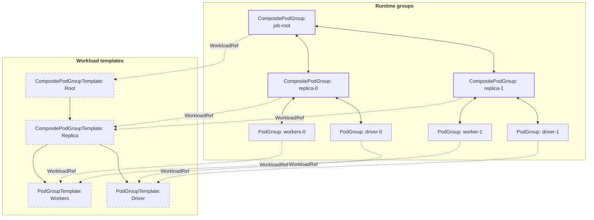

# KEP-6012: CompositePodGroup API

<!--
A table of contents is helpful for quickly jumping to sections of a KEP and for
highlighting any additional information provided beyond the standard KEP
template.

Ensure the TOC is wrapped with
  <code>&lt;!-- toc --&rt;&lt;!-- /toc --&rt;</code>
tags, and then generate with `hack/update-toc.sh`.
-->

<!-- toc -->
- [Release Signoff Checklist](#release-signoff-checklist)
- [Summary](#summary)
- [Motivation](#motivation)
  - [Goals](#goals)
  - [Non-Goals](#non-goals)
- [Proposal](#proposal)
  - [Backward compatibility](#backward-compatibility)
  - [User Stories](#user-stories)
    - [AI training on TPUs](#ai-training-on-tpus)
    - [Disaggregated serving under LeaderWorkerSet](#disaggregated-serving-under-leaderworkerset)
    - [Replicated training jobs under JobSet](#replicated-training-jobs-under-jobset)
  - [Notes/Constraints/Caveats (Optional)](#notesconstraintscaveats-optional)
  - [Risks and Mitigations](#risks-and-mitigations)
    - [Suboptimal Placement Decisions due to NP-Hardness of Multi-level Scheduling](#suboptimal-placement-decisions-due-to-np-hardness-of-multi-level-scheduling)
    - [Consistency and Validity Across Decoupled Hierarchy Objects](#consistency-and-validity-across-decoupled-hierarchy-objects)
    - [API Coverage and Extensibility Gaps](#api-coverage-and-extensibility-gaps)
- [Design Details](#design-details)
  - [API overview](#api-overview)
  - [Changes to the <code>Workload</code> API](#changes-to-the-workload-api)
  - [Changes to the <code>PodGroup</code> API](#changes-to-the-podgroup-api)
    - [<code>WorkloadReference</code>](#workloadreference)
    - [Standalone <code>PodGroup</code> objects](#standalone-podgroup-objects)
  - [<code>CompositePodGroup</code> API](#compositepodgroup-api)
    - [Spec](#spec)
      - [Workload reference](#workload-reference)
      - [Scheduling policy](#scheduling-policy)
      - [Scheduling constraints](#scheduling-constraints)
      - [Disruption mode, priority class name and priority](#disruption-mode-priority-class-name-and-priority)
    - [Status](#status)
  - [API consumption model](#api-consumption-model)
    - [Object ownership and garbage collection](#object-ownership-and-garbage-collection)
  - [API validation](#api-validation)
    - [<code>Workload</code>](#workload)
    - [Group hierarchy](#group-hierarchy)
  - [Changes in kube-scheduler](#changes-in-kube-scheduler)
    - [Multi-level gang scheduling](#multi-level-gang-scheduling)
      - [Prerequisites](#prerequisites)
      - [GangScheduling Plugin Changes](#gangscheduling-plugin-changes)
      - [Recursive Scheduling Cycle Execution](#recursive-scheduling-cycle-execution)
      - [Scheduling sequence for PodGroups](#scheduling-sequence-for-podgroups)
      - [Suboptimal scheduling decisions](#suboptimal-scheduling-decisions)
    - [Integration with workload-aware preemption](#integration-with-workload-aware-preemption)
    - [Multi-level topology-aware scheduling](#multi-level-topology-aware-scheduling)
      - [CompositePodGroup Scheduling Algorithm](#compositepodgroup-scheduling-algorithm)
      - [Preemption in topology-aware scheduling](#preemption-in-topology-aware-scheduling)
  - [Test Plan](#test-plan)
      - [Prerequisite testing updates](#prerequisite-testing-updates)
      - [Unit tests](#unit-tests)
      - [Integration tests](#integration-tests)
      - [e2e tests](#e2e-tests)
  - [Graduation Criteria](#graduation-criteria)
    - [Alpha](#alpha)
    - [Beta](#beta)
    - [GA](#ga)
  - [Upgrade / Downgrade Strategy](#upgrade--downgrade-strategy)
  - [Version Skew Strategy](#version-skew-strategy)
- [Production Readiness Review Questionnaire](#production-readiness-review-questionnaire)
  - [Feature Enablement and Rollback](#feature-enablement-and-rollback)
  - [Rollout, Upgrade and Rollback Planning](#rollout-upgrade-and-rollback-planning)
  - [Monitoring Requirements](#monitoring-requirements)
  - [Dependencies](#dependencies)
  - [Scalability](#scalability)
  - [Troubleshooting](#troubleshooting)
- [Implementation History](#implementation-history)
- [Drawbacks](#drawbacks)
- [Alternatives](#alternatives)
  - [API shape](#api-shape)
    - [<code>PodGroup</code> as a recursive API type](#podgroup-as-a-recursive-api-type)
    - [New API type per hierarchy level](#new-api-type-per-hierarchy-level)
    - [<code>PodSubGroup</code> and <code>PodSet</code>](#podsubgroup-and-podset)
  - [Naming of the new API](#naming-of-the-new-api)
  - [Validation of <code>CompositePodGroup</code>](#validation-of-compositepodgroup)
- [Infrastructure Needed (Optional)](#infrastructure-needed-optional)
<!-- /toc -->

## Release Signoff Checklist

<!--
**ACTION REQUIRED:** In order to merge code into a release, there must be an
issue in [kubernetes/enhancements] referencing this KEP and targeting a release
milestone **before the [Enhancement Freeze](https://git.k8s.io/sig-release/releases)
of the targeted release**.

For enhancements that make changes to code or processes/procedures in core
Kubernetes—i.e., [kubernetes/kubernetes], we require the following Release
Signoff checklist to be completed.

Check these off as they are completed for the Release Team to track. These
checklist items _must_ be updated for the enhancement to be released.
-->

Items marked with (R) are required *prior to targeting to a milestone / release*.

- [ ] (R) Enhancement issue in release milestone, which links to KEP dir in [kubernetes/enhancements] (not the initial KEP PR)
- [ ] (R) KEP approvers have approved the KEP status as `implementable`
- [ ] (R) Design details are appropriately documented
- [ ] (R) Test plan is in place, giving consideration to SIG Architecture and SIG Testing input (including test refactors)
  - [ ] e2e Tests for all Beta API Operations (endpoints)
  - [ ] (R) Ensure GA e2e tests meet requirements for [Conformance Tests](https://github.com/kubernetes/community/blob/master/contributors/devel/sig-architecture/conformance-tests.md)
  - [ ] (R) Minimum Two Week Window for GA e2e tests to prove flake free
- [ ] (R) Graduation criteria is in place
  - [ ] (R) [all GA Endpoints](https://github.com/kubernetes/community/pull/1806) must be hit by [Conformance Tests](https://github.com/kubernetes/community/blob/master/contributors/devel/sig-architecture/conformance-tests.md) within one minor version of promotion to GA
- [ ] (R) Production readiness review completed
- [ ] (R) Production readiness review approved
- [ ] "Implementation History" section is up-to-date for milestone
- [ ] User-facing documentation has been created in [kubernetes/website], for publication to [kubernetes.io]
- [ ] Supporting documentation—e.g., additional design documents, links to mailing list discussions/SIG meetings, relevant PRs/issues, release notes

<!--
**Note:** This checklist is iterative and should be reviewed and updated every time this enhancement is being considered for a milestone.
-->

[kubernetes.io]: https://kubernetes.io/
[kubernetes/enhancements]: https://git.k8s.io/enhancements
[kubernetes/kubernetes]: https://git.k8s.io/kubernetes
[kubernetes/website]: https://git.k8s.io/website

## Summary

This KEP describes the evolution in the workload-aware scheduling architecture
that is necessary to support more complex, hierarchical scheduling requirements
of modern high-performance distributed workloads. We focus on the API, framework
and the basic building blocks - performance optimizations of the underlying
algorithms can come as follow-ups.

To achieve this, the KEP builds on the `Workload` and `PodGroup` APIs from
[KEP-4671] and introduces a new core API called `CompositePodGroup`. This API
allows expressing multi-level topology constraints, gang scheduling and
preemption policies for heterogeneous groups of Pods and facilitates extending
the Kubernetes scheduler with more policies in the future.

## Motivation

Kubernetes 1.36 has made great strides in direction of evolving the process of
scheduling from a Pod-centric approach towards a workload-centric one. Thanks to
these efforts, we are now able to provide simple forms of gang scheduling and
gang preemption policies using the `PodGroup` API introduced in [KEP-4671]. This
release also added support for single-level topology-aware scheduling using the
Node labels-based topology constraints baked into the `PodGroup` and `Workload`
APIs ([KEP-5732]). These features already cover the use cases of simple batch
workloads that are characterized by a flat structure. [KEP-5547] is an example
of a successful integration of the new APIs with the Job controller for a fully
parallel static indexed Job.

Many modern distributed workloads (especially AI ones) demand scheduling
capabilities that cannot be expressed using today's flat APIs. The primary gap
is the ability to model complex, heterogeneous workloads composed of distinct
groups with multi-level dependencies.

Multi-level topology-aware scheduling (TAS) is a prominent example. In
hardware architectures like TPU slices, a multi-level topology layout is
critical to reflecting hardware layouts and obtaining desired performance.
Conversely, workloads like disaggregated serving (prefill and decode) rely on
single-level network domains but require a multi-level structure to enforce
complex lifecycle dependencies (e.g. requiring at least $N$ Prefill and $M$
Decode groups).

These workloads often require multi-level gang scheduling. In this model, a
parent group dictates that it cannot be scheduled until a specified minimum
number of its child groups are schedulable. Essentially, this extends
traditional gang scheduling by treating entire child groups, rather than
individual Pods, as members of a gang.

In addition, a multi-level workload might tolerate partial disruptions. There
should be a way for such workload to express different disruption policies for
different portions of that particular workload.

All of these gaps come from the fact that current scheduling APIs do not allow
expressing any kind of multi-level hierarchy that many out-of-tree Kubernetes
APIs are often characterized with. `JobSet`[^1] and `LeaderWorkerSet`[^2] are
probably the most popular instances of a higher-order API where such hierarchy
exists which often bring about matching scheduling requirements like the ones
mentioned above. To close these gaps, we need to extend the foundational
scheduling APIs in a way that the true workload controllers can express their
multi-level scheduling requirements that kube-scheduler could understand and act
upon accordingly.

### Goals

- Define a new API that facilitates describing the hierarchy of a workload.
- Extend scheduling capabilities to support hierarchical scheduling
  requirements, including:
  - Multi-level gang scheduling.
  - Multi-level preemption policies
  - Multi-level topology scheduling constraints.
- Ensure future extensibility of the API with new scheduling and disruption
  policies.

### Non-Goals

- Extend topology-aware scheduling with the notion of preferred constraints.
- Define the way how to express multi-level scheduling requirements in true
  workload APIs.
  - This will be addressed in a KEP spawned from a discussion in
    [API Design for WAS Controller Integration](https://docs.google.com/document/d/1VG7Zto9JYuPG4Anb01WMRryJlfV6met0jgob3T2NjZ4/edit?usp=sharing).
- Add support for associating `ResourceClaims` with instances of the new API.
  - We will continue supporting sharing `ResourceClaims` among Pods within an
    individual `PodGroup`, however.
- Guarantee an optimal result of multi-level scheduling algorithms.
  - Bin packing is inherently an NP-hard problem and it becomes even more
    complex for multi-level structures. While we aim to design efficient
	heuristics, guaranteeing an optimal placement is out of scope.

## Proposal

The proposal introduces a design of a new API called `CompositePodGroup` and
describes what hierarchical scheduling requirements this API solves and in what
way. The design outlines the API shape, its lifecycle and validation and the way
how true workload controllers can integrate with it. We also discuss adjustments
inside the kube-scheduler that are needed to support scheduling requirements
that can be expressed through this API.

This proposal builds and depends heavily on the enhancements that have been
recently introduced in the workload-aware scheduling space. We assume that the
reader is already acquainted with the following KEPs:

- [KEP-4671: Gang Scheduling using Workload Object](https://kep.k8s.io/4671)
- [KEP-5710: Workload-aware preemption](https://kep.k8s.io/5710)
- [KEP-5732: Topology-aware workload scheduling](https://kep.k8s.io/5732)

Rather than revolutionize the core concepts that these KEPs introduced, the
proposal generalizes them and leaves the door open for further extensions.

### Backward compatibility

The proposal adjusts the structure of the `Workload` and `PodGroup` APIs so that
they can be conveniently used in conjunction with the `CompositePodGroup` API.

That said, for flat homogeneous workloads there is no need to use the
`CompositePodGroup` API. True workload controllers can continue using the
`PodGroup` and `Workload` APIs exclusively in similar way they used to in the
past - this consumption pattern will continue to be supported.

### User Stories

#### AI training on TPUs

As an AI researcher running AI training jobs on newer generation TPUs, I want to
schedule a distributed training job such that individual shards run within
specific 4x4x4 cubes, while the entire workload is guaranteed to live within a
single superslice (e.g., 8x8x16). This allows me to leverage the specific
hierarchical network topology of TPU clusters for optimal training performance.

#### Disaggregated serving under LeaderWorkerSet

As a machine learning engineer deploying disaggregated serving (prefill and
decode stages) under `LeaderWorkerSet`, I want to express complex dependencies across
heterogeneous worker groups. Both stages require single-level high-bandwidth topology
co-location, but rely on a hierarchy to enforce holistic workload lifecycle
policies: requiring at least $N$ Prefill and $M$ Decode active groups to serve, and
ensuring that non-topological components (like frontend pods) share the preemption
fate of the core execution engines.

#### Replicated training jobs under JobSet

As an infrastructure operator running complex training pipelines, I want to schedule
a multi-stage `TrainJob` under `JobSet` containing replicated sub-jobs with varied
scheduling requirements. For instance, the pre-training data initialization stage
can use a basic scheduling policy (starting as soon as some data-downloaders are
ready), while the subsequent core Trainer stage (MPI Launcher and workers) requires
strict gang scheduling. Both stages belong to the same parent CPG to coordinate
coordinated start and collective preemption fate-sharing.

### Notes/Constraints/Caveats (Optional)

<!--
What are the caveats to the proposal?
What are some important details that didn't come across above?
Go in to as much detail as necessary here.
This might be a good place to talk about core concepts and how they relate.
-->

### Risks and Mitigations

#### Suboptimal Placement Decisions due to NP-Hardness of Multi-level Scheduling

While the greedy scheduling heuristic of `kube-scheduler` already introduces suboptimal
placements for single-level gangs and topology constraints, these inefficiencies can be
significantly amplified when scheduling the much larger, hierarchical workload trees enabled
by the `CompositePodGroup` API.

*Mitigation:* This is a fundamental limitation of solving an NP-complete problem within a
heuristic-based scheduling loop. In Beta and future releases, we will utilize real-world
user feedback to incrementally refine and locally optimize scheduling heuristics for
specifically reported use cases.

#### Consistency and Validity Across Decoupled Hierarchy Objects

Because the scheduling hierarchy is represented using separate, decoupled runtime objects
(`CompositePodGroup` and `PodGroup`), there is a risk of declaring conflicting, malformed,
or cyclic configurations (such as cyclic parent references, excessive nesting depth, or
diverging priorities) that cannot be reliably prevented by API admission.

*Mitigation:* The static template definition within `Workload` will enforce unique names and
a depth limit of 4 levels at admission time. In the runtime group hierarchy,
`kube-scheduler` will detect invalid states (such as cycles, excessive depth, or priority
divergence) during the scheduling cycle, immediately mark the affected groups as invalid via
status Conditions, and skip scheduling their constituent Pods to maintain cluster stability
and raise operator visibility.

#### API Coverage and Extensibility Gaps

The newly introduced `CompositePodGroup` API might fail to cover the scheduling needs of
complex, fast-evolving AI and distributed workload classes (such as disaggregated serving,
complex leader-worker arrangements, or novel hardware topologies).

*Mitigation:* We are mitigating this by performing extensive upfront research on key
state-of-the-art use cases, specifically including `JobSet` (for bulk training) and
`LeaderWorkerSet` (for serving/inference). The `CompositePodGroup` API is designed using the
composite pattern, ensuring that it is open for future extensions with new scheduling and
disruption policies without requiring API schema redesigns.


## Design Details

### API overview

We introduce the `CompositePodGroup` API as the main building block for
representing multi-level, hierarchical workloads. As the naming suggests, this
API acts as a composition of one-or-more `PodGroup` and `CompositePodGroup`
objects. In other words, hierarchical workloads can be now expressed as a tree
of groups where `CompositePodGroup` objects correspond to non-leaf nodes and
`PodGroup` objects correspond to leaf nodes. To maintain the tree structure,
groups will have an optional reference to the parent group which will be empty
for the root group. It is worth noting that in this model, only a
`CompositePodGroup` can be a parent to other groups.

Every `CompositePodGroup` object defines scheduling policies and constraints
that apply to the workload portion enclosed in the subtree that has this
`CompositePodGroup` object as its root. We will discuss precise meaning of those
policies and constraints in the following subsections.

`Workload` API, which continues to represent the static policy configuration of
a true workload, starts to contain the definition of templates for the
`CompositePodGroup` objects, similar to how it already did so for the `Podgroup`
objects. To clearly reflect the hierarchical nature of a workload, templates
themselves are evolved into a tree-like structure.

For illustration, here is a diagram depicting a sample three-level group
hierarchy consisting of `CompositePodGroup` and `PodGroup` objects with the
references to the templates within the matching `Workload` object:



### Changes to the `Workload` API

`Workload` spec gets extended with a field called `CompositePodGroupTemplates`.
This field contains definitions of templates for the top-level
`CompositePodGroup` objects. In addition, this field is a union member field
together with the `PodGroupTemplates` field. This will allow the `Workload` API
to be continued to be used to represent the scheduling requirements using just
the `PodGroupTemplates` field.

```go
// WorkloadSpec defines the desired state of a Workload.
type WorkloadSpec struct {
	// ... existing fields ...

	// CompositePodGroupTemplates is the list of CompositePodGroup templates that make up the Workload.
	// The maximum number of templates is 8. This field is immutable.
	// Exactly one of CompositePodGroupTemplates and PodGroupTemplates must be set.
	//
	// This field is used only when the CompositePodGroup feature gate is enabled.
	//
	// +featureGate=CompositePodGroup
	// +optional
	// +listType=map
	// +listMapKey=name
	// +k8s:ifDisabled("CompositePodGroup")=+k8s:forbidden
	// +k8s:ifEnabled("CompositePodGroup")=+k8s:optional
	// +k8s:ifEnabled("CompositePodGroup")=+k8s:unionMember
	// +k8s:ifEnabled("CompositePodGroup")=+k8s:listType=map
	// +k8s:ifEnabled("CompositePodGroup")=+k8s:listMapKey=name
	// +k8s:ifEnabled("CompositePodGroup")=+k8s:maxItems=8
	// +k8s:ifEnabled("CompositePodGroup")=+k8s:immutable
	CompositePodGroupTemplates []CompositePodGroupTemplate
}
```

Similarly to `PodGroupTemplate`, the `CompositePodGroupTemplate` data structure
contains all the information necessary to construct a corresponding
`CompositePodGroup` object. In addition, `CompositePodGroupTemplate` contains
template definitions for the children groups - which can be either
`CompositePodGroup` or `PodGroup` objects:

```go
// CompositePodGroupTemplate represents a template for a CompositePodGroup with a scheduling policy.
type CompositePodGroupTemplate struct {
	// Name is a unique identifier for the CompositePodGroupTemplate within the Workload.
	// It must be a DNS label. This field is required.
	// This field is immutable.
	//
	// +required
	// +k8s:required
	// +k8s:format=k8s-short-name
	Name string

	// ...
	// ... scheduling policy, disruption and constraints-related fields ...
	// ...

	// CompositePodGroupTemplates is the list of templates for children CompositePodGroups.
	// The maximum number of templates is 8. This field is immutable.
	//
	// +optional
	// +listType=map
	// +listMapKey=name
	// +k8s:optional
	// +k8s:listType=map
	// +k8s:listMapKey=name
	// +k8s:maxItems=8
	// +k8s:immutable
	CompositePodGroupTemplates []CompositePodGroupTemplate

	// PodGroupTemplates is the list of templates for children PodGroups.
	// The maximum number of templates is 8. This field is immutable.
	//
	// +optional
	// +listType=map
	// +listMapKey=name
	// +k8s:optional
	// +k8s:listType=map
	// +k8s:listMapKey=name
	// +k8s:maxItems=8
	// +k8s:immutable
	PodGroupTemplates []PodGroupTemplate
}
```

Policy- and constraints-related fields were omitted from the template definition
for brevity and clarity - we will discuss them in detail in the deep dive
section about the `CompositePodGroup` below. These fields have matching
structure and semantics as the fields in `CompositePodGroupTemplate` and their
values are supposed to be copied from the template on the `CompositePodGroup`
creation.

### Changes to the `PodGroup` API

There are two changes to the `PodGroup` spec:

- `PodGroupTemplateRef` field gets replaced with an optional `WorkloadRef` that
  contains a reference to the `Workload` together with a name of a template
  within that `Workload` object.
- New field called `ParentCompositePodGroupName` is added which denotes a name
  of an optional parent `CompositePodGroup` object.

```go
// PodGroupSpec defines the desired state of a PodGroup.
type PodGroupSpec struct {
	// ... existing fields ...

	// WorkloadRef references an optional PodGroup template within the Workload
	// object that was used to create the PodGroup.
	// This field is immutable.
	//
	// +optional
	// +k8s:optional
	// +k8s:immutable
  // +k8s:ifEnabled(CompositePodGroup)=+k8s:dependentRequired("parentCompositePodGroupName")
	WorkloadRef *WorkloadReference `json:"workloadRef"`

	// ParentCompositePodGroupName contains the name of the parent composite pod group
	// within the same namespace as this pod group.
	// If it's nil, then this pod group is a root of a workload's hierarchy.
	// This field is used only when the CompositePodGroup feature gate is enabled.
	// This field is immutable.
	//
	// +featureGate=CompositePodGroup
	// +optional
	// +k8s:ifDisabled(CompositePodGroup)=+k8s:forbidden
	// +k8s:ifEnabled(CompositePodGroup)=+k8s:optional
	// +k8s:ifEnabled(CompositePodGroup)=+k8s:immutable
	// +k8s:ifEnabled(CompositePodGroup)=+k8s:format=k8s-long-name
  // +k8s:ifEnabled(CompositePodGroup)=+k8s:dependentRequired("workloadRef")
  
	ParentCompositePodGroupName *string `json:"parentCompositePodGroupName"`
}
```

#### `WorkloadReference`

`WorkloadReference` contains information about the referred `Workload` and the
reference to the template definition embedded in that `Workload` object that was
used to create that particular `PodGroup`.

```go
// WorkloadReference references the Workload object together with the template
// that was used to create a particular PodGroup or CompositePodGroup.
type WorkloadReference struct {
	// WorkloadName is the name of the Workload object that contains a template
	// that was used when creating a pod group or a composite pod group. It must
	// be a DNS name.
	// This field is immutable.
	// This field is required.
	//
	// +required
	// +k8s:required
	// +k8s:immutable
	// +k8s:format=k8s-long-name
	WorkloadName string

	// TemplateName is the name of a template within the Workload object that
	// was used to create a pod group or a composite pod group. It must be a DNS label.
	// This field is immutable.
	// This field is required.
	//
	// +required
	// +k8s:required
	// +k8s:immutable
	// +k8s:format=k8s-short-name
	TemplateName string
}
```

#### Standalone `PodGroup` objects

In [KEP-4671], we introduced a notion of standalone `PodGroups` which are
`PodGroup` objects that can be created without a matching `Workload` object and
their workload reference is hence nil.

This proposal wants to preserve this possibility but limit the use of it to the
flat workloads exclusively. In other words, `PodGroup` objects with a non-nil
parent reference must have a workload reference.

### `CompositePodGroup` API

This is the main API change in this proposal. `CompositePodGroup` is a new API
resource, hence we need to generate a client for it. In addition, this API
supports the status subresource that will be updated with the runtime status
information.

```go
// +genclient
// +k8s:deepcopy-gen:interfaces=k8s.io/apimachinery/pkg/runtime.Object
// +k8s:supportsSubresource="/status"

// CompositePodGroup represents a runtime instance of pod groups grouped together.
// CompositePodGroups are created by workload controllers (LWS, JobSet, etc...) from
// Workload.compositePodGroupTemplates.
// CompositePodGroup API enablement is toggled by the CompositePodGroup feature gate.
type CompositePodGroup struct {
	metav1.TypeMeta

	// Standard object's metadata.
	// More info: https://git.k8s.io/community/contributors/devel/sig-architecture/api-conventions.md#metadata
	//
	// +optional
	metav1.ObjectMeta

	// Spec defines the desired state of the CompositePodGroup.
	//
	// +required
	Spec CompositePodGroupSpec

	// Status represents the current observed state of the CompositePodGroup.
	//
	// +optional
	Status CompositePodGroupStatus
}
```

#### Spec

`CompositePodGroup` API spec will have a very similar structure to the spec of
the `PodGroup` API.

```go
type CompositePodGroupSpec struct {
	// ParentCompositePodGroupName contains the name of the parent composite pod group
	// within the same namespace as this composite pod group. It must be a DNS name.
	// If it's nil, then this composite pod group is a root of a workload's hierarchy.
	// This field is used only when the CompositePodGroup feature gate is enabled.
	// This field is immutable.
	//
	// +optional
	// +k8s:optional
	// +k8s:immutable
	// +k8s:format=k8s-long-name
	ParentCompositePodGroupName *string

	// WorkloadRef references an optional CompositePodGroup template within the
	// Workload object that was used to create the CompositePodGroup.
	// This field is required.
	// This field is immutable.
	//
	// +required
	// +k8s:required
	// +k8s:immutable
	WorkloadRef *WorkloadReference

	// SchedulingPolicy defines the scheduling policy for this instance of the CompositePodGroup.
	// Controllers are expected to fill this field by copying it from a CompositePodGroupTemplate.
	// This field is immutable.
	//
	// +required
	// +k8s:required
	// +k8s:immutable
	SchedulingPolicy CompositePodGroupSchedulingPolicy

	// SchedulingConstraints defines optional scheduling constraints (e.g. topology) for this
	// CompositePodGroup.
	// Controllers are expected to fill this field by copying it from a CompositePodGroupTemplate.
	// This field is immutable.
	// This field is only available when the TopologyAwareWorkloadScheduling feature gate is enabled.
	//
	// +featureGate=TopologyAwareWorkloadScheduling
	// +optional
	// +k8s:ifDisabled(TopologyAwareWorkloadScheduling)=+k8s:forbidden
	// +k8s:ifEnabled(TopologyAwareWorkloadScheduling)=+k8s:optional
	// +k8s:ifEnabled(TopologyAwareWorkloadScheduling)=+k8s:immutable
	SchedulingConstraints *CompositePodGroupSchedulingConstraints

	// DisruptionMode defines the mode in which a given CompositePodGroup can be disrupted.
	// Controllers are expected to fill this field by copying it from a CompositePodGroupTemplate.
	// One of Single, All. Defaults to Single if unset. This field is immutable.
	//
	// +optional
	// +k8s:optional
	// +k8s:immutable
	// +default={"single": {}}
	DisruptionMode *CompositeDisruptionMode

	// PriorityClassName defines the priority that should be considered when scheduling this CompositePodGroup.
	// Controllers are expected to fill this field by copying it from a CompositePodGroupTemplate.
	// If left unspecified, it is validated and resolved similarly to the PriorityClassName field in Pods
	// (i.e. if no priority class is specified, admission control can set this to the global default
	// priority class if it exists. Otherwise, the composite pod group's priority will be zero).
	// This field is immutable.
	//
	// +optional
	// +k8s:optional
	// +k8s:format=k8s-long-name
	// +k8s:immutable
	PriorityClassName string

	// Priority is the value of priority of this composite pod group. Various system components
	// use this field to find the priority of the composite pod group. When Priority Admission
	// Controller is enabled, it prevents users from setting this field. The admission
	// controller populates this field from PriorityClassName.
	// The higher the value, the higher the priority.
	// This field is immutable.
	//
	// +optional
	// +k8s:optional
	// +k8s:immutable
	// +k8s:maximum=1000000000 # HighestUserDefinablePriority
	Priority *int32
}
```

##### Workload reference

The `WorkloadRef` has semantics that matches the meaning of a corresponding
field in the `PodGroup` API - with an exception that it is supposed to refer to
a `CompositePodGroupTemplate` entry within the `Workload` object, not to a
`PodGroupTemplate` entry.

Another difference is that the `WorkloadRef` is required here. Contrary to the
`PodGroup` API, we do not support the notion of standalone groups in the
`CompositePodGroup` API.

##### Scheduling policy

Analogous to the scheduling policy defined at the `PodGroup` level for Pods, the
`CompositePodGroupSchedulingPolicy` specifies the policy for scheduling child groups
belonging to a `CompositePodGroup`. Specifically, this determines whether the nested child
groups are admitted and scheduled independently (`Basic`) or treated as an all-or-nothing
scheduling unit (`Gang`).


```go
// CompositePodGroupSchedulingPolicy defines the scheduling configuration for a CompositePodGroup.
// Exactly one policy must be set.
// +union
type CompositePodGroupSchedulingPolicy struct {
	// Basic specifies that the groups of this composite group should be scheduled independently.
	//
	// +optional
	// +k8s:optional
	// +k8s:unionMember
	Basic *BasicGroupSchedulingPolicy

	// Gang specifies that the groups of this composite group should be scheduled using
	// all-or-nothing semantics.
	//
	// +optional
	// +k8s:optional
	// +k8s:unionMember
	Gang *GangGroupSchedulingPolicy
}

// BasicGroupSchedulingPolicy indicates that the groups belonging to the composite group
// should be scheduled independently.
type BasicGroupSchedulingPolicy struct {
	// This is intentionally empty. Its presence indicates that the basic
	// scheduling policy should be applied. In the future, new fields may appear,
	// describing such constraints on a composite pod group level without
	// "all or nothing" (gang) scheduling.
}

// GangGroupSchedulingPolicy indicates that the groups belonging to the composite group
// should be scheduled using all-or-nothing semantics.
type GangGroupSchedulingPolicy struct {
	// MinGroupCount is the minimum number of child groups that must be schedulable
	// or scheduled at the same time for the scheduler to admit the entire group.
	// It must be a positive integer.
	//
	// +optional
	// +k8s:required
	// +k8s:minimum=1
	MinGroupCount int32
}
```

##### Scheduling constraints

Analogously to `PodGroup`, we can specify topology constraints that need to be
taken into account when scheduling a `CompositePodGroup`.

```go
// CompositePodGroupSchedulingConstraints defines scheduling constraints (e.g. topology)
// for a CompositePodGroup.
type CompositePodGroupSchedulingConstraints struct {
	// Topology defines the topology constraints for the composite pod group.
	// Currently only a single topology constraint can be specified. This may change in the future.
	//
	// +optional
	// +listType=atomic
	// +k8s:optional
	// +k8s:maxItems=1
	// +k8s:listType=atomic
	Topology []TopologyConstraint
}
```

Despite having a separate structure storing the constraints for the
`CompositePodGroup` API, we will reuse the `TopologyConstraint` struct that is
already used in the `PodGroupSchedulingConstraints` type.

When scheduler attempts to schedule a hierarchy of groups that specifies
topological constraints on multiple levels, these constraints will be resolved
in a top-down manner. This means that such constraints should be ordered from
least constrictive ones to to the ones defining the smallest topology domains.

##### Disruption mode, priority class name and priority

The idea of disruption mode generalizes naturally to the `CompositePodGroup`
API:

```go
// DisruptionMode defines how individual entities within a composite pod group can be disrupted.
// Exactly one mode must be set.
// +union
type CompositeDisruptionMode struct {
	// Single specifies that children can be disrupted independently from each other.
	//
	// +optional
	// +k8s:optional
	// +k8s:unionMember
	Single *SingleCompositeDisruptionMode

	// All specifies that all children can only be disrupted together.
	//
	// +optional
	// +k8s:optional
	// +k8s:unionMember
	All *AllCompositeDisruptionMode
}

// SingleCompositeDisruptionMode means that individual children of a CompositePodGroup
// can be disrupted or preempted independently.
type SingleCompositeDisruptionMode struct {
	// This is intentionally empty.
}

// AllCompositeDisruptionMode means that children of a CompositePodGroup can only be
// disrupted or preempted together.
type AllCompositeDisruptionMode struct {
	// This is intentionally empty.
}
```

The nesting of scheduling groups with potentially differing `DisruptionModes` at separate
levels of the hierarchy introduces support for complex disruption semantics. 

However, not all hierarchical disruption configurations represent semantically clear runtime
states. For example, if a parent `CompositePodGroup` is configured with the `All` disruption
mode (requiring the entire subtree to be preempted or disrupted as a single atomic unit) but
contains child groups configured with the `Single` disruption mode (allowing their
individual elements to be preempted independently), the expected behavior is highly
ambiguous. 

To ensure deterministic preemption and eviction behavior, the API will enforce the following
structural restrictions on the Workload level API for the Alpha release:

*   A `CompositePodGroupTemplate` configured with the `All` disruption mode can only have
children groups (nested `CompositePodGroupTemplates` or leaf `PodGroupTemplates`) that are also
configured with the
`All` disruption mode.
*   A `CompositePodGroupTemplate` configured with the `Single` disruption mode can have children
groups configured with either the `Single` or `All` disruption modes.

Runtime structure validation and more complex configurations will be considered for Beta and
future releases once concrete production use-cases and community feedback are established.


The `Priority` and the `PriorityClassName` fields are resolved in the exact same
way as they already are for Pods and `PodGroups` - specifically, the `Priority`
admission controller gets extended to additionally support the
`CompositePodGroup` API.

For the **Alpha** release, we enforce a strict single-priority constraint: all
member groups and pods within a single group hierarchy tree **must share the exact
same priority and PriorityClassName**. Support for differing group-level
priorities under basic scheduling policies will be explored for the **Beta**
release.

The value of the `Priority` field is being used in the following two contexts:

- `CompositePodGroup` objects without a parent reference are being put in the
  scheduling queue. Their priority is taken into account by the PrioritySort
  plugin when determining the importance of scheduling unit.
- When running preemption to fit a `CompositePodGroup` in the cluster, only
  lower priority preemption units could be selected as prospective victims. This
  includes other `CompositePodGroup` victims with the `All` disruption mode.

#### Status

Analogous to `PodGroupStatus`, `CompositePodGroupStatus` represents the observed state of a `CompositePodGroup`.

```go
// CompositePodGroupStatus represents information about the status of a composite pod group.
type CompositePodGroupStatus struct {
	// Conditions represent the latest observations of the CompositePodGroup's state.
	//
	// Known condition types:
	// - "CompositePodGroupInitiallyScheduled": Indicates whether the overall scheduling requirement
	//   for the subtree under this CompositePodGroup has been satisfied. Once this condition
  //   transitions to True, it serves as a terminal state and will never revert to False,
  //   even if pods are subsequently deleted and group constraints are no longer met.
	// - "DisruptionTarget": Indicates whether the CompositePodGroup is about to be terminated
	//   due to disruption such as preemption.
	//
	// Known reasons for the CompositePodGroupScheduled condition:
	// - "Unschedulable": The CompositePodGroup's subtree could not be placed due to resource constraints,
	//   affinity/anti-affinity, or topological constraints.
	// - "SchedulerError": The CompositePodGroup cannot be scheduled due to some internal error
	//   that occurred during scheduling.
	// - "Invalid": Set to True when kube-scheduler detects an invalid group layout during
	//   runtime validation. The `message` field details the specific layout violation (such as
	//   a detected cycle, exceeding the maximum depth of 4, or referencing multiple distinct Workloads).
	//
	// Known reasons for the DisruptionTarget condition:
	// - "PreemptionByScheduler": The CompositePodGroup was targeted by the scheduler's preemption loop
	//   to free up capacity for higher-priority preemptors.
	//
	// +optional
	// +patchMergeKey=type
	// +patchStrategy=merge
	// +listType=map
	// +listMapKey=type
	Conditions []metav1.Condition
}
```

### API consumption model

The `CompositePodGroup` API is intended to be used in a similar way to how the
`PodGroup` API is supposed to be used according to [KEP-4671].

The following sequence of events describes the lifecycle and responsibilities of
various actors in the cluster in a happy path:

1. User creates a true workload (e.g. `JobSet`),
2. Controller (e.g. `JobSet` controller) creates the Workload object,
3. Controller creates all groups in the scheduling hierarchy, from root
   (`CompositePodGroup`) to leaves (`PodGroups`),
4. Workload's Pods are getting created (by e.g. the Job controller),
5. kube-scheduler tends to scheduling the Pods,
6. User deletes the true workload,
7. Pods are deleted by the GC controller in kube-controller-manager,
8. Groups in the scheduling hierarchy are deleted by the GC controller, from
   leaves to the root.

#### Object ownership and garbage collection

`Workload` and `PodGroup` objects continue to be owned by true workloads. Same
approach is applied to the `CompositePodGroup` objects.

To ensure "bottom-up" garbage collection of the scheduling groups hierarchy, we
extend the idea introduced in [KEP-4671] that leverages finalizers to
additionally take `CompositePodGroups` into account. Specifically:

- the `PodGroupProtection` admission plugin adds a dedicated finalizer to newly
  created `CompositePodGroups`,
- the `PodGroup` protection controller removes that finalizer from a
  `CompositePodGroup` when it has a deletion timestamp and no child groups exist
  for that `CompositePodGroup` anymore.

### API validation

This section contains complicated validation that need to be executed when the
new API is being used. Simple and obvious checks that can be easily covered
today by the declarative validation are left out on purpose here since they are
already embedded in the API snippets in paragraphs above.

#### `Workload`

`Workload` object now contains a hierarchy of templates that could have a large
depth. While some workloads might have convoluted hierarchy, we do not want to
allow arbitrarily large tree structures. We start with supporting the depth of
group template hierarchy of up to 4 levels. This should suffice for all use
cases that we are aware of today - if future proves otherwise, however, we could
revisit this limit and bump it up further.

Apart from that, we also need to validate uniqueness of template names within
the whole template hierarchy in a single `Workload` object - otherwise, template
references would be ambiguous.

To verify both of these conditions, we will add a new hand-written validation that
targets new `Workload` objects and performs both of these checks.

#### Group hierarchy

Because `Workload` API embeds the whole template hierarchy, we can statically
verify its depth in kube-apiserver. Unfortunately, we cannot perform analogous
checks for the group hierarchy in a way that completely eliminates race
conditions - due to the eventually consistent nature of Kubernetes, cross-object
validation can be performed only in a best-effort manner.

That said, a misbehaving controller might create a `Workload` object and a set
of group objects that form a hierarchy which is not reflected in that
`Workload`. In such case, the controller can create a group hierarchy that:

- Is deeper than allowed,
- Contains a cyclical parent reference relationship,
- References to more than a single `Workload`.

Each of these should be treated as a failure mode since it is essentially a
manifestation of the API misuse. Because of that we will make kube-scheduler
responsible for discovering them in runtime. Specifically, if scheduler notices
any of these modes, it will update the status of all the groups within the group
hierarchy accordingly (i.e. deeming those groups invalid) and will not proceed
to scheduling it at all.

### Changes in kube-scheduler

#### Multi-level gang scheduling

Below we describe the high-level changes in `kube-scheduler` required to
support multi-level gang scheduling.

##### Prerequisites
To enable multi-level gang scheduling, we must generalize internal data
structures, extend the core scheduling queue, and adapt plugin extension
points:

1. **Polymorphic `PodGroupInfo` Generalization:** In the internal scheduler
   implementation, the existing `PodGroupInfo` struct (which represents a
   scheduling group in queue memory and cache) is generalized to
   polymorphically represent both leaf `PodGroups` and `CompositePodGroups`.
   This unified representation significantly reduces code and interface
   duplication, allowing scheduling plugins to process all hierarchy levels
   uniformly.
2. **Scheduling Queue Support for CPGs:** The core scheduling queue is extended
   to natively support root `CompositePodGroups` (CPGs without a parent
   reference) and standalone `PodGroups` as the sole root scheduling units
   enqueued in the scheduling queue. To preserve this root-only queue
   property in the presence of unsynchronized object arrivals (e.g. a member
   pod arriving before its parent PG/CPG object is created/observed):
   * Unobserved groups are tracked in a dedicated `unschedulablePodGroups`
     structure and only moved into the active scheduling queue when the root of
     their hierarchy (having no parent reference) is successfully observed and
     cached.
   * Member pods belonging to any nested child groups inside an unobserved
     hierarchy are placed and held inside the queue's `pendingPodGroupMembers`
     cache. These pods are blocked from active scheduling passes and only
     promoted when their full hierarchy, including the root CPG, is successfully
     observed and enqueued.
3. **`PreEnqueue` Extension Point:** Currently, this extension point is
   defined strictly at the individual `Pod` level. We introduce/add support
   for `PreEnqueue` at the `PodGroupInfo` level (operating on CPG/PG groups) to
   recursively verify if the tree has enough active members to schedule before
   enqueuing.
   *(Note: Alternatively, PreEnqueue could operate at the Pod-level, requiring
   re-calculating parent CPG tree admissibility recursively for every member
   pod. For Alpha, we will evaluate both approaches and select the simplest,
   using the group-level PreEnqueue point as the KEP's default baseline, and
   finalize on Beta).*
4. **`PlacementFeasible` Extension Point:** Currently, this extension point
   exists at the `PodGroup` level (introduced in [PR #138643](https://github.com/kubernetes/kubernetes/pull/138643)).
   We extend this existing extension point under our polymorphic `PodGroupInfo`
   representation to support the validation of hierarchical constraints at the
   `CompositePodGroup` level.
5. **`Permit` Extension Point:** Currently, the `Permit` extension point is
   defined strictly at the `Pod` level, where flat gang scheduling blocks member
   pods until `minCount` pods are scheduled. Under this KEP, we do not introduce
   a new group-level extension point. Instead, we extend the implementation of
   the existing Pod-level `Permit` plugin: when an individual member pod is
   evaluated, the plugin climbs its group hierarchy up to the root group and
   traverses the entire tree structure to verify that all constraints are
   satisfied before releasing waiting pods for binding. We will re-evaluate in
   Beta whether this additional `Permit`-level verification pass is strictly
   required long-term, but include it as a prerequisite under Alpha to maintain
   consistency and correctness.

##### GangScheduling Plugin Changes

1. **`PreEnqueue`:**
   Executed strictly on the root node (represented by a root `PodGroupInfo`
   object) of the popped hierarchy. It recursively verifies that the subtree
   contains the required minimum quantities:
   * **For a leaf `PodGroup`:** Verifies if the group is `admissible` (total
     pending or running member pods in the cluster $\ge$ `minCount`).
   * **For a `CompositePodGroup`:** Verifies that the number of `admissible`
     child groups in its subtree $\ge$ `minGroupCount`.
   * If the root-level check fails, the scheduling unit is rejected and remains
     in the unschedulable queue.

2. **`PlacementFeasible`:**
   Executed for each `PodGroupInfo` node in the popped hierarchy tree under the
   recursive `podGroupSchedulingDefaultAlgorithm` routine during in-memory
   simulation to determine if a group satisfies active member constraints.
   Under this KEP, we extend the existing `PlacementFeasible` checker
   implementation to support `PodGroupInfo` representing `CompositePodGroups`:
   * **For a leaf `PodGroup`:** We do not introduce any changes. The
     implementation relies on the pre-existing behavior, evaluating in-memory
     scheduled member pods and remaining pending member pods in the queue against
     `minCount` to return `Success`, `Unschedulable`, or
     `UnschedulableAndUnresolvable`.
   * **For a `CompositePodGroup`:** We evaluate the in-memory scheduled
     child groups and remaining admissible child groups against the parent's
     `minGroupCount` threshold:
     - **`Success`:** Returned if in-memory scheduled child groups $\ge$
       `minGroupCount`.
     - **`Unschedulable`:** Returned if in-memory scheduled child groups <
       `minGroupCount`, but the sum of scheduled groups and remaining child
       groups $\ge$ `minGroupCount` (indicating the CPG is currently
       unschedulable but may become schedulable when more siblings are simulated).
     - **`UnschedulableAndUnresolvable`:** Returned if the sum of scheduled
       groups and remaining admissible child groups < `minGroupCount` (the
       CPG is mathematically impossible to schedule), immediately
       aborting the recursive cycle early for this CPG.

3. **`Permit`:**
   Executed at the Permit stage of the scheduling cycle strictly at the
   individual `Pod` level. We extend the implementation of the existing
   `Permit` plugin to climb the parent group references and traverse the tree
   structure to verify constraints before releasing member pods for final
   binding:
   * **If the Pod belongs to a standalone group (not part of a hierarchy):**
     We do not introduce any changes. The plugin relies on the pre-existing
     behavior to hold member pods in a waiting state and release them once
     the group's `minCount` member pods are successfully scheduled.
   * **If the Pod belongs to a group hierarchy tree (nested under a parent
     CPG):**
     We override the flat group-level checks. When a member pod is evaluated,
     the plugin climbs parent references up to the root CPG ancestor. It
     traverses the entire hierarchy tree structure in the permit cache
     (ensuring all nested child groups satisfy parent `minGroupCount` and
     child `minCount` thresholds) starting at this root level, releasing the
     waiting member pods for final binding only when the entire tree's
     constraints are satisfied.

##### Recursive Scheduling Cycle Execution
In `schedule_one_podgroup.go`, the scheduler processes a popped root unit (a root
`PodGroupInfo`) by running the recursive **`podGroupSchedulingDefaultAlgorithm`**
routine. Throughout this recursive simulation phase, all pod-to-node assignments
are tracked strictly **in memory** in the `nodeInfoSnapshot` as temporary state
before final binding:

1. **If the active node is a leaf `PodGroup`:** Runs the same logic as in the
   flat, single-level `PodGroupSchedulingDefaultAlgorithm` (simulating member
   pod placements in memory) and returns the status.
2. **If the active node is a `CompositePodGroup`:** Iterates through its nested
   child groups in their pre-sorted order, executing the recursive
   `podGroupSchedulingDefaultAlgorithm` sequentially. After in-memory scheduling
   each child group, the scheduler invokes the extended `PlacementFeasible`
   checker under the parent `PodGroupInfo` to evaluate the CPG's current
   status, triggering distinct branches based on the returned result:
   * **`Unschedulable`:** The parent CPG constraints are not yet fully met (e.g.,
     the minimum number of child groups, `minGroupCount`, has not been
     in-memory scheduled yet), but it remains resolvable. The scheduler
     continues processing the remaining sibling child groups in the sequence.
   * **`UnschedulableAndUnresolvable`:** The parent CPG is mathematically
     impossible to satisfy. The scheduler immediately aborts the loop, skips
     evaluating all subsequent sibling groups under this CPG, and returns the
     failure status up to its parent.
   * **`Success`:** The parent CPG's nested minimum constraints have been
     successfully satisfied. In the **Alpha** phase, the scheduling algorithm
     operates greedily and does not stop upon meeting the minimum group count
     requirements. Instead, it continues scheduling the remaining optional
     child groups to maximize cluster utilization (see [Resource stealing
     under greedy evaluation](#resource-stealing-under-greedy-evaluation)).
3. **Commit Bindings:** If the root-level recursion resolves and returns
   `Success`, the scheduler commits and writes the entire tree's resolved pod
   bindings from memory to the API server.

> [!NOTE]
> **No-Backtracking:** Sibling child groups under a `CompositePodGroup` are
> simulated sequentially in their pre-sorted order without backtracking. If a
> child group placement (e.g. `PG-1`) consumes resources in a way that
> subsequently blocks its sibling (e.g. `PG-2`) from meeting its `minCount`
> minimum requirement, which in turn prevents the parent CPG from satisfying
> its `minGroupCount` threshold, the scheduler does not retroactively
> evaluate alternative placements for the earlier child group.
>
> Enforcing a greedy recursive choice without backtracking prevents exponential
> scheduling complexity at the cost of sub-optimal decisions that may trigger
> preemption. While sufficient for the **Alpha** phase, these greedy
> scheduling algorithm trade-offs will be re-evaluated for the **Beta**
> release to explore bounded backtracking heuristics (such as restricted
> search depth or bounded branches) that optimize overall scheduling success
> rates.

###### In-memory simulation state revert across the recursion stack

In the existing flat gang scheduling implementation,
`podGroupSchedulingDefaultAlgorithm` is fully self-contained. When a member
pod is assumed, a `revertFn` is registered and executed via `defer` upon
function exit, restoring the `nodeInfoSnapshot` to its pre-execution state.

Under a nested `CompositePodGroup` hierarchy, deferred local reverts on
function exit would prematurely clear assumed pod allocations of a
successfully simulated child group (e.g. `PG-1`) before its sibling (e.g.
`PG-2`) is evaluated. Sibling groups would fail to see the consumed capacity
in the memory snapshot, leading to resource over-commitments and deadlocks.

To resolve this, the recursive algorithm does not defer execution of the
revert closures locally. Instead, as each child group runs its in-memory
simulation, the registered `revertFn` closures are returned and accumulated
(`[]revertFn`) up the recursion stack to the root CPG. Upon exit from the
root-level `podGroupSchedulingDefaultAlgorithm` execution pass, the
accumulated revert closures are always executed all-at-once, cleanly
restoring the shared `nodeInfoSnapshot` to its pre-execution state before the
separate, asynchronous binding cycle triggers.


##### Scheduling sequence for PodGroups

To ensure a deterministic processing sequence, child groups under a
`CompositePodGroup` are sorted and cached inside the scheduling queue when the
group objects are added to queue memory. During the scheduling cycle, the
scheduler evaluates descendant child groups in this pre-sorted order.

For the **Alpha** release, we can start with something simple, like e.g. sorting
`PodGroups` / `CompositePodGroups` by their creation timestamp, and changing that
that logic in beta if necessary.

###### Preemption triggering rules
Preemption is strictly evaluated and executed only at the root level of the
group hierarchy, preventing isolated and competing preemption passes at
intermediate levels.

Consistent with flat gang scheduling ([KEP-4671]), binding and preemption
never occur inside the same scheduling cycle. The preemption triggering
rules under this KEP are identical to [KEP-4671]:
* **If the root-level scheduling policy is satisfied:** If the recursive direct
  in-memory simulation successfully schedules at least `minGroupCount` child
  groups under a CPG tree, the scheduling cycle succeeds. The scheduler does
  not trigger preemption in this cycle. Instead, it commits pod bindings for
  all successfully placed member pods (comprising the minimal gang and any
  extra pods that placed under Alpha's greedy pass). Any remaining member
  pods that failed scheduling are marked as `Unschedulable` and return to the
  scheduling queue, which subsequently places the entire root CPG hierarchy
  back into the queue for re-evaluation.
* **If the root-level scheduling policy is not satisfied:** If the recursive
  in-memory simulation fails to schedule at least `minGroupCount` child groups
  under a CPG tree, no pod bindings are committed in this pass.
  The scheduler then triggers the workload preemption at the root CPG level.
* **During subsequent cycles:** In subsequent scheduling cycles, when the CPG
  with pending extra or newly scaled member pods pop from the queue, the
  standard recursive scheduling algorithm is executed for the root CPG
  hierarchy (where these pending pods are evaluated under greedy rules along
  with the active tree). If the recursive algorithm fails to place any of
  these pending member pods, the scheduler triggers the preemption engine at
  the root CPG level to clear capacity.

In summary, workload preemption is triggered at the root CPG level if and only
if: the CPG root scheduling policy is not satisfied, OR the policy is
satisfied but there are unschedulable pods and none of them successfully
scheduled.

###### Inadmissible child groups
A root `CompositePodGroup` might successfully pass the `PreEnqueue` queue filter,
yet contain child groups that are currently inadmissible (e.g. they do not
have enough active member pods in the cluster queue to reach their `minCount`).
For example, consider a root CPG (`minGroupCount=3`) containing four nested child
groups, where the first three child groups are admissible, but the fourth `PG-4`
has only 2 pending pods out of its `minCount=5`.

In this situation, evaluating the inadmissible child groups during the recursive
scheduling cycle is futile: they cannot schedule, and if not handled correctly,
they will trigger a costly preemption which will also not succeed.

To optimize performance, the scheduler will bypass evaluating futile child
groups:
* **Alpha:** Futile cycles are not skipped in the Alpha phase (admissibility
  checks on nested children are not executed).
* **Beta:** We will implement branch-skipping heuristics by extending the
  `PlacementFeasible` checker to run checks *before* in-memory scheduling of
  child placements (in addition to after each child group evaluation). If a
  `PodGroupInfo` fails its minimum count requirements prior to evaluation
  (e.g. a PG has only 2 member pods out of its `minCount=5`), the
  pre-simulation `PlacementFeasible` checker returns
  `UnschedulableAndUnresolvable` early, bypassing any child pod placements and
  avoiding the costly preemption entirely.

  Additionally, for already active (scheduled) `CompositePodGroup` trees under
  subsequent scale-up passes, the preemption triggering rules will be modified
  in Beta to distinguish between resource starvation and child group
  admissibility. Specifically, if a child group has satisfied its `minCount`
  minimum constraint but has pending optional pods (e.g. has scheduled 10 out
  of required 10 pods, but has 2 additional member pods unplaced due to cluster
  capacity saturation), the scheduler **will** trigger preemption at the root
  CPG level to clear capacity. Conversely, if a child group failed placement
  simply because it is inadmissible (e.g. has only 2 active member pods out of
  its `minCount=5` in the cluster), the scheduler **will bypass** preemption
  entirely, as evicting victim pods can never resolve the child group's
  missing members.

###### Resource stealing under greedy evaluation
When a CPG is evaluated, child groups are processed sequentially in their
pre-sorted order. Under the greedy evaluation, child groups try to
schedule as many member pods as possible (potentially exceeding their `minCount`
requirements).

This can lead to **resource stealing** in capacity-constrained clusters: an
early, greedy child group consumes all available slots, preventing a sibling
child group from reaching its `minCount` and causing the entire root CPG gang
to fail scheduling.

For the **Alpha** phase, we do not optimize or solve this resource stealing
challenge for complex, constrained layouts. Instead, we focus on ensuring that
the most common and typical use-cases work out-of-the-box: scenarios
where the minimum constraints equal the actual size (`minCount = actualCount`
and `minGroupCount` equals the total child group count). Under this standard
baseline, optional this problem doesn't exist.

For the **Beta** release, we will evaluate two distinct alternatives to solve
resource stealing for arbitrary, multi-level layouts:

* **Double-run in a single cycle:** The scheduler runs the recursive algorithm
  twice within a single scheduling cycle: a non-greedy pass first to place the
  minimal gang, followed by a greedy pass for extra pods. This approach is highly
  responsive; if active member pods are deleted and cause a scheduled CPG to
  fall below its minimum thresholds, a single active cycle can immediately
  recover the gang via a non-greedy pass. In terms of complexity, running two
  passes in a single cycle does not significantly degrade latency, since the CPU
  cost is strictly dominated by individual pod schedulings (each pod is
  still evaluated exactly once end-to-end in both models).
* **Distinct scheduling cycles:** The scheduler runs a single non-greedy pass in the
  active cycle, commits the minimal gang, and lets extra pending member pods
  trigger separate, subsequent scheduling cycles (running in greedy mode) to
  place the remaining pods. This approach reduces scheduling latency under single
  passes and mitigates Head-of-Line (HoL) queue blocking by allowing
  higher-priority workloads to interleave and schedule in between the separate
  greedy passes. A potential drawback is that cycle mode is not a one-off
  transition from non-greedy to greedy. If active member pods are deleted (e.g. due to
  node failures) and cause the CPG tree to drop below its
  `minGroupCount` threshold, the scheduling policy is no longer satisfied. The
  scheduler must then dynamically oscillate the cycle mode back to non-greedy
  to re-secure the minimal gang. Coordinating this behavior
  across separate, decoupled scheduling passes in the queue introduces
  complexity in the code.

###### Handling new pods for scheduled hierarchies
If new member pods belong to an already scheduled `CompositePodGroup` tree (e.g.,
due to a controller scaling up), they pop from the queue and trigger the
standard recursive scheduling algorithm starting at the root CPG level. The CPG
hierarchy is evaluated in greedy mode, meaning that successfully scheduled child
groups are allowed to exceed their `minCount` limits.

If the recursive algorithm succeeds in placing these new pods, they are bound to nodes.
However, if the recursive algorithm fails to schedule them (due to saturated capacity):
* The root CPG scheduling policy remains satisfied (since the minimal gang was
  already successfully scheduled and remains active in the cluster).
* The individual member pods fail scheduling and trigger the preemption
  engine at the root CPG level.

##### Suboptimal scheduling decisions

As already mentioned, optimal multi-level scheduling is an NP-hard computational
problem underneath, so solving it at a large scale is infeasible.
`kube-scheduler` mitigates this through operating on a single Pod at a time
while making scheduling decisions for a whole group hierarchy. This is
essentially a heuristic that relaxes the requirement for global optimum in
exchange for drastically reduced computational complexity.

In particular, this implies that `kube-scheduler` might fail to find a placement
for a multi-level gang even despite the sufficiency of resources in the cluster.
This can be a side effect of suboptimal placement decisions that were made for
individual Pods, e.g. due to the sequence in which placement for individual Pods
of a gang was established. This problem already exists in case of scheduling a
heterogeneous `PodGroup` gang but it might manifest itself to a larger degree.

For Beta, we will decide whether or not we need additional heuristics to
increase the chance of getting a group hierarchy scheduled. That said,
regardless of what we eventually do, we will not overcome the problem's
NP-hardness with heuristics.

#### Integration with workload-aware preemption

If a root `PodGroupInfo` (representing a root CPG or standalone PG) is
unschedulable and triggers preemption (Case 2 and Case 4 in
[Preemption triggering rules](#preemption-triggering-rules)), the scheduler
performs the standard preemption steps to calculate victims and spawn evictions.
To support multi-level workloads under this unified preemption framework:

* **Group running pods into collective preemption victims:** When evaluating
  preemption costs, the preemption algorithm groups victim pods into collective
  victim objects. For each victim pod candidate, the scheduler traverses up its
  parent group hierarchy (following parent references under the `PodGroupInfo`
  cache) to resolve the highest ancestor configured with the `All` disruption
  mode. This highest ancestor CPG node defines the indivisible preemption unit.
* **Adapt PreEnqueue and plugin lifecycles:** The `PreEnqueue` method of the
  `DefaultPreemption` plugin and internal queue backoff structures are extended
  to track pending root `PodGroupInfo` preemptors while they wait in the queue for
  their calculated victim evictions to successfully delete and free up cluster
  capacity.

#### Multi-level topology-aware scheduling

In single-level topology-aware scheduling ([KEP-5732]), the scheduler generates a flat list
of candidate placements for a leaf `PodGroup`, runs in-memory simulations across these
placements, and scores them using `PlacementScorerPlugins` to select the optimal placement.

For multi-level scheduling using `CompositePodGroups` (which do not own pods directly but
instead act as parents for nested `CompositePodGroups` or leaf `PodGroups`), the scheduler
resolves placements **recursively** down the hierarchy tree:

##### CompositePodGroup Scheduling Algorithm

The multi-level topology-aware scheduling (TAS) algorithm
(`podGroupSchedulingPlacementAlgorithm`) is a direct extension of the recursive
`podGroupSchedulingDefaultAlgorithm` execution cycle defined in
[Multi-level gang scheduling](#multi-level-gang-scheduling), augmented to
determine appropriate topology placements.

The algorithm recursively evaluates and identifies feasible placements (topology
domains satisfying the CPG's topology constraints), scoring and selecting the
best resolved configuration:

1. **Placement Generation:** The scheduler generates candidate topology domains
   matching the CPG's topology constraint. If a parent CPG has already been
   assumed in a specific topology domain (e.g., `net-block-A`), candidate
   placement generation for its descendants is strictly restricted to domains
   located within that parent domain (e.g., racks within `net-block-A`).
2. **Candidate Placement Evaluation & Filtering:** For each candidate parent
   domain, the scheduler:
   * Temporarily assumes the candidate parent domain in the `nodeInfoSnapshot`
     as the active scheduling context.
   * **Recursive Child Group Resolution:** Sequentially invokes the recursive
     `podGroupSchedulingPlacementAlgorithm` cycle for each child group,
     confining their placement candidates strictly to nodes within the assumed
     parent domain scope. Sibling child groups are evaluated in their
     pre-sorted order without sibling backtracking, taking into account the
     assumed pod assignments of already simulated siblings inside the
     `nodeInfoSnapshot`. These sibling assignments are automatically reverted
     when the parent domain assumption is reverted.
   * **Group Constraint Verification:** Invokes the extended `PlacementFeasible`
     checker under `PodGroupInfo`. If it returns `Success` after processing all
     children, the parent placement is marked as **feasible** and stored in the
     list of feasible placements.
   * Reverts the temporary parent domain assumption in the `nodeInfoSnapshot`.
3. **Best Placement Selection:** The scheduler runs the registered
   `PodGroupInfo` placement scorer plugins, which are extended to support
   `CompositePodGroups` alongside `PodGroups`, over the **entire list of saved
   feasible placements** and selects the one with the highest score. The method
   returns pod-to-node assignments from the best placement together with the
   `Success` status to the parent group.


At the root level, the scheduler commits and writes the entire tree's resolved pod bindings
to the API server. Analogous to multi-level gang scheduling, if direct scheduling fails for
the root CPG, the scheduler invokes the preemption algorithm strictly at the root CPG level
(if needed).

> [!NOTE]
> **Backtracking Search Space in TAS:** Compared to flat capacity evaluations under
> gang scheduling, the topology placement search space under TAS is multidimensional
> and exponentially larger, as each tree level generates and evaluates multiple
> physical topology domains.
>
> To manage the scheduling latency trade-off, the scheduling cycle avoids
> backtracking when evaluating child groups under a target parent candidate
> domain. At any single level in the tree, this reduces the search complexity
> for placing $C$ child groups, each with $D$ placement options, from
> exponential ($\mathcal{O}(D^C)$) to linear ($\mathcal{O}(C \cdot D)$).
>
> While this greedy search trade-off helps prevent severe scheduling latency
> degradation in the **Alpha** phase, it increases placement failure rates in
> capacity-constrained environments. Bounded backtracking heuristics and their
> latency trade-offs will be thoroughly evaluated for **Beta**.

###### Example
Consider a workload consisting of a root `CompositePodGroup` (`CPG-root`)
configured with a gang scheduling policy (`minGroupCount=2`), containing two
child `PodGroups` (`PG-1` and `PG-2`). Both child groups are gangs requiring a
minimum pod count (`minCount=5`) of homogeneous pods. `CPG-root` defines a
topology constraint of `block` (demanding that all groups land inside a single
net-block), while both `PG-1` and `PG-2` require a `rack` topology constraint.

The cluster physical topology is configured as follows:
* `block-A` contains `rack-A1` (has 3 free slots) and `rack-A2` (has 5 free slots).
* `block-B` contains `rack-B1` (has 5 free slots) and `rack-B2` (has 5 free slots).

The scheduling algorithm resolves this hierarchy recursively:

1. **CPG-root Evaluation:**
   * Generates block placements for `CPG-root`: `block-A` and `block-B`.
   * **Evaluate Candidate `block-A`:**
     1. Temporarily assumes `block-A` in `nodeInfoSnapshot`.
     2. **Resolve child `PG-1` under `block-A`:**
        * Restricted to `block-A`. Invokes standard flat PG scheduling cycle.
        * `PG-1` generates rack candidate placements in `block-A`: `rack-A1` and
          `rack-A2`.
        * The scheduler simulates `PG-1` under candidates in `nodeInfoSnapshot`:
          - Simulates `PG-1` under `rack-A1` $\to$ fails (only 3 slots free).
          - Simulates `PG-1` under `rack-A2` $\to$ succeeds (5 slots free).
        * PG-level scorer plugins evaluate feasible candidates: only `rack-A2`
          is feasible, and is selected.
        * The cycle returns `PG-1`'s resolved 5 pod-to-node assignments under
          `rack-A2` along with `Success` status to `CPG-root`.
        * `CPG-root` temporarily reserves `PG-1`'s returned assignments under
          `rack-A2` in memory snapshot.
     3. **Resolve child `PG-2` under `block-A`:**
        * Restricted to `block-A` (under the active memory snapshot containing
          `PG-1` in `rack-A2`).
        * `PG-2` generates rack candidates in `block-A`: `rack-A1` and `rack-A2`.
        * The scheduler simulates `PG-2` under candidates in `nodeInfoSnapshot`:
          - Simulates `PG-2` under `rack-A1` $\to$ fails (only 3 slots free).
          - Simulates `PG-2` under `rack-A2` $\to$ fails (0 slots left,
            greedily assumed by sibling `PG-1` in memory snapshot).
        * Since `PG-2` cannot find any feasible placement, its scheduling cycle
          returns a failure.
        * **No Backtracking:** Sibling child groups are simulated sequentially
          without backtracking. The scheduler does not evaluate alternative rack
          configurations for `PG-1` (e.g. attempting to schedule `PG-1` on
          `rack-A1` to see if `PG-2` could fit on `rack-A2`).
     4. **CPG Constraint Verification:** The scheduler invokes the CPG-level
        `PlacementFeasible` checker on candidate `block-A`. Since only `PG-1`
        succeeded, the total feasible child group count is 1. Because
        `minGroupCount=2`, `PlacementFeasible` returns failure and candidate
        `block-A` is marked as **infeasible**.
     5. Reverts `block-A` assumption in `nodeInfoSnapshot`.
   * **Evaluate Candidate `block-B`:**
     1. Temporarily assumes `block-B` in `nodeInfoSnapshot`.
     2. **Resolve child `PG-1` under `block-B`:**
        * Restricted to `block-B`. Invokes standard flat PG scheduling.
        * `PG-1` generates rack candidates in `block-B`: `rack-B1` and `rack-B2`.
        * The scheduler simulates `PG-1` under candidates in `nodeInfoSnapshot`:
          - Simulates `PG-1` under `rack-B1` $\to$ succeeds (5 slots free).
          - Simulates `PG-1` under `rack-B2` $\to$ succeeds (5 slots free).
        * PG-level scorer plugins scores both feasible candidates:
          - `rack-B1` scores 90.
          - `rack-B2` scores 50.
        * The cycle selects `rack-B1` (highest score), and returns `PG-1`'s
          resolved assignments under `rack-B1` along with `Success` status.
        * `CPG-root` temporarily reserves `PG-1`'s returned assignments under
          `rack-B1` in memory snapshot.
     3. **Resolve child `PG-2` under `block-B`:**
        * Restricted to `block-B` (under active memory snapshot containing
          `PG-1` in `rack-B1`).
        * `PG-2` generates rack candidates in `block-B`: `rack-B1` and `rack-B2`.
        * The scheduler simulates `PG-2` under candidates in `nodeInfoSnapshot`:
          - Simulates `PG-2` under `rack-B1` $\to$ fails (0 slots left,
            greedily assumed by sibling `PG-1`).
          - Simulates `PG-2` under `rack-B2` $\to$ succeeds (5 slots free).
        * PG-level scorer plugins evaluate feasible candidates: only `rack-B2`
          is feasible, and is selected.
        * The cycle returns `PG-2`'s resolved assignments under `rack-B2` along
          with `Success` status.
        * `CPG-root` temporarily reserves `PG-2`'s returned assignments under
          `rack-B2` in memory snapshot.
     4. **CPG Constraint Verification:** The scheduler invokes the CPG-level
        `PlacementFeasible` checker on candidate `block-B`. Both child groups
        (`PG-1` and `PG-2`) simulated successfully, so feasible child count is
        2. Since `minGroupCount=2`, `PlacementFeasible` returns success and
        candidate `block-B` is saved as a **feasible placement**.
     5. Reverts `block-B` assumption in `nodeInfoSnapshot`.
2. **Feasible Placement Scoring:** The scheduler runs `CPG-root` placement
   scorer plugins on the saved feasible placement (`block-B`). The scorer
   plugins evaluate the overall resolved assignments layout (both child groups
   placed in their respective racks under `block-B`) and return a score (e.g.,
   `95`).
3. **Final Selection:**
   * The scheduler completes CPG evaluations and selects the feasible placement
     with the highest score (`block-B`, score: 95).
   * It locks in the resolved placement path:
     `[CPG-root: block-B], [PG-1: rack-B1], [PG-2: rack-B2]`.
   * The scheduler commits the resolved layout and proceeds to bind the pods of
     `PG-1` and `PG-2` to their physical target nodes inside `block-B`.


##### Preemption in topology-aware scheduling

Workload preemption under topology constraints is the domain of [KEP-5710] (Workload-Aware Preemption) and [KEP-5732] (Topology-Aware Workload Scheduling).

Under KEP-6012, this topology-aware preemption behavior works for `CompositePodGroups` out-of-the-box without major changes, based on the following architectural factors:

1. **Decoupled Simulation Framework:** The preemption algorithm evaluates victim selection
by running in-memory simulations and invoking the workload's scheduling callback. The
algorithm is completely decoupled from the scheduling internals: it does not care whether
the callback is placing a single flat `PodGroup` or recursively resolving a
`CompositePodGroup` hierarchy.
2. **Pod-Bounded Performance Complexity:** The performance cost of scheduling (including
preemption) simulations is dominated strictly by the total number of pods in the workload.
For example, evaluating 100 `Pods` inside a single, flat `PodGroup` has the same
computational complexity as 100 `Pods` distributed across multiple child `PodGroups` nested
under parent `CompositePodGroups`.

Consequently, since topology-aware preemption is designed and implemented to work for a flat
`PodGroup` as a part of [KEP-5710], it should automatically work for a hierarchical
`CompositePodGroup` with no significant overhead or architectural modifications.

### Test Plan

[X] I/we understand the owners of the involved components may require updates to
existing tests to make this code solid enough prior to committing the changes necessary
to implement this enhancement.

##### Prerequisite testing updates

N/A

##### Unit tests

- `k8s.io/kubernetes/pkg/apis/scheduling/validation`: `2026-05-20` - 90.6%
- `k8s.io/kubernetes/pkg/registry/scheduling/workload`: `2026-05-20` - 95.1%
- `k8s.io/kubernetes/pkg/registry/scheduling/podgroup`: `2026-05-20` - 90.9%
- `k8s.io/kubernetes/pkg/scheduler`: `2026-05-20` - 76.8%
- `k8s.io/kubernetes/pkg/scheduler/backend/queue`: `2026-05-20` - 92.1%
- `k8s.io/kubernetes/pkg/scheduler/backend/cache`: `2026-05-20` - 84.9%
- `k8s.io/kubernetes/pkg/scheduler/framework`: `2026-05-20` - 73.0%
- `k8s.io/kubernetes/pkg/scheduler/framework/preemption`: `2026-05-20` - 76.5%
- `k8s.io/kubernetes/pkg/scheduler/framework/plugins/defaultpreemption`: `2026-05-20` - 89.6%
- `k8s.io/kubernetes/pkg/scheduler/framework/plugins/topologyaware`: `2026-05-20` - 91.5%
- `k8s.io/kubernetes/pkg/scheduler/framework/plugins/queuesort`: `2026-05-20` - 60.0%
- `k8s.io/kubernetes/pkg/scheduler/framework/runtime`: `2026-05-20` - 82.8%

##### Integration tests

We will create new integration tests (and extend the existing `PodGroup` integration test
suite in `test/integration/scheduler/`) to cover the hierarchical and multi-level aspects of
the CPG API and the recursive scheduling resolutions:

- **Multi-level TAS:**
  - Verify that the scheduler successfully schedules a hierarchical CPG workload's pods
	strictly on nodes satisfying the nested combination of topology constraints when valid
	placement paths exist.
  - Verify that scheduling fails for the CPG workload when the cluster state cannot satisfy
	the nested topology constraints.
- **Multi-level Gang Scheduling:**
  - Verify that CPG hierarchies satisfying their nested child group `minCount` and
    `minGroupCount` requirements are enqueued, and those failing are rejected
    and remain in the unschedulable queue.
  - Verify that CPG parent nodes satisfy simulation checks and successfully
    schedule when the simulated child group count $\ge$ `minGroupCount`, and
    fail when they fall below this threshold.
- **Workload-Aware Preemption for Multi-level Workloads:**
  - Verify that the preemption victim selection logic correctly respects
    disruption boundaries across different hierarchical layouts (under various
    configurations of `All`, `Single`, and mixed nested combinations), ensuring
    correct cascading subtree evictions or allowing partial on-demand preemption.
  - Verify that preemption is evaluated and triggered strictly at the root CPG
    level when direct scheduling fails, and that the `PreEnqueue` method of
    `DefaultPreemption` successfully backs off and queues CPG preemptors awaiting
    evictions.
  - Verify that if the root CPG is feasible (`PlacementFeasible = Success`) but
    extra member pods require preemption (`NeedsPreemption = True`), the
    scheduler successfully commits and writes the minimal gang bindings even if
    preemption fails to clear space for the extra members.

We will also add and extend the existing scheduler performance benchmarks in `test
integration/scheduler_perf/` to measure the scheduling throghput of multi-level workload
scheduling, including:

- Multi-level gang and basic policies
- Multi-level TAS
- Multi-level preemptions


##### e2e tests

We will add basic API tests for the new `CompositePodGroup` API, that will later
be promoted to conformance. These tests will cover `CompositePodGroup` creation,
validation, status updates and lifecycle management.

More tests will be added for beta release.

### Graduation Criteria

#### Alpha

- New `CompositePodGroup` API is introduced behind the `CompositePodGroup`
  feature gate.
- New fields in `Workload` and `PodGroup` APIs are introduced behind the
  `CompositePodGroup` feature gate.
- Multi-level gang scheduling is supported.
- Multi-level gang disruption mode is supported.
- Multi-level topology-aware scheduling is supported.
- Initial e2e tests are implemented and enabled.

#### Beta

- `CompositePodGroup` object is protected against deletion if any group refers
  to it.
- At least one true workload controller (e.g. `JobSet`) is integrated with the
  `CompositePodGroup` API.
- Scheduler detects invalid runtime group hierarchies (i.e. hierarchies which
  are too deep, have a cycle, refer to two or more Workloads, or have an
  invalid combination of scheduling policies or disruption modes at different
  levels of the hierarchy).
- All e2e tests for the `CompositePodGroup` API are added and graduated to
  conformance tests.
- The recursive greedy scheduling search trade-offs are re-evaluated, and a
  decision on incorporating advanced backtracking heuristics (such as
  restricted search depth or bounded branches) is made to optimize scheduling
  success rates for multi-level gangs.
- Scheduler bypasses futile scheduling cycles for inadmissible nested child
  groups during recursion by extending `PlacementFeasible` to execute checks
  prior to in-memory scheduling (to protect performance and avoid redundant
  preemption passes).
- A non-greedy `CompositePodGroup` scheduling cycle mode is introduced and
  re-evaluated to mitigate resource stealing and gang deadlock occurrences
  among sibling child groups in capacity-constrained environments.
- Support for differing group-level priorities across a single hierarchy tree
  under basic scheduling policies and separating queueing priority from
  preemption priority is re-evaluated.

#### GA

- TBD in for Beta release

### Upgrade / Downgrade Strategy

Standard procedures for features introducing new APIs and API fields should be used:

- `kube-apiserver` is required to be upgraded first before any other components
  that use the new API.
- Since the `CompositePodGroup` has dependency on the `Workload` API, the
  feature gate for it needs to be enabled.
- Similarly, preemption- and topology-specific fields of the `CompositePodGroup`
  API depend on relevant feature gates to be enabled.
- On downgrade, `kube-scheduler` should be downgraded first (to stop processing
  the new fields) before `kube-apiserver` is downgraded.

Note that downgrade `kube-apiserver` will not result in clearing the new fields
for objects that already have them set in etcd. Therefore, existing
`CompositePodGroup` objects remain in etcd but are ignored.

### Version Skew Strategy

The feature is limited to the control plane, so the version skew with nodes
(kubelets) doesn't matter.

For the API changes (introduction of `CompositePodGroup` API and the field
changes in the `PodGroup` and the `Workload` APIs), the old version of
components (in particular kube-apiserver) may not handle those. Thus, users
should not set those fields before confirming all control plane instances were
upgraded to the version supporting those.

For the multi-level scheduling features themselves, they are purely in-memory
features of `kube-scheduler`, so the skew doesn't really matter (as there is
always only single kube-scheduler instance being a leader).

## Production Readiness Review Questionnaire

### Feature Enablement and Rollback

<!--
This section must be completed when targeting alpha to a release.
-->

###### How can this feature be enabled / disabled in a live cluster?

- [X] Feature gate (also fill in values in `kep.yaml`)
  - Feature gate name: CompositePodGroup
  - Components depending on the feature gate:
    - kube-apiserver
    - kube-controller-manager
    - kube-scheduler

###### Does enabling the feature change any default behavior?

No. Any scheduling behavior changes that this KEP introduces require creating
a `CompositePodGroup` object in the first place or using non-default values in
the new fields in the `Workload` or `PodGroup` APIs and no core Kubernetes
component will do that.

###### Can the feature be disabled once it has been enabled (i.e. can we roll back the enablement)?

Yes - behavior changes in the workload scheduling algorithm can be disabled by
simply disabling the feature gate in kube-scheduler.

The new API changes can also be disabled by disabling the feature gate in
kube-apiserver. That doesn't result in clearing out the new fields in PodGroups
or Workloads that already have them set in the storage, however. Similarly,
CompositePodGroup objects would be preserved in storage as well.

###### What happens if we reenable the feature if it was previously rolled back?

The feature starts working again.

###### Are there any tests for feature enablement/disablement?

The scheduler algorithm changes are purely in-memory and don't require any dedicated
enablement/disablement tests - the logic will be covered by regular feature tests.

For the newly introduced API fields, dedicated enablement/disablement tests at the
kube-apiserver registry layer will be added in Alpha.

### Rollout, Upgrade and Rollback Planning

<!--
This section must be completed when targeting beta to a release.
-->

###### How can a rollout or rollback fail? Can it impact already running workloads?

<!--
Try to be as paranoid as possible - e.g., what if some components will restart
mid-rollout?

Be sure to consider highly-available clusters, where, for example,
feature flags will be enabled on some API servers and not others during the
rollout. Similarly, consider large clusters and how enablement/disablement
will rollout across nodes.
-->

###### What specific metrics should inform a rollback?

<!--
What signals should users be paying attention to when the feature is young
that might indicate a serious problem?
-->

###### Were upgrade and rollback tested? Was the upgrade->downgrade->upgrade path tested?

<!--
Describe manual testing that was done and the outcomes.
Longer term, we may want to require automated upgrade/rollback tests, but we
are missing a bunch of machinery and tooling and can't do that now.
-->

###### Is the rollout accompanied by any deprecations and/or removals of features, APIs, fields of API types, flags, etc.?

<!--
Even if applying deprecation policies, they may still surprise some users.
-->

### Monitoring Requirements

<!--
This section must be completed when targeting beta to a release.

For GA, this section is required: approvers should be able to confirm the
previous answers based on experience in the field.
-->

###### How can an operator determine if the feature is in use by workloads?

<!--
Ideally, this should be a metric. Operations against the Kubernetes API (e.g.,
checking if there are objects with field X set) may be a last resort. Avoid
logs or events for this purpose.
-->

###### How can someone using this feature know that it is working for their instance?

<!--
For instance, if this is a pod-related feature, it should be possible to determine if the feature is functioning properly
for each individual pod.
Pick one more of these and delete the rest.
Please describe all items visible to end users below with sufficient detail so that they can verify correct enablement
and operation of this feature.
Recall that end users cannot usually observe component logs or access metrics.
-->

- [ ] Events
  - Event Reason: 
- [ ] API .status
  - Condition name: 
  - Other field: 
- [ ] Other (treat as last resort)
  - Details:

###### What are the reasonable SLOs (Service Level Objectives) for the enhancement?

<!--
This is your opportunity to define what "normal" quality of service looks like
for a feature.

It's impossible to provide comprehensive guidance, but at the very
high level (needs more precise definitions) those may be things like:
  - per-day percentage of API calls finishing with 5XX errors <= 1%
  - 99% percentile over day of absolute value from (job creation time minus expected
    job creation time) for cron job <= 10%
  - 99.9% of /health requests per day finish with 200 code

These goals will help you determine what you need to measure (SLIs) in the next
question.
-->

###### What are the SLIs (Service Level Indicators) an operator can use to determine the health of the service?

<!--
Pick one more of these and delete the rest.
-->

- [ ] Metrics
  - Metric name:
  - [Optional] Aggregation method:
  - Components exposing the metric:
- [ ] Other (treat as last resort)
  - Details:

###### Are there any missing metrics that would be useful to have to improve observability of this feature?

<!--
Describe the metrics themselves and the reasons why they weren't added (e.g., cost,
implementation difficulties, etc.).
-->

### Dependencies

<!--
This section must be completed when targeting beta to a release.
-->

###### Does this feature depend on any specific services running in the cluster?

<!--
Think about both cluster-level services (e.g. metrics-server) as well
as node-level agents (e.g. specific version of CRI). Focus on external or
optional services that are needed. For example, if this feature depends on
a cloud provider API, or upon an external software-defined storage or network
control plane.

For each of these, fill in the following—thinking about running existing user workloads
and creating new ones, as well as about cluster-level services (e.g. DNS):
  - [Dependency name]
    - Usage description:
      - Impact of its outage on the feature:
      - Impact of its degraded performance or high-error rates on the feature:
-->

### Scalability

<!--
For alpha, this section is encouraged: reviewers should consider these questions
and attempt to answer them.

For beta, this section is required: reviewers must answer these questions.

For GA, this section is required: approvers should be able to confirm the
previous answers based on experience in the field.
-->

###### Will enabling / using this feature result in any new API calls?

Yes.

Watching for CompositePodGroups:
  - API call type: LIST+WATCH CompositePodGroups
  - estimated throughput: < XX/s
  - originating component: kube-scheduler, kube-controller-manager (GC
    controller, PodGroup protection controller)

Status updates (potentially not in Alpha):
  - API call type: PUT/PATCH CompositePodGroups status
  - estimated throughput < XX/s
  - originating component: kube-scheduler

###### Will enabling / using this feature result in introducing new API types?

Yes:
  - API type: `CompositePodGroup`
  - Supported number of objects per cluster: XX,000
  - Supported number of objects per namespace: XX,000

The above numbers will eventually depend on the numbers for out-of-tree workload APIs
that will integrate with the new API (e.g. JobSets, LeaderWorkerSets, ...).

###### Will enabling / using this feature result in any new calls to the cloud provider?

No.

###### Will enabling / using this feature result in increasing size or count of the existing API objects?

Yes - new fields are added to the `Workload` and `PodGroup` APIs.

The exact size increase will be small, however:

- `PodGroup` is extended with a single string field,
- Templates definition in the `Workload` object is evolved into a tree-like
  structure and we enforce an explicit limit on the depth and width of that
  tree.

###### Will enabling / using this feature result in increasing time taken by any operations covered by existing SLIs/SLOs?

Although the recursive greedy scheduling algorithm was designed with
performance in mind, the scheduling latency and Pod Startup SLO may potentially
increase, especially for large clusters, complex multi-level workloads, and
fine-grained topology constraints.

Due to the recursive nature of multi-level scheduling, the latency impact may
be slightly higher than in the flat scheduling model. We will measure the exact
impact using performance benchmarks and scalability tests, and update this
section accordingly.


###### Will enabling / using this feature result in non-negligible increase of resource usage (CPU, RAM, disk, IO, ...) in any components?

For large clusters and fine-grained topology constraints we may observe some
increase in CPU and RAM usage for kube-scheduler. The exact scale of this
increase will be explored in the scalability tests.

###### Can enabling / using this feature result in resource exhaustion of some node resources (PIDs, sockets, inodes, etc.)?

No.

### Troubleshooting

<!--
This section must be completed when targeting beta to a release.

For GA, this section is required: approvers should be able to confirm the
previous answers based on experience in the field.

The Troubleshooting section currently serves the `Playbook` role. We may consider
splitting it into a dedicated `Playbook` document (potentially with some monitoring
details). For now, we leave it here.
-->

###### How does this feature react if the API server and/or etcd is unavailable?

###### What are other known failure modes?

<!--
For each of them, fill in the following information by copying the below template:
  - [Failure mode brief description]
    - Detection: How can it be detected via metrics? Stated another way:
      how can an operator troubleshoot without logging into a master or worker node?
    - Mitigations: What can be done to stop the bleeding, especially for already
      running user workloads?
    - Diagnostics: What are the useful log messages and their required logging
      levels that could help debug the issue?
      Not required until feature graduated to beta.
    - Testing: Are there any tests for failure mode? If not, describe why.
-->

###### What steps should be taken if SLOs are not being met to determine the problem?

## Implementation History

<!--
Major milestones in the lifecycle of a KEP should be tracked in this section.
Major milestones might include:
- the `Summary` and `Motivation` sections being merged, signaling SIG acceptance
- the `Proposal` section being merged, signaling agreement on a proposed design
- the date implementation started
- the first Kubernetes release where an initial version of the KEP was available
- the version of Kubernetes where the KEP graduated to general availability
- when the KEP was retired or superseded
-->

- 2026-04: Initial KEP-6012 proposal.

## Drawbacks

<!--
Why should this KEP _not_ be implemented?
-->

## Alternatives

### API shape

Numerous discussions took place within the community about the API and how it
should evolve in the future to support hierarchical workloads. Some of them were
driven in documents linked below[^5][^6][^7]. WAS Design Summit[^8], which took
place right before the KubeCon Europe 2026, has helped reach the consensus
regarding the design - this proposal is essentially a realization of the design
that was agreed on during the summit.

For completeness, we distill the main ideas considered previously in those
discussions below and provide rationale why they were eventually abandoned.

#### `PodGroup` as a recursive API type

An alternative approach to model hierarchical workloads would be to evolve the
`PodGroup` API into a recursive type itself.

However, the primary drawback of this approach is that a group of Pods and a
group of nested groups represent semantically distinct concepts. The core issue
is not necessarily about them having different policies, but that they represent
fundamentally different concepts at the API level:

- `PodGroup` represents a group of pods that we should treat as a single entity.
- `CompositePodGroup` no longer represents a simple group of pods; instead, it
  represents a complex structure of potentially nested groups.

Grouping the lowest-level primitives (Pods) is a conceptually different
operation than grouping more complex structures. While it is true that the
underlying scheduling algorithm might collapse these hierarchies into a common
abstraction to process them, this does not mean we should model them with the
same abstraction at the API level. Introducing a dedicated `CompositePodGroup`
type preserves this qualitative difference and provides a much clearer semantic
boundary for users defining complex hierarchical workloads.

#### New API type per hierarchy level

Conceptually, this design idea is on the opposite side of the one described
above. Main advantage of this is having a strongly typed API with validation per
hierarchy level.

This approach was eventually abandoned due to the high complexity and cost of
implementation that is required to add support for every new level in the
scheduling hierarchy level.

In principle, our proposal is a tradeoff between this approach and the one that
proposes to just extending the `PodGroup` API.

#### `PodSubGroup` and `PodSet`

The initial idea discussed in the community[^5][^7] was to make the `PodGroup` a
root of the scheduling group hierarchy and create additional APIs called
`PodSubGroup` and `PodSet`. `PodGroup` would be a grouping entity for either
Pods or `PodSubGroup` objects, `PodSubGroup` would be a grouping entity for
either Pods or `PodSet` objects and the `PodSet` would be a group of homogeneous
Pods.

Unfortunately, this approach has drawbacks that are common with both of the
ideas described above.

### Naming of the new API

Aside from the `CompositePodGroup` name, there were a couple of different naming
ideas in the past for the API this KEP introduces:

- `PodGroupSet`
- `NestedPodGroup`
- `PodGroupCollection`
- `PodGroupAggregate`

The "set" word might suggest that it contains objects of the same type, similar
to how `StatefulSet`, `DaemonSet` and `ReplicaSet` own the homogeneous replicas.
`PodGroupSet` could be a grouping entity not just for the `PodGroup` objects but
also for further `PodGroupSet` objects, so it violates this unwritten rule.

`NestedPodGroup` would make more sense if the bottom level entity in the group
hierarchy was called so. That said, even if we did such renaming, it would not
make sense for the flat workloads using one level hierarchy because there would
be no nesting at all there.

`PodGroupCollection` doesn't grasp the hierarchy in its name anyhow which is the
essence of workloads this proposal aims to extend the support for.

`PodGroupAggregate` was the runner-up among the naming candidates. In the end,
`CompositePodGroup` was selected instead because we are essentially following
the composite design pattern here - and that name expresses this more explicitly
than `PodGroupAggregate`.

### Validation of `CompositePodGroup`

In 1.36, we introduced an admission plugin called `PodGroupWorkloadExists`. That
plugin targeted `PodGroup` creations and checked the following two conditions
for any incoming object:

1. If the `PodGroup` has a reference to a `Workload` object, check if this
   `Workload` actually exists - and if not, reject the `PodGroup`,
2. If the referred `Workload` exists, check if that `Workload` actually defines
   the template that the `PodGroup` object refers - and if not, reject the
   `PodGroup`.

Initially, we planned to extend the scope of that admission plugin to perform
analogous checks for the incoming `CompositePodGroups`. However, this plugin was
removed in the early stage of the 1.37 release cycle[^9] because of the
performance-related concerns and the fact that cross-object admission
enforcement is always best effort.

## Infrastructure Needed (Optional)

<!--
Use this section if you need things from the project/SIG. Examples include a
new subproject, repos requested, or GitHub details. Listing these here allows a
SIG to get the process for these resources started right away.
-->

[^1]: `JobSet` API documentation: https://jobset.sigs.k8s.io/docs/overview/.

[^2]: `LeaderWorkerSet` API documentation: https://lws.sigs.k8s.io/docs/overview/.

[^3]: https://www.nvidia.com/en-us/data-center/nvlink/.

[^4]: Details about the disaggregated inference pattern: https://www.nvidia.com/en-us/glossary/disaggregated-serving/.

[^5]: [PodGroup as top-level object](https://docs.google.com/document/d/1zVdNyMGuSi861Uw16LAKXzKkBgZaICOWdPRQB9YAwTk/edit?tab=t.0).

[^7]: [Proposed Workload API v2](https://docs.google.com/document/d/14XqPIdFhpgBW8hL8zTQ9KrqJAq_Hy1rOawITWqQ8T9c/edit?tab=t.0).

[^7]: See the "Part 2: Future Evolution & Compatibility Study" tab for the relevant discussion in [PodGroup as top-level object](https://docs.google.com/document/d/1B3kLWh_U1a2g-VQ6ExokMjmb7pA8lGkF9MafSSg3JmQ/edit?tab=t.0).

[^8]: [Kubecon Scheduling Summit 03’2026](https://docs.google.com/document/d/1HDj4od6qml71T4lq1ELjfNwKO0xNkqIeHo112z3AEGk/edit?tab=t.0).

[^9]: https://github.com/kubernetes/kubernetes/pull/139008.

[KEP-4671]: https://kep.k8s.io/4671

[KEP-5547]: https://kep.k8s.io/5547

[KEP-5732]: https://kep.k8s.io/5732
