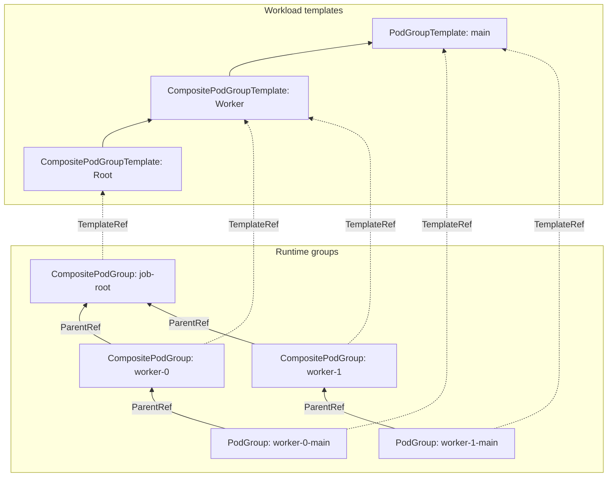

# KEP-6012: CompositePodGroup API

<!--
A table of contents is helpful for quickly jumping to sections of a KEP and for
highlighting any additional information provided beyond the standard KEP
template.

Ensure the TOC is wrapped with
  <code>&lt;!-- toc --&rt;&lt;!-- /toc --&rt;</code>
tags, and then generate with `hack/update-toc.sh`.
-->

<!-- toc -->
- [Release Signoff Checklist](#release-signoff-checklist)
- [Summary](#summary)
- [Motivation](#motivation)
  - [Goals](#goals)
  - [Non-Goals](#non-goals)
- [Proposal](#proposal)
  - [Backward compatibility](#backward-compatibility)
  - [User Stories](#user-stories)
    - [Scheduling an AI training workload](#scheduling-an-ai-training-workload)
    - [Scheduling a disaggregated inference workload](#scheduling-a-disaggregated-inference-workload)
    - [Preempting an AI inference workload](#preempting-an-ai-inference-workload)
  - [Notes/Constraints/Caveats (Optional)](#notesconstraintscaveats-optional)
  - [Risks and Mitigations](#risks-and-mitigations)
- [Design Details](#design-details)
  - [API overview](#api-overview)
  - [Changes to the <code>Workload</code> API](#changes-to-the-workload-api)
  - [Changes to the <code>PodGroup</code> API](#changes-to-the-podgroup-api)
  - [<code>CompositePodGroup</code> API](#compositepodgroup-api)
    - [Spec](#spec)
      - [Template reference](#template-reference)
      - [Scheduling policy](#scheduling-policy)
      - [Scheduling constraints](#scheduling-constraints)
      - [Disruption mode, priority class name and priority](#disruption-mode-priority-class-name-and-priority)
    - [Status](#status)
  - [API consumption model](#api-consumption-model)
    - [Object ownership and garbage collection](#object-ownership-and-garbage-collection)
  - [Changes in <code>kube-scheduler</code>](#changes-in-kube-scheduler)
    - [Group gang scheduling](#group-gang-scheduling)
    - [Integration with workload-aware preemption](#integration-with-workload-aware-preemption)
    - [Multi-level topology-aware scheduling](#multi-level-topology-aware-scheduling)
  - [API validation](#api-validation)
    - [<code>Workload</code>](#workload)
    - [<code>CompositePodGroup</code>](#compositepodgroup)
  - [Test Plan](#test-plan)
      - [Prerequisite testing updates](#prerequisite-testing-updates)
      - [Unit tests](#unit-tests)
      - [Integration tests](#integration-tests)
      - [e2e tests](#e2e-tests)
  - [Graduation Criteria](#graduation-criteria)
    - [Alpha](#alpha)
    - [Beta](#beta)
    - [GA](#ga)
  - [Upgrade / Downgrade Strategy](#upgrade--downgrade-strategy)
  - [Version Skew Strategy](#version-skew-strategy)
- [Production Readiness Review Questionnaire](#production-readiness-review-questionnaire)
  - [Feature Enablement and Rollback](#feature-enablement-and-rollback)
  - [Rollout, Upgrade and Rollback Planning](#rollout-upgrade-and-rollback-planning)
  - [Monitoring Requirements](#monitoring-requirements)
  - [Dependencies](#dependencies)
  - [Scalability](#scalability)
  - [Troubleshooting](#troubleshooting)
- [Implementation History](#implementation-history)
- [Drawbacks](#drawbacks)
- [Alternatives](#alternatives)
  - [API shape](#api-shape)
    - [<code>PodGroup</code> as a recursive API type](#podgroup-as-a-recursive-api-type)
    - [New API type per hierarchy level](#new-api-type-per-hierarchy-level)
    - [<code>PodSubGroup</code> and <code>PodSet</code>](#podsubgroup-and-podset)
  - [Naming of the new API](#naming-of-the-new-api)
- [Infrastructure Needed (Optional)](#infrastructure-needed-optional)
<!-- /toc -->

## Release Signoff Checklist

<!--
**ACTION REQUIRED:** In order to merge code into a release, there must be an
issue in [kubernetes/enhancements] referencing this KEP and targeting a release
milestone **before the [Enhancement Freeze](https://git.k8s.io/sig-release/releases)
of the targeted release**.

For enhancements that make changes to code or processes/procedures in core
Kubernetes—i.e., [kubernetes/kubernetes], we require the following Release
Signoff checklist to be completed.

Check these off as they are completed for the Release Team to track. These
checklist items _must_ be updated for the enhancement to be released.
-->

Items marked with (R) are required *prior to targeting to a milestone / release*.

- [ ] (R) Enhancement issue in release milestone, which links to KEP dir in [kubernetes/enhancements] (not the initial KEP PR)
- [ ] (R) KEP approvers have approved the KEP status as `implementable`
- [ ] (R) Design details are appropriately documented
- [ ] (R) Test plan is in place, giving consideration to SIG Architecture and SIG Testing input (including test refactors)
  - [ ] e2e Tests for all Beta API Operations (endpoints)
  - [ ] (R) Ensure GA e2e tests meet requirements for [Conformance Tests](https://github.com/kubernetes/community/blob/master/contributors/devel/sig-architecture/conformance-tests.md)
  - [ ] (R) Minimum Two Week Window for GA e2e tests to prove flake free
- [ ] (R) Graduation criteria is in place
  - [ ] (R) [all GA Endpoints](https://github.com/kubernetes/community/pull/1806) must be hit by [Conformance Tests](https://github.com/kubernetes/community/blob/master/contributors/devel/sig-architecture/conformance-tests.md) within one minor version of promotion to GA
- [ ] (R) Production readiness review completed
- [ ] (R) Production readiness review approved
- [ ] "Implementation History" section is up-to-date for milestone
- [ ] User-facing documentation has been created in [kubernetes/website], for publication to [kubernetes.io]
- [ ] Supporting documentation—e.g., additional design documents, links to mailing list discussions/SIG meetings, relevant PRs/issues, release notes

<!--
**Note:** This checklist is iterative and should be reviewed and updated every time this enhancement is being considered for a milestone.
-->

[kubernetes.io]: https://kubernetes.io/
[kubernetes/enhancements]: https://git.k8s.io/enhancements
[kubernetes/kubernetes]: https://git.k8s.io/kubernetes
[kubernetes/website]: https://git.k8s.io/website

## Summary

This KEP describes the shift in the workload-aware scheduling architecture that
is necessary to support more complex, hierarchical scheduling requirements of
modern high-performance distributed workloads. We focus on the API, framework
and the basic building blocks - handling really sophisticated multi-level
scheduling requirements can come as a follow-up.

To achieve this, the KEP builds on the `Workload` and `PodGroup` APIs from
[KEP-4671] and [KEP-5832] and introduces a new core API called
`CompositePodGroup`. This API allows expressing multi-level topology
constraints, gang scheduling and preemption policies for heterogeneous groups of
Pods and facilitates extending the Kubernetes scheduler with more policies in
the future.

## Motivation

Kubernetes 1.36 has made great strides in direction of evolving the process of
scheduling from a Pod-centric approach towards a workload-centric one. Thanks to
these efforts, we are now able to provide simple forms of gang scheduling and
gang preemption policies using the `PodGroup` API introduced in [KEP-5832]. This
release also added support for single-level topology-aware scheduling using the
Node labels-based topology constraints baked into the `PodGroup` and `Workload`
APIs ([KEP-5732]).

These features already cover the use cases of some simple batch workloads that
are characterized by a flat homogeneous structure. [KEP-5547] is an example of a
successful integration of the new APIs with the Job controller for a fully
parallel static indexed Job. That said, many modern distributed workloads,
especially the AI ones, contain some inherent hierarchy that often translates
into more complex scheduling needs that core Kubernetes cannot satisfy just yet.

One of the most apparent gaps today is the lack of multi-level topology-aware
scheduling. AI workloads require significant amount of Pod-to-Pod communication,
so the network bandwidth translates into the workload execution time, hence
higher cost of running such workloads. The bandwidth between the Pods depends
on their placement inside the data center and is highly correlated to the
proximity of the machines they are running on. Today's data centers are
frequently organized in a hierarchical structure - for instance, machines are
grouped in a rack, racks are grouped in a block and so on. Machines from the
same rack are closer to each other than machines belonging to different racks.
Similarly, machines from the same block are closer to each other than machines
from different blocks. Right now, it is infeasible to express more than a single
level of topology constraints, however, which prevents the users from taking
advantage of the physical layout of a data center when their workload is being
scheduled.

In addition, current logic of gang scheduling does not distinguish between the
Pods within a single `PodGroup` object. This prevents the users from properly
scheduling heterogeneous gangs as a wider group gang because there is no
feasible way to express this intent at the moment. Supporting this kind of gang
scheduling policy is also a prerequisite for the multi-level topology-aware
scheduling. Similarly, current scheduling APIs do not provide support for the
preemption of a group gang or a preemption of a single group within a group
gang.

All of these gaps come from the fact that current scheduling APIs do not allow
expressing any kind of multi-level hierarchy that many out-of-tree Kubernetes
APIs are often characterized with. `JobSet`[^1] and `LeaderWorkerSet`[^2] are
probably the most popular instances of a higher-order API where such hierarchy
and homogeneity exists which bring about matching scheduling requirements like
the ones mentioned above. To close these gaps, we need to extend the
foundational scheduling APIs in a way that the true workload controllers can
express their multi-level scheduling requirements that kube-scheduler could
understand and act upon accordingly.

### Goals

- Define a new API that facilitates describing the hierarchy of a workload.
- Extend scheduling capabilities to support hierarchical scheduling
  requirements, including:
  - Gang scheduling and preemption policies with a group gang semantics.
  - Multi-level topology scheduling constraints.
- Ensure future extensibility of the API with new scheduling and disruption
  policies.

### Non-Goals

- Extend topology-aware scheduling with the notion of preferred constraints.
- Define the way how to express multi-level scheduling requirements in true
  workload APIs.
  - This will be addressed in a KEP spawned from a discussion in
    [API Design for WAS Controller Integration](https://docs.google.com/document/d/1VG7Zto9JYuPG4Anb01WMRryJlfV6met0jgob3T2NjZ4/edit?usp=sharing).

## Proposal

The proposal introduces a design of a new API called `CompositePodGroup` and
describes which scheduling requirements of hierarchical workloads it solves and
in what way. The design outlines the API shape, its lifecycle and validation and
the way how true workload controllers can integrate with it. We also discuss
adjustments inside the kube-scheduler that are needed to support scheduling
requirements expressed through this API.

This proposal builds and depends heavily on the enhancements that have been
recently introduced in the workload-aware scheduling space. We assume that the
reader is already acquainted with the following KEPs:

- [KEP-4671: Gang Scheduling using Workload Object](https://kep.k8s.io/4671)
- [KEP-5710: Workload-aware preemption](https://kep.k8s.io/5710)
- [KEP-5732: Topology-aware workload scheduling](https://kep.k8s.io/5732)
- [KEP-5832: Decouple PodGroup API](https://kep.k8s.io/5832)

Rather than revolutionize the core concepts that these KEPs introduced, the
proposal generalizes them and leaves the door open for further extensions.

### Backward compatibility

For flat homogeneous workloads, using the `CompositePodGroup` API is not needed.
True workload controllers can continue using the `PodGroup` and `Workload` APIs
exclusively the way they used to - this consumption pattern will continue to be
supported.

### User Stories

#### Scheduling an AI training workload

As a data scientist, I want to schedule an AI training workload divided into
heterogeneous multi-Pod shards in an all-or-nothing fashion. I want to optimize
the network throughput and latency, therefore I would like to colocate the Pods
of my workload in a way that corresponds to the hierarchy in which the data
center which is about to host my workload is organized:

- The whole workload should be scheduled to run in a single availability zone,
- Homogeneous shards should be scheduled on the same rack,
- Pods from the same shard should be scheduled on the same machine.

#### Scheduling a disaggregated inference workload

As a machine learning engineer, I want to deploy a large language model
represented as a multi-host workload that follows the disaggregated inference
pattern[^3]. I would like for this workload to be scheduled as soon as at least
M prefill groups and N decode groups are all schedulable together as one
compound gang.

#### Preempting an AI inference workload

As a machine learning engineer who deployed an AI model distributed into
multi-Pod shards, I want to make sure that at least N shards are running - if
it's not feasible, then I would like to preempt the whole serving workload
representing the model. In addition, if a Pod from a shard requires to be
preempted, then the whole shard gets preempted.

### Notes/Constraints/Caveats (Optional)

<!--
What are the caveats to the proposal?
What are some important details that didn't come across above?
Go in to as much detail as necessary here.
This might be a good place to talk about core concepts and how they relate.
-->

### Risks and Mitigations

TODO

## Design Details

### API overview

We introduce the `CompositePodGroup` API as the main building block for
representing multi-level, hierarchical workloads. As the naming suggests, this
API acts as a grouping entity for either `PodGroup` objects or, recursively, the
`CompositePodGroup` objects. In other words, hierarchical workloads can be now
expressed as a tree of groups where `CompositePodGroup` objects correspond to
non-leaf nodes and `PodGroup` objects correspond to leaf nodes. To maintain the
tree structure, groups will have an optional reference to the parent group which
will be empty for the root group.

Every `CompositePodGroup` object in the tree corresponds to the workload portion
that is contained in the subtree that has this `CompositePodGroup` object as its
root. Policies and constraints defined in the `CompositePodGroup` applies to
that workload portion.

`Workload` API, which continues to represent the static policy configuration of
a true workload, starts to contains the definition of templates for the
`CompositePodGroup` objects, similar to how it already did so for the `Podgroup`
objects. To clearly reflect the hierarchical nature of a workload, template
contains the definition of the children group templates.

For illustration, here is a diagram depicting a sample three-level group
hierarchy consisting of `CompositePodGroup` and `PodGroup` objects with the
references to the templates within the matching `Workload` object:



### Changes to the `Workload` API

`Workload` spec gets extended with a new field that contains template definitions
for the top-level `CompositePodGroup` objects. That field is a union member field and
the `PodGroupTemplates` becomes a part of that union:

```go
// WorkloadSpec defines the desired state of a Workload.
type WorkloadSpec struct {
	// ... existing fields ...

	// CompositePodGroupTemplates is the list of CompositePodGroup templates that make up the Workload.
	// The maximum number of templates is 8. This field is immutable.
	// This field is used only when the CompositePodGroup feature gate is enabled.
	//
	// +featureGate=CompositePodGroup
	// +optional
	// +listType=map
	// +listMapKey=name
	CompositePodGroupTemplates []CompositePodGroupTemplate // <-- NEW FIELD
}
```

Similarly to `PodGroupTemplate`, the `CompositePodGroupTemplate` data structure
contains all the information necessary to stamp out a corresponding
`CompositePodGroup` object. In addition, `CompositePodGroupTemplate` contains
template definitions for the children groups - which are either
`CompositePodGroup` or `PodGroup` objects:

```go
// CompositePodGroupTemplate represents a template for a CompositePodGroup with a scheduling policy.
type CompositePodGroupTemplate struct {
	// Name is a unique identifier for the CompositePodGroupTemplate within the Workload.
	// It must be a DNS label. This field is immutable.
	//
	// +required
	Name string

	// ...
	// ... scheduling policy, disruption and constraints-related fields ...
	// ...

	// CompositePodGroupTemplates is the list of CompositePodGroup templates that make up the Workload.
	// The maximum number of templates is 8. This field is immutable.
	//
	// +optional
	// +listType=map
	// +listMapKey=name
	CompositePodGroupTemplates []CompositePodGroupTemplate

	// PodGroupTemplates is the list of PodGroup templates that make up the Workload.
	// The maximum number of templates is 8. This field is immutable.
	//
	// +optional
	// +listType=map
	// +listMapKey=name
	PodGroupTemplates []PodGroupTemplate
}
```

A couple of fields were omitted from the template definition for brevity and
clarity - we will discuss them in detail during deep dive into the
`CompositePodGroup` API because they have exactly the same structure and
semantics as the corresponding fields in `CompositePodGroupTemplate` and their
values are supposed to be copied from the template on `CompositePodGroup`
creation.

### Changes to the `PodGroup` API

The only change to the `PodGroup` API is the addition of a new optional field
that denotes the parent `CompositePodGroup` object.

```go
// PodGroupSpec defines the desired state of a PodGroup.
type PodGroupSpec struct {
	// ... existing fields ...

	// ParentRef references the parent composite pod group of this pod group.
	// If it's nil, then this pod group is a root of a workload's hierarchy.
	// This field is used only when the CompositePodGroup feature gate is enabled.
	// This field is immutable.
	//
	// +featureGate=CompositePodGroup
	// +optional
	ParentRef *ParentReference // <-- NEW FIELD
}
```

`ParentReference` contains the name of the parent `CompositePodGroup` within the
same namespace. Same data structure is used in the `CompositePodGroup` spec to
denote the parent group.

```go
// ParentReference references the parent object of a PodGroup or a
// CompositePodGroup in the same namespace. In every case, the parent object is
// a CompositePodGroup.
type ParentReference struct {
	// CompositePodGroupName specifies the name of the parent CompositePodGroup.
	//
	// +required
	CompositePodGroupName string
}
```

### `CompositePodGroup` API

TODO

```go
// +genclient
// +k8s:deepcopy-gen:interfaces=k8s.io/apimachinery/pkg/runtime.Object
// +k8s:supportsSubresource="/status"

// CompositePodGroup represents a runtime instance of pod groups grouped together.
// CompositePodGroups are created by workload controllers (LWS, JobSet, etc...) from
// Workload.compositePodGroupTemplates.
// CompositePodGroup API enablement is toggled by the CompositePodGroup feature gate.
type CompositePodGroup struct {
	metav1.TypeMeta

	// Standard object's metadata.
	// More info: https://git.k8s.io/community/contributors/devel/sig-architecture/api-conventions.md#metadata
	//
	// +optional
	metav1.ObjectMeta

	// Spec defines the desired state of the CompositePodGroup.
	//
	// +required
	Spec CompositePodGroupSpec

	// Status represents the current observed state of the CompositePodGroup.
	//
	// +optional
	Status CompositePodGroupStatus
}
```

#### Spec

TODO

```go
type CompositePodGroupSpec struct {
	// ParentRef references the parent composite pod group of this composite pod group.
	// If it's nil, then this composite pod group is a root of a workload's hierarchy.
	// This field is immutable.
	//
	// +optional
	ParentRef *ParentReference

	// CompositePodGroupTemplateRef references a CompositePodGroup template within other object
	// (e.g. Workload) that was used to create the CompositePodGroup.
	// This field is immutable.
	//
	// +required
	CompositePodGroupTemplateRef *CompositePodGroupTemplateReference

	// SchedulingPolicy defines the scheduling policy for this instance of the CompositePodGroup.
	// Controllers are expected to fill this field by copying it from a CompositePodGroupTemplate.
	// This field is immutable.
	//
	// +required
	SchedulingPolicy CompositePodGroupSchedulingPolicy

	// SchedulingConstraints defines optional scheduling constraints (e.g. topology) for this
	// CompositePodGroup.
	// Controllers are expected to fill this field by copying it from a CompositePodGroupTemplate.
	// This field is immutable.
	// This field is only available when the TopologyAwareWorkloadScheduling feature gate is enabled.
	//
	// +featureGate=TopologyAwareWorkloadScheduling
	// +optional
	SchedulingConstraints *PodGroupSchedulingConstraints

	// DisruptionMode defines the mode in which a given CompositePodGroup can be disrupted.
	// Controllers are expected to fill this field by copying it from a CompositePodGroupTemplate.
	// One of Pod, PodGroup. Defaults to Pod if unset.
	// This field is immutable.
	// This field is available only when the WorkloadAwarePreemption feature gate
	// is enabled.
	//
	// +featureGate=WorkloadAwarePreemption
	// +optional
	// +default="Pod"
	DisruptionMode *CompositeDisruptionMode

	// PriorityClassName defines the priority that should be considered when scheduling this CompositePodGroup.
	// Controllers are expected to fill this field by copying it from a PodGroupTemplate.
	// Otherwise, it is validated and resolved similarly to the PriorityClassName on PodGroupTemplate
	// (i.e. if no priority class is specified, admission control can set this to the global default
	// priority class if it exists. Otherwise, the pod group's priority will be zero).
	// This field is immutable.
	// This field is available only when the WorkloadAwarePreemption feature gate
	// is enabled.
	//
	// +featureGate=WorkloadAwarePreemption
	// +optional
	PriorityClassName string

	// Priority is the value of priority of this pod group. Various system components
	// use this field to find the priority of the pod group. When Priority Admission
	// Controller is enabled, it prevents users from setting this field. The admission
	// controller populates this field from PriorityClassName.
	// The higher the value, the higher the priority.
	// This field is immutable.
	// This field is available only when the WorkloadAwarePreemption feature gate
	// is enabled.
	//
	// +featureGate=WorkloadAwarePreemption
	// +optional
	Priority *int32
}
```

##### Template reference

TODO - change the template reference to recursive structure, per wojtek-t's suggestion.

```go
// CompositePodGroupTemplateReference references a CompositePodGroup template defined in some object (e.g. Workload).
// Exactly one reference must be set.
// +union
type CompositePodGroupTemplateReference struct {
	// Workload references the CompositePodGroupTemplate within the Workload object that was used to create
	// the CompositePodGroup.
	//
	// +optional
	Workload *WorkloadCompositePodGroupTemplateReference
}

// WorkloadCompositePodGroupTemplateReference references the CompositePodGroupTemplate within the Workload object.
type WorkloadCompositePodGroupTemplateReference struct {
	// WorkloadName defines the name of the Workload object.
	//
	// +required
	WorkloadName string

	// CompositePodGroupTemplateName defines the CompositePodGroupTemplate name within the Workload object.
	//
	// +required
	CompositePodGroupTemplateName string
}
```

##### Scheduling policy

TODO

```go
// CompositePodGroupSchedulingPolicy defines the scheduling configuration for a CompositePodGroup.
// Exactly one policy must be set.
// +union
type CompositePodGroupSchedulingPolicy struct {
	// Basic specifies that the groups of this composite group should be scheduled independently.
	//
	// +optional
	Basic *BasicGroupSchedulingPolicy

	// Gang specifies that the groups of this composite group should be scheduled using
	// all-or-nothing semantics.
	//
	// +optional
	Gang *GangGroupSchedulingPolicy
}

// BasicGroupSchedulingPolicy indicates that the groups belonging to the composite group
// should be scheduled independently.
type BasicGroupSchedulingPolicy struct {
}

// GangGroupSchedulingPolicy indicates that the groups belonging to the composite group
// should be scheduled using all-or-nothing semantics.
type GangGroupSchedulingPolicy struct {
	// MinGroupCount is the minimum number of groups of the composite group that must
	// be available to start scheduling the composite group.
	//
	// +optional
	MinGroupCount *int32
}
```

##### Scheduling constraints

TODO

##### Disruption mode, priority class name and priority

TODO

```go
// CompositeDisruptionMode describes the mode in which a CompositePodGroup can
// be disrupted (e.g. preempted).
// +enum
type CompositeDisruptionMode string

const (
  // CompositeDisruptionModeBasic means that children groups of the CompositePodGroup
  // can be disrupted or preempted independently.
  CompositeDisruptionModeBasic = "Basic"
  // CompositeDisruptionModeGroup means that the whole CompositePodGroup should
  // be disrupted or preempted together.
  CompositeDisruptionModeGroup = "Group"
)
```

#### Status

TODO

```go
// CompositePodGroupStatus represents information about the status of a composite pod group.
type CompositePodGroupStatus struct {
	// Conditions represent the latest observations of the CompositePodGroup's state.
	//
	// +optional
	// +patchMergeKey=type
	// +patchStrategy=merge
	// +listType=map
	// +listMapKey=type
	Conditions []metav1.Condition
}
```

### API consumption model

The `CompositePodGroup` API is intended to be used in a similar way to how the
`PodGroup` API is supposed to be used according to [KEP-5832].

The following sequence of events describes the lifecycle and responsibilities of
various actors in the cluster:

1. User creates a true workload (e.g. JobSet),
2. Controller (e.g. JobSet controller) creates the Workload object,
3. Controller creates all groups in the scheduling hierarchy, from root
   (`CompositePodGroup`) to leaves (`PodGroups`),
4. Workload's Pods are getting created (by e.g. the Job controller),
5. kube-scheduler tends to scheduling the Pods,
6. User deletes the true workload,
7. Pods are deleted by the GC controller in kube-controller-manager,
8. Groups in the scheduling hierarchy are deleted by the GC controller, from
   leaves to the root.

#### Object ownership and garbage collection

`Workload` and `PodGroup` objects continue to be owned by true workloads. Same
approach is applied to the `CompositePodGroup` objects.

To ensure "bottom-up" garbage collection of the scheduling groups hierarchy, we
extend the finalizer-based idea introduced in [KEP-5832] to additionally take
the `CompositePodGroup` objects into account. Specifically, the
`PodGroupProtection` admission plugin adds relevant finalizer to newly created
`CompositePodGroup` objects and the PodGroup protection controller removes that
finalizer from a particular `CompositePodGroup` when it has a non-empty deletion
timestamp and there is no group that refers to it as a parent.

### Changes in `kube-scheduler`

#### Group gang scheduling

TODO - describe the changes required to handle group gang semantics:

- Scheduling queue changes
- `GangScheduling` plugin changes:
  - `PreEnqueue`
  - `Permit`
  - Queuing hints

#### Integration with workload-aware preemption

TODO - describe changes required to handle preemption of CompositePodGroups:

- `DefaultPreemption` plugin changes:
  - Adjusted victim computation
  - Adjusted victim scoring

#### Multi-level topology-aware scheduling

TODO - describe the greedy recursive algorithm.

### API validation

This section contains complicated conditions that kube-apiserver needs to check
when the new API is being used. Simple and obvious checks that can be easily
covered by the declarative validation already are left out on purpose here for
brevity's sake.

#### `Workload`

`Workload` object now contains a hierarchy of templates that could have a large
depth. While some workloads have convoluted hierarchy, we do not want to allow
infinitely large tree structures. This could be verified using declarative
validation but it depends on the current feasibility of this framework in that
particular matter, however. Alternatively, we would fall back to the handwritten
validation and follow up with a feature request.

We start with supporting the depth of group template hierarchy of up to 3
levels. This should suffice for all use cases known today - if that changes,
however, we could revisit this limit and bump it up further in a future release.

In addition, we also need to verify that every template inside the whole
template hierarchy defined within a single `Workload` object has a unique name.
Otherwise, there would be ambiguity whenever we wanted to see the contents of a
template referred by a `CompositePodGroup`.

TODO - mention preventing non-gang descendants for gang CompositePodGroups. This
covers both scheduling policy as well as disruption mode.

#### `CompositePodGroup`

`PodGroupWorkloadExists` admission plugin gets extended to perform analogous
check for the `CompositePodGroup` API, i.e. on the object creation, the plugin
verifies that the referred `Workload` object exists and that it contains the
referred `CompositePodGroup` template.

TODO - discuss the validation of parents.

### Test Plan

[X] I/we understand the owners of the involved components may require updates to
existing tests to make this code solid enough prior to committing the changes necessary
to implement this enhancement.

##### Prerequisite testing updates

N/A

##### Unit tests

TODO

##### Integration tests

TODO

##### e2e tests

TODO

### Graduation Criteria

#### Alpha

- New `CompositePodGroup` API is introduced behind the `CompositePodGroup` feature gate.
- New fields in `Workload` and `PodGroup` APIs are introduced behind the `CompositePodGroup` feature gate.
- Group gang scheduling is supported.
- Group gang disruption mode is supported.
- Multi-level topology-aware scheduling is supported.
- Initial e2e tests are implemented and enabled.

#### Beta

- `CompositePodGroup` object is protected against deletion if any group refers to it.
- At least one workload controller (e.g. JobSet) is integrated with the `CompositePodGroup` API.
- [TBD] `minGroupCount` disruption policy is supported.
- All e2e tests for the `CompositePodGroup` API are added and graduated to conformance tests.

#### GA

- TBD in for Beta release

### Upgrade / Downgrade Strategy

TODO

### Version Skew Strategy

TODO

## Production Readiness Review Questionnaire

### Feature Enablement and Rollback

<!--
This section must be completed when targeting alpha to a release.
-->

###### How can this feature be enabled / disabled in a live cluster?

- [X] Feature gate (also fill in values in `kep.yaml`)
  - Feature gate name: CompositePodGroup
  - Components depending on the feature gate:
    - kube-apiserver
    - kube-controller-manager
    - kube-scheduler

###### Does enabling the feature change any default behavior?

No. Any scheduling behavior changes that this KEP introduces require creating
a `CompositePodGroup` object in the first place or using non-default values in
the new fields in the `Workload` or `PodGroup` APIs and no core Kubernetes
component will do that.

###### Can the feature be disabled once it has been enabled (i.e. can we roll back the enablement)?

Yes - behavior changes in the workload scheduling algorithm can be disabled by
simply disabling the feature gate in kube-scheduler.

The new API changes can also be disabled by disabling the feature gate in
kube-apiserver. That doesn't result in clearing out the new fields in PodGroups
or Workloads that already have them set in the storage, however. Similarly,
CompositePodGroup objects would be preserved in storage as well.

###### What happens if we reenable the feature if it was previously rolled back?

The feature starts working again.

###### Are there any tests for feature enablement/disablement?

The scheduler algorithm changes are purely in-memory and don't require any dedicated
enablement/disablement tests - the logic will be covered by regular feature tests.

For the newly introduced API fields, dedicated enablement/disablement tests at the
kube-apiserver registry layer will be added in Alpha.

### Rollout, Upgrade and Rollback Planning

<!--
This section must be completed when targeting beta to a release.
-->

###### How can a rollout or rollback fail? Can it impact already running workloads?

<!--
Try to be as paranoid as possible - e.g., what if some components will restart
mid-rollout?

Be sure to consider highly-available clusters, where, for example,
feature flags will be enabled on some API servers and not others during the
rollout. Similarly, consider large clusters and how enablement/disablement
will rollout across nodes.
-->

###### What specific metrics should inform a rollback?

<!--
What signals should users be paying attention to when the feature is young
that might indicate a serious problem?
-->

###### Were upgrade and rollback tested? Was the upgrade->downgrade->upgrade path tested?

<!--
Describe manual testing that was done and the outcomes.
Longer term, we may want to require automated upgrade/rollback tests, but we
are missing a bunch of machinery and tooling and can't do that now.
-->

###### Is the rollout accompanied by any deprecations and/or removals of features, APIs, fields of API types, flags, etc.?

<!--
Even if applying deprecation policies, they may still surprise some users.
-->

### Monitoring Requirements

<!--
This section must be completed when targeting beta to a release.

For GA, this section is required: approvers should be able to confirm the
previous answers based on experience in the field.
-->

###### How can an operator determine if the feature is in use by workloads?

<!--
Ideally, this should be a metric. Operations against the Kubernetes API (e.g.,
checking if there are objects with field X set) may be a last resort. Avoid
logs or events for this purpose.
-->

###### How can someone using this feature know that it is working for their instance?

<!--
For instance, if this is a pod-related feature, it should be possible to determine if the feature is functioning properly
for each individual pod.
Pick one more of these and delete the rest.
Please describe all items visible to end users below with sufficient detail so that they can verify correct enablement
and operation of this feature.
Recall that end users cannot usually observe component logs or access metrics.
-->

- [ ] Events
  - Event Reason: 
- [ ] API .status
  - Condition name: 
  - Other field: 
- [ ] Other (treat as last resort)
  - Details:

###### What are the reasonable SLOs (Service Level Objectives) for the enhancement?

<!--
This is your opportunity to define what "normal" quality of service looks like
for a feature.

It's impossible to provide comprehensive guidance, but at the very
high level (needs more precise definitions) those may be things like:
  - per-day percentage of API calls finishing with 5XX errors <= 1%
  - 99% percentile over day of absolute value from (job creation time minus expected
    job creation time) for cron job <= 10%
  - 99.9% of /health requests per day finish with 200 code

These goals will help you determine what you need to measure (SLIs) in the next
question.
-->

###### What are the SLIs (Service Level Indicators) an operator can use to determine the health of the service?

<!--
Pick one more of these and delete the rest.
-->

- [ ] Metrics
  - Metric name:
  - [Optional] Aggregation method:
  - Components exposing the metric:
- [ ] Other (treat as last resort)
  - Details:

###### Are there any missing metrics that would be useful to have to improve observability of this feature?

<!--
Describe the metrics themselves and the reasons why they weren't added (e.g., cost,
implementation difficulties, etc.).
-->

### Dependencies

<!--
This section must be completed when targeting beta to a release.
-->

###### Does this feature depend on any specific services running in the cluster?

<!--
Think about both cluster-level services (e.g. metrics-server) as well
as node-level agents (e.g. specific version of CRI). Focus on external or
optional services that are needed. For example, if this feature depends on
a cloud provider API, or upon an external software-defined storage or network
control plane.

For each of these, fill in the following—thinking about running existing user workloads
and creating new ones, as well as about cluster-level services (e.g. DNS):
  - [Dependency name]
    - Usage description:
      - Impact of its outage on the feature:
      - Impact of its degraded performance or high-error rates on the feature:
-->

### Scalability

<!--
For alpha, this section is encouraged: reviewers should consider these questions
and attempt to answer them.

For beta, this section is required: reviewers must answer these questions.

For GA, this section is required: approvers should be able to confirm the
previous answers based on experience in the field.
-->

###### Will enabling / using this feature result in any new API calls?

Yes.

Watching for CompositePodGroups:
  - API call type: LIST+WATCH CompositePodGroups
  - estimated throughput: < XX/s
  - originating component: kube-scheduler, kube-controller-manager (GC controller)

Status updates (potentially not in Alpha):
  - API call type: PUT/PATCH CompositePodGroups status
  - estimated throughput < XX/s
  - originating component: kube-scheduler

###### Will enabling / using this feature result in introducing new API types?

Yes:
  - API type: `CompositePodGroup`
  - Supported number of objects per cluster: XX,000
  - Supported number of objects per namespace: XX,000

The above numbers will eventually depend on the numbers for out-of-tree workload APIs
that will integrate with the new API (e.g. JobSets, LeaderWorkerSets, ...).

###### Will enabling / using this feature result in any new calls to the cloud provider?

No.

###### Will enabling / using this feature result in increasing size or count of the existing API objects?

Yes - new fields are added to the `Workload` and `PodGroup` APIs.

TODO

###### Will enabling / using this feature result in increasing time taken by any operations covered by existing SLIs/SLOs?

TODO

###### Will enabling / using this feature result in non-negligible increase of resource usage (CPU, RAM, disk, IO, ...) in any components?

For large clusters and fine-grained topology constraints we may observe some
increase in CPU and RAM usage for kube-scheduler. The exact scale of this
increase will be explored in the scalability tests.

###### Can enabling / using this feature result in resource exhaustion of some node resources (PIDs, sockets, inodes, etc.)?

No.

### Troubleshooting

<!--
This section must be completed when targeting beta to a release.

For GA, this section is required: approvers should be able to confirm the
previous answers based on experience in the field.

The Troubleshooting section currently serves the `Playbook` role. We may consider
splitting it into a dedicated `Playbook` document (potentially with some monitoring
details). For now, we leave it here.
-->

###### How does this feature react if the API server and/or etcd is unavailable?

###### What are other known failure modes?

<!--
For each of them, fill in the following information by copying the below template:
  - [Failure mode brief description]
    - Detection: How can it be detected via metrics? Stated another way:
      how can an operator troubleshoot without logging into a master or worker node?
    - Mitigations: What can be done to stop the bleeding, especially for already
      running user workloads?
    - Diagnostics: What are the useful log messages and their required logging
      levels that could help debug the issue?
      Not required until feature graduated to beta.
    - Testing: Are there any tests for failure mode? If not, describe why.
-->

###### What steps should be taken if SLOs are not being met to determine the problem?

## Implementation History

<!--
Major milestones in the lifecycle of a KEP should be tracked in this section.
Major milestones might include:
- the `Summary` and `Motivation` sections being merged, signaling SIG acceptance
- the `Proposal` section being merged, signaling agreement on a proposed design
- the date implementation started
- the first Kubernetes release where an initial version of the KEP was available
- the version of Kubernetes where the KEP graduated to general availability
- when the KEP was retired or superseded
-->

- 2026-04: Initial KEP-6012 proposal.

## Drawbacks

<!--
Why should this KEP _not_ be implemented?
-->

## Alternatives

### API shape

Numerous discussions took place within the community about the API and how it
should evolve in the future to support hierarchical workloads. Some of them were
driven in documents linked below[^4][^5][^6]. WAS Design Summit[^7], which took
place right before the KubeCon Europe 2026, has helped reach the consensus
regarding the design - this proposal is essentially a realization of the design
that was agreed on during the summit.

For completeness, we distill the main ideas considered previously in those
discussions below and provide rationale why they were eventually abandoned.

#### `PodGroup` as a recursive API type

Instead of introducing another API, one possible alternative way to model
hierarchical workloads would be to evolve the `PodGroup` API into a recursive
type itself.

The drawback of this approach is that `Pod`-oriented policies would stop making
sense in non-leaf `PodGroup` objects whereas group-oriented policies wouldn't
make sense in the leaf `PodGroup` objects. At the same time, we should not
attempt to convolute the leaf and the non-leaf policies with similar semantics
into a one with generic semantics - after all, their underlying nature is very
different.

Because of that, the validity of one field (policy) would depend on the state of
another field (parent reference). This would force us to move away from cheap
structural validation into semantic validation that is expensive and handled by
complex handwritten code.

#### New API type per hierarchy level

This idea is essentially the opposite of the one described above. Main advantage
of this is having a strongly typed API with validation per hierarchy level.

This approach was eventually abandoned due to the high complexity and cost of
implementation that is required to add support for a new scheduling hierarchy
level.

In principle, our proposal is a tradeoff between this approach and the one
mentioned above.

#### `PodSubGroup` and `PodSet`

The initial idea discussed in the community[^4][^6] was to make the `PodGroup` a
root of the scheduling group hierarchy and create additional APIs called
`PodSubGroup` and `PodSet`. `PodGroup` would be a grouping entity for either
Pods or `PodSubGroup` objects, `PodSubGroup` would be a grouping entity for
either Pods or `PodSet` objects and the `PodSet` would be a group of homogeneous
Pods.

Unfortunately, this approach has drawbacks that are common with both of the
ideas described above.

### Naming of the new API

Aside from the `CompositePodGroup` name, there were a couple of different naming
ideas in the past for the API this KEP introduces:

- `PodGroupSet`
- `NestedPodGroup`
- `PodGroupCollection`
- `PodGroupAggregate`

The "set" word might suggest that it contains objects of the same type, similar
to how `StatefulSet`, `DaemonSet` and `ReplicaSet` own the homogeneous replicas.
`PodGroupSet` could be a grouping entity not just for the `PodGroup` objects but
also for further `PodGroupSet` objects, so it violates this unwritten rule.

`NestedPodGroup` would make more sense if the bottom level entity in the group
hierarchy was called so. That said, even if we did such renaming, it would not
make sense for the flat workloads using one level hierarchy because there would
be no nesting at all there.

`PodGroupCollection` doesn't grasp the hierarchy in its name anyhow which is the
essence of workloads this proposal aims to extend the support for.

`PodGroupAggregate` was the runner-up among the naming candidates. In the end,
`CompositePodGroup` was selected instead because we are essentially following
the composite design pattern here - and that name expresses this more explicitly
than `PodGroupAggregate`.


## Infrastructure Needed (Optional)

<!--
Use this section if you need things from the project/SIG. Examples include a
new subproject, repos requested, or GitHub details. Listing these here allows a
SIG to get the process for these resources started right away.
-->

[^1]: `JobSet` API documentation: https://jobset.sigs.k8s.io/docs/overview/.

[^2]: `LeaderWorkerSet` API documentation: https://lws.sigs.k8s.io/docs/overview/.

[^3]: Details about the disaggregated inference pattern: https://www.nvidia.com/en-us/glossary/disaggregated-serving/.

[^4]: [PodGroup as top-level object](https://docs.google.com/document/d/1zVdNyMGuSi861Uw16LAKXzKkBgZaICOWdPRQB9YAwTk/edit?tab=t.0).

[^5]: [Proposed Workload API v2](https://docs.google.com/document/d/14XqPIdFhpgBW8hL8zTQ9KrqJAq_Hy1rOawITWqQ8T9c/edit?tab=t.0).

[^6]: See the "Part 2: Future Evolution & Compatibility Study" tab for the relevant discussion in [PodGroup as top-level object](https://docs.google.com/document/d/1B3kLWh_U1a2g-VQ6ExokMjmb7pA8lGkF9MafSSg3JmQ/edit?tab=t.0).

[^7]: [Kubecon Scheduling Summit 03’2026](https://docs.google.com/document/d/1HDj4od6qml71T4lq1ELjfNwKO0xNkqIeHo112z3AEGk/edit?tab=t.0).

[KEP-4671]: https://kep.k8s.io/4671

[KEP-5547]: https://kep.k8s.io/5547

[KEP-5732]: https://kep.k8s.io/5732

[KEP-5832]: https://kep.k8s.io/5832
