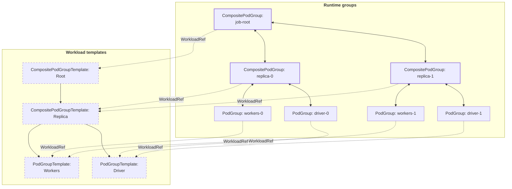

# KEP-6012: CompositePodGroup API

<!--
A table of contents is helpful for quickly jumping to sections of a KEP and for
highlighting any additional information provided beyond the standard KEP
template.

Ensure the TOC is wrapped with
  <code>&lt;!-- toc --&rt;&lt;!-- /toc --&rt;</code>
tags, and then generate with `hack/update-toc.sh`.
-->

<!-- toc -->
- [Release Signoff Checklist](#release-signoff-checklist)
- [Summary](#summary)
- [Motivation](#motivation)
  - [Goals](#goals)
  - [Non-Goals](#non-goals)
- [Proposal](#proposal)
  - [Backward compatibility](#backward-compatibility)
  - [User Stories](#user-stories)
    - [AI training on TPUs](#ai-training-on-tpus)
    - [Disaggregated serving under LeaderWorkerSet](#disaggregated-serving-under-leaderworkerset)
    - [Replicated training jobs under JobSet](#replicated-training-jobs-under-jobset)
  - [Notes/Constraints/Caveats (Optional)](#notesconstraintscaveats-optional)
  - [Risks and Mitigations](#risks-and-mitigations)
    - [Suboptimal Placement Decisions due to NP-Hardness of Multi-level Scheduling](#suboptimal-placement-decisions-due-to-np-hardness-of-multi-level-scheduling)
    - [Consistency and Validity Across Decoupled Hierarchy Objects](#consistency-and-validity-across-decoupled-hierarchy-objects)
    - [API Coverage and Extensibility Gaps](#api-coverage-and-extensibility-gaps)
- [Design Details](#design-details)
  - [API overview](#api-overview)
  - [Changes to the <code>Workload</code> API](#changes-to-the-workload-api)
  - [Changes to the <code>PodGroup</code> API](#changes-to-the-podgroup-api)
    - [<code>WorkloadReference</code>](#workloadreference)
    - [Standalone <code>PodGroup</code> objects](#standalone-podgroup-objects)
  - [<code>CompositePodGroup</code> API](#compositepodgroup-api)
    - [Spec](#spec)
      - [Workload reference](#workload-reference)
      - [Scheduling policy](#scheduling-policy)
      - [Scheduling constraints](#scheduling-constraints)
      - [Disruption mode, priority class name and priority](#disruption-mode-priority-class-name-and-priority)
    - [Status](#status)
  - [API consumption model](#api-consumption-model)
    - [Object ownership and garbage collection](#object-ownership-and-garbage-collection)
  - [API validation](#api-validation)
    - [<code>Workload</code>](#workload)
    - [Group hierarchy](#group-hierarchy)
      - [Runtime validation](#runtime-validation)
  - [Changes in kube-scheduler](#changes-in-kube-scheduler)
    - [Multi-level gang scheduling](#multi-level-gang-scheduling)
      - [Prerequisites](#prerequisites)
      - [GangScheduling Plugin Changes](#gangscheduling-plugin-changes)
      - [Recursive Scheduling Cycle Execution](#recursive-scheduling-cycle-execution)
      - [Scheduling sequence for PodGroups](#scheduling-sequence-for-podgroups)
      - [Suboptimal scheduling decisions](#suboptimal-scheduling-decisions)
    - [Integration with workload-aware preemption](#integration-with-workload-aware-preemption)
    - [Multi-level topology-aware scheduling](#multi-level-topology-aware-scheduling)
      - [CompositePodGroup Scheduling Algorithm](#compositepodgroup-scheduling-algorithm)
      - [Preemption in topology-aware scheduling](#preemption-in-topology-aware-scheduling)
  - [Test Plan](#test-plan)
      - [Prerequisite testing updates](#prerequisite-testing-updates)
      - [Unit tests](#unit-tests)
      - [Integration tests](#integration-tests)
      - [e2e tests](#e2e-tests)
  - [Graduation Criteria](#graduation-criteria)
    - [Alpha](#alpha)
    - [Beta](#beta)
    - [GA](#ga)
  - [Upgrade / Downgrade Strategy](#upgrade--downgrade-strategy)
  - [Version Skew Strategy](#version-skew-strategy)
- [Production Readiness Review Questionnaire](#production-readiness-review-questionnaire)
  - [Feature Enablement and Rollback](#feature-enablement-and-rollback)
  - [Rollout, Upgrade and Rollback Planning](#rollout-upgrade-and-rollback-planning)
  - [Monitoring Requirements](#monitoring-requirements)
  - [Dependencies](#dependencies)
  - [Scalability](#scalability)
  - [Troubleshooting](#troubleshooting)
- [Implementation History](#implementation-history)
- [Drawbacks](#drawbacks)
- [Alternatives](#alternatives)
  - [API shape](#api-shape)
    - [<code>PodGroup</code> as a recursive API type](#podgroup-as-a-recursive-api-type)
    - [New API type per hierarchy level](#new-api-type-per-hierarchy-level)
    - [<code>PodSubGroup</code> and <code>PodSet</code>](#podsubgroup-and-podset)
  - [Naming of the new API](#naming-of-the-new-api)
  - [Validation of <code>CompositePodGroup</code>](#validation-of-compositepodgroup)
  - [Mitigations for resource stealing](#mitigations-for-resource-stealing)
    - [Double-pass evaluation within a single scheduling cycle](#double-pass-evaluation-within-a-single-scheduling-cycle)
    - [Decoupled passes across distinct scheduling cycles](#decoupled-passes-across-distinct-scheduling-cycles)
  - [Backtracking in the scheduling algorithm](#backtracking-in-the-scheduling-algorithm)
- [Infrastructure Needed (Optional)](#infrastructure-needed-optional)
<!-- /toc -->

## Release Signoff Checklist

<!--
**ACTION REQUIRED:** In order to merge code into a release, there must be an
issue in [kubernetes/enhancements] referencing this KEP and targeting a release
milestone **before the [Enhancement Freeze](https://git.k8s.io/sig-release/releases)
of the targeted release**.

For enhancements that make changes to code or processes/procedures in core
Kubernetes—i.e., [kubernetes/kubernetes], we require the following Release
Signoff checklist to be completed.

Check these off as they are completed for the Release Team to track. These
checklist items _must_ be updated for the enhancement to be released.
-->

Items marked with (R) are required *prior to targeting to a milestone / release*.

- [X] (R) Enhancement issue in release milestone, which links to KEP dir in [kubernetes/enhancements] (not the initial KEP PR)
- [X] (R) KEP approvers have approved the KEP status as `implementable`
- [X] (R) Design details are appropriately documented
- [X] (R) Test plan is in place, giving consideration to SIG Architecture and SIG Testing input (including test refactors)
  - [ ] e2e Tests for all Beta API Operations (endpoints)
  - [ ] (R) Ensure GA e2e tests meet requirements for [Conformance Tests](https://github.com/kubernetes/community/blob/master/contributors/devel/sig-architecture/conformance-tests.md)
  - [ ] (R) Minimum Two Week Window for GA e2e tests to prove flake free
- [X] (R) Graduation criteria is in place
  - [ ] (R) [all GA Endpoints](https://github.com/kubernetes/community/pull/1806) must be hit by [Conformance Tests](https://github.com/kubernetes/community/blob/master/contributors/devel/sig-architecture/conformance-tests.md) within one minor version of promotion to GA
- [X] (R) Production readiness review completed
- [X] (R) Production readiness review approved
- [X] "Implementation History" section is up-to-date for milestone
- [X] User-facing documentation has been created in [kubernetes/website], for publication to [kubernetes.io]
- [X] Supporting documentation—e.g., additional design documents, links to mailing list discussions/SIG meetings, relevant PRs/issues, release notes

<!--
**Note:** This checklist is iterative and should be reviewed and updated every time this enhancement is being considered for a milestone.
-->

[kubernetes.io]: https://kubernetes.io/
[kubernetes/enhancements]: https://git.k8s.io/enhancements
[kubernetes/kubernetes]: https://git.k8s.io/kubernetes
[kubernetes/website]: https://git.k8s.io/website

## Summary

This KEP describes the evolution in the workload-aware scheduling architecture
that is necessary to support more complex, hierarchical scheduling requirements
of modern high-performance distributed workloads. We focus on the API, framework
and the basic building blocks - performance optimizations of the underlying
algorithms can come as follow-ups.

To achieve this, the KEP builds on the `Workload` and `PodGroup` APIs from
[KEP-4671] and introduces a new core API called `CompositePodGroup`. This API
allows expressing multi-level topology constraints, gang scheduling and
preemption policies for heterogeneous groups of Pods and facilitates extending
the Kubernetes scheduler with more policies in the future.

## Motivation

Kubernetes 1.36 has made great strides in direction of evolving the process of
scheduling from a Pod-centric approach towards a workload-centric one. Thanks to
these efforts, we are now able to provide simple forms of gang scheduling and
gang preemption policies using the `PodGroup` API introduced in [KEP-4671]. This
release also added support for single-level topology-aware scheduling using the
Node labels-based topology constraints baked into the `PodGroup` and `Workload`
APIs ([KEP-5732]). These features already cover the use cases of simple batch
workloads that are characterized by a flat structure. [KEP-5547] is an example
of a successful integration of the new APIs with the Job controller for a fully
parallel static indexed Job.

Many modern distributed workloads (especially AI ones) demand scheduling
capabilities that cannot be expressed using today's flat APIs. The primary gap
is the ability to model complex, heterogeneous workloads composed of distinct
groups with multi-level dependencies.

Multi-level topology-aware scheduling (TAS) is a prominent example. In
hardware architectures like TPU slices, a multi-level topology layout is
critical to reflecting hardware layouts and obtaining desired performance.
Conversely, workloads like disaggregated serving (prefill and decode) rely on
single-level network domains but require a multi-level structure to enforce
complex lifecycle dependencies (e.g. requiring at least $N$ Prefill and $M$
Decode groups).

These workloads often require multi-level gang scheduling. In this model, a
parent group dictates that it cannot be scheduled until a specified minimum
number of its child groups are schedulable. Essentially, this extends
traditional gang scheduling by treating entire child groups, rather than
individual Pods, as members of a gang.

In addition, a multi-level workload might tolerate partial disruptions. There
should be a way for such workload to express different disruption policies for
different portions of that particular workload.

All of these gaps come from the fact that current scheduling APIs do not allow
expressing any kind of multi-level hierarchy that many out-of-tree Kubernetes
APIs are often characterized with. `JobSet`[^1] and `LeaderWorkerSet`[^2] are
probably the most popular instances of a higher-order API where such hierarchy
exists which often bring about matching scheduling requirements like the ones
mentioned above. To close these gaps, we need to extend the foundational
scheduling APIs in a way that the true workload controllers can express their
multi-level scheduling requirements that kube-scheduler could understand and act
upon accordingly.

### Goals

- Define a new API that facilitates describing the hierarchy of a workload.
- Extend scheduling capabilities to support hierarchical scheduling
  requirements, including:
  - Multi-level gang scheduling.
  - Multi-level preemption policies
  - Multi-level topology scheduling constraints.
- Ensure future extensibility of the API with new scheduling and disruption
  policies.

### Non-Goals

- Extend topology-aware scheduling with the notion of preferred constraints.
- Define the way how to express multi-level scheduling requirements in true
  workload APIs.
  - This will be addressed in a [KEP-6089](https://kep.k8s.io/6089).
- Add support for associating `ResourceClaims` with instances of the new API.
  - We will continue supporting sharing `ResourceClaims` among Pods within an
    individual `PodGroup`, however.
- Guarantee an optimal result of multi-level scheduling algorithms.
  - Bin packing is inherently an NP-hard problem and it becomes even more
    complex for multi-level structures. While we aim to design efficient
    heuristics, guaranteeing an optimal placement is out of scope.
- Support differing group-level priorities across a single hierarchy tree.
- Separate queueing priority from preemption priority.
- Optimize scheduling for cases where `minCount` / `minGroupCount` is below the
  actual count of pods / child groups, respectively.
  - The proposal focuses on the most common use cases where these values equal
    the actual counts of pods and child groups, while leaving the door open for
    optimizing other cases in the future.

## Proposal

The proposal introduces a design of a new API called `CompositePodGroup` and
describes what hierarchical scheduling requirements this API solves and in what
way. The design outlines the API shape, its lifecycle and validation and the way
how true workload controllers can integrate with it. We also discuss adjustments
inside the kube-scheduler that are needed to support scheduling requirements
that can be expressed through this API.

This proposal builds and depends heavily on the enhancements that have been
recently introduced in the workload-aware scheduling space. We assume that the
reader is already acquainted with the following KEPs:

- [KEP-4671: Gang Scheduling using Workload Object](https://kep.k8s.io/4671)
- [KEP-5710: Workload-aware preemption](https://kep.k8s.io/5710)
- [KEP-5732: Topology-aware workload scheduling](https://kep.k8s.io/5732)

Rather than revolutionize the core concepts that these KEPs introduced, the
proposal generalizes them and leaves the door open for further extensions.

### Backward compatibility

The proposal adjusts the structure of the `Workload` and `PodGroup` APIs so that
they can be conveniently used in conjunction with the `CompositePodGroup` API.

That said, for flat homogeneous workloads there is no need to use the
`CompositePodGroup` API. True workload controllers can continue using the
`PodGroup` and `Workload` APIs exclusively in similar way they used to in the
past - this consumption pattern will continue to be supported.

### User Stories

#### AI training on TPUs

As an AI researcher running AI training jobs on newer generation TPUs, I want to
schedule a distributed training job such that individual shards run within
specific 4x4x4 cubes, while the entire workload is guaranteed to live within a
single superslice (e.g., 8x8x16). This allows me to leverage the specific
hierarchical network topology of TPU clusters for optimal training performance.

#### Disaggregated serving under LeaderWorkerSet

As a machine learning engineer deploying disaggregated serving (prefill and
decode stages) under `LeaderWorkerSet`, I want to express complex dependencies across
heterogeneous worker groups. Both stages require single-level high-bandwidth topology
co-location, but rely on a hierarchy to enforce holistic workload lifecycle
policies: requiring at least $N$ Prefill and $M$ Decode active groups to serve, and
ensuring that non-topological components (like frontend pods) share the preemption
fate of the core execution engines.

#### Replicated training jobs under JobSet

As an infrastructure operator running complex training pipelines, I want to schedule
a multi-stage `TrainJob` under `JobSet` containing replicated sub-jobs with varied
scheduling requirements. For instance, the pre-training data and model initialization
stage can use a basic scheduling policy (starting as soon as some data-downloaders are
ready), while the subsequent core Trainer stage (MPI Launcher and workers) requires
strict gang scheduling. Both stages belong to the same parent CPG to coordinate
coordinated start and collective preemption fate-sharing.

### Notes/Constraints/Caveats (Optional)

To ensure cluster stability, control-plane reliability, and to prevent excessive scheduling
complexity under nested hierarchies, we introduce explicit structural limits on the workload
group-template hierarchy:
* **Maximum Nesting Depth:** The group-template hierarchy supports a maximum depth of **4 levels**.
* **List Cappings:** The new `CompositePodGroupTemplates` list is strictly capped at **8 items**
  (aligning with the pre-existing cap on the `PodGroupTemplates` list).

These constraints are introduced upfront starting from the **Alpha** phase for strategic API safety.
While analyzing current and planned distributed use cases suggests that a depth of 4 levels and a
branching factor of 8 are more than sufficient, these limits can be easily increased in future
releases if new requirements emerge. 

Conversely, shrinking a limit or introducing one retroactively is a breaking API change that can
severely disrupt existing workloads. By establishing conservative limits from the very beginning,
we safeguard the API and scheduler performance while preserving the flexibility to safely scale up
limits in future iterations based on real-world profiling.

### Risks and Mitigations

#### Suboptimal Placement Decisions due to NP-Hardness of Multi-level Scheduling

While the greedy scheduling heuristic of `kube-scheduler` already introduces suboptimal
placements for single-level gangs and topology constraints, these inefficiencies can be
significantly amplified when scheduling the much larger, hierarchical workload trees enabled
by the `CompositePodGroup` API.

*Mitigation:* This is a fundamental limitation of solving an NP-complete problem within a
heuristic-based scheduling loop. In Beta and future releases, we will utilize real-world
user feedback to incrementally refine and locally optimize scheduling heuristics for
specifically reported use cases.

#### Consistency and Validity Across Decoupled Hierarchy Objects

Because the scheduling hierarchy is represented using separate, decoupled runtime objects
(`CompositePodGroup` and `PodGroup`), there is a risk of declaring conflicting, malformed,
or cyclic configurations (such as cyclic parent references, excessive nesting depth, or
diverging priorities) that cannot be reliably prevented by API admission.

*Mitigation:* The static template definition within `Workload` will enforce unique names and
a depth limit of 4 levels at admission time. In the runtime group hierarchy,
`kube-scheduler` will detect invalid states (such as cycles, excessive depth, or priority
divergence) during the scheduling cycle, immediately mark the affected groups as invalid via
status Conditions, and skip scheduling their constituent Pods to maintain cluster stability
and raise operator visibility.

#### API Coverage and Extensibility Gaps

The newly introduced `CompositePodGroup` API might fail to cover the scheduling needs of
complex, fast-evolving AI and distributed workload classes (such as disaggregated serving,
complex leader-worker arrangements, or novel hardware topologies).

*Mitigation:* We are mitigating this by performing extensive upfront research on key
state-of-the-art use cases, specifically including `JobSet` (for bulk training) and
`LeaderWorkerSet` (for serving/inference). The `CompositePodGroup` API is designed using the
composite pattern, ensuring that it is open for future extensions with new scheduling and
disruption policies without requiring API schema redesigns.


## Design Details

### API overview

We introduce the `CompositePodGroup` API as the main building block for
representing multi-level, hierarchical workloads. As the naming suggests, this
API acts as a composition of one-or-more `PodGroup` and `CompositePodGroup`
objects. In other words, hierarchical workloads can be now expressed as a tree
of groups where `CompositePodGroup` objects correspond to non-leaf nodes and
`PodGroup` objects correspond to leaf nodes. To maintain the tree structure,
groups will have an optional reference to the parent group which will be empty
for the root group. It is worth noting that in this model, only a
`CompositePodGroup` can be a parent to other groups.

Every `CompositePodGroup` object defines scheduling policies and constraints
that apply to the workload portion enclosed in the subtree that has this
`CompositePodGroup` object as its root. We will discuss precise meaning of those
policies and constraints in the following subsections.

`Workload` API, which continues to represent the static policy configuration of
a true workload, starts to contain the definition of templates for the
`CompositePodGroup` objects, similar to how it already did so for the `PodGroup`
objects. To clearly reflect the hierarchical nature of a workload, templates
themselves are evolved into a tree-like structure.

For illustration, here is a diagram depicting a sample three-level group
hierarchy consisting of `CompositePodGroup` and `PodGroup` objects with the
references to the templates within the matching `Workload` object:


```mermaid
flowchart TD
    subgraph Instances ["<b>Runtime groups</b>"]
        RootCPG["CompositePodGroup:<br/>job-root"]

        subgraph Branch1 [" "]
            ChildCPG1["CompositePodGroup: replica-0"]
            PG1["PodGroup: workers-0"]
            PG2["PodGroup: driver-0"]
            ChildCPG1 <--> PG1
            ChildCPG1 <--> PG2
        end

        subgraph Branch2 [" "]
            ChildCPG2["CompositePodGroup: replica-1"]
            PG3["PodGroup: workers-1"]
            PG4["PodGroup: driver-1"]
            ChildCPG2 <--> PG3
            ChildCPG2 <--> PG4
        end

        RootCPG <--> ChildCPG1
        RootCPG <--> ChildCPG2
    end

    subgraph Templates ["<b>Workload templates</b>"]
        RootCPGT["CompositePodGroupTemplate: Root"]
        ChildCPGT["CompositePodGroupTemplate: Replica"]
        PGT1["PodGroupTemplate:</br>Workers"]
        PGT2["PodGroupTemplate:</br>Driver"]

        RootCPGT --> ChildCPGT
        ChildCPGT --> PGT1
        ChildCPGT --> PGT2
    end

    RootCPG -. "WorkloadRef" .-> RootCPGT

    ChildCPG1 -. "WorkloadRef" .-> ChildCPGT
    ChildCPG2 -. "WorkloadRef" .-> ChildCPGT

    PG1 -. "WorkloadRef" .-> PGT1
    PG2 -. "WorkloadRef" .-> PGT2
    PG3 -. "WorkloadRef" .-> PGT1
    PG4 -. "WorkloadRef" .-> PGT2

    classDef composite stroke-width:2px;
    classDef podgroup stroke-width:1px;
    classDef template stroke-width:1px,stroke-dasharray: 5 5;
    
    classDef hiddenBranch fill:none,stroke:none;

    class RootCPG,ChildCPG1,ChildCPG2 composite;
    class PG1,PG2,PG3,PG4 podgroup;
    class RootCPGT,ChildCPGT,PGT1,PGT2 template;
    class Branch1,Branch2 hiddenBranch;
```

### Changes to the `Workload` API

`Workload` spec gets extended with a field called `CompositePodGroupTemplates`.
This field contains definitions of templates for the top-level
`CompositePodGroup` objects. In addition, this field is a union member field
together with the `PodGroupTemplates` field. This will allow the `Workload` API
to be continued to be used to represent the scheduling requirements using just
the `PodGroupTemplates` field.

```go
// WorkloadSpec defines the desired state of a Workload.
type WorkloadSpec struct {
	// ... existing fields ...

	// CompositePodGroupTemplates is the list of CompositePodGroup templates that make up the Workload.
	// The maximum number of templates is 8. This field is immutable.
	// Exactly one of CompositePodGroupTemplates and PodGroupTemplates must be set.
	//
	// This field is used only when the CompositePodGroup feature gate is enabled.
	//
	// +featureGate=CompositePodGroup
	// +optional
	// +listType=map
	// +listMapKey=name
	// +k8s:ifDisabled("CompositePodGroup")=+k8s:forbidden
	// +k8s:ifEnabled("CompositePodGroup")=+k8s:optional
	// +k8s:ifEnabled("CompositePodGroup")=+k8s:unionMember
	// +k8s:ifEnabled("CompositePodGroup")=+k8s:listType=map
	// +k8s:ifEnabled("CompositePodGroup")=+k8s:listMapKey=name
	// +k8s:ifEnabled("CompositePodGroup")=+k8s:maxItems=8
	// +k8s:ifEnabled("CompositePodGroup")=+k8s:immutable
	CompositePodGroupTemplates []CompositePodGroupTemplate
}
```

Similarly to `PodGroupTemplate`, the `CompositePodGroupTemplate` data structure
contains all the information necessary to construct a corresponding
`CompositePodGroup` object. In addition, `CompositePodGroupTemplate` contains
template definitions for the children groups - which can be either
`CompositePodGroup` or `PodGroup` objects:

```go
// CompositePodGroupTemplate represents a template for a CompositePodGroup with a scheduling policy.
type CompositePodGroupTemplate struct {
	// Name is a unique identifier for the CompositePodGroupTemplate within the Workload.
	// It must be a DNS label. This field is required.
	// This field is immutable.
	//
	// +required
	// +k8s:required
	// +k8s:format=k8s-short-name
	Name string

	// ...
	// ... scheduling policy, disruption and constraints-related fields ...
	// ...

	// CompositePodGroupTemplates is the list of templates for children CompositePodGroups.
	// The maximum number of templates is 8. This field is immutable.
	//
	// +optional
	// +listType=map
	// +listMapKey=name
	// +k8s:optional
	// +k8s:listType=map
	// +k8s:listMapKey=name
	// +k8s:maxItems=8
	// +k8s:immutable
	CompositePodGroupTemplates []CompositePodGroupTemplate

	// PodGroupTemplates is the list of templates for children PodGroups.
	// The maximum number of templates is 8. This field is immutable.
	//
	// +optional
	// +listType=map
	// +listMapKey=name
	// +k8s:optional
	// +k8s:listType=map
	// +k8s:listMapKey=name
	// +k8s:maxItems=8
	// +k8s:immutable
	PodGroupTemplates []PodGroupTemplate
}
```

Policy- and constraints-related fields were omitted from the template definition
for brevity and clarity - we will discuss them in detail in the deep dive
section about the `CompositePodGroup` below. These fields have matching
structure and semantics as the fields in `CompositePodGroupTemplate` and their
values are supposed to be copied from the template on the `CompositePodGroup`
creation.

### Changes to the `PodGroup` API

There are two changes to the `PodGroup` spec:

- `PodGroupTemplateRef` field gets replaced with an optional `WorkloadRef` that
  contains a reference to the `Workload` together with a name of a template
  within that `Workload` object.
- New field called `ParentCompositePodGroupName` is added which denotes a name
  of an optional parent `CompositePodGroup` object.

```go
// PodGroupSpec defines the desired state of a PodGroup.
type PodGroupSpec struct {
	// ... existing fields ...

	// WorkloadRef references an optional PodGroup template within the Workload
	// object that was used to create the PodGroup.
	// This field is immutable.
	//
	// +optional
	// +k8s:optional
	// +k8s:immutable
	WorkloadRef *WorkloadReference `json:"workloadRef"`

	// ParentCompositePodGroupName contains the name of the parent composite pod group
	// within the same namespace as this pod group.
	// If it's nil, then this pod group is a root of a workload's hierarchy.
	// This field is used only when the CompositePodGroup feature gate is enabled.
	// This field is immutable.
	//
	// +featureGate=CompositePodGroup
	// +optional
	// +k8s:ifDisabled(CompositePodGroup)=+k8s:forbidden
	// +k8s:ifEnabled(CompositePodGroup)=+k8s:optional
	// +k8s:ifEnabled(CompositePodGroup)=+k8s:immutable
	// +k8s:ifEnabled(CompositePodGroup)=+k8s:format=k8s-long-name
	// +k8s:ifEnabled(CompositePodGroup)=+k8s:dependentRequired("workloadRef")
  
	ParentCompositePodGroupName *string `json:"parentCompositePodGroupName"`
}
```

#### `WorkloadReference`

`WorkloadReference` contains information about the referred `Workload` and the
reference to the template definition embedded in that `Workload` object that was
used to create that particular `PodGroup`.

```go
// WorkloadReference references the Workload object together with the template
// that was used to create a particular PodGroup or CompositePodGroup.
type WorkloadReference struct {
	// WorkloadName is the name of the Workload object that contains a template
	// that was used when creating a pod group or a composite pod group. It must
	// be a DNS name.
	// This field is immutable.
	// This field is required.
	//
	// +required
	// +k8s:required
	// +k8s:immutable
	// +k8s:format=k8s-long-name
	WorkloadName string

	// TemplateName is the name of a template within the Workload object that
	// was used to create a pod group or a composite pod group. It must be a DNS label.
	// This field is immutable.
	// This field is required.
	//
	// +required
	// +k8s:required
	// +k8s:immutable
	// +k8s:format=k8s-short-name
	TemplateName string
}
```

#### Standalone `PodGroup` objects

In [KEP-4671], we introduced a notion of standalone `PodGroups` which are
`PodGroup` objects that can be created without a matching `Workload` object and
their workload reference is hence nil.

This proposal wants to preserve this possibility but limit the use of it to the
flat workloads exclusively. In other words, `PodGroup` objects with a non-nil
parent reference must have a workload reference.

### `CompositePodGroup` API

This is the main API change in this proposal. `CompositePodGroup` is a new API
resource, hence we need to generate a client for it. In addition, this API
supports the status subresource that will be updated with the runtime status
information.

```go
// +genclient
// +k8s:deepcopy-gen:interfaces=k8s.io/apimachinery/pkg/runtime.Object
// +k8s:supportsSubresource="/status"

// CompositePodGroup represents a runtime instance of pod groups grouped together.
// CompositePodGroups are created by workload controllers (LWS, JobSet, etc...) from
// Workload.compositePodGroupTemplates.
// CompositePodGroup API enablement is toggled by the CompositePodGroup feature gate.
type CompositePodGroup struct {
	metav1.TypeMeta

	// Standard object's metadata.
	// More info: https://git.k8s.io/community/contributors/devel/sig-architecture/api-conventions.md#metadata
	//
	// +optional
	metav1.ObjectMeta

	// Spec defines the desired state of the CompositePodGroup.
	//
	// +required
	Spec CompositePodGroupSpec

	// Status represents the current observed state of the CompositePodGroup.
	//
	// +optional
	Status CompositePodGroupStatus
}
```

#### Spec

`CompositePodGroup` API spec will have a very similar structure to the spec of
the `PodGroup` API.

```go
type CompositePodGroupSpec struct {
	// ParentCompositePodGroupName contains the name of the parent composite pod group
	// within the same namespace as this composite pod group. It must be a DNS name.
	// If it's nil, then this composite pod group is a root of a workload's hierarchy.
	// This field is used only when the CompositePodGroup feature gate is enabled.
	// This field is immutable.
	//
	// +optional
	// +k8s:optional
	// +k8s:immutable
	// +k8s:format=k8s-long-name
	ParentCompositePodGroupName *string

	// WorkloadRef references an optional CompositePodGroup template within the
	// Workload object that was used to create the CompositePodGroup.
	// This field is required.
	// This field is immutable.
	//
	// +required
	// +k8s:required
	// +k8s:immutable
	WorkloadRef *WorkloadReference

	// SchedulingPolicy defines the scheduling policy for this instance of the CompositePodGroup.
	// Controllers are expected to fill this field by copying it from a CompositePodGroupTemplate.
	// This field is immutable.
	//
	// +required
	// +k8s:required
	// +k8s:immutable
	SchedulingPolicy CompositePodGroupSchedulingPolicy

	// SchedulingConstraints defines optional scheduling constraints (e.g. topology) for this
	// CompositePodGroup.
	// Controllers are expected to fill this field by copying it from a CompositePodGroupTemplate.
	// This field is immutable.
	// This field is only available when the TopologyAwareWorkloadScheduling feature gate is enabled.
	//
	// +featureGate=TopologyAwareWorkloadScheduling
	// +optional
	// +k8s:ifDisabled(TopologyAwareWorkloadScheduling)=+k8s:forbidden
	// +k8s:ifEnabled(TopologyAwareWorkloadScheduling)=+k8s:optional
	// +k8s:ifEnabled(TopologyAwareWorkloadScheduling)=+k8s:immutable
	SchedulingConstraints *CompositePodGroupSchedulingConstraints

	// DisruptionMode defines the mode in which a given CompositePodGroup can be disrupted.
	// Controllers are expected to fill this field by copying it from a CompositePodGroupTemplate.
	// One of Single, All. Defaults to Single if unset. This field is immutable.
	//
	// +optional
	// +k8s:optional
	// +k8s:immutable
	// +default={"single": {}}
	DisruptionMode *CompositeDisruptionMode

	// PriorityClassName defines the priority that should be considered when scheduling this CompositePodGroup.
	// Controllers are expected to fill this field by copying it from a CompositePodGroupTemplate.
	// If left unspecified, it is validated and resolved similarly to the PriorityClassName field in Pods
	// (i.e. if no priority class is specified, admission control can set this to the global default
	// priority class if it exists. Otherwise, the composite pod group's priority will be zero).
	// This field is immutable.
	//
	// +optional
	// +k8s:optional
	// +k8s:format=k8s-long-name
	// +k8s:immutable
	PriorityClassName string

	// Priority is the value of priority of this composite pod group. Various system components
	// use this field to find the priority of the composite pod group. When Priority Admission
	// Controller is enabled, it prevents users from setting this field. The admission
	// controller populates this field from PriorityClassName.
	// The higher the value, the higher the priority.
	// This field is immutable.
	//
	// +optional
	// +k8s:optional
	// +k8s:immutable
	// +k8s:maximum=1000000000 # HighestUserDefinablePriority
	Priority *int32
}
```

##### Workload reference

The `WorkloadRef` has semantics that matches the meaning of a corresponding
field in the `PodGroup` API - with an exception that it is supposed to refer to
a `CompositePodGroupTemplate` entry within the `Workload` object, not to a
`PodGroupTemplate` entry.

Another difference is that the `WorkloadRef` is required here. Contrary to the
`PodGroup` API, we do not support the notion of standalone groups in the
`CompositePodGroup` API.

##### Scheduling policy

Analogous to the scheduling policy defined at the `PodGroup` level for Pods, the
`CompositePodGroupSchedulingPolicy` specifies the policy for scheduling child groups
belonging to a `CompositePodGroup`. Specifically, this determines whether the nested child
groups are admitted and scheduled independently (`Basic`) or treated as an all-or-nothing
scheduling unit (`Gang`).


```go
// CompositePodGroupSchedulingPolicy defines the scheduling configuration for a CompositePodGroup.
// Exactly one policy must be set.
// +union
type CompositePodGroupSchedulingPolicy struct {
	// Basic specifies that the groups of this composite group should be scheduled independently.
	//
	// +optional
	// +k8s:optional
	// +k8s:unionMember
	Basic *BasicGroupSchedulingPolicy

	// Gang specifies that the groups of this composite group should be scheduled using
	// all-or-nothing semantics.
	//
	// +optional
	// +k8s:optional
	// +k8s:unionMember
	Gang *GangGroupSchedulingPolicy
}

// BasicGroupSchedulingPolicy indicates that the groups belonging to the composite group
// should be scheduled independently.
type BasicGroupSchedulingPolicy struct {
	// This is intentionally empty. Its presence indicates that the basic
	// scheduling policy should be applied. In the future, new fields may appear,
	// describing such constraints on a composite pod group level without
	// "all or nothing" (gang) scheduling.
}

// GangGroupSchedulingPolicy indicates that the groups belonging to the composite group
// should be scheduled using all-or-nothing semantics.
type GangGroupSchedulingPolicy struct {
	// MinGroupCount is the minimum number of child groups that must be schedulable
	// or scheduled at the same time for the scheduler to admit the entire group.
	// It must be a positive integer.
	//
	// +optional
	// +k8s:required
	// +k8s:minimum=1
	MinGroupCount int32
}
```

##### Scheduling constraints

Analogously to `PodGroup`, we can specify topology constraints that need to be
taken into account when scheduling a `CompositePodGroup`.

```go
// CompositePodGroupSchedulingConstraints defines scheduling constraints (e.g. topology)
// for a CompositePodGroup.
type CompositePodGroupSchedulingConstraints struct {
	// Topology defines the topology constraints for the composite pod group.
	// Currently only a single topology constraint can be specified. This may change in the future.
	//
	// +optional
	// +listType=atomic
	// +k8s:optional
	// +k8s:maxItems=1
	// +k8s:listType=atomic
	Topology []TopologyConstraint
}
```

Despite having a separate structure storing the constraints for the
`CompositePodGroup` API, we will reuse the `TopologyConstraint` struct that is
already used in the `PodGroupSchedulingConstraints` type.

When scheduler attempts to schedule a hierarchy of groups that specifies
topological constraints on multiple levels, these constraints will be resolved
in a top-down manner. This means that such constraints should be ordered from
least constrictive ones to to the ones defining the smallest topology domains.

##### Disruption mode, priority class name and priority

The idea of disruption mode generalizes naturally to the `CompositePodGroup`
API:

```go
// DisruptionMode defines how individual entities within a composite pod group can be disrupted.
// Exactly one mode must be set.
// +union
type CompositeDisruptionMode struct {
	// Single specifies that children can be disrupted independently from each other.
	//
	// +optional
	// +k8s:optional
	// +k8s:unionMember
	Single *SingleCompositeDisruptionMode

	// All specifies that all children can only be disrupted together.
	//
	// +optional
	// +k8s:optional
	// +k8s:unionMember
	All *AllCompositeDisruptionMode
}

// SingleCompositeDisruptionMode means that individual children of a CompositePodGroup
// can be disrupted or preempted independently.
type SingleCompositeDisruptionMode struct {
	// This is intentionally empty.
}

// AllCompositeDisruptionMode means that children of a CompositePodGroup can only be
// disrupted or preempted together.
type AllCompositeDisruptionMode struct {
	// This is intentionally empty.
}
```

The nesting of scheduling groups with potentially differing `DisruptionModes` at separate
levels of the hierarchy introduces support for complex disruption semantics. 

However, not all hierarchical disruption configurations represent semantically clear runtime
states. For example, if a parent `CompositePodGroup` is configured with the `All` disruption
mode (requiring the entire subtree to be preempted or disrupted as a single atomic unit) but
contains child groups configured with the `Single` disruption mode (allowing their
individual elements to be preempted independently), the expected behavior is highly
ambiguous. 

To ensure deterministic preemption and eviction behavior, the API will enforce the following
structural restrictions on the Workload level API for the Alpha release:

*   A `CompositePodGroupTemplate` configured with the `All` disruption mode can only have
children groups (nested `CompositePodGroupTemplates` or leaf `PodGroupTemplates`) that are also
configured with the
`All` disruption mode.
*   A `CompositePodGroupTemplate` configured with the `Single` disruption mode can have children
groups configured with either the `Single` or `All` disruption modes.

Runtime structure validation and more complex configurations will be considered for Beta and
future releases once concrete production use-cases and community feedback are established.

The `Priority` and the `PriorityClassName` fields are resolved in the exact same
way as they already are for Pods and `PodGroups` - specifically, the `Priority`
admission controller gets extended to additionally support the
`CompositePodGroup` API.

We enforce a strict single-priority constraint: all member groups and pods
within a single group hierarchy tree **must share the exact same priority**.
Support for differing group-level priorities under basic scheduling policies it
will be explored independently of KEP-6012 in a dedicated KEP when we prioritize
the relevant usecases.

The value of the `Priority` field is being used in the following two contexts:

- `CompositePodGroup` objects without a parent reference are being put in the
  scheduling queue. Their priority is taken into account by the PrioritySort
  plugin when determining the importance of scheduling unit.
- When running preemption to fit a `CompositePodGroup` in the cluster, only
  preemption units (individual `Pods` or `PodGroups` or `CompositePodGroups`) with a
  lower priority than the preemptor can be selected as prospective victims.

#### Status

Analogous to `PodGroupStatus`, `CompositePodGroupStatus` represents the observed state of a `CompositePodGroup`.

```go
// CompositePodGroupStatus represents information about the status of a composite pod group.
type CompositePodGroupStatus struct {
	// Conditions represent the latest observations of the CompositePodGroup's state.
	//
	// Known condition types:
	// - "CompositePodGroupInitiallyScheduled": Indicates whether the overall scheduling requirement
	//   for the subtree under this CompositePodGroup has been satisfied. Once this condition
	//   transitions to True, it serves as a terminal state and will never revert to False,
	//   even if pods are subsequently deleted and group constraints are no longer met.
	// - "DisruptionTarget": Indicates whether the CompositePodGroup is about to be terminated
	//   due to disruption such as preemption.
	//
	// Known reasons for the CompositePodGroupInitiallyScheduled condition:
	// - "Unschedulable": The CompositePodGroup's subtree could not be placed due to resource constraints,
	//   affinity/anti-affinity, or topological constraints.
	// - "SchedulerError": The CompositePodGroup cannot be scheduled due to some internal error
	//   that occurred during scheduling.
	// - "Invalid": Set to True when kube-scheduler detects an invalid group layout during
	//   runtime validation. The `message` field details the specific layout violation (such as
	//   a detected cycle, exceeding the maximum depth of 4, or referencing multiple distinct Workloads).
	//
	// Known reasons for the DisruptionTarget condition:
	// - "PreemptionByScheduler": The CompositePodGroup was targeted by the scheduler's preemption loop
	//   to free up capacity for higher-priority preemptors.
	//
	// +optional
	// +patchMergeKey=type
	// +patchStrategy=merge
	// +listType=map
	// +listMapKey=type
	Conditions []metav1.Condition
}
```

### API consumption model

The `CompositePodGroup` API is intended to be used in a similar way to how the
`PodGroup` API is supposed to be used according to [KEP-4671].

The following sequence of events describes the lifecycle and responsibilities of
various actors in the cluster in a happy path:

1. User creates a true workload (e.g. `JobSet`),
2. Controller (e.g. `JobSet` controller) creates the Workload object,
3. Controller creates all groups in the scheduling hierarchy, from root
   (`CompositePodGroup`) to leaves (`PodGroups`),
4. Workload's Pods are getting created (by e.g. the Job controller),
5. kube-scheduler tends to scheduling the Pods,
6. User deletes the true workload,
7. Pods are deleted by the GC controller in kube-controller-manager,
8. Groups in the scheduling hierarchy are deleted by the GC controller, from
   leaves to the root.

#### Object ownership and garbage collection

`Workload` and `PodGroup` objects continue to be owned by true workloads. Same
approach is applied to the `CompositePodGroup` objects.

To ensure "bottom-up" garbage collection of the scheduling groups hierarchy, we
extend the idea introduced in [KEP-4671] that leverages finalizers to
additionally take `CompositePodGroups` into account. Specifically:

- the `PodGroupProtection` admission plugin adds a dedicated finalizer to newly
  created `CompositePodGroups`,
- the `PodGroup` protection controller removes that finalizer from a
  `CompositePodGroup` when it has a deletion timestamp and no child groups exist
  for that `CompositePodGroup` anymore.

### API validation

This section contains complicated validation that need to be executed when the
new API is being used. Simple and obvious checks that can be easily covered
today by the declarative validation are left out on purpose here since they are
already embedded in the API snippets in paragraphs above.

#### `Workload`

`Workload` object now contains a hierarchy of templates that could have a large
depth. While some workloads might have convoluted hierarchy, we do not want to
allow arbitrarily large tree structures. We start with supporting the depth of
group template hierarchy of up to 4 levels. This should suffice for all use
cases that we are aware of today - if future proves otherwise, however, we could
revisit this limit and bump it up further.

Apart from that, we also need to validate uniqueness of template names within
the whole template hierarchy in a single `Workload` object - otherwise, template
references would be ambiguous.

To verify both of these conditions, we will add a new hand-written validation that
targets new `Workload` objects and performs both of these checks.

#### Group hierarchy

Because `Workload` API embeds the whole template hierarchy, we can statically
verify its depth in kube-apiserver. Unfortunately, we cannot perform analogous
checks for the group hierarchy in a way that completely eliminates race
conditions - due to the eventually consistent nature of Kubernetes, cross-object
validation can be performed only in a best-effort manner.

That said, a misbehaving controller might create a `Workload` object and a set
of group objects that form a hierarchy which is not reflected in that
`Workload`. In such case, the controller can create a group hierarchy that:

- Is deeper than allowed,
- Contains a cyclical parent reference relationship,
- References to more than a single `Workload`,
- Contains differing priorities or preemption policies,
- Contains semantically improper parent-child relationships:
  - A `gang` parent group with a `basic` child group,
  - A parent group with `All` disruption mode that has a child group with the
    `Single` disruption mode.

Each of these should be treated as a failure mode since it is essentially a
manifestation of the API misuse. Because of that we will make kube-scheduler
responsible for discovering them at runtime and preventing invalid hierarchies
from being scheduled. For rooted hierarchies that enter the scheduling cycle,
the scheduler will also update the status of all groups within the hierarchy
accordingly (deeming those groups invalid).

##### Runtime validation

In Alpha, we initially envisioned watching `Workload` objects in `kube-scheduler`
to verify that the runtime group hierarchy matches the template tree defined in
the `Workload` specification, executed via a dedicated background loop in the
scheduling queue. That loop would periodically scan stalled/incomplete structures
in the queue (such as `workloadForest` and `incompletePodGroupPods`), validate
hierarchies retained there for an extended period, and update group statuses to
report misconfigurations.

However, upon deeper evaluation for Beta, we decided against watching `Workload`
objects in the scheduler and against running a background validation loop in the
scheduling queue:

* **Unnecessary `Workload` watch overhead:** Watching `Workload` objects in
  kube-scheduler solely to compare runtime group trees against `Workload`
  templates adds cache overhead and cross-resource synchronization races without
  being necessary for safe scheduling. Enforcing self-contained structural and
  semantic invariants on the group hierarchy itself is sufficient.
* **Unclear performance implications:** A background queue scan would need to
  hold the scheduling queue lock while traversing hierarchies, potentially for a
  longer period of time, negatively impacting the scheduling throughput.
* **Increased complexity of the queue:** Making the scheduling queue execute API
  status updates would require non-trivial synchronization to prevent races with
  the scheduling cycle, as well as arbitrary tuning of scan intervals and
  retention thresholds in `incompletePodGroupPods`.
* **Validation in the scheduling cycle is necessary regardless:** Because group
  and pod objects are created and updated asynchronously, a hierarchy can be or
  become invalid at any point while residing in the scheduling queue. Even if
  the queue attempted to validate hierarchies, the scheduling cycle would still
  need to re-validate every popped hierarchy before scheduling it, rendering
  queue-level validation redundant.

Consequently, we do not enforce queued hierarchies to be valid in the scheduling
queue. An invalid hierarchy can be queued and popped normally; instead, runtime
hierarchy validation in Beta is performed exclusively at the beginning of the
scheduling cycle each time a hierarchy is popped. Concretely, we extend the
`validatePodGroup` method to verify the structural and semantic conditions
listed in the previous section. If any check fails, the scheduling cycle aborts
early and updates the statuses of all groups and pods within the hierarchy to
mark them as invalid.

Note that group hierarchies containing parent reference cycles cannot resolve a
root group. While queue insertion and `PreEnqueue` traversal must guard against
cycles to prevent infinite loops in the scheduling queue, cyclical hierarchies
will remain in `workloadForest` and `incompletePodGroupPods` without ever
entering the scheduling cycle. As a result, `validatePodGroup` will not execute
for cycles and the scheduler will not update their status conditions. Because
creating cyclical references requires a severe bug in a workload controller,
this edge case is unlikely in practice; if operational experience proves
otherwise, we can revisit adding out-of-band cycle reporting in the future.

### Changes in kube-scheduler

#### Multi-level gang scheduling

Below we describe the high-level changes in `kube-scheduler` required to
support multi-level gang scheduling.

##### Prerequisites
To enable multi-level gang scheduling, we must generalize internal data
structures, extend the core scheduling queue, and adapt plugin extension
points:

1. **Polymorphic `PodGroupInfo` Generalization:** In the internal scheduler
   implementation, the existing `PodGroupInfo` struct (which represents a
   scheduling group in queue memory and cache) is generalized to
   polymorphically represent both leaf `PodGroups` and `CompositePodGroups`.
   This unified representation significantly reduces code and interface
   duplication, allowing scheduling plugins to process all hierarchy levels
   uniformly.
2. **Scheduling Queue Support for CPGs:** The core scheduling queue is
   extended to natively support root `CompositePodGroups` (CPGs without a
   parent reference) and standalone `PodGroups` as the sole root scheduling
   units. To support this, the `QueuedEntityInfo` wrapper struct (introduced
   in [PR #138567](https://github.com/kubernetes/kubernetes/pull/138567)) is
   generalized polymorphically to wrap either a standalone Pod, a standalone
   `PodGroupInfo`, or a nested parent `CompositePodGroup` hierarchy, allowing
   the queue to sort and pop them uniformly. To preserve this root-only
   queue property in the presence of asynchronous, potentially out-of-order
   object arrivals:
   * Observed groups are stored in a dedicated `workloadForest` structure. When
     a child group is added, it proactively registers itself in a `children` map
     under its parent key even if the parent has not yet been observed, avoiding
     retroactive scans. A group with any ancestor missing cannot resolve a root
     and stays in `workloadForest` without entering the active, backoff or
     unschedulable queue.
   * Member pods whose root group cannot be resolved are held in the
     `incompletePodGroupPods` structure. These pods are bypassed during
     scheduling passes while remaining receptive to informer updates and
     deletions. Once the root group arrives and the hierarchy is complete, leaf
     pods are drained from `incompletePodGroupPods` and dispatched to join the
     queued root entity (or grafted into an already-queued root subtree).
3. **`PreEnqueue` Extension Point:** Currently, this extension point is
   defined strictly at the individual `Pod` level. Under KEP-6012, this
   prerequisite remains unchanged: `PreEnqueue` will operate strictly at the
   Pod level (where the Pod-level plugin check recursively resolves parent CPG
   tree admissibility for the member pod's hierarchy).

   *(Note: Alternatively, one could introduce a group-level PreEnqueue
   extension point. However, this would require adding support for group-level
   queuing hints in the scheduler queue backend to react only to relevant
   events. Due to high complexity of this approach, we stick to the Pod-level
   PreEnqueue given it was deemed sufficient in Alpha. At the same time, this
   design choice can be revisited in the future independently of the KEP if
   needed).*
4. **`PlacementFeasible` Extension Point:** Currently, this extension point exists
   at the `PodGroup` level (introduced in
   [PR #138643](https://github.com/kubernetes/kubernetes/pull/138643)).
   Under KEP-6012, we extend this extension point under our polymorphic `PodGroupInfo`
   representation to support the validation of hierarchical constraints at the
   `CompositePodGroup` level.

   To support this cleanly, we refactor the return statuses of `PlacementFeasible` to be
   more semantically precise and aligned with scheduling framework conventions.
   This refactoring is highly beneficial for both flat `PodGroup` and hierarchical
   `CompositePodGroup` workloads. In the existing flat gang scheduling design, the
   `PlacementFeasible` check merges preemptable and unpreemptable scheduling failures
   under a single `Unschedulable` status. As a result, the scheduler cannot distinguish
   between a soft failure (e.g., a PodGroup or CompositePodGroup can be scheduled if
   we preempt other workloads in the cluster) and a hard failure (e.g., the group is
   mathematically impossible to schedule even if we preempt all other workloads).
   This leads to unnecessary resource simulation and costly preemption sweeps that are
   mathematically guaranteed to fail.

   By introducing the refactored status space, the scheduler immediately aborts the
   evaluation of a nested `PodGroupInfo` subtree as soon as its `PlacementFeasible`
   check returns `Unschedulable` or `UnschedulableAndUnresolvable`. The parent CPG then
   receives this status, which may or may not trigger a further cascading abort up the
   hierarchy stack, potentially terminating the entire active scheduling cycle early and
   saving significant CPU cycles.
   
   Additionally, these statuses explicitly dictate preemption behavior:
   * **`Success`:** Constraints are fully satisfied (simulated scheduled count
     $\ge MinCount$ or $MinGroupCount$).
   * **`Wait`:** Currently unsatisfied, but possible to satisfy purely with free
     capacity as remaining members are simulated.
   * **`Unschedulable`:** Unsatisfied with free capacity, but resolvable via preemption.
     This indicates that the group should be actively considered during the workload
     preemption phase.
   * **`UnschedulableAndUnresolvable`:** Irreversibly unsatisfied; preemption cannot
     help. This indicates that the group should not be considered for preemption,
     allowing the scheduler to completely skip preemption evaluation.

   For the exact algorithm determining how these statuses are returned and evaluated
   during recursive scheduling, see [GangScheduling Plugin Changes](#gangscheduling-plugin-changes).

##### GangScheduling Plugin Changes

1. **`PreEnqueue`:**
   Executed at the Pod-level during the enqueue stage for each member pod of
   a popped hierarchy unit. The plugin climbs parent references up to the
   root CPG ancestor, traversing the tree to recursively verify that the
   subtree contains the required minimum quantities:
   * **For a leaf `PodGroup`:** Verifies if the group is `admissible`
     (total pending or running member pods in the cluster $\ge$ `minCount`).
   * **For a `CompositePodGroup`:** Verifies that the number of `admissible`
     child groups in its subtree $\ge$ `minGroupCount`.
   * If the admissibility check for the root CPG fails, the individual
     pod's enqueuing is rejected, and it remains inside the scheduling queue.

2. **`PlacementFeasible`:**
   Executed for each `PodGroupInfo` node in the popped hierarchy tree as a part
   of the `groupRecursiveSchedulingDefaultAlgorithm` routine during in-memory
   simulation. Under this KEP, we extend `PlacementFeasible` to support both flat
   `PodGroups` and hierarchical `CompositePodGroups` using a unified status
   evaluation model.

   To define the status transition logic uniformly for both `PodGroup` and
   `CompositePodGroup`, we introduce the following variables evaluated during the
   in-memory scheduling iteration:
   * **`M`**: The required minimum count. For a flat `PodGroup`, $M = $ `minCount`.
     For a `CompositePodGroup`, $M = $ `minGroupCount`.
   * **`S`**: The count of child elements successfully scheduled in memory with the
     `Success` status.
   * **`R`**: The count of remaining, untried child elements that are potentially
     admissible.
   * **`U`**: The count of child elements that returned an `Unschedulable` status.
   * **`UU`**: The count of child elements that returned `UnschedulableAndUnresolvable`.

   > [!NOTE]
   > Historically, pod-level `UnschedulableAndUnresolvable` may have been used to denote
   > pods that cannot be scheduled even if other pods in the cluster are deleted (preempted).
   > In the context of pod groups, preemption may also cause some pods to be assigned to different
   > nodes, which may break plugin assumptions. Until that contract is explicitly defined,
   > at the leaf level, `U` will be the count of pods that returned `Unschedulable`
   > **or `UnschedulableAndUnresolvable`**, and `UU` will be 0.

   Using these variables, the `PlacementFeasible` status is resolved as follows:
   * **`Success`**: $S \ge M$. The constraints are fully satisfied.
   * **`Wait`**: $S < M$, but $S + R \ge M$. Currently unsatisfied, but satisfying the
     constraints purely with free capacity remains possible.
   * **`Unschedulable`**: $S + R < M$, but $S + R + U \ge M$. The constraints cannot
     be satisfied purely with free capacity, but triggering preemption on behalf of
     the `Unschedulable` child elements can resolve the constraints.
   * **`UnschedulableAndUnresolvable`**: $S + R + U < M$. Even with maximum preemption
     of all `Unschedulable` elements, it is mathematically impossible to satisfy the
     minimum constraints because there are not enough child elements to schedule
     or too many child elements failed with the `UnschedulableAndUnresolvable` status.


   This status logic is applied identically at all levels of the tree:
   * **For a leaf `PodGroup`:** The child elements are the individual member pods.
     The status of each pod is checked (whether it successfully placed, failed due
     to soft resource constraints, or failed due to hard selector/topology mismatches).
   * **For a `CompositePodGroup`:** The child elements are its nested child groups,
     and their status is checked recursively using the returned `PlacementFeasible`
     values.

3. **`EventsToRegister`:**
   Currently, the flat `GangScheduling` plugin's `EventsToRegister` method
   registers a subscription for `PodGroup` ADD events to promote blocked units.
   To support multi-level hierarchies, we extend this method to additionally
   subscribe to `CompositePodGroup` ADD events.

   In Beta, we are going to support elastic multi-level workloads by making the
   `minGroupCount` field mutable. In case of a group hierarchy held in the
   unschedulable queue, decreasing the value of `minGroupCount` for one of its
   groups might make the whole group admissible to the active queue. Because of
   that, the `GangScheduling` plugin will also subscribe to the
   `CompositePodGroup` UPDATE events.

##### Recursive Scheduling Cycle Execution
In `schedule_one_podgroup.go`, the scheduler processes a popped root unit (a root
`PodGroupInfo`) by running **`groupRecursiveSchedulingDefaultAlgorithm`**, which is
the recursive version of **`podGroupSchedulingDefaultAlgorithm`** routine.
Throughout this recursive simulation phase, all pod-to-node assignments
are tracked strictly **in memory** in the `nodeInfoSnapshot` as temporary state
before final binding:

1. **If the active node is a leaf `PodGroup`:** Runs the same logic as in the standard,
   flat, single-level `podGroupSchedulingDefaultAlgorithm` routine to simulate member
   pod placements in memory, but uses the refactored `PlacementFeasible` status interpretation
   logic. The scheduling loop reacts to the `Wait`, `Success`, `Unschedulable`, and
   `UnschedulableAndUnresolvable` statuses in an identical, analogical manner to
   the recursive child-group simulation described below for `CompositePodGroups`.
2. **If the active node is a `CompositePodGroup`:** It iterates through its nested
   child groups in their pre-sorted order, executing the recursive
   `groupRecursiveSchedulingDefaultAlgorithm` sequentially. After in-memory scheduling
   each child group, the scheduler invokes the extended `PlacementFeasible` checker
   under the parent CPG's `PodGroupInfo` to evaluate its overall state:
   * **`Success`:** The CPG's nested minimum constraints (`minGroupCount`) are met.
     Under the greedy **Alpha** phase, the scheduler continues simulating subsequent
     sibling groups to maximize cluster utilization.
   * **`Wait`:** The `minGroupCount` is not yet satisfied, but satisfying the constraint
     purely with free capacity remains possible. The scheduler continues processing.
   * **`Unschedulable`:** The parent CPG constraints cannot be met with free capacity,
     but are resolvable via preemption. The scheduler immediately aborts its child-group
     evaluation loop, reverts all of its in-memory changes, and returns `Unschedulable`
     up the stack.
   * **`UnschedulableAndUnresolvable`:** The parent CPG is mathematically impossible
     to satisfy. The scheduler immediately aborts its child-group evaluation loop,
     reverts all of its in-memory changes, and returns `UnschedulableAndUnresolvable`
     up the stack.
3. **Commit Bindings:** If the root-level recursion resolves and returns
   `Success`, the scheduler commits and writes the entire tree's resolved pod
   bindings from memory to the API server.

> [!NOTE]
> **No-Backtracking:** Sibling child groups under a `CompositePodGroup` are
> simulated sequentially in their pre-sorted order without backtracking. If a
> child group placement (e.g. `PG-1`) consumes resources in a way that
> subsequently blocks its sibling (e.g. `PG-2`) from meeting its `minCount`
> requirement, which in turn prevents the parent CPG from satisfying its
> `minGroupCount` threshold, the scheduler does not retroactively evaluate
> alternative placements or orderings for the earlier child group.
>
> While we considered bounded backtracking heuristics for **Beta**, we decided
> against implementing it in the scope of this KEP. Because search heuristics
> can be introduced in a backward-compatible manner, this decision can be
> revisited in future releases if production demand arises. See
> [Backtracking in the scheduling algorithm](#backtracking-in-the-scheduling-algorithm)
> for further details.

###### In-memory simulation state revert across the recursion stack

In the existing flat gang scheduling implementation,
`podGroupSchedulingDefaultAlgorithm` is fully self-contained. When a member
pod is assumed, a `revertFn` is registered and executed via `defer` upon
function exit, restoring the `nodeInfoSnapshot` to its pre-execution state.

Under a nested `CompositePodGroup` hierarchy, deferred local reverts on
function exit would prematurely clear assumed pod allocations of a
successfully simulated child group (e.g. `PG-1`) before its sibling (e.g.
`PG-2`) is evaluated. Sibling groups would fail to see the consumed capacity
in the memory snapshot, leading to resource over-commitments and deadlocks.

To resolve this, the recursive algorithm does not defer execution of the
revert closures locally. Instead, as each child group runs its in-memory
simulation, the registered `revertFn` closures are returned and accumulated
(`[]revertFn`) up the recursion stack to the root CPG. Upon exit from the
top-level `runRootSchedulingAlgorithm` execution pass, the accumulated revert
closures are always executed all-at-once, cleanly restoring the shared
`nodeInfoSnapshot` to its pre-execution state before the separate, asynchronous
binding cycle triggers. To preserve the cache's transactional integrity, these
accumulated reverts must be executed in the exact reverse order of their
registration (matching how native deferred execution operates), ensuring the
last registered revert is called first to cleanly roll back node allocations.

##### Scheduling sequence for PodGroups

To ensure a deterministic processing sequence, child groups under a
`CompositePodGroup` are sorted and cached inside the scheduling queue when the
group objects are added to queue memory. During the scheduling cycle, the
scheduler evaluates descendant child groups in this pre-sorted order.

Since Alpha, the order of evaluation of child groups is induced by their
creation timestamps which is consistent with the order in which Pods in leaf
`PodGroups` are evaluated in the scheduling algorithm.

###### Preemption triggering rules
Preemption is strictly evaluated and executed only at the root level of the
group hierarchy, preventing isolated and competing preemption passes at
intermediate levels.

Consistent with flat gang scheduling ([KEP-4671]), binding and preemption
never occur inside the same scheduling cycle. The preemption triggering
rules under this KEP are updated to align with the refactored `PlacementFeasible`
statuses:
* **If the root-level `PlacementFeasible` returns `Success`:** If the recursive
  in-memory simulation successfully satisfies the minimum scheduling requirements
  (at least `minGroupCount` child groups under a CPG tree, or `minCount` pods under
  a flat `PodGroup`), the scheduling cycle succeeds. The scheduler does not
  trigger preemption. Instead, it commits bindings for all successfully placed
  member pods (comprising the minimal gang and any extra pods that placed under
  Alpha's greedy pass). Any remaining member pods that failed scheduling are
  returned to the scheduling queue, which subsequently places the entire hierarchy
  back into the queue for re-evaluation.
* **If the root-level `PlacementFeasible` returns `Unschedulable`:** If the simulation
  fails to satisfy the minimum requirements purely with free capacity, but the
  failure is resolvable (i.e. `Unschedulable`), no pod bindings are committed.
  The scheduler triggers the workload preemption engine at the root level of
  the hierarchy to release cluster capacity for the failed member pods.
* **If the root-level `PlacementFeasible` returns `UnschedulableAndUnresolvable`:** If
  the simulation reveals that the constraints are mathematically impossible to
  satisfy (even if maximum preemption is used, e.g. due to hard node selectors or
  lack of admissible member pods), the scheduler does not commit any bindings
  and does NOT trigger preemption. The scheduling cycle aborts early, saving
  wasteful CPU processing, and the hierarchy is sent back to the queue.
* **During subsequent cycles:** In subsequent scheduling cycles, when the root CPG
  with pending extra or newly scaled member pods pops from the queue, the
  standard recursive scheduling algorithm is executed for the root CPG
  hierarchy. If at least one pending member pod is placed, the scheduler commits
  the bindings for the newly placed pods without triggering preemption, and any
  remaining unscheduled pods are returned to the queue for the next cycle. If the
  recursive algorithm fails to place even a single pending member pod, the
  scheduler triggers the preemption engine at the root CPG level to release
  capacity for the unschedulable pods.

In summary, workload preemption is triggered at the root level if and only if:
the root-level `PlacementFeasible` returns `Unschedulable` (i.e., the scheduling
policy is not satisfied but is resolvable via preemption), OR the scheduling
policy is satisfied, the hierarchy was already scheduled in a previous cycle,
and the scheduler failed to place any of the pending member pods in the current
cycle.

For Beta, we considered adjustments to the logic responsible for deciding
whether to trigger preemption during subsequent scheduling attempts if not all
pending pods are successfully placed. We brainstormed an approach that extends
the notion of "partially scheduled" groups originally proposed in the gang
scheduling [KEP-4671](https://github.com/kubernetes/enhancements/pull/6194) to
CPGs and implemented a proof-of-concept in
[PR #142314](https://github.com/kubernetes/kubernetes/pull/142314). However,
after closer inspection of the POC, we noticed various problems with this
approach:
- Properly determining whether the cycle handles an initial or subsequent
  scheduling attempt for a root CPG would require leaking the business logic of
  the `GangScheduling` plugin to policy-agnostic layers of the scheduler.
- Reasoning about when a root CPG with basic policy is partially scheduled
  becomes difficult when the group hierarchy consists of a combination of basic
  and gang groups.
- The control flow around `PlacementFeasible` and `PodGroupPostFilter` becomes
  much more complex in the scheduling cycle, additionally making these two
  interfaces more difficult for out-of-tree plugins to implement.
- It is unclear which candidate placements to prefer in TAS, as it might make
  more sense to select a lower-scoring fully scheduled placement over a
  higher-scoring partially scheduled one in order to reduce the chance of
  invoking preemption unnecessarily.

The issues above significantly raise the complexity of a prospective adjustment
to the current rules governing the preemption decision inside the scheduling
cycle for subsequent scheduling attempts. Because of this, we decided to retain
the current logic implemented in the Alpha phase, favoring its simplicity. This
decision can be revisited as a new follow-up feature if we gather more feedback
from users that the current behavior does not satisfy their needs.

###### Inadmissible child groups
A root `CompositePodGroup` might successfully pass the `PreEnqueue` queue filter,
yet contain child groups that are currently inadmissible (e.g., they do not
have enough active member pods in the cluster queue to reach their `minCount`).

For example, consider a root CPG (`minGroupCount=2`) containing three nested child
groups: `CPG-1`, `PG-2`, and `PG-3`. Both `PG-2` and `PG-3` are fully admissible and
schedulable. However, `CPG-1` has `minGroupCount=2` and contains only one active child
group in the cluster: `PG-11` (`minCount=100`) with 100 pending member pods.

Without a pre-simulation check, the scheduling algorithm would execute as follows:
1. The scheduler starts simulating the root CPG's children, starting with `CPG-1`.
2. To simulate `CPG-1`, the scheduler sequentially places all 100 member pods of its
   first child, `PG-11`, in memory.
3. After `PG-11` finishes, the scheduler invokes `PlacementFeasible` on `CPG-1`. Since
   `CPG-1` only scheduled 1 child group ($S=1$) but requires $M=2$, and has no more
   remaining children ($R=0$), `PlacementFeasible` returns `UnschedulableAndUnresolvable`.
4. The simulation of `CPG-1` aborts, and the status is returned up to the root CPG.
5. The scheduler invokes `PlacementFeasible` on the root CPG. One child failed with
   `UU=1`, but two remain untried ($R=2$). Since $S+R \ge M$ ($0+2 \ge 2$), the root
   status is `Wait`. The scheduler continues processing sibling groups.
6. The scheduler successfully simulates `PG-2` and `PG-3`. The root CPG satisfies its
   `minGroupCount` and the cycle succeeds, committing bindings for `PG-2` and `PG-3`.
   However, immense CPU cycles were completely wasted simulating the 100 pods of `PG-11`.

Under the refactored `PlacementFeasible` status model, preemption triggering is
already handled correctly in these scenarios: the status evaluation will naturally
resolve to `UnschedulableAndUnresolvable` once it determines that the minimum
threshold cannot be satisfied, preventing futile preemption loops entirely.

In addition, as a performance optimization, we can skip evaluating the simulation
of inadmissible branches entirely. In v1.37, we implemented an optimized
pre-simulation check which invokes the `PlacementFeasible` checker *before*
starting the recursive in-memory simulation of child groups. If the
pre-simulation check determines that a subtree is inadmissible (e.g., a nested
child group is missing too many member pods to ever satisfy its `minCount`), it
immediately returns `UnschedulableAndUnresolvable` early, bypassing all child
pod placements entirely and saving costly CPU cycles.

###### Resource stealing under greedy evaluation

When a `CompositePodGroup` is evaluated, child groups are processed sequentially
in their pre-sorted order. Under greedy evaluation, child groups attempt to
schedule as many member pods as possible, potentially exceeding their `minCount`
requirements.

This can lead to **resource stealing** in capacity-constrained clusters: an
early, greedy child group consumes all available slots, preventing a sibling
child group from reaching its `minCount` and causing the entire root CPG gang
to fail scheduling.

To mitigate this problem, we initially planned to introduce a non-greedy mode to
the scheduling algorithm in Beta. After exploring this direction more deeply, we
decided to retain the greedy evaluation for the time being and to defer the
prospect of adjusting the evaluation logic in the algorithm to the future
releases.

The primary rationale is that we prioritize the most common distributed workload
use cases, where `minCount` equals the total pod count and `minGroupCount`
equals the total child group count. In this common model, all pods and groups
are strictly required, so resource stealing between siblings cannot occur.
Retaining greedy evaluation allows us to deliver the core `CompositePodGroup`
API and framework as soon as possible without introducing premature complexity.

For a detailed analysis of the possible solutions, their trade-offs, and more
detailed rationale for deferral, see
[this section](#mitigations-for-resource-stealing) in the alternatives.

###### Handling new pods for scheduled hierarchies
If a controller scales up a scheduled `CompositePodGroup` hierarchy by
creating new member pods, the queue backend places the root CPG back into the
scheduling queue. When this root CPG pops from the queue, the scheduler
executes the standard recursive scheduling algorithm starting at this root
level. Sibling child groups are evaluated in greedy mode, meaning that
successfully scheduled child groups are allowed to exceed their `minCount`
limits, accommodating the new member pods.

If the recursive algorithm succeeds in placing these new pods, they are bound to nodes.
However, if the recursive algorithm fails to schedule them (due to saturated capacity):
* The root CPG scheduling policy remains satisfied (since the minimal gang was
  already successfully scheduled and remains active in the cluster).
* The individual member pods fail scheduling and trigger the preemption
  engine at the root CPG level.

##### Suboptimal scheduling decisions

As already mentioned, optimal multi-level scheduling is an NP-hard computational
problem underneath, so solving it at a large scale is infeasible.
`kube-scheduler` mitigates this through operating on a single Pod at a time
while making scheduling decisions for a whole group hierarchy. This is
essentially a heuristic that relaxes the requirement for global optimum in
exchange for drastically reduced computational complexity.

In particular, this implies that `kube-scheduler` might fail to find a placement
for a multi-level gang even when sufficient resources exist in the cluster.
This can be a side effect of suboptimal placement decisions made for individual
Pods or child groups—for example, when evaluating heterogeneous sibling child
groups in a fixed, pre-sorted sequence without exploring alternative orderings.
While this issue already exists when scheduling a heterogeneous flat `PodGroup`
gang, it can manifest more acutely in multi-level hierarchies where early child
group placements consume resources needed by later siblings.

That said, we decided not to implement any search heuristics like backtracking
in the scope of this KEP. Any backtracking mechanism would incur a non-trivial
overhead to the scheduling latency and substantially complicate the logic of the
scheduling algorithm. In addition, a potential return on investment seems
unclear at the moment.

Further rationale for this decision, together with an analysis of trade-offs, is
covered in the [alternatives section](#backtracking-in-the-scheduling-algorithm)
about backtracking.

###### Diagnostics and workload recommendations

Because `kube-scheduler` evaluates sibling child groups sequentially in a
greedy, single-pass manner without backtracking, any hierarchy containing
heterogeneous groups or pods that compete for the same nodes or shared topology
domains can experience order-dependent placement failures.

To alleviate this limitation in Beta without introducing backtracking in the
scheduling algorithm, we combine hierarchical status diagnostics in the
scheduler with user-facing workload design guidance in the Kubernetes
documentation:

1. **Hierarchical Failure Diagnostics (Status Propagation):**
   When an ancestor `CompositePodGroup` fails to satisfy its scheduling policy
   or constraints, any descendant child groups and member Pods that succeeded
   during their own isolated in-memory simulation (or were skipped due to an
   early abort) cannot proceed to binding. To prevent silent or misleading
   states where a leaf group appears schedulable or unevaluated while its pods
   remain pending, the scheduler propagates the nearest failed ancestor's status
   down the hierarchy. Specifically, relevant conditions on affected descendant
   groups and pods are updated with the `Unschedulable` reason and a message
   identifying the failed ancestor `CompositePodGroup` and the underlying
   failure cause.

2. **Workload Design Recommendations:**
   While scheduling success cannot be guaranteed when heterogeneous groups
   compete for shared capacity, users and workload controllers can optimize the
   chance of finding a successful placement by following three structural best
   practices:
   * **Keep individual `PodGroups` homogeneous:** Group pods with identical
     resource requests, node selectors, and scheduling constraints into the same
     leaf `PodGroup`. When all pods within a `PodGroup` (or all replicated child
     groups within a `CompositePodGroup`) are homogeneous, greedy placement is
     mathematically invariant to evaluation order. Distinct pod roles (e.g.,
     driver vs. workers) should be split into separate homogeneous `PodGroups`
     under a parent `CompositePodGroup`.
   * **Segregate non-competing heterogeneous groups onto disjoint node pools:**
     When heterogeneous child groups do not require the same physical node
     hardware (for example, CPU-only coordinator/driver pods vs. GPU/TPU worker
     pods), use `nodeSelector`, node affinity, or taints and tolerations to
     prevent flexible pods from landing on specialized nodes required by
     stricter sibling groups. When sibling groups target disjoint sets of
     candidate nodes, evaluation order between them cannot cause resource
     stealing or order-induced deadlocks.
   * **Scope topology constraints to the minimal required subtree:** Attach
     topological constraints (`SchedulingConstraints.Topology`) only to the
     specific `CompositePodGroup` or `PodGroup` subtrees that strictly require
     high-bandwidth physical co-location, rather than placing them on the root
     `CompositePodGroup` by default. Using a root `CompositePodGroup` without
     topology constraints provides coordinated gang scheduling and collective
     preemption fate-sharing across the entire workload without forcing
     non-topological components to compete for capacity inside constrained
     topology domains.

#### Integration with workload-aware preemption

If a root `PodGroupInfo` (representing a root CPG or standalone PG) is
unschedulable and triggers preemption (according to the conditions defined in
[Preemption triggering rules](#preemption-triggering-rules)), the scheduler
performs the standard preemption steps to calculate victims and spawn
evictions. To support multi-level workloads under this unified preemption
framework:

* **Group running pods into collective preemption victims:** When evaluating
  preemption costs, the preemption algorithm groups victim pods into collective
  victim objects. For each victim pod candidate, the scheduler traverses up its
  parent group hierarchy (following parent references under the `PodGroupInfo`
  cache) to resolve the highest ancestor configured with the `All` disruption
  mode. This highest ancestor CPG node defines the indivisible preemption unit.
* **Adapt PreEnqueue and plugin lifecycles:** The `PreEnqueue` method of the
  `DefaultPreemption` plugin and internal queue backoff structures are extended
  to track pending root `PodGroupInfo` preemptors while they wait in the queue for
  their calculated victim evictions to successfully delete and free up cluster
  capacity.

#### Multi-level topology-aware scheduling

In single-level topology-aware scheduling ([KEP-5732]), the scheduler generates a flat list
of candidate placements for a leaf `PodGroup`, runs in-memory simulations across these
placements, and scores them using `PlacementScorerPlugins` to select the optimal placement.

For multi-level scheduling using `CompositePodGroups` (which do not own pods directly but
instead act as parents for nested `CompositePodGroups` or leaf `PodGroups`), the scheduler
resolves placements **recursively** down the hierarchy tree:

##### CompositePodGroup Scheduling Algorithm

The multi-level topology-aware scheduling (TAS) algorithm
(`groupRecursiveSchedulingPlacementAlgorithm`) is a direct extension of the recursive
`groupRecursiveSchedulingDefaultAlgorithm` execution cycle defined in
[Multi-level gang scheduling](#multi-level-gang-scheduling), augmented to
determine appropriate topology placements.

The algorithm recursively evaluates and identifies feasible placements (topology
domains satisfying the CPG's topology constraints), scoring and selecting the
best resolved configuration:

1. **Placement Generation:** The scheduler generates candidate topology domains
   matching the CPG's topology constraint. If a parent CPG has already been
   assumed in a specific topology domain (e.g., `net-block-A`), candidate
   placement generation for its descendants is strictly restricted to domains
   located within that parent domain (e.g., racks within `net-block-A`).
2. **Candidate Placement Evaluation & Filtering:** For each candidate parent
   domain, the scheduler:
   * Temporarily assumes the candidate parent domain in the `nodeInfoSnapshot`
     as the active scheduling context.
   * **Recursive Child Group Resolution:** Sequentially invokes the recursive
     `groupRecursiveSchedulingPlacementAlgorithm` cycle for each child group,
     confining their placement candidates strictly to nodes within the assumed
     parent domain scope. Sibling child groups are evaluated in their
     pre-sorted order without sibling backtracking, taking into account the
     assumed pod assignments of already simulated siblings inside the
     `nodeInfoSnapshot`. These sibling assignments are automatically reverted
     when the parent domain assumption is reverted.
   * **Group Constraint Verification:** Invokes the extended `PlacementFeasible`
     checker under `PodGroupInfo`. If it returns `Success` after processing all
     children, the parent placement is marked as **feasible** and stored in the
     list of feasible placements.
   * Reverts the temporary parent domain assumption in the `nodeInfoSnapshot`.
3. **Best Placement Selection:** The scheduler runs the registered
   `PodGroupInfo` placement scorer plugins, which are extended to support
   `CompositePodGroups` alongside `PodGroups`, over the **entire list of saved
   feasible placements** and selects the one with the highest score. The method
   returns pod-to-node assignments from the best placement together with the
   `Success` status to the parent group.


At the root level, the scheduler commits and writes the entire tree's resolved pod bindings
to the API server. Analogous to multi-level gang scheduling, if direct scheduling fails for
the root CPG, the scheduler invokes the preemption algorithm strictly at the root CPG level
(if needed).

> [!NOTE]
> **Backtracking Search Space in TAS:** Compared to flat capacity evaluations under
> gang scheduling, the topology placement search space under TAS is multidimensional
> and exponentially larger, as each tree level generates and evaluates multiple
> physical topology domains.
>
> To manage the scheduling latency trade-off, the scheduling cycle avoids
> backtracking when evaluating child groups under a target parent candidate
> domain. At any single level in the tree, this reduces the search complexity
> for placing $C$ child groups, each with $D$ placement options, from
> exponential ($\mathcal{O}(D^C)$) to linear ($\mathcal{O}(C \cdot D)$).
>
> While avoiding backtracking can increase placement failures in the
> capacity-constrained clusters, we decided not to implement backtracking in
> the TAS algorithm in scope of this KEP. Adding multi-level topology rollback
> logic and evaluating domain permutations would cripple scheduler throughput
> for uncertain gains. Backtracking search heuristics can be introduced in a
> backward-compatible manner in the future if usage patterns warrant them.

###### Example
Consider a workload consisting of a root `CompositePodGroup` (`CPG-root`)
configured with a gang scheduling policy (`minGroupCount=2`), containing two
child `PodGroups` (`PG-1` and `PG-2`). Both child groups are gangs requiring a
minimum pod count (`minCount=5`) of homogeneous pods. `CPG-root` defines a
topology constraint of `block` (demanding that all groups land inside a single
net-block), while both `PG-1` and `PG-2` require a `rack` topology constraint.

The cluster physical topology is configured as follows:
* `block-A` contains `rack-A1` (has 3 free slots) and `rack-A2` (has 5 free slots).
* `block-B` contains `rack-B1` (has 5 free slots) and `rack-B2` (has 5 free slots).

The scheduling algorithm resolves this hierarchy recursively:

1. **CPG-root Evaluation:**
   * Generates block placements for `CPG-root`: `block-A` and `block-B`.
   * **Evaluate Candidate `block-A`:**
     1. Temporarily assumes `block-A` in `nodeInfoSnapshot`.
     2. **Resolve child `PG-1` under `block-A`:**
        * Restricted to `block-A`. Invokes standard flat PG scheduling cycle.
        * `PG-1` generates rack candidate placements in `block-A`: `rack-A1` and
          `rack-A2`.
        * The scheduler simulates `PG-1` under candidates in `nodeInfoSnapshot`:
          - Simulates `PG-1` under `rack-A1` $\to$ fails (only 3 slots free).
          - Simulates `PG-1` under `rack-A2` $\to$ succeeds (5 slots free).
        * PG-level scorer plugins evaluate feasible candidates: only `rack-A2`
          is feasible, and is selected.
        * The cycle returns `PG-1`'s resolved 5 pod-to-node assignments under
          `rack-A2` along with `Success` status to `CPG-root`.
        * `CPG-root` temporarily reserves `PG-1`'s returned assignments under
          `rack-A2` in memory snapshot.
     3. **Resolve child `PG-2` under `block-A`:**
        * Restricted to `block-A` (under the active memory snapshot containing
          `PG-1` in `rack-A2`).
        * `PG-2` generates rack candidates in `block-A`: `rack-A1` and `rack-A2`.
        * The scheduler simulates `PG-2` under candidates in `nodeInfoSnapshot`:
          - Simulates `PG-2` under `rack-A1` $\to$ fails (only 3 slots free).
          - Simulates `PG-2` under `rack-A2` $\to$ fails (0 slots left,
            greedily assumed by sibling `PG-1` in memory snapshot).
        * Since `PG-2` cannot find any feasible placement, its scheduling cycle
          returns a failure.
        * **No Backtracking:** Sibling child groups are simulated sequentially
          without backtracking. The scheduler does not evaluate alternative rack
          configurations for `PG-1` (e.g. attempting to schedule `PG-1` on
          `rack-A1` to see if `PG-2` could fit on `rack-A2`).
     4. **CPG Constraint Verification:** The scheduler invokes the CPG-level
        `PlacementFeasible` checker on candidate `block-A`. Since only `PG-1`
        succeeded, the total feasible child group count is 1. Because
        `minGroupCount=2`, `PlacementFeasible` returns failure and candidate
        `block-A` is marked as **infeasible**.
     5. Reverts `block-A` assumption in `nodeInfoSnapshot`.
   * **Evaluate Candidate `block-B`:**
     1. Temporarily assumes `block-B` in `nodeInfoSnapshot`.
     2. **Resolve child `PG-1` under `block-B`:**
        * Restricted to `block-B`. Invokes standard flat PG scheduling.
        * `PG-1` generates rack candidates in `block-B`: `rack-B1` and `rack-B2`.
        * The scheduler simulates `PG-1` under candidates in `nodeInfoSnapshot`:
          - Simulates `PG-1` under `rack-B1` $\to$ succeeds (5 slots free).
          - Simulates `PG-1` under `rack-B2` $\to$ succeeds (5 slots free).
        * PG-level scorer plugins scores both feasible candidates:
          - `rack-B1` scores 90.
          - `rack-B2` scores 50.
        * The cycle selects `rack-B1` (highest score), and returns `PG-1`'s
          resolved assignments under `rack-B1` along with `Success` status.
        * `CPG-root` temporarily reserves `PG-1`'s returned assignments under
          `rack-B1` in memory snapshot.
     3. **Resolve child `PG-2` under `block-B`:**
        * Restricted to `block-B` (under active memory snapshot containing
          `PG-1` in `rack-B1`).
        * `PG-2` generates rack candidates in `block-B`: `rack-B1` and `rack-B2`.
        * The scheduler simulates `PG-2` under candidates in `nodeInfoSnapshot`:
          - Simulates `PG-2` under `rack-B1` $\to$ fails (0 slots left,
            greedily assumed by sibling `PG-1`).
          - Simulates `PG-2` under `rack-B2` $\to$ succeeds (5 slots free).
        * PG-level scorer plugins evaluate feasible candidates: only `rack-B2`
          is feasible, and is selected.
        * The cycle returns `PG-2`'s resolved assignments under `rack-B2` along
          with `Success` status.
        * `CPG-root` temporarily reserves `PG-2`'s returned assignments under
          `rack-B2` in memory snapshot.
     4. **CPG Constraint Verification:** The scheduler invokes the CPG-level
        `PlacementFeasible` checker on candidate `block-B`. Both child groups
        (`PG-1` and `PG-2`) simulated successfully, so feasible child count is
        2. Since `minGroupCount=2`, `PlacementFeasible` returns success and
        candidate `block-B` is saved as a **feasible placement**.
     5. Reverts `block-B` assumption in `nodeInfoSnapshot`.
2. **Feasible Placement Scoring:** The scheduler runs `CPG-root` placement
   scorer plugins on the saved feasible placement (`block-B`). The scorer
   plugins evaluate the overall resolved assignments layout (both child groups
   placed in their respective racks under `block-B`) and return a score (e.g.,
   `95`).
3. **Final Selection:**
   * The scheduler completes CPG evaluations and selects the feasible placement
     with the highest score (`block-B`, score: 95).
   * It locks in the resolved placement path:
     `[CPG-root: block-B], [PG-1: rack-B1], [PG-2: rack-B2]`.
   * The scheduler commits the resolved layout and proceeds to bind the pods of
     `PG-1` and `PG-2` to their physical target nodes inside `block-B`.

##### Preemption in topology-aware scheduling

Workload preemption under topology constraints is the domain of [KEP-5710]
(Workload-Aware Preemption) and [KEP-5732] (Topology-Aware Workload Scheduling).

Under KEP-6012, this topology-aware preemption behavior works for `CompositePodGroups`
out-of-the-box without major changes, based on the following architectural factors:

1. **Decoupled Simulation Framework:** The preemption algorithm evaluates victim selection
   by running in-memory simulations and invoking the workload's scheduling callback. The
   algorithm is completely decoupled from the scheduling internals: it does not care whether
   the callback is placing a single flat `PodGroup` or recursively resolving a
   `CompositePodGroup` hierarchy.
2. **Acceptable Complexity Trade-offs:** Resolving a multi-level hierarchical group
   with nested topology constraints (e.g., parent and child groups requiring specific
   physical placements) is inherently more computationally complex than scheduling a flat
   `PodGroup` of the same size, as the scheduler must evaluate parent-child placement
   combinations. Because preemption relies on the recursive scheduling callback, this
   increased placement complexity could potentially impact preemption throughput at scale.
   For Alpha, we believe that no preemption-specific architectural changes are required
   as the simulation model is fully decoupled. However, if scale testing and performance
   feedback during the Alpha phase reveal bottlenecks due to recursive CPG checks
   during preemption, we will address necessary optimizations in the Beta phase.

Consequently, since topology-aware preemption is designed and implemented to work for a flat
`PodGroup` as a part of [KEP-5710], it should automatically work for a hierarchical
`CompositePodGroup` with no significant architectural modifications or new preemption algorithms.

### Test Plan

[X] I/we understand the owners of the involved components may require updates to
existing tests to make this code solid enough prior to committing the changes necessary
to implement this enhancement.

##### Prerequisite testing updates

N/A

##### Unit tests

- `k8s.io/kubernetes/pkg/apis/scheduling/validation`: `2026-05-20` - 90.6%
- `k8s.io/kubernetes/pkg/registry/scheduling/workload`: `2026-05-20` - 95.1%
- `k8s.io/kubernetes/pkg/registry/scheduling/podgroup`: `2026-05-20` - 90.9%
- `k8s.io/kubernetes/pkg/scheduler`: `2026-05-20` - 76.8%
- `k8s.io/kubernetes/pkg/scheduler/backend/queue`: `2026-05-20` - 92.1%
- `k8s.io/kubernetes/pkg/scheduler/backend/cache`: `2026-05-20` - 84.9%
- `k8s.io/kubernetes/pkg/scheduler/framework`: `2026-05-20` - 73.0%
- `k8s.io/kubernetes/pkg/scheduler/framework/preemption`: `2026-05-20` - 76.5%
- `k8s.io/kubernetes/pkg/scheduler/framework/plugins/defaultpreemption`: `2026-05-20` - 89.6%
- `k8s.io/kubernetes/pkg/scheduler/framework/plugins/topologyaware`: `2026-05-20` - 91.5%
- `k8s.io/kubernetes/pkg/scheduler/framework/plugins/queuesort`: `2026-05-20` - 60.0%
- `k8s.io/kubernetes/pkg/scheduler/framework/runtime`: `2026-05-20` - 82.8%

##### Integration tests

We will create new integration tests (and extend the existing `PodGroup` integration test
suite in `test/integration/scheduler/`) to cover the hierarchical and multi-level aspects of
the CPG API and the recursive scheduling resolutions:

- **CPG Queueing and Requeueing:**
  - Verify that CPG hierarchies with unobserved parents are not promoted to the
    active scheduling queue until the root CPG object is observed.
  - Verify that the arrival of cluster events successfully triggers queueing
    hints to move blocked CPG hierarchies from the unschedulable queue back
    to the active queue (`activeQ`) or backoff queue (`backoffQ`).
- **Multi-level Gang Scheduling:**
  - Verify that CPG hierarchies satisfying their nested child group `minCount` and
    `minGroupCount` requirements are enqueued, and those failing are rejected
    and remain in the unschedulable queue.
  - Verify that CPG parent nodes satisfy simulation checks and successfully
    schedule when the simulated child group count $\ge$ `minGroupCount`, and
    fail when they fall below this threshold.
- **Workload-Aware Preemption for Multi-level Workloads:**
  - Verify that the preemption victim selection logic correctly respects
    disruption boundaries across different hierarchical layouts (under various
    configurations of `All`, `Single`, and mixed nested combinations), ensuring
    correct cascading subtree evictions or allowing partial on-demand preemption.
  - Verify that preemption is evaluated and triggered strictly at the root CPG
    level when direct scheduling fails, and that the `PreEnqueue` method of
    `DefaultPreemption` successfully backs off and queues CPG preemptors awaiting
    evictions.
  - Verify that if the root CPG is feasible (`PlacementFeasible = Success`) but
    extra member pods require preemption (`NeedsPreemption = True`), the
    scheduler successfully commits and writes the minimal gang bindings even if
    preemption fails to clear space for the extra members.
- **Multi-level TAS:**
  - Verify that the scheduler successfully schedules a hierarchical CPG workload's pods
    strictly on nodes satisfying the nested combination of topology constraints when valid
    placement paths exist.
  - Verify that scheduling fails for the CPG workload when the cluster state cannot satisfy
    the nested topology constraints.

We will also add and extend the existing scheduler performance benchmarks in `test
integration/scheduler_perf/` to measure the scheduling throghput of multi-level workload
scheduling, including:

- Multi-level gang and basic policies
- Multi-level preemptions
- Multi-level TAS


##### e2e tests

We will add basic API tests for the new `CompositePodGroup` API, that will later
be promoted to conformance. These tests will cover `CompositePodGroup` creation,
validation, status updates and lifecycle management.

More tests will be added for beta release.

### Graduation Criteria

#### Alpha

- New `CompositePodGroup` API is introduced behind the `CompositePodGroup`
  feature gate.
- New fields in `Workload` and `PodGroup` APIs are introduced behind the
  `CompositePodGroup` feature gate.
- Multi-level gang scheduling is supported.
- Multi-level gang disruption mode is supported.
- Multi-level topology-aware scheduling is supported.
- Initial e2e tests are implemented and enabled.

#### Beta

- `CompositePodGroup` object is protected against deletion if any group refers
  to it.
- At least one true workload controller (e.g. `JobSet`) has designed the
  integration with the `CompositePodGroup` API.
- Scheduler detects invalid runtime group hierarchies (i.e. hierarchies which
  are too deep, have a cycle, refer to two or more Workloads, or have an
  invalid combination of scheduling policies or disruption modes at different
  levels of the hierarchy).
- Trade-offs related to the introduction of backtracking heuristics in the
  scheduling algorithm are analyzed, supporting the decision to not introduce
  backtracking.
- Scheduler bypasses futile scheduling cycles for inadmissible nested child
  groups during recursion by extending `PlacementFeasible` to execute checks
  prior to in-memory scheduling (to protect performance and avoid redundant
  preemption passes).
- Resource stealing-related trade-offs are analyzed, supporting the decision to
  not make adjustments to the greedy scheduling cycle algorithm.
- The `minGroupCount` field of the `CompositePodGroup` objects becomes
  mutable at runtime (aligning with the pre-existing mutable `minCount` field
  in `PodGroup` objects).
- Scheduler diagnostics and recommendations with regards to the scheduling order
  are analyzed and documented to improve troubleshooting and scheduling success
  rates.
- Trade-offs related to adjusting the preemption triggering rules for subsequent
  scheduling attempts are analyzed, supporting the decision to retain the
  preemption triggering logic implemented in Alpha.

#### GA

- All e2e tests for the `CompositePodGroup` API are added and graduated to
  conformance tests.
- All issues identified during Beta are resolved.

### Upgrade / Downgrade Strategy

Standard procedures for features introducing new APIs and API fields should be used.
The components involved in this feature are:
- **Alpha:** `kube-apiserver` and `kube-scheduler`.
- **Beta:** `kube-controller-manager` (KCM) will also be involved (e.g., for adding
  and deleting `CompositePodGroup` finalizers).

For details about the required feature gates and their dependencies, see the
[Feature Enablement and Rollback](#feature-enablement-and-rollback) section.

Upgrade sequence:
- `kube-apiserver` must be upgraded first before any other components that use
  the new API (such as `kube-scheduler` and, in Beta, `kube-controller-manager`).

Downgrade sequence:
- On downgrade, `kube-scheduler` (and in Beta, `kube-controller-manager`) must be
  downgraded first (to stop processing the new fields and objects) before
  `kube-apiserver` is downgraded.

Upon downgrading `kube-apiserver` or disabling the `CompositePodGroup` feature gate:
- Existing `CompositePodGroup` objects will remain in etcd but will be ignored by the
  control plane components.
- Newly introduced fields within `PodGroup` and `Workload` objects will remain in etcd
  but will not be processed.

### Version Skew Strategy

The feature is limited to the control plane, so the version skew with nodes
(kubelets) doesn't matter.

For the API changes (introduction of `CompositePodGroup` API and the field
changes in the `PodGroup` and the `Workload` APIs), the old version of
components (in particular kube-apiserver) may not handle those. Thus, users
should not set those fields before confirming all control plane instances were
upgraded to the version supporting those.

For the multi-level scheduling features themselves, the version skew across
multiple `kube-scheduler` instances (e.g., during a rolling upgrade where the active
leader might run the old version while `kube-apiservers` are already upgraded and
the feature is in use) behaves as follows:
- The old version of `kube-scheduler` does not recognize the new `CompositePodGroup`
  objects or fields. It will ignore the parent references and fall back to
  scheduling member pods strictly at the flat, individual or standalone `PodGroup`
  level.
- While the old scheduler will continue to run safely and will not crash, it will
  not satisfy the multi-level topology, gang, or preemption constraints. For
  topology constraints specifically, this will likely lead to invalid, flat
  placement decisions (e.g., placing member pods across different racks instead of
  satisfying CPG-level topology constraints). Crucially, these invalid topology
  placements are irreversible by the scheduler itself; once pods are bound to
  nodes, the scheduler cannot reschedule them on its own, even after a new
  scheduler leader is upgraded to the new version. Only newly scheduled pods (or
  pods recreated after eviction) will be correctly resolved (if possible) under the
  hierarchical constraints once the upgrade is complete.
  Note that this is identical to the pre-existing version skew behavior for flat
  `PodGroup` features (e.g., flat topology-aware scheduling) during control plane
  rolling upgrades. Therefore, the standard recommendation applies:
  users should not use the new APIs/fields until the rolling upgrade of
  `kube-scheduler` is fully completed.

## Production Readiness Review Questionnaire

### Feature Enablement and Rollback

<!--
This section must be completed when targeting alpha to a release.
-->

###### How can this feature be enabled / disabled in a live cluster?

- [X] Feature gate (also fill in values in `kep.yaml`)
  - Feature gate name: `CompositePodGroup`
  - Components depending on the feature gate:
    - `kube-apiserver`
    - `kube-controller-manager` (starting from Beta)
    - `kube-scheduler`
  - **Dependencies:**
    - The `CompositePodGroup` API relies directly on both the `GenericWorkload` and
      `TopologyAwareWorkloadScheduling` feature gates being enabled. All three feature
      gates must be enabled in order for the API and multi-level scheduling features to be
      fully functional.
    - This dependency is programmatically verified during component initialization (the
      components will log a configuration error and disable `CompositePodGroup` processing
      if any required dependency gate is missing).

###### Does enabling the feature change any default behavior?

No. Any scheduling behavior changes that this KEP introduces require creating
a `CompositePodGroup` object in the first place or using non-default values in
the new fields in the `Workload` or `PodGroup` APIs and no core Kubernetes
component will do that.

###### Can the feature be disabled once it has been enabled (i.e. can we roll back the enablement)?

Yes - behavior changes in the workload scheduling algorithm can be disabled by
simply disabling the feature gate in kube-scheduler.

The new API changes can also be disabled by disabling the feature gate in
kube-apiserver. That doesn't result in clearing out the new fields in PodGroups
or Workloads that already have them set in the storage, however. Similarly,
CompositePodGroup objects would be preserved in storage as well.

###### What happens if we reenable the feature if it was previously rolled back?

The feature starts working again.

###### Are there any tests for feature enablement/disablement?

The scheduler algorithm changes are purely in-memory and don't require any dedicated
enablement/disablement tests - the logic will be covered by regular feature tests.

For the newly introduced API fields, dedicated enablement/disablement tests at the
kube-apiserver registry layer will be added in Beta.

### Rollout, Upgrade and Rollback Planning

<!--
This section must be completed when targeting beta to a release.
-->

###### How can a rollout or rollback fail? Can it impact already running workloads?

Workloads that do not use the `Workload` and `PodGroup` APIs should not be
impacted, since the functionality remains unchanged for them. During a rolling
upgrade, if the active scheduler instance has the feature disabled, it will
schedule Pods using the single level non-recursive `PodGroup` scheduling
algorithm (or the standard pod-by-pod method for standalone Pods). This results
in a fallback to the status quo behavior, meaning that Pods and `PodGroups` will
be still scheduled, but `CompositePodGroup`-level scheduling constraints won't
be applied.

###### What specific metrics should inform a rollback?

- `scheduler_schedule_attempts_total{result="error"}`: A sudden spike indicates internal errors or
  panics within the scheduling loop, possibly caused by the new logic.
- `process_start_time_seconds`: Frequent resets of this metric indicate that the scheduler process
  is crashing and restarting (crash loop).
- `scheduler_pod_scheduling_sli_duration_seconds`: A significant regression in P99 latency for
  standalone Pods (without `spec.schedulingGroup` specified) would indicate that the overhead of the
  new logic is unacceptable.
- `scheduler_podgroup_scheduling_algorithm_duration_seconds{type="podgroup"}`: A significant
  regression in P99 latency for standalone PodGroups would indicate that the overhead of the new
  logic is unacceptable.
- `scheduler_podgroup_schedule_attempts_total`: Consistently high failure rates for valid
  `CompositePodGroups` compared to successful attempts.
- `scheduler_queued_entities{type="compositepodgroup"}`: Unexpectedly high value may indicate issues
  with the queueing algorithm.

###### Were upgrade and rollback tested? Was the upgrade->downgrade->upgrade path tested?

<!--
Describe manual testing that was done and the outcomes.
Longer term, we may want to require automated upgrade/rollback tests, but we
are missing a bunch of machinery and tooling and can't do that now.
-->

We'll perform manual testing of the upgrade -> downgrade -> upgrade path using the following sequence:

1. Start a local Kubernetes v1.38 cluster with `CompositePodGroup` feature gate disabled
   and both `GenericWorkload` and `TopologyAwareWorkloadScheduling` enabled.
2. Attempt to create a PodGroup object with `spec.parentCompositePodGroupName` set.
3. The API server rejects the request (using the `spec.parentCompositePodGroupName` field is rejected by the
   API server's validation when the gate is disabled).
4. Restart API Server, Scheduler and Controller Manager with `CompositePodGroup` feature gate enabled.
5. Create a Workload object `wl1` defining a template hierarchy with one CompositePodGroup template that has
   two child PodGroup templates.
   Create a CompositePodGroup object `cpg1` referencing `wl1` with `minGroupCount=2`.
6. Create a PodGroup object `pg1` referencing `wl1`, with `spec.parentCompositePodGroupName` set to `cpg1` and `minCount=2`.
7. Create two Pods, each with a `spec.schedulingGroup` set to `pg1`.
8. The Pods stay in `Pending` state (waiting for the multi-level gang to assemble). Verify that
   `scheduler_queued_entities{type="compositepodgroup"}` metric is incremented.
9. Create a PodGroup object `pg2` referencing `wl1`, with `spec.parentCompositePodGroupName` set to `cpg1` and `minCount=2`.
10. Create a Pod with a `spec.schedulingGroup` set to `pg2`.
11. The 3 Pods continue to stay in `Pending` state (waiting for the multi-level gang to assemble).
12. Create another Pod with a `spec.schedulingGroup` set to `pg2`.
13. All 4 Pods are scheduled successfully in the same cycle (Gang Scheduling works).
14. Create a Workload object `wl2` defining a template hierarchy with one CompositePodGroup template that has
    three child PodGroup templates.
    Create a CompositePodGroup object `cpg2` referencing `wl2` with `minGroupCount=3`.
15. Create a PodGroup object `pg3` referencing `wl2`, with `spec.parentCompositePodGroupName` set to `cpg2` and `minCount=2`.
16. Create two Pods with `spec.schedulingGroup` set to `pg3`.
17. Verify that the Pods stay in `Pending` state (waiting for the multi-level gang to assemble).
18. Update the API Server, Scheduler and Controller Manager with `CompositePodGroup` feature gate being disabled again.
19. Verify that the Pods created in step 16 are now scheduled successfully. With `CompositePodGroup` disabled,
    the scheduler ignores `spec.parentCompositePodGroupName` and evaluates `pg3` as a flat PodGroup,
    where its `minCount=2` requirement is fully satisfied.
20. Update the API Server, Scheduler and Controller Manager with `CompositePodGroup` feature gate being enabled again.
21. Create a PodGroup object `pg4` referencing `wl2`, with `spec.parentCompositePodGroupName` set to `cpg2` and `minCount=2`.
22. Create two Pods with `spec.schedulingGroup` set to `pg4`.
23. Verify that the Pods stay in `Pending` state (waiting for the multi-level gang to assemble).
24. Create a PodGroup object `pg5` referencing `wl2`, with `spec.parentCompositePodGroupName` set to `cpg2` and `minCount=2`.
25. Create two Pods with `spec.schedulingGroup` set to `pg5`.
26. Verify that all 6 Pods belonging to the group hierarchy with `cpg2` as a root group are now scheduled successfully.

###### Is the rollout accompanied by any deprecations and/or removals of features, APIs, fields of API types, flags, etc.?

No.

### Monitoring Requirements

<!--
This section must be completed when targeting beta to a release.

For GA, this section is required: approvers should be able to confirm the
previous answers based on experience in the field.
-->

###### How can an operator determine if the feature is in use by workloads?

Operators can check the `scheduler_podgroup_schedule_attempts_total{type="compositepodgroup"}`
metric. A value greater than zero indicates that the scheduler is processing `CompositePodGroups`
in the PodGroup scheduling cycle.

Alternatively, checking for the existence of `CompositePodGroups` via
`kubectl get compositepodgroups` confirms that users are actively using the
feature.

###### How can someone using this feature know that it is working for their instance?

- [X] API .status
  - Object: CompositePodGroup
  - Condition Name: `CompositePodGroupInitiallyScheduled`
- [X] Metrics
  - Metric name: `scheduler_podgroup_schedule_attempts_total{type="compositepodgroup"}`
  - Value is greater than 0.

###### What are the reasonable SLOs (Service Level Objectives) for the enhancement?

Since there are no formal SLOs for the kube-scheduler apart from scalability SLOs, we define the objectives for this
feature primarily in terms of non-regression to ensure that multi-level recursive scheduling does not degrade the
performance of the standard pod scheduling loop or flat pod group scheduling:

- Scheduling Latency for Standalone Pods: There should be no significant regression in scheduling latency
  (`scheduler_pod_scheduling_sli_duration_seconds`) for standalone Pods (pods without `spec.schedulingGroup`)
  compared to the baseline with the `CompositePodGroup` feature gate disabled.
- Scheduling Latency for Flat PodGroups: The algorithm duration for flat, single-level `PodGroups`
  (`scheduler_podgroup_scheduling_algorithm_duration_seconds{type="podgroup"}`) should not significantly regress
  compared to the baseline before enabling the `CompositePodGroup` feature gate.
- System-wide Scheduling Throughput: There should be no significant regression in overall cluster scheduling
  throughput (pods/s) when scheduling pods attached to a `CompositePodGroup` hierarchy compared to scheduling an
  equivalent number of pods under flat `PodGroups`. This can be observed via the rate of Pod binding calls arriving
  at the API server (`apiserver_request_total{resource="pods", subresource="binding"}`).

###### What are the SLIs (Service Level Indicators) an operator can use to determine the health of the service?

<!--
Pick one more of these and delete the rest.
-->

- [x] Metrics
  - Metric name:
    - `scheduler_podgroup_schedule_attempts_total{type="compositepodgroup"}`
    - `scheduler_podgroup_scheduling_attempt_duration_seconds{type="compositepodgroup"}`
    - `scheduler_podgroup_scheduling_algorithm_duration_seconds{type="compositepodgroup"}`
  - Components exposing the metric: kube-scheduler

###### Are there any missing metrics that would be useful to have to improve observability of this feature?

Several `PodGroup`-specific metrics were added in scope of the Workload-Aware
Scheduling KEPs. To maintain parity, the beta version of this feature adjusts
these metrics by either adding a new label or extending the set of metric labels
to have a way to distinguish `CompositePodGroups` from other entities like
`PodGroups` or `Pods`:

- Scheduling queue:
  - `scheduler_queue_incoming_entities_total`
  - `scheduler_queued_entities`
- PodGroup scheduling cycle:
  - `scheduler_podgroup_schedule_attempts_total`
  - `scheduler_podgroup_scheduling_algorithm_duration_seconds`
  - `scheduler_podgroup_scheduling_attempt_duration_seconds`
- Workload-Aware Preemption:
  - `scheduler_workload_preemption_attempts_total`
  - `scheduler_workload_preemption_victims`
- Topology-Aware Scheduling:
  - `scheduler_generated_placements_total`
  - `scheduler_placement_evaluation_duration_seconds`
  - `scheduler_placement_evaluations_total`

### Dependencies

<!--
This section must be completed when targeting beta to a release.
-->

###### Does this feature depend on any specific services running in the cluster?

No dependencies other than the components where the feature is implemented
(kube-apiserver, kube-scheduler and kube-controller-manager).

### Scalability

<!--
For alpha, this section is encouraged: reviewers should consider these questions
and attempt to answer them.

For beta, this section is required: reviewers must answer these questions.

For GA, this section is required: approvers should be able to confirm the
previous answers based on experience in the field.
-->

###### Will enabling / using this feature result in any new API calls?

Yes.

Watching for CompositePodGroups:
  - API call type: LIST+WATCH CompositePodGroups
  - estimated throughput: < XX/s
  - originating component: kube-scheduler, kube-controller-manager (GC
    controller, PodGroup protection controller)

Status updates:
  - API call type: PUT/PATCH CompositePodGroups status
  - estimated throughput: < XX/s
  - originating component: kube-scheduler

Watching for Workloads:
  - API call type: LIST+WATCH Workloads
  - estimated throughput: < XX/s
  - originating component: kube-controller-manager (GC controller)

###### Will enabling / using this feature result in introducing new API types?

Yes:
  - API type: `CompositePodGroup`
  - Supported number of objects per cluster: XX,000
  - Supported number of objects per namespace: XX,000

The above numbers will eventually depend on the numbers for out-of-tree workload APIs
that will integrate with the new API (e.g. JobSets, LeaderWorkerSets, ...).

###### Will enabling / using this feature result in any new calls to the cloud provider?

No.

###### Will enabling / using this feature result in increasing size or count of the existing API objects?

Yes - new fields are added to the `Workload` and `PodGroup` APIs.

The exact size increase will be small, however:

- `PodGroup` is extended with a single string field,
- Templates definition in the `Workload` object is evolved into a tree-like
  structure and we enforce an explicit limit on the depth (4) and width (branching factor of 8) of that
  tree.

###### Will enabling / using this feature result in increasing time taken by any operations covered by existing SLIs/SLOs?

Although the recursive greedy scheduling algorithm was designed with
performance in mind, the scheduling latency and Pod Startup SLO may potentially
increase, especially for large clusters, complex multi-level workloads, and
fine-grained topology constraints.

Due to the recursive nature of multi-level scheduling, the latency impact may
be slightly higher than in the flat scheduling model. We will measure the exact
impact using performance benchmarks and scalability tests, and update this
section accordingly.


###### Will enabling / using this feature result in non-negligible increase of resource usage (CPU, RAM, disk, IO, ...) in any components?

For large clusters and fine-grained topology constraints we may observe some
increase in CPU and RAM usage for kube-scheduler. The exact scale of this
increase will be explored in the scalability tests.

###### Can enabling / using this feature result in resource exhaustion of some node resources (PIDs, sockets, inodes, etc.)?

No.

### Troubleshooting

<!--
This section must be completed when targeting beta to a release.

For GA, this section is required: approvers should be able to confirm the
previous answers based on experience in the field.

The Troubleshooting section currently serves the `Playbook` role. We may consider
splitting it into a dedicated `Playbook` document (potentially with some monitoring
details). For now, we leave it here.
-->

###### How does this feature react if the API server and/or etcd is unavailable?

The behavior is consistent with the status quo. Since the scheduler cannot bind
pods or update statuses without the API server, any in-flight CompositePodGroup
scheduling will eventually fail at the binding/update stage. These attempts will
be retried with standard exponential backoff once connectivity is restored.

###### What are other known failure modes?

<!--
For each of them, fill in the following information by copying the below template:
  - [Failure mode brief description]
    - Detection: How can it be detected via metrics? Stated another way:
      how can an operator troubleshoot without logging into a master or worker node?
    - Mitigations: What can be done to stop the bleeding, especially for already
      running user workloads?
    - Diagnostics: What are the useful log messages and their required logging
      levels that could help debug the issue?
      Not required until feature graduated to beta.
    - Testing: Are there any tests for failure mode? If not, describe why.
-->

- Pods Pending Indefinitely - Waiting for Multi-level Gang Assembly (PreEnqueue)
  - Detection:
    - Check metric indicating the number of gated CompositePodGroups:
      `scheduler_queued_entities{type="compositepodgroup", queue="gated"}`.
      If the metric is non-zero and there are no CompositePodGroups gated for
      other reasons (e.g., waiting for preemption victim removal), then there
      are pods waiting for multi-level gang assembly.
    - Check group statuses:
      - The number of pending/running pods in one or more leaf `PodGroups` is less
        than their configured `minCount`, OR
      - The number of admissible child groups in a `CompositePodGroup` subtree is
        less than its configured `minGroupCount`.
  - Mitigations:
    - Ensure the workload controller (e.g., JobSet, LeaderWorkerSet) created all
      required `CompositePodGroup`, `PodGroup`, and `Pod` instances.
    - In Beta, decrease `minGroupCount` on the `CompositePodGroup` (or `minCount`
      on child `PodGroups`) in-place to match the available capacity/groups.
    - If gang scheduling is no longer desired, delete the `CompositePodGroup` and
      `PodGroup` objects and recreate the pods without `spec.schedulingGroup`
      to fall back to standard best-effort scheduling.
  - Diagnostics:
    - Inspect `kubectl describe compositepodgroup <cpg-name>` and
      `kubectl describe podgroup <pg-name>`.
    - Verify that the number of child groups matches or exceeds `minGroupCount`,
      and that pods created for each child `PodGroup` match or exceed `minCount`.
    - Check scheduler logs at `V=4` searching for `"compositepodgroup"` to trace
      the `PreEnqueue` admissibility checks across the hierarchy.
  - Testing:
    - Covered by integration tests submitting incomplete hierarchies (e.g., fewer
      child groups than `minGroupCount`, or fewer member pods than `minCount`).

- Pods Pending Indefinitely - Multi-level Gang cannot fit (Resource or Topology Constraints)
  - Detection:
    - Check `CompositePodGroup.status.conditions`: condition
      `CompositePodGroupInitiallyScheduled` is `False` with `reason: Unschedulable`.
      The condition `message` details why the tree could not be placed (e.g., insufficient
      node resources or topology constraint violations across the required child groups).
    - Metric: `scheduler_podgroup_schedule_attempts_total{type="compositepodgroup", result="unschedulable"}`
      is incremented.
    - Pod status: member pods remain in `Pending` state with pod condition
      `PodScheduled: False`.
  - Mitigations:
    - Scale up cluster capacity (add nodes matching the required topology/accelerator constraints)
      or terminate other lower-priority workloads.
    - If preemption was expected, verify that the hierarchy's `priorityClassName` / `priority`
      is strictly higher than prospective victims in the target topology domain.
    - In Beta, mutate `minGroupCount` (or leaf `minCount`) to allow a smaller sub-gang to schedule.
    - If acceptable, delete the hierarchy objects and recreate pods without `spec.schedulingGroup`.
  - Diagnostics:
    - Check `kubectl describe compositepodgroup <cpg-name>` for the failure reason and message.
    - Scheduler logs at `V=4` searching for `"compositepodgroup"` to inspect the recursive
      simulation pass and determine which child groups or topology domains failed placement.
  - Testing:
    - Covered by integration tests submitting multi-level CPGs that exceed available cluster
      capacity or request unsatisfiable multi-level topology constraints.

###### What steps should be taken if SLOs are not being met to determine the problem?

## Implementation History

<!--
Major milestones in the lifecycle of a KEP should be tracked in this section.
Major milestones might include:
- the `Summary` and `Motivation` sections being merged, signaling SIG acceptance
- the `Proposal` section being merged, signaling agreement on a proposed design
- the date implementation started
- the first Kubernetes release where an initial version of the KEP was available
- the version of Kubernetes where the KEP graduated to general availability
- when the KEP was retired or superseded
-->

- 2026-04: Initial KEP-6012 proposal.
- 2026-06: KEP-6012 created for the CompositePodGroup API alpha release.
- 2026-09: KEP updated to promote to beta in v1.38.

## Drawbacks

<!--
Why should this KEP _not_ be implemented?
-->

## Alternatives

### API shape

Numerous discussions took place within the community about the API and how it
should evolve in the future to support hierarchical workloads. Some of them were
driven in documents linked below[^5][^6][^7]. WAS Design Summit[^8], which took
place right before the KubeCon Europe 2026, has helped reach the consensus
regarding the design - this proposal is essentially a realization of the design
that was agreed on during the summit.

For completeness, we distill the main ideas considered previously in those
discussions below and provide rationale why they were eventually abandoned.

#### `PodGroup` as a recursive API type

An alternative approach to model hierarchical workloads would be to evolve the
`PodGroup` API into a recursive type itself.

However, the primary drawback of this approach is that a group of Pods and a
group of nested groups represent semantically distinct concepts. The core issue
is not necessarily about them having different policies, but that they represent
fundamentally different concepts at the API level:

- `PodGroup` represents a group of pods that we should treat as a single entity.
- `CompositePodGroup` no longer represents a simple group of pods; instead, it
  represents a complex structure of potentially nested groups.

Grouping the lowest-level primitives (Pods) is a conceptually different
operation than grouping more complex structures. While it is true that the
underlying scheduling algorithm might collapse these hierarchies into a common
abstraction to process them, this does not mean we should model them with the
same abstraction at the API level. Introducing a dedicated `CompositePodGroup`
type preserves this qualitative difference and provides a much clearer semantic
boundary for users defining complex hierarchical workloads.

#### New API type per hierarchy level

Conceptually, this design idea is on the opposite side of the one described
above. Main advantage of this is having a strongly typed API with validation per
hierarchy level.

This approach was eventually abandoned due to the high complexity and cost of
implementation that is required to add support for every new level in the
scheduling hierarchy level.

In principle, our proposal is a tradeoff between this approach and the one that
proposes to just extending the `PodGroup` API.

#### `PodSubGroup` and `PodSet`

The initial idea discussed in the community[^5][^7] was to make the `PodGroup` a
root of the scheduling group hierarchy and create additional APIs called
`PodSubGroup` and `PodSet`. `PodGroup` would be a grouping entity for either
Pods or `PodSubGroup` objects, `PodSubGroup` would be a grouping entity for
either Pods or `PodSet` objects and the `PodSet` would be a group of homogeneous
Pods.

Unfortunately, this approach has drawbacks that are common with both of the
ideas described above.

### Naming of the new API

Aside from the `CompositePodGroup` name, there were a couple of different naming
ideas in the past for the API this KEP introduces:

- `PodGroupSet`
- `NestedPodGroup`
- `PodGroupCollection`
- `PodGroupAggregate`

The "set" word might suggest that it contains objects of the same type, similar
to how `StatefulSet`, `DaemonSet` and `ReplicaSet` own the homogeneous replicas.
`PodGroupSet` could be a grouping entity not just for the `PodGroup` objects but
also for further `PodGroupSet` objects, so it violates this unwritten rule.

`NestedPodGroup` would make more sense if the bottom level entity in the group
hierarchy was called so. That said, even if we did such renaming, it would not
make sense for the flat workloads using one level hierarchy because there would
be no nesting at all there.

`PodGroupCollection` doesn't grasp the hierarchy in its name anyhow which is the
essence of workloads this proposal aims to extend the support for.

`PodGroupAggregate` was the runner-up among the naming candidates. In the end,
`CompositePodGroup` was selected instead because we are essentially following
the composite design pattern here - and that name expresses this more explicitly
than `PodGroupAggregate`.

### Validation of `CompositePodGroup`

In 1.36, we introduced an admission plugin called `PodGroupWorkloadExists`. That
plugin targeted `PodGroup` creations and checked the following two conditions
for any incoming object:

1. If the `PodGroup` has a reference to a `Workload` object, check if this
   `Workload` actually exists - and if not, reject the `PodGroup`,
2. If the referred `Workload` exists, check if that `Workload` actually defines
   the template that the `PodGroup` object refers - and if not, reject the
   `PodGroup`.

Initially, we planned to extend the scope of that admission plugin to perform
analogous checks for the incoming `CompositePodGroups`. However, this plugin was
removed in the early stage of the 1.37 release cycle[^9] because of the
performance-related concerns and the fact that cross-object admission
enforcement is always best effort.

### Mitigations for resource stealing

To mitigate the issue of resource stealing in greedy child groups evaluation in
the recursive scheduling algorithm, we considered two distinct approaches that
were already described in the initial version of the proposal.

#### Double-pass evaluation within a single scheduling cycle

We prototyped this model in [PR #141472](https://github.com/kubernetes/kubernetes/pull/141472).
The idea is to run the recursive simulation twice within a single scheduling cycle:

1. **Non-greedy first pass:** Evaluates child groups strictly up to their
   `minCount` and `minGroupCount` thresholds, ensuring the minimal viable gang
   can fit without starving any sibling groups.
2. **Greedy second pass:** If the first pass succeeds, a second pass evaluates
   any remaining optional pods against the remaining cluster capacity.

While the POC verified that this approach works for initial placement, there are
a couple of drawbacks that make it undesirable for the scheduler's core loop:

- **High complexity of implementation:** Coordinating speculative simulation
  state across two sequential passes in a single cycle substantially complicates
  the scheduling logic. Managing partial rollbacks, resetting plugin state, and
  keeping the cache synchronized across multiple recursive levels increases
  maintenance overhead and introduces fragile failure paths.
- **No support for scale-up:** If a controller creates new member pods or child
  groups for an already scheduled hierarchy, those pods are handled in separate,
  subsequent scheduling cycles. Because running pods cannot be displaced without
  preemption, the double-pass algorithm provides no mechanism to rebalance
  capacity among groups after initial binding.
- **Topology reservation conflicts:** Under topology-aware scheduling, the
  initial non-greedy pass locks in a topological placement for the minimal gang.
  This placement can inadvertently fragment the remaining topology domain such
  that optional pods cannot fit—even in scenarios where a unified single-pass
  greedy evaluation could have found a valid topology for all pods.

#### Decoupled passes across distinct scheduling cycles

An alternative design runs a single non-greedy pass during the active cycle to
bind the minimal gang, leaving any surplus pods in the scheduling queue. These
remaining pods then trigger subsequent, separate scheduling cycles running in
greedy mode. While this approach reduces the scheduling latency by avoiding
running two passes within a single scheduling cycle, it would introduce
significant challenges:

- **Mode oscillation:** The transition from non-greedy to greedy cannot be a
  one-time switch. If running pods are deleted (due to node failure or eviction)
  and the hierarchy drops below its `minCount` or `minGroupCount`, the scheduler
  must detect this condition and dynamically revert the group back to non-greedy
  mode in future cycles to guarantee recovery of the minimal gang. Managing this
  mode switching across decoupled queue passes introduces complex race
  conditions.
- **Interleaving and unpredictability:** Because subsequent passes are
  decoupled, other workloads in the queue can interleave and consume remaining
  capacity between passes, leading to non-deterministic, partial scheduling of
  optional pods.
- **Topology reservation conflicts:** Same as in the first approach, the
  non-greedy pass might lock in a topological placement that is suboptimal for
  the set of all pods in the hierarchy, possibly resulting in failing to
  schedule optional pods even in the presence of sufficient capacity.

### Backtracking in the scheduling algorithm

Both the standard recursive scheduling algorithm and the multi-level
topology-aware scheduling algorithm iterate over sibling child groups in a
pre-sorted order and do not perform backtracking. If an early child group
placement consumes resources or locks in topology domains in a manner that
subsequently blocks a sibling from meeting its `minCount`, the scheduler
terminates the group simulation instead of exploring alternative placements or
evaluating different sibling orderings.

This can result in failing to find a placement for heterogeneous multi-level
groups even when the cluster possesses enough aggregate capacity to host the
entire workload. The scheduler fails to find a placement because it evaluates
siblings in a single, pre-determined order, disregarding other possible
permutations rather than facing a fundamental lack of capacity.

During the Alpha phase, this behavior was documented as an intended initial
simplification, with plans to evaluate bounded backtracking heuristics (such as
restricted search depth or bounded branches) during Beta phase. However, we
decided **not to implement backtracking in the scheduling algorithm** in scope
of this proposal.

This decision is based on several architectural and operational factors:

- **Increased scheduling latency:** Exploring alternative sibling orderings
  or candidate placements shifts the algorithmic complexity from linear to
  combinatorial. Even with bounded search heuristics, backtracking inside the
  scheduling cycle would increase the number of simulated pod placements and
  plugin executions at the cost of spikes in the scheduling latency and
  head-of-line blocking in high-throughput clusters.
- **High implementation complexity:** Implementing transactional rollback across
  arbitrary depths of a recursive hierarchy is exceptionally complex. The
  scheduler would need to track and revert not only pod-to-node assignments in
  the `nodeInfoSnapshot`, but also plugin cycle states, topology domain
  assumptions, and preemption estimations across multiple backtrack points. The
  architectural overhead and maintenance burden of this machinery would be
  substantially higher than introducing a non-greedy evaluation mode.
- **Unclear return on investment:** Real-world composite workloads (such as
  distributed training jobs composed of parameter servers and workers, or
  disaggregated serving pipelines) are predominantly scheduled in provisioned
  environments where inter-sibling contention within the same gang is rare.
  Placement failures caused strictly by the absence of sibling backtracking
  represent a narrow edge case, making the massive code complexity difficult to
  justify.

In addition, any future search heuristics or backtracking strategies can be
introduced in the scheduling algorithm in a fully backward-compatible manner.
Because of this, this decision can be safely revisited in future releases if
production use cases and concrete workload patterns warrant it.

## Infrastructure Needed (Optional)

N/A

[^1]: `JobSet` API documentation: https://jobset.sigs.k8s.io/docs/overview/.

[^2]: `LeaderWorkerSet` API documentation: https://lws.sigs.k8s.io/docs/overview/.

[^3]: https://www.nvidia.com/en-us/data-center/nvlink/.

[^4]: Details about the disaggregated inference pattern: https://www.nvidia.com/en-us/glossary/disaggregated-serving/.

[^5]: [PodGroup as top-level object](https://docs.google.com/document/d/1zVdNyMGuSi861Uw16LAKXzKkBgZaICOWdPRQB9YAwTk/edit?tab=t.0).

[^6]: [Proposed Workload API v2](https://docs.google.com/document/d/14XqPIdFhpgBW8hL8zTQ9KrqJAq_Hy1rOawITWqQ8T9c/edit?tab=t.0).

[^7]: See the "Part 2: Future Evolution & Compatibility Study" tab for the relevant discussion in [PodGroup as top-level object](https://docs.google.com/document/d/1B3kLWh_U1a2g-VQ6ExokMjmb7pA8lGkF9MafSSg3JmQ/edit?tab=t.0).

[^8]: [Kubecon Scheduling Summit 03’2026](https://docs.google.com/document/d/1HDj4od6qml71T4lq1ELjfNwKO0xNkqIeHo112z3AEGk/edit?tab=t.0).

[^9]: https://github.com/kubernetes/kubernetes/pull/139008.

[KEP-4671]: https://kep.k8s.io/4671

[KEP-5547]: https://kep.k8s.io/5547

[KEP-5732]: https://kep.k8s.io/5732
