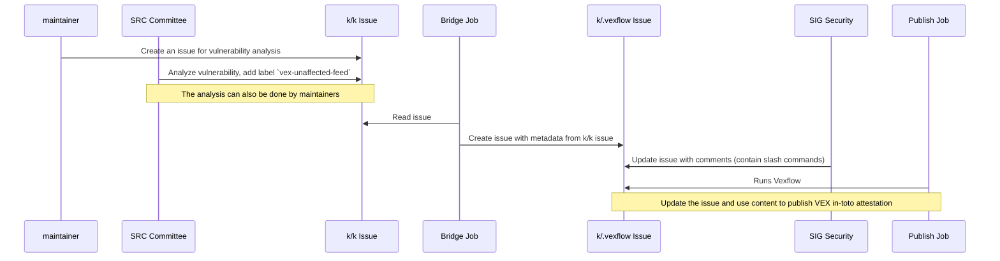

<!--
**Note:** When your KEP is complete, all of these comment blocks should be removed.

Follow the guidelines of the [documentation style guide].
In particular, wrap lines to a reasonable length, to make it
easier for reviewers to cite specific portions, and to minimize diff churn on
updates.

[documentation style guide]: https://github.com/kubernetes/community/blob/master/contributors/guide/style-guide.md

To get started with this template:

- [ ] **Pick a hosting SIG.**
  Make sure that the problem space is something the SIG is interested in taking
  up. KEPs should not be checked in without a sponsoring SIG.
- [ ] **Create an issue in kubernetes/enhancements**
  When filing an enhancement tracking issue, please make sure to complete all
  fields in that template. One of the fields asks for a link to the KEP. You
  can leave that blank until this KEP is filed, and then go back to the
  enhancement and add the link.
- [ ] **Make a copy of this template directory.**
  Copy this template into the owning SIG's directory and name it
  `NNNN-short-descriptive-title`, where `NNNN` is the issue number (with no
  leading-zero padding) assigned to your enhancement above.
- [ ] **Fill out as much of the kep.yaml file as you can.**
  At minimum, you should fill in the "Title", "Authors", "Owning-sig",
  "Status", and date-related fields.
- [ ] **Fill out this file as best you can.**
  At minimum, you should fill in the "Summary" and "Motivation" sections.
  These should be easy if you've preflighted the idea of the KEP with the
  appropriate SIG(s).
- [ ] **Create a PR for this KEP.**
  Assign it to people in the SIG who are sponsoring this process.
- [ ] **Merge early and iterate.**
  Avoid getting hung up on specific details and instead aim to get the goals of
  the KEP clarified and merged quickly. The best way to do this is to just
  start with the high-level sections and fill out details incrementally in
  subsequent PRs.

Just because a KEP is merged does not mean it is complete or approved. Any KEP
marked as `provisional` is a working document and subject to change. You can
denote sections that are under active debate as follows:

```
<<[UNRESOLVED optional short context or usernames ]>>
Stuff that is being argued.
<<[/UNRESOLVED]>>
```

When editing KEPS, aim for tightly-scoped, single-topic PRs to keep discussions
focused. If you disagree with what is already in a document, open a new PR
with suggested changes.

One KEP corresponds to one "feature" or "enhancement" for its whole lifecycle.
You do not need a new KEP to move from beta to GA, for example. If
new details emerge that belong in the KEP, edit the KEP. Once a feature has become
"implemented", major changes should get new KEPs.

The canonical place for the latest set of instructions (and the likely source
of this file) is [here](/keps/NNNN-kep-template/README.md).

**Note:** Any PRs to move a KEP to `implementable`, or significant changes once
it is marked `implementable`, must be approved by each of the KEP approvers.
If none of those approvers are still appropriate, then changes to that list
should be approved by the remaining approvers and/or the owning SIG (or
SIG Architecture for cross-cutting KEPs).
-->
# KEP-NNNN: Publish & Maintain VEX attestations

<!--
This is the title of your KEP. Keep it short, simple, and descriptive. A good
title can help communicate what the KEP is and should be considered as part of
any review.
-->

<!--
A table of contents is helpful for quickly jumping to sections of a KEP and for
highlighting any additional information provided beyond the standard KEP
template.

Ensure the TOC is wrapped with
  <code>&lt;!-- toc --&rt;&lt;!-- /toc --&rt;</code>
tags, and then generate with `hack/update-toc.sh`.
-->

<!-- toc -->
- [Release Signoff Checklist](#release-signoff-checklist)
- [Summary](#summary)
  - [How VEX Attestations Reduce Triage Toil](#how-vex-attestations-reduce-triage-toil)
- [Motivation](#motivation)
  - [Goals](#goals)
  - [Non-Goals](#non-goals)
- [Proposal](#proposal)
  - [User Stories](#user-stories)
    - [US1 - As a kubernetes user I would like to have VEX content associated with components of kubernetes](#us1---as-a-kubernetes-user-i-would-like-to-have-vex-content-associated-with-components-of-kubernetes)
    - [US2 - As kubernetes component maintainer I would like to amend VEX content so that it reflects the CVE analysis performed](#us2---as-kubernetes-component-maintainer-i-would-like-to-amend-vex-content-so-that-it-reflects-the-cve-analysis-performed)
    - [US3 - As kubernetes release or security team I would like to periodically update VEX content for kubernetes](#us3---as-kubernetes-release-or-security-team-i-would-like-to-periodically-update-vex-content-for-kubernetes)
    - [US4 (Out of scope)- As kubernetes component maintainer I would like VEX content to be useful to reduce toil generated by scanners](#us4-out-of-scope--as-kubernetes-component-maintainer-i-would-like-vex-content-to-be-useful-to-reduce-toil-generated-by-scanners)
  - [Notes/Constraints/Caveats](#notesconstraintscaveats)
  - [Risks and Mitigations](#risks-and-mitigations)
- [Design Details](#design-details)
  - [Component: kubernetes/.vexflow repository](#component-kubernetesvexflow-repository)
  - [Component: Bridge binary](#component-bridge-binary)
  - [Component: Prow jobs](#component-prow-jobs)
  - [Vexflow Issue Lifecycle](#vexflow-issue-lifecycle)
  - [Consuming VEX Attestations: How Maintainers Leverage Published Data](#consuming-vex-attestations-how-maintainers-leverage-published-data)
  - [For Engineers Evaluating New CVE Reports](#for-engineers-evaluating-new-cve-reports)
  - [For the Snyk Scan Job (Optional or out of scope)](#for-the-snyk-scan-job-optional-or-out-of-scope)
  - [For Cherry-pick Reviews](#for-cherry-pick-reviews)
  - [Test Plan](#test-plan)
      - [Prerequisite testing updates](#prerequisite-testing-updates)
      - [Unit tests](#unit-tests)
      - [Integration tests](#integration-tests)
      - [e2e tests](#e2e-tests)
  - [Graduation Criteria](#graduation-criteria)
  - [Upgrade / Downgrade Strategy](#upgrade--downgrade-strategy)
  - [Version Skew Strategy](#version-skew-strategy)
- [Production Readiness Review Questionnaire](#production-readiness-review-questionnaire)
  - [Feature Enablement and Rollback](#feature-enablement-and-rollback)
  - [Rollout, Upgrade and Rollback Planning](#rollout-upgrade-and-rollback-planning)
  - [Monitoring Requirements](#monitoring-requirements)
  - [Dependencies](#dependencies)
  - [Scalability](#scalability)
  - [Troubleshooting](#troubleshooting)
- [Implementation History](#implementation-history)
    - [Relationship to PR #200 (manual OpenVEX workflow)](#relationship-to-pr-200-manual-openvex-workflow)
- [Drawbacks](#drawbacks)
- [Alternatives](#alternatives)
- [Infrastructure Needed (Optional)](#infrastructure-needed-optional)
- [Future plans - Beta](#future-plans---beta)
  - [Consuming the Official CVE Feed as Affected VEX Statements](#consuming-the-official-cve-feed-as-affected-vex-statements)
    - [Proposed Extension (Alpha v1.5 or Beta)](#proposed-extension-alpha-v15-or-beta)
    - [Changes to Bridge Binary](#changes-to-bridge-binary)
    - [Effort Estimate](#effort-estimate)
    - [Recommendation](#recommendation)
    - [Data Flow](#data-flow)
<!-- /toc -->

## Release Signoff Checklist

<!--
**ACTION REQUIRED:** In order to merge code into a release, there must be an
issue in [kubernetes/enhancements] referencing this KEP and targeting a release
milestone **before the [Enhancement Freeze](https://git.k8s.io/sig-release/releases)
of the targeted release**.

For enhancements that make changes to code or processes/procedures in core
Kubernetes—i.e., [kubernetes/kubernetes], we require the following Release
Signoff checklist to be completed.

Check these off as they are completed for the Release Team to track. These
checklist items _must_ be updated for the enhancement to be released.
-->

Items marked with (R) are required *prior to targeting to a milestone / release*.

- [ ] (R) Enhancement issue in release milestone, which links to KEP dir in [kubernetes/enhancements] (not the initial KEP PR)
- [ ] (R) KEP approvers have approved the KEP status as `implementable`
- [ ] (R) Design details are appropriately documented
- [ ] (R) Test plan is in place, giving consideration to SIG Architecture and SIG Testing input (including test refactors)
  - [ ] e2e Tests for all Beta API Operations (endpoints)
  - [ ] (R) Ensure GA e2e tests meet requirements for [Conformance Tests](https://github.com/kubernetes/community/blob/master/contributors/devel/sig-architecture/conformance-tests.md)
  - [ ] (R) Minimum Two Week Window for GA e2e tests to prove flake free
- [ ] (R) Graduation criteria is in place
  - [ ] (R) [all GA Endpoints](https://github.com/kubernetes/community/pull/1806) must be hit by [Conformance Tests](https://github.com/kubernetes/community/blob/master/contributors/devel/sig-architecture/conformance-tests.md) within one minor version of promotion to GA
- [ ] (R) Production readiness review completed
- [ ] (R) Production readiness review approved
- [ ] "Implementation History" section is up-to-date for milestone
- [ ] User-facing documentation has been created in [kubernetes/website], for publication to [kubernetes.io]
- [ ] Supporting documentation—e.g., additional design documents, links to mailing list discussions/SIG meetings, relevant PRs/issues, release notes

<!--
**Note:** This checklist is iterative and should be reviewed and updated every time this enhancement is being considered for a milestone.
-->

[kubernetes.io]: https://kubernetes.io/
[kubernetes/enhancements]: https://git.k8s.io/enhancements
[kubernetes/kubernetes]: https://git.k8s.io/kubernetes
[kubernetes/website]: https://git.k8s.io/website

## Summary

Kubernetes periodically generates and publishes an [OSV feed](https://github.com/kubernetes-sigs/cve-feed-osv.git). It aggregates known vulnerabilities affecting kubernetes components, with a description of the vulnerability itself as well as precise version ranges affected. [OSV feeds](https://osv.dev/) are consumed by security scanners, in order to report vulnerabilities, by matching packages found in an SBOM with the corresponding vulnerabilities found in the OSV feed.

When a certain version of a component or library is marked as affected by a vulnerability, this doesn't necessarily mean that the vulnerability or weakness is exploitable in the context of that component. Many times, after analyzing the code, maintainers may find that the vulnerable code is not reachable from their codebase.

### How VEX Attestations Reduce Triage Toil

Published VEX attestations provide maintainers with concrete mechanisms to reduce duplicate triage work:

1. **Automated suppression in the Snyk job** - The periodic Snyk scan job currently fails when it encounters a CVE with no existing tracking issue in `kubernetes/kubernetes`. Once VEX attestations are published, the job can be enhanced to check for existing `not_affected` VEX statements before failing. If a CVE has already been triaged and published as `not_affected`, the job can suppress it from the failure report, avoiding duplicate triage requests.  
     
2. **Quick lookup for duplicate reports** - When engineers receive a new CVE report (from external sources, Dependabot alerts, or security researchers), they can quickly check if it's already been analyzed by:  
     
   - Running `vexflow ls --repo kubernetes/kubernetes --branch master` to list all open/closed triages   
   - Querying the `VEX triage repository (GitHub repository containing all CVE issues for VEX attestation generation)`directly for issues/attestations matching the CVE ID  
   - Using `cosign verify-attestation` to retrieve and verify signed VEX statements

   

   This prevents duplicate analysis and triage requests.

   

3. **Evidence for cherry-pick policy enforcement** — The Kubernetes cherry-pick policy (see [cherry-picks.md](https://github.com/kubernetes/community/blob/main/contributors/devel/sig-release/cherry-picks.md)) states that "dependency updates that just aim to silence some scanners and do not fix any vulnerable code are NOT eligible for cherry-picks." Published VEX `not_affected` attestations provide authoritative, machine-readable, and cryptographically signed evidence that a CVE does not affect the codebase. Reviewers can point to the signed VEX statement instead of re-analyzing the CVE, reducing back-and-forth in cherry-pick discussions.


## Motivation

In Kubernetes, VEX files can already be generated for the golang source code thanks to script [hack/verify-govulncheck.sh](https://github.com/kubernetes/kubernetes/blob/master/hack/verify-govulncheck.sh) introduced with [sig-security issue \#116](http://github.com/kubernetes/sig-security/issues/116).  
This script runs with every PR presubmit, within job pull-kubernetes-verify.  
The results  from `govulncheck` on the master branch and the PR HEAD are compared, and sent to the standard output of the prow job. However, results are not further used.  
This initiative was part of [Artifact Vulnerability Scanning and Triage Policy](https://github.com/kubernetes/sig-security/issues/3#top) organizing activities around vulnerability management for Kubernetes.

By publishing VEX results alongside OSV feeds, we give the kubernetes maintainers and community more accurate and up-to-date information about which CVEs have been analyzed, which ones are affecting the product, and which ones are not.

By preemptively generating VEX documents and publishing them as cryptographically signed attestations, this will **reduce toil on k8s maintainers** in the three concrete ways explained above (see [How VEX Attestations Reduce Triage Toil](#how-vex-attestations-reduce-triage-toil)).

### Goals

* Generate and publish VEX documents for Kubernetes master branch via periodic prow jobs  
* Identify how VEX reports can be safely updated  
  * Use GitHub Issues (with slash commands) as the maintainer interface for VEX triage (authorization)
* Sign VEX documents with sigstore and publish as attestations for integrity and authenticity  
* Build a bridge between existing CVE triage issues (`kubernetes/kubernetes`) and vexflow triage issues  
* Support only for the `not_affected` OpenVEX status, and its five `not_affected` justifications  
* Establish a foundation for future alpha-to-beta graduation (release branches, additional statuses, scanning) by opening discussions on: 
  * Can snyk scanning take vex files into account?  
  * Can the go-vulncheck VEX outputs be integrated with the VEX feed generation process to further facilitate the work of Kubernetes maintainers?
  * Is there value in publishing VEX attestations per release?
  * Is there value in including VEX statements for CVEs in states `fixed`, `affected`, `under_investigation`?
  

### Non-Goals

* generate VEX attestations specific to release versions (postponed to beta or stable version)   
* automated vulnerability scanning (no disruption to the existing Snyk periodic scanning)  
* Publishing VEX attestations as OCI manifests (OCI Referrers API) attached to the OCI images  
* Publishing VEX attestations to VexHub   
* `affected`/`fixed` statuses - see [Future: Consuming the Official CVE Feed](#future-plans---beta) for a proposal to add this in beta  
* Identify why govulncheck is focused on scope package when scanning, and if it makes sense to be increased  
* Extend scope outside of Go code (container image contents) - future work  
* Use VEX formats other than OpenVEX

## Proposal

This KEP's first implementation (alpha) uses [vexflow](https://github.com/carabiner-dev/vexflow) to automate VEX generation and publishing for the Kubernetes master branch. 

> Vexflow handles the lifecycle of VEX information for projects through GitHub issues. When new vulnerabilities are discovered in the monitored branches, vexflow opens a new triage issue. As long as the vulnerability is present in the branch, the issue remains open waiting for an assessment from the authorized maintainers.\
> Using vexflow's chatops interface, maintainers create an assessment using one of the recognized slash commands (`/fixed`, `/affected`, `/not_affacted`).\
> Vexflow then publishes the assessments through signed OpenVEX attestations.

The alpha scope focuses on CVEs determined to be `not_affected` by the Security Response Committee and maintainers. 

VEX documents are generated from existing triage determinations (stored in `kubernetes/kubernetes` issues labeled `vex-unaffected-feed`). VEX documents are signed with sigstore, and published as attestations to a separate GitHub repository, `kubernetes/.vexflow`.



### User Stories

#### US1 - As a kubernetes user I would like to have VEX content associated with components of kubernetes

A Prow job generates VEX documents, signs them with sigstore, and publishes them as attestations to the `kubernetes/.vexflow` repository. 

The OpenVEX attestations are generated by [vexflow](https://github.com/carabiner-dev/vexflow) and are an aggregation of the triaged CVE issues in the  `kubernetes/.vexflow` repository.

Consumers (scanners, enterprises) can verify attestations using `cosign verify-attestation` with the Fulcio root certificate.

Attestations are discoverable via the GitHub Attestations API. This provides:

- **Integrity & authenticity** - cryptographic proof that Kubernetes maintainers created the VEX statement  
- **Discoverability** - centralized location for all Kubernetes VEX data  
- **No infrastructure cost** - GitHub attestation storage is included with public repos

#### US2 - As kubernetes component maintainer I would like to amend VEX content so that it reflects the CVE analysis performed

The proposal is not to allow a human to directly update the VEX files for kubernetes.  
The workflow is:

1. **k/k code scan** - \[Current situation\] The Prow job `ci-kubernetes-snyk-master` scans the `kubernetes/kubernetes` code base and fails if CVEs are detected against the code base.   
2. **Issues are open manually** - \[Current situation\] A maintainer manually opens an issue in kubernetes/kubernetes, which will be triaged and analyzed by the maintainers.   
3. **Bridge job creates the issue** - A periodic Prow job monitors `kubernetes/kubernetes` for issues labeled `vex-unaffected-feed`. For each labeled issue, the bridge binary creates a corresponding issue in `kubernetes/.vexflow` with:  
     
   - Title: the CVE ID  
   - Hidden metadata: [vexflow](https://github.com/carabiner-dev/vexflow)'s `VEXFLOW==DATA` JSON block (branch, CVE, component, status)  
   - OPTIONAL - A slash command comment with the justification extracted from the original k/k issue  
4. **SIG Security team validates** - SIG Security team (as defined by the `OWNERS` file in `kubernetes/.vexflow`) interacts with the issues created by the Bridge job in `kubernetes/.vexflow` and verifies that the justification is accurate and comes from authorized maintainers and adds a slash command comment to the issue.  
     
5. **Slash command execution** - Only users listed in the `.vexflow` repo's `OWNERS` file (approvers) can issue commands. Vexflow parses the command and updates the issue status:  
     
   - `/not_affected:component_not_present`  
   - `/not_affected:vulnerable_code_not_present`  
   - `/not_affected:vulnerable_code_not_in_execute_path`  
   - `/not_affected:vulnerable_code_cannot_be_controlled_by_adversary`  
   - `/not_affected:inline_mitigations_already_exist`

Any text after the command is treated as the impact statement.

6. **VEX publishing job** - Vexflow's periodic update job detects issues with slash commands, generates OpenVEX documents, signs them, and publishes attestations. The issue is then closed.

This approach:

- Requires no new tooling - vexflow's native slash commands  
- Enforces access control - OWNERS file controls who can authorize VEX statements  
- Preserves the audit trail - GitHub issue history shows all changes  
- Maintains simplicity - maintainers work in familiar GitHub interface

#### US3 - As kubernetes release or security team I would like to periodically update VEX content for kubernetes

A two-job pipeline automates the generation and publication of VEX documents:

* **Bridge job** - Periodic job that monitors `kubernetes/kubernetes` for issues labeled `vex-unaffected-feed`:  
  * Queries GitHub API for all matching issues (open and closed)  
  * Extracts CVE IDs and maintainer determinations  
  * Creates corresponding triage issues in `kubernetes/.vexflow` with hidden metadata and slash command comments  
  * Posts the determination as a slash command on the created issue


* **Publish job** - Periodic job that runs `vexflow update --repo kubernetes/kubernetes --branch master --triage-repo kubernetes/.vexflow --scan=false`:  
  * Lists all open triage issues  
  * Detects issues with slash commands (status: `WAITING_STATEMENT`)  
  * Generates OpenVEX documents from the issue metadata and comments with slash commands  
  * Signs documents with sigstore (keyless via Fulcio)  
  * Publishes attestations to GitHub attestation store in `kubernetes/.vexflow`  
  * Closes completed triage issues

**Future (Beta/GA):** Enable `--scan=true` to automatically detect new vulnerabilities, support release branches, and support `affected`/`fixed` statuses

#### US4 (Out of scope)- As kubernetes component maintainer I would like VEX content to be useful to reduce toil generated by scanners

**Alpha Status:** Out of scope for alpha in terms of scanner integration. Scanner integration (Snyk, Trivy, etc.) is planned for beta/GA.

Published VEX attestations in `kubernetes/.vexflow` are already consumable by tools that support OpenVEX and can fetch attestations via `cosign verify-attestation`. 

However, see [Future: Consuming the Official CVE Feed](#future-plans---beta) below for a proposal to extend alpha scope to include `affected` and `fixed` VEX statements.

### Notes/Constraints/Caveats

In this proposal, we did not wish to impact the existing security job at all, nor the current process established for SRC committee to create the OSV feed. The proposal attempts to find the path that impacts the maintainers the least.

### Risks and Mitigations
| Risk | Mitigation|
|------|-----------|
| A simple contributor (not in component's OWNERS) labels a CVE issue `vex-unaffected-feed` when it shouldn't | The Bridge job only copies the issues over to kubernetes/.vexflow. SIG-Security team will be reviewing the issues in kubernetes/.vexflow before applying any chatops comments that would lead to actually publishing this statement as part of the VEX attestation |
| `vex-unaffected-feed` isn't added to an issue | The CVE will not appear as `not-affected` in the VEX attestations (stale data). This can be fixed by a bulk operation on kubernetes/kubernetes issues by SIG-Security officials |
| Bridge job fails | The impact to the Kubernetes ecosystem is very low: VEX reports will not contain fresh data until the Bridge job is fixed |
| Publish job fails | The impact to the Kubernetes ecosystem is very low: New VEX reports will not be published until the job is fixed |
| Unauthorized user adds a chatops (slash) comment to an issue in kubernetes/.vexflow | The vexflow binary, running in the Publish job will ignore any comments by contributors not listed in the OWNERS file |
| Unauthorized user adds themselves to kubernetes/.vexflow's ONWERS | The main branch of .vexflow is protected, and pull requests need to be approved by owners in order to affect the main branch |
| **Publish job's GITHUB_TOKEN is stolen**: This would allow a user to create or update issues in kubernetes/.vexflow (marking CVEs as fixed when they really affect K8S for example), or to publish attestations to kubernetes/.vexflow without going through the Prow job | same security mechanisms as for other secrets used by Prow? |
| **Bridge job's GITHUB_TOKEN is stolen**: This would allow a user to create or update issues in kubernetes/kubernetes (which is already open) and kubernetes/.vexflow (marking CVEs as fixed when they really affect K8S for example). | same security mechanisms as for other secrets used by Prow? | 

## Design Details

The alpha implementation consists of three components:

1. **Label trigger** - Maintainers add `vex-unaffected-feed` to `kubernetes/kubernetes` issues  
2. **Bridge job** - Translates k/k issues to vexflow triage issues in `kubernetes/.vexflow`  
3. **Further verification by SIG Security** \- slash commands are added to triage issues in  `kubernetes/.vexflow` in order to confirm issues are not affecting k/k (OPTIONAL)  
4. **Publish job** - Runs `vexflow update --scan=false` to generate/sign/publish VEX attestations

### Component: kubernetes/.vexflow repository

- Triage repository for vexflow  
- OWNERS file with `sig-security-leads` as approvers  
- Issues contain hidden `VEXFLOW==DATA` metadata  
- Attestations published to GitHub attestation store

### Component: Bridge binary

- Go binary in `kubernetes/sig-security`, under `sig-security-tooling/vex-feed/hack/bridge/`  
- Queries GitHub API: `is:issue label:vex-unaffected-feed repo:kubernetes/kubernetes`  
- For each labeled issue:  
  1. Extract CVE IDs (regex scan of title \+ body \+ comments)  
  2. Extract component information (package name, purl)  
  3. Check if a `.vexflow` issue already exists for this CVE \+ branch  
  4. If not, create the issue with VEXFLOW==DATA metadata  
  5. Post a slash command comment with the justification (If clearly identified)

### Component: Prow jobs

**Bridge job** (`ci-kubernetes-vex-bridge`):

- Periodic, every 6 hours  
- Runs the bridge binary  
- Secrets: `GITHUB_TOKEN` with read (k/k) and write (.vexflow) access

**Publish job** (`ci-kubernetes-vex-publish`):

- Periodic, every 6 hours  
- Runs: `vexflow update --repo kubernetes/kubernetes --branch master --triage-repo kubernetes/.vexflow --scan=false`  
- Secrets: `GITHUB_TOKEN` with write access to `.vexflow`  
- Sigstore: keyless signing via Fulcio (prow service account OIDC identity)

### Vexflow Issue Lifecycle

1. Bridge creates issue - status: `WAITING_USER`  
2. Bridge (or SIG Security team) posts slash command → status: `WAITING_STATEMENT`. The Bridge can only post the command if it can parse the information from the original issue. Otherwise, it does not guess, and leaves the action to SIG Security team. 
3. vexflow update generates VEX doc → signs with sigstore → publishes attestation  
4. vexflow posts publish notice → closes issue → status: CLOSED

### Consuming VEX Attestations: How Maintainers Leverage Published Data

Once VEX attestations are published to `kubernetes/.vexflow`, maintainers and automation can consume them to reduce triage work:

### For Engineers Evaluating New CVE Reports

When a new CVE report arrives (from the Snyk scan, external researchers, or Dependabot):

1. **Check for existing analysis \- options**:

```shell
# List all triages (open and closed) for the branch
vexflow ls --repo kubernetes/kubernetes --branch master

# Search for a specific CVE in .vexflow issues
gh issue list --repo kubernetes/.vexflow --search "CVE-2026-XXXXX"

# Verify a published attestation (after attestation support is added)
cosign verify-attestation --certificate-identity-regexp ".*" \
  --certificate-oidc-issuer-regexp ".*" \
  ghcr.io/kubernetes/.vexflow/attestations
```

2. **Outcome**: If a `not_affected` VEX statement already exists for the CVE, the engineer knows:  
     
   - The CVE has been analyzed  
   - The analysis is documented in a signed, verifiable attestation  
   - No duplicate triage is needed

### For the Snyk Scan Job (Optional or out of scope)

The periodic Snyk scan job currently fails when it detects a CVE without a tracking issue. In the future (beta/GA), the job could be enhanced to:

1. **Fetch published VEX data**:

```shell
vexflow assemble --repo kubernetes/kubernetes --branch master --out vex-feed.json
```

This generates a consolidated OpenVEX document from all published attestations in `.vexflow`.


2. **Suppress already-triaged CVEs**: The job would parse the assembled VEX document and check each detected CVE against it. If a `not_affected` statement exists, the CVE is suppressed from the failure report.  
     
3. **Outcome**: The Snyk job only fails for truly new CVEs or CVEs where a re-analysis has changed the determination. This dramatically reduces alert fatigue and duplicate triage requests.

### For Cherry-pick Reviews

When a PR attempts to update a dependency (e.g., bump gRPC version to silence a scanner alert), reviewers can now check if a VEX statement exists:

1. **Engineer requests cherry-pick**:  
   - "Please backport gRPC v1.79.3 to v1.32 to fix CVE-2026-25679"  
   - The cherry-pick policy requires that actual vulnerable code be fixed, not just silence scanners.
2. **Reviewer checks VEX**:  
   - Query `.vexflow` for a `not_affected` VEX statement for CVE-2026-25679 on master  
   - If found, point to the signed attestation: "This CVE is already marked as not\_affected on master with justification X, so the backport is not necessary per policy."
3. **Outcome**: Reviewers have authoritative evidence and can reject scanner-silencing updates faster, reducing reviewer burden.

### Test Plan

<!--
**Note:** *Not required until targeted at a release.*
The goal is to ensure that we don't accept enhancements with inadequate testing.

All code is expected to have adequate tests (eventually with coverage
expectations). Please adhere to the [Kubernetes testing guidelines][testing-guidelines]
when drafting this test plan.

[testing-guidelines]: https://git.k8s.io/community/contributors/devel/sig-testing/testing.md
-->

[x] I/we understand the owners of the involved components may require updates to
existing tests to make this code solid enough prior to committing the changes necessary
to implement this enhancement.

##### Prerequisite testing updates

<!--
Based on reviewers feedback describe what additional tests need to be added prior
implementing this enhancement to ensure the enhancements have also solid foundations.
-->

##### Unit tests

<!--
In principle every added code should have complete unit test coverage, so providing
the exact set of tests will not bring additional value.
However, if complete unit test coverage is not possible, explain the reason of it
together with explanation why this is acceptable.
-->

<!--
Additionally, for Alpha try to enumerate the core package you will be touching
to implement this enhancement and provide the current unit coverage for those
in the form of:
- <package>: <date> - <current test coverage>
The data can be easily read from:
https://testgrid.k8s.io/sig-testing-canaries#ci-kubernetes-coverage-unit

This can inform certain test coverage improvements that we want to do before
extending the production code to implement this enhancement.
-->

- `<package>`: `<date>` - `<test coverage>`

##### Integration tests

<!--
Integration tests are contained in https://git.k8s.io/kubernetes/test/integration.
Integration tests allow control of the configuration parameters used to start the binaries under test.
This is different from e2e tests which do not allow configuration of parameters.
Doing this allows testing non-default options and multiple different and potentially conflicting command line options.
For more details, see https://github.com/kubernetes/community/blob/master/contributors/devel/sig-testing/testing-strategy.md

If integration tests are not necessary or useful, explain why.
-->

<!--
This question should be filled when targeting a release.
For Alpha, describe what tests will be added to ensure proper quality of the enhancement.

For Beta and GA, document that tests have been written,
have been executed regularly, and have been stable.
This can be done with:
- permalinks to the GitHub source code
- links to the periodic job (typically https://testgrid.k8s.io/sig-release-master-blocking#integration-master), filtered by the test name
- a search in the Kubernetes bug triage tool (https://storage.googleapis.com/k8s-triage/index.html)
-->

- [test name](https://github.com/kubernetes/kubernetes/blob/2334b8469e1983c525c0c6382125710093a25883/test/integration/...): [integration master](https://testgrid.k8s.io/sig-release-master-blocking#integration-master?include-filter-by-regex=MyCoolFeature), [triage search](https://storage.googleapis.com/k8s-triage/index.html?test=MyCoolFeature)

##### e2e tests

<!--
This question should be filled when targeting a release.
For Alpha, describe what tests will be added to ensure proper quality of the enhancement.

For Beta and GA, document that tests have been written,
have been executed regularly, and have been stable.
This can be done with:
- permalinks to the GitHub source code
- links to the periodic job (typically a job owned by the SIG responsible for the feature), filtered by the test name
- a search in the Kubernetes bug triage tool (https://storage.googleapis.com/k8s-triage/index.html)

We expect no non-infra related flakes in the last month as a GA graduation criteria.
If e2e tests are not necessary or useful, explain why.
-->

- [test name](https://github.com/kubernetes/kubernetes/blob/2334b8469e1983c525c0c6382125710093a25883/test/e2e/...): [SIG ...](https://testgrid.k8s.io/sig-...?include-filter-by-regex=MyCoolFeature), [triage search](https://storage.googleapis.com/k8s-triage/index.html?test=MyCoolFeature)

### Graduation Criteria

<!--
**Note:** *Not required until targeted at a release.*

Define graduation milestones.

These may be defined in terms of API maturity, [feature gate] graduations, or as
something else. The KEP should keep this high-level with a focus on what
signals will be looked at to determine graduation.

Consider the following in developing the graduation criteria for this enhancement:
- [Maturity levels (`alpha`, `beta`, `stable`)][maturity-levels]
- [Feature gate][feature gate] lifecycle
- [Deprecation policy][deprecation-policy]

Clearly define what graduation means by either linking to the [API doc
definition](https://kubernetes.io/docs/concepts/overview/kubernetes-api/#api-versioning)
or by redefining what graduation means.

In general we try to use the same stages (alpha, beta, GA), regardless of how the
functionality is accessed.

[feature gate]: https://git.k8s.io/community/contributors/devel/sig-architecture/feature-gates.md
[maturity-levels]: https://git.k8s.io/community/contributors/devel/sig-architecture/api_changes.md#alpha-beta-and-stable-versions
[deprecation-policy]: https://kubernetes.io/docs/reference/using-api/deprecation-policy/

Below are some examples to consider, in addition to the aforementioned [maturity levels][maturity-levels].

#### Alpha

- Feature implemented behind a feature flag
- Initial e2e tests completed and enabled

#### Beta

- Gather feedback from developers and surveys
- Complete features A, B, C
- Additional tests are in Testgrid and linked in KEP
- More rigorous forms of testing—e.g., downgrade tests and scalability tests
- All functionality completed
- All security enforcement completed
- All monitoring requirements completed
- All testing requirements completed
- All known pre-release issues and gaps resolved

**Note:** Beta criteria must include all functional, security, monitoring, and testing requirements along with resolving all issues and gaps identified

#### GA

- N examples of real-world usage
- N installs
- Allowing time for feedback
- All issues and gaps identified as feedback during beta are resolved

**Note:** GA criteria must not include any functional, security, monitoring, or testing requirements.  Those must be beta requirements.

**Note:** Generally we also wait at least two releases between beta and
GA/stable, because there's no opportunity for user feedback, or even bug reports,
in back-to-back releases.

**For non-optional features moving to GA, the graduation criteria must include
[conformance tests].**

[conformance tests]: https://git.k8s.io/community/contributors/devel/sig-architecture/conformance-tests.md

#### Deprecation

<!--
- Announce deprecation and support policy of the existing flag
- Two versions passed since introducing the functionality that deprecates the flag (to address version skew)
- Address feedback on usage/changed behavior, provided on GitHub issues
- Deprecate the flag
-->

### Upgrade / Downgrade Strategy

<!--
If applicable, how will the component be upgraded and downgraded? Make sure
this is in the test plan.

Consider the following in developing an upgrade/downgrade strategy for this
enhancement:
- What changes (in invocations, configurations, API use, etc.) is an existing
  cluster required to make on upgrade, in order to maintain previous behavior?
- What changes (in invocations, configurations, API use, etc.) is an existing
  cluster required to make on upgrade, in order to make use of the enhancement?
-->

### Version Skew Strategy

<!--
If applicable, how will the component handle version skew with other
components? What are the guarantees? Make sure this is in the test plan.

Consider the following in developing a version skew strategy for this
enhancement:
- Does this enhancement involve coordinating behavior in the control plane and nodes?
- How does an n-3 kubelet or kube-proxy without this feature available behave when this feature is used?
- How does an n-1 kube-controller-manager or kube-scheduler without this feature available behave when this feature is used?
- Will any other components on the node change? For example, changes to CSI,
  CRI or CNI may require updating that component before the kubelet.
-->

## Production Readiness Review Questionnaire

<!--

Production readiness reviews are intended to ensure that features merging into
Kubernetes are observable, scalable and supportable; can be safely operated in
production environments, and can be disabled or rolled back in the event they
cause increased failures in production. See more in the PRR KEP at
https://git.k8s.io/enhancements/keps/sig-architecture/1194-prod-readiness.

The production readiness review questionnaire must be completed and approved
for the KEP to move to `implementable` status and be included in the release.

In some cases, the questions below should also have answers in `kep.yaml`. This
is to enable automation to verify the presence of the review, and to reduce review
burden and latency.

The KEP must have a approver from the
[`prod-readiness-approvers`](http://git.k8s.io/enhancements/OWNERS_ALIASES)
team. Please reach out on the
[#prod-readiness](https://kubernetes.slack.com/archives/CPNHUMN74) channel if
you need any help or guidance.
-->

### Feature Enablement and Rollback

<!--
This section must be completed when targeting alpha to a release.
-->

###### How can this feature be enabled / disabled in a live cluster?

<!--
Pick one of these and delete the rest.

Documentation is available on [feature gate lifecycle] and expectations, as
well as the [existing list] of feature gates.

[feature gate lifecycle]: https://git.k8s.io/community/contributors/devel/sig-architecture/feature-gates.md
[existing list]: https://kubernetes.io/docs/reference/command-line-tools-reference/feature-gates/
-->

- [ ] Feature gate (also fill in values in `kep.yaml`)
  - Feature gate name:
  - Components depending on the feature gate:
- [ ] Other
  - Describe the mechanism:
  - Will enabling / disabling the feature require downtime of the control
    plane?
  - Will enabling / disabling the feature require downtime or reprovisioning
    of a node?

###### Does enabling the feature change any default behavior?

<!--
Any change of default behavior may be surprising to users or break existing
automations, so be extremely careful here.
-->

###### Can the feature be disabled once it has been enabled (i.e. can we roll back the enablement)?

<!--
Describe the consequences on existing workloads (e.g., if this is a runtime
feature, can it break the existing applications?).

Feature gates are typically disabled by setting the flag to `false` and
restarting the component. No other changes should be necessary to disable the
feature.

NOTE: Also set `disable-supported` to `true` or `false` in `kep.yaml`.
-->

###### What happens if we reenable the feature if it was previously rolled back?

###### Are there any tests for feature enablement/disablement?

<!--
The e2e framework does not currently support enabling or disabling feature
gates. However, unit tests in each component dealing with managing data, created
with and without the feature, are necessary. At the very least, think about
conversion tests if API types are being modified.

Additionally, for features that are introducing a new API field, unit tests that
are exercising the `switch` of feature gate itself (what happens if I disable a
feature gate after having objects written with the new field) are also critical.
You can take a look at one potential example of such test in:
https://github.com/kubernetes/kubernetes/pull/97058/files#diff-7826f7adbc1996a05ab52e3f5f02429e94b68ce6bce0dc534d1be636154fded3R246-R282
-->

### Rollout, Upgrade and Rollback Planning

<!--
This section must be completed when targeting beta to a release.
-->

###### How can a rollout or rollback fail? Can it impact already running workloads?

<!--
Try to be as paranoid as possible - e.g., what if some components will restart
mid-rollout?

Be sure to consider highly-available clusters, where, for example,
feature flags will be enabled on some API servers and not others during the
rollout. Similarly, consider large clusters and how enablement/disablement
will rollout across nodes.
-->

###### What specific metrics should inform a rollback?

<!--
What signals should users be paying attention to when the feature is young
that might indicate a serious problem?
-->

###### Were upgrade and rollback tested? Was the upgrade->downgrade->upgrade path tested?

<!--
Describe manual testing that was done and the outcomes.
Longer term, we may want to require automated upgrade/rollback tests, but we
are missing a bunch of machinery and tooling and can't do that now.
-->

###### Is the rollout accompanied by any deprecations and/or removals of features, APIs, fields of API types, flags, etc.?

<!--
Even if applying deprecation policies, they may still surprise some users.
-->

### Monitoring Requirements

<!--
This section must be completed when targeting beta to a release.

For GA, this section is required: approvers should be able to confirm the
previous answers based on experience in the field.
-->

###### How can an operator determine if the feature is in use by workloads?

<!--
Ideally, this should be a metric. Operations against the Kubernetes API (e.g.,
checking if there are objects with field X set) may be a last resort. Avoid
logs or events for this purpose.
-->

###### How can someone using this feature know that it is working for their instance?

<!--
For instance, if this is a pod-related feature, it should be possible to determine if the feature is functioning properly
for each individual pod.
Pick one more of these and delete the rest.
Please describe all items visible to end users below with sufficient detail so that they can verify correct enablement
and operation of this feature.
Recall that end users cannot usually observe component logs or access metrics.
-->

- [ ] Events
  - Event Reason: 
- [ ] API .status
  - Condition name: 
  - Other field: 
- [ ] Other (treat as last resort)
  - Details:

###### What are the reasonable SLOs (Service Level Objectives) for the enhancement?

<!--
This is your opportunity to define what "normal" quality of service looks like
for a feature.

It's impossible to provide comprehensive guidance, but at the very
high level (needs more precise definitions) those may be things like:
  - per-day percentage of API calls finishing with 5XX errors <= 1%
  - 99% percentile over day of absolute value from (job creation time minus expected
    job creation time) for cron job <= 10%
  - 99.9% of /health requests per day finish with 200 code

These goals will help you determine what you need to measure (SLIs) in the next
question.
-->

###### What are the SLIs (Service Level Indicators) an operator can use to determine the health of the service?

<!--
Pick one more of these and delete the rest.
-->

- [ ] Metrics
  - Metric name:
  - [Optional] Aggregation method:
  - Components exposing the metric:
- [ ] Other (treat as last resort)
  - Details:

###### Are there any missing metrics that would be useful to have to improve observability of this feature?

<!--
Describe the metrics themselves and the reasons why they weren't added (e.g., cost,
implementation difficulties, etc.).
-->

### Dependencies

<!--
This section must be completed when targeting beta to a release.
-->

###### Does this feature depend on any specific services running in the cluster?

<!--
Think about both cluster-level services (e.g. metrics-server) as well
as node-level agents (e.g. specific version of CRI). Focus on external or
optional services that are needed. For example, if this feature depends on
a cloud provider API, or upon an external software-defined storage or network
control plane.

For each of these, fill in the following—thinking about running existing user workloads
and creating new ones, as well as about cluster-level services (e.g. DNS):
  - [Dependency name]
    - Usage description:
      - Impact of its outage on the feature:
      - Impact of its degraded performance or high-error rates on the feature:
-->

### Scalability

<!--
For alpha, this section is encouraged: reviewers should consider these questions
and attempt to answer them.

For beta, this section is required: reviewers must answer these questions.

For GA, this section is required: approvers should be able to confirm the
previous answers based on experience in the field.
-->

###### Will enabling / using this feature result in any new API calls?

<!--
Describe them, providing:
  - API call type (e.g. PATCH pods)
  - estimated throughput
  - originating component(s) (e.g. Kubelet, Feature-X-controller)
Focusing mostly on:
  - components listing and/or watching resources they didn't before
  - API calls that may be triggered by changes of some Kubernetes resources
    (e.g. update of object X triggers new updates of object Y)
  - periodic API calls to reconcile state (e.g. periodic fetching state,
    heartbeats, leader election, etc.)
-->

###### Will enabling / using this feature result in introducing new API types?

<!--
Describe them, providing:
  - API type
  - Supported number of objects per cluster
  - Supported number of objects per namespace (for namespace-scoped objects)
-->

###### Will enabling / using this feature result in any new calls to the cloud provider?

<!--
Describe them, providing:
  - Which API(s):
  - Estimated increase:
-->

###### Will enabling / using this feature result in increasing size or count of the existing API objects?

<!--
Describe them, providing:
  - API type(s):
  - Estimated increase in size: (e.g., new annotation of size 32B)
  - Estimated amount of new objects: (e.g., new Object X for every existing Pod)
-->

###### Will enabling / using this feature result in increasing time taken by any operations covered by existing SLIs/SLOs?

<!--
Look at the [existing SLIs/SLOs].

Think about adding additional work or introducing new steps in between
(e.g. need to do X to start a container), etc. Please describe the details.

[existing SLIs/SLOs]: https://git.k8s.io/community/sig-scalability/slos/slos.md#kubernetes-slisslos
-->

###### Will enabling / using this feature result in non-negligible increase of resource usage (CPU, RAM, disk, IO, ...) in any components?

<!--
Things to keep in mind include: additional in-memory state, additional
non-trivial computations, excessive access to disks (including increased log
volume), significant amount of data sent and/or received over network, etc.
This through this both in small and large cases, again with respect to the
[supported limits].

[supported limits]: https://git.k8s.io/community//sig-scalability/configs-and-limits/thresholds.md
-->

###### Can enabling / using this feature result in resource exhaustion of some node resources (PIDs, sockets, inodes, etc.)?

<!--
Focus not just on happy cases, but primarily on more pathological cases
(e.g. probes taking a minute instead of milliseconds, failed pods consuming resources, etc.).
If any of the resources can be exhausted, how this is mitigated with the existing limits
(e.g. pods per node) or new limits added by this KEP?

Are there any tests that were run/should be run to understand performance characteristics better
and validate the declared limits?
-->

### Troubleshooting

<!--
This section must be completed when targeting beta to a release.

For GA, this section is required: approvers should be able to confirm the
previous answers based on experience in the field.

The Troubleshooting section currently serves the `Playbook` role. We may consider
splitting it into a dedicated `Playbook` document (potentially with some monitoring
details). For now, we leave it here.
-->

###### How does this feature react if the API server and/or etcd is unavailable?

###### What are other known failure modes?

<!--
For each of them, fill in the following information by copying the below template:
  - [Failure mode brief description]
    - Detection: How can it be detected via metrics? Stated another way:
      how can an operator troubleshoot without logging into a master or worker node?
    - Mitigations: What can be done to stop the bleeding, especially for already
      running user workloads?
    - Diagnostics: What are the useful log messages and their required logging
      levels that could help debug the issue?
      Not required until feature graduated to beta.
    - Testing: Are there any tests for failure mode? If not, describe why.
-->

###### What steps should be taken if SLOs are not being met to determine the problem?

## Implementation History

- 2026-09: Alpha proposal - vexflow-based pipeline for not\_affected VEX on master branch  
- 2026-07: [PR \#200](https://github.com/kubernetes/sig-security/pull/200) - Manual OpenVEX workflow (build-feed, new-issue tools)  
- [Initial KEP draft](https://docs.google.com/document/d/1JdCYfwBU-1eoDSKa0lFL_VfVr3du2-gDT3RhILETUrQ/edit?usp=sharing) - govulncheck-based VEX generation exploration

#### Relationship to PR \#200 (manual OpenVEX workflow)

The existing work in PR \#200 (hack/build-feed, hack/new-issue, hack/openvex) implements a manual workflow where maintainers edit per-issue OpenVEX JSON files and a build tool merges them into a combined feed. The vexflow-based approach replaces this with an automated pipeline:

| Aspect | PR \#200 (manual) | vexflow (automated) |
| :---- | :---- | :---- |
| Issue tracking | Per-issue `.openvex.json` files | GitHub issues in `.vexflow` |
| Merge logic | Custom Go build tool | vexflow handles internally |
| Publishing | JSON file in sig-security repo | Sigstore attestations |
| Authorization | Git commit access | OWNERS file \+ slash commands |
| Triggering | Manual scaffold \+ edit | Label on k/k issue |
| Consumption | Files in repo (no auth) | Signed attestations (verifiable) |

The manual tools from PR \#200 may still be useful for bootstrapping initial VEX data or for scenarios where vexflow is not suitable.

## Drawbacks

<!--
Why should this KEP _not_ be implemented?
-->

## Alternatives

- **Asking maintainers to use the slash commands themselves on the issues in the kubernetes/kubernetes repository:**  
  - This requires a little process change but shouldn't be extra heavy  
  - The prow bridge job that creates the triage issues in .vexflow from the original issues can decide to copy the comments over only if the commenter belongs to the OWNERS file of the corresponding component  
  - Advantage: reduces the need for SIG-Security to review the issues in kubernetes/.vexflow  
- **Enabling scan on Vexflow:** Vexflow uses osv scanner, not snyk. It will duplicate all the CVEs found into .vexflow and will require maintainers to also triage the issues in .vexflow as well as the ones created after snyk scans fail.   
  - **govulncheck-based generation**: We can definitely couple the Vexflow scan with govulncheck, so that the issues opened in .vexflow can automatically be updated with relevant slash commands based on results from govulncheck.  
- **Manual OpenVEX workflow (PR \#200)**: Maintainers edit JSON files directly. Simpler but doesn't scale and lacks signing/attestation.  
- **VexHub**: Publishing VEX files for the Aqua VexHub crawler. Viable for distribution but doesn't provide signing or attestation provenance.  
- **OCI referrers**: Attaching VEX to container images. Ideal for container consumers but requires registry access and is complex for alpha.  
- **Using kubernetes/kubernetes as the triage repository:**  
  -  [Vexflow\#6](https://github.com/carabiner-dev/vexflow/issues/6) needs to be implemented as we have one OWNERS file per component  
  - [Vexflow\#114](https://github.com/carabiner-dev/vexflow/issues/114) needs to be implemented: especially if we choose k/k to be the triage-repo, the number of issues is very high, and the job might take ages to go through all bodies of all issues (including closed)
- **VEX distribution**: Distributing through VexHub (distributing VEX files via Aqua's crawler) or as OCI referrers (attaching VEX to container images) require release branch support and broader ecosystem integration.


<!--
What other approaches did you consider, and why did you rule them out? These do
not need to be as detailed as the proposal, but should include enough
information to express the idea and why it was not acceptable.
-->

## Infrastructure Needed (Optional)

- `kubernetes/.vexflow` GitHub repository  
- `vex-unaffected-feed` label in `kubernetes/kubernetes`  
- GitHub token/App secret for prow jobs (read k/k, write `.vexflow`)  
- Sigstore/Fulcio access from prow cluster (for keyless signing)  
- TestGrid dashboard: `sig-security-vex-feed`

## Future plans - Beta

### Consuming the Official CVE Feed as Affected VEX Statements

The `official-cve-feed` labeled issues in `kubernetes/kubernetes` represent CVEs that **genuinely affect Kubernetes** — they have been triaged by the Security Response Committee (SRC), assigned a CVSS score, analyzed for affected version ranges, and given specific fix guidance. Each issue contains an embedded OSV JSON blob with structured component names and version ranges.

Publishing these as VEX `affected` (or `fixed`) statements would:

1. **Complete the VEX picture** — Alpha currently only covers `not_affected`. Adding `affected`/`fixed` means consumers get a full view: "these CVEs don't affect k8s" AND "these ones do, here's the action to take"  
2. **Leverage existing structured data** — the OSV blob already has component names, version ranges, and fix versions; no manual extraction required  
3. **Deliver immediate value** — security scanners need both `affected` and `not_affected` to make informed recommendations. Publishing only `not_affected` is incomplete.

#### Proposed Extension (Alpha v1.5 or Beta)

The bridge binary can be extended with minimal additional work to consume `official-cve-feed` labeled issues in parallel with `vex-unaffected-feed`:

#### Changes to Bridge Binary

1. Add a second GitHub API query: `label:official-cve-feed repo:kubernetes/kubernetes`  
2. For each `official-cve-feed` issue:  
   - Parse the embedded OSV JSON blob from the issue body's `<details>` section  
   - Extract CVE ID, component name, version ranges, fix version  
   - Determine VEX status based on issue state:  
     - **Open issue** → `/affected` (CVE still present on master)  
     - **Closed with state\_reason=completed** → `/fixed` (fix merged to master)  
     - **Closed with state\_reason=not\_planned** → `/affected` with action\_statement explaining "will not fix"  
   - Create a `.vexflow` issue with:  
     - `VEXFLOW==DATA` metadata for the affected component  
     - A slash command comment: `/affected` or `/fixed` followed by the action statement (e.g., "Upgrade kube-apiserver to v1.31.12 or later; for details see [source issue](http://kubernetes/kubernetes#XXXX)")

#### Effort Estimate

| Item | Effort |
| :---- | :---- |
| Add second GitHub API query | Low (10-20 min) |
| Parse OSV JSON from issue body | Medium (1-2 hours) |
| Map issue state to VEX status | Low (30 min) |
| Construct action\_statement | Low (30 min) |
| Component PURL mapping (Kubernetes ecosystem → Go module) | Medium (1-2 hours) |
| Determine master branch applicability | Medium (1-2 hours) |
| Unit tests | Medium (2-3 hours) |
| **Total** | **Medium: \~2-3 days additional work** |

#### Recommendation

**Phase 1 (Alpha v1):** Ship with `vex-unaffected-feed` only. Validates the entire pipeline end-to-end before adding complexity.

**Phase 2 (Alpha v1.5 or Beta):** Extend bridge to consume `official-cve-feed`. The bridge binary's architecture should be designed to support multiple label sources from the start (e.g., a config map of label→handler pairs), so adding this later is straightforward.

Alternatively, if the team's immediate priority is to deliver complete VEX coverage (both positive and negative statements), including `official-cve-feed` in alpha is feasible with \~2-3 additional days of development. The data source is well-structured, and the benefit to consumers (scanners, enterprises) is substantial.

#### Data Flow

```
official-cve-feed issues                 vex-unaffected-feed issues
(CVEs affecting k/k)                     (CVEs NOT affecting k/k)
         |                                        |
         v                                        v
OSV JSON blob in issue body         Free-form analysis in comments
(component, versions, fix)          (extracted to justification)
         |                                        |
         +-----------> [Bridge Binary] <----------+
                           |
                           v
              kubernetes/.vexflow issues
              (with /affected, /fixed, /not_affected commands)
                           |
                           v
              [vexflow update --scan=false]
                           |
                           v
              OpenVEX documents → Sigstore attestations
```
 