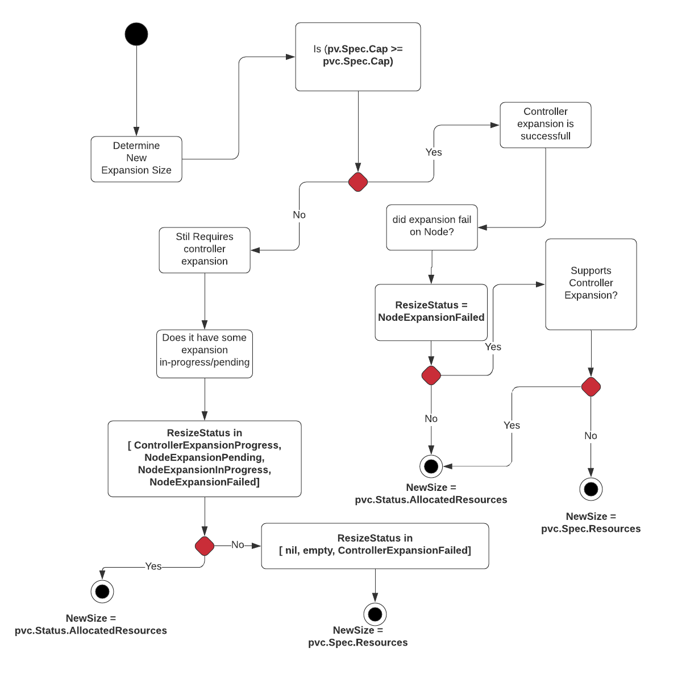

# Recovery from volume expansion failure

## Table of Contents

<!-- toc -->
- [Release Signoff Checklist](#release-signoff-checklist)
- [Summary](#summary)
- [Motivation](#motivation)
  - [Goals](#goals)
  - [Non-Goals](#non-goals)
- [Proposal](#proposal)
  - [Implementation](#implementation)
    - [User flow stories](#user-flow-stories)
      - [Case 0 (default PVC creation):](#case-0-default-pvc-creation)
      - [Case 1 (controller+node expandable):](#case-1-controllernode-expandable)
      - [Case 2 (node only expandable volume):](#case-2-node-only-expandable-volume)
      - [Case 3 (Malicious user)](#case-3-malicious-user)
      - [Case 4(Malicious User and rounding to GB/GiB bounaries)](#case-4malicious-user-and-rounding-to-gbgib-bounaries)
  - [Risks and Mitigations](#risks-and-mitigations)
- [Graduation Criteria](#graduation-criteria)
  - [Test Plan](#test-plan)
  - [Monitoring](#monitoring)
- [Production Readiness Review Questionnaire](#production-readiness-review-questionnaire)
  - [Feature enablement and rollback](#feature-enablement-and-rollback)
  - [Rollout, Upgrade and Rollback Planning](#rollout-upgrade-and-rollback-planning)
  - [Monitoring requirements](#monitoring-requirements)
  - [Dependencies](#dependencies)
  - [Scalability](#scalability)
  - [Troubleshooting](#troubleshooting)
- [Implementation History](#implementation-history)
- [Drawbacks](#drawbacks)
- [Alternatives](#alternatives)
  - [Why not use pvc.Status.Capacity for tracking quota?](#why-not-use-pvcstatuscapacity-for-tracking-quota)
  - [Allow admins to manually fix PVCs which are stuck in resizing condition](#allow-admins-to-manually-fix-pvcs-which-are-stuck-in-resizing-condition)
  - [Solving limitation of allowing restore all the way to original size](#solving-limitation-of-allowing-restore-all-the-way-to-original-size)
- [Infrastructure Needed [optional]](#infrastructure-needed-optional)
<!-- /toc -->

## Release Signoff Checklist

- [x] (R) Enhancement issue in release milestone, which links to KEP dir in [kubernetes/enhancements] (not the initial KEP PR)
- [x] (R) KEP approvers have approved the KEP status as `implementable`
- [x] (R) Design details are appropriately documented
- [x] (R) Test plan is in place, giving consideration to SIG Architecture and SIG Testing input
- [x] (R) Graduation criteria is in place
- [ ] (R) Production readiness review completed
- [ ] Production readiness review approved
- [x] "Implementation History" section is up-to-date for milestone
- [x] User-facing documentation has been created in [kubernetes/website], for publication to [kubernetes.io]
- [ ] Supporting documentation e.g., additional design documents, links to mailing list discussions/SIG meetings, relevant PRs/issues, release notes

## Summary

A user may expand a PersistentVolumeClaim(PVC) to a size which may not be supported by
underlying storage provider. In which case - typically expansion controller forever tries to
expand the volume and keeps failing. We want to make it easier for users to recover from
expansion failures, so that user can retry volume expansion with values that may succeed.

To enable recovery, this proposal relaxes API validation for PVC objects to allow reduction in
requested size. This KEP also adds a new field called `pvc.Status.AllocatedResources` to allow resource quota
to be tracked accurately if user reduces size of their PVCs.

## Motivation

Sometimes a user may expand a PVC to a size which may not be supported by
underlying storage provider. Lets say PVC size was 10GB and user expanded
it to 500GB but underlying storage provider can not support 500GB volume
for some reason. We want to make it easier for user to retry re-sizing by
requesting more reasonable value say - 100GB.

Problem in allowing users to reduce size is - a malicious user can use
this feature to abuse the quota system. They can do so by rapidly
expanding and then shrinking the PVC. In general - both CSI
and in-tree volume plugins have been designed to never perform actual
shrink on underlying volume, but it can fool the quota system in believing
the user is using less storage than he/she actually is.

To solve this problem - we propose that although users are allowed to reduce size of their
PVC (as long as requested size > `pvc.Status.Capacity`), quota calculation
will use `max(pvc.Spec.Capacity, pvc.Status.AllocatedResources)` and reduction in `pvc.Status.AllocatedResources`
is only done by resize-controller after previously issued expansion has failed with some kind of terminal failure.

### Goals

- Allow users to cancel previously issued volume expansion requests, assuming they are not yet successful or have failed.
- Allow users to retry expansion request with smaller value than original requested size in `pvc.Spec.Resources`, assuming previous requests are not yet successful or have failed.

### Non-Goals

- As part of this KEP we do not intend to actually support shrinking of underlying volume.

## Proposal

As part of this proposal, we are mainly proposing three changes:

1. Relax API validation on PVC update so as reducing `pvc.Spec.Resoures` is allowed, as long as requested size is `>pvc.Status.Capacity`.
2. Add a new field in PVC API called - `pvc.Status.AllocatedResources` for the purpose of tracking used storage size. By default only api-server or resize-controller can set this field.
3. Add a new field in PVC API called - `pvc.Status.ResizeStatus` for purpose of tracking status of volume expansion. Following are possible values of newly introduced `ResizeStatus` field:
   - nil // General default because type is a pointer.
   - empty // When expansion is complete, the empty string is set by resize controller or kubelet.
   - ControllerExpansionInProgress // state set when external resize controller starts expanding the volune.
   - ControllerExpansionFailed // state set when expansion has failed in external resize controller with a terminal error. Transient errors don't set ControllerExpansionFailed.
   - NodeExpansionPending // state set when external resize controller has finished expanding the volume but further expansion is needed on the node.
   - NodeExpansionInProgress // state set when kubelet starts expanding the volume.
   - NodeExpansionFailed // state set when expansion has failed in kubelet with a terminal error. Transient errors don't set NodeExpansionFailed.
3. Update quota code to use `max(pvc.Spec.Resources, pvc.Status.AllocatedResources)` when evaluating usage for PVC.

### Implementation

We propose that by relaxing validation on PVC update to allow users to reduce `pvc.Spec.Resources`, it becomes possible to cancel previously issued expansion requests or retry expansion with a lower value if previous request has not been successful. In general - we know that volume plugins are designed to never perform actual shrinking of the volume, for both in-tree and CSI volumes. Moreover if a previously issued expansion has been successful and user
reduces the PVC request size, for both CSI and in-tree plugins they are designed to return a successful response with NO-OP. So, reducing requested size will be a safe operation and will never result in data loss or actual shrinking of volume.

We however do have a problem with quota calculation because if a previously issued expansion is successful but is not recorded(or partially recorded) in api-server and user reduces requested size of the PVC, then quota controller will assume it as actual shrinking of volume and reduce used storage size by the user(incorrectly). Since we know actual size of the volume only after performing expansion(either on node or controller), allowing quota to be reduced on PVC size reduction will allow an user to abuse the quota system.

To solve aforementioned problem - we propose that, a new field will be added to PVC, called `pvc.Status.AllocatedResources`. When user expands the PVC, and when expansion-controller starts volume expansion - it will set `pvc.Status.AllocatedResources` to user requested value in `pvc.Spec.Resources` before performing expansion and it will set `pvc.Status.ResizeStatus` to `ControllerExpansionInProgress`. The quota calculation will be updated to use `max(pvc.Spec.Resources, pvc.Status.AllocatedResources)` which will ensure that abusing quota will not be possible.

Resizing operation in external resize controller will always work towards full-filling size recorded in `pvc.Status.AllocatedResources` and only when previous operation has finished(i.e `pvc.Status.ResizeStatus` is nil) or when previous operation has failed with a terminal error - it will use new user requested value from `pvc.Spec.Resources`.

Kubelet on the other hand will only expand volumes for which `pvc.Status.ResizeStatus` is in `NodeExpansionPending` or `NodeExpansionInProgress` state and `pv.Spec.Cap > pvc.Status.Cap`. If a volume expansion fails in kubelet with a terminal error(which will set `NodeExpansionFailed` state) - then it must wait for resize controller in external-resizer to reconcile the state and put it back in `NodeExpansionPending`.

When user reduces `pvc.Spec.Resources`, expansion-controller will set `pvc.Status.AllocatedResources` to lower value only if one of the following is true:

1. If `pvc.Status.ResizeStatus` is `ControllerExpansionFailed` (indicating that previous expansion to last known `allocatedResources` failed with a final error) and previous control-plane has not succeeded.
2. If `pvc.Status.ResizeStatus` is `NodeExpansionFailed` and SP supports node-only expansion (indicating that previous expansion to last known `allocatedResources` failed on node with a final error).
3. If `pvc.Status.ResizeStatus` is `nil` or `empty` and previous `ControllerExpandVolume** has not succeeded.

**Note**: Whenever resize controller or kubelet modifies `pvc.Status` (such as when setting both `AllocatedResources` and `ResizeStatus`) - it is expected that all changes to `pvc.Status` are submitted as part of same patch request to avoid race conditions.

The complete expansion and recovery flow of both control-plane and kubelet is documented in attached PDF. The attached pdf - documents complete volume expansion flow via state diagrams and is much more exhaustive than the text above.

#### User flow stories

##### Case 0 (default PVC creation):
- User creates a 10Gi PVC by setting - `pvc.spec.resources.requests["storage"] = "10Gi"`.

##### Case 1 (controller+node expandable):
- User increases 10Gi PVC to 100Gi by changing - `pvc.spec.resources.requests["storage"] = "100Gi"`.
- Quota controller uses `max(pvc.Status.AllocatedResources, pvc.Spec.Resources)` and adds `90Gi` to used quota.
- Expansion controller starts expanding the volume and sets `pvc.Status.AllocatedResources` to `100Gi`.
- Expansion controller also sets `pvc.Status.ResizeStatus` to `ControllerExpansionInProgress`.
- Expansion to 100Gi fails and hence `pv.Spec.Capacity` and `pvc.Status.Capacity `stays at 10Gi.
- Expansion controller sets `pvc.Status.ResizeStatus` to `ControllerExpansionFailed`.
- User requests size to 20Gi.
- Expansion controler notices that previous expansion to last known `allocatedresources` failed, so it sets new `allocatedResources` to `20G`
- Expansion succeeds and `pvc.Status.Capacity` and `pv.Spec.Capacity` report new size as `20Gi`.
- Quota controller sees a reduction in used quota because `max(pvc.Spec.Resources, pvc.Status.AllocatedResources)` is 20Gi.

##### Case 2 (node only expandable volume):
- User increases 10Gi PVC to 100Gi by changing - `pvc.spec.resources.requests["storage"] = "100Gi"`
- Quota controller uses `max(pvc.Status.AllocatedResources, pvc.Spec.Resources)` and adds `90Gi` to used quota.
- Expansion controller starts expanding the volume and sets `pvc.Status.AllocatedResources` to `100Gi`.
- Expansion controller also sets `pvc.Status.ResizeStatus` to `ControllerExpansionInProgress`.
- Since expansion operations in control-plane are NO-OP, expansion in control-plane succeeds and `pv.Spec` is set to `100G`.
- Expansion controller also sets `pvc.Status.ResizeStatus` to `NodeExpansionPending`.
- Expansion starts on the node and kubelet sets `pvc.Status.ResizeStatus` to `NodeExpansionInProgress`.
- Expansion fails on the node with a final error.
- Kubelet sets `pvc.Status.ResizeStatus` to `NodeExpansionFailed`.
- Since pvc has `pvc.Status.ResizeStatus` set to `NodeExpansionFailed` - kubelet will stop retrying node expansion.
- At this point Kubelet will wait for `pvc.Status.ResizeStatus` to be `NodeExpansionPending`.
- User requests size to 20Gi.
- Expansion controller starts expanding the volume and sees that last expansion failed on the node and driver does not have control-plane expansion.
- Expansion controller sets `pvc.Status.AllocatedResources` to `20G`.
- Expansion controller also sets `pvc.Status.ResizeStatus` to `ControllerExpansionInProgress`.
- Since expansion operations in control-plane are NO-OP, expansion in control-plane succeeds and `pv.Spec` is set to `20G`.
- Expansion succeed on the node with latest `allocatedResources` and `pvc.Status.Size` is set to `20G`.
- Expansion controller also sets `pvc.Status.ResizeStatus` to `NodeExpansionPending`.
- Kubelet can now retry expansion and expansion on node succeeds.
- Kubelet sets `pvc.Status.ResizeStatus` to empty string and `pvc.Status.Capacity` to new value.
- Quota controller sees a reduction in used quota because `max(pvc.Spec.Resources, pvc.Status.AllocatedResources)` is 20Gi.

##### Case 3 (Malicious user)
- User increases 10Gi PVC to 100Gi by changing `pvc.spec.resources.requests["storage"] = "100Gi"`
- Quota controller uses `max(pvc.Status.AllocatedResources, pvc.Spec.Resources)` and adds `90Gi` to used quota.
- Expansion controller slowly starts expanding the volume and sets `pvc.Status.AllocatedResources` to `100Gi` (before expanding).
- Expansion controller also sets `pvc.Status.ResizeStatus` to `ControllerExpansionInProgress`.
- At this point -`pv.Spec.Capacity` and `pvc.Status.Capacity` stays at 10Gi until the resize is finished.
- While the storage backend is re-sizing the volume, user requests size 20Gi by changing `pvc.spec.resources.requests["storage"] = "20Gi"`
- Expansion controller notices that previous expansion to last known `allocatedresources` is still in-progress.
- Expansion controller keeps expanding the volume to `allocatedResources`.
- Expansion to `100G` succeeds and `pv.Spec.Capacity` and `pvc.Status.Capacity` report new size as `100G`.
- Although `pvc.Spec.Resources` reports size as `20G`, expansion to `20G` is never attempted.
- Quota controller sees no change in storage usage by the PVC because `pvc.Status.AllocatedResources` is 100Gi.

##### Case 4(Malicious User and rounding to GB/GiB bounaries)
- User requests a PVC of 10.1GB but underlying storage provides provisions a volume of 11GB after rounding.
- Size recorded in `pvc.Status.Capacity` and `pv.Spec.Capacity` is however still 10.1GB.
- User expands expands the PVC to 100GB.
- Quota controller uses `max(pvc.Status.AllocatedResources, pvc.Spec.Resources)` and adds `89.9GB` to used quota.
- Expansion controller starts expanding the volume and sets `pvc.Status.AllocatedResources` to `100GB` (before expanding).
- Expansion controller also sets `pvc.Status.ResizeStatus` to `ControllerExpansionInProgress`.
- At this point -`pv.Spec.Capacity` and `pvc.Status.Capacity` stays at 10.1GB until the resize is finished.
- while resize was in progress - expansion controler crashes and loses state.
- User reduces the size of PVC to 10.5GB.
- Expansion controller notices that previous expansion to last known `allocatedresources` is still in-progress.
- Expansion controller starts expanding the volume to last known `allocatedResources` (which is `100GB`).
- Expansion to `100G` succeeds and `pv.Spec.Capacity` and `pvc.Status.Capacity` report new size as `100G`.
- Although `pvc.Spec.Resources` reports size as `10.5GB`, expansion to `10.5GB` is never attempted.
- Quota controller sees no change in storage usage by the PVC because `pvc.Status.AllocatedResources` is 100Gi.

### Risks and Mitigations

- Once expansion is initiated, the lowering of requested size is only allowed upto a value *greater* than `pvc.Status`. It is not possible to entirely go back to previously requested size. This should not be a problem however in-practice because user can retry expansion with slightly higher value than `pvc.Status` and still recover from previously failing expansion request.

## Graduation Criteria

* *Alpha* in 1.23 behind `RecoverExpansionFailure` feature gate with set to a default of `false`.
* *Beta* in 1.24: Since this feature is part of general `ExpandPersistentVolumes` feature which is in beta, we are going to move this to beta with enhanced e2e and more stability improvements.
* *GA* in 1.26 along with `ExpandPersistentvolumes` feature. The list of issues for volume expansion going GA can be found at - https://github.com/orgs/kubernetes-csi/projects/12.

### Test Plan

* Basic unit tests for storage strategy of PVC and quota system.
* E2e tests using mock driver to cause failure on expansion and recovery.
* Also verify quota usage when this happens.

### Monitoring

* We will add events that are added to both PV and PVC objects for user reducing PVC size.

## Production Readiness Review Questionnaire

### Feature enablement and rollback

* **How can this feature be enabled / disabled in a live cluster?**
  - [x] Feature gate (also fill in values in `kep.yaml`)
    - Feature gate name: `RecoverExpansionFailure`
    - Components depending on the feature gate: kube-apiserver, kube-controller-manager, csi-external-resizer, kubelet
  - [ ] Other
    - Describe the mechanism:
    - Will enabling / disabling the feature require downtime of the control
      plane?
    - Will enabling / disabling the feature require downtime or reprovisioning
      of a node? (Do not assume `Dynamic Kubelet Config` feature is enabled).

* **Does enabling the feature change any default behavior?**
  Allow users to reduce size of pvc in `pvc.spec.resources`. In general this was not permitted before
  so it should not break any of existing automation. This means that if `pvc.Status.AllocatedResources` is available it will be
  used for calculating quota.

  One more thing to keep in mind is - enabling this feature in kubelet while keeping it disabled in external-resizer will cause
  all volume expansions operations to get stuck(similar thing will happen when feature moves to beta and kubelet is newer but external-resizer sidecar is older).
  This limitation will be documented in external-resizer.

* **Can the feature be disabled once it has been enabled (i.e. can we rollback
  the enablement)?**
  Yes the feature gate can be disabled once enabled. However quota resources present in the cluster will be based off a field(`pvc.Status.AllocatedResources`) which is no longer updated.
  Currently without this feature - quota calculation is entirely based on `pvc.Spec.Resources` and when feature is enabled it will based off `max(pvc.Spec.Resources, pvc.Status.AllocatedResources)`
  so when the feature is disabled, cluster might be reporting stale quota. To fix this issue - cluster admins can re-create `ResourceQuota` objects so as quota controller can recompute the
  quota using `pvc.Spec.Resources`.

* **What happens if we reenable the feature if it was previously rolled back?**
  It should be possible to re-enable the feature after disabling it. When feature is disabled and re-enabled, users will be able to
  reduce size of `pvc.Spec.Resources` to cancel previously issued expansion but in case `pvc.Spec.Resources` reports lower value than
  what was reported in `pvc.Status.AllocatedResources` (which would mean resize controller tried to expand this volume to bigger size previously)
  quota calculation will be based off `pvc.Status.AllocatedResources`.

* **Are there any tests for feature enablement/disablement?**
  The e2e framework does not currently support enabling and disabling feature
  gates. However, we will write extensive unit tests to test behaviour of code when feature gate is disabled and when feature gate is enabled.

### Rollout, Upgrade and Rollback Planning

_This section must be completed when targeting beta graduation to a release._

* **How can a rollout fail? Can it impact already running workloads?**
  This change should not impact existing workloads and requires user interaction via reducing pvc capacity.

* **What specific metrics should inform a rollback?**

* **Were upgrade and rollback tested? Was upgrade->downgrade->upgrade path tested?**
  Describe manual testing that was done and the outcomes.
  Longer term, we may want to require automated upgrade/rollback tests, but we
  are missing a bunch of machinery and tooling and do that now.

* **Is the rollout accompanied by any deprecations and/or removals of features,
  APIs, fields of API types, flags, etc.?**
  Even if applying deprecation policies, they may still surprise some users.

### Monitoring requirements

_This section must be completed when targeting beta graduation to a release._

* **How can an operator determine if the feature is in use by workloads?**
  Ideally, this should be a metrics. Operations against Kubernetes API (e.g.
  checking if there are objects with field X set) may be last resort. Avoid
  logs or events for this purpose.

* **What are the SLIs (Service Level Indicators) an operator can use to
  determine the health of the service?**
  - [ ] Metrics
    - Metric name:
    - [Optional] Aggregation method:
    - Components exposing the metric:
  - [ ] Other (treat as last resort)
    - Details:

* **What are the reasonable SLOs (Service Level Objectives) for the above SLIs?**
  At the high-level this usually will be in the form of "high percentile of SLI
  per day <= X". It's impossible to provide a comprehensive guidance, but at the very
  high level (they needs more precise definitions) those may be things like:
  - per-day percentage of API calls finishing with 5XX errors <= 1%
  - 99% percentile over day of absolute value from (job creation time minus expected
    job creation time) for cron job <= 10%
  - 99,9% of /health requests per day finish with 200 code

* **Are there any missing metrics that would be useful to have to improve
  observability if this feature?**
  Describe the metrics themselves and the reason they weren't added (e.g. cost,
  implementation difficulties, etc.).

### Dependencies

_This section must be completed when targeting beta graduation to a release._

* **Does this feature depend on any specific services running in the cluster?**
  Think about both cluster-level services (e.g. metrics-server) as well
  as node-level agents (e.g. specific version of CRI). Focus on external or
  optional services that are needed. For example, if this feature depends on
  a cloud provider API, or upon an external software-defined storage or network
  control plane.

  For each of the fill in the following, thinking both about running user workloads
  and creating new ones, as well as about cluster-level services (e.g. DNS):
  - [Dependency name]
    - Usage description:
      - Impact of its outage on the feature:
      - Impact of its degraded performance or high error rates on the feature:

### Scalability

_For beta, this section is required: reviewers must answer these questions._

_For GA, this section is required: approvers should be able to confirms the
previous answers based on experience in the field._

* **Will enabling / using this feature result in any new API calls?**
  None

* **Will enabling / using this feature result in introducing new API types?**
  None

* **Will enabling / using this feature result in any new calls to cloud
  provider?**
  None

* **Will enabling / using this feature result in increasing size or count
  of the existing API objects?**
  Since this feature adds a new field to PersistentVolumeClaim object it will increase size of the object.
  Describe them providing:
  - API type(s): PersistentVolumeClaim
  - Estimated increase in size: 40B

* **Will enabling / using this feature result in increasing time taken by any
  operations covered by [existing SLIs/SLOs][]?**
  Think about adding additional work or introducing new steps in between
  (e.g. need to do X to start a container), etc. Please describe the details.

* **Will enabling / using this feature result in non-negligible increase of
  resource usage (CPU, RAM, disk, IO, ...) in any components?**
  Things to keep in mind include: additional in-memory state, additional
  non-trivial computations, excessive access to disks (including increased log
  volume), significant amount of data send and/or received over network, etc.
  This through this both in small and large cases, again with respect to the
  [supported limits][].

### Troubleshooting

Troubleshooting section serves the `Playbook` role as of now. We may consider
splitting it into a dedicated `Playbook` document (potentially with some monitoring
details). For now we leave it here though.

_This section must be completed when targeting beta graduation to a release._

* **How does this feature react if the API server and/or etcd is unavailable?**

* **What are other known failure modes?**
  For each of them fill in the following information by copying the below template:
  - [Failure mode brief description]
    - Detection: How can it be detected via metrics? Stated another way:
      how can an operator troubleshoot without loogging into a master or worker node?
    - Mitigations: What can be done to stop the bleeding, especially for already
      running user workloads?
    - Diagnostics: What are the useful log messages and their required logging
      levels that could help debugging the issue?
      Not required until feature graduated to Beta.
    - Testing: Are there any tests for failure mode? If not describe why.

* **What steps should be taken if SLOs are not being met to determine the problem?**

[supported limits]: https://git.k8s.io/community//sig-scalability/configs-and-limits/thresholds.md
[existing SLIs/SLOs]: https://git.k8s.io/community/sig-scalability/slos/slos.md#kubernetes-slisslos

## Implementation History

- 2020-01-27 Initial KEP pull request submitted

## Drawbacks

- One drawback is while this KEP allows an user to reduce requested PVC size, it does not allow reduction in size all the way to same value as original size recorded in `pvc.Status.Cap`. The reason is currently resize controller and kubelet work on a volume one after the other and we need special logic in both kubelet and control-plane to process reduction in size all the way upto original value. This is somewhat racy and we need a signaling mechanism between control-plane and kubelet when `pvc.Status.AllocatedResources` needs to be adjusted. We plan to revisit and address this in next release.

## Alternatives

There were several alternatives considered before proposing this KEP.

### Why not use pvc.Status.Capacity for tracking quota?

`pvc.Status.Capacity` can't be used for tracking quota because pvc.Status.Capacity is calculated after binding happens, which could be when pod is started. This would allow an user to overcommit because quota won't reflect accurate value until PVC is bound to a PV.

### Allow admins to manually fix PVCs which are stuck in resizing condition

We also considered if it is worth leaving this problem as it is and allow admins to fix it manually since the problem that this KEP fixes is not very frequent(there have not been any reports from end-users about this bug). But there are couple of problems with this:
- A workflow that depends on restarting the pods after resizing is successful - can't complete if resizing is forever stuck. This is the case with current design of statefulset expansion KEP.
- If a storage type only supports node expansion and it keeps failing then PVC could become unusable and prevent its usage.

### Solving limitation of allowing restore all the way to original size

As mentioned above - one limitation of this KEP is, users can only recover upto a size greater than previous value recorded in `pvc.Status.Cap`.

## Infrastructure Needed [optional]
