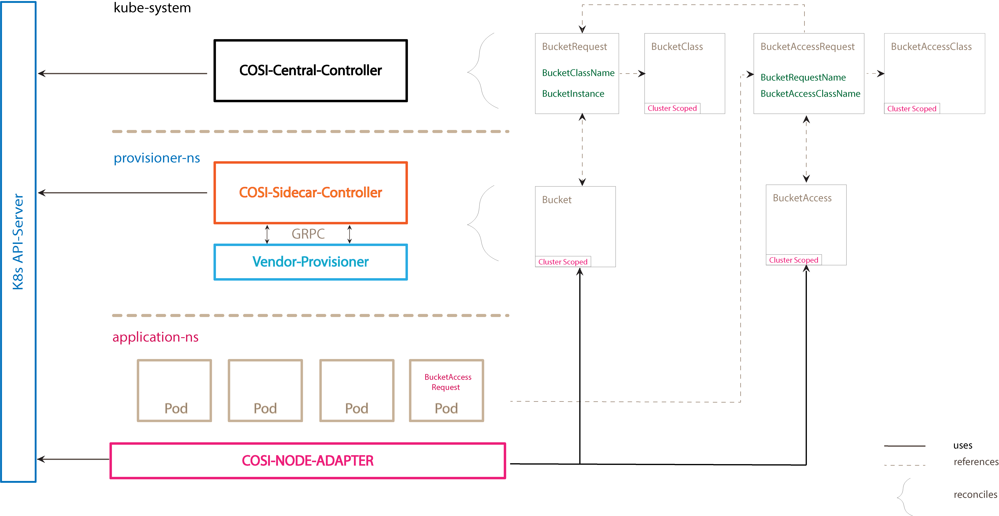
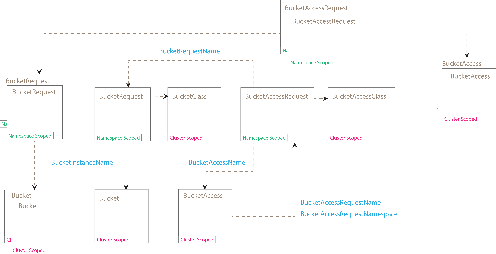
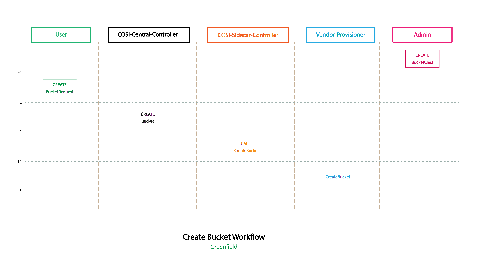
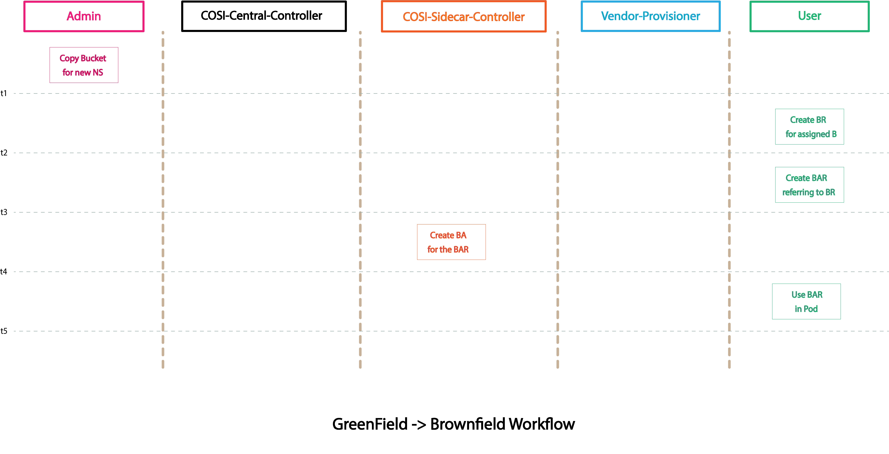
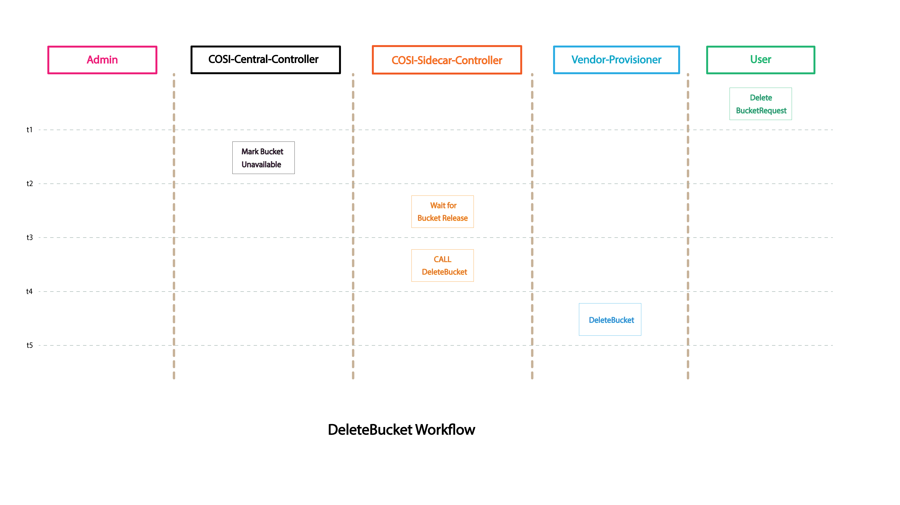

# Object Storage Support

## Table of Contents

<!-- toc -->
- [Object Storage Support](#object-storage-support)
  - [Table of Contents](#table-of-contents)
- [Release Signoff Checklist](#release-signoff-checklist)
- [Summary](#summary)
- [Motivation](#motivation)
  - [User Stories](#user-stories)
    - [Admin](#admin)
    - [User](#user)
  - [Goals](#goals)
  - [Non-Goals](#non-goals)
- [Vocabulary](#vocabulary)
- [Proposal](#proposal)
  - [APIs](#apis)
    - [Storage APIs](#storage-apis)
      - [BucketRequest](#bucketrequest)
      - [Bucket](#bucket)
      - [BucketClass](#bucketclass)
    - [Access APIs](#access-apis)
      - [BucketAccessRequest](#bucketaccessrequest)
      - [BucketAccess](#bucketaccess)
      - [BucketAccessClass](#bucketaccessclass)
    - [App Pod](#app-pod)
    - [Topology](#topology)
- [Object Relationships](#object-relationships)
- [Workflows](#workflows)
  - [Create Bucket](#create-bucket)
  - [Sharing COSI Created Buckets](#sharing-cosi-created-buckets)
  - [Delete Bucket](#delete-bucket)
  - [Grant Bucket Access](#grant-bucket-access)
  - [Revoke Bucket Access](#revoke-bucket-access)
  - [Delete BucketAccess](#delete-bucketaccess)
  - [Setting Access Permissions](#setting-access-permissions)
    - [Dynamic Provisioning](#dynamic-provisioning)
    - [Static Provisioning](#static-provisioning)
- [gRPC Definitions](#grpc-definitions)
  - [ProvisionerGetInfo](#provisionergetinfo)
  - [ProvisonerCreateBucket](#provisonercreatebucket)
  - [ProvisonerDeleteBucket](#provisonerdeletebucket)
  - [ProvisionerGrantBucketAccess](#provisionergrantbucketaccess)
  - [ProvisionerRevokeBucketAccess](#provisionerrevokebucketaccess)
- [Test Plan](#test-plan)
- [Graduation Criteria](#graduation-criteria)
  - [Alpha](#alpha)
- [Alternatives Considered](#alternatives-considered)
  - [Add Bucket Instance Name to BucketAccessClass (brownfield)](#add-bucket-instance-name-to-bucketaccessclass-brownfield)
    - [Motivation](#motivation-1)
    - [Problems](#problems)
<!-- /toc -->

# Release Signoff Checklist

- [X] (R) Enhancement issue in release milestone, which links to KEP dir in [kubernetes/enhancements] (not the initial KEP PR)
- [ ] (R) KEP approvers have approved the KEP status as `implementable`
- [ ] (R) Design details are appropriately documented
- [ ] (R) Test plan is in place, giving consideration to SIG Architecture and SIG Testing input
- [ ] (R) Graduation criteria is in place
- [ ] (R) Production readiness review completed
- [ ] Production readiness review approved
- [ ] "Implementation History" section is up-to-date for milestone
- [ ] User-facing documentation has been created in [kubernetes/website], for publication to [kubernetes.io]
- [ ] Supporting documentation e.g., additional design documents, links to mailing list discussions/SIG meetings, relevant PRs/issues, release notes

[kubernetes.io]: https://kubernetes.io/
[kubernetes/enhancements]: https://git.k8s.io/enhancements
[kubernetes/kubernetes]: https://git.k8s.io/kubernetes
[kubernetes/website]: https://git.k8s.io/website


# Summary

This proposal introduces the *Container Object Storage Interface* (COSI), a system composed of Custom Resources (CRs), APIs for bucket provisioning and access, a controller automation architecture, a gRPC specification, and "COSI node adapter" that interfaces with the kubelet on each node. These components combine to support a standard object storage representation in Kubernetes.  

This KEP describes the above components, defines our goals and target use-cases, and sets the scope of the proposal by defining higher level objectives.  The vocabulary section defines terminology.  Relationships between the APIs are provided to illustrate the interconnections between object storage APIs, users' workloads, and object store service instances.  Lastly, the document describes the proposed API specs, the create and delete workflows, and the gRPC spec.

# Motivation

File and block are first class citizens within the Kubernetes ecosystem.  Object, though very different under the hood, is a popular means of storing data, especially against very large data sources.   As such, we feel it is in the interest of the community to integrate object storage into Kubernetes, supported by the SIG-Storage community.  In doing so, we can provide Kubernetes cluster users and administrators a normalized and familiar means of managing object storage. 
When a workload (app pod, deployment, configs) is moved to another cluster, as long as the new cluster runs a COSI controller that supports the same object protocol, then the workload can be moved to a new cluster without requiring any changes in the user manifests.

## User Stories

### Admin

- As a cluster administrator, I can control access to new and existing buckets when accessed from the cluster, regardless of the backing object store.

### User

- As a developer, I can define my object storage needs in the same manifest as my workload, so that deployments are streamlined and encapsulated within the Kubernetes interface.
- As a developer, I can define a manifest containing my workload and object storage configuration once, so that my app may be ported between clusters as long as the storage provided supports my designated data path protocol.
- As a developer, I want to create a workload controller which is bucket API aware, so that it can dynamically connect workloads to underlying object storage.

## Goals

+ Specify object storage Kubernetes APIs for the purpose of orchestrating/managing object store operations.
+ Implement a Kubernetes controller automation design with support for pluggable provisioners.
+ Support workload portability across clusters.
+ As MVP, be accessible to the largest groups of consumers by supporting the major object storage protocols (S3, Google Cloud Storage, Azure Blob) while being extensible for future protocol additions..
+ Present similar workflows for both greenfield and brownfield bucket operations.

## Non-Goals

+ Defining the _data-plane_ object store protocol to replace or supplement existing vendor protcols/APIs is not within scope.
+ Object store deployment/management is left up to individual vendors.
+ Bucket access lifecycle management is not within the scope of this KEP.  ACLs, access policies, and credentialing need to be handled out-of-band.

# Vocabulary

+ _backend bucket_ - any bucket provided by the object store system, completely separate from Kubernetes.
+ _brownfield bucket_ - an existing backend bucket.
+ _Bucket (Bucket Instance)_ - a cluster-scoped custom resource referenced by a `BucketRequest` and containing connection information and metadata for a backend bucket.
+ _BucketAccess (BA)_ - a cluster-scoped custom resource for granting bucket access.
+ _BucketAccessClass (BAC)_ - a cluster-scoped custom resource containing fields defining the provisioner and a ConfigMap reference where policy is defined.
+ _BucketAccessRequest (BAR)_ - a user-namespaced custom resource representing a request for access to an existing bucket.
+ _BucketClass (BC)_ - a cluster-scoped custom resource containing fields defining the provisioner and an immutable parameter set for creating new buckets.
+ _BucketRequest (BR)_ - a user-namespaced custom resource representing a request for a new backend bucket, or access to an existing bucket.
+ _COSI_ - Container _Object_ Store Interface, modeled after CSI.
+ _cosi-node-adapter_ - a pod per node which receives Kubelet gRPC _NodeStageVolume_ and _NodeUnstageVolume_ requests, ensures the target bucket has been provisioned, and notifies the kubelet when the pod can be run.
+ _driver_ - a container (usually paired with a sidecar container) that is responsible for communicating with the underlying object store to create, delete, grant access to, and revoke access from buckets. Drivers talk gRPC and need no knowledge of Kubernetes. Drivers are typically written by storage vendors, and should not be given any access outside of their namespace.
+ _driverless_ - a use-case where no driver exists to support the backend object store. Some COSI automation may still be provided, but backend operations such as creating a bucket or minting credentials will not occur.
+ _greenfield bucket_ - a new backend bucket created by COSI.
+ _green-to-brownfield_ - a use-case where COSI creates a new bucket on behalf of a user, and then supports ways for other users in the cluster to share this bucket.
+ _provisioner_ - a generic term meant to describe the combination of a sidecar and driver. "Provisioning" a bucket can mean creating a new bucket or granting access to an existing bucket.
+ _sidecar_ - a Kubernetes-aware container (usually paired with a driver) that is responsible for fullfilling COSI requests with the driver via gRPC calls. The sidecar's access can be restricted to the namespace where it resides, which is expected to be the same namespace as the provisioner. The COSI sidecar is provided by the Kubernetes community.
+ _static provisioning_ - custom resource creation is done by the admin rather than via COSI automation. This may also include _driverless_ but they are independent.

# Proposal

## APIs

### Storage APIs

#### BucketRequest

A user facing, namespaced custom resource requesting provisioning of a new bucket, or requesting access to an existing bucket. A `BucketRequest` (BR) lives in the app's namespace.  In addition to a `BucketRequest`, a [BucketAccessRequest](#bucketaccessrequest) is necessary in order to grant credentials to access the bucket. BRs are required for both greenfield and brownfield uses.

There is a 1:1 mapping of a `BucketRequest` and the cluster scoped `Bucket` instance, meaning there is a single `Bucket` instance for every BR.

```yaml
apiVersion: cosi.io/v1alpha1
kind: BucketRequest
metadata:
  name:
  namespace:
  labels:
    - cosi.io/provisioner: [1]
  finalizers:
    - cosi.io/finalizer [2]
spec:
  protocol:
    name: [3]
    version: [4]
  bucketPrefix: [5]
  bucketClassName: [6]
  bucketInstanceName: [7]
status:
  bucketAvailable: [8]
```

1. `labels`: added by COSI.  Key’s value should be the provisioner name. Characters that do not adhere to [Kubernetes label conventions](https://kubernetes.io/docs/concepts/overview/working-with-objects/labels/#syntax-and-character-set) will be converted to ‘-’.
1. `finalizers`: added by COSI to defer `BucketRequest` deletion until backend deletion succeeds.
1. `protocol.name`: (required) specifies the desired protocol.  One of {“s3”, “gs”, or “azureBlob”}.
1. `protocol.version`: (optional) specifies the desired version of the `protocol`. For "s3", a value of "v2" or "v4" could be used. 
1. `bucketPrefix`: (optional for greenfield, ignored for brownfield) prefix prepended to a generated new bucket name, eg. “yosemite-photos-". If `bucketInstanceName` is supplied then `bucketPrefix` is ignored because the request is for access to an existing bucket.
1. `bucketClassName`: (optional for greenfield, ignored for brownfield) name of the `BucketClass` used to provision this request. If omitted for a greenfield bucket request, a default bucket class matching the protocol, if available, is used. If the greenfield bucket class is missing or does not support the requested protocol, an error is logged and the request is retried (with exponential backoff). A `BucketClass` is necessary for greenfield requests since BCs support a list of allowed namespaces. A `BucketClass` is not needed for brownfield requests since the `Bucket` instance, created by the admin, also contains `allowedNamespaces`.
1. `bucketInstanceName`: (required for brownfield, omitted for greenfield) name of the cluster-wide `Bucket` instance. If blank, then COSI assumes this is a greenfield request and will fill in the name during the binding step. If set by the user, then this names the `Bucket` instance created by the admin.
1. `bucketAvailable`: if true the bucket has been provisioned. If false then the bucket has not been provisioned and is unable to be accessed.

#### Bucket

A cluster-scoped custom resource representing the abstraction of a single backend bucket. A `Bucket` instance stores enough identifying information so that drivers can accurately target the backend object store (e.g. needed during a deletion process).  The relevant bucket class fields are copied to the `Bucket`. This is done so that the `Bucket` instance reflects the `BucketClass` at the time of `Bucket` creation. This is needed to handle cases where the BC is either deleted or re-created. Additionally, data returned by the driver is copied to the `Bucket` by the sidecar.

For greenfield, COSI creates the `Bucket` based on values in the `BucketRequest` and `BucketClass`. For brownfield, an admin manually creates the `Bucket`, filling in BucketClass fields, such as `allowedNamespaces`. COSI populates fields returned by the provisioner, and binds the `Bucket` to the `BucketAccess`.

Since there is a 1:1 mapping between a BR and a `Bucket`, when multiple BRs request access to the same backend bucket, each separate `Bucket` points to the same backend bucket.

```yaml
apiVersion: cosi.io/v1alpha1
kind: Bucket
metadata:
  name: [1]
  labels: [2]
    cosi.io/provisioner:
    cosi.io/bucket-prefix:
  finalizers:
    - cosi.io/finalizer [3]
spec:
  provisioner: [4]
  retentionPolicy: [5]
  anonymousAccessMode: [6]
  bucketClassName: [7]
  bucketRequest: [8]
  allowedNamespaces: [9]
    - name:
  protocol: [10]
    name:
    version:
    bucketName:
    endpoint:
    parameters:
  parameters: [11]
status:
  bucketAvailable: [12]
```

1. `name`: when created by COSI, the `Bucket` name is generated in this format: _"br-"+uuid_. If an admin creates a `Bucket`, as is necessary for brownfield access, they can use any name. The uuid is unique within a cluster.
1. `labels`: added by COSI. The "cosi.io/provisioner" key's value is the provisioner name. The "cosi.io/bucket-prefix" key's value is the `BucketRequest.bucketPrefix` value when specified. Characters that do not adhere to [Kubernetes label conventions](https://kubernetes.io/docs/concepts/overview/working-with-objects/labels/#syntax-and-character-set) will be converted to ‘-’.
1. `finalizers`: added by COSI to defer `Bucket` deletion until backend deletion ops succeed. Implementation may add one finalizer for the BR and one for the BA.
1. `provisioner`: (optional) The provisioner field as defined in the `BucketClass`. If empty then there is no driver/sidecar, thus the admin had to create the `Bucket` and `BucketAccess` instances.
1. `retentionPolicy`: Prescribes the outcome when the `BucketRequest` is deleted.
   - _Retain_: (default) the `Bucket` and its data are preserved. The `Bucket` can potentially be reused.
   - _Delete_: the bucket and its contents are expected to be deleted by the backend store.
A `Bucket` is not deleted if it is bound to a `BucketRequest`.
1. `anonymousAccessMode`: a string specifying *uncredentialed* access to the Bucket.  This is applicable to cases where the bucket objects are intended to be publicly readable and/or writable. One of:
   - "private": Default, disallow uncredentialed access to the backend storage.
   - "publicReadOnly": Read only, uncredentialed users can call ListBucket and GetObject.
   - "publicWriteOnly": Write only, uncredentialed users can only call PutObject.
   - "publicReadWrite": Read/Write, same as `ro` with the addition of PutObject being allowed.
   > Note: `anonymousAccessMode` is intended for workloads to consume the bucket out of band, i.e. COSI does not provide a automated mechanism for a k8s workload to consume the bucket anonymously
1. `bucketClassName`: (set by COSI for greenfield, and ignored for brownfield) Name of the associated bucket class.
1. `bucketRequest`: (set by COSI for greenfield, and ignored for brownfield) an `objectReference` containing the name, namespace and UID of the associated `BucketRequest`.
1. `allowedNamespaces`: a list of namespaces that are permitted to either create new buckets or to access existing buckets.
1. `protocol`: protocol-specific field the application will use to access the backend storage.
     - `name`: supported protocols are: "s3", "gs", and "azureBlob".
     - `version`: protocol version being used by the backend storage.
     - `bucketName`: the name of the bucket created by the backend storage.
     - `endpoint`: the url to the bucket endpoint.
     - `parameters`: a map of string:string copied from the BucketClass parameters.
1. `parameters`: a map of string:string copy of the BucketRequest fields related to bucket naming.
1. `bucketAvailable`: if true the bucket has been provisioned. If false then the bucket has not been provisioned and is unable to be accessed.

#### BucketClass

An immutable, cluster-scoped, custom resource to provide admins control over the handling of bucket provisioning.  The `BucketClass` (BC) defines a retention policy, driver specific parameters, and the provisioner name. A list of allowed namespaces can be specified to restrict new bucket creation and access to existing buckets. A default bucket class can be defined for each supported protocol. This allows the bucket class to be omitted from a `BucketRequest`. Relevant `BucketClass` fields are copied to the `Bucket` instance to handle the case of the BC being deleted or re-created.  If an object store supports more than one protocol then the admin should create a `BucketClass` per protocol.

NOTE: the `BucketClass` object is immutable except for the field `isDefaultBucketClass`

```yaml
apiVersion: cosi.io/v1alpha1
kind: BucketClass
metadata:
  name:
provisioner: [1]
isDefaultBucketClass: [2]
protocol:
  name: [3]
  version: [4]
anonymousAccessMode: [5]
retentionPolicy: {"Delete", "Retain"} [6]
allowedNamespaces: [7]
  - name:
parameters: [8]
```

1. `provisioner`: (required) the name of the vendor-specific driver supporting the `protocol`.
1. `isDefaultBucketClass`: (optional) boolean, default is false. If set to true then a `BucketRequest` may omit the `BucketClass` reference. If a greenfield `BucketRequest` omits the `BucketClass` and a default `BucketClass`'s protocol matches the `BucketRequest`'s protocol then the default bucket class is used; otherwise an error is logged. It is not possible for more than one default `BucketClass` of the same protocol to exist due to an admission controller which enforces the default rule.
1. `protocol.name`: (required) specifies the desired protocol.  One of {“s3”, “gs”, or “azureBlob”}.
1. `protocol.version`: (optional) specifies the desired version of the `protocol`. For "s3", a value of "v2" or "v4" could be used. 
1. `anonymousAccessMode`: (optional) a string specifying *uncredentialed* access to the backend bucket.  This is applicable for cases where the backend storage is intended to be publicly readable and/or writable. One of:
   - "private": Default, disallow uncredentialed access to the backend storage.
   - "publicReadOnly": Read only, uncredentialed users can call ListBucket and GetObject.
   - "publicWriteOnly": Write only, uncredentialed users can only call PutObject.
   - "publicReadWrite": Read/Write, same as `ro` with the addition of PutObject being allowed.
1. `retentionPolicy`: defines bucket retention for greenfield `BucketRequest`.
   - _Retain_: (default) the `Bucket` instance and the backend bucket are preserved. The `Bucket` may potentially be reused.
   - _Delete_: the backend bucket and the `Bucket` instance are deleted.
1. `allowedNamespaces`: a list of namespaces that are permitted to either create new buckets or to access existing buckets. This list is static for the life of the `BucketClass`, but the `Bucket` instance's list of allowed namespaces can be mutated by the admin.
1. `parameters`: (optional) a map of string:string key values.  Allows admins to set provisioner key-values.

### Access APIs

The Access APIs abstract the backend policy system.  Access policy and user identities are an integral part of most object stores.  As such, a system must be implemented to manage both user/credential creation and the binding of those users to individual buckets via policies.  Object stores differ from file and block storage in how they manage users, with cloud providers typically integrating with an IAM platform.  This API includes support for cloud platform identity integration with Kubernetes ServiceAccounts.  On-prem solutions usually provide their own user management systems, which may look very different from each other and from IAM platforms.  We also account for third party authentication solutions that may be integrated with an on-prem service.

#### BucketAccessRequest

A user namespaced custom resource representing an object store user and an access policy defining the user’s relation to that storage.  A user creates a `BucketAccessRequest` (BAR) in the app's namespace (which is the same namespace as the `BucketRequest`) A 'BucketAccessRequest' optionally specifies a ServiceAccount, and a config map which contains access policy.  Specifying a ServiceAccount supports provisioners that implement cloud provider identity integration with their respective Kubernetes offerings.

```yaml
apiVersion: cosi.io/v1alpha1
kind: BucketAccessRequest
metadata:
  name:
  namespace:
  labels:
    cosi.io/provisioner: [1]
  finalizers:
  - cosi.io/finalizer [2]
spec:
  serviceAccountName: [3]
  bucketRequestName: [4]
  bucketAccessClassName: [5]
  bucketAccessName: [6]
status:
  accessGranted: [7]
```

1. `labels`: added by COSI.  Key’s value should be the provisioner name. Characters that do not adhere to [Kubernetes label conventions](https://kubernetes.io/docs/concepts/overview/working-with-objects/labels/#syntax-and-character-set) will be converted to ‘-’.
1. `finalizers`: added by COSI to defer `BucketAccessRequest` deletion until backend deletion ops succeed.
1. `serviceAccountName`: (optional) the name of a Kubernetes ServiceAccount, in the same namespace, which is expected to be linked to an identity in the cloud provider, such that a pod using the ServiceAccount is authenticated as the linked identity. In this case, COSI applies the policy defined in the `BAC.policyActionsConfigMap` to the identity. If `serviceAccountName` is omitted, a "minted" user is generated by the driver and stored as `BucketAccess.principal`.
1. `bucketRequestName`: (required) the name of the `BucketRequest` associated with this access request. From the bucket request, COSI knows the `Bucket` instance and thus the backend bucket and its properties.
1. `bucketAccessClassName`: (required) name of the `BucketAccessClass` specifying the desired set of policy actions to be set for a user identity or ServiceAccount.
1. `bucketAccessName`: name of the bound cluster-scoped `BucketAccess` instance. Set by COSI.
1. `accessGranted`: if true access has been granted to the bucket. If false then access to the bucket has not been granted.

#### BucketAccess

A cluster-scoped administrative custom resource which encapsulates fields from the `BucketAccessRequest` (BAR) and the `BucketAccessClass` (BAC).  The purpose of the `BucketAccess` (BA) is to serve as an access communication path between provisioners and the central COSI controller.  The COSI controller creates a `BucketAccess` instance for a new `BucketAccessRequest`, and there is a 1:1 mapping between `BucketAccess` and `BucketAccessRequest`.

```yaml
apiVersion: cosi.io/v1alpha1
kind: BucketAccess
metadata: 
  name: [1]
  labels:
    cosi.io/provisioner: [2]
  finalizers:
  - cosi.io/finalizer [3]
 spec:
  provisioner: [4]
  bucketInstanceName: [5]
  bucketAccessRequest: [6]
  serviceAccount: [7]
  mintedSecretName: [8]
  policyActionsConfigMapData: [9]
  principal: [10]
  parameters: [11]
 status:
   accessGranted: [12]
```

1. `name`: when created by COSI, the `BucketAccess` name is generated in this format: _"ba-"+uuid_. If an admin creates a `BucketAccess`, as is necessary for driverless access, they can use any name. The uuid is unique within a cluster.
1. `labels`: added COSI.  Key’s value should be the provisioner name. Characters that do not adhere to [Kubernetes label conventions](https://kubernetes.io/docs/concepts/overview/working-with-objects/labels/#syntax-and-character-set) will be converted to ‘-’.
1. `finalizers`: added by COSI to defer `BucketAccess` deletion until the pod that uses this access terminates, and the related `BucketAccessRequest` is deleted.
1. `provisioner`: (optional) The provisioner field as defined in the `BucketAccessClass`. If empty then there is no driver/sidecar, thus the admin had to create the `Bucket` and `BucketAccess` instances.
1. `bucketInstanceName`:  name of the `Bucket` instance bound to this BA.
1. `bucketAccessRequest`: an `objectReference` containing the name, namespace and UID of the associated `BucketAccessRequest`.
1. `serviceAccount`: an `ObjectReference` containing the name, namespace and UID of the associated `BAR.serviceAccountName`. If empty then integrated Kubernetes -> cloud identity is not being used, in which case, `BucketAccess.principal` contains the user identity, which is minted by the provisioner.
1. `mintedSecretName`: (omitted if serviceAccount is specified) name of the provisioner-generated Secret containing access credentials. This Secret exists in the provisioner’s namespace, is read by the cosi-node-adapter, and written to the secret mount defined in the app pod's csi-driver spec.
1. `policyActionsConfigMapData`: encoded data, known to the driver, and defined by the admin when creating a `BucketAccessClass`. Contains a set of provisioner/platform defined policy actions to a given user identity. Contents of the ConfigMap that the *policyActionsConfigMap* field in the `BucketAccessClass` refers to. A sample value of this field could look like:
```
   {“Effect”:“Allow”,“Action”:“s3:PutObject”,“Resource”:“arn:aws:s3:::profilepics/*“},
   {“Effect”:“Allow”,“Action”:“s3:GetObject”,“Resource”:“arn:aws:s3:::profilepics/*“},
   {“Effect”:“Deny”,“Action”:“s3:*“,”NotResource”:“arn:aws:s3:::profilepics/*“}
```
1. `principal`: username/access-key for the object storage provider to uniquely identify the user who has access to this bucket. This value is minted by the provisioner (and set in the BA) when the `BucketAccessRequest` omits a ServiceAccount. There are several use cases involving `principal`: 
   - Not relevant if serviceAccount is supplied.
   - For brownfield cases when there is already a storage-side principal that you want to use for access, the admin can supply this, the driver will (possibly) enable access for that principal to the bucket in question and will return credentials.
   - For greenfield cases, this could be populated by the driver. Maybe so that the driver can request deletion of this principal during deprovisioning
1. `parameters`:  A map of string:string key values.  Allows admins to control user and access provisioning by setting provisioner key-values. Copied from `BucketAccessClass`.
1. `accessGranted`: if true access has been granted to the bucket. If false then access to the bucket has not been granted.

#### BucketAccessClass

An immutable, cluster-scoped, custom resource providing a way for admins to specify policies that may be used to access buckets. A `BucketAccessClass` (BAC) is required for both greenfield and brownfield use cases. Besides naming the provisioner, a BAC references a config map which is expected to define the access policy for a given provider. It is typical for these config maps to reside in each provisioner's namespace, though this is not required.  Unlike BucketClasses, there is no default BAC.

```yaml
apiVersion: cosi.io/v1alpha1
kind: BucketAccessClass
metadata: 
  name:
provisioner: [1]
policyActionsConfigMap: [2]
  name:
  namespace:
parameters: [3]
```

1. `provisioner`: (optional) the name of the driver that `BucketAccess` instances should be managed by. If empty then there is no driver/sidecar, thus the admin had to create the `Bucket` and `BucketAccess` instances.
1. `policyActionsConfigMap`: (required) a reference to a ConfigMap that contains a set of provisioner/platform-defined policy actions for bucket access. It is seen as typical that this config map's namespace is the same as for the provisioner. In othe words, a namespace that has locked down RBAC rules or prevent modification of this config map.
1. `parameters`: (Optional)  A map of string:string key values.  Allows admins to control user and access provisioning by setting provisioner key-values. Optional reserved keys cosi.io/configMap and cosi.io/secrets are used to reference user created resources with provider specific access policies.

---

### App Pod
The application pod utilizes CSI's inline ephemeral volume support to provide the endpoint and secret credentials in an in-memory volume. This approach also, importantly, prevents the pod from launching before the bucket has been provisioned since the kubelet waits to start the pod until it has received the cosi-node-adapter's _NodeStageVolume_ response.

Here is a sample pod manifest:

```yaml
apiVersion: v1
kind: Pod
metadata:
  name: my-app-pod
  namespace: dev-ns
spec:
  serviceAccountName: [1]
  containers:
    - name: my-app
      image: ...
      volumeMounts:
        - mountPath: /cosi [2]
          name: cosi-vol
  volumes:
    - name: cosi-vol
      csi: [3]
        driver: cosi.sigs.k8s.io [4]
        volumeAttributes: [5]
          bucketAccessRequestName: <my-bar-name>
```
1. the service account may be needed depending on cloud IAM integration with kubernetes.
1. the mount path is the directory where the app will read the credentials and endpoint.
1. this is an inline CSI volume.
1. the name of the cosi-node-adapter.
1. information needed by the cosi-node-adapter to verify that the bucket has been provisioned.

The contents of the secret generated by the provisioner is expected to have the following fields in the provider specific format:

- Endpoint for the bucket. The Endpoint should encode the URL for the provider
- Access Key: Only set when serviceAccount is empty 
- Secret Key: Only set when serviceAccount is empty

### Topology



# Object Relationships

The diagram below describes the relationships between various resources in the COSI ecosystem. 



# Workflows
Here we describe the workflows used to automate provisioning of new and existing buckets, and the de-provisioning of these buckets.

When the app pod is started, the kubelet will gRPC call _NodeStageVolume_ and _NodePublishVolume_, which are received by the cosi-node-adapter. The pod waits until the adapter responds to the gRPC requests. The adapter ensures that the target bucket has been provisioned and is ready to be accessed.

When the app pod terminates, the kubelet gRPC calls _NodeUnstageVolume_ and _NodeUnpublishVolume_, which the cosi-node-adapter also receives. The adapter orchestrates tear-down of the ephemeral volume provisioned for this bucket.

General prep:
+ admin creates the needed bucket classes and bucket access classes.

Prep for brownfield:
+ admin creates `Bucket` instances representing backend buckets.

## Create Bucket



This workflow describes the automation supporting creating a new (greenfield) backend bucket. Accessing this bucket is covered in [Sharing COSI Created Buckets](#sharing-cosi-created-buckets). COSI determines that a request is for an existing bucket when `BucketRequest.bucketInstanceName` is specified.

Here is the workflow:

+ COSI central controller sees a new `BucketRequest` (BR).
+ COSI gets the `BR.BucketClass` (directly or via the matching default) and verifies that the BR's namespace is allowed.
+ If BR.bucketInstanceName is empty, COSI creates the associated `Bucket`, filling in fields from the `BucketClass` and BR. Else, we have a brownfield BR.
+ The sidecar sees the new `Bucket` and gRPC calls the driver to create a backend bucket.
+ COSI updates the BR and `Bucket` instance to reference each other.

In addition, the cosi-node-adapter sees a new app pod references a BAR:
+ cosi-node-adapter receives _NodeStageVolume_ request from kubelet.
+ adapter add a finalizer to both the BAR.BA and the BAR.BR.
+ the finalizer value is `pod.name`

## Sharing COSI Created Buckets
This is the greenfield -> brownfield access use case, where COSI has created the `Bucket` instance and the driver has provisioned a new bucket. Now, we want to share access to this bucket in other namespaces.



If the bucket sharing is all within the same namespace then each `BucketAccessRequest` (in the namespace) only needs to reference the existing BR.

Here is the workflow:

+ A `Bucket` instance created by COSI must be cloned by the admin (each `Bucket` instance needs a unique name).
+ The user creates a `BucketRequest` (BR) that specifies the `Bucket` instance name (BR.bucketInstanceName) provided by the admin.
+ The user creates a `BucketAccessRequest` (BAR) - see [grant bucket access](#grant-bucket-access) -- and the BAR references their BR.

## Delete Bucket



This workflow describes the automation designed for deleting a `Bucket` instance and optionally the related backend bucket. Revoking access to this bucket is covered in [Revoke Bucket Access](#revoke-bucket-access).

It is important to understand that when a `BucketRequest` deletion triggers the delete of the associated `Bucket` instance, the `Bucket` instance is deleted regardless of access. This means that even if a `BucketAccess` references a `Bucket`, the `Bucket is still deleted and the BA is orphaned. Additionally, even if multiple `Bucket` instances point to the same backend bucket, if the retention policy is "Delete" then the bucket is deleted and workloads may fail. Potentially, this may only apply to MVP.

A `BucketAccess` instance is deleted once the app pod terminates. In this case, the associated BAR ismodified to reflect a delete condition, but this resource is not deleted. Deleting the BAR is deferred until the app terminates, in which case the BA is deleted, finalizers removed, and the BAR is garbage collected. The admin can delete the BA directly but this is an anti-pattern and may not be supported in MVP. If a pod is using the BA, direct BA deletion waits until pod is deleted. Once the pod using the BA terminates, the BA can be deleted by deleting the BAR. 

It is up to each provisioner whether or not to physically delete bucket content. But, for idempotency, the expectation is that the backend bucket will at least be made unavailable, pending out-of-band bucket lifecycle policies.

The delete workflow is described as a synchronous, but it will likely be asynchronous to accommodate potentially long delete times when buckets contain many objects. The steps should still mostly follow what's outlined below.

Here is the workflow:

+ User deletes their `BucketRequest` (BR) which is deferred until finalizers have been removed.
+ COSI gets the `Bucket` instance from the BR and notes the retention policy.
+ If the `Bucket` instance was created by COSI then COSI deletes the `Bucket`, which sets its deleteTimestamp but does not delete it due to finalizer.
+ If the `Bucket` instance was not created by COSI then the `Bucket` is not deleted, but finalizers are removed so that the admin can manually delete it.
+ COSI unbinds the BR from the `Bucket`.
+ Sidecar sees the `Bucket` is unbound, and if the retention policy is "Delete", the gRPC calls the provisoner's _Delete_ interface. Upon successful completion, the `Bucket` is updated to Deleted.
+ If the retention policy is "Retain" then the `Bucket` remains "Released" and it can potentially be reused.
+ When COSI sees the `Bucket` is "Deleted", it removes all finalizers and the resources are garbage collected.

## Grant Bucket Access
This workflow describes the automation supporting granting access to an existing backend bucket.

Here is the workflow:

+ The admin creates a cluster-scoped `Bucket` representing the backend bucket.
+ The user creates a `BucketRequest` referencing this `Bucket` instance and COSI follows the "Create Bucket" workflow.
+ The user creates a `BucketAccessRequest` (BAR) which references their BR.
+ COSI central controller sees a new `BucketAccessRequest` (BAR) and gets the `BAR.BucketAccessClass` (BAC).
+ COSI creates the cluster-scoped `BucketAccess` (BA) filling in the field from the BAR and BAC.
+ The sidecar sees the new BA and gRPC calls the driver to grant access to the backend bucket.
+ COSI updates the BAR and BA to reference each other.
+ The cosi-node-adapter, which has been waiting for the BAR to be processed, writes access tokens to the app pod's specified mount point.

## Revoke Bucket Access
This workflow describes the automation supporting revoking access to an existing backend bucket, and the deletion of the cluster-scoped `BucketAccess` instance.

Here is the workflow:

+ COSI central controller sees the `BucketAccessRequest` (BAR) has been deleted.
+ COSI gets the `BAR.BucketAccess` (BA).
+ COSI deletes the BA, but finalizers prevent it from being garbage collected.
+ The sidecar sees the BA has been deleted and gRPC calls the driver to revoke access to the backend bucket.
+ COSI removes the BAR and BA finalizers and these instances are garbage collected.

In addition, the cosi-node-adapter sees the app pod is terminating:
+ cosi-node-adapter receives _NodeUnstageVolume_ request from kubelet.
+ adapter removes its finalizer from both the BAR.BA and the BAR.BR.

## Delete BucketAccess 
The above workflows are triggered by the user. Now we cover worflows triggerd by the admin.
The most common scenario is likely the case where tokens are compromised and the admin needs to stop their use. In this case the admin may terminate the app pod(s) and delete the `BucketAccess` instances.

Here is the workflow:

+ Admin deletes a `BucketAccess` (BA) which is deferred until the finalizer has been removed.
+ The sidecar detects the delete and calls the driver to revoke access to the backend bucket.
+ Admin deletes the app pod.
+ The cosi-node-adapter is notified (_NodeUnpublishVolume_) and removes the pod.name finalizer from the BA, and the BA is garbage collected.
+ The user BAR remains pointing to a BA that no longer exists. It is felt that COSI should not delete user-created instances.

##  Setting Access Permissions
### Dynamic Provisioning
Incoming `BucketAccessRequest`s contains a *serviceAccountName* where a cloud provider supports identity integration. The incoming `BucketAccessRequest` represents a user to access the `Bucket` and a corresponding `BucketAccess` will provide the access credentials to the workloads using *serviceAccount* or *mintedSecretName* .
When requesting access to a bucket, workloads will go through the scenarios described here:
+  New User: In this scenario, we do not have user account in the backend storage system as well as no access for this user to the `Bucket`. 
	+ Create user account in the backend storage system.
	+ add the access privileges for the user to the `Bucket`.
	+ return the credentials to the workload owning the `BucketAccessRequest`.
+  Existing User and New Bucket: In this scenario, we have the user account created in the backend storage system, but the account is not associated to the `Bucket`.
	+ add the access privileges to the `Bucket`.
	+ return the credentials to the workload owning the `BucketAccessRequest`.
+  Existing User and existing Bucket: In this scenario, the user account has access policy defined on the `Bucket`.  The existing user privileges in the backend may conflict with the privileges that the user is requesting.
	+ FAIL, if existing access policy is different from the requested policy.
	+ if the existing privileges match the requested privileges, return the credentials to the workload owning the `BucketAccessRequest`.
+ A Service Account specified and the cloud platform identity integration maps Kubernetes ServiceAccounts to the account in the backend storage system. No need to create credentials here.
	
Upon success, the `BucketAccess` instance is ready and the app workload can access backend storage.

### Static Provisioning
"Driverless" allows the existing workloads to make use of COSI without the need for vendors to create drivers. The following steps show the details of the workflow:
+ Admin creates `Bucket` instance that references an existing backend bucket.
+ User creates a `BucketRequest` (BR) that references this `Bucket`.
+ User creates `BucketAccessRequest` (BAR) that references their BR, a `BucketAccessClass`, and their secret containing access tokens.
+ COSI detects the existence of the BAR and follows the [grant access](#grant-bucket-access) steps.
+ COSI detects the existence of the BAR, BA and executes a validation process.
+ As a validation step, COSI ensures that the `BucketRequest.bucketInstanceName` matches the `BucketAccessRequest.bucketAccessName.bucketInstanceName`. In other words, the two related `Bucket` references match, meaning that the BR and BAR->BA point to the same `Bucket`.

---

# gRPC Definitions

There is one service defined by COSI - `Provisioner`. This will need to be satisfied by the vendor-provisioner in order to be COSI-compatible

```
service Provisioner {
    rpc ProvisionerGetInfo (ProvisionerGetInfoRequest) returns (ProvisionerGetInfoResponse) {}

    rpc ProvisionerCreateBucket (ProvisionerCreateBucketRequest) returns (ProvisionerCreateBucketResponse) {}
    rpc ProvisionerDeleteBucket (ProvisionerDeleteBucketRequest) returns (ProvisionerDeleteBucketResponse) {}

    rpc ProvisionerGrantBucketAccess (ProvisionerGrantBucketAccessRequest) returns (ProvisionerGrantBucketAccessResponse);
    rpc ProvisionerRevokeBucketAccess (ProvisionerRevokeBucketAccessRequest) returns (ProvisionerRevokeBucketAccessResponse);
}
```

## ProvisionerGetInfo

This call is meant to retrieve the unique provisioner Identity. This identity will have to be set in `BucketRequest.Provisioner` field in order to invoke this specific provisioner.

```
message ProvisionerGetInfoRequest {
    // Intentionally left blank
}

message ProvisionerGetInfoResponse {
  // The name MUST follow domain name notation format
  // (https://tools.ietf.org/html/rfc1035#section-2.3.1). It SHOULD
  // include the plugin's host company name and the plugin name,
  // to minimize the possibility of collisions. It MUST be 63
  // characters or less, beginning and ending with an alphanumeric
  // character ([a-z0-9A-Z]) with dashes (-), dots (.), and
  // alphanumerics between. This field is REQUIRED.
  string name = 1;
}
```

## ProvisonerCreateBucket

This call is made to create the bucket in the backend. If a bucket that matches both name and parameters already exists, then OK (success) must be returned. If a bucket by same name, but different parameters is provided, then the appropriate error code `ALREADY_EXISTS` must be returned by the provisioner. The call to *ProvisonerCreateBucket* MUST be idempotent.

```
message ProvisionerCreateBucketRequest {
    map<string,string> bucket_context = 1;

    enum AnonymousBucketAccessMode {
	PRIVATE = 0;
	PUBLIC_READ_ONLY = 1;
	PUBLIC_WRITE_ONLY = 2;
	PUBLIC_READ_WRITE = 3;
    }

    AnonymousBucketAccessMode anonymous_bucket_access_mode = 2;
}

message ProvisionerCreateBucketResponse {
    // This field is REQUIRED
    string bucket_name = 1;

    // This field is OPTIONAL
    string bucket_endpoint = 2;

    map<string,string> protocol_parameters = 3;
}
```

## ProvisonerDeleteBucket

This call is made to delete the bucket in the backend. If the bucket has already been deleted, then no error should be returned. The call to *ProvisonerDeleteBucket* MUST be idempotent.

```
message ProvisionerDeleteBucketRequest {
    // This field is REQUIRED
    string bucket_name = 1;

    map<string,string> bucket_context = 2;
}

message ProvisionerDeleteBucketResponse {
     // Intentionally left blank
}
```

## ProvisionerGrantBucketAccess

This call grants access to a particular principal. The principal is the account for which this access should be granted. 

If the principal is set, then it should be used as the username of the created credentials or in some way should be deterministically used to generate a new credential for this request. This principal will be used as the unique identifier for deleting this access by calling ProvisionerRevokeBucketAccess

If the `principal` is empty, then a new service account should be created in the backend that satisfies the requested `access_policy`. The username/principal for this service account should be set in the `principal` field of `ProvisionerGrantBucketAccessResponse`.

```
message ProvisionerGrantBucketAccessRequest {
    // This field is REQUIRED
    string bucket_name = 1;

    map<string,string> bucket_context = 2;  

    // This field is OPTIONAL
    string principal = 3;

    // This field is REQUIRED
    string access_policy = 4;
}

message ProvisionerGrantBucketAccessResponse {
    // This is the account that is being provided access. This will
    // be required later to revoke access.
    // This field is REQUIRED.
    string principal = 1;

    map<string,string> credentials = 2;
}
```

## ProvisionerRevokeBucketAccess

This call revokes all access to a particular bucket from a principal.  

```
message ProvisionerRevokeBucketAccessRequest {
    // This field is REQUIRED
    string bucket_name = 1;

    map<string,string> bucket_context = 2;  

    // This field is REQUIRED
    string principal = 3;
}

message ProvisionerRevokeBucketAccessResponse {
    // Intentionally left blank
}
```

# Test Plan

- Unit tests will cover the functionality of the controllers.
- Unit tests will cover the new APIs.
- An end-to-end test suite will cover testing all the components together.
- Component tests will cover testing each controller in a blackbox fashion.
- Tests need to cover both correctly and incorrectly configured cases.


# Graduation Criteria

## Alpha

- API is reviewed and accepted
- Implement all COSI components to support Greenfield, Green/Brown Field, Brownfield and Static Driverless provisioning
- Evaluate gaps, update KEP and conduct reviews for all design changes 
- Develop unit test cases to demonstrate that the above mentioned use cases work correctly


# Alternatives Considered
This KEP has had a long journey and many revisions. Here we capture the main alternatives and the reasons why we decided on a different solution.

## Add Bucket Instance Name to BucketAccessClass (brownfield)

### Motivation
1. To improve workload _portability_ user namespace resources should not reference non-deterministic generated names. If a `BucketAccessRequest` (BAR) references a `Bucket` instance's name, and that name is pseudo random (eg. a UID added to the name) then the BAR, and hence the workload deployment, is not portable to another cluser.

1. If the `Bucket` instance name is in the BAC instead of the BAR then the user is not burdened with knowledge of `Bucket` names, and there is some centralized admin control over brownfield bucket access.

### Problems
1. The greenfield -> brownfield workflow is very awkward with this approach. The user creates a `BucketRequest` (BR) to provision a new bucket which they then want to access. The user creates a BAR pointing to a BAC which must contain the name of this newly created ``Bucket` instance. Since the `Bucket`'s name is non-deterministic the admin cannot create the BAC in advance. Instead, the user must ask the admin to find the new `Bucket` instance and add its name to new (or maybe existing) BAC.

1. App portability is still a concern but we believe that deterministic, unique `Bucket` and `BucketAccess` names can be generated and referenced in BRs and BARs.

1. Since, presumably, all or most BACs will be known to users, there is no real "control" offered to the admin with this approach. Instead, adding _allowedNamespaces_ or similar to the BAC may help with this.
