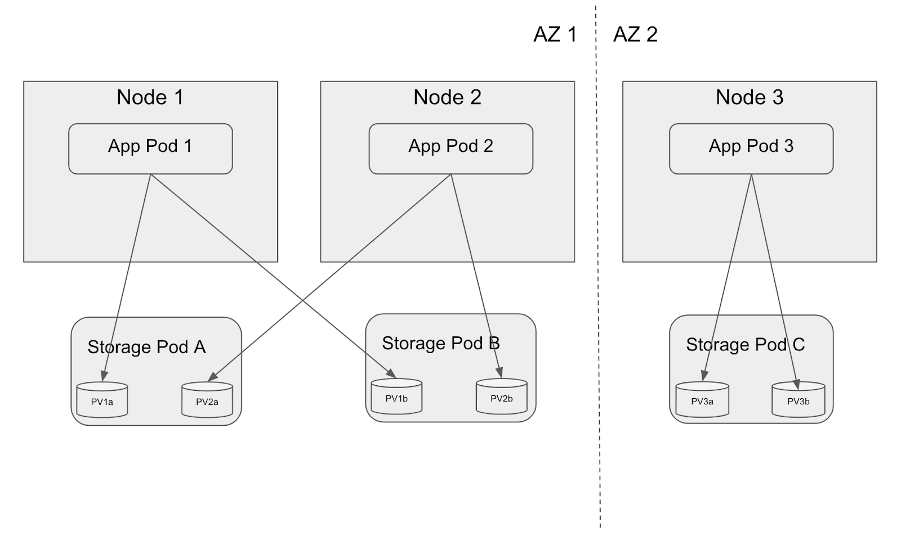

# StoragePool API for Advanced Storage Placement

## Table of Contents

<!-- toc -->
- [Summary](#summary)
- [Motivation](#motivation)
  - [Placement and Modern Scale Out Storage Services](#placement-and-modern-scale-out-storage-services)
  - [Use of Kubernetes Operators for Storage Services](#use-of-kubernetes-operators-for-storage-services)
  - [SDS Background](#sds-background)
  - [Kubernetes Background / Motivation](#kubernetes-background--motivation)
  - [Schedulers](#schedulers)
  - [Related work](#related-work)
  - [Goals](#goals)
  - [Non-Goals](#non-goals)
- [Proposal](#proposal)
  - [User Stories](#user-stories)
    - [Story 1](#story-1)
    - [Story 2](#story-2)
    - [Story 3](#story-3)
  - [Implementation Details/Notes/Constraints](#implementation-detailsnotesconstraints)
    - [New CRD to surface Placement Choices](#new-crd-to-surface-placement-choices)
    - [Add new field to PVC spec](#add-new-field-to-pvc-spec)
    - [API definitions for the Storage Pool](#api-definitions-for-the-storage-pool)
    - [CSI changes](#csi-changes)
    - [Updated logic in external-provisioner](#updated-logic-in-external-provisioner)
    - [New external controller for StoragePool](#new-external-controller-for-storagepool)
    - [Usage of StoragePool objects by application](#usage-of-storagepool-objects-by-application)
    - [Interop with StatefulSet](#interop-with-statefulset)
  - [Risks and Mitigations](#risks-and-mitigations)
- [Design Details](#design-details)
  - [Upgrade / Downgrade Strategy](#upgrade--downgrade-strategy)
  - [Version Skew Strategy](#version-skew-strategy)
- [Implementation History](#implementation-history)
- [Drawbacks [optional]](#drawbacks-optional)
- [Alternatives](#alternatives)
  - [Alternative Proposal 1 - StorageClass/Parameters](#alternative-proposal-1---storageclassparameters)
    - [Add new field to PVC spec](#add-new-field-to-pvc-spec-1)
    - [Updated logic in external-provisioner](#updated-logic-in-external-provisioner-1)
    - [Reasons against this proposal](#reasons-against-this-proposal)
  - [Alternative Proposal 2 - VolumeGroup](#alternative-proposal-2---volumegroup)
    - [API definitions](#api-definitions)
    - [Add groupInfo to CSI Spec](#add-groupinfo-to-csi-spec)
    - [A new external controller will handle VolumeGroupClass and VolumeGroup resources](#a-new-external-controller-will-handle-volumegroupclass-and-volumegroup-resources)
    - [Reasons against this proposal](#reasons-against-this-proposal-1)
  - [Alternative Proposal 3 - No CRD](#alternative-proposal-3---no-crd)
    - [Reasons against this proposal](#reasons-against-this-proposal-2)
<!-- /toc -->

<!--
## Release Signoff Checklist

**ACTION REQUIRED:** In order to merge code into a release, there must be an issue in [kubernetes/enhancements] referencing this KEP and targeting a release milestone **before [Enhancement Freeze](https://github.com/kubernetes/sig-release/tree/master/releases)
of the targeted release**.

For enhancements that make changes to code or processes/procedures in core Kubernetes i.e., [kubernetes/kubernetes], we require the following Release Signoff checklist to be completed.

Check these off as they are completed for the Release Team to track. These checklist items _must_ be updated for the enhancement to be released.

- [ ] kubernetes/enhancements issue in release milestone, which links to KEP (this should be a link to the KEP location in kubernetes/enhancements, not the initial KEP PR)
- [ ] KEP approvers have set the KEP status to `implementable`
- [ ] Design details are appropriately documented
- [ ] Test plan is in place, giving consideration to SIG Architecture and SIG Testing input
- [ ] Graduation criteria is in place
- [ ] "Implementation History" section is up-to-date for milestone
- [ ] User-facing documentation has been created in [kubernetes/website], for publication to [kubernetes.io]
- [ ] Supporting documentation e.g., additional design documents, links to mailing list discussions/SIG meetings, relevant PRs/issues, release notes

**Note:** Any PRs to move a KEP to `implementable` or significant changes once it is marked `implementable` should be approved by each of the KEP approvers. If any of those approvers is no longer appropriate than changes to that list should be approved by the remaining approvers and/or the owning SIG (or SIG-arch for cross cutting KEPs).

**Note:** This checklist is iterative and should be reviewed and updated every time this enhancement is being considered for a milestone.

[kubernetes.io]: https://kubernetes.io/
[kubernetes/enhancements]: https://github.com/kubernetes/enhancements/issues
[kubernetes/kubernetes]: https://github.com/kubernetes/kubernetes
[kubernetes/website]: https://github.com/kubernetes/website

-->

## Summary

This KEP aims to extend Kubernetes with a new storage pool concept which enables the underlying storage system to provide more control over placement decisions. These are expected to be leveraged by application operators for modern scale out storage services (e.g. MongoDB, ElasticSearch, Kafka, MySQL, PostgreSQL, Minio, etc.) in order to optimize availability, durability, performance and cost. 

The document lays out the background for why modern storage services benefit from finer control over placement, explain how SDS offers and abstracts such capabilities, and analyses the gaps in the existing Kubernetes APIs. Based on that, it derives detailed Goals and User Stories and proposes to introduce a new `StoragePool` CRD and associated plumbing for consumption by PVCs via backwards compatible CSI extensions.

## Motivation


### Placement and Modern Scale Out Storage Services

Modern scale out storage services (e.g. MongoDB, ElasticSearch, Kafka, MySQL, PostgreSQL, Minio, etc.) do their own application level mirroring and erasure coding with many benefits to that architecture. But those architectures assume they understand the failure properties of the nodes and volumes that are used, especially when failures are correlated and when not. For example, a database like Cassandra may create three copies of each piece of data, assuming that any failure will only impact one of these copies, i.e. that the failures of the data copies are uncorrelated.

There are many ways storage services achieve high data availability and durability, from basic copying/mirroring of data (strictly in sync, async with consistency, or even with loose eventual consistency) to elaborate erasure coding schemes that can tolerate multiple hosts/disks failing while still being able to recover the data, without incurring the space overhead of simple mirroring. Examples could be RAID-5 and RAID-6, but there are sophisticated encodings as well. 

In all cases, the storage service is smart about data placement, specific to its scheme of high availability and end user configuration. For example, let’s assume the scale out storage service uses a 12+4 encoding (12 data stripes, 4  parity stripes). To be able to tolerate 4 faults in this 12+4 scheme it is imperative that all 16 stripes get placed on fault isolated disks underneath. If they are not placed this way, any one device failure can impact multiple stripes unintentionally. For simplicity we will talk about bare metal setups to make it easier to relate. If we have 4 hosts with 4 disks per host, then we can place these 16 stripes, each on an independent disk. This way, 4 physical disk failures can be tolerated. On the other hand, if the 4 hosts only had 3 physical disks each, this wouldn’t work out. If however we had 16 hosts of 4 disks each, every stripe may be more fault isolated by placing it on an independent host (any one disk per host), which would let us tolerate 4 total host failures (or at least 4 disk failures). Given that each storage instance would have many such 16-way stripes, placing them across different disks of every host would also lead to a good performance and capacity balance in the system. 

These examples are meant to illustrate that the storage service needs to be aware of the topology (i.e. how many disks each host has) to optimize for availability, durability and performance. It also shows that other encodings, e.g. 10+2, or basic mirroring, or customer configuration may all change the desired placement to optimize for different properties. There is no one-size fits-all answer if optimization is the goal. It is a core area of differentiation for storage services.

### Use of Kubernetes Operators for Storage Services

The traditional way to use Kubernetes for stateful services is to use `Statefulset`, `PersistentVolumeClaim` and `StorageClass` directly. In fact, one of the key design consideratoins for `PersistentVolumeClaim` is that it should be possible to use a static `PersistentVolumeClaim` spec (or a PVC template in a `Statefulset`) and apply it on any Kubernetes cluster without modification. This requires the PVC spec to not contain any information specific to a particular CSI driver or particular Kubernetes deployment. Using these pattern, application often publish raw YAML files to be applied, or they publish Helm charts with some basic customization, while remaining mostly true to these design patterns.

However, most stateful storage services are complex. They involve a lot more application logic than can be captured in a `Statefulset` alone. This includes the data layout and placement decisions mentioned above, as well as application operations like configuring clustering, coordinating data availability (and synchronization) during rolling upgrades, turning user configuration into PVCs, reacting to failures beyond just restarting Pods, etc. To address this, the Operator Pattern has emerged, where applications introduce their own `CustomResourceDefinition` (CRD) and provide their own controller. The end user doesn't interact with `Statefulset` and `Persistent Volume Claim` and instead provides a higher level configuration via the CRD, and the controller maps that to `Statefulset`, `PersistentVolumeClaim`s as well as combines that with application logic.

Examples of operators are https://github.com/minio/minio-operator (Minio), https://github.com/zalando-incubator/es-operator (Elastic Search), https://www.elastic.co/blog/introducing-elastic-cloud-on-kubernetes-the-elasticsearch-operator-and-beyond (another Elastic Search), https://www.mongodb.com/blog/post/mongodb-enterprise-operator-for-kubernetes-now-generally-available (MongoDB), https://www.couchbase.com/products/cloud/kubernetes (Couchbase). Within the CNCF there is also https://rook.io/ which aims to provide operators for multiple storage services.

We assume that if storage services intend to optimize data placement the way we suggest in this document, they will also create an operator. We expect they will take control of creating many PVCs, customized to the available resources and topology of the environment, reacting to storage failures, etc. Hence, we believe for the use cases of this document that the design pattern that PVCs should never contain any references to specific CSI drivers or Kubernetes deployments doesn't apply. In fact, the applications (and their operators) want to not follow this pattern but rather take control of optimizing `Statefulset` and `PersistentVolumeClaim`s for the deployment at hand.

### SDS Background
The prior section assumed bare metal deployments for simplicity of discussion. In bare metal, we typically refer to physical disks as the unit of failures, and local disks are truly local and only accessible from a single host. Similarly, a PVC is basically directly a file system on such a local device.

But in most clouds, public and private, storage isn’t exposed as raw physical devices, and rather handled by a variety of different sophisticated Software Defined Storage (SDS) systems. An SDS may be hyperconverged (using local physical drives inside the server that is also running compute/Podsm, or can be external like most cloud storage services). 

SDS systems can often take per-volume policies which affect the placement of data within the SDS, giving flexibility for availability, durability, performance, and cost. The K8s concept of StorageClasses, as well as Zones and Regions try to capture these notions. Thus, SDS is a layer of abstraction with varying degree of configurability.

For this document we focus on either bare metal or SDS systems which allow storage centric applications, like the modern scale out storage systems we discussed above, to control placement to a degree that allows especially scale-out, shared nothing applications to optimize availability, durability, performance and cost beyond the basic notions of zones and regions.

### Kubernetes Background / Motivation
In terms of modelling these SDS capabilities and application placement constraints, we should abstract from physical disks to more logical concepts. This document proposes to introduce a concept called storage pools (also sometimes referred to as placement choices) that promise uncorrelated failure behavior among each other. For example, two distinct enterprise storage arrays could fit this definition. Or the physical disks in a bare metal deployment could fit it as well. Each such storage pool possibly has a maximum capacity, health, attributes (e.g. SSD vs. HDD hardware). And each such storage pool can be accessible by one or multiple K8s nodes. In turn, when placing Persistent Volume Claims (PVCs) the application should be able to choose which storage pool to provision onto.

Note that Kubernetes and CSI already support for a K8s node to announce topology information, by virtue of giving a list of Key/Value-Pairs, with Zone and Region being well-known keys. However, there is no way to announce multiple distinct storage pools that a single Node can have access to. There is also no way to express the additional metadata (e.g. capacity) for such storage pools. While StorageClasses can be used to express opaque placement parameters down to the CSI driver and SDS, they are not capable of surfacing up the available choices and their metadata.

### Schedulers
The Kubernetes scheduler has features for both compute (Pod) placement but also storage placement, by virtue of features like topology aware scheduling, zone and region support for PVCs, Storage Classes and underlying CSI. So naturally the question is how the problems and proposals laid out in this document relate to the Kubernetes scheduler. In short, this document does not propose to extend the Kubernetes scheduler and leaves that to a possible future work. 

The reason for this is that we expect the vendors of these sophisticated scale out storage services to write their own Kubernetes controllers (aka operators) if they are trying to deeply optimize for performance, availability and durability the way that was outlined above. As laid out above, each storage service is different, implements high availability differently and has its own decisions of where to place data, how to leverage the available underlying topology. As such, a generic implementation in Kubernetes is nice-to-have, but not a priority, and can hence be pursued as a separate KEP.

### Related work
In https://github.com/kubernetes/enhancements/blob/master/keps/sig-storage/20190124-local-persistent-volumes.md the case for local persistent volumes is made, e.g. the often superior performance of local devices. Aside from performance, local devices also have an aspect of expressing topology. But as outlined above, the concept is not generic enough to cover the use cases of cloud storage and modern Software Defined Storage.

There is also https://github.com/kubernetes/enhancements/pull/1127 , which in similar ways argues for compute awareness of when K8s nodes are actually co-located physically. This is required for similar reasons to optimize availability given physical failure patterns.

Finally, the entire zone and region support and topology aware scheduling in Kubernetes is related, but as outlined above doesn’t cover this use case. 

### Goals

* Allow scale out storage services (via their own controllers) to express placement constraints for their PVs/PVCs that allow them to optimize for availability and durability via smart application level data placement
* Extend CSI to allow a cluster to advertising storage placement choices / storage pools
  * Allowing to express physical disks as placement choices in CreateVolumeRequest.
  * Allowing to express bins of scale out cloud storage services as placement choices in CreateVolumeRequest.
  * Convey metadata that allows applications to make scheduling decisions:
    * Capacity
    * Which nodes have access to it
* Extend StorageClass/PV/PVC/CSI to allow topology restrictions using these placement choices
* Stay consistent with existing Zone/Region topology support in PV/PVC/CSI
* Stay consistent with existing Pod affinity/anti-affinity and topology aware scheduling of pods and PVCs
* Make no hard assumptions about how CSI providers and underlying SDS will implement the new placement options

### Non-Goals

* This KEP doesn’t intend to touch Local PVs, even though it may be possible to rephrase them using the capabilities introduced in this KEP
* This KEP doesn’t intend to touch the Kubernetes scheduler or StatefulSet controller
 
## Proposal


### User Stories

#### Story 1

Let’s assume a simple scale out storage service, e.g. an ElasticSearch cluster. The scope of the ElasticSearch cluster should be the same as the Kubernetes cluster, with 1 ElasticSearch Pod per Kubernetes Node. ElasticSearch is configured with 3-way replication and wants to use 1 PVC per Node by leveraging fast local storage offered by an SDS. The CSI driver of the SDS has exposed placement choices such that every Node by itself is a choice. The Pods are configured with Spec.NodeSelector[“kubernetes.io/hostname”] to pin them to a particular node. 

If we use a Node as a key in topology, this use case can be expressed by using existing Kubernetes mechanisms.

#### Story 2

Let’s assume a scale out storage service, e.g. a Minio Object Store cluster using Erasure Coding. The scope of the Minio cluster should be the same as the Kubernetes cluster, with 1 Minio Pod per Kubernetes Node. Minio is configured with erasure coding such that half the chunks are parity and the other half are data. Minio operates the erasure code on a per-disk basis and optimizes not just for host but also individual disk failures this way. Hence, let’s assume every Node has 4 physical drives. The SDS exposes 4 “placement choices” mapping the 4 physical disks to CSI topology choices. Minio then uses Pod affinity and Storage Class allowsTopology with the custom key com.example/disk=Disk1 for its first PVC, com.example/disk=Disk2 for its second PVC, etc., for a total of 4 PVCs matching the physical topology.

The placement choices in this use case cannot be expressed using existing Kubernetes mechanism.


Beyond the existence of the Placement Choice / Storage Pool, Minio further uses metadata to know that the storage pool has enough capacity to accommodate the desired PVC. If for example physical disks have different size, then Minio may decide to create PVCs of different sizes to still work in this scenario.

#### Story 3

Let’s assume a sharded and replicated MongoDB instance. Let’s further assume that the Cloud Storage Service used for the PVCs is comprised of 3 distinct Storage-Pods (not to be confused with K8s Pods) in both of the two available AZs, such that the 3 Storage-Pods fail independently by having dedicated power, networking, racks, hosts and disks. The CSI driver of the Cloud Storage service announces that 3 Storage-Pods per AZ as placement choices (AZ1-SP1, AZ1-SP2, AZ1-SP3, AZ2-SP1, etc.) and also advertises that all nodes in AZ1 can access all Storage-Pods in AZ1 (as a simple example). Let’s further assume MongoDB is configured for 3-way replication per shard. MongoDB decides to create 3 Pods for a given shard:
* Pod1 has an affinity to AZ1, and its PVCs have an affinity to AZ1-SP1.
* Pod2 has an affinity to AZ1, and its PVCs have an affinity to AZ1-SP2.
* Pod3 has an affinity to AZ2, and its PVCs have an affinity to AZ2-SP1.

If we compare this to the case where we can’t express the PVC affinity to the Storage-Pod, Pod1 and Pod2 may land on the same Storage-Pod and so if that Storage-Pod fails, it would take down two Pods. In the scenario described here, the math will show a higher availability and durability.

The placement choices in this use case cannot be expressed using existing Kubernetes mechanism.




### Implementation Details/Notes/Constraints

#### New CRD to surface Placement Choices
```
apiVersion: storagepool.storage.k8s.io/v1alpha1
kind: StoragePool
metadata:
  name: storagePool1
  labels:
     labelKey: labelValue
spec:
  driver: myDriver
  parameters:
     csiBackendSpecificOpaqueKey: csiBackendSpecificOpaqueValue
status:
  accessibleNodes: 
  - node1
  - node2
  capacity:
    total: 124676572
```

#### Add new field to PVC spec
```
apiVersion: v1
kind: PersistentVolumeClaim
metadata:
  name: pvc1
spec:
  accessModes:
  - ReadWriteOnce
  dataSource: null
  resources:
    requests:
      storage: 1Gi
  storageClassName: fast-storage
  volumeMode: Filesystem
  storagePoolSelector:
     labelKey: labelValue
```

#### API definitions for the Storage Pool
```
type StoragePool struct {
        metav1.TypeMeta
        // +optional
        metav1.ObjectMeta
 
        // Spec defines the desired state of a storage pool
        // +optional
        Spec StorgePoolSpec
 
        // Status represents the current information about a storage pool
        // +optional
        Status StoragePoolStatus
}
 
// StoragePoolSpec describes the attributes of a storage pool
Type StoragePoolSpec struct {
    	// Name of the driver
    	Driver string
 
    	// Opaque parameters describing attributes of the storage pool
    	+optional
    	Parameters map[string]string
}
 
type StoragePoolStatus struct {
    	// Nodes the storage pool has access to
    	+optional
  	AccessibleNodes []string
  	// Capacity of the storage pool
  	+optional
  	Capacity *PoolCapacity
  	// Last errors happened on the pool
  	+optional
  	Errors []StoragePoolError
}
 
type PoolCapacity struct {
    	// Total capacity of the storage pool
    	// +optional
    	Total *resource.Quantity
}
 
// Describes an error encountered on the pool
type StoragePoolError struct {
    	// Time is the timestamp when the error was encountered.
    	// +optional
    	Time *metav1.Time
 
    	// Message details the encountered error
    	// +optional
    	Message *string
}
```

Note that `StoragePool` are non-namespaced. 

#### CSI changes

* Add a “StoragePoolSelector map[string]string” field in CreateVolumeRequest.
* Add a ControllerListStoragePools RPC that lists storage pools for CSI drivers that support LIST_STORAGE_POOLS controller capability.

#### Updated logic in external-provisioner

Currently, the external-provisioner, when creating a volume, looks up the StorageClass of the PVC, gets the Parameters field, and passes that down to the CSI via the CreateVolumeRequest struct. This document proposes that external-provisioner also passes down the StoragePoolSelector to CreateVolumeRequest.

#### New external controller for StoragePool

CSI will be extended with a new ControllerListStoragePools() API, which returns all storage pools available via this CSI driver. A new external K8s controller uses this API upon CSI startup to learn about all storage pools and publish them into the K8s API server using the new StoragePool CRD. 

#### Usage of StoragePool objects by application
Storage applications (e.g. MongoDB, Kafka, Minio, etc.), with their own operator (i.e. controllers), consume the data in the StoragePool. It is how they understand topology. For example, let’s say we are in User Story 2, i.e. every Node has a bunch of local drives each published as a StoragePool. The operator will understand that they are “local” drives by seeing that only one K8s Node has access to each of them, and it will see how many there are and of which size. Based on the mirroring/erasure coding scheme of the specific storage service, it can now translate to how many PVCs, which size and on which of these StoragePools to create. Given that the StoragePool may model something as fragile as a single physical drive, it is a real possibility for a StoragePool to fail or be currently inaccessible. The StoragePool hence also communicates that fact, and the Storage Service operator can understand when and why volumes are failing, and how to remediate (e.g. by putting an additional PVC on another pool and moving some data around). 

#### Interop with StatefulSet
We stated that integration with the Kubernetes scheduler is a non-goal for this document. This means there are some special considerations when applications use StatefulSet to provision PVCs that use StoragePool. In particular, if the PVC references a StoragePool, the Pod should have a nodeSelector specified which matches the Nodes from which the StoragePool is accessible. That said, most likely applications that want to use StoragePool will not leverage the auto-scaling and automatic dynamic PVC creation capability of StatefulSet, but rather go for finer grained controlled from their application operator for the reasons of fine placement control discussed before.

### Risks and Mitigations

XXX

## Design Details

### Upgrade / Downgrade Strategy

XXX

### Version Skew Strategy

CSI uses a capability to maintain compatibility

## Implementation History

- Initial proposal, summary, motivation, goals, proposal published

## Drawbacks [optional]

XXX Why should this KEP _not_ be implemented.

## Alternatives 

### Alternative Proposal 1 - StorageClass/Parameters

Alternative Proposal 1 is a variant of the Proposal. It has the same StoragePool CRD, new external K8s controller and CSI extensions to populate the StoragePools, and the use of them is the same. However, instead of having PVC directly reference StoragePools (and hence external-provisioner), this alternative proposal relies on reuse of generic StorageClasses as below.

To avoid explosion of StorageClass cardinality, users are allowed to leverage multiple StorageClasses when creating PVCs. Here, the second StorageClass was created by the application by taking the Parameters field of StoragePool and creating a new StorageClass to match. Listing 2 such StorageClasses as an example (no change to StorageClass API):
```
apiVersion: storage.k8s.io/v1
kind: StorageClass
metadata:
  name: fast-tier
provisioner: example-provisioner
parameters:
   type: fast

apiVersion: storage.k8s.io/v1
kind: StorageClass
metadata:
  name: pool1
provisioner: example-provisioner
parameters:
   csiBackendSpecificOpaqueKey: csiBackendSpecificOpaqueValue
```

#### Add new field to PVC spec

This is to be able to add additional storage classes
```
apiVersion: v1
kind: PersistentVolumeClaim
metadata:
  name: pvc1
spec:
  accessModes:
  - ReadWriteOnce
  dataSource: null
  resources:
    requests:
      storage: 1Gi
  storageClassName: fast-tier
  volumeMode: Filesystem
  additionalStorageClassNames:
  - pool1
```

#### Updated logic in external-provisioner
Currently, the external-provisioner, when creating a volume, looks up the StorageClass of the PVC, gets the Parameters field, and passes that down to the CSI via the CreateVolumeRequest struct. This proposal suggests that external-provisioner also looks up the additional StorageClasses, and merges the Parameters from all the StorageClasses and send the combined map to CSI.

#### Reasons against this proposal

As CSI is already modified to surface up named storage pools, it is quite logical for selected storage pools to be pushed down on volume creation. It leads to a cleaner, more expressive design for CSI drivers. Further, this alternative proposal would require changes to the core notion of how StorageClasses work, create questions of which merge strategy to use for when multiple StorageClasses are used and have overlapping keys, etc.

### Alternative Proposal 2 - VolumeGroup

Alternative Proposal 2 introduces two new CRDs VolumeGroup and VolumeGroupClass.  It assumes that storage pools exist on storage systems already.  In VolumeGroupClass, there is an AllowedTopologies field that can be used to specify the accessibility of the group of volumes to storage pools and nodes.  However it won’t have a field to track the capacities of the storage pools.

VolumeGroup and VolumeGroupClass are already being proposed in the context of snapshots and consistency groups, see https://docs.google.com/document/d/1nmq0rjt7A45w3kRHloDsMbzwGMELaJNNw2_w1B9qirk/edit#

#### API definitions
```
type VolumeGroupClass struct {
        metav1.TypeMeta
        // +optional
        metav1.ObjectMeta
 
        // Driver is the driver expected to handle this VolumeGroupClass.
        // This value may not be empty.
        Driver string
 
        // Parameters holds parameters for driver.
        // These values are opaque to the  system and are passed directly
        // to the driver.
        // +optional
        Parameters map[string]string
 
        // Restrict the topologies where a group of volumes can be located.
        // Each driver defines its own supported topology specifications.
        // An empty TopologySelectorTerm list means there is no topology restriction.
        // This field is passed on to the drivers to handle placement of a group of 
        // volumes on storage pods.
        // +optional
        AllowedTopologies []api.TopologySelectorTerm
 
        // This field specifies whether group snapshot is consistent.
        // The default is false.
        // +optional
        ConsistentGroupSnapshot bool
 
        // In the future, we can add replication group support and introduce a field for    
        // ConsistentGroupReplication.
        // This field specifies whether group replication is consistent.
        // The default is false.
        // +optional
        ConsistentGroupReplication bool
}


// VolumeGroup is a user's request for a group of volumes
type VolumeGroup struct {
        metav1.TypeMeta
        // +optional
        metav1.ObjectMeta

        // Spec defines the volume group requested by a user
        // +optional
        Spec VolumeGroupSpec

        // Status represents the current information about a volume group
        // +optional
        Status VolumeGroupStatus
}


// VolumeGroupSpec describes the common attributes of group storage devices
// and allows a Source for provider-specific attributes
Type VolumeGroupSpec struct {
        VolumeGroupClassName *string

        // This field specifies the source of a volume group.
        // +optional
        GroupDataSource *TypedLocalObjectReference 
Note: Used for creating a volume group from a group snapshot. Not need for creating a new volume group.
  
        // A list of persistent volume claims
        // +optional
        PVCList []PersistentVolumeClaim
 }

type VolumeGroupStatus struct {
      GroupCreationTime *metav1.Time

      Ready bool
  
      // Last error encountered during group creation
      Error *VolumeGroupError
}


// Describes an error encountered on the group
type VolumeGroupError struct {
    	// time is the timestamp when the error was encountered.
    	// +optional
    	Time *metav1.Time
 
    	// message details the encountered error
    	// +optional
    	Message *string
}
```

Example yaml files are in the following:

```
apiVersion: volumegroup.storage.k8s.io/v1alpha1
kind: VolumeGroupClass
metadata:
  name: placementGroupClass1
spec:
  parameters:
     …...
  allowedTopologies: [failure-domain.example.com/placement: storagePod1]


apiVersion: volumegroup.storage.k8s.io/v1alpha1
kind: VolumeGroup
metadata:
  Name: placemenGroup1 
spec:
  volumeGroupClassName: placementGroupClass1


apiVersion: v1
kind: PersistentVolumeClaim
metadata:
  name: pvc1
  annotations:
spec:
  accessModes:
  - ReadWriteOnce
  dataSource: null
  resources:
	requests:
  	storage: 1Gi
  storageClassName: sample-hostlocal
  volumeMode: Filesystem
  volumeGroupNames: [placementGroup1]
```

#### Add groupInfo to CSI Spec
```
message CreateVolumeRequest {
    ……
    map<string,string> groupInfo
}
```
Note: More details on VolumeGroup and VolumeGroupClass related changes in CSI Spec will be added if we decide to adopt this alternative option.

#### A new external controller will handle VolumeGroupClass and VolumeGroup resources
External provisioner will be modified to read information from volume groups (through volumeGroupNames) and pass them down to the CSI driver through a new groupInfo field (alternatively we could use the existing field parameters).

In addition to placement choices, a volume group can also be used to define a consistency group.  If both placement group and consistency group are defined, it is possible for the same volume to join both groups. For example, a consistency group may include volume members from two placement groups as they belong to the same application.

```
apiVersion: volumegroup.storage.k8s.io/v1alpha1
kind: VolumeGroupClass
metadata:
  name: consistencyGroupClass1
spec:
  parameters:
     …...
  consistentGroupSnapshot: true


apiVersion: volumegroup.storage.k8s.io/v1alpha1
kind: VolumeGroup
metadata:
  Name: consistencyGroup1
spec:
  volumeGroupClassName: consistencyGroupClass1


apiVersion: v1
kind: PersistentVolumeClaim
metadata:
  name: pvc1
  annotations:
spec:
  accessModes:
  - ReadWriteOnce
  dataSource: null
  resources:
	requests:
  	storage: 1Gi
  storageClassName: sample-hostlocal
  volumeMode: Filesystem
  volumeGroupNames: [placementGroup1, consistencyGroup1]
```


#### Reasons against this proposal

In this alternative proposal we avoid a new CRD unique to this KEP, while leveraging two CRDs already proposed in the context of snapshots. It turns out though that we loose expressibility. Metadata of the StoragePool, like its capacity, can not be surfaced up. it does however allow for applications to group their volumes and express placement constraints quite nicely. It represents a nice way to group PVCs into multiple different logical groups for different use cases, a pattern we believe is valuable. But once we add the StoragePool CRD to achieve the expressability we need, the complexity of using VolumeGroups seems unreasonable and of not enough value as compared to the main proposal in this document.


### Alternative Proposal 3 - No CRD

We considered an option without a new CRD, and leveraging existing extensibility whereever possible. 

As storage pools are only meaningful throught the nodes by which they can be accessed, we can also consider publishing them and their details on Node objects. We can do such publication by leveraging existing CSI mechanism.

Lets assume we encode a StoragePool a JSON:
```
{
    “storage-pod1”: {
       “capacityTotal”: 12345,
       [...]
   }
   [...]
}
```

We can then use the `accessible_topology` field in the result of the CSI function `NodeGetInfo()`, and have the CSI plugin return VOLUME_ACCESSIBILITY_CONSTRAINTS capability:
```
accessible_topology = {‘’failure-domain.beta.vmware.com/placement-choices’’ : PLACEMENTCHOICES}
```

The label will be auto-added in K8s:
```
apiVersion: v1
kind: Node
metadata:
  labels:
    failure-domain.beta.vmware.com/placement-choices: PLACEMENTCHOICES
[...]
```

If a pool is accessible from multiple nodes, they would all quote the same. The `parameters` field could be used by applications to populate `StorageClass`, or a new `storagePoolNames` fields could be added to PVCs.

#### Reasons against this proposal

We decided against this proposal because StoragePool is more of a first class entity. The same information would need to be replicated on many Nodes, e.g. in Story 3. Best case this would bloat the Nodes, cause additional API server updates, and watching controllers to reconcile without need. Worse case the information on the Nodes, even when referring to the same underlying pool, may be get out of sync and only eventual consistent. A CRD is the clean, easy to reason, reduced load, concern separating solution.