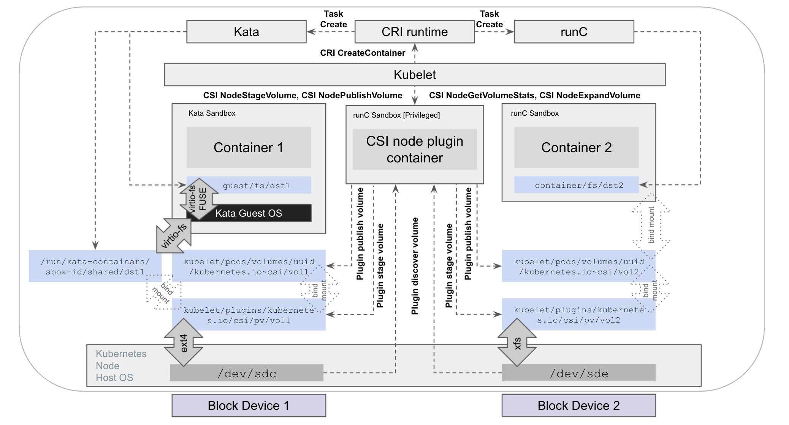
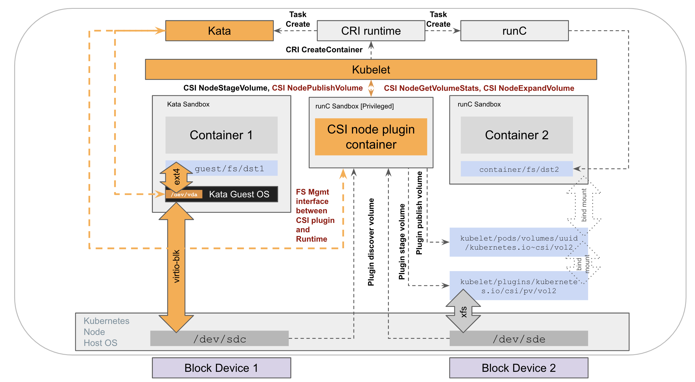

<!--
**Note:** When your KEP is complete, all of these comment blocks should be removed.

To get started with this template:

- [ ] **Pick a hosting SIG.**
  Make sure that the problem space is something the SIG is interested in taking
  up. KEPs should not be checked in without a sponsoring SIG.
- [ ] **Create an issue in kubernetes/enhancements**
  When filing an enhancement tracking issue, please make sure to complete all
  fields in that template. One of the fields asks for a link to the KEP. You
  can leave that blank until this KEP is filed, and then go back to the
  enhancement and add the link.
- [ ] **Make a copy of this template directory.**
  Copy this template into the owning SIG's directory and name it
  `NNNN-short-descriptive-title`, where `NNNN` is the issue number (with no
  leading-zero padding) assigned to your enhancement above.
- [ ] **Fill out as much of the kep.yaml file as you can.**
  At minimum, you should fill in the "Title", "Authors", "Owning-sig",
  "Status", and date-related fields.
- [ ] **Fill out this file as best you can.**
  At minimum, you should fill in the "Summary" and "Motivation" sections.
  These should be easy if you've preflighted the idea of the KEP with the
  appropriate SIG(s).
- [ ] **Create a PR for this KEP.**
  Assign it to people in the SIG who are sponsoring this process.
- [ ] **Merge early and iterate.**
  Avoid getting hung up on specific details and instead aim to get the goals of
  the KEP clarified and merged quickly. The best way to do this is to just
  start with the high-level sections and fill out details incrementally in
  subsequent PRs.

Just because a KEP is merged does not mean it is complete or approved. Any KEP
marked as `provisional` is a working document and subject to change. You can
denote sections that are under active debate as follows:

```
<<[UNRESOLVED optional short context or usernames ]>>
Stuff that is being argued.
<<[/UNRESOLVED]>>
```

When editing KEPS, aim for tightly-scoped, single-topic PRs to keep discussions
focused. If you disagree with what is already in a document, open a new PR
with suggested changes.

One KEP corresponds to one "feature" or "enhancement" for its whole lifecycle.
You do not need a new KEP to move from beta to GA, for example. If
new details emerge that belong in the KEP, edit the KEP. Once a feature has become
"implemented", major changes should get new KEPs.

The canonical place for the latest set of instructions (and the likely source
of this file) is [here](/keps/NNNN-kep-template/README.md).

**Note:** Any PRs to move a KEP to `implementable`, or significant changes once
it is marked `implementable`, must be approved by each of the KEP approvers.
If none of those approvers are still appropriate, then changes to that list
should be approved by the remaining approvers and/or the owning SIG (or
SIG Architecture for cross-cutting KEPs).
-->
# KEP-2857: Runtime Assisted Mounting of CSI Volumes

<!--
This is the title of your KEP. Keep it short, simple, and descriptive. A good
title can help communicate what the KEP is and should be considered as part of
any review.
-->

<!--
A table of contents is helpful for quickly jumping to sections of a KEP and for
highlighting any additional information provided beyond the standard KEP
template.

Ensure the TOC is wrapped with
  <code>&lt;!-- toc --&rt;&lt;!-- /toc --&rt;</code>
tags, and then generate with `hack/update-toc.sh`.
-->

<!-- toc -->
- [Release Signoff Checklist](#release-signoff-checklist)
- [Summary](#summary)
- [Terminology](#terminology)
- [Motivation](#motivation)
  - [Goals](#goals)
  - [Non-Goals](#non-goals)
  - [Solutions and Gaps Without Runtime Assisted Mounts](#solutions-and-gaps-without-runtime-assisted-mounts)
- [Proposal](#proposal)
  - [API enhancements in Pod Volume to opt-in to the feature](#api-enhancements-in-pod-volume-to-opt-in-to-the-feature)
  - [Enhancements to CSI Node APIs and CSI Node Plugins](#enhancements-to-csi-node-apis-and-csi-node-plugins)
  - [New Component: Container RUntime STorage OPerationS](#new-component-container-runtime-storage-operations)
  - [Enhancements to Kubelet](#enhancements-to-kubelet)
  - [User Stories (Optional)](#user-stories-optional)
    - [Setting DeferFSMount in PodSpec](#setting-deferfsmount-in-podspec)
    - [Coordination of FileSystem Operations between CSI Plugin and Container Runtime](#coordination-of-filesystem-operations-between-csi-plugin-and-container-runtime)
      - [Story 1: Deferring file system mount and management to the container runtime handler with all pod spec requirements met by CSI plugin and Runtime](#story-1-deferring-file-system-mount-and-management-to-the-container-runtime-handler-with-all-pod-spec-requirements-met-by-csi-plugin-and-runtime)
      - [Story 2: Fallback to file system mount and management by CSI plugin due to container runtime's inability to handle all or subset of file system operations](#story-2-fallback-to-file-system-mount-and-management-by-csi-plugin-due-to-container-runtimes-inability-to-handle-all-or-subset-of-file-system-operations)
      - [Story 3: Fallback to file system mount and management by CSI plugin due to CSI plugin's inability to defer operations to container runtime](#story-3-fallback-to-file-system-mount-and-management-by-csi-plugin-due-to-csi-plugins-inability-to-defer-operations-to-container-runtime)
      - [Story 4: Fallback to file system mount and management by CSI plugin due to CSI plugin's inability to defer operations to container runtime prior to CSI version upgrade](#story-4-fallback-to-file-system-mount-and-management-by-csi-plugin-due-to-csi-plugins-inability-to-defer-operations-to-container-runtime-prior-to-csi-version-upgrade)
      - [Story 5: Fallback to file system mount and management by CSI plugin due to CSI plugin version downgrade after pod initialization resulting in certain failures](#story-5-fallback-to-file-system-mount-and-management-by-csi-plugin-due-to-csi-plugin-version-downgrade-after-pod-initialization-resulting-in-certain-failures)
      - [Story 6: Fail pod startup due to CSI plugin version downgrade right after Kubelet began pod initialization](#story-6-fail-pod-startup-due-to-csi-plugin-version-downgrade-right-after-kubelet-began-pod-initialization)
  - [Notes/Constraints/Caveats (Optional)](#notesconstraintscaveats-optional)
  - [Risks and Mitigations](#risks-and-mitigations)
    - [Failures after CSI plugin downgrade](#failures-after-csi-plugin-downgrade)
    - [Potential data corruption for co-scheduled pods accessing the same PVC](#potential-data-corruption-for-co-scheduled-pods-accessing-the-same-pvc)
    - [Handling of NodePublish secrets](#handling-of-nodepublish-secrets)
- [Design Details](#design-details)
  - [DeferFSMount field in Pod Spec](#deferfsmount-field-in-pod-spec)
  - [CSI Capabilities and Fields](#csi-capabilities-and-fields)
  - [Container RUntime STorage Operations (crust_ops) Proxy](#container-runtime-storage-operations-crust_ops-proxy)
    - [Runtime API](#runtime-api)
    - [Overview of Interactions between CSI Plugin, crust_ops and Container Runtime](#overview-of-interactions-between-csi-plugin-crust_ops-and-container-runtime)
  - [Test Plan](#test-plan)
      - [Prerequisite testing updates](#prerequisite-testing-updates)
      - [Unit tests](#unit-tests)
      - [Integration tests](#integration-tests)
      - [e2e tests](#e2e-tests)
  - [Graduation Criteria](#graduation-criteria)
    - [Alpha](#alpha)
    - [Beta](#beta)
    - [GA](#ga)
  - [Upgrade / Downgrade Strategy](#upgrade--downgrade-strategy)
  - [Version Skew Strategy](#version-skew-strategy)
- [Production Readiness Review Questionnaire](#production-readiness-review-questionnaire)
  - [Feature Enablement and Rollback](#feature-enablement-and-rollback)
  - [Rollout, Upgrade and Rollback Planning](#rollout-upgrade-and-rollback-planning)
  - [Monitoring Requirements](#monitoring-requirements)
  - [Dependencies](#dependencies)
  - [Scalability](#scalability)
  - [Troubleshooting](#troubleshooting)
- [Implementation History](#implementation-history)
- [Drawbacks](#drawbacks)
- [Alternatives](#alternatives)
  - [Mount and Management operations on Volumes is plumbed through CRI and OCI](#mount-and-management-operations-on-volumes-is-plumbed-through-cri-and-oci)
  - [Mount and Management operations on Volumes is surfaced through a new API between Kubelet and container runtime handler](#mount-and-management-operations-on-volumes-is-surfaced-through-a-new-api-between-kubelet-and-container-runtime-handler)
- [Infrastructure Needed (Optional)](#infrastructure-needed-optional)
<!-- /toc -->

## Release Signoff Checklist

<!--
**ACTION REQUIRED:** In order to merge code into a release, there must be an
issue in [kubernetes/enhancements] referencing this KEP and targeting a release
milestone **before the [Enhancement Freeze](https://git.k8s.io/sig-release/releases)
of the targeted release**.

For enhancements that make changes to code or processes/procedures in core
Kubernetes—i.e., [kubernetes/kubernetes], we require the following Release
Signoff checklist to be completed.

Check these off as they are completed for the Release Team to track. These
checklist items _must_ be updated for the enhancement to be released.
-->

Items marked with (R) are required *prior to targeting to a milestone / release*.

- [x] (R) Enhancement issue in release milestone, which links to KEP dir in [kubernetes/enhancements] (not the initial KEP PR)
- [ ] (R) KEP approvers have approved the KEP status as `implementable`
- [ ] (R) Design details are appropriately documented
- [ ] (R) Test plan is in place, giving consideration to SIG Architecture and SIG Testing input (including test refactors)
  - [ ] e2e Tests for all Beta API Operations (endpoints)
  - [ ] (R) Ensure GA e2e tests meet requirements for [Conformance Tests](https://github.com/kubernetes/community/blob/master/contributors/devel/sig-architecture/conformance-tests.md)
  - [ ] (R) Minimum Two Week Window for GA e2e tests to prove flake free
- [ ] (R) Graduation criteria is in place
  - [ ] (R) [all GA Endpoints](https://github.com/kubernetes/community/pull/1806) must be hit by [Conformance Tests](https://github.com/kubernetes/community/blob/master/contributors/devel/sig-architecture/conformance-tests.md)
- [ ] (R) Production readiness review completed
- [ ] (R) Production readiness review approved
- [ ] "Implementation History" section is up-to-date for milestone
- [ ] User-facing documentation has been created in [kubernetes/website], for publication to [kubernetes.io]
- [ ] Supporting documentation—e.g., additional design documents, links to mailing list discussions/SIG meetings, relevant PRs/issues, release notes

<!--
**Note:** This checklist is iterative and should be reviewed and updated every time this enhancement is being considered for a milestone.
-->

[kubernetes.io]: https://kubernetes.io/
[kubernetes/enhancements]: https://git.k8s.io/enhancements
[kubernetes/kubernetes]: https://git.k8s.io/kubernetes
[kubernetes/website]: https://git.k8s.io/website

## Summary

<!--
This section is incredibly important for producing high-quality, user-focused
documentation such as release notes or a development roadmap. It should be
possible to collect this information before implementation begins, in order to
avoid requiring implementors to split their attention between writing release
notes and implementing the feature itself. KEP editors and SIG Docs
should help to ensure that the tone and content of the `Summary` section is
useful for a wide audience.

A good summary is probably at least a paragraph in length.

Both in this section and below, follow the guidelines of the [documentation
style guide]. In particular, wrap lines to a reasonable length, to make it
easier for reviewers to cite specific portions, and to minimize diff churn on
updates.

[documentation style guide]: https://github.com/kubernetes/community/blob/master/contributors/guide/style-guide.md
-->

Certain container runtime handlers (e.g. Hypervisor based runtimes like Kata)
may prefer to manage the file system mount process associated with persistent
volumes consumed by containers in a pod. Deferring the file system mount to a
container runtime handler - in coordination with a CSI plugin - is desirable in
scenarios where strong isolation between pods is critical but using Raw Block
mode and changing existing workloads to perform the filesystem mount is
burdensome. This KEP proposes a set of enhancements to enable coordination
around mounting and management of the file system on persistent volumes between
a CSI plugin and a container runtime handler.

## Terminology

The following terms are used through out the KEP. This section clarifies what
they refer to avoid verbosity.
- container runtime handler: the "low level" container runtime that a CRI
runtime like containerd or CRIO invokes. Example: runc, runsc (gVisor), kata. A
container runtime handler typically would not directly interact with the Kubelet
using CRI. Instead, they consume the OCI spec generated by a CRI runtime to
create a pod sandbox and launch containers in that sandbox.
- mounting a file system: invocation of the mount system call with a file system
type and a set of options.
- post mount configuration: in the scope of Kubernetes, this involves actions
like: application of fsGroup GID ownership on files based on
fsGroupChangePolicy, selinux relabelling and safely surfacing a subpath within
the volume to bind mount into a container.
- management of file system: in the scope of current CSI spec, this involves:
[1] retrieving filesystem stats and conditions associated with a mounted volume
and [2] online expansion of the filesystem associated with a mounted volume.
Later, as CSI evolves, this may involve other actions too (e.g. quiescing the
file system for snapshots).

## Motivation

<!--
This section is for explicitly listing the motivation, goals, and non-goals of
this KEP.  Describe why the change is important and the benefits to users. The
motivation section can optionally provide links to [experience reports] to
demonstrate the interest in a KEP within the wider Kubernetes community.

[experience reports]: https://github.com/golang/go/wiki/ExperienceReports
-->
This KEP is inspired by [recent enhancements](https://github.com/kata-containers/kata-containers/blob/main/docs/design/direct-blk-device-assignment.md)
in the Kata community to avoid mounting the file system of a PV in the host
while bringing up a pod (in a guest sandbox) that mounts the PV. The existing
approach (without any changes to Kubelet and CSI) has the following drawbacks:
- A CSI plugin has to retrieve information about a pod from the API server to
analyze certain properties of the pod: `RuntimeClassName` (to look up
annotations specified in the runtime class indicating whether/how the container
runtime handler supports deferred file system operations on volumes), `FSGroup`
and `FSGroupChangePolicy` (that the CSI plugin surfaces to the container runtime
handler [appended with file system name and mount option details] to check and
apply the desired FSGroup ownership based on the FSGroupChangePolicy setting
after mounting the file system) and presence of `Subpath`s (upon detecting which
the CSI plugin falls back to regular host based mount instead of deferring to
runtime as subpaths cannot be supported without enhancements described below).
While the pod lookup can be performed from a CSI plugin, it is typically not
recommended to adhere with the orchestrator agnostic spirit of CSI.
- The overall mechanism does not support handling of subpaths after the file
system is mounted by the container runtime handler. Due to the way subpaths are
[bindmounted](https://kubernetes.io/blog/2018/04/04/fixing-subpath-volume-vulnerability/#the-solution)
by the Kubelet on the host and then passed through CRI mount specs, it is
impossible for the container runtime handler to map the mount details back to
the backing storage on the host.

This KEP proposes a set of enhancements to overcome the above drawbacks and
enable a CSI plugin and a container runtime handler to coordinate all aspects of
mounting of file systems on PVs, application of post mount configuration and
file system management operations without requiring API Server lookups from the
CSI plugin for pod details.


### Goals

<!--
List the specific goals of the KEP. What is it trying to achieve? How will we
know that this has succeeded?
-->
- Enable a CSI plugin and a container runtime handler to coordinate publishing
of persistent volumes backed by block devices to pods by deferring the file
system mount and application of post mount configuration to the container
runtime when a pod specifically opts in a subset of it's volumes.
- Enable a CSI plugin and a container runtime handler to coordinate file system
management operations on persistent volumes (such as retrieval of file system
stats and expansion of the file system) published to a pod when a pod
specifically opts in a subset of it's volumes.
- Allow a CSI plugin to continue to perform regular file system mount and
management operations when a pod does not specify deferral of file system
operations (to the container runtime handler) for volumes mounted by the pod.
- Fail volume operations with clear errors if a pod specifies that mounting and
management of certain persistent volumes should be deferred to the container
runtime handler but the CSI plugin is not capable of coordinating the operations
with the container runtime handler.
- Avoid propagation of storage concepts and constructs to CRI, OCI spec and
CRI container runtimes like CRIO/containerd. This is purely an implementation
detail goal based on feedback from prior iterations of the KEP.
- Avoid influencing the behavior of Kubelet to a substantial degree based on
capabilities of a specific runtime or parameters in a RuntimeClass. This is
purely an implementation detail goal based on feedback from prior iterations of
the KEP.

### Non-Goals

<!--
What is out of scope for this KEP? Listing non-goals helps to focus discussion
and make progress.
-->
- Specify implementation details of a webhook, scheduler plugin or controller to
automatically determine capabilities of a CSI plugin and container runtime with
respect to handling coordination of file system operations.
- Enable a CSI node plugin to be launched within a special runtime class
(e.g. Kata). It is expected that CSI node plugin pods launch using a
“default” runtime (like runc) and is not restricted from performing privileged
operations on the host OS.
- Silently fall back (i.e. any form of graceful degradation) to CSI plugin
based node publish flow if a pod specifies deferral of mounts for a volume but
runtime assisted paths for operations around mounting and managing the file
system on a volume cannot be initiated or fail. These should be surfaced as
errors as described in goals above.

### Solutions and Gaps Without Runtime Assisted Mounts

- A pod using a microvm runtime (like Kata) can mount PVs backed by block
devices as a raw block device to ensure the file system mount is managed within
the pod sandbox environment. However this approach has the following shortcomings:
  - Every workload pod that mounts PVs backed by block devices needs to mount
  the file system (on the raw block PV). This requires modifications to the
  workload container logic. Therefore this is not a general purpose solution.
  - File system management operations like online expansion of the file system
  and reporting of FS stats cannot be performed at an infrastructural level if
  the file system mounts are managed by workload pods.
- A pod using a microvm runtime (like Kata) may use a filesystem (e.g. virtiofs)
to project the file-system on-disk (and mounted on the host) to the guest
environment (as detailed in the diagram below). While this solves several
use-cases, it is not desired due to the following factors:
  - Native file-system features: The workload may wish to use specific features
  and system calls supported by an on-disk file system (e.g. ext4/xfs) mounted
  on the host. However, plumbing some of these features/system calls/file
  controls through the intermediate “projection” file system (e.g. virtio-fs)
  and it’s dependent framework (e.g. FUSE) may require extra work and therefore
  not supported until implemented and tested. Some examples of this
  incompatibility are: [open_by_handle_at](https://gitlab.com/virtio-fs/qemu/-/issues/10), [xattr](https://gitlab.com/virtio-fs/qemu/-/issues/15), [F_SETLKW](https://gitlab.com/virtio-fs/qemu/-/issues/9) and fscrypt
  - Safety and isolation: A compromised or malicious workload may try to exploit
  vulnerabilities in the file system of persistent volumes. Due to the inherently
  complex nature of file system modules running in kernel mode, they present a
  larger surface of attack relative to simpler/lower level modules in the
  disk/block stack. Therefore, it is safer to mount the file system within an
  isolated sandbox environment (like guest VM) rather than in the host
  environment as the blast radius of a file system kernel mode panic/DoS will be
  isolated to the sandbox rather than affecting the entire host. A recent example
  of a vulnerability in virtio-fs: https://nvd.nist.gov/vuln/detail/CVE-2020-10717
  - Performance: As pointed out [here](https://archive.fosdem.org/2020/schedule/event/vai_virtio_fs/attachments/slides/3666/export/events/attachments/vai_virtio_fs/slides/3666/virtio_fs_A_Shared_File_System_for_Virtual_Machines_FOSDEM.pdf) [slide 6], in
  a microvm environment, a block interface (such as virtio-blk) provides a
  faster path to sharing data between a guest and host relative to a file-system
  interface.



## Proposal

<!--
This is where we get down to the specifics of what the proposal actually is.
This should have enough detail that reviewers can understand exactly what
you're proposing, but should not include things like API designs or
implementation. What is the desired outcome and how do we measure success?.
The "Design Details" section below is for the real
nitty-gritty.
-->

Coordination between a CSI Plugin and a container runtime handler around
mounting and management of the file system on persistent volumes can be
accomplished in various ways. This section provides an overview of the primary
enhancements detailed in this KEP. The overall mechanism relies on a new field
in the pod spec (associated with PVCs, ephemeral PVC specs and inline CSI
volumes) that specifies whether a CSI plugin should coordinate with a container
runtime handler (associated with the pod) when mounting and managing the
underlying volume. Kubelet will pass this new field to a CSI plugin when
invoking CSI APIs for a volume in the context of the pod. Various alternatives
are listed further below in the [Alternatives](#alternatives) section. Details
of the new APIs outlined below are specified in the
[DesignDetails](#design-details) section down below.



### API enhancements in Pod Volume to opt-in to the feature

A new optional boolean field: `DeferFSMount` in the
`PersistentVolumeClaimVolumeSource`, `EphemeralVolumeSource` and
`CSIVolumeSource` structs will specify whether a volume plugin should defer
mounting and management of the file system in response to CSI Node APIs.
Conceptually, the scope and applicability (but not functionality) of this field
is similar to the existing `ReadOnly` field in
`PersistentVolumeClaimVolumeSource` and `CSIVolumeSource`.

There are various ways the `DeferFSMount` field can be set. The [User Stories](#userstories) section below enumerates some of them.

### Enhancements to CSI Node APIs and CSI Node Plugins

For a PV with a common block device backed file system like ext4/xfs that does
not support simultaneous/parallel mounts, A CSI node plugin capable of deferring
file system operations should not perform any mount operations during
`NodeStageVolume` and instead perform it during `NodePublishVolume` based on
whether to defer mounts to a container runtime handler (as detailed below). Such
plugins need to implement support for CSI API enhancements below.

- New CSI node plugin capability: `DEFER_FS_OPS` will be introduced in
`NodeServiceCapability` to allow a CSI node plugin to indicate to the cluster
orchestrator (Kubelet) that it supports deferring file system mount and
management operations to certain container runtime handlers. This acts as an
indication to the orchestrator (Kubelet) that it may pass down a
`defer_fs_ops` parameter (described below) for CSI APIs. This does not
convey specific capabilities of the CSI plugin around deferring file system
operations (e.g. ability to pass FsGroup and FsGroupChangePolicy details as
part of post mount configuration to the container runtime handler).

- A new boolean field: `defer_fs_ops` will be introduced in CSI
`NodePublishVolumeRequest`, `NodeGetVolumeStatsRequest`,
`NodeExpandVolumeRequest` and `NodeUnpublishVolumeRequest` to indicate to the
CSI plugin that it should coordinate file system mount, post mount configuration
and file system management operations with a container runtime handler. The
cluster orchestrator (Kubelet) will populate this if the workload (pod) specs
specifies deferral of file system mounting and management for a volume that the
workload wishes to mount.

- New CSI node plugin capabilities: `DEFER_FS_OPS_WITH_SUPPLEMENTAL_GROUP` and
`DEFER_FS_OPS_WITH_SUPPLEMENTAL_GROUP_CHANGE_POLICY` will be introduced in
`NodeServiceCapability` to allow a CSI node plugin to indicate to the cluster
orchestrator (Kubelet) that it supports accepting FsGroup IDs along with
specific FsGroup ID change policies. These specific capabilities will be
surfaced in addition to reporting `DEFER_FS_OPS` above. Note that
`DEFER_FS_OPS_WITH_SUPPLEMENTAL_GROUP` is distinct from the `VOLUME_MOUNT_GROUP`
capability and this distinction is covered in more details in the [Design Details](#design-details) section down below.

- New fields: `volume_supplemental_group` and
`volume_supplemental_group_change_policy` will be introduced in CSI
`MountVolume`. This maps to the `FSGroup` and `FSGroupChangePolicy`
respectively in the pod spec in case of Kubernetes pods. When
`defer_fs_ops` is specified by the orchestrator, details of how
`volume_supplemental_group` and `volume_mount_group` gets populated for CSI
plugins that reports both `DEFER_FS_OPS_WITH_SUPPLEMENTAL_GROUP` and
`VOLUME_MOUNT_GROUP` capabilities is covered in more details in the [Design Details](#design-details) section down below.

A CSI node plugin needs to be enhanced to be able to coordinate file system
operations (mounting, applying post mount configuration, retrieving fs stats and
expanding the file system when requested) with the container runtime handler.
Typically, a CSI plugin should use the crust_ops proxy (described below) to
defer file system operations to a container runtime handler in a generic fashion
(rather than attempt to look up the runtime class associated with a pod in
Kubernetes and perform any container runtime handler specific operations based
on the runtime class).

### New Component: Container RUntime STorage OPerationS

A new binary, crust_ops (Container RUntime STorage OPerationS) - maintained by
the community - will be implemented to allow a CSI plugin to defer file system
operations to a container runtime handler in a generic fashion. CSI plugins are
expected to interact with crust_ops using a GRPC API over mounted domain
sockets. Container runtimes are expected to implement a well defined protocol
and command-line interface to allow crust_ops to interact with them in a generic
way. Details about this is covered in the [Design Details](#design-details)
section down below.

### Enhancements to Kubelet

Kubelet will need enhancements to:

- Report `FailedMount` events and fail pod volume initialization if the CSI
node plugin does not report `DEFER_FS_OPS` capability but the `DeferFSMount`
field in the associated `PersistentVolumeClaimVolumeSource`,
`EphemeralVolumeSource` or `CSIVolumeSource` field of a pod is specified. Do the
same if CSI node plugin does not report `DEFER_FS_OPS_WITH_SUPPLEMENTAL_GROUP`
and `DEFER_FS_OPS_WITH_SUPPLEMENTAL_GROUP_CHANGE_POLICY` capability but the pod
specifies a `FSGroup` and `FSGroupChangePolicy` along with `DeferFSMount` for
volumes.

- Report `PersistentVolumeClaimNodeExpansionFailed` in PVC's
`Status.ResizeStatus` if the CSI node plugin does not report `DEFER_FS_OPS`
capability but the `DeferFSMount` field in the associated
`PersistentVolumeClaimVolumeSource`, `EphemeralVolumeSource` or
`CSIVolumeSource` field of a pod is specified.

- Report failure to calculate volume metrics in Kubelet logs if plugin does not
report `DEFER_FS_OPS` capability but the `DeferFSMount` field in the associated
`PersistentVolumeClaimVolumeSource`, `EphemeralVolumeSource` or
`CSIVolumeSource` field of a pod is specified.

- Proceed with `NodeUnpublishVolume` if the CSI node plugin does not report
`DEFER_FS_OPS` capability but the `DeferFSMount` field in the associated
`PersistentVolumeClaimVolumeSource`, `EphemeralVolumeSource` or
`CSIVolumeSource` field of a pod is specified. The allows graceful termination
of a pod to proceed after a CSI plugin is downgraded on a node (with respect to
the ability of the plugin to defer file system operations to a container runtime
handler) without draining the node first.

- Populate `defer_fs_ops` in CSI Node APIs: `NodePublishVolumeRequest`,
`NodeGetVolumeStatsRequest`, `NodeExpandVolumeRequest` and
`NodeUnpublishVolumeRequest` based on `DeferFSMount` field in the
associated `PersistentVolumeClaimVolumeSource`, `EphemeralVolumeSource` or
`CSIVolumeSource` structs of a pod that refers to the volume.

- Populate `volume_supplemental_group` and
`volume_supplemental_group_change_policy` in `MountVolume` when invoking
`NodePublishVolumeRequest` based on `FsGroup` and `FsGroupChangePolicy` in the
pod.

- Skip security checks and bind mounting of any subpaths associated with volumes
for which deferring file system mount to a container runtime handler is
specified. Instead, Kubelet should concatenate the overall volume's host path
and the subpath (specified by a container) and populate the result in the CRI
mounts.

- Persist context about the fact that a volume will be published with
`defer_fs_ops` set to "true" using a new key, `deferFSMount`, in the
`vol_data.json` file for each volume. This will be used to reconstruct the
volume (after a kubelet restart along with the mounting pod deleted while the
Kubelet was down) and pass the correct value for  `defer_fs_ops` to
`NodeUnpublishVolume`.

- Populate a counter metric `volumes_published_with_deferred_ops_total`
incremented each time CSI NodePublishVolume with `defer_fs_ops` set returns
successfully

### User Stories (Optional)

<!--
Detail the things that people will be able to do if this KEP is implemented.
Include as much detail as possible so that people can understand the "how" of
the system. The goal here is to make this feel real for users without getting
bogged down.
-->

#### Setting DeferFSMount in PodSpec

The new `DeferFSMount` field in a pod can be set to "True" in different
ways depending on the CSI plugins and container runtimes configured in a
cluster:

- The workload operator can manually set the `DeferFSMount` field in pods (or
pod templates in controller specs/custom resources) based on awareness of the
capabilities of the CSI plugins backing storage classes and container runtime
handler configured for the pods.

- In clusters configured with all storage classes backed by CSI plugins capable
of deferring mount and management operations of file systems in volumes, a mutating webhook can set the `DeferFSMount` field in pods (with
PVCs/EphemeralVolumes/CSI inline volumes) based on matching the runtimeClass of
the pod with a set of configured runtimeClasses (that are capable of
coordinating mount and management operations of file systems in PVCs mounted by
the pod). The mutating webhook approach specifically assumes no matter when PVCs
get created and which storage class they are associated with (or get assigned to
in case of default storage class), all CSI plugins in the cluster are capable of
deferring mount and management operations on file system operations referred by
PVCs of a pod. It also assumes that the file systems supported by the CSI
plugins are also supported by the container runtime handler.

- In clusters configured with storage classes backed by CSI (or legacy volume)
plugins some of which are not capable of deferring mount and management
operations of file systems (mounted by PVCs of the pod), a custom scheduler
plugin (at the PostBind stage) can set the `DeferFSMount` field in pods (with
PVCs/EphemeralVolumes/CSI inline volumes). Such a custom scheduler will need to
be configured with triples of <storage class, runtime class, list of supported
post-mount-configs: fsGroup, supported fsGroupChangePolicies, subPath,
seLinuxRelabel> for which deferred mount and management operations of file
systems on PVCs can be coordinated. Each entry assumes that the file systems
supported by a CSI plugin is also supported by the container runtime handler. At
the PostBind stage of the scheduler framework, all PVCs mounted by pods are
guaranteed to exist and expected in a bound state.

If a CSI plugin supports specialized file systems (that PVs are formatted with)
and that a container runtime handler is not able to mount and manage, the CSI
plugin and container runtime handler should be considered incompatible with
respect to coordination of file system mount and management operations.

#### Coordination of FileSystem Operations between CSI Plugin and Container Runtime

We consider a variety of user stories below to explore when (and how) deferral
of file system mount, application of post mount configuration and file system
management operations take place in the context of different capabilities of a
CSI plugin and container runtime handler along with different pod spec settings
around volumes.

Unless stated otherwise in the scenarios below, we assume a cluster has been
configured with:

- A CSI plugin named `plugin1.example.com` that handles block device based
volumes and capable of deferring file system mount, post mount configuration and
management operations when `defer_fs_ops` is set in CSI APIs.

- A StorageClass `fast-storage` that specifies the above CSI plugin as the
provisioner, `ext4` as the `fsType` and `nobarrier` in `mountOptions`

- A microVM RuntimeClass `microvm` backed by Kata with ability to handle file
system mount (with specific support for `ext4` and `nobarrier` mount option), post mount configuration and file system management operations.

- A custom scheduler that sets `DeferFSMount` field in pod specs by matching
configured triple <`fast-storage`, `microvm`, `fsGroup:true,
fsGroupChangePolicy:always,onRootMismatch, subPath:true`, `seLinuxRelabel:true`>
with the pod spec and PVCs mounted by the pod.

##### Story 1: Deferring file system mount and management to the container runtime handler with all pod spec requirements met by CSI plugin and Runtime

 A pod is created in the cluster, with:
 - `runtimeClassName` set to `microvm`
 - two `persistentVolumeClaim`s referring to a PVC whose `storageClass` is set to `fast-storage`.
 - `fsGroup` set to a specific GID: 100.
 - `fsGroupChangePolicy` set to `OnRootMismatch`.
 - `selinuxOptions` set to a selinux label.
 - `volumeMounts` (in containers) specifying `subPath` within the volumes referred by the PVCs.

The following sequence of steps take place around mounting the file system
on persistent volumes (bound to the PVCs specified by the pod) and applying
post-mount configuration (specified by the pod):
- The custom scheduler analyzes the pod spec and the PVCs and sets
`DeferFSMount` in both `PersistentVolumeClaimVolumeSource`s of the pod spec to
`True` after matching the scheduler's configuration entry (described earlier)
with the storageClass of PVCs, runtimeClass of pod and the capability of both to
handle the fields relevant for post-file-system-mount configuration in the pod.
- The pod is scheduled to an appropriate node with the specified runtime
installed while the PVCs gets bound to PVs either prior to the scheduling or
right after scheduling depending on volume binding mode of the storage class.
- The Kubelet initializes new mounters backed by the CSI plugin (for each
PVC mounted by the pod). Kubelet observes the pod specifies `DeferFSMount` as
"true" for both volumes and persists this fact in the CSI volume reconstruction
metadata file, `vol_data.json` (for each volume) under a new key `deferFsMount`.
- The Kubelet invokes CSI `NodeStageVolume` (for both volumes on the pod).
- The CSI plugin process CSI `NodeStageVolume` by ensuring the PVs are formatted
with a supported file system (and if that is not the case, perform the file
system format). If the CSI plugin layers device mapper block devices on top of the disk device (e.g. for encryption), that is also executed during CSI `NodeStageVolume`.
- The Kubelet invokes CSI `NodePublishVolume` (for both volumes on the pod)
passing the following based on the pod spec: `defer_fs_ops` set to
`true`, `volume_supplemental_group` set to `100`,
`volume_supplemental_group_change_policy` set to `OnRootMismatch`.
- The CSI plugin processes CSI NodePublishVolume. Upon finding
`defer_fs_ops` set to `true`, the CSI plugin invokes `RuntimeStageVolume` on
crust_ops to populate a metadata file with file system mount details that a
runtime expects (including block device name, target publish path on the host,
file system type, mount options, fsGroup GID and fsGroupChangePolicy). Note that
the CSI plugin does not have access to selinux and subpath details of the pod as
those are passed directly through CRI and OCI using existing mechanisms in
Kubelet and CRI container runtimes respectively.
- After CSI plugin is done
processing CSI NodeStageVolume and NodePublishVolume with `defer_fs_ops` set to `true`, the target
path of NodeStageVolume:
`../kubelet/plugins/kubernetes.io/csi/pv/[pv-id]/globalmount/` and the target
path of NodePublishVolume:
`../kubelet/pods/[pod-uid]/volumes/kubernetes.io~csi/[pv-id]/mount/`, remain
empty as the block device corresponding to the PV is not mounted on the host.
- The Kubelet prepares the CRI parameters for the pod. Given
`defer_fs_ops` is set, when preparing the mount specs, Kubelet does not
probe the subpath or bind mount it to a separate path under `/proc/<kubelet
pid>/...`. Instead, Kubelet simply concatenates the host path of the volume with
the subpath specified for a container mount and passes it to CRI container
runtime.
- The CRI container runtime prepares OCI specs based on the CRI parameters.
There are no changes in this step relative to what exists today.
- The Kata runtime gets invoked with the OCI specs. Using the OCI mount specs,
Kata runtime probes for (accounting for any subpaths) and detects the metadata
file populated by the CSI plugin. Kata detects the presence of subpaths upon
finding the volume publish path is a prefix of the host paths in the mounts in
the OCI specs (populated from CRI which in turn was originally populated by
Kubelet as described above). Note that selinux labels are also specified in OCI
spec but Kata does not support selinux enforcement today within the guest
environment and therefore ignores the selinux details. The Kata runtime creates
a micro VM for the pod and passes the block devices (backing the PVs bound to
the PVCs referred by the pod) on the host to the guest using virtioblk. Next,
Kata runtime passes all the details gathered from the metadata file populated by
the CSI plugin (file system type to mount and mount options, fsGroup GID to
chown with based on the specified fsGroupChangePolicy) and the details from OCI
spec (subpaths to configure for each container's mount) and passes them over to
the Kata agent in the microvm guest as part of bringing up each container in
response to CRI `CreateContainer`.
- Within the Kata microvm, as part of bringing up each container, the Kata agent
mounts the file system with the specified mount options on the block devices
corresponding to PVs whose file system mounts were deferred. Next, post mount
configurations are applied as specified: fsGroup GID is applied based on the
fsGroupChangePolicy and subpaths are applied to the final container bind mount
paths. SeLinux labels are not applied as mentioned earlier.

While the pod runs, Kubelet invokes CSI `NodeGetVolumeStats` or
`NodeExpandVolume` on the CSI plugin with `defer_fs_ops` set to `true`. The
CSI plugin interacts with crust_ops to invoke Kata runtime to retrieve the file
system stats/condition as well as expand the file system.

When the pod terminates, Kata runtime dismounts the file system on the block
devices in the micro VM in response to CRI `StopPodSandbox`. Finally, Kubelet
invokes `NodeUnpublishVolume` on the CSI plugin with `defer_fs_ops` set
to `true` to cleanup metadata files that the CSI plugin had populated.

##### Story 2: Fallback to file system mount and management by CSI plugin due to container runtime's inability to handle all or subset of file system operations

All assumptions for the cluster mentioned initially are true except the
container runtime does not have the ability to perform all or a subset of file
system operations (for example: handle applying fsGroup ownership or surfacing a
subpath). The corresponding configuration entry for the runtimeClass in the
scheduler plugin also reflects this.

When a pod is created with `runtimeClassName` set to `microvm` and PVCs with
StorageClass set to `fast-storage`, the scheduler plugin determines the
container runtime is not able to handle file system operations (or specific
post-mount configurations required by the pod spec like fsGroup or subPath) and
leaves the `DeferFSMount` in the `PersistentVolumeClaimVolumeSource`s of the pod
spec empty. As a result, all file system operations associated with the CSI
volume are managed by the CSI plugin and no deferral of any file system
operations to the container runtime takes place.

##### Story 3: Fallback to file system mount and management by CSI plugin due to CSI plugin's inability to defer operations to container runtime

All assumptions for the cluster mentioned initially are true except the
CSI plugin does not have the ability to perform all or a subset of file
system operations (for example: handle applying fsGroup ownership or surfacing a
subpath).  The corresponding configuration entry for the storageClass in the
scheduler plugin also reflects this.

When a pod is created with `runtimeClassName` set to `microvm` and PVCs with
StorageClass set to `fast-storage`, the scheduler plugin determines the CSI
Plugin backing the storageClass is not able to handle file system operations (or
specific post-mount configurations required by the pod spec like fsGroup or
subPath) and leaves the `DeferFSMount` in the
`PersistentVolumeClaimVolumeSource`s of the pod spec empty. As a result, all
file system operations associated with the CSI volume are managed by the CSI
plugin and no deferral of any file system operations to the container runtime
takes place.

##### Story 4: Fallback to file system mount and management by CSI plugin due to CSI plugin's inability to defer operations to container runtime prior to CSI version upgrade

All assumptions for the cluster mentioned earlier are true except the CSI plugin
`plugin1.example.com` gets upgraded from a version that did not support deferral
of file system operations to a version that does support deferral. After the
upgrade has been rolled out, the configuration of the scheduler plugin is updated for StorageClass `fast-storage`.

Prior to the upgrade of the CSI plugin, when a pod is created with
`runtimeClassName` set to `microvm` and PVCs with StorageClass set to
`fast-storage`, the scheduler plugin determines the CSI Plugin backing the
storageClass is not able to handle file system operations (or specific
post-mount configurations required by the pod spec like fsGroup or subPath) and
leaves the `DeferFSMount` in the `PersistentVolumeClaimVolumeSource`s of the pod
spec empty. As a result, all file system operations associated with the CSI
volume are managed by the CSI plugin and no deferral of any file system
operations to the container runtime takes place.

##### Story 5: Fallback to file system mount and management by CSI plugin due to CSI plugin version downgrade after pod initialization resulting in certain failures

All assumptions for the cluster mentioned earlier are true except the CSI plugin
`plugin1.example.com` gets downgraded from a version that did support deferral
of file system operations to a version that does not support deferral. The node
did not get drained as part of the CSI node plugin downgrade.

Prior to the downgrade of the CSI plugin, when a pod is created in the cluster,
with `runtimeClassName` set to `microvm` and PVCs with StorageClass set to
`fast-storage`, the scheduler plugin sets `DeferFSMount` in the
`PersistentVolumeClaimVolumeSource`s of the pod spec to "true" (as the scheduler configuration still indicated `fast-storage` StorageClass capable of
deferral of file system operations).

While the pod runs, once the CSI node plugin gets downgraded to a version of
that does not support deferral of file system operations, Kubelet will start
reporting errors when checking for the `DEFER_FS_OPS` capability of the CSI
plugin prior to invoking CSI APIs: `NodeGetVolumeStats` and `NodeExpandVolume`.

When the pod terminates, the container runtime dismounts the file system on the
block devices in the micro VM in response to CRI `StopPodSandbox`. Kubelet will
invoke `NodeUnpublishVolume` without specifying `defer_fs_ops` (due to lack of
`DEFER_FS_OPS` capability of the downgraded CSI plugin). The downgraded CSI
plugin will find that no file system mount is present on the host and thus there
is nothing to clean up. The CSI plugin will return success to Kubelet in
accordance with the idempotent requirements of repeated CSI calls. The file
system metadata file that was generated earlier will need to be cleaned up by
the Kata runtime.

##### Story 6: Fail pod startup due to CSI plugin version downgrade right after Kubelet began pod initialization

All assumptions for the cluster mentioned earlier are true except the CSI plugin
`plugin1.example.com` gets downgraded from a version that did support deferral
of file system operations to a version that does not support deferral. A pod
(with `runtimeClassName` set to `microvm` and PVCs with StorageClass set to
`fast-storage`) got successfully scheduled right before config changes to
reflect the plugin downgrade was initiated. Therefore, the scheduler plugin sets
`DeferFSMount` in the `PersistentVolumeClaimVolumeSource`s of the pod spec to
"true" (as the scheduler configuration still indicated `fast-storage`
StorageClass capable of deferral of file system operations).

When Kubelet begins to initialize volumes for the pod, it will notice that the
CSI  plugin does not report `DEFER_FS_OPS` capability but the `DeferFSMount`
field is set. This will result in failure to initialize the pod and reporting of
FailedMount events on the pod. Kubelet will continue to try to perform the mount
with backoff until the CSI plugin is upgraded to a version where it reports
`DEFER_FS_OPS` capability or the pod is deleted.


### Notes/Constraints/Caveats (Optional)

<!--
What are the caveats to the proposal?
What are some important details that didn't come across above?
Go in to as much detail as necessary here.
This might be a good place to talk about core concepts and how they relate.
-->

There are certain design/implementation constraints derived from feedback in
earlier iterations of this KEP that has shaped the current proposal:
- Fields in the RuntimeClass or capabilities associated with a container runtime
should not influence the behavior of the Kubelet around how it interacts with
CRI (or OCI) plugins to bring up a pod. In the context of this KEP, it implies
that the Kubelet should not query the capabilities of a container runtime
handler to determine whether it is capable of deferred file system operations
and perform any action based on such capabilities.
- Parameters associated with post-mount configuration should not "spill" over to
CRI APIs or OCI specs. Plumbing storage/mount oriented configuration parameters
through CRI APIs or OCI specs will require changes in multiple components
maintained by different groups/communities when enhancements are planned for
those parameters. This will make storage enhancements harder and longer to get
to a "complete" state.
- A CSI plugin should not have to be aware of specific container runtime
implementations and thus should not implement specific deferral strategies for
file system operations supported only by a specific container runtime handler.

Due to the above constraints, the proposal in the KEP took the approach of
introducing a new boolean field - `DeferFSMount` - in
`PersistentVolumeClaimVolumeSource`, `EphemeralVolumeSource` and
`CSIVolumeSource` structs that conceptually aligns with existing fields like
`ReadOnly` and only indicates whether file system mount and management
operations for a volume in the context of a specific pod should be deferred to
the container runtime. The logic in crust_ops is expected to be able to handle
deferral of file system operations to different container runtimes using a
common mechanism.

### Risks and Mitigations

<!--
What are the risks of this proposal, and how do we mitigate? Think broadly.
For example, consider both security and how this will impact the larger
Kubernetes ecosystem.

How will security be reviewed, and by whom?

How will UX be reviewed, and by whom?

Consider including folks who also work outside the SIG or subproject.
-->

In certain specific scenarios, there are risks associated with enabling deferral
of file system operations from CSI plugins to container runtime handlers.
Careful planning is necessary and mitigations for these are enumerated below.

#### Failures after CSI plugin downgrade

If the CSI node plugin is downgraded with respect to it's ability to defer
file system operations to a container runtime, CSI operations like obtaining
stats and online expansion of volumes mounted by the container runtime will
start to fail. The errors should be clearly surfaced to the user (by Kubelet)
through events on the volume. Recovering from this will require the pod to be
killed so that the volume gets re-published.

Graceful termination of the pod should work out in most scenarios as the
downgraded CSI plugin will find it has no mounts to clean up and return success
(in adherence with the idempotent requirements of multiple invocations of CSI
APIs). To avoid any failure during NodeUnpublishVolume or leakage of metadata
files (populated earlier by the CSI plugin in accordance with the file system
deferral specified before the downgrade) that are not automatically cleaned
up the runtime, a node should be drained and cordoned before downgrading the CSI
node plugin across versions with different capabilities around deferral of file
system operations to a container runtime handler.

#### Potential data corruption for co-scheduled pods accessing the same PVC

If a pod controller launches multiple pods that are co-scheduled on the same
node and refer to the same PVC with access mode set to ReadWriteOnce and bound
to a volume backed by a block device with a file system that does not support
multiple, simultaneous read-write mounts, there may be data corruption when
switching to deffered mounting of file systems by a microvm runtime like Kata.
This results from the fact that each VM (running each co-scheduled pod mounting
the same PVC) will try to mount the same file system multiple times within the
VM. Thus, this effectively switches the access mode for the PVC from
ReadWriteOnce to ReadWriteMany which can lead to corruption.

To avoid such corruption, ReadWriteOncePod access mode should be used for PVCs
whose associated storage class specifies deferred mounting of file system.

#### Handling of NodePublish secrets

Mounting and management operations on certain file systems (e.g. SMB) may
require access to secrets. If this is the case, then secrets persisted by the
CSI plugin to pass this on to the container runtime handler will be written out
in an unencrypted form on disk (the /var/run/crust directory used to exchange
mount details as described in Design Details below). Therefore, it is
recommended that storage classes that back volumes whose mounting and management
operations require secret do not specify capabilities to defer file system
operations to a container runtime handler.

## Design Details

<!--
This section should contain enough information that the specifics of your
change are understandable. This may include API specs (though not always
required) or even code snippets. If there's any ambiguity about HOW your
proposal will be implemented, this is the place to discuss them.
-->

### DeferFSMount field in Pod Spec

A new boolean field, `DeferFSMount` will be introduced in the
`PersistentVolumeClaimVolumeSource`, `EphemeralVolumeSource` and
`CSIVolumeSource` structs to specify whether filesystem mount and management
operations for a volume should be deferred by a CSI plugin (associated with the
volume referred by the pod) to a container runtime handler (associated with the
pod).

Conceptually, this is similar to the existing `ReadOnly` field in
`PersistentVolumeClaimVolumeSource` in that it applies in the context of a
specific pod referring to a specific PVC. Based on the `DeferFSMount` field, the
Kubelet will set corresponding fields in CSI Node APIs (described below).

The field will be mutable but can only be set to "True" from "False". Once set
to "True", the field cannot be set to "False". Additionally, once a pod has been
successfully initialized by the Kubelet (marked by the presence of Kubelet
managed pod conditions like Initialized, Ready, etc), the field cannot be set to
"True" from "False". This allows the field to be set any time until the point
the pod has been scheduled to a node and Kubelet has started to process the pod.

```
type PersistentVolumeClaimVolumeSource struct {
  ...
  // deferFSMount indicates a CSI plugin should defer mount and management
  // operations for this PVC to the container runtime associated with
  // RuntimeClassName
  // Applies only to PVCs with PersistentVolumeMode set to FileSystem
  // Applies only to PVCs that bind to PVs that specify
  // a CSIPersistentVolumeSource (i.e. handled by a CSI plugin)
  // +optional
  DeferFSMount bool `json:"deferFSMount,omitempty" protobuf:"bytes,3,opt,name=deferFSMount"`
}
```

```
type EphemeralVolumeSource struct {
  ...
  // deferFSMount indicates a CSI plugin should defer mount and management
  // operations for the PVC (created from the EphemeralVolumeSource) to the
  // container runtime associated with RuntimeClassName
  // Applies only to specs with PersistentVolumeMode set to FileSystem
  // Applies only to specs that bind to PVs that specify
  // a CSIPersistentVolumeSource (i.e. handled by a CSI plugin)
  // +optional
  DeferFSMount bool `json:"deferFSMount,omitempty" protobuf:"bytes,3,opt,name=deferFSMount"`
}
```

```
type CSIVolumeSource struct {
  ...
  // deferFSMount indicates a CSI plugin should defer mount and management
  // operations for the volume to the container runtime associated with
  // RuntimeClassName
  // Applies only to volumes that will have a file system mounted
  // +optional
  DeferFSMount bool `json:"deferFSMount,omitempty" protobuf:"bytes,3,opt,name=deferFSMount"`
}
```

### CSI Capabilities and Fields

Three new CSI node service capabilities will be introduced: `DEFER_FS_OPS`,
`DEFER_FS_OPS_WITH_SUPPLEMENTAL_GROUP` and
`DEFER_FS_OPS_WITH_SUPPLEMENTAL_GROUP_CHANGE_POLICY`.

`DEFER_FS_OPS` specifies overall ability of a CSI plugin to defer file system
mount and management operations to a CSI plugin. This will be examined by the
Kubelet before `defer_fs_ops` is populated in CSI API calls:
`NodePublishVolumeRequest`, `NodeGetVolumeStatsRequest`,
`NodeExpandVolumeRequest` and `NodeUnpublishVolumeRequest`.

`DEFER_FS_OPS_WITH_SUPPLEMENTAL_GROUP` and
`DEFER_FS_OPS_WITH_SUPPLEMENTAL_GROUP_CHANGE_POLICY` specifies the ability of a
CSI plugin to pass values specified in `volume_supplemental_group` and
`volume_supplemental_group_change_policy` respectively in `MountVolume` (as part
of `NodePublishVolumeRequest`) when deferring post mount configuration details
to a container runtime handler. These will be examined by Kubelet before
`volume_supplemental_group` and `volume_supplemental_group_change_policy` are
populated in `MountVolume` (as part of `NodePublishVolumeRequest`) if the pod
spec specifies `FSGroup` and `FSGroupChangePolicy`. Note that the
`DEFER_FS_OPS_WITH_SUPPLEMENTAL_GROUP` is independent of the
`VOLUME_MOUNT_GROUP` capability. A CSI plugin may be capable of supporting
`VOLUME_MOUNT_GROUP` but not `DEFER_FS_OPS_WITH_SUPPLEMENTAL_GROUP` (e.g. for a
SMB based plugin that cannot defer file system operations to a container
runtime) or vice versa (e.g. for a block device based plugin that can defer file
system operations to a container runtime). If a CSI plugin supports both
`VOLUME_MOUNT_GROUP` and `DEFER_FS_OPS_WITH_SUPPLEMENTAL_GROUP`, the CO
needs to populate both `volume_mount_group` and `volume_supplemental_group`
fields with the same data from the workload spec.

```
message NodeServiceCapability {
  message RPC {
    enum Type {
      ...
      // Indicates that Node service supports deferring file system mount and
      // management operations to a container runtime
      DEFER_FS_OPS = 7 [(alpha_enum_value) = true];

      // Indicates that Node service supports passing a supplemental Group ID
      // as a post mount configuration when deferring file system mount to a
      // container runtime
      DEFER_FS_OPS_WITH_SUPPLEMENTAL_GROUP = 8 [(alpha_enum_value) = true];

      // Indicates that Node service supports passing a supplemental Group ID
      // chage policy as a post mount configuration when deferring file system
      // mount to a container runtime      
      DEFER_FS_OPS_WITH_SUPPLEMENTAL_GROUP_CHANGE_POLICY = 9 [(alpha_enum_value) = true];
    }
    ...
  }
  ...
}
```

New `defer_fs_ops` in CSI APIs that will be populated by CO based on deferral specification of file system operations for a workload.

```
message NodePublishVolumeRequest {
  ...
  // Indicates SP MUST defer file system mount and any post-mount configuration
  // operations (such as application of file system ownership by a supplemental
  // group, if supported) to a container runtime handler
  // This field is OPTIONAL
  bool defer_fs_ops = 9;
}
```
```
message NodeGetVolumeStatsRequest {
  ...
  // Indicates SP MUST obtain file system stats from a container runtime
  // handler (that has mounted the file system)
  // This field is OPTIONAL
  bool defer_fs_ops = 4;
}
```
```
message NodeExpandVolumeRequest {
  ...
  // Indicates SP MUST defer file system expansion to a container runtime
  // handler (that has mounted the file system)
  // This field is OPTIONAL
  bool defer_fs_ops = 6;
}
```
```
message NodeUnpublishVolumeRequest {
  ...
  // Indicates SP MUST defer file system dismount and cleanup to a container
  // runtime handler
  // This field is OPTIONAL
  bool defer_fs_ops = 3;
}
```

New `volume_supplemental_group` and `volume_supplemental_group_change_policy`
fields in `MountVolume` will be populated by CO based on corresponding fields in
the container workload spec.

```
message MountVolume {
  ...
  // If SP has DEFER_FS_OPS_WITH_SUPPLEMENTAL_GROUP node capability and CO
  // provides this field then SP MUST ensure that the volume_supplemental_group
  // parameter is passed as a supplemental Group ID that owns the file system
  // after it has been mounted by the container runtime.
  // A CO MUST NOT populate this field if defer_fs_ops is empty
  // This is an OPTIONAL field.
  string volume_supplemental_group = 4 [(alpha_field) = true];

  // If SP has DEFER_FS_OPS_WITH_SUPPLEMENTAL_GROUP_CHANGE_POLICY node
  // capability and CO provides this field then SP MUST ensure that the
  // volume_supplemental_group_change_policy parameter is passed as the
  // policy through which ownership by a supplemental Group ID is set
  // after it has been mounted by the container runtime.
  // A CO MUST NOT populate this field if defer_fs_ops or
  // volume_supplemental_group is empty
  // This is an OPTIONAL field.
  string volume_supplemental_group_change_policy = 5 [(alpha_field) = true];
}
```

### Container RUntime STorage Operations (crust_ops) Proxy

A new component, crust_ops will enable CSI plugins to defer file system mount
and management operations to a container runtime handler in a generic way.
crust_ops may need to be deployed directly on the host to ensure arbitrary
dependencies or assumptions of runtime specific CLIs that crust_ops executes (as
detailed below) are not violated in a containerized environment. If the target
set of runtimes is constrained (e.g. only Kata), the necessary dependencies for
the corresponding runtime CLIs (e.g. kata-runtime) may be satisfied by mounting
in appropriate paths and packaging any dependencies in a sidecar container in
the CSI Node plugin daemonset during deployment.

#### Runtime API

crust_ops will surface the following gRPC API that CSI plugins can invoke to
interface with container runtime handlers (that support deferral of file system
mount and management operations) in a generic manner.

```
service Runtime {
  rpc RuntimeStageVolume (RuntimeStageVolumeRequest)
    returns (RuntimeStageVolumeResponse) {}

  rpc RuntimeUnstageVolume (RuntimeUnstageVolumeRequest)
    returns (RuntimeUnstageVolumeResponse) {}

  rpc RuntimeGetVolumeStats (RuntimeGetVolumeStatsRequest)
    returns (RuntimeGetVolumeStatsResponse) {}

  rpc RuntimeExpandVolume (RuntimeExpandVolumeRequest)
    returns (RuntimeExpandVolumeResponse) {}
}

message RuntimeStageVolumeRequest {
  // Specifies whether the volume is backed by a block device or network fs
  // This field is REQUIRED
  VolumeType volume_type = 1;

  // Target path where the volume would have been published in the host.
  // The path where the mount metadata file (with the values of the fields
  // in this message) are persisted is computed based on this (using base
  // 64 encoding)
  // This field is REQUIRED
  string volume_target_path = 2;

  // Path of the backing device in case of a block volume (e.g. /dev/sdf)
  // This field is REQUIRED
  string volume_backing_path = 3;

  // Type of file system to mount
  // This field is REQUIRED
  string fs_type = 4;

  // Mount options to use for mounting the file system
  // NOTE: these will be persisted on disk and should not include any secrets
  // This field is OPTIONAL
  repeated string mount_flags = 5;

  // A supplemental group (fsGroup) that will own all files
  // This field is OPTIONAL
  string volume_supplemental_group = 6;

  // A policy to use when checking and applying supplemental group
  // This field is OPTIONAL
  VolumeGroupChangePolicy volume_supplemental_group_change_policy = 7;
}

message VolumeType {
  enum Type {
    UNKNOWN = 0;

    // A block device containing a file system (like ext4, xfs, etc)
    BLOCK = 1;

    // A network file system (like NFS, SMB, etc)
    NETWORK = 2;
  }
  Type type = 1;
}

message VolumeGroupChangePolicy {
  enum Policy {
    UNKNOWN = 0;

    // Always apply supplemental group ownership recursively
    ALWAYS = 1;

    // Check and apply supplemental group ownership recursively if
    // a mismatch is detected at the root level
    ON_ROOT_MISMATCH = 2;
  }
}


message RuntimeStageVolumeResponse {
  // Intentionally empty.
}


message RuntimeUnstageVolumeRequest {
  // The path where the mount metadata file was persisted and
  // should be cleaned up is computed based on this (using base 64 encoding).
  // This field is REQUIRED
  string volume_target_path = 1;
}

message RuntimeUnstageVolumeResponse  {
  // Intentionally empty.
}


message RuntimeGetVolumeStatsRequest {
  // The path where the container runtime persisted the command line tool
  // to invoke (along with the sandbox information for the pod) is computed
  // based on this (using base 64 encoding). This is the same path used to
  // compute where the mount metadata file was initially persisted.
  // This field is REQUIRED
  string volume_target_path = 1;
}

// Should be identical to NodeGetVolumeStatsResponse in CSI spec
message RuntimeGetVolumeStatsResponse {
  // This field is OPTIONAL.
  repeated VolumeUsage usage = 1;
  // Information about the current condition of the volume.
  // This field is OPTIONAL.
  VolumeCondition volume_condition = 2;
}

message VolumeUsage {
  enum Unit {
    UNKNOWN = 0;
    BYTES = 1;
    INODES = 2;
  }
  // The available capacity in specified Unit. This field is OPTIONAL.
  // The value of this field MUST NOT be negative.
  int64 available = 1;

  // The total capacity in specified Unit. This field is REQUIRED.
  // The value of this field MUST NOT be negative.
  int64 total = 2;

  // The used capacity in specified Unit. This field is OPTIONAL.
  // The value of this field MUST NOT be negative.
  int64 used = 3;

  // Units by which values are measured. This field is REQUIRED.
  Unit unit = 4;
}

// VolumeCondition represents the current condition of a volume.
message VolumeCondition {
  // Normal volumes are available for use and operating optimally.
  // An abnormal volume does not meet these criteria.
  // This field is REQUIRED.
  bool abnormal = 1;

  // The message describing the condition of the volume.
  // This field is REQUIRED.
  string message = 2;
}


message RuntimeExpandVolumeRequest {
  // The path where the container runtime persisted the command line tool
  // to invoke (along with the sandbox information for the pod) is computed
  // based on this (using base 64 encoding). This is the same path used to
  // compute where the mount metadata file was initially persisted.
  // This field is REQUIRED
  string volume_target_path = 1;

  // The capacity requirements of the volume after expansion.
  // If capacity_range is omitted then a container runtime may
  // inspect the file system of the volume to determine the maximum
  // capacity to which the volume can be expanded. In such cases a
  // container runtime may expand the volume to its maximum capacity.
  CapacityRange capacity_range = 2;
}

// Should be identical to CapacityRange in CSI spec
message CapacityRange {
  // Volume MUST be at least this big. This field is OPTIONAL.
  // A value of 0 is equal to an unspecified field value.
  // The value of this field MUST NOT be negative.
  int64 required_bytes = 1;

  // Volume MUST not be bigger than this. This field is OPTIONAL.
  // A value of 0 is equal to an unspecified field value.
  // The value of this field MUST NOT be negative.
  int64 limit_bytes = 2;
}

message RuntimeExpandVolumeResponse {
  // The capacity of the volume in bytes. This field is OPTIONAL.
  int64 capacity_bytes = 1;
}

```

#### Overview of Interactions between CSI Plugin, crust_ops and Container Runtime

There will be a configurable path (e.g. `/var/run/crust/` on the host) that will
have a single layer of directories. Each directory name will be a sha 256 digest
of the path on the host where a volume would have been published
(i.e. sha 256 digest of the target_path parameter in CSI
NodePublishVolumeRequest). Files in these directories will be populated by CSI
plugins (through crust_ops) as well as container runtimes to convey details
about how to coordinate mount and management operations for the file system on
the volumes.

When processing CSI NodePublishVolume, if a CSI plugin finds `defer_fs_ops` is
set, the CSI plugin will invoke `RuntimeStageVolume` on crust_ops which will
persist a JSON file called `mountInfo.json` (in the directory mentioned above)
that will contain all the relevant parameters for mounting the file system of
the corresponding volume and applying post-mount configurations.

When processing OCI `create` operations for individual containers in a pod, the
`source` field of the `Mount` spec in the OCI config of a container will point
to the target_path parameter in CSI NodePublishVolumeRequest (e.g.
`../kubelet/pods/[uid]/volumes/kubernetes.io~csi/[pv-name]/mount`). For every
`source` field of every `Mount` spec in the OCI config, a container runtime will
scan the directory mentioned above for entries that match the sha 256 digest of
the `source` field. To support subpaths (assuming Kubelet skipped the probing
and bind mounting steps and simply concatenated the subpath to the target_path
parameter it passed to CSI NodePublishVolumeRequest when preparing CRI
configurations with `DeferFSMount` set as mentioned earlier), the container
runtime will need to probe for the existence of the sha 256 digest of each
subpath in a specific `source` field (constrained up to a known layer like
`../kubelet/pods/[UID]/volumes/kubernetes.io~csi/..`). If a match is found, the
container runtime will process the contents of `mountInfo.json` and mount the
volume and apply any post-mount configuration (from `mountInfo.json`) and
finally make it available to paths in the containers (based on the OCI config).
To support subpath, the suffix path starting from the matched pre-fix portion of
the `source` field will need to be presented to the container after any
post-mount configuration steps are complete. The container runtime handler at
this point will populate a file named `runtime-cli` (in the same path as
mountInfo.json) that will specify the path to a CLI tool that can be used to
interact with the container runtime to query file system stats or expand the
file system. Optionally, additional files may also be placed here by the
container runtime for it's own state management when processing future commands
(e.g. a file named with the sandbox ID of the pod in case of Kata).

A sample directory layout on a node after the above steps have take place on a
node running Kata:

```
$ find /var/run/crust
/var/run/crust
/var/run/crust/b0830...3c1c2
/var/run/crust/b0830...3c1c2/mountInfo.json
/var/run/crust/b0830...3c1c2/runtime-cli
/var/run/crust/b0830...3c1c2/c9be9e...c63af5a

$ cat /var/run/crust/b0830...3c1c2/mountInfo.json | jq
{
  "volume-type": "block",
  "device": "/dev/sdf",
  "fstype": "xfs",
  "metadata": {
    "fsGroup": "4059"
  }
}

$ cat /var/run/crust/b0830...3c1c2/runtime-cli
/bin/kata-runtime
```

When processing CSI NodeGetVolumeStats and NodeExpandVolume with `defer_fs_ops`
set, the CSI plugin will invoke `RuntimeGetVolumeStats` and
`RuntimeExpandVolume` on crust_ops. crust_ops will determine the path to the
container runtime CLI to use (based on the `runtime-cli` file) and invoke
specific sub-commands: `crust stats <target-volume>` and `crust resize
<target-volume> <min> <max>` that the CLI is expected to process. The output of
the CLI for successful cases need to be a JSON that can be parsed by crust_ops
to populate `RuntimeGetVolumeStatsResponse` and `RuntimeExpandVolumeResponse`.


### Test Plan

<!--
**Note:** *Not required until targeted at a release.*
The goal is to ensure that we don't accept enhancements with inadequate testing.

All code is expected to have adequate tests (eventually with coverage
expectations). Please adhere to the [Kubernetes testing guidelines][testing-guidelines]
when drafting this test plan.

[testing-guidelines]: https://git.k8s.io/community/contributors/devel/sig-testing/testing.md
-->

[x] I/we understand the owners of the involved components may require updates to
existing tests to make this code solid enough prior to committing the changes necessary
to implement this enhancement.

##### Prerequisite testing updates

<!--
Based on reviewers feedback describe what additional tests need to be added prior
implementing this enhancement to ensure the enhancements have also solid foundations.
-->

##### Unit tests

<!--
In principle every added code should have complete unit test coverage, so providing
the exact set of tests will not bring additional value.
However, if complete unit test coverage is not possible, explain the reason of it
together with explanation why this is acceptable.
-->

<!--
Additionally, for Alpha try to enumerate the core package you will be touching
to implement this enhancement and provide the current unit coverage for those
in the form of:
- <package>: <date> - <current test coverage>
The data can be easily read from:
https://testgrid.k8s.io/sig-testing-canaries#ci-kubernetes-coverage-unit

This can inform certain test coverage improvements that we want to do before
extending the production code to implement this enhancement.
-->

Unit tests will be added for each major area of code enhanced to implement this feature. This will include:
- Standard unit tests around API validation/conversion to cover changes
associated with the new field `DeferFSMount`
- In-tree CSI plugin enhancements to check new CSI plugin capabilities around
ability to handle deferral of file system mount and management operations.
- In-tree CSI plugin enhancements to set new fields in CSI Node API calls
depending on capabilities of a CSI plugin and pod spec.
- Kubelet enhancements to not probe and set safe bind mounts for subpaths.

##### Integration tests

<!--
This question should be filled when targeting a release.
For Alpha, describe what tests will be added to ensure proper quality of the enhancement.

For Beta and GA, add links to added tests together with links to k8s-triage for those tests:
https://storage.googleapis.com/k8s-triage/index.html
-->

Integration testing for the overall feature will focus on two areas:
- Ensuring the Kubelet passes the `DeferFSMount` flag as well as
fsGroup and fsGroupChangePolicy (if specified in the pod spec) to a CSI plugin
through CSI APIs. These will be validated by enhancing the mock CSI plugin in the e2e framework to report support for deferral of file system operations.

- Ensuring the Kubelet processes subpaths appropriately for volumes that specify
file systems operations should be deferred. This will be verified by checking
the expected subpath is sent to a container and the special bind mounts
associated with subpaths are not present on the host when deferral of file
system operations is specified.


##### e2e tests

<!--
This question should be filled when targeting a release.
For Alpha, describe what tests will be added to ensure proper quality of the enhancement.

For Beta and GA, add links to added tests together with links to k8s-triage for those tests:
https://storage.googleapis.com/k8s-triage/index.html

We expect no non-infra related flakes in the last month as a GA graduation criteria.
-->

A dedicated e2e Testgrid will be created and configured with Kata (or a modified
version of runC if nested virtualization is a problem) so that real e2e
scenarios with deferral of file system mount and management operations to Kata
can be validated.

e2e tests around upgrading/downgrading versions of CSI plugins and container
runtimes around their abilities to handle deferral of file system operations
will be also added in the dedicated Kata test bed.

### Graduation Criteria

<!--
**Note:** *Not required until targeted at a release.*

Define graduation milestones.

These may be defined in terms of API maturity, [feature gate] graduations, or as
something else. The KEP should keep this high-level with a focus on what
signals will be looked at to determine graduation.

Consider the following in developing the graduation criteria for this enhancement:
- [Maturity levels (`alpha`, `beta`, `stable`)][maturity-levels]
- [Feature gate][feature gate] lifecycle
- [Deprecation policy][deprecation-policy]

Clearly define what graduation means by either linking to the [API doc
definition](https://kubernetes.io/docs/concepts/overview/kubernetes-api/#api-versioning)
or by redefining what graduation means.

In general we try to use the same stages (alpha, beta, GA), regardless of how the
functionality is accessed.

[feature gate]: https://git.k8s.io/community/contributors/devel/sig-architecture/feature-gates.md
[maturity-levels]: https://git.k8s.io/community/contributors/devel/sig-architecture/api_changes.md#alpha-beta-and-stable-versions
[deprecation-policy]: https://kubernetes.io/docs/reference/using-api/deprecation-policy/

Below are some examples to consider, in addition to the aforementioned [maturity levels][maturity-levels].

#### Alpha

- Feature implemented behind a feature flag
- Initial e2e tests completed and enabled

#### Beta

- Gather feedback from developers and surveys
- Complete features A, B, C
- Additional tests are in Testgrid and linked in KEP

#### GA

- N examples of real-world usage
- N installs
- More rigorous forms of testing—e.g., downgrade tests and scalability tests
- Allowing time for feedback

**Note:** Generally we also wait at least two releases between beta and
GA/stable, because there's no opportunity for user feedback, or even bug reports,
in back-to-back releases.

**For non-optional features moving to GA, the graduation criteria must include
[conformance tests].**

[conformance tests]: https://git.k8s.io/community/contributors/devel/sig-architecture/conformance-tests.md

#### Deprecation

- Announce deprecation and support policy of the existing flag
- Two versions passed since introducing the functionality that deprecates the flag (to address version skew)
- Address feedback on usage/changed behavior, provided on GitHub issues
- Deprecate the flag
-->

#### Alpha

- Feature implemented behind a feature flag
- Initial e2e tests completed and enabled

#### Beta

- Gather feedback from CSI plugin developers
- Complete development of crust_ops
- Additional tests involving Kata are in Testgrid and linked in KEP

#### GA

- Upgrade, Downgrade testing of capabilities of CSI plugins around deferral of
file system operations to container runtime handlers
- Allowing time for feedback

### Upgrade / Downgrade Strategy

<!--
If applicable, how will the component be upgraded and downgraded? Make sure
this is in the test plan.

Consider the following in developing an upgrade/downgrade strategy for this
enhancement:
- What changes (in invocations, configurations, API use, etc.) is an existing
  cluster required to make on upgrade, in order to maintain previous behavior?
- What changes (in invocations, configurations, API use, etc.) is an existing
  cluster required to make on upgrade, in order to make use of the enhancement?
-->

### Version Skew Strategy

<!--
If applicable, how will the component handle version skew with other
components? What are the guarantees? Make sure this is in the test plan.

Consider the following in developing a version skew strategy for this
enhancement:
- Does this enhancement involve coordinating behavior in the control plane and
  in the kubelet? How does an n-2 kubelet without this feature available behave
  when this feature is used?
- Will any other components on the node change? For example, changes to CSI,
  CRI or CNI may require updating that component before the kubelet.
-->

## Production Readiness Review Questionnaire

<!--

Production readiness reviews are intended to ensure that features merging into
Kubernetes are observable, scalable and supportable; can be safely operated in
production environments, and can be disabled or rolled back in the event they
cause increased failures in production. See more in the PRR KEP at
https://git.k8s.io/enhancements/keps/sig-architecture/1194-prod-readiness.

The production readiness review questionnaire must be completed and approved
for the KEP to move to `implementable` status and be included in the release.

In some cases, the questions below should also have answers in `kep.yaml`. This
is to enable automation to verify the presence of the review, and to reduce review
burden and latency.

The KEP must have a approver from the
[`prod-readiness-approvers`](http://git.k8s.io/enhancements/OWNERS_ALIASES)
team. Please reach out on the
[#prod-readiness](https://kubernetes.slack.com/archives/CPNHUMN74) channel if
you need any help or guidance.
-->

### Feature Enablement and Rollback

<!--
This section must be completed when targeting alpha to a release.
-->

###### How can this feature be enabled / disabled in a live cluster?

<!--
Pick one of these and delete the rest.

Documentation is available on [feature gate lifecycle] and expectations, as
well as the [existing list] of feature gates.

[feature gate lifecycle]: https://git.k8s.io/community/contributors/devel/sig-architecture/feature-gates.md
[existing list]: https://kubernetes.io/docs/reference/command-line-tools-reference/feature-gates/
-->

- [x] Feature gate (also fill in values in `kep.yaml`)
  - Feature gate name: RuntimeAssistedMount
  - Components depending on the feature gate: api-server and kubelet
- [ ] Other
  - Describe the mechanism:
  - Will enabling / disabling the feature require downtime of the control
    plane?
  - Will enabling / disabling the feature require downtime or reprovisioning
    of a node? (Do not assume `Dynamic Kubelet Config` feature is enabled).

###### Does enabling the feature change any default behavior?

<!--
Any change of default behavior may be surprising to users or break existing
automations, so be extremely careful here.
-->

No. Users have to specifically opt-in to this feature (by setting a new field,
`DeferFSMount`, for each mounted volume in the volume sections of their pod
spec).

###### Can the feature be disabled once it has been enabled (i.e. can we roll back the enablement)?

<!--
Describe the consequences on existing workloads (e.g., if this is a runtime
feature, can it break the existing applications?).

Feature gates are typically disabled by setting the flag to `false` and
restarting the component. No other changes should be necessary to disable the
feature.

NOTE: Also set `disable-supported` to `true` or `false` in `kep.yaml`.
-->

Yes, it should be possible to disable the feature and have mounting and
management of file system on volumes be driven completely by CSI plugins (which
is the standard mode of operations today without this feature).

Rolling back/downgrading a CSI plugin version with respect to its capabilities
(to defer file system mount and management operations to a container runtime
handler) will lead to certain user observable failures/errors (when resizing
volumes or trying to obtain stats for volumes). This affects pods that mount
volumes with `DeferFSMount` set to "true" and initialized prior to the
initiation of the CSI plugin downgrade. This is described in Constraints section
earlier.

###### What happens if we reenable the feature if it was previously rolled back?

When the feature is re-enabled, it should be possible for runtime assisted
mounts to take place again (as long as CSI plugin and container runtimes both
support the coordination and the user has specifically opted in by setting the
`DeferFSMount` field for volume mounts in pods).

Upgrading a CSI plugin version with respect to its capabilities (to defer file
system mount and management operations to a container runtime handler) after a
rollback/downgrade will allow any operations on volumes that were failing (such
as reporting stats, online resize or pod initialization) to resume successfully.

###### Are there any tests for feature enablement/disablement?

<!--
The e2e framework does not currently support enabling or disabling feature
gates. However, unit tests in each component dealing with managing data, created
with and without the feature, are necessary. At the very least, think about
conversion tests if API types are being modified.

Additionally, for features that are introducing a new API field, unit tests that
are exercising the `switch` of feature gate itself (what happens if I disable a
feature gate after having objects written with the new field) are also critical.
You can take a look at one potential example of such test in:
https://github.com/kubernetes/kubernetes/pull/97058/files#diff-7826f7adbc1996a05ab52e3f5f02429e94b68ce6bce0dc534d1be636154fded3R246-R282
-->

We will add tests for when the field `DeferFSMount` is set to true, false and not set in `PersistentVolumeClaimVolumeSource`, `EphemeralVolumeSource` or
`CSIVolumeSource` field of a podSpec with and without the feature gate enabled.

We will add tests to ensure that if the field `DeferFSMount` is set to true on a
pod and the feature gate is disabled in the API Server or Kubelet, all file
system mount and management operations fall back to the CSI plugins.

e2e tests covering upgrade/downgrade of CSI plugins and container runtimes
versions where the capability of coordinating file system operations is
introduced will also be introduced.

### Rollout, Upgrade and Rollback Planning

<!--
This section must be completed when targeting beta to a release.
-->

###### How can a rollout or rollback fail? Can it impact already running workloads?

<!--
Try to be as paranoid as possible - e.g., what if some components will restart
mid-rollout?

Be sure to consider highly-available clusters, where, for example,
feature flags will be enabled on some API servers and not others during the
rollout. Similarly, consider large clusters and how enablement/disablement
will rollout across nodes.
-->

The effect of the feature is mainly scoped to node level functionality. Thus, if
Kubelet does not detect the new field in pod specs, file system mount and
management operations will fall back to CSI plugins.

It is expected that a node will be drained around rollback/rollout at the
Kubelet level and thus all pods will be deleted and re-created. Therefore errors
associated with CSI plugin upgrade/downgrade around ability to handle deferral
of file system operations won't surface.

###### What specific metrics should inform a rollback?

<!--
What signals should users be paying attention to when the feature is young
that might indicate a serious problem?
-->

If number of pods (mounting PVCs) get stuck in Initializing/ContainerCreating
stages or there is higher than expected numbers of FailedMount events around
PVCs backed by a CSI plugin with ability to defer file system operations to a
container runtime, the feature should be rolled back. Rise in FailedMount events
during pod initialization indicates Kubelet or the CSI plugin is encountering
problems when trying to publish/mount volumes for the pods.

###### Were upgrade and rollback tested? Was the upgrade->downgrade->upgrade path tested?

<!--
Describe manual testing that was done and the outcomes.
Longer term, we may want to require automated upgrade/rollback tests, but we
are missing a bunch of machinery and tooling and can't do that now.
-->

We will test this at three levels:
- Upgrade with feature enabled
- Upgrade CSI plugins with the capability to defer file system operations
- Upgrade Container Runtime Handler with capability to handle file system operations
- Downgrade each of the above.
- Upgrade each of the above.

Downgrading the capabilities of the CSI plugin without a node drain will result
in failures to get volume stats and execute volume resizing as described in user
scenarios and constraints above.

###### Is the rollout accompanied by any deprecations and/or removals of features, APIs, fields of API types, flags, etc.?

<!--
Even if applying deprecation policies, they may still surprise some users.
-->

 No.

### Monitoring Requirements

<!--
This section must be completed when targeting beta to a release.

For GA, this section is required: approvers should be able to confirm the
previous answers based on experience in the field.
-->

###### How can an operator determine if the feature is in use by workloads?

<!--
Ideally, this should be a metric. Operations against the Kubernetes API (e.g.,
checking if there are objects with field X set) may be a last resort. Avoid
logs or events for this purpose.
-->

An operator can monitor the counter metric
`volumes_published_with_deferred_ops_total` from kubelets in prometheus to
ensure the feature is kicking in.

###### How can someone using this feature know that it is working for their instance?

<!--
For instance, if this is a pod-related feature, it should be possible to determine if the feature is functioning properly
for each individual pod.
Pick one more of these and delete the rest.
Please describe all items visible to end users below with sufficient detail so that they can verify correct enablement
and operation of this feature.
Recall that end users cannot usually observe component logs or access metrics.
-->

- [x] Events
  - Event Reason: Successful start of containers mounting volumes with `DeferFSMount` flag set to "True".
- [x] Other (treat as last resort)
  - Details: monitor `volumes_published_with_deferred_ops_total` from kubelets as well as `volume_stats_health_status_abnormal` metrics for PVCs that are mounted by pods with `DeferFSMount` set to "True".

###### What are the reasonable SLOs (Service Level Objectives) for the enhancement?

<!--
This is your opportunity to define what "normal" quality of service looks like
for a feature.

It's impossible to provide comprehensive guidance, but at the very
high level (needs more precise definitions) those may be things like:
  - per-day percentage of API calls finishing with 5XX errors <= 1%
  - 99% percentile over day of absolute value from (job creation time minus expected
    job creation time) for cron job <= 10%
  - 99.9% of /health requests per day finish with 200 code

These goals will help you determine what you need to measure (SLIs) in the next
question.
-->

99.9% PVCs backed by CSI plugins that can defer file system operations to a
container runtime handler should report zero for
`volume_stats_health_status_abnormal`

###### What are the SLIs (Service Level Indicators) an operator can use to determine the health of the service?

<!--
Pick one more of these and delete the rest.
-->

- [x] Metrics
  - Metric name: `volume_stats_health_status_abnormal` for PVCs backed by CSI plugins that can defer File System operations to a container runtime handler
  - [Optional] Aggregation method: Prometheus
  - Components exposing the metric: Kubelet

###### Are there any missing metrics that would be useful to have to improve observability of this feature?

<!--
Describe the metrics themselves and the reasons why they weren't added (e.g., cost,
implementation difficulties, etc.).
-->

No

### Dependencies

<!--
This section must be completed when targeting beta to a release.
-->

###### Does this feature depend on any specific services running in the cluster?

<!--
Think about both cluster-level services (e.g. metrics-server) as well
as node-level agents (e.g. specific version of CRI). Focus on external or
optional services that are needed. For example, if this feature depends on
a cloud provider API, or upon an external software-defined storage or network
control plane.

For each of these, fill in the following—thinking about running existing user workloads
and creating new ones, as well as about cluster-level services (e.g. DNS):
  - [Dependency name]
    - Usage description:
      - Impact of its outage on the feature:
      - Impact of its degraded performance or high-error rates on the feature:
-->

- CSI Plugin with ability to defer file system operations to a container runtime handler
  - Usage description:
    - Impact of its outage on the feature: Volumes backed by the CSI plugin will fail to mount properly leading to pod initialization failures.
    - Impact of its degraded performance or high-error rates on the feature: Same as above
- Container Runtime Handler with ability to perform file system operations deferred by a CSI plugin
  - Usage description:
    - Impact of its outage on the feature: Containers mounting volumes whose mounts are deferred will fail to initialize and run
    - Impact of its degraded performance or high-error rates on the feature: Same as above

### Scalability

<!--
For alpha, this section is encouraged: reviewers should consider these questions
and attempt to answer them.

For beta, this section is required: reviewers must answer these questions.

For GA, this section is required: approvers should be able to confirm the
previous answers based on experience in the field.
-->

###### Will enabling / using this feature result in any new API calls?

<!--
Describe them, providing:
  - API call type (e.g. PATCH pods)
  - estimated throughput
  - originating component(s) (e.g. Kubelet, Feature-X-controller)
Focusing mostly on:
  - components listing and/or watching resources they didn't before
  - API calls that may be triggered by changes of some Kubernetes resources
    (e.g. update of object X triggers new updates of object Y)
  - periodic API calls to reconcile state (e.g. periodic fetching state,
    heartbeats, leader election, etc.)
-->

User-managed/custom controllers to set the new field in pods may lead to new API
calls for PVC/StorageClass/RuntimeClass details.

###### Will enabling / using this feature result in introducing new API types?

<!--
Describe them, providing:
  - API type
  - Supported number of objects per cluster
  - Supported number of objects per namespace (for namespace-scoped objects)
-->

No.

###### Will enabling / using this feature result in any new calls to the cloud provider?

<!--
Describe them, providing:
  - Which API(s):
  - Estimated increase:
-->

No.

###### Will enabling / using this feature result in increasing size or count of the existing API objects?

<!--
Describe them, providing:
  - API type(s):
  - Estimated increase in size: (e.g., new annotation of size 32B)
  - Estimated amount of new objects: (e.g., new Object X for every existing Pod)
-->

Yes, pods that specify volumes will have an extra boolean field for each volume.

###### Will enabling / using this feature result in increasing time taken by any operations covered by existing SLIs/SLOs?

<!--
Look at the [existing SLIs/SLOs].

Think about adding additional work or introducing new steps in between
(e.g. need to do X to start a container), etc. Please describe the details.

[existing SLIs/SLOs]: https://git.k8s.io/community/sig-scalability/slos/slos.md#kubernetes-slisslos
-->

Starting pods that mount several volumes and run in microvm environments that
can coordinate file system operations with a CSI plugin may lead to some very
minor delays with pod startups as the CSI plugin and container runtime will have
to do extra processing now to communicate through crust_ops and files.

###### Will enabling / using this feature result in non-negligible increase of resource usage (CPU, RAM, disk, IO, ...) in any components?

<!--
Things to keep in mind include: additional in-memory state, additional
non-trivial computations, excessive access to disks (including increased log
volume), significant amount of data sent and/or received over network, etc.
This through this both in small and large cases, again with respect to the
[supported limits].

[supported limits]: https://git.k8s.io/community//sig-scalability/configs-and-limits/thresholds.md
-->

Enabling this feature is expected to improve IO performance in pods specifying a micro VM runtime class and mounting large volumes.

Underlying plumbing of this feature requires metadata files persisted by CSI plugins and container runtime handlers to exchange data around how to mount and manage file system operations. If a large number of pods mounting a large number of volumes (in each of the pod) schedule on a node, there may be a slight increase (< few MBs max) in disk space usage due to the metadata files.

### Troubleshooting

<!--
This section must be completed when targeting beta to a release.

For GA, this section is required: approvers should be able to confirm the
previous answers based on experience in the field.

The Troubleshooting section currently serves the `Playbook` role. We may consider
splitting it into a dedicated `Playbook` document (potentially with some monitoring
details). For now, we leave it here.
-->

###### How does this feature react if the API server and/or etcd is unavailable?

There should not be any effect on this feature if API server or etcd is
unavailable.

###### What are other known failure modes?

<!--
For each of them, fill in the following information by copying the below template:
  - [Failure mode brief description]
    - Detection: How can it be detected via metrics? Stated another way:
      how can an operator troubleshoot without logging into a master or worker node?
    - Mitigations: What can be done to stop the bleeding, especially for already
      running user workloads?
    - Diagnostics: What are the useful log messages and their required logging
      levels that could help debug the issue?
      Not required until feature graduated to beta.
    - Testing: Are there any tests for failure mode? If not, describe why.
-->

- CSI Plugin failing to coordinate with container runtime handler
 - Detection: `volumes_published_with_deferred_ops_total` metric not increasing; increase in `FailedMount` events for pods.
 - Mitigation: Pods that are already stuck and not initializing should be deleted. For new pods, `DeferFSMount` field should not be set.
 - Testing: We will add negative scenarios involving a sample CSI plugin that fails NodePublishVolume when `defer_fs_ops` is set.

###### What steps should be taken if SLOs are not being met to determine the problem?

Logs from CSI plugin and container runtime handler can be used to root-cause the
problem. The respective component will need to be fixed and the upgraded version
with the fix will have to be rolled out to the cluster.

## Implementation History

<!--
Major milestones in the lifecycle of a KEP should be tracked in this section.
Major milestones might include:
- the `Summary` and `Motivation` sections being merged, signaling SIG acceptance
- the `Proposal` section being merged, signaling agreement on a proposed design
- the date implementation started
- the first Kubernetes release where an initial version of the KEP was available
- the version of Kubernetes where the KEP graduated to general availability
- when the KEP was retired or superseded
-->

## Drawbacks

<!--
Why should this KEP _not_ be implemented?
-->

In a large cluster, if a CSI plugin is downgraded with respect to it's ability
to coordinate file system mount and management operations with a container
runtime handler (without draining nodes), it will not be possible to retrieve
file system stats or expand mounted volumes in pre-existing pods with
`DeferFSMount` set.

## Alternatives

<!--
What other approaches did you consider, and why did you rule them out? These do
not need to be as detailed as the proposal, but should include enough
information to express the idea and why it was not acceptable.
-->

### Mount and Management operations on Volumes is plumbed through CRI and OCI

This approach requires significant enhancements in CRI runtimes and the CRI APIs
to introduce storage volume constructs (besides existing Sandbox/Container
constructs) along with new CRI API groups that map to existing CSI APIs.

New interfaces focussing on mount and management operations on storage volumes
will be necessary between a CRI runtime and OCI runtimes (like Kata).

While this could be a final goal in the future, currently there is little
interest in sig-storage and sig-node to pursue this. One major disadvantage with
"spill over" of storage related operations in CRI API groups is new enhancements
to CSI APIs will also have to be reflected in CRI (and downstream interfaces to
OCI plugin) which would lengthen review/approval timelines.

### Mount and Management operations on Volumes is surfaced through a new API between Kubelet and container runtime handler

Since CRI does not have much of a role to play in the mount and management
operations associated with storage volume specifying deferral of file system
operations, one approach could be to have the Kubelet directly interface with
the OCI runtime (like Kata) using a new API. This approach was explored through
a new CRUST (Container RUntime and STorage) interface proposal. However having
Kubelet interface directly with OCI runtimes for storage operations was not
considered a desirable pattern with the potential to significantly increase the
complexity of the Kubelet.

## Infrastructure Needed (Optional)

<!--
Use this section if you need things from the project/SIG. Examples include a
new subproject, repos requested, or GitHub details. Listing these here allows a
SIG to get the process for these resources started right away.
-->

A new repository in kubernetes-csi github org to host crust_ops code.
