<!--
**Note:** When your KEP is complete, all of these comment blocks should be removed.

To get started with this template:

- [x] **Pick a hosting SIG.**
  Make sure that the problem space is something the SIG is interested in taking
  up. KEPs should not be checked in without a sponsoring SIG.
- [x] **Create an issue in kubernetes/enhancements**
  When filing an enhancement tracking issue, please make sure to complete all
  fields in that template. One of the fields asks for a link to the KEP. You
  can leave that blank until this KEP is filed, and then go back to the
  enhancement and add the link.
- [x] **Make a copy of this template directory.**
  Copy this template into the owning SIG's directory and name it
  `NNNN-short-descriptive-title`, where `NNNN` is the issue number (with no
  leading-zero padding) assigned to your enhancement above.
- [x] **Fill out as much of the kep.yaml file as you can.**
  At minimum, you should fill in the "Title", "Authors", "Owning-sig",
  "Status", and date-related fields.
- [x] **Fill out this file as best you can.**
  At minimum, you should fill in the "Summary" and "Motivation" sections.
  These should be easy if you've preflighted the idea of the KEP with the
  appropriate SIG(s).
- [x] **Create a PR for this KEP.**
  Assign it to people in the SIG who are sponsoring this process.
- [ ] **Merge early and iterate.**
  Avoid getting hung up on specific details and instead aim to get the goals of
  the KEP clarified and merged quickly. The best way to do this is to just
  start with the high-level sections and fill out details incrementally in
  subsequent PRs.

Just because a KEP is merged does not mean it is complete or approved. Any KEP
marked as `provisional` is a working document and subject to change. You can
denote sections that are under active debate as follows:

```
<<[UNRESOLVED optional short context or usernames ]>>
Stuff that is being argued.
<<[/UNRESOLVED]>>
```

When editing KEPS, aim for tightly-scoped, single-topic PRs to keep discussions
focused. If you disagree with what is already in a document, open a new PR
with suggested changes.

One KEP corresponds to one "feature" or "enhancement" for its whole lifecycle.
You do not need a new KEP to move from beta to GA, for example. If
new details emerge that belong in the KEP, edit the KEP. Once a feature has become
"implemented", major changes should get new KEPs.

The canonical place for the latest set of instructions (and the likely source
of this file) is [here](/keps/NNNN-kep-template/README.md).

**Note:** Any PRs to move a KEP to `implementable`, or significant changes once
it is marked `implementable`, must be approved by each of the KEP approvers.
If none of those approvers are still appropriate, then changes to that list
should be approved by the remaining approvers and/or the owning SIG (or
SIG Architecture for cross-cutting KEPs).
-->
# KEP-3314: CSI Changed Block Tracking

<!--
This is the title of your KEP. Keep it short, simple, and descriptive. A good
title can help communicate what the KEP is and should be considered as part of
any review.
-->

<!--
A table of contents is helpful for quickly jumping to sections of a KEP and for
highlighting any additional information provided beyond the standard KEP
template.

Ensure the TOC is wrapped with
  <code>&lt;!-- toc --&rt;&lt;!-- /toc --&rt;</code>
tags, and then generate with `hack/update-toc.sh`.
-->

<!-- toc -->
- [Release Signoff Checklist](#release-signoff-checklist)
- [Summary](#summary)
- [Motivation](#motivation)
  - [Goals](#goals)
  - [Non-Goals](#non-goals)
- [Proposal](#proposal)
  - [User Stories)](#user-stories)
    - [Full snapshot backup](#full-snapshot-backup)
    - [Incremental snapshot backup](#incremental-snapshot-backup)
  - [Notes/Constraints/Caveats](#notesconstraintscaveats)
  - [Risks and Mitigations](#risks-and-mitigations)
- [Design Details](#design-details)
  - [The SnapshotMetadata Service API](#the-snapshotmetadata-service-api)
  - [Kubernetes Components](#kubernetes-components)
  - [Custom Resources](#custom-resources)
    - [CSISnapshotSessionAccess](#csisnapshotsessionaccess)
    - [CSISnapshotSessionService](#csisnapshotsessionservice)
    - [CSISnapshotSessionData](#csisnapshotsessiondata)
  - [The Snapshot Session Manager](#the-snapshot-session-manager)
  - [The External Snapshot Session Sidecar](#the-external-snapshot-session-sidecar)
  - [The SP Snapshot Session Service](#the-sp-snapshot-session-service)
  - [Test Plan](#test-plan)
      - [Prerequisite testing updates](#prerequisite-testing-updates)
      - [Unit tests](#unit-tests)
      - [Integration tests](#integration-tests)
      - [e2e tests](#e2e-tests)
  - [Graduation Criteria](#graduation-criteria)
  - [Upgrade / Downgrade Strategy](#upgrade--downgrade-strategy)
  - [Version Skew Strategy](#version-skew-strategy)
- [Production Readiness Review Questionnaire](#production-readiness-review-questionnaire)
  - [Feature Enablement and Rollback](#feature-enablement-and-rollback)
  - [Rollout, Upgrade and Rollback Planning](#rollout-upgrade-and-rollback-planning)
  - [Monitoring Requirements](#monitoring-requirements)
  - [Dependencies](#dependencies)
  - [Scalability](#scalability)
  - [Troubleshooting](#troubleshooting)
- [Implementation History](#implementation-history)
- [Drawbacks](#drawbacks)
- [Alternatives](#alternatives)
- [Infrastructure Needed (Optional)](#infrastructure-needed-optional)
<!-- /toc -->

## Release Signoff Checklist

<!--
**ACTION REQUIRED:** In order to merge code into a release, there must be an
issue in [kubernetes/enhancements] referencing this KEP and targeting a release
milestone **before the [Enhancement Freeze](https://git.k8s.io/sig-release/releases)
of the targeted release**.

For enhancements that make changes to code or processes/procedures in core
Kubernetes—i.e., [kubernetes/kubernetes], we require the following Release
Signoff checklist to be completed.

Check these off as they are completed for the Release Team to track. These
checklist items _must_ be updated for the enhancement to be released.
-->

Items marked with (R) are required *prior to targeting to a milestone / release*.

- [x] (R) Enhancement issue in release milestone, which links to KEP dir in [kubernetes/enhancements] (not the initial KEP PR)
- [ ] (R) KEP approvers have approved the KEP status as `implementable`
- [x] (R) Design details are appropriately documented
- [x] (R) Test plan is in place, giving consideration to SIG Architecture and SIG Testing input (including test refactors)
  - [ ] e2e Tests for all Beta API Operations (endpoints)
  - [ ] (R) Ensure GA e2e tests meet requirements for [Conformance Tests](https://github.com/kubernetes/community/blob/master/contributors/devel/sig-architecture/conformance-tests.md)
  - [ ] (R) Minimum Two Week Window for GA e2e tests to prove flake free
- [x] (R) Graduation criteria is in place
  - [ ] (R) [all GA Endpoints](https://github.com/kubernetes/community/pull/1806) must be hit by [Conformance Tests](https://github.com/kubernetes/community/blob/master/contributors/devel/sig-architecture/conformance-tests.md)
- [ ] (R) Production readiness review completed
- [ ] (R) Production readiness review approved
- [ ] "Implementation History" section is up-to-date for milestone
- [ ] User-facing documentation has been created in [kubernetes/website], for publication to [kubernetes.io]
- [ ] Supporting documentation—e.g., additional design documents, links to mailing list discussions/SIG meetings, relevant PRs/issues, release notes

<!--
**Note:** This checklist is iterative and should be reviewed and updated every time this enhancement is being considered for a milestone.
-->

[kubernetes.io]: https://kubernetes.io/
[kubernetes/enhancements]: https://git.k8s.io/enhancements
[kubernetes/kubernetes]: https://git.k8s.io/kubernetes
[kubernetes/website]: https://git.k8s.io/website

## Summary

<!--
This section is incredibly important for producing high-quality, user-focused
documentation such as release notes or a development roadmap. It should be
possible to collect this information before implementation begins, in order to
avoid requiring implementors to split their attention between writing release
notes and implementing the feature itself. KEP editors and SIG Docs
should help to ensure that the tone and content of the `Summary` section is
useful for a wide audience.

A good summary is probably at least a paragraph in length.

Both in this section and below, follow the guidelines of the [documentation
style guide]. In particular, wrap lines to a reasonable length, to make it
easier for reviewers to cite specific portions, and to minimize diff churn on
updates.

[documentation style guide]: https://github.com/kubernetes/community/blob/master/contributors/guide/style-guide.md
-->

This KEP proposes new CSI API that can be used to identify the list of changed
blocks between pairs of CSI volume snapshots. CSI drivers can implement this API
to expose their changed block tracking (CBT) services to enable efficient and
reliable differential backup of data stored in CSI volumes.

Kubernetes backup applications directly use this API to stream changed
block information, bypassing and posing no additional load on the Kubernetes
API server.
The mechanism that enables this direct access utilizes a proxy service sidecar
to shield the CSI drivers from managing the individual Kubernetes clients.

## Motivation

<!--
This section is for explicitly listing the motivation, goals, and non-goals of
this KEP.  Describe why the change is important and the benefits to users. The
motivation section can optionally provide links to [experience reports] to
demonstrate the interest in a KEP within the wider Kubernetes community.

[experience reports]: https://github.com/golang/go/wiki/ExperienceReports
-->

Changed block tracking (CBT) techniques have been used by commercial backup
systems to efficiently back up large amount of data in block volumes. They
identify block-level changes between two arbitrary pair of snapshots of the
same block volume, and selectively back up what has changed between the two
checkpoints. This type of differential backup approach is a lot more efficient
than backing up the entire volume.

This KEP proposes a design to extend the Kubernetes CSI framework to utilize
these CBT features to bring efficient, cloud-native data protection to
Kubernetes users.

### Goals

<!--
List the specific goals of the KEP. What is it trying to achieve? How will we
know that this has succeeded?
-->

* Provide a secure, idiomatic CSI API to efficiently identify changes between
two arbitrary pairs of CSI volume snapshots of the same block volume.
* Relay large amount of snapshot metadata from the storage provider without
loading the Kubernetes API server.
* This API is an optional component of the CSI framework.

### Non-Goals

<!--
What is out of scope for this KEP? Listing non-goals helps to focus discussion
and make progress.
-->

* Specify how data is written to the block volume in the first place.
  > The volume could be attached to a pod with either `Block` or `Filesystem`
    [volume modes](https://kubernetes.io/docs/concepts/storage/persistent-volumes/#volume-mode).
* Provide an API to retrieve the data blocks of a snapshot.
  > The "snapshot access session" mechanism proposed here could conceivably
    support a future companion **snapshot data retrieval service**, but
    that is not in the scope of this KEP.
    It is assumed that a snapshot's data blocks can be retrieved by creating a
    PersistentVolume for the snapshot, launching a pod with this volume
    attached in `Block` volume mode, and then reading the individual
    blocks from the raw block device.

* Support of file changed list tracking for network file shares is not
addressed by this proposal.

## Proposal

<!--
This is where we get down to the specifics of what the proposal actually is.
This should have enough detail that reviewers can understand exactly what
you're proposing, but should not include things like API designs or
implementation. What is the desired outcome and how do we measure success?.
The "Design Details" section below is for the real
nitty-gritty.
-->

The proposal extends the CSI specification with a new
[SnapshotMetadata](#the-snapshotmetadata-service-api)
[gRPC service](https://grpc.io/docs/what-is-grpc/core-concepts/#service-definition)
that is used
to retrieve metadata on the allocated blocks of a single snapshot,
or the changed blocks between a pair of snapshots of the same volume.
A number of custom resources are proposed to enable a Kubernetes backup application
to create a **snapshot session** with which to ***directly connect***
to such a service.
This direct connection results in a minimal load on the Kubernetes API server,
one that is definitely not proportional to the amount of metadata transferred
or the sizes of the volumes and snapshots involved.

A Kubernetes backup application establishes a snapshot session by
creating an instance of a [CSISnapshotSessionAccess](#csisnapshotsessionaccess)
custom resource, specifying a set of VolumeSnapshot objects in some Namespace.
The application must poll the CR until it reaches a terminal state of
`Ready` or `Failed`.

The [CSISnapshotSessionAccess](#csisnapshotsessionaccess) CR
will validate its creator's authority to create the CR and to access the set
of VolumeSnapshots. It will then
search for a [SnapshotMetadata](#the-snapshotmetadata-service-api) service
in the CSI driver for these VolumeSnapshots.
On success, the TCP endpoint and CA certificate of the
[SnapshotMetadata](#the-snapshotmetadata-service-api)
service and an opaque **snapshot session token** is set in its result.

The backup application will establish trust with the specified CA, and
then use the specified TCP endpoint to directly make TLS gRPC calls to the CSI
[SnapshotMetadata](#the-snapshotmetadata-service-api) service.
All RPC calls in the service require that the snapshot session token and the
names of the Kubernetes VolumeSnapshot objects involved be specified,
along with other optional parameters.
The RPC calls each return a gRPC stream through which the metadata can be recovered.

The CSI driver is not involved in the setup or management of the snapshot session.
The TCP endpoint returned is actually directed to a community provided
[external-snapshot-session sidecar](#the-external-snapshot-session-sidecar)
that communicates over a private UNIX domain socket with the CSI driver's
implementation of the [SnapshotMetadata](#the-snapshotmetadata-service-api)
service.
The sidecar is responsible for validating the opaque snapshot session token
and the parameters of the RPC calls.
It forwards the RPC call to the CSI driver service,
translating the Kubernetes object names into SP object names in the process,
and then re-streams the results back to its client.
The CSI driver provided service only focuses on the generation of the metadata
requested.

The [CSISnapshotSessionAccess](#csisnapshotsessionaccess) CR is animated
by a
[Snapshot Session Manager](#the-snapshot-session-manager),
which provides a validating webhook
for authorization and a controller to set up the snapshot session
and manage the lifecycle of the CR, including deleting it when it expires.
Additional simple CRs that do not involve a controller are also used:
the [CSISnapshotSessionService](#csisnapshotsessionservice) CR is used to advertise the
existence of a [external-snapshot-session sidecar](#the-external-snapshot-session-sidecar),
and the [CSISnapshotSessionData](#csisnapshotsessiondata) CR is created for each
active snapshot session and is used for validation.

[Kubernetes Role-Based Access Control](https://kubernetes.io/docs/reference/access-authn-authz/rbac/)
is used to secure access to the custom resources, restricting visibility to authorized
backup applications only,
and even providing the ability to isolate multiple CSI
drivers from each other with appropriately created role bindings.

### User Stories

<!--
Detail the things that people will be able to do if this KEP is implemented.
Include as much detail as possible so that people can understand the "how" of
the system. The goal here is to make this feel real for users without getting
bogged down.
-->


#### Full snapshot backup

@TODO Prasad

#### Incremental snapshot backup

@TODO Prasad

### Notes/Constraints/Caveats

<!--
What are the caveats to the proposal?
What are some important details that didn't come across above?
Go in to as much detail as necessary here.
This might be a good place to talk about core concepts and how they relate.
-->

- This proposal requires a backup application to directly use the CSI
[SnapshotMetadata](#the-snapshotmetadata-service-api)
service.
This was necessary to not place a load on the Kubernetes API server
that would be proportional to the number of allocated blocks in a volume
snapshot.

- The CSI
[SnapshotMetadata](#the-snapshotmetadata-service-api)
service RPC calls allow an application to ***continue*** an interrupted
stream by reissuing the RPC call with starting byte offset.

- The CSI
[SnapshotMetadata](#the-snapshotmetadata-service-api)
service permits metadata to be returned in either an ***extent-based***
format or a ***block*** based format, at the discretion of the CSI driver.
A portable backup application is expected to handle both such formats.

- All the volumes in a given snapshot session must have the same CSI provisioner.
  The backup application must create separate snapshot sessions for volumes
  from different CSI provisioners.

- A snapshot session has a finite lifetime and will expire eventually.

- The CSI driver's [Snapshot Session Service](#the-sp-snapshot-session-service)
must be capable of serving metadata on a VolumeSnapshot
concurrently with the backup application's use of a PersistentVolume
created on that same VolumeSnapshot.
This is because the backup application has to mount the PersistentVolume
in Block mode in a Pod in order to read and archive the raw snapshot data blocks,
and this read/archive loop will be driven by the stream of snapshot block metadata.

### Risks and Mitigations

<!--
What are the risks of this proposal, and how do we mitigate? Think broadly.
For example, consider both security and how this will impact the larger
Kubernetes ecosystem.

How will security be reviewed, and by whom?

How will UX be reviewed, and by whom?

Consider including folks who also work outside the SIG or subproject.
-->
The main vulnerabilities of this proposal are:
- That the snapshot session inadvertently provides an entity with the
  authority to create a
  [CSISnapshotSessionAccess](#csisnapshotsessionaccess) CR
  indirect access to otherwise inaccessible volume snapshots by simply naming
  them in the CR.
- That the opaque snapshot session token returned by a
  [CSISnapshotSessionAccess](#csisnapshotsessionaccess) CR
  be spoofed by a malicious actor.
  The purpose of this token and the steps taken to protect it are
  described in detail below.

This proposal relies on the following Kubernetes security mechanisms to mitigate
the issues above:
- A validating webhook is used during the creation of the
  [CSISnapshotSessionAccess](#csisnapshotsessionaccess) CR to
  ensure that the invoker has access rights to the VolumeSnapshot
  objects specified in the payload.

- [Role-Based Access Controls](https://kubernetes.io/docs/reference/access-authn-authz/rbac/)
  to restrict access to the
  [CSISnapshotSessionAccess](#csisnapshotsessionaccess) and the
  [CSISnapshotSessionData](#csisnapshotsessiondata) CRs

The backup application obtains a
[SnapshotMetadata](#the-snapshotmetadata-service-api) service
server's CA certificate and endpoint address from the
[CSISnapshotSessionAccess](#csisnapshotsessionaccess) CR.
The CA certificate and the end point were sourced from the
[CSISnapshotSessionService](#csisnapshotsessionservice) CR
created by the CSI driver, and contain
public information and not particularly vulnerable.

The direct gRPC call made by the backup application client will encrypt
all data exchanged with server.

The gRPC client is required to establish trust with the server's CA.
Mutual authentication, however, is not performed, as to do so would require the
server to trust the certificate authorities used by its clients and no
obvious mechanism exists for this purpose.

Instead, the backup application passes the opaque snapshot session token
returned in the [CSISnapshotSessionAccess](#csisnapshotsessionaccess) CR.
This token is the name of a
[CSISnapshotSessionData](#csisnapshotsessiondata) CR created by the
[Snapshot Session Manager](#the-snapshot-session-manager)
in the namespace of the CSI driver, and only accessible to
the manager and the server.
The server in this case is the
[external-snapshot-session-sidecar](#the-external-snapshot-session-sidecar),
and it will validate the caller's use of the RPC by fetching the
CR in its namespace with the name of the token.

To mitigate the possibility that the token is spoofed:
- The session token is composed of a long random string (of valid
  Kubernetes object name characters).
- The visibility of [CSISnapshotSessionData](#csisnapshotsessiondata) CRs
  are restricted to the [Snapshot Session Manager](#the-snapshot-session-manager)
  and the server in the CSI driver namespace.
  A CSI driver installed in a private namespace would only be able to
  view [CSISnapshotSessionData](#csisnapshotsessiondata) CRs in
  its own namespace.
- A [CSISnapshotSessionData](#csisnapshotsessiondata) CR has a finite
  lifespan and will be rejected (and eventually deleted) when its
  expiry time has passed.
  This is enforced by the
  [external-snapshot-session-sidecar](#the-external-snapshot-session-sidecar)
  and the [Snapshot Session Manager](#the-snapshot-session-manager).

The proposal defines the following ClusterRoles
to implement the necessary security as illustrated in the following figure:

<!-- Need to update the figure to show non-namespaced CSISnapshotSessionService CR -->


- The **CSISnapshotSessionClientClusterRole** should be used in a
  ClusterRoleBinding to grant a backup application's ServiceAccount
  global access to CREATE, GET, DELETE or LIST
  [CSISnapshotSessionAccess](#csisnapshotsessionaccess) CRs
  in any namespace and to GET VolumeSnapshot
  objects in any namespace.
- The **CSISnapshotSessionServiceClusterRole** should be used in a
  RoleBinding to grant the ServiceAccount used by the
  [external-snapshot-session-sidecar](#the-external-snapshot-session-sidecar)
  of the CSI driver all access in the CSI driver namespace only.
- The **CSISnapshotSessionManagerClusterRole** is used in a
  ClusterRoleBinding to grant the
  [Snapshot Session Manager](#the-snapshot-session-manager)
  the permissions it needs to access all the
  [custom resources defined by this proposal](#custom-resources).

It is recommended that the security design be reviewed by SIG Security.

## Design Details

<!--
This section should contain enough information that the specifics of your
change are understandable. This may include API specs (though not always
required) or even code snippets. If there's any ambiguity about HOW your
proposal will be implemented, this is the place to discuss them.
-->


### The SnapshotMetadata Service API

The CSI specification will be extended with the addition of a
new **SnapshotMetadata** [gRPC service](https://grpc.io/docs/what-is-grpc/core-concepts/#service-definition).
This service is used to retrieve metadata on the allocated blocks of
a single snapshot or the changed blocks between a pair of snapshots of
the same volume.

The gRPC service is defined as follows:
```
service SnapshotMetadata {
  rpc GetAllocated(GetAllocatedRequest)
    returns (stream GetAllocatedResponse) {}
  rpc GetDelta(GetDeltaRequest)
    returns (stream GetDeltaResponse) {}
}

enum BlockMetadataType {
  FIXED_LENGTH=0;
  VARIABLE_LENGTH=1;
}


message BlockMetadata {
  uint64 byte_offset = 1;
  uint64 size_bytes = 2;
}

message GetAllocatedRequest {
  string session_token = 1;
  string volume_id = 2;
  string snapshot = 3;
  uint64 starting_offset = 4;
  uint32 max_results = 5;
}


message GetAllocatedResponse {
  BlockMetadataType block_metadata_type = 1;
  uint64 volume_size_bytes = 2;
  repeated BlockMetadata block_metadata = 3;
}

message GetDeltaRequest {
  string session_token = 1;
  string volume_id = 2;
  string base_snapshot = 3;
  string target_snapshot = 4;
  uint64 starting_byte_offset = 5;
  uint32 max_results = 6;
}

message GetDeltaResponse {
  BlockMetadataType block_metadata_type = 1;
  uint64 volume_size_bytes = 2;
  repeated BlockMetadata block_metadata = 3;
}
```

@TODO EXPLANATION OF THE RPC CALLS

The gRPC service is optional and support is indicated by the presence of the following
capability flag:

@TODO DEFINE CAP FLAGS

### Kubernetes Components
The following Kubernetes components are involved at runtime:

- A community provided
  [Snapshot Session Manager](#the-snapshot-session-manager)
  that uses a Kubernetes CustomResource (CR) based mechanism to
  establish a "snapshot session" that provides a backup
  application with an endpoint for secure TLS gRPC to a
  [SnapshotMetadata](#the-snapshotmetadata-service-api) service.
  The manager is independently deployed and serves all
  CSI drivers that provide a
  [SnapshotMetadata](#the-snapshotmetadata-service-api) service.
- A CSI driver provided implementation of the
  [SnapshotMetadata](#the-snapshotmetadata-service-api) service
  that is accessible over a UNIX domain transport.
- A [community provided sidecar](#the-external-snapshot-session-sidecar)
  that implements the service side of the snapshot access session protocol
  and **proxies** TCP TLS gRPC requests from authorized client applications to the
  CSI driver's service over the UNIX domain transport.

### Custom Resources

@TODO Prasad to provide description and definitions of the CRs
#### CSISnapshotSessionAccess

#### CSISnapshotSessionService

@TODO NOT NAMESPACED

#### CSISnapshotSessionData

@TODO NEED TO DECIDE WHETHER TO EMBED SP IDs OR NOT

### The Snapshot Session Manager

@TODO CARL

### The External Snapshot Session Sidecar

@TODO CARL
### The SP Snapshot Session Service

@TODO ?

### Test Plan

<!--
**Note:** *Not required until targeted at a release.*
The goal is to ensure that we don't accept enhancements with inadequate testing.

All code is expected to have adequate tests (eventually with coverage
expectations). Please adhere to the [Kubernetes testing guidelines][testing-guidelines]
when drafting this test plan.

[testing-guidelines]: https://git.k8s.io/community/contributors/devel/sig-testing/testing.md
-->

[x] I/we understand the owners of the involved components may require updates to
existing tests to make this code solid enough prior to committing the changes necessary
to implement this enhancement.

##### Prerequisite testing updates

<!--
Based on reviewers feedback describe what additional tests need to be added prior
implementing this enhancement to ensure the enhancements have also solid foundations.
-->

##### Unit tests

<!--
In principle every added code should have complete unit test coverage, so providing
the exact set of tests will not bring additional value.
However, if complete unit test coverage is not possible, explain the reason of it
together with explanation why this is acceptable.
-->

<!--
Additionally, for Alpha try to enumerate the core package you will be touching
to implement this enhancement and provide the current unit coverage for those
in the form of:
- <package>: <date> - <current test coverage>
The data can be easily read from:
https://testgrid.k8s.io/sig-testing-canaries#ci-kubernetes-coverage-unit

This can inform certain test coverage improvements that we want to do before
extending the production code to implement this enhancement.
-->

All unit tests will be included in the out-of-tree CSI repositories, with no
impact on the test coverage of the core packages.

##### Integration tests

<!--
Integration tests are contained in k8s.io/kubernetes/test/integration.
Integration tests allow control of the configuration parameters used to start the binaries under test.
This is different from e2e tests which do not allow configuration of parameters.
Doing this allows testing non-default options and multiple different and potentially conflicting command line options.
-->

<!--
This question should be filled when targeting a release.
For Alpha, describe what tests will be added to ensure proper quality of the enhancement.

For Beta and GA, add links to added tests together with links to k8s-triage for those tests:
https://storage.googleapis.com/k8s-triage/index.html
-->

None.

##### e2e tests

<!--
This question should be filled when targeting a release.
For Alpha, describe what tests will be added to ensure proper quality of the enhancement.

For Beta and GA, add links to added tests together with links to k8s-triage for those tests:
https://storage.googleapis.com/k8s-triage/index.html

We expect no non-infra related flakes in the last month as a GA graduation criteria.
-->

Test setup:

* A sample client to initiate the CBT session and the subsequent CBT GRPC
requests.
* A mock backend snapshot service generates mock responses with CBT payloads to
be returned to the client.

Test scenarios:

* Verify the CBT request/response flow from the client to the CSI driver.
* Verify that the CBT controller can discover the CBT-enabled CSI driver.
* Verify the mutating webhook's ability to ensure authorized access to the
volume snapshots.
* Token management: TBD

### Graduation Criteria

<!--
**Note:** *Not required until targeted at a release.*

Define graduation milestones.

These may be defined in terms of API maturity, [feature gate] graduations, or as
something else. The KEP should keep this high-level with a focus on what
signals will be looked at to determine graduation.

Consider the following in developing the graduation criteria for this enhancement:
- [Maturity levels (`alpha`, `beta`, `stable`)][maturity-levels]
- [Feature gate][feature gate] lifecycle
- [Deprecation policy][deprecation-policy]

Clearly define what graduation means by either linking to the [API doc
definition](https://kubernetes.io/docs/concepts/overview/kubernetes-api/#api-versioning)
or by redefining what graduation means.

In general we try to use the same stages (alpha, beta, GA), regardless of how the
functionality is accessed.

[feature gate]: https://git.k8s.io/community/contributors/devel/sig-architecture/feature-gates.md
[maturity-levels]: https://git.k8s.io/community/contributors/devel/sig-architecture/api_changes.md#alpha-beta-and-stable-versions
[deprecation-policy]: https://kubernetes.io/docs/reference/using-api/deprecation-policy/

Below are some examples to consider, in addition to the aforementioned [maturity levels][maturity-levels].

#### Alpha

* Specification of the proposed CRDs and GRPC services and messages are approved
.
* CBT controller works with multiple CBT-enabled CSI drivers.
* CBT-enabled CSI driver can return CBT payloads to client over the proposed CSI
CBT API.
* Initial e2e tests completed and enabled.

#### Beta

#### GA

**Note:** Generally we also wait at least two releases between beta and
GA/stable, because there's no opportunity for user feedback, or even bug reports,
in back-to-back releases.

**For non-optional features moving to GA, the graduation criteria must include
[conformance tests].**

[conformance tests]: https://git.k8s.io/community/contributors/devel/sig-architecture/conformance-tests.md

#### Deprecation

- Announce deprecation and support policy of the existing flag
- Two versions passed since introducing the functionality that deprecates the flag (to address version skew)
- Address feedback on usage/changed behavior, provided on GitHub issues
- Deprecate the flag
-->

### Upgrade / Downgrade Strategy

<!--
If applicable, how will the component be upgraded and downgraded? Make sure
this is in the test plan.

Consider the following in developing an upgrade/downgrade strategy for this
enhancement:
- What changes (in invocations, configurations, API use, etc.) is an existing
  cluster required to make on upgrade, in order to maintain previous behavior?
- What changes (in invocations, configurations, API use, etc.) is an existing
  cluster required to make on upgrade, in order to make use of the enhancement?
-->

### Version Skew Strategy

<!--
If applicable, how will the component handle version skew with other
components? What are the guarantees? Make sure this is in the test plan.

Consider the following in developing a version skew strategy for this
enhancement:
- Does this enhancement involve coordinating behavior in the control plane and
  in the kubelet? How does an n-2 kubelet without this feature available behave
  when this feature is used?
- Will any other components on the node change? For example, changes to CSI,
  CRI or CNI may require updating that component before the kubelet.
-->

## Production Readiness Review Questionnaire

<!--

Production readiness reviews are intended to ensure that features merging into
Kubernetes are observable, scalable and supportable; can be safely operated in
production environments, and can be disabled or rolled back in the event they
cause increased failures in production. See more in the PRR KEP at
https://git.k8s.io/enhancements/keps/sig-architecture/1194-prod-readiness.

The production readiness review questionnaire must be completed and approved
for the KEP to move to `implementable` status and be included in the release.

In some cases, the questions below should also have answers in `kep.yaml`. This
is to enable automation to verify the presence of the review, and to reduce review
burden and latency.

The KEP must have a approver from the
[`prod-readiness-approvers`](http://git.k8s.io/enhancements/OWNERS_ALIASES)
team. Please reach out on the
[#prod-readiness](https://kubernetes.slack.com/archives/CPNHUMN74) channel if
you need any help or guidance.
-->

### Feature Enablement and Rollback

<!--
This section must be completed when targeting alpha to a release.
-->

###### How can this feature be enabled / disabled in a live cluster?

<!--
Pick one of these and delete the rest.

Documentation is available on [feature gate lifecycle] and expectations, as
well as the [existing list] of feature gates.

[feature gate lifecycle]: https://git.k8s.io/community/contributors/devel/sig-architecture/feature-gates.md
[existing list]: https://kubernetes.io/docs/reference/command-line-tools-reference/feature-gates/
-->

- [ ] Feature gate (also fill in values in `kep.yaml`)
  - Feature gate name:
  - Components depending on the feature gate:
- [x] Other
  - Describe the mechanism: The new components will be implemented as part of the
out-of-tree CSI framework. Storage providers can embed the CBT sidecar component
in their CSI drivers, if they choose to support this feature. Users will also
need to install the CBT controller and mutating webhook.
  - Will enabling / disabling the feature require downtime of the control
    plane? No.
  - Will enabling / disabling the feature require downtime or reprovisioning
    of a node? No.

###### Does enabling the feature change any default behavior?

<!--
Any change of default behavior may be surprising to users or break existing
automations, so be extremely careful here.
-->

No.

###### Can the feature be disabled once it has been enabled (i.e. can we roll back the enablement)?

<!--
Describe the consequences on existing workloads (e.g., if this is a runtime
feature, can it break the existing applications?).

Feature gates are typically disabled by setting the flag to `false` and
restarting the component. No other changes should be necessary to disable the
feature.

NOTE: Also set `disable-supported` to `true` or `false` in `kep.yaml`.
-->

Yes, the CBT feature can be disabled by uninstalling the CBT controller from the
cluster and remove the CBT sidecar from the CSI driver.

###### What happens if we reenable the feature if it was previously rolled back?

No effects as all custom resources would have been removed when the CBT
controller was previously uninstalled.

###### Are there any tests for feature enablement/disablement?

<!--
The e2e framework does not currently support enabling or disabling feature
gates. However, unit tests in each component dealing with managing data, created
with and without the feature, are necessary. At the very least, think about
conversion tests if API types are being modified.

Additionally, for features that are introducing a new API field, unit tests that
are exercising the `switch` of feature gate itself (what happens if I disable a
feature gate after having objects written with the new field) are also critical.
You can take a look at one potential example of such test in:
https://github.com/kubernetes/kubernetes/pull/97058/files#diff-7826f7adbc1996a05ab52e3f5f02429e94b68ce6bce0dc534d1be636154fded3R246-R282
-->

No.

### Rollout, Upgrade and Rollback Planning

<!--
This section must be completed when targeting beta to a release.
-->

###### How can a rollout or rollback fail? Can it impact already running workloads?

<!--
Try to be as paranoid as possible - e.g., what if some components will restart
mid-rollout?

Be sure to consider highly-available clusters, where, for example,
feature flags will be enabled on some API servers and not others during the
rollout. Similarly, consider large clusters and how enablement/disablement
will rollout across nodes.
-->

###### What specific metrics should inform a rollback?

<!--
What signals should users be paying attention to when the feature is young
that might indicate a serious problem?
-->

###### Were upgrade and rollback tested? Was the upgrade->downgrade->upgrade path tested?

<!--
Describe manual testing that was done and the outcomes.
Longer term, we may want to require automated upgrade/rollback tests, but we
are missing a bunch of machinery and tooling and can't do that now.
-->

###### Is the rollout accompanied by any deprecations and/or removals of features, APIs, fields of API types, flags, etc.?

<!--
Even if applying deprecation policies, they may still surprise some users.
-->

### Monitoring Requirements

<!--
This section must be completed when targeting beta to a release.

For GA, this section is required: approvers should be able to confirm the
previous answers based on experience in the field.
-->

###### How can an operator determine if the feature is in use by workloads?

<!--
Ideally, this should be a metric. Operations against the Kubernetes API (e.g.,
checking if there are objects with field X set) may be a last resort. Avoid
logs or events for this purpose.
-->

###### How can someone using this feature know that it is working for their instance?

<!--
For instance, if this is a pod-related feature, it should be possible to determine if the feature is functioning properly
for each individual pod.
Pick one more of these and delete the rest.
Please describe all items visible to end users below with sufficient detail so that they can verify correct enablement
and operation of this feature.
Recall that end users cannot usually observe component logs or access metrics.
-->

- [ ] Events
  - Event Reason:
- [ ] API .status
  - Condition name:
  - Other field:
- [ ] Other (treat as last resort)
  - Details:

###### What are the reasonable SLOs (Service Level Objectives) for the enhancement?

<!--
This is your opportunity to define what "normal" quality of service looks like
for a feature.

It's impossible to provide comprehensive guidance, but at the very
high level (needs more precise definitions) those may be things like:
  - per-day percentage of API calls finishing with 5XX errors <= 1%
  - 99% percentile over day of absolute value from (job creation time minus expected
    job creation time) for cron job <= 10%
  - 99.9% of /health requests per day finish with 200 code

These goals will help you determine what you need to measure (SLIs) in the next
question.
-->

###### What are the SLIs (Service Level Indicators) an operator can use to determine the health of the service?

<!--
Pick one more of these and delete the rest.
-->

- [ ] Metrics
  - Metric name:
  - [Optional] Aggregation method:
  - Components exposing the metric:
- [ ] Other (treat as last resort)
  - Details:

###### Are there any missing metrics that would be useful to have to improve observability of this feature?

<!--
Describe the metrics themselves and the reasons why they weren't added (e.g., cost,
implementation difficulties, etc.).
-->

### Dependencies

<!--
This section must be completed when targeting beta to a release.
-->

###### Does this feature depend on any specific services running in the cluster?

<!--
Think about both cluster-level services (e.g. metrics-server) as well
as node-level agents (e.g. specific version of CRI). Focus on external or
optional services that are needed. For example, if this feature depends on
a cloud provider API, or upon an external software-defined storage or network
control plane.

For each of these, fill in the following—thinking about running existing user workloads
and creating new ones, as well as about cluster-level services (e.g. DNS):
  - [Dependency name]
    - Usage description:
      - Impact of its outage on the feature:
      - Impact of its degraded performance or high-error rates on the feature:
-->

### Scalability

<!--
For alpha, this section is encouraged: reviewers should consider these questions
and attempt to answer them.

For beta, this section is required: reviewers must answer these questions.

For GA, this section is required: approvers should be able to confirm the
previous answers based on experience in the field.
-->

###### Will enabling / using this feature result in any new API calls?

<!--
Describe them, providing:
  - API call type (e.g. PATCH pods)
  - estimated throughput
  - originating component(s) (e.g. Kubelet, Feature-X-controller)
Focusing mostly on:
  - components listing and/or watching resources they didn't before
  - API calls that may be triggered by changes of some Kubernetes resources
    (e.g. update of object X triggers new updates of object Y)
  - periodic API calls to reconcile state (e.g. periodic fetching state,
    heartbeats, leader election, etc.)
-->

###### Will enabling / using this feature result in introducing new API types?

<!--
Describe them, providing:
  - API type
  - Supported number of objects per cluster
  - Supported number of objects per namespace (for namespace-scoped objects)
-->

###### Will enabling / using this feature result in any new calls to the cloud provider?

<!--
Describe them, providing:
  - Which API(s):
  - Estimated increase:
-->

###### Will enabling / using this feature result in increasing size or count of the existing API objects?

<!--
Describe them, providing:
  - API type(s):
  - Estimated increase in size: (e.g., new annotation of size 32B)
  - Estimated amount of new objects: (e.g., new Object X for every existing Pod)
-->

###### Will enabling / using this feature result in increasing time taken by any operations covered by existing SLIs/SLOs?

<!--
Look at the [existing SLIs/SLOs].

Think about adding additional work or introducing new steps in between
(e.g. need to do X to start a container), etc. Please describe the details.

[existing SLIs/SLOs]: https://git.k8s.io/community/sig-scalability/slos/slos.md#kubernetes-slisslos
-->

###### Will enabling / using this feature result in non-negligible increase of resource usage (CPU, RAM, disk, IO, ...) in any components?

<!--
Things to keep in mind include: additional in-memory state, additional
non-trivial computations, excessive access to disks (including increased log
volume), significant amount of data sent and/or received over network, etc.
This through this both in small and large cases, again with respect to the
[supported limits].

[supported limits]: https://git.k8s.io/community//sig-scalability/configs-and-limits/thresholds.md
-->

###### Can enabling / using this feature result in resource exhaustion of some node resources (PIDs, sockets, inodes, etc.)?

<!--
Focus not just on happy cases, but primarily on more pathological cases
(e.g. probes taking a minute instead of milliseconds, failed pods consuming resources, etc.).
If any of the resources can be exhausted, how this is mitigated with the existing limits
(e.g. pods per node) or new limits added by this KEP?

Are there any tests that were run/should be run to understand performance characteristics better
and validate the declared limits?
-->

### Troubleshooting

<!--
This section must be completed when targeting beta to a release.

For GA, this section is required: approvers should be able to confirm the
previous answers based on experience in the field.

The Troubleshooting section currently serves the `Playbook` role. We may consider
splitting it into a dedicated `Playbook` document (potentially with some monitoring
details). For now, we leave it here.
-->

###### How does this feature react if the API server and/or etcd is unavailable?

###### What are other known failure modes?

<!--
For each of them, fill in the following information by copying the below template:
  - [Failure mode brief description]
    - Detection: How can it be detected via metrics? Stated another way:
      how can an operator troubleshoot without logging into a master or worker node?
    - Mitigations: What can be done to stop the bleeding, especially for already
      running user workloads?
    - Diagnostics: What are the useful log messages and their required logging
      levels that could help debug the issue?
      Not required until feature graduated to beta.
    - Testing: Are there any tests for failure mode? If not, describe why.
-->

###### What steps should be taken if SLOs are not being met to determine the problem?

## Implementation History

<!--
Major milestones in the lifecycle of a KEP should be tracked in this section.
Major milestones might include:
- the `Summary` and `Motivation` sections being merged, signaling SIG acceptance
- the `Proposal` section being merged, signaling agreement on a proposed design
- the date implementation started
- the first Kubernetes release where an initial version of the KEP was available
- the version of Kubernetes where the KEP graduated to general availability
- when the KEP was retired or superseded
-->

## Drawbacks

<!--
Why should this KEP _not_ be implemented?
-->

## Alternatives

<!--
What other approaches did you consider, and why did you rule them out? These do
not need to be as detailed as the proposal, but should include enough
information to express the idea and why it was not acceptable.
-->

The aggregated API server solution described in [#3367][0] was deemed unsuitable
because of the potentially large amount of CBT payloads that will be proxied
through the K8s API server. Further discussion can be found in this [thread][1].

An approach based on using volume populator to store the CBT payloads on-disk,
instead of sending them over the network was also considered. But the amount of
pod creation/deletion churns and latency incurred made this solution
inappropriate.

The previous design which involved generating and returning a RESTful callback
endpoint to the caller, to serve CBT payloads was superceded by the aggregation
extension mechanism as described in [#3367][0], due to the requirement for more
structured request and response payloads.

## Infrastructure Needed (Optional)

<!--
Use this section if you need things from the project/SIG. Examples include a
new subproject, repos requested, or GitHub details. Listing these here allows a
SIG to get the process for these resources started right away.
-->

[0]: https://github.com/kubernetes/enhancements/pull/3367
[1]: https://github.com/kubernetes/enhancements/pull/3367#pullrequestreview-1133441329
