<!--
**Note:** When your KEP is complete, all of these comment blocks should be removed.

To get started with this template:

- [x] **Pick a hosting SIG.**
  Make sure that the problem space is something the SIG is interested in taking
  up. KEPs should not be checked in without a sponsoring SIG.
- [x] **Create an issue in kubernetes/enhancements**
  When filing an enhancement tracking issue, please make sure to complete all
  fields in that template. One of the fields asks for a link to the KEP. You
  can leave that blank until this KEP is filed, and then go back to the
  enhancement and add the link.
- [x] **Make a copy of this template directory.**
  Copy this template into the owning SIG's directory and name it
  `NNNN-short-descriptive-title`, where `NNNN` is the issue number (with no
  leading-zero padding) assigned to your enhancement above.
- [x] **Fill out as much of the kep.yaml file as you can.**
  At minimum, you should fill in the "Title", "Authors", "Owning-sig",
  "Status", and date-related fields.
- [x] **Fill out this file as best you can.**
  At minimum, you should fill in the "Summary" and "Motivation" sections.
  These should be easy if you've preflighted the idea of the KEP with the
  appropriate SIG(s).
- [x] **Create a PR for this KEP.**
  Assign it to people in the SIG who are sponsoring this process.
- [ ] **Merge early and iterate.**
  Avoid getting hung up on specific details and instead aim to get the goals of
  the KEP clarified and merged quickly. The best way to do this is to just
  start with the high-level sections and fill out details incrementally in
  subsequent PRs.

Just because a KEP is merged does not mean it is complete or approved. Any KEP
marked as `provisional` is a working document and subject to change. You can
denote sections that are under active debate as follows:

```
<<[UNRESOLVED optional short context or usernames ]>>
Stuff that is being argued.
<<[/UNRESOLVED]>>
```

When editing KEPS, aim for tightly-scoped, single-topic PRs to keep discussions
focused. If you disagree with what is already in a document, open a new PR
with suggested changes.

One KEP corresponds to one "feature" or "enhancement" for its whole lifecycle.
You do not need a new KEP to move from beta to GA, for example. If
new details emerge that belong in the KEP, edit the KEP. Once a feature has become
"implemented", major changes should get new KEPs.

The canonical place for the latest set of instructions (and the likely source
of this file) is [here](/keps/NNNN-kep-template/README.md).

**Note:** Any PRs to move a KEP to `implementable`, or significant changes once
it is marked `implementable`, must be approved by each of the KEP approvers.
If none of those approvers are still appropriate, then changes to that list
should be approved by the remaining approvers and/or the owning SIG (or
SIG Architecture for cross-cutting KEPs).
-->
# KEP-3314: CSI Changed Block Tracking

<!--
This is the title of your KEP. Keep it short, simple, and descriptive. A good
title can help communicate what the KEP is and should be considered as part of
any review.
-->

<!--
A table of contents is helpful for quickly jumping to sections of a KEP and for
highlighting any additional information provided beyond the standard KEP
template.

Ensure the TOC is wrapped with
  <code>&lt;!-- toc --&rt;&lt;!-- /toc --&rt;</code>
tags, and then generate with `hack/update-toc.sh`.
-->

<!-- toc -->
- [Release Signoff Checklist](#release-signoff-checklist)
- [Summary](#summary)
- [Motivation](#motivation)
  - [Goals](#goals)
  - [Non-Goals](#non-goals)
- [Proposal](#proposal)
  - [User Stories](#user-stories)
    - [Full snapshot backup](#full-snapshot-backup)
    - [Incremental snapshot backup](#incremental-snapshot-backup)
  - [Notes/Constraints/Caveats](#notesconstraintscaveats)
  - [Risks and Mitigations](#risks-and-mitigations)
- [Design Details](#design-details)
  - [The SnapshotMetadata Service API](#the-snapshotmetadata-service-api)
    - [Metadata Format](#metadata-format)
    - [GetAllocated RPC](#getallocated-rpc)
      - [GetAllocated Errors](#getallocated-errors)
    - [GetDelta RPC](#getdelta-rpc)
      - [GetDelta Errors](#getdelta-errors)
  - [Kubernetes Components](#kubernetes-components)
  - [Custom Resources](#custom-resources)
    - [SnapshotSessionRequest](#snapshotsessionrequest)
    - [SnapshotServiceConfiguration](#snapshotserviceconfiguration)
    - [SnapshotSessionData](#snapshotsessiondata)
  - [The Snapshot Session Manager](#the-snapshot-session-manager)
  - [The External Snapshot Session Sidecar](#the-external-snapshot-metadata-sidecar)
  - [The SP Snapshot Session Service](#the-sp-snapshot-session-service)
  - [Test Plan](#test-plan)
      - [Prerequisite testing updates](#prerequisite-testing-updates)
      - [Unit tests](#unit-tests)
      - [Integration tests](#integration-tests)
      - [e2e tests](#e2e-tests)
  - [Graduation Criteria](#graduation-criteria)
  - [Upgrade / Downgrade Strategy](#upgrade--downgrade-strategy)
  - [Version Skew Strategy](#version-skew-strategy)
- [Production Readiness Review Questionnaire](#production-readiness-review-questionnaire)
  - [Feature Enablement and Rollback](#feature-enablement-and-rollback)
  - [Rollout, Upgrade and Rollback Planning](#rollout-upgrade-and-rollback-planning)
  - [Monitoring Requirements](#monitoring-requirements)
  - [Dependencies](#dependencies)
  - [Scalability](#scalability)
  - [Troubleshooting](#troubleshooting)
- [Implementation History](#implementation-history)
- [Drawbacks](#drawbacks)
- [Alternatives](#alternatives)
- [Infrastructure Needed (Optional)](#infrastructure-needed-optional)
<!-- /toc -->

## Release Signoff Checklist

<!--
**ACTION REQUIRED:** In order to merge code into a release, there must be an
issue in [kubernetes/enhancements] referencing this KEP and targeting a release
milestone **before the [Enhancement Freeze](https://git.k8s.io/sig-release/releases)
of the targeted release**.

For enhancements that make changes to code or processes/procedures in core
Kubernetes—i.e., [kubernetes/kubernetes], we require the following Release
Signoff checklist to be completed.

Check these off as they are completed for the Release Team to track. These
checklist items _must_ be updated for the enhancement to be released.
-->

Items marked with (R) are required *prior to targeting to a milestone / release*.

- [x] (R) Enhancement issue in release milestone, which links to KEP dir in [kubernetes/enhancements] (not the initial KEP PR)
- [ ] (R) KEP approvers have approved the KEP status as `implementable`
- [x] (R) Design details are appropriately documented
- [x] (R) Test plan is in place, giving consideration to SIG Architecture and SIG Testing input (including test refactors)
  - [ ] e2e Tests for all Beta API Operations (endpoints)
  - [ ] (R) Ensure GA e2e tests meet requirements for [Conformance Tests](https://github.com/kubernetes/community/blob/master/contributors/devel/sig-architecture/conformance-tests.md)
  - [ ] (R) Minimum Two Week Window for GA e2e tests to prove flake free
- [x] (R) Graduation criteria is in place
  - [ ] (R) [all GA Endpoints](https://github.com/kubernetes/community/pull/1806) must be hit by [Conformance Tests](https://github.com/kubernetes/community/blob/master/contributors/devel/sig-architecture/conformance-tests.md)
- [ ] (R) Production readiness review completed
- [ ] (R) Production readiness review approved
- [ ] "Implementation History" section is up-to-date for milestone
- [ ] User-facing documentation has been created in [kubernetes/website], for publication to [kubernetes.io]
- [ ] Supporting documentation—e.g., additional design documents, links to mailing list discussions/SIG meetings, relevant PRs/issues, release notes

<!--
**Note:** This checklist is iterative and should be reviewed and updated every time this enhancement is being considered for a milestone.
-->

[kubernetes.io]: https://kubernetes.io/
[kubernetes/enhancements]: https://git.k8s.io/enhancements
[kubernetes/kubernetes]: https://git.k8s.io/kubernetes
[kubernetes/website]: https://git.k8s.io/website

## Summary

<!--
This section is incredibly important for producing high-quality, user-focused
documentation such as release notes or a development roadmap. It should be
possible to collect this information before implementation begins, in order to
avoid requiring implementors to split their attention between writing release
notes and implementing the feature itself. KEP editors and SIG Docs
should help to ensure that the tone and content of the `Summary` section is
useful for a wide audience.

A good summary is probably at least a paragraph in length.

Both in this section and below, follow the guidelines of the [documentation
style guide]. In particular, wrap lines to a reasonable length, to make it
easier for reviewers to cite specific portions, and to minimize diff churn on
updates.

[documentation style guide]: https://github.com/kubernetes/community/blob/master/contributors/guide/style-guide.md
-->

This KEP proposes new CSI API that can be used to identify the list of changed
blocks between pairs of CSI volume snapshots. CSI drivers can implement this API
to expose their changed block tracking (CBT) services to enable efficient and
reliable differential backup of data stored in CSI volumes.

Kubernetes backup applications directly use this API to stream changed
block information, bypassing and posing no additional load on the Kubernetes
API server.
The mechanism that enables this direct access utilizes a proxy service sidecar
to shield the CSI drivers from managing the individual Kubernetes clients.

## Motivation

<!--
This section is for explicitly listing the motivation, goals, and non-goals of
this KEP.  Describe why the change is important and the benefits to users. The
motivation section can optionally provide links to [experience reports] to
demonstrate the interest in a KEP within the wider Kubernetes community.

[experience reports]: https://github.com/golang/go/wiki/ExperienceReports
-->

Changed block tracking (CBT) techniques have been used by commercial backup
systems to efficiently back up large amount of data in block volumes. They
identify block-level changes between two arbitrary pair of snapshots of the
same block volume, and selectively back up what has changed between the two
checkpoints. This type of differential backup approach is a lot more efficient
than backing up the entire volume.

This KEP proposes a design to extend the Kubernetes CSI framework to utilize
these CBT features to bring efficient, cloud-native data protection to
Kubernetes users.

### Goals

<!--
List the specific goals of the KEP. What is it trying to achieve? How will we
know that this has succeeded?
-->

* Provide a secure, idiomatic CSI API to efficiently identify
the allocated blocks of a CSI volume snapshot, and
the changed blocks between two arbitrary pairs of CSI volume snapshots
of the same block volume.
* Relay large amount of snapshot metadata from the storage provider without
overloading the Kubernetes API server.
* This API is an optional component of the CSI framework.

### Non-Goals

<!--
What is out of scope for this KEP? Listing non-goals helps to focus discussion
and make progress.
-->

* Specify how data is written to the block volume in the first place.
  > The volume could be attached to a pod with either `Block` or `Filesystem`
    [volume modes](https://kubernetes.io/docs/concepts/storage/persistent-volumes/#volume-mode).
* Provide an API to retrieve the data blocks of a snapshot.
  > It is assumed that a snapshot's data blocks can be retrieved by creating a
    PersistentVolume for the snapshot, launching a pod with this volume
    attached in `Block` volume mode, and then reading the individual
    blocks from the raw block device.

* Support of file changed list tracking for network file shares is not
addressed by this proposal.

## Proposal

<!--
This is where we get down to the specifics of what the proposal actually is.
This should have enough detail that reviewers can understand exactly what
you're proposing, but should not include things like API designs or
implementation. What is the desired outcome and how do we measure success?.
The "Design Details" section below is for the real
nitty-gritty.
-->

The proposal extends the CSI specification with a new
[SnapshotMetadata](#the-snapshotmetadata-service-api)
gRPC service that is used
to retrieve metadata on the allocated blocks of a single snapshot,
or the changed blocks between a pair of snapshots of the same block volume.
A Kubernetes backup application will establish a ***direct connection***
to such a service,
resulting in a minimal load on the Kubernetes API server,
unrelated to the amount of metadata transferred
or the sizes of the volumes and snapshots involved.

A CSI provisioner advertises the existence of its
[SnapshotMetadata](#the-snapshotmetadata-service-api) gRPC service
by creating a [SnapshotMetadataService CR](#snapshot-metadata-service)
that contains the service's TCP endpoint address, CA certificate and
an audience string needed for token authentication.
The CSI driver name is specified in a metadata label in this
CR, so that a backup application can efficiently search for
the [SnapshotMetadata](#the-snapshotmetadata-service-api) gRPC service
of the provisioner of the VolumeSnapshots to be backed up.

A backup application must first obtain an authentication token using the Kubernetes
[TokenRequest API](https://kubernetes.io/docs/reference/kubernetes-api/authentication-resources/token-request-v1/)
with the specified audience string.
It should then establish trust with the specified CA for use in gRPC calls.
Then it connects to the TCP endpoint to directly make TLS gRPC calls to the
advertised CSI
[SnapshotMetadata](#the-snapshotmetadata-service-api) service.
The audience-scoped authentication token must be passed as a parameter in each
RPC call to authorize the backup application's use of the service.
The RPC calls each return a gRPC stream through which the metadata can be recovered.

The advertised service's TCP endpoint need not actually be hosted by
CSI driver vendor supplied logic,
but could be from a new community provided
[external-snapshot-metadata sidecar](#the-external-snapshot-metadata-sidecar)
that communicates over a private UNIX domain socket with the CSI driver's
implementation of the [SnapshotMetadata](#the-snapshotmetadata-service-api)
service.
Such a CSI driver service need only focus on the generation of the metadata
requested;
the sidecar is responsible for validating the authentication token
and the parameters of the RPC calls.
The sidecar forwards the RPC call to the CSI driver service over the UNIX domain socket,
after translating Kubernetes object names into SP object names,
and re-streams the results back to its client.

[Kubernetes Role-Based Access Control (RBAC)](https://kubernetes.io/docs/reference/access-authn-authz/rbac/)
is used to authorize a backup application's access to
[SnapshotMetadataService CRs](#snapshot-metadata-service),
its use of the
[TokenRequest API](https://kubernetes.io/docs/reference/kubernetes-api/authentication-resources/token-request-v1/)
and its access to VolumeSnapshot objects in specific namespaces.
RBAC is also used to authorize a CSI driver's use of the
[TokenReview API](https://kubernetes.io/docs/reference/kubernetes-api/authentication-resources/token-review-v1/)
and access to VolumeSnapshot and VolumeSnapshotContent objects;
the [external-snapshot-metadata sidecar](#the-external-snapshot-metadata-sidecar),
if used, runs with the authority of the CSI driver.

The process is illustrated in the figure below.
Additional information is available in the [Design Details](#design-details) section.


### User Stories

<!--
Detail the things that people will be able to do if this KEP is implemented.
Include as much detail as possible so that people can understand the "how" of
the system. The goal here is to make this feel real for users without getting
bogged down.
-->


#### Full snapshot backup

A backup application needs to perform a full backup on volumes of a specific
Kubernetes application.

For each volume in the application:
1. The backup application creates a VolumeSnapshot of a PVC that needs to be
backed up.
2. The backup application queries the changed block tracking (CBT) service to identify
all the allocated data blocks in the snapshot. The CBT service returns the list
of allocated blocks.
3. Using the VolumeSnapshot as the source, the backup application creates a new
PVC and mounts it with `Block` VolumeMode in a pod.
4. The backup application uses the CBT metadata to identify the data that needs to
be backed up and reads these blocks from the mounted PVC in the pod.

#### Incremental snapshot backup

A backup application needs to perform an incremental backup on volumes of a specific
Kubernetes application. The backup application knows the identifiers of the
VolumeSnapshots it had backed up previously.

For each volume in the application:
1. The backup application creates a VolumeSnapshot of a PVC that needs to be
backed up incrementally.
2. The backup application queries the changed block tracking (CBT) service to identify the
changes between the latest snapshot and the one it had previously backed up.
The CBT service returns the list of blocks changed between the snapshots.
3. Using the latest VolumeSnapshot as the source, the backup application creates a new
PVC and mounts it with `Block` VolumeMode in a pod.
4. The backup application uses the CBT metadata to find the only changed data to
backup and reads these blocks from the mounted PVC in the pod.

### Notes/Constraints/Caveats

<!--
What are the caveats to the proposal?
What are some important details that didn't come across above?
Go in to as much detail as necessary here.
This might be a good place to talk about core concepts and how they relate.
-->

- This proposal requires a backup application to directly connect to a CSI
[SnapshotMetadata](#the-snapshotmetadata-service-api)
service.
This was necessary to not place a load on the Kubernetes API server
that would be proportional to the number of allocated blocks in a volume
snapshot.

- The CSI [SnapshotMetadata](#the-snapshotmetadata-service-api)
service RPC calls allow an application to ***restart*** an interrupted
stream from where it previously failed
by reissuing the RPC call with a starting byte offset.

- The CSI [SnapshotMetadata](#the-snapshotmetadata-service-api)
service permits metadata to be returned in either an ***extent***
or a ***block*** based format, at the discretion of the CSI driver.
A portable backup application is expected to handle both such formats.

- Each CSI [SnapshotMetadata](#the-snapshotmetadata-service-api) service
only operates on volume snapshots provisioned by that CSI driver.

- The CSI [SnapshotMetadata](#the-snapshotmetadata-service-api) service
must be capable of serving metadata on a VolumeSnapshot
concurrently with the backup application's use of a PersistentVolume
created on that same VolumeSnapshot.
This is because a backup application would likely mount the PersistentVolume with
`Block` VolumeMode in a Pod in order to read and archive the raw snapshot data blocks,
and this read/archive loop will be driven by the stream of snapshot block metadata.

- The proposal does not specify how its security model is to be implemented.
  It is expected that the RBAC policies used by backup applications
  and the existing CSI drivers will be extended for this purpose.

### Risks and Mitigations

<!--
What are the risks of this proposal, and how do we mitigate? Think broadly.
For example, consider both security and how this will impact the larger
Kubernetes ecosystem.

How will security be reviewed, and by whom?

How will UX be reviewed, and by whom?

Consider including folks who also work outside the SIG or subproject.
-->

The following risks are identified:

- Exposure of snapshot metadata by the use of the
[SnapshotMetadata](#the-snapshotmetadata-service-api) gRPC API.
- Uncontrolled access to the service could lead to denial-of-service attacks.
- That a principal with the
authority to use the [SnapshotMetadata](#the-snapshotmetadata-service-api)
service indirectly gains access to the metadata of
otherwise inaccessible VolumeSnapshots.

The risks are mitigated as follows:

- The possible exposure of snapshot metadata because of the use of a network API
is addressed by using **encryption** and **mutual authentication** for the
direct gRPC call made by the backup application client.
The gRPC client is required to first establish trust with the service's CA,
and while the direct gRPC call itself does not perform mutual authentication,
the audience-scoped authentication token passed as a parameter in each RPC
call effectively provides the mechanism for the service to authorize the client.

  > *A review by SIG-Auth (July 19, 2023) proposed the use of audience-scoped authentication
  > tokens and the
  > [TokenRequest](https://kubernetes.io/docs/reference/kubernetes-api/authentication-resources/token-request-v1/)
  > and the
  > [TokenReview](https://kubernetes.io/docs/reference/kubernetes-api/authentication-resources/token-review-v1/)
  > APIs.*

- Access to a [SnapshotMetadata](#the-snapshotmetadata-service-api)
service and to the VolumeSnapshots referenced by through the service
are controlled by Kubernetes security policy.

The proposal requires the existence of security policy
to establish the access rights described below, and
illustrated in the following figure:




The proposal requires that Kubernetes security policy authorize access to:

- The [SnapshotMetadataService](#snapshot-metadata-service) CR objects
that advertise the existence of the
CSI [SnapshotMetadata](#the-snapshotmetadata-service-api) services available
in the cluster.
These objects do not contain secret information so limiting access controls
who knows these service end points.
At the least, backup applications should be permitted to read these objects.

- Backup applications must be granted permission to use the Kubernetes
[TokenRequest API](https://kubernetes.io/docs/reference/kubernetes-api/authentication-resources/token-request-v1/) in order to obtain the audience-scoped authentication tokens that are
passed in each CSI [SnapshotMetadata](#the-snapshotmetadata-service-api) service
RPC call.

- Backup applications must be granted access to view VolumeSnapshot objects.
Presumably they already have such permission if they were the ones initiating the
creation of the VolumeSnapshot objects.

- The CSI driver service account must be granted permission to use the Kubernetes
[TokenReview API](https://kubernetes.io/docs/reference/kubernetes-api/authentication-resources/token-review-v1/)
in order for its [SnapshotMetadata](#the-snapshotmetadata-service-api) service to
validate the authentication token.

- The CSI driver must be granted permission to use the Kubernetes
[SubjectAccessReview API](https://kubernetes.io/docs/reference/kubernetes-api/authorization-resources/subject-access-review-v1/)
in order for its [SnapshotMetadata](#the-snapshotmetadata-service-api) service to
validate that a security token authorizes access to VolumeSnapshot objects in a namespace.

- The CSI driver presumably already has access rights to the VolumeSnapshot and
VolumeSnapshot content objects as they are within its purview.
This is needed for its [SnapshotMetadata](#the-snapshotmetadata-service-api) service.

The proposal does not mandate *how* such policy is to be configured.

## Design Details

<!--
This section should contain enough information that the specifics of your
change are understandable. This may include API specs (though not always
required) or even code snippets. If there's any ambiguity about HOW your
proposal will be implemented, this is the place to discuss them.
-->


### The SnapshotMetadata Service API

The CSI specification will be extended with the addition of the following new, optional
**SnapshotMetadata** [gRPC service](https://grpc.io/docs/what-is-grpc/core-concepts/#service-definition).
The [external-snapshot-metadata sidecar](#the-external-snapshot-metadata-sidecar)
and the [SP snapshot-session-service](#the-sp-snapshot-session-service) plugins
must both implement this service.

The service is defined as follows, and will be described in the sub-sections below:
```
service SnapshotMetadata {
  rpc GetAllocated(GetAllocatedRequest)
    returns (stream GetAllocatedResponse) {}
  rpc GetDelta(GetDeltaRequest)
    returns (stream GetDeltaResponse) {}
}

enum BlockMetadataType {
  FIXED_LENGTH=0;
  VARIABLE_LENGTH=1;
}

message BlockMetadata {
  uint64 byte_offset = 1;
  uint64 size_bytes = 2;
}

message GetAllocatedRequest {
  string session_token = 1;
  string volume_id = 2;
  string snapshot = 3;
  uint64 starting_offset = 4;
  uint32 max_results = 5;
}


message GetAllocatedResponse {
  BlockMetadataType block_metadata_type = 1;
  uint64 volume_size_bytes = 2;
  repeated BlockMetadata block_metadata = 3;
}

message GetDeltaRequest {
  string session_token = 1;
  string volume_id = 2;
  string base_snapshot = 3;
  string target_snapshot = 4;
  uint64 starting_byte_offset = 5;
  uint32 max_results = 6;
}

message GetDeltaResponse {
  BlockMetadataType block_metadata_type = 1;
  uint64 volume_size_bytes = 2;
  repeated BlockMetadata block_metadata = 3;
}
```

#### Metadata Format
Block volume data ranges are specified by a sequence of `(ByteOffset, Length)` tuples,
with the tuples in ascending order of `ByteOffset` and no overlap between adjacent tuples.
There are two prevalent styles, *extent-based* or *block-based*,
which describe if the `Length` field of the tuples in a sequence can
**vary** or are **fixed** across all the tuples in the sequence.
The **SnapshotMetadata** service permits either style at the discretion of the plugin,
and it is required that a client of this service be able to handle both styles.

The `BlockMetadataType` enumeration specifies the style used: `FIXED_LENGTH` or `VARIABLE_LENGTH`.
When the *block-based* style (`FIXED_LENGTH`) is used it is up to the SP plugin to define the
block size.

An individual tuple is identified by the `BlockMetadata` message, and the sequence is
defined collectively across the tuple lists returned in the RPC
[message stream](https://grpc.io/docs/what-is-grpc/core-concepts/#server-streaming-rpc).
Note that the plugin must ensure that the style is not change mid-stream in any given RPC invocation.

#### GetAllocated RPC
The `GetAllocated` RPC returns metadata on the ***allocated blocks*** of a snapshot -
i.e. this identifies the data ranges that have valid data as they were the target of
some previous write operation.
Backup applications typically make an initial **full** backup of a volume followed
by a series of **incremental** backups, and the size of the initial full backup can
be reduced considerably if only the allocated blocks are saved.

The RPC's input arguments are specified by the `GetAllocatedRequest` message,
and it returns a
[stream](https://grpc.io/docs/what-is-grpc/core-concepts/#server-streaming-rpc)
of `GetAllocatedResponse` messages.
The fields of the `GetAllocatedRequest` message are defined as follows:
- `session_token`<br>
  This is an opaque string that has identifies a snapshot session.
  It is obtained through a mechanism defined by the CO system.

 - `volume_id`<br>
 The identifier of the volume in the nomenclature of the plugin.

 - `snapshot`<br>
 The identifier of a snapshot of the specified volume, in the nomenclature of the plugin.

  - `starting_offset`<br>
 This specifies the 0 based starting byte position in the volume snapshot from which the result should be computed.
 It is intended to be used to continue a previously interrupted call.
 The server may round down this offset to the nearest alignment boundary based on the `BlockMetadataType`
 it will use.

 - `max_results`<br>
 This is an optional field. If non-zero it specifies the maximum length of the `block_metadata` list
 that the client wants to process in a given `GetAllocateResponse` element.
 The server will determine an appropriate value if 0, and is always free to send less than the requested
 maximum.

The fields of the `GetAllocatedResponse` message are defined as follows:
- `block_metadata_type`<br>
  This specifies the metadata format as described in the [Metadata Format](#metadata-format) section above.

- `volume_size_bytes`<br>
  The size of the underlying volume, in bytes.

- `block_metadata`<br>
  This is a list of `BlockMetadata` tuples as described in the
  [Metadata Format](#metadata-format) section above.
  The caller may request a maximum length of this list in the `max_results` field
  of the `GetAllocatedRequest` message, otherwise the length is determined by the server.

Note that while the `block_metadata_type` and `volume_size_bytes` fields are
repeated in each `GetAllocatedResponse` message by the nature of the syntax of the
specification language, their values in a given RPC invocation must be constant.
i.e. a plugin is not free to modify these value mid-stream.

##### GetAllocated Errors
If the plugin is unable to complete the `GetAllocated` call successfully it
must return a non-OK gRPC code in the gRPC status.

The following conditions are well defined:

| Condition | gRPC Code | Description | Recovery Behavior |
|-----------|-----------|-------------|-------------------|
| Missing or otherwise invalid argument | 3 INVALID_ARGUMENT | Indicates that a required argument field was not specified or an argument value is invalid | The caller should correct the error and resubmit the call. |
| Invalid `volume_id` or `snapshot` | 5 NOT_FOUND | Indicates that the volume or snapshot specified were not found. | The caller should re-check that these objects exist. |
| Invalid `starting_offset` | 11 OUT_OF_RANGE | The starting offset exceeds the volume size. | The caller should specify a `starting_offset` less than the volume's size. |
| Invalid `session_token` | 16 UNAUTHENTICATED | The specified session token is invalid or has expired. | The caller should create a new snapshot session. |

#### GetDelta RPC
The `GetDelta` RPC returns the metadata on the blocks that have changed between
a pair of snapshots from the same volume.

The RPC's input arguments are specified by the `GetDeltaRequest` message,
and it returns a
[stream](https://grpc.io/docs/what-is-grpc/core-concepts/#server-streaming-rpc)
of `GetDeltaResponse` messages.
The fields of the `GetDeltaRequest` message are defined as follows:
- `session_token`<br>
  This is an opaque string that has identifies a snapshot session.
  It is obtained through a mechanism defined by the CO system.

 - `volume_id`<br>
 The identifier of the volume in the nomenclature of the plugin.

 - `base_snapshot`<br>
 The identifier of a snapshot of the specified volume, in the nomenclature of the plugin.

 - `target_snapshot`<br>
 The identifier of a second snapshot of the specified volume, in the nomenclature of the plugin.
 This snapshot should have been created after the `base_snapshot`, and the RPC will return the changes
 made since the `base_snapshot` was created.

  - `starting_offset`<br>
 This specifies the 0 based starting byte position in the `target_snapshot` from which the result should be computed.
 It is intended to be used to continue a previously interrupted call.
 The server may round down this offset to the nearest alignment boundary based on the `BlockMetadataType`
 it will use.

 - `max_results`<br>
 This is an optional field. If non-zero it specifies the maximum length of the `block_metadata` list
 that the client wants to process in a given `GetDeltaResponse` element.
 The server will determine an appropriate value if 0, and is always free to send less than the requested
 maximum.

The fields of the `GetDeltaResponse` message are defined as follows:
- `block_metadata_type`<br>
  This specifies the metadata format as described in the [Metadata Format](#metadata-format) section above.

- `volume_size_bytes`<br>
  The size of the underlying volume, in bytes.

- `block_metadata`<br>
  This is a list of `BlockMetadata` tuples as described in the
  [Metadata Format](#metadata-format) section above.
  The caller may request a maximum length of this list in the `max_results` field
  of the `GetDeltaRequest` message, otherwise the length is determined by the server.

Note that while the `block_metadata_type` and `volume_size_bytes` fields are
repeated in each `GetDeltaResponse` message by the nature of the syntax of the
specification language, their values in a given RPC invocation must be constant.
i.e. a plugin is not free to modify these value mid-stream.

##### GetDelta Errors
If the plugin is unable to complete the `GetDelta` call successfully it
must return a non-OK gRPC code in the gRPC status.

The following conditions are well defined:

| Condition | gRPC Code | Description | Recovery Behavior |
|-----------|-----------|-------------|-------------------|
| Missing or otherwise invalid argument | 3 INVALID_ARGUMENT | Indicates that a required argument field was not specified or an argument value is invalid | The caller should correct the error and resubmit the call. |
| Invalid `volume_id`, `base_snapshot` or `target_snapshot` | 5 NOT_FOUND | Indicates that the volume or snapshots specified were not found. | The caller should re-check that these objects exist. |
| Invalid `starting_offset` | 11 OUT_OF_RANGE | The starting offset exceeds the volume size. | The caller should specify a `starting_offset` less than the volume's size. |
| Invalid `session_token` | 16 UNAUTHENTICATED | The specified session token is invalid or has expired. | The caller should create a new snapshot session. |

### Kubernetes Components
The following Kubernetes components are involved at runtime:

- A community provided
  [Snapshot Session Manager](#the-snapshot-session-manager)
  that uses a Kubernetes CustomResource (CR) based mechanism to
  establish a **snapshot session** that provides a backup
  application with an endpoint for secure TLS gRPC to a
  [SnapshotMetadata](#the-snapshotmetadata-service-api) service.
  The manager is independently deployed and serves all
  CSI drivers that provide a
  [SnapshotMetadata](#the-snapshotmetadata-service-api) service.
- A CSI driver provided implementation of the
  [SnapshotMetadata](#the-snapshotmetadata-service-api) service
  that is accessible over a UNIX domain transport.
- A [community provided sidecar](#the-external-snapshot-metadata-sidecar)
  that implements the service side of the snapshot session protocol
  and **proxies** TCP TLS gRPC requests from authorized client applications to the
  CSI driver's service over the UNIX domain transport.

### Custom Resources

The following Kubernetes Custom Resources are introduced

#### SnapshotSessionRequest

`SnapshotSessionRequest` is a namespace scoped Custom Resource (CR) used to
request a session for a specific list of snapshots. Once the session is
created, the session parameters are set in the `status` field of the CR.
These session parameters are used to establish secure connection to the
snapshot session service.

The CR `spec` contains the following field:

- `snapshots`: Represents the list of VolumeSnapshot names for which the
  session is requested.

The CR `status` contains the following fields:

- `caCert`: Specifies (Certificate Authority) certificate used to enable
  TLS (Transport Layer Security) security for gRPC calls made to the snapshot
  session service.
- `error`: Details of the errors if encountered while creating session.
- `expiryTime`: Specifies the duration of validity for the session. It
  represents the date and time when the session will expire.
- `sessionState`: Represents state of the SnapshotSessionRequest. State is
  defined with one of the "Ready", "Pending" and "Failed".
- `sessionToken`: An opaque session token used for authentication in gRPC calls
  made to the snapshot session service.
- `sessionURL`: Specifies the location of the snapshot session service for
  making gRPC calls in the format host:port, without the scheme (e.g., http or
  https).

```yaml
apiVersion: apiextensions.k8s.io/v1
kind: CustomResourceDefinition
metadata:
  name: snapshotsessionrequests.cbt.storage.k8s.io
spec:
  group: cbt.storage.k8s.io
  names:
    kind: SnapshotSessionRequest
    listKind: SnapshotSessionRequestList
    plural: snapshotsessionrequests
    singular: snapshotsessionrequest
  scope: Namespaced
  versions:
  - name: v1alpha1
    schema:
      openAPIV3Schema:
        description: SnapshotSessionRequest is the Schema for the snapshotsessionrequests
          API
        properties:
          apiVersion:
            description: 'APIVersion defines the versioned schema of this representation
              of an object. Servers should convert recognized schemas to the latest
              internal value, and may reject unrecognized values. More info: https://git.k8s.io/community/contributors/devel/sig-architecture/api-conventions.md#resources'
            type: string
          kind:
            description: 'Kind is a string value representing the REST resource this
              object represents. Servers may infer this from the endpoint the client
              submits requests to. Cannot be updated. In CamelCase. More info: https://git.k8s.io/community/contributors/devel/sig-architecture/api-conventions.md#types-kinds'
            type: string
          metadata:
            type: object
          spec:
            description: SnapshotSessionRequestSpec defines the desired state of
              SnapshotSessionRequest
            properties:
              snapshots:
                description: The list of VolumeSnapshots that can be used in the session
                items:
                  type: string
                type: array
            type: object
            required:
            - snapshots
          status:
            description: SnapshotSessionRequestStatus defines the observed state
              of SnapshotSessionRequest
            properties:
              caCert:
                description: CACert contains a PEM-encoded CA (Certificate Authority) bundle. This CA bundle is used to enable TLS (Transport Layer Security) security for gRPC calls made to the snapshot session service.
                format: byte
                type: string
              error:
                description: Captures any error encountered
                type: string
              expiryTime:
                description: ExpiryTime specifies the time for which the session is valid
                format: date-time
                type: string
              sessionState:
                description: State of the SnapshotSessionRequest. One of the "Ready",
                  "Pending", "Failed"
                type: string
              sessionToken:
                description: Opaque session token used for authentication in gRPC calls made to the snapshot session service.
                format: byte
                type: string
              sessionURL:
                description: Specifies the IP address or DNS name of the snapshot session service for making TLS gRPC calls. It should be provided in the format host:port, without specifying the scheme (e.g., http or https). The SessionURL is used in conjunction with the SessionToken to query Changed Block metadata by making TLS gRPC calls to the service
                type: string
            required:
            - sessionState
            type: object
        type: object
    served: true
    storage: true
```

#### SnapshotServiceConfiguration

`SnapshotServiceConfiguration` is a cluster-scoped Custom Resource contains
parameters used to create a session for a specific CSI driver. To associate
the SnapshotServiceConfiguration with a specific CSI driver,
`cbt.storage.k8s.io/driver: NAME_OF_THE_CSI_DRIVER` label is used.

The CR `spec` contains the following fields:

- `address`: Specifies the IP address or DNS name of the snapshot session
  service for making gRPC calls. It should be provided in the format host:port,
  without specifying the scheme (e.g., http or https). The SessionURL is used
  to query Changed Block metadata by making gRPC calls to the service.
- `caCert`: Specifies the CA certificate is used to enable TLS (Transport Layer
  Security) security for gRPC calls made to the snapshot session service.

```yaml
apiVersion: apiextensions.k8s.io/v1
kind: CustomResourceDefinition
metadata:
  name: snapshotservicesconfigurations.cbt.storage.k8s.io
spec:
  group: cbt.storage.k8s.io
  names:
    kind: SnapshotServicesConfiguration
    listKind: SnapshotServicesConfigurationList
    plural: snapshotservicesconfigurations
    singular: snapshotsessionservice
  scope: Cluster
  versions:
  - name: v1alpha1
    schema:
      openAPIV3Schema:
        description: SnapshotServicesConfiguration is the Schema for the snapshotservicesconfigurations
          API
        properties:
          apiVersion:
            description: 'APIVersion defines the versioned schema of this representation
              of an object. Servers should convert recognized schemas to the latest
              internal value, and may reject unrecognized values. More info: https://git.k8s.io/community/contributors/devel/sig-architecture/api-conventions.md#resources'
            type: string
          kind:
            description: 'Kind is a string value representing the REST resource this
              object represents. Servers may infer this from the endpoint the client
              submits requests to. Cannot be updated. In CamelCase. More info: https://git.k8s.io/community/contributors/devel/sig-architecture/api-conventions.md#types-kinds'
            type: string
          metadata:
            type: object
          spec:
            description: SnapshotServicesConfigurationSpec defines the desired state of
              SnapshotServicesConfiguration
            properties:
              address:
                description: Specifies the IP address or DNS name of the snapshot session service for making TLS gRPC calls. It should be provided in the format host:port, without specifying the scheme (e.g., http or https). The SessionURL is used to query Changed Block metadata by making TLS gRPC calls to the service
                type: string
              caCert:
                description: CACert contains a PEM-encoded CA (Certificate Authority) bundle. This CA bundle is used to enable TLS (Transport Layer Security) security for gRPC calls made to the snapshot session service.
                format: byte
                type: string
            type: object
            required:
              - address
              - caCert
        type: object
    served: true
    storage: true
```

#### SnapshotSessionData

`SnapshotSessionData` CR is a namespaced resource created within the namespace
of the CSI driver. The name of the resource represents session token itself.
The CR provides a structured way to manage session tokens and their
associations with specific VolumeSnapshots.

The CR `spec` contains the following fields:

- `expiryTime`: Specifies the duration of validity for the session token. It
  represents the date and time when the session token will expire.
- `snapshotNamespace`: Indicates the namespace of the VolumeSnapshots
  associated with the session token.
- `snapshots`: Represents a list of VolumeSnapshot names for which the session
  token is valid.

```yaml
apiVersion: apiextensions.k8s.io/v1
kind: CustomResourceDefinition
metadata:
  name: snapshotsessiondata.cbt.storage.k8s.io
spec:
  group: cbt.storage.k8s.io
  names:
    kind: SnapshotSessionData
    listKind: SnapshotSessionDataList
    plural: snapshotsessiondata
    singular: snapshotsessiondata
  scope: Namespaced
  versions:
  - name: v1alpha1
    schema:
      openAPIV3Schema:
        description: SnapshotSessionData is the Schema for the snapshotsessiondata
          API
        properties:
          apiVersion:
            description: 'APIVersion defines the versioned schema of this representation
              of an object. Servers should convert recognized schemas to the latest
              internal value, and may reject unrecognized values. More info: https://git.k8s.io/community/contributors/devel/sig-architecture/api-conventions.md#resources'
            type: string
          kind:
            description: 'Kind is a string value representing the REST resource this
              object represents. Servers may infer this from the endpoint the client
              submits requests to. Cannot be updated. In CamelCase. More info: https://git.k8s.io/community/contributors/devel/sig-architecture/api-conventions.md#types-kinds'
            type: string
          metadata:
            type: object
          spec:
            description: SnapshotSessionDataSpec defines the desired state of SnapshotSessionData
            properties:
              expiryTime:
                description: ExpiryTime specifies the time for which the session is valid
                format: date-time
                type: string
              snapshotNamespace:
                description: Namespace of the VolumeSnapshot for which the session is created
                type: string
              snapshots:
                description: The list of VolumeSnapshot names for which the session is created
                items:
                  type: string
                type: array
            required:
            - expiryTime
            - snapshotNamespace
            - snapshots
            type: object
        type: object
    served: true
    storage: true
```

### The Snapshot Session Manager

The Snapshot Session Manager is a community provided container that
manages snapshot sessions for all CSI drivers in the system;
it should be deployed in a pod with a replica count of 1.
The manager pod should run under the authority of a ServiceAccount
that is different from that of any CSI driver,
and is authorized as described in [Risks and Mitigations](#risks-and-mitigations).

The manager is composed of the following sub-components:
- A validating webhook for the
  [SnapshotSessionRequest CR](#snapshotsessionrequest),
  registered when the manager is deployed.
  The validating webhook ensures that the creator of the CR
  also has permission to access VolumeSnapshot objects in the same
  namespace.

- A controller for the [SnapshotSessionRequest CR](#snapshotsessionrequest)
  that manages its lifecycle.
  The CR is created in a `Pending` state, and the manager will
  attempt to transition it to the `Ready` state, and if unsuccessful
  will transition it to the `Failed` state.
  The manager will also delete expired CR's.

On CR creation, the manager establishes the initial expiration time for
the CR and sets its state to `Pending`.
The manager periodically scans for all
[SnapshotSessionConfiguration CRs](#snapshotserviceconfiguration)
in the `Pending` state and attempts to
individually transition each such CR to a terminal state as follows:

- It determines the CSI driver of the referenced VolumeSnapshots
  from their associated VolumeSnapshotContent objects.
  If a VolumeSnapshot or associated VolumeSnapshotContent cannot be found, or
  if more than one CSI driver is involved then it will
  change the state of the CR to `Failed`
  and provide an appropriate message in the `error` field.

- It uses a label based search for the
  [SnapshotSessionConfiguration CR](#snapshotserviceconfiguration)
  created by the CSI driver, with the label query
  `cbt.storage.k8s.io/driver:`*`CSI Driver`*

- If it finds the CSI driver's
  [SnapshotSessionConfiguration CR](#snapshotserviceconfiguration)
  it will create a
  [SnapshotSessionData CR](#snapshotsessiondata)
  containing details of the session in the namespace
  of the CSI driver;
  the name of this CR will be a long randomized string of valid
  Kubernetes name characters, and will also be returned as the `sessionToken`.

  It will then copy the CA certificate and
  endpoint address from the [SnapshotSessionConfiguration CR](#snapshotserviceconfiguration)
  to the [SnapshotSessionRequest CR](#snapshotsessionrequest),
  set the `sessionToken` value and change its state to `Ready`.

- If it fails to find the CSI driver's
  [SnapshotSessionConfiguration CR](#snapshotserviceconfiguration)
  it will change the state of the
  [SnapshotSessionConfiguration CR](#snapshotserviceconfiguration)
  to `Failed` and provide an appropriate message in the `error` field.

The manager periodically scans for all
[SnapshotSessionConfiguration](#snapshotserviceconfiguration)
and [SnapshotSessionData](#snapshotsessiondata) CRs
and deletes those that have passed their expiry time.
A mechanism will be provided to configure the expiry time,
for example, via a ConfigMap in the manager pod's namespace.

### The External Snapshot Session Sidecar

The `external-snapshot-metadata` sidecar is a community provided container
that handles all aspects of Kubernetes snapshot session management for
the SP.
The sidecar should be configured to run under the authority of the CSI driver ServiceAccount,
which must be authorized as described in [Risks and Mitigations](#risks-and-mitigations).

A Service object must be created for the sidecar and the DNS address of the
service be provided as invocation arguments to the sidecar.

The SP must create a [SnapshotSessionConfiguration CR](#snapshotserviceconfiguration)
that contains the CA certificate and Service endpoint address of the sidecar.
The presence of this CR advertises the existence of a CSI driver's
implementation of the optional
[SnapshotSessionMetadata API](#the-snapshotmetadata-service-api) to Kubernetes
backup applications and to the [SnapshotSessionManager](#the-snapshot-session-manager).

The sidecar must be deployed in the same pod as the
[SP Snapshot Session Service](#the-sp-snapshot-session-service)
and must be configured to communicate with it through a UNIX domain socket.
Additional invocation arguments to the sidecar container
include the server certificate to be used, and the name of the
[SnapshotSessionConfiguration CR](#snapshotserviceconfiguration).
Only a single replica of this pod must be configured.

The sidecar acts as a proxy for the
[SP Snapshot Session Service](#the-sp-snapshot-session-service),
handling all aspects of the Kubernetes snapshot session protocol defined
in this proposal, including
- Validating a client's authority to a snapshot session.
- Validating individual RPC arguments.
- Translating RPC arguments from the Kubernetes domain to the SP domain at runtime.

The sidecar will attempt to load the
[SnapshotSessionData CR](#snapshotsessiondata) in its namespace with the name
provided by the value of the `session_token` input argument of an RPC call.
If the object is not found or is found to have expired, or that the
VolumeSnapshots specified in the RPC call
are not mentioned in the [SnapshotSessionData CR](#snapshotsessiondata),
then the RPC call will be failed.

The sidecar will attempt to load the VolumeSnapshots specified in an RPC call,
along with their associated VolumeSnapshotContent objects, to ensure that they still
exist and to obtain the SP identifiers for the snapshots.
Additional checks may be performed depending on the RPC.
(For example, in the case of a [GetDelta](#getdelta-rpc) RPC, it will check
that all the snapshots come from the same volume and that the
snapshot order is correct.)
If all checks are successful, the RPC call is proxied to the
[SP Snapshot Session Service](#the-sp-snapshot-session-service)
over the UNIX domain socket, with its input parameters appropriately
translated. The metadata result stream is proxied back to the calling client
without any transformation.

### The SP Snapshot Session Service

The SP must provide a container that implements the [SnapshotMetadata Service](#the-snapshotmetadata-service-api).
This container must be deployed in a pod alongside the community provided
[external-snapshot-metadata sidecar](#the-external-snapshot-metadata-sidecar)
and configured to communicate with it over a UNIX domain socket.
Only a single replica of this pod must be configured.

The SP service decides whether the metadata is returned in *block-based* format
(`block_metadata_type` is `FIXED_LENGTH`)
or *extent-based* format (`block_metadata_type` is `VARIABLE_LENGTH`).
In any given RPC call, the `block_metadata_type` and `volume_size_bytes` return
properties should be constant;
likewise the `size_bytes` of all `BlockMetadata` entries if the `block_metadata_type`
value returned is `FIXED_LENGTH`.

The SP service should ignore the `session-token` input argument in the RPC calls,
though it may include the value in log records for correlation with the sidecar logs.

### Test Plan

<!--
**Note:** *Not required until targeted at a release.*
The goal is to ensure that we don't accept enhancements with inadequate testing.

All code is expected to have adequate tests (eventually with coverage
expectations). Please adhere to the [Kubernetes testing guidelines][testing-guidelines]
when drafting this test plan.

[testing-guidelines]: https://git.k8s.io/community/contributors/devel/sig-testing/testing.md
-->

[x] I/we understand the owners of the involved components may require updates to
existing tests to make this code solid enough prior to committing the changes necessary
to implement this enhancement.

##### Prerequisite testing updates

<!--
Based on reviewers feedback describe what additional tests need to be added prior
implementing this enhancement to ensure the enhancements have also solid foundations.
-->

##### Unit tests

<!--
In principle every added code should have complete unit test coverage, so providing
the exact set of tests will not bring additional value.
However, if complete unit test coverage is not possible, explain the reason of it
together with explanation why this is acceptable.
-->

<!--
Additionally, for Alpha try to enumerate the core package you will be touching
to implement this enhancement and provide the current unit coverage for those
in the form of:
- <package>: <date> - <current test coverage>
The data can be easily read from:
https://testgrid.k8s.io/sig-testing-canaries#ci-kubernetes-coverage-unit

This can inform certain test coverage improvements that we want to do before
extending the production code to implement this enhancement.
-->

All unit tests will be included in the out-of-tree CSI repositories, with no
impact on the test coverage of the core packages.

##### Integration tests

<!--
Integration tests are contained in k8s.io/kubernetes/test/integration.
Integration tests allow control of the configuration parameters used to start the binaries under test.
This is different from e2e tests which do not allow configuration of parameters.
Doing this allows testing non-default options and multiple different and potentially conflicting command line options.
-->

<!--
This question should be filled when targeting a release.
For Alpha, describe what tests will be added to ensure proper quality of the enhancement.

For Beta and GA, add links to added tests together with links to k8s-triage for those tests:
https://storage.googleapis.com/k8s-triage/index.html
-->

None.

##### e2e tests

<!--
This question should be filled when targeting a release.
For Alpha, describe what tests will be added to ensure proper quality of the enhancement.

For Beta and GA, add links to added tests together with links to k8s-triage for those tests:
https://storage.googleapis.com/k8s-triage/index.html

We expect no non-infra related flakes in the last month as a GA graduation criteria.
-->

Test setup:

* A sample client to initiate the CBT session and the subsequent CBT GRPC
requests.
* A mock backend snapshot service generates mock responses with CBT payloads to
be returned to the client.

Test scenarios:

* Verify the CBT request/response flow from the client to the CSI driver.
* Verify that the CBT controller can discover the CBT-enabled CSI driver.
* Verify the mutating webhook's ability to ensure authorized access to the
volume snapshots.
* Token management: TBD

### Graduation Criteria

<!--
**Note:** *Not required until targeted at a release.*

Define graduation milestones.

These may be defined in terms of API maturity, [feature gate] graduations, or as
something else. The KEP should keep this high-level with a focus on what
signals will be looked at to determine graduation.

Consider the following in developing the graduation criteria for this enhancement:
- [Maturity levels (`alpha`, `beta`, `stable`)][maturity-levels]
- [Feature gate][feature gate] lifecycle
- [Deprecation policy][deprecation-policy]

Clearly define what graduation means by either linking to the [API doc
definition](https://kubernetes.io/docs/concepts/overview/kubernetes-api/#api-versioning)
or by redefining what graduation means.

In general we try to use the same stages (alpha, beta, GA), regardless of how the
functionality is accessed.

[feature gate]: https://git.k8s.io/community/contributors/devel/sig-architecture/feature-gates.md
[maturity-levels]: https://git.k8s.io/community/contributors/devel/sig-architecture/api_changes.md#alpha-beta-and-stable-versions
[deprecation-policy]: https://kubernetes.io/docs/reference/using-api/deprecation-policy/

Below are some examples to consider, in addition to the aforementioned [maturity levels][maturity-levels].

#### Alpha

* Specification of the proposed CRDs and GRPC services and messages are approved
.
* CBT controller works with multiple CBT-enabled CSI drivers.
* CBT-enabled CSI driver can return CBT payloads to client over the proposed CSI
CBT API.
* Initial e2e tests completed and enabled.

#### Beta

#### GA

**Note:** Generally we also wait at least two releases between beta and
GA/stable, because there's no opportunity for user feedback, or even bug reports,
in back-to-back releases.

**For non-optional features moving to GA, the graduation criteria must include
[conformance tests].**

[conformance tests]: https://git.k8s.io/community/contributors/devel/sig-architecture/conformance-tests.md

#### Deprecation

- Announce deprecation and support policy of the existing flag
- Two versions passed since introducing the functionality that deprecates the flag (to address version skew)
- Address feedback on usage/changed behavior, provided on GitHub issues
- Deprecate the flag
-->

### Upgrade / Downgrade Strategy

<!--
If applicable, how will the component be upgraded and downgraded? Make sure
this is in the test plan.

Consider the following in developing an upgrade/downgrade strategy for this
enhancement:
- What changes (in invocations, configurations, API use, etc.) is an existing
  cluster required to make on upgrade, in order to maintain previous behavior?
- What changes (in invocations, configurations, API use, etc.) is an existing
  cluster required to make on upgrade, in order to make use of the enhancement?
-->

### Version Skew Strategy

<!--
If applicable, how will the component handle version skew with other
components? What are the guarantees? Make sure this is in the test plan.

Consider the following in developing a version skew strategy for this
enhancement:
- Does this enhancement involve coordinating behavior in the control plane and
  in the kubelet? How does an n-2 kubelet without this feature available behave
  when this feature is used?
- Will any other components on the node change? For example, changes to CSI,
  CRI or CNI may require updating that component before the kubelet.
-->

## Production Readiness Review Questionnaire

<!--

Production readiness reviews are intended to ensure that features merging into
Kubernetes are observable, scalable and supportable; can be safely operated in
production environments, and can be disabled or rolled back in the event they
cause increased failures in production. See more in the PRR KEP at
https://git.k8s.io/enhancements/keps/sig-architecture/1194-prod-readiness.

The production readiness review questionnaire must be completed and approved
for the KEP to move to `implementable` status and be included in the release.

In some cases, the questions below should also have answers in `kep.yaml`. This
is to enable automation to verify the presence of the review, and to reduce review
burden and latency.

The KEP must have a approver from the
[`prod-readiness-approvers`](http://git.k8s.io/enhancements/OWNERS_ALIASES)
team. Please reach out on the
[#prod-readiness](https://kubernetes.slack.com/archives/CPNHUMN74) channel if
you need any help or guidance.
-->

### Feature Enablement and Rollback

<!--
This section must be completed when targeting alpha to a release.
-->

###### How can this feature be enabled / disabled in a live cluster?

<!--
Pick one of these and delete the rest.

Documentation is available on [feature gate lifecycle] and expectations, as
well as the [existing list] of feature gates.

[feature gate lifecycle]: https://git.k8s.io/community/contributors/devel/sig-architecture/feature-gates.md
[existing list]: https://kubernetes.io/docs/reference/command-line-tools-reference/feature-gates/
-->

- [ ] Feature gate (also fill in values in `kep.yaml`)
  - Feature gate name:
  - Components depending on the feature gate:
- [x] Other
  - Describe the mechanism: The new components will be implemented as part of the
out-of-tree CSI framework. Storage providers can embed the CBT sidecar component
in their CSI drivers, if they choose to support this feature. Users will also
need to install the CBT controller and mutating webhook.
  - Will enabling / disabling the feature require downtime of the control
    plane? No.
  - Will enabling / disabling the feature require downtime or reprovisioning
    of a node? No.

###### Does enabling the feature change any default behavior?

<!--
Any change of default behavior may be surprising to users or break existing
automations, so be extremely careful here.
-->

No.

###### Can the feature be disabled once it has been enabled (i.e. can we roll back the enablement)?

<!--
Describe the consequences on existing workloads (e.g., if this is a runtime
feature, can it break the existing applications?).

Feature gates are typically disabled by setting the flag to `false` and
restarting the component. No other changes should be necessary to disable the
feature.

NOTE: Also set `disable-supported` to `true` or `false` in `kep.yaml`.
-->

Yes, the CBT feature can be disabled by uninstalling the CBT controller from the
cluster and remove the CBT sidecar from the CSI driver.

###### What happens if we reenable the feature if it was previously rolled back?

No effects as all custom resources would have been removed when the CBT
controller was previously uninstalled.

###### Are there any tests for feature enablement/disablement?

<!--
The e2e framework does not currently support enabling or disabling feature
gates. However, unit tests in each component dealing with managing data, created
with and without the feature, are necessary. At the very least, think about
conversion tests if API types are being modified.

Additionally, for features that are introducing a new API field, unit tests that
are exercising the `switch` of feature gate itself (what happens if I disable a
feature gate after having objects written with the new field) are also critical.
You can take a look at one potential example of such test in:
https://github.com/kubernetes/kubernetes/pull/97058/files#diff-7826f7adbc1996a05ab52e3f5f02429e94b68ce6bce0dc534d1be636154fded3R246-R282
-->

No.

### Rollout, Upgrade and Rollback Planning

<!--
This section must be completed when targeting beta to a release.
-->

###### How can a rollout or rollback fail? Can it impact already running workloads?

<!--
Try to be as paranoid as possible - e.g., what if some components will restart
mid-rollout?

Be sure to consider highly-available clusters, where, for example,
feature flags will be enabled on some API servers and not others during the
rollout. Similarly, consider large clusters and how enablement/disablement
will rollout across nodes.
-->

###### What specific metrics should inform a rollback?

<!--
What signals should users be paying attention to when the feature is young
that might indicate a serious problem?
-->

###### Were upgrade and rollback tested? Was the upgrade->downgrade->upgrade path tested?

<!--
Describe manual testing that was done and the outcomes.
Longer term, we may want to require automated upgrade/rollback tests, but we
are missing a bunch of machinery and tooling and can't do that now.
-->

###### Is the rollout accompanied by any deprecations and/or removals of features, APIs, fields of API types, flags, etc.?

<!--
Even if applying deprecation policies, they may still surprise some users.
-->

### Monitoring Requirements

<!--
This section must be completed when targeting beta to a release.

For GA, this section is required: approvers should be able to confirm the
previous answers based on experience in the field.
-->

###### How can an operator determine if the feature is in use by workloads?

<!--
Ideally, this should be a metric. Operations against the Kubernetes API (e.g.,
checking if there are objects with field X set) may be a last resort. Avoid
logs or events for this purpose.
-->

###### How can someone using this feature know that it is working for their instance?

<!--
For instance, if this is a pod-related feature, it should be possible to determine if the feature is functioning properly
for each individual pod.
Pick one more of these and delete the rest.
Please describe all items visible to end users below with sufficient detail so that they can verify correct enablement
and operation of this feature.
Recall that end users cannot usually observe component logs or access metrics.
-->

- [ ] Events
  - Event Reason:
- [ ] API .status
  - Condition name:
  - Other field:
- [ ] Other (treat as last resort)
  - Details:

###### What are the reasonable SLOs (Service Level Objectives) for the enhancement?

<!--
This is your opportunity to define what "normal" quality of service looks like
for a feature.

It's impossible to provide comprehensive guidance, but at the very
high level (needs more precise definitions) those may be things like:
  - per-day percentage of API calls finishing with 5XX errors <= 1%
  - 99% percentile over day of absolute value from (job creation time minus expected
    job creation time) for cron job <= 10%
  - 99.9% of /health requests per day finish with 200 code

These goals will help you determine what you need to measure (SLIs) in the next
question.
-->

###### What are the SLIs (Service Level Indicators) an operator can use to determine the health of the service?

<!--
Pick one more of these and delete the rest.
-->

- [ ] Metrics
  - Metric name:
  - [Optional] Aggregation method:
  - Components exposing the metric:
- [ ] Other (treat as last resort)
  - Details:

###### Are there any missing metrics that would be useful to have to improve observability of this feature?

<!--
Describe the metrics themselves and the reasons why they weren't added (e.g., cost,
implementation difficulties, etc.).
-->

### Dependencies

<!--
This section must be completed when targeting beta to a release.
-->

###### Does this feature depend on any specific services running in the cluster?

<!--
Think about both cluster-level services (e.g. metrics-server) as well
as node-level agents (e.g. specific version of CRI). Focus on external or
optional services that are needed. For example, if this feature depends on
a cloud provider API, or upon an external software-defined storage or network
control plane.

For each of these, fill in the following—thinking about running existing user workloads
and creating new ones, as well as about cluster-level services (e.g. DNS):
  - [Dependency name]
    - Usage description:
      - Impact of its outage on the feature:
      - Impact of its degraded performance or high-error rates on the feature:
-->

### Scalability

<!--
For alpha, this section is encouraged: reviewers should consider these questions
and attempt to answer them.

For beta, this section is required: reviewers must answer these questions.

For GA, this section is required: approvers should be able to confirm the
previous answers based on experience in the field.
-->

###### Will enabling / using this feature result in any new API calls?

<!--
Describe them, providing:
  - API call type (e.g. PATCH pods)
  - estimated throughput
  - originating component(s) (e.g. Kubelet, Feature-X-controller)
Focusing mostly on:
  - components listing and/or watching resources they didn't before
  - API calls that may be triggered by changes of some Kubernetes resources
    (e.g. update of object X triggers new updates of object Y)
  - periodic API calls to reconcile state (e.g. periodic fetching state,
    heartbeats, leader election, etc.)
-->

###### Will enabling / using this feature result in introducing new API types?

<!--
Describe them, providing:
  - API type
  - Supported number of objects per cluster
  - Supported number of objects per namespace (for namespace-scoped objects)
-->

###### Will enabling / using this feature result in any new calls to the cloud provider?

<!--
Describe them, providing:
  - Which API(s):
  - Estimated increase:
-->

###### Will enabling / using this feature result in increasing size or count of the existing API objects?

<!--
Describe them, providing:
  - API type(s):
  - Estimated increase in size: (e.g., new annotation of size 32B)
  - Estimated amount of new objects: (e.g., new Object X for every existing Pod)
-->

###### Will enabling / using this feature result in increasing time taken by any operations covered by existing SLIs/SLOs?

<!--
Look at the [existing SLIs/SLOs].

Think about adding additional work or introducing new steps in between
(e.g. need to do X to start a container), etc. Please describe the details.

[existing SLIs/SLOs]: https://git.k8s.io/community/sig-scalability/slos/slos.md#kubernetes-slisslos
-->

###### Will enabling / using this feature result in non-negligible increase of resource usage (CPU, RAM, disk, IO, ...) in any components?

<!--
Things to keep in mind include: additional in-memory state, additional
non-trivial computations, excessive access to disks (including increased log
volume), significant amount of data sent and/or received over network, etc.
This through this both in small and large cases, again with respect to the
[supported limits].

[supported limits]: https://git.k8s.io/community//sig-scalability/configs-and-limits/thresholds.md
-->

###### Can enabling / using this feature result in resource exhaustion of some node resources (PIDs, sockets, inodes, etc.)?

<!--
Focus not just on happy cases, but primarily on more pathological cases
(e.g. probes taking a minute instead of milliseconds, failed pods consuming resources, etc.).
If any of the resources can be exhausted, how this is mitigated with the existing limits
(e.g. pods per node) or new limits added by this KEP?

Are there any tests that were run/should be run to understand performance characteristics better
and validate the declared limits?
-->

### Troubleshooting

<!--
This section must be completed when targeting beta to a release.

For GA, this section is required: approvers should be able to confirm the
previous answers based on experience in the field.

The Troubleshooting section currently serves the `Playbook` role. We may consider
splitting it into a dedicated `Playbook` document (potentially with some monitoring
details). For now, we leave it here.
-->

###### How does this feature react if the API server and/or etcd is unavailable?

###### What are other known failure modes?

<!--
For each of them, fill in the following information by copying the below template:
  - [Failure mode brief description]
    - Detection: How can it be detected via metrics? Stated another way:
      how can an operator troubleshoot without logging into a master or worker node?
    - Mitigations: What can be done to stop the bleeding, especially for already
      running user workloads?
    - Diagnostics: What are the useful log messages and their required logging
      levels that could help debug the issue?
      Not required until feature graduated to beta.
    - Testing: Are there any tests for failure mode? If not, describe why.
-->

###### What steps should be taken if SLOs are not being met to determine the problem?

## Implementation History

<!--
Major milestones in the lifecycle of a KEP should be tracked in this section.
Major milestones might include:
- the `Summary` and `Motivation` sections being merged, signaling SIG acceptance
- the `Proposal` section being merged, signaling agreement on a proposed design
- the date implementation started
- the first Kubernetes release where an initial version of the KEP was available
- the version of Kubernetes where the KEP graduated to general availability
- when the KEP was retired or superseded
-->

## Drawbacks

<!--
Why should this KEP _not_ be implemented?
-->

## Alternatives

<!--
What other approaches did you consider, and why did you rule them out? These do
not need to be as detailed as the proposal, but should include enough
information to express the idea and why it was not acceptable.
-->

The aggregated API server solution described in [#3367][0] was deemed unsuitable
because of the potentially large amount of CBT payloads that will be proxied
through the K8s API server. Further discussion can be found in this [thread][1].

An approach based on using volume populator to store the CBT payloads on-disk,
instead of sending them over the network was also considered. But the amount of
pod creation/deletion churns and latency incurred made this solution
inappropriate.

The previous design which involved generating and returning a RESTful callback
endpoint to the caller, to serve CBT payloads was superceded by the aggregation
extension mechanism as described in [#3367][0], due to the requirement for more
structured request and response payloads.

## Infrastructure Needed (Optional)

<!--
Use this section if you need things from the project/SIG. Examples include a
new subproject, repos requested, or GitHub details. Listing these here allows a
SIG to get the process for these resources started right away.
-->

[0]: https://github.com/kubernetes/enhancements/pull/3367
[1]: https://github.com/kubernetes/enhancements/pull/3367#pullrequestreview-1133441329
