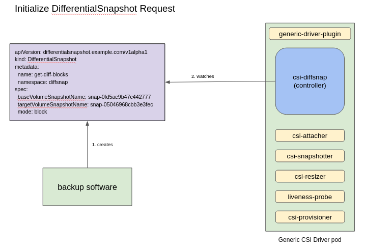
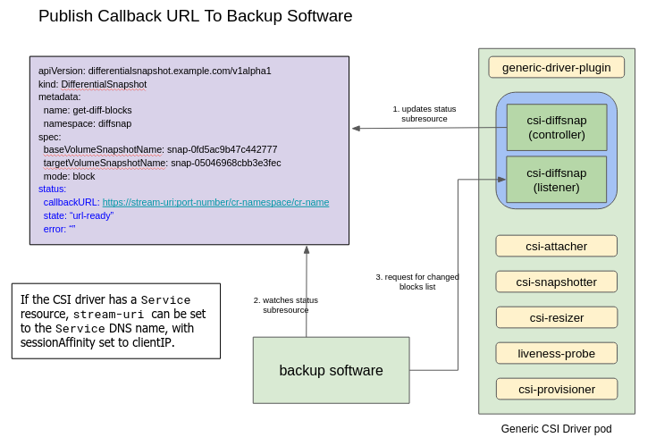
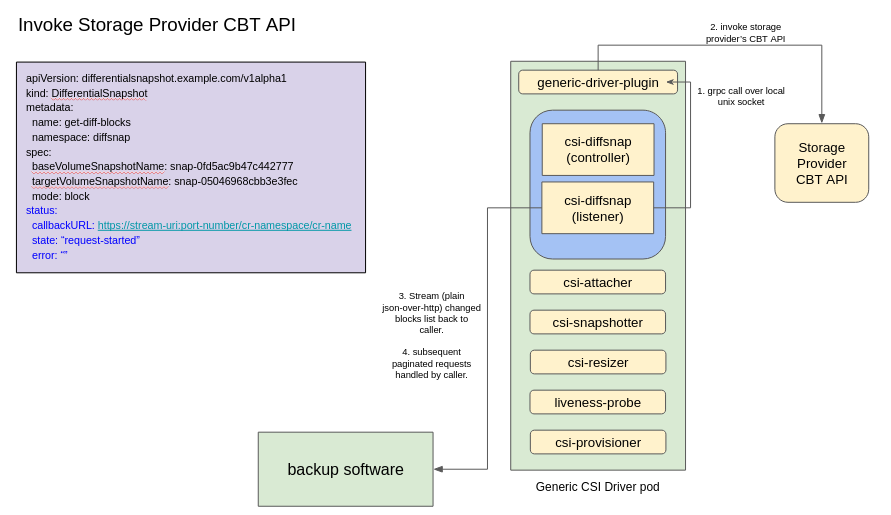

<!--
**Note:** When your KEP is complete, all of these comment blocks should be removed.

To get started with this template:

- [x] **Pick a hosting SIG.**
  Make sure that the problem space is something the SIG is interested in taking
  up. KEPs should not be checked in without a sponsoring SIG.
- [x] **Create an issue in kubernetes/enhancements**
  When filing an enhancement tracking issue, please make sure to complete all
  fields in that template. One of the fields asks for a link to the KEP. You
  can leave that blank until this KEP is filed, and then go back to the
  enhancement and add the link.
- [x] **Make a copy of this template directory.**
  Copy this template into the owning SIG's directory and name it
  `NNNN-short-descriptive-title`, where `NNNN` is the issue number (with no
  leading-zero padding) assigned to your enhancement above.
- [x] **Fill out this file as best you can.**
  At minimum, you should fill in the "Summary" and "Motivation" sections.
  These should be easy if you've preflighted the idea of the KEP with the
  appropriate SIG(s).
- [x] **Create a PR for this KEP.**
  Assign it to people in the SIG who are sponsoring this process.
- [ ] **Merge early and iterate.**
  Avoid getting hung up on specific details and instead aim to get the goals of
  the KEP clarified and merged quickly. The best way to do this is to just
  start with the high-level sections and fill out details incrementally in
  subsequent PRs.

Just because a KEP is merged does not mean it is complete or approved. Any KEP
marked as `provisional` is a working document and subject to change. You can
denote sections that are under active debate as follows:

```
<<[UNRESOLVED optional short context or usernames ]>>
Stuff that is being argued.
<<[/UNRESOLVED]>>
```

When editing KEPS, aim for tightly-scoped, single-topic PRs to keep discussions
focused. If you disagree with what is already in a document, open a new PR
with suggested changes.

One KEP corresponds to one "feature" or "enhancement" for its whole lifecycle.
You do not need a new KEP to move from beta to GA, for example. If
new details emerge that belong in the KEP, edit the KEP. Once a feature has become
"implemented", major changes should get new KEPs.

The canonical place for the latest set of instructions (and the likely source
of this file) is [here](/keps/NNNN-kep-template/README.md).

**Note:** Any PRs to move a KEP to `implementable`, or significant changes once
it is marked `implementable`, must be approved by each of the KEP approvers.
If none of those approvers are still appropriate, then changes to that list
should be approved by the remaining approvers and/or the owning SIG (or
SIG Architecture for cross-cutting KEPs).
-->
# KEP-3314: Changed Block Tracking With CSI Differential Snapshot

<!--
A table of contents is helpful for quickly jumping to sections of a KEP and for
highlighting any additional information provided beyond the standard KEP
template.

Ensure the TOC is wrapped with
  <code>&lt;!-- toc --&rt;&lt;!-- /toc --&rt;</code>
tags, and then generate with `hack/update-toc.sh`.
-->

<!-- toc -->
- [Release Signoff Checklist](#release-signoff-checklist)
- [Summary](#summary)
- [Motivation](#motivation)
  - [Goals](#goals)
  - [Non-Goals](#non-goals)
- [Proposal](#proposal)
  - [Risks and Mitigations](#risks-and-mitigations)
    - [Segmenting Critical Datapath Resource Requirements](#segmenting-critical-datapath-resource-requirements)
    - [Securing The HTTP Listener](#securing-the-http-listener)
- [Design Details](#design-details)
  - [CBT Datapath Worklow](#cbt-datapath-worklow)
  - [High Availability Mode](#high-availability-mode)
  - [API Specification](#api-specification)
  - [Test Plan](#test-plan)
      - [Prerequisite testing updates](#prerequisite-testing-updates)
      - [Unit tests](#unit-tests)
      - [Integration tests](#integration-tests)
      - [e2e tests](#e2e-tests)
  - [Graduation Criteria](#graduation-criteria)
    - [Alpha](#alpha)
  - [Upgrade / Downgrade Strategy](#upgrade--downgrade-strategy)
  - [Version Skew Strategy](#version-skew-strategy)
- [Production Readiness Review Questionnaire](#production-readiness-review-questionnaire)
  - [Feature Enablement and Rollback](#feature-enablement-and-rollback)
  - [Rollout, Upgrade and Rollback Planning](#rollout-upgrade-and-rollback-planning)
  - [Monitoring Requirements](#monitoring-requirements)
  - [Dependencies](#dependencies)
  - [Scalability](#scalability)
  - [Troubleshooting](#troubleshooting)
- [Implementation History](#implementation-history)
- [Drawbacks](#drawbacks)
- [Alternatives](#alternatives)
- [Infrastructure Needed (Optional)](#infrastructure-needed-optional)
<!-- /toc -->

## Release Signoff Checklist

<!--
**ACTION REQUIRED:** In order to merge code into a release, there must be an
issue in [kubernetes/enhancements] referencing this KEP and targeting a release
milestone **before the [Enhancement Freeze](https://git.k8s.io/sig-release/releases)
of the targeted release**.

For enhancements that make changes to code or processes/procedures in core
Kubernetes—i.e., [kubernetes/kubernetes], we require the following Release
Signoff checklist to be completed.

Check these off as they are completed for the Release Team to track. These
checklist items _must_ be updated for the enhancement to be released.
-->

Items marked with (R) are required *prior to targeting to a milestone / release*.

- [ ] (R) Enhancement issue in release milestone, which links to KEP dir in [kubernetes/enhancements] (not the initial KEP PR)
- [ ] (R) KEP approvers have approved the KEP status as `implementable`
- [x] (R) Design details are appropriately documented
- [ ] (R) Test plan is in place, giving consideration to SIG Architecture and SIG Testing input (including test refactors)
  - [ ] e2e Tests for all Beta API Operations (endpoints)
  - [ ] (R) Ensure GA e2e tests for meet requirements for [Conformance Tests](https://github.com/kubernetes/community/blob/master/contributors/devel/sig-architecture/conformance-tests.md)
  - [ ] (R) Minimum Two Week Window for GA e2e tests to prove flake free
- [ ] (R) Graduation criteria is in place
  - [ ] (R) [all GA Endpoints](https://github.com/kubernetes/community/pull/1806) must be hit by [Conformance Tests](https://github.com/kubernetes/community/blob/master/contributors/devel/sig-architecture/conformance-tests.md)
- [ ] (R) Production readiness review completed
- [ ] (R) Production readiness review approved
- [ ] "Implementation History" section is up-to-date for milestone
- [ ] User-facing documentation has been created in [kubernetes/website], for publication to [kubernetes.io]
- [ ] Supporting documentation—e.g., additional design documents, links to mailing list discussions/SIG meetings, relevant PRs/issues, release notes

<!--
**Note:** This checklist is iterative and should be reviewed and updated every time this enhancement is being considered for a milestone.
-->

[kubernetes.io]: https://kubernetes.io/
[kubernetes/enhancements]: https://git.k8s.io/enhancements
[kubernetes/kubernetes]: https://git.k8s.io/kubernetes
[kubernetes/website]: https://git.k8s.io/website

## Summary

<!--
This section is incredibly important for producing high-quality, user-focused
documentation such as release notes or a development roadmap. It should be
possible to collect this information before implementation begins, in order to
avoid requiring implementors to split their attention between writing release
notes and implementing the feature itself. KEP editors and SIG Docs
should help to ensure that the tone and content of the `Summary` section is
useful for a wide audience.

A good summary is probably at least a paragraph in length.

Both in this section and below, follow the guidelines of the [documentation
style guide]. In particular, wrap lines to a reasonable length, to make it
easier for reviewers to cite specific portions, and to minimize diff churn on
updates.

[documentation style guide]: https://github.com/kubernetes/community/blob/master/contributors/guide/style-guide.md
-->

Changed block tracking (CBT) techniques have been used by backup software to
efficiently back up large amount of data. They identify block-level changes
between two arbitrary pair of snapshots of the same volume and selectively
capture only what has changed between the two checkpoints. This type of
differential backup approach is a lot more efficient than backing up the entire
volume. This KEP proposes a new CSI API that can be used to identify the list of
changed blocks between a pair of CSI volume snapshots.

## Motivation

<!--
This section is for explicitly listing the motivation, goals, and non-goals of
this KEP.  Describe why the change is important and the benefits to users. The
motivation section can optionally provide links to [experience reports] to
demonstrate the interest in a KEP within the wider Kubernetes community.

[experience reports]: https://github.com/golang/go/wiki/ExperienceReports
-->

Efficient and reliable backup of data is intrinsic to production-grade backup
systems. Since majority of the data in a volume does not change in between
backups, being able to identify and back up only what has changed can
drastically improve backup bottlenecks and streamline the user's data protection
workflows.

Many storage providers are already utilizing these kind of block-level changes
for efficient data backup and restoration. This KEP proposes a design to extend
the Kubernetes CSI architecture to utilize these CBT features in order to bring
efficient, cloud-native data protection to Kubernetes users.

### Goals

<!--
List the specific goals of the KEP. What is it trying to achieve? How will we
know that this has succeeded?
-->

* Provide a secure, idiomatic CSI API to efficiently identify changes between
two arbitrary pairs of CSI volume snapshots of the same volume.
* The API can efficiently and reliably relay large amount of changed block data
from the storage provider back to the user, without exhausting cluster resources,
nor introducing flaky resource spikes and leaks.
* The blast radius of API failure should be sufficiently isolated from the rest
of the CSI architecture with no knock-on effects on other CSI components.
* Storage providers can opt in to expose their CBT functionality to Kubernetes
via this new API. This API remains an optional component of the CSI
architecture.
* Support provider-specific user input parameters such as block size,
fixed-sized vs. variable-sized blocks etc., without leaking provider-specific
implementation into CSI.

### Non-Goals

<!--
What is out of scope for this KEP? Listing non-goals helps to focus discussion
and make progress.
-->

* Retrieval of the actual data blocks is outside the scope of this KEP. The
proposed API returns only the metadata of the changed blocks.
* The ability to identify changes on file snapshots are slated for future KEP.
This includes support for directories, subdirectories and files.

## Proposal

<!--
This is where we get down to the specifics of what the proposal actually is.
This should have enough detail that reviewers can understand exactly what
you're proposing, but should not include things like API designs or
implementation. What is the desired outcome and how do we measure success?.
The "Design Details" section below is for the real
nitty-gritty.
-->

This KEP introduces a new CRD called `DifferentialSnapshot` to the CSI
architecture.

```
<<[UNRESOLVED CRD name ]>>
The name of the CRD hasn't been finalized. The 'Snapshot' suffix seems to imply
that the CRD represents a kind of volume snapshot, where it actually represents
the metadata of the changed blocks between the two snapshots.
<<[/UNRESOLVED]>>
```

The CRD abstracts away the details around interacting with the storage
providers' CBT endpoints. Essentially, the CRD allows a Kubernetes user to say,

> Help me find all the data blocks that have changed between these two
> snapshots.

The new `DifferentialSnapshot` component must be able to handle large amount of
data returned by the storage providers, without negatively impacting the rest of
the cluster through resource contention and starvation. Specifically, this KEP
emphasizes on not putting Kubernetes' etcd in the CBT datapath, to avoid bogging
it down with heavy IOPS operations.

The `DifferentialSnapshot` component will be implemented as a [CSI sidecar]
container, following the existing CSI driver deployment model. The new component
will have:

* a controller that watches for new `DifferentialSnapshot` resources.
* a HTTP listener the provides direct datapaths to handle CBT requests and
responses.

[CSI sidecar]: https://kubernetes-csi.github.io/docs/sidecar-containers.html

### Risks and Mitigations

<!--
What are the risks of this proposal, and how do we mitigate? Think broadly.
For example, consider both security and how this will impact the larger
Kubernetes ecosystem.

How will security be reviewed, and by whom?

How will UX be reviewed, and by whom?

Consider including folks who also work outside the SIG or subproject.
-->

#### Segmenting Critical Datapath Resource Requirements

It's not uncommon that the response payload from the storage providers can be
quite large, in the magnitude of gigabytes of changed block metadata, per volume
snapshot pair. The usual declarative approach of updating the custom
resource's `status` subresource with the payload may put etcd at risk of
storage capacity exhaustion as well as regular IOPS spikes.

To mitigate this issue, this KEP proposes a 2-hops request mechanism where
instead of handling the requests directly, the `DifferentialSnapshot` controller
returns a callback URL to the user so that HTTP requests can be directed to this
"out-of-band" endpoint to fetch the changed block metadata. This mechanism
allows the response payloads to be returned directly to the user, without
persisting them in etcd.

#### Securing The HTTP Listener

The `DifferentialSnapshot` listener that exposes the callback endpoint will be
secured by delegating the request authorisation to the Kubernetes API server
using the
[`SubjectAccessReview`](https://kubernetes.io/docs/reference/generated/kubernetes-api/v1.24/#subjectaccessreview-v1-authorization-k8s-io)
API.

## Design Details

<!--
This section should contain enough information that the specifics of your
change are understandable. This may include API specs (though not always
required) or even code snippets. If there's any ambiguity about HOW your
proposal will be implemented, this is the place to discuss them.
-->

The proposed design involves extending CSI with the `DifferentialSnapshot` CRD
and the `DIFFERENTIAL_SNAPSHOT_SERVICE` capability. A Kubernetes user (human or
not) would create a `DifferentialSnapshot` resource to initialize the CBT
datapath workflow. Storage providers can opt in to support this feature by
implementing the `DIFFERENTIAL_SNAPSHOT_SERVICE` capability in their CSI
drivers.

The `DifferentialSnapshot` resource is a namespace-scoped resource. It must be
created in the same namespace as the base and target CSI `VolumeSnapshot`s.

### CBT Datapath Worklow

A Kubernetes user initiates the datapath workflow by creating a new
`DifferentialSnapshot` custom resource. The `DifferentialSnapshot` controller,
deployed as a CSI sidecar in the storage provider's CSI driver, watches for new
`DifferentialSnapshot` resources:



Instead of satisfying the request directly, the controller constructs a callback
URL and adds it to the resource's `status` subresource. The user can then use
the callback URL to fetch the list of changed block metadata:



The callback URL points to the `DifferentialSnapshot` listener, which runs in
the same container as the `DifferentialSnapshot` controller. The CSI driver
`Service` resource's FQDN will be used as the hostname of the callback URL, which
essentially looks like:

```sh
https://<csi-driver-svc-dns>:<listener-port>/<resource-namespace>/<resource-name>
```

The `DifferentialSnapshot` listener delegates the authorisation of the request
to the Kubernetes API server via the `SubjectAccessReview` API. The user must
include the `Authorization` header in the request, using an authorised service
account's secret token as the bearer token.

The `DifferentialSnapshot` listener then issues a GRPC call to the
`GetDifferentialSnapshot` service on the storage provider's CSI plugin sidecar:



The original `DifferentialSnapshot` resource can be retrieved by using the
identifier (namespace and name) embedded in the URL path, in case there are
user-provided input parameters which need to be included in the GRPC request.

It is the storage provider's CSI plugin responsibility to call the provider's
CBT endpoint and manage the in-between authentication and authorisation
protocols.

The response payloads are then directly returned to the user from the
`DifferentialSnapshot` listener. This synchronous request/response
mechanism removes the needs to persist the response payloads in etcd.

Pagination parameters from the storage provider will also be included in the
listener's response to the user. The user will be responsible for coordinating
subsequent paginated requests.

### High Availability Mode

In high availability mode where there may be multiple replicas of the
`DifferentialSnapshot` sidecar, an active/passive leader election process will
be used to elect a single leader instance, while idling other non-leader
instances.

Non-leader instances will voluntarily fail their readiness probe to remove
themselves from the `Service`'s request path. Optionally, the `Service` can be
deployed with its `sessionAffinity` set to `clientIP` to ensure paginated
requests from the same origin are always directed back to the same leader pod.

### API Specification

The section describes the specification of proposed API. The Go types of the CRD
are defined as follows:

```go
// DifferentialSnapshot is a specification for a DifferentialSnapshot resource
type DifferentialSnapshot struct {
  metav1.TypeMeta   `json:",inline"`

  // +optional
  metav1.ObjectMeta `json:"metadata,omitempty"`

  Spec   DifferentialSnapshotSpec   `json:"spec"`

  // +optional
  Status DifferentialSnapshotStatus `json:"status,omitempty"`
}

// DifferentialSnapshotSpec is the spec for a DifferentialSnapshot resource
type DifferentialSnapshotSpec struct {
  BaseVolumeSnapshotName   string `json:"baseVolumeSnapshotName,omitempty"` // name of the base VolumeSnapshot; optional
  TargetVolumeSnapshotName string `json:"targetVolumeSnapshotName"`        // name of the target VolumeSnapshot; required
  Mode                     string `json:"mode,omitempty"`         // default to "block"
  StartOffset              string `json:"startOffset,omitempty"`  // logical offset from beginning of disk/volume
  Parameters               map[string]string `json:"parameters,omitempty"` // vendor specific parameters passed in as opaque key-value pairs; optional
}

// DifferentialSnapshotStatus is the status for a DifferentialSnapshot resource
type DifferentialSnapshotStatus struct {
  Error        string `json:"error,omitempty"`
  State        string `json:"state"`
  CallbackURL  string `json:"callbackURL"`
}

// DifferentialSnapshotList is a list of DifferentialSnapshot resources
type DifferentialSnapshotList struct {
  metav1.TypeMeta          `json:",inline"`
  metav1.ListMeta          `json:"metadata"`
  Items []GetChangedBlocks `json:"items"`
}
```

The corresponding GRPC service definition is as follows:

```grpc
service DifferentialSnapshot {
  rpc GetDifferentialSnapshot(DifferentialSnapshotRequest)
    returns (DifferentialSnapshotResponse) {}
}

type DifferentialSnapshotRequest struct {
    // If SnapshotBase is not specified, return all used blocks.
    SnapshotBase       string         // Snapshot handle, optional.
    SnapshotTarget     string         // Snapshot handle, required.
    Mode               string         // Volume mode, default "Block"
    StartOffset        string         // Logical offset from beginning of disk/volume.
                                      // Use string instead of uint64 to give vendor
                                      // the flexibility of implementing it either
                                      // string "token" or a number.
    MaxEntries         uint64         // Maximum number of entries in the response
    Parameters         map[string]string    // Vendor specific parameters passed in as opaque key-value pairs.  Optional.
}

type DifferentialSnapshotResponse struct {
    ChangeBlockList   []ChangedBlock  // array of ChangedBlock (for "Block" mode)
    NextOffset        string          // StartOffset of the next “page”.
    VolumeSize        uint64          // size of volume in bytes
    Timeout           uint64          // Time when the result of this differential snapshot is
                                      // available in the backend storage.  Seconds since epoch.
 }

type ChangedBlock struct {
    Offset            uint64          // logical offset
    Size              uint64          // size of the block data
    Context           []byte          // additional vendor specific info.  Optional.
    ZeroOut           bool            // If ZeroOut is true, this block in SnapshotTarget is zero out.
                                      // This is for optimization to avoid data mover to transfer zero blocks.
                                      // Not all vendors support this zeroout.
}
```

### Test Plan

<!--
**Note:** *Not required until targeted at a release.*
The goal is to ensure that we don't accept enhancements with inadequate testing.

All code is expected to have adequate tests (eventually with coverage
expectations). Please adhere to the [Kubernetes testing guidelines][testing-guidelines]
when drafting this test plan.

[testing-guidelines]: https://git.k8s.io/community/contributors/devel/sig-testing/testing.md
-->

[x] I/we understand the owners of the involved components may require updates to
existing tests to make this code solid enough prior to committing the changes necessary
to implement this enhancement.

##### Prerequisite testing updates

<!--
Based on reviewers feedback describe what additional tests need to be added prior
implementing this enhancement to ensure the enhancements have also solid foundations.
-->

##### Unit tests

<!--
In principle every added code should have complete unit test coverage, so providing
the exact set of tests will not bring additional value.
However, if complete unit test coverage is not possible, explain the reason of it
together with explanation why this is acceptable.
-->

<!--
Additionally, for Alpha try to enumerate the core package you will be touching
to implement this enhancement and provide the current unit coverage for those
in the form of:
- <package>: <date> - <current test coverage>
The data can be easily read from:
https://testgrid.k8s.io/sig-testing-canaries#ci-kubernetes-coverage-unit

This can inform certain test coverage improvements that we want to do before
extending the production code to implement this enhancement.
-->

All unit tests will be included in the out-of-tree CSI repositories, with no
impact on the test coverage of the core packages.

##### Integration tests

<!--
This question should be filled when targeting a release.
For Alpha, describe what tests will be added to ensure proper quality of the enhancement.

For Beta and GA, add links to added tests together with links to k8s-triage for those tests:
https://storage.googleapis.com/k8s-triage/index.html
-->

Prerequisites:

* Install `etcd` per instructions in sig-testing
[integration tests documentation]
* Create two CSI `VolumeSnapshot`s backed by the CSI [host path driver].
* Inject a mock handler in the `DifferentialSnapshot` listener

[integration tests documentation]: https://github.com/kubernetes/community/blob/master/contributors/devel/sig-testing/integration-tests.md#install-etcd-dependency
[host path driver]: https://github.com/kubernetes-csi/csi-driver-host-path

###### Test Suite 1 - Custom Resource Management

Test case 1: Create `DifferentialSnapshot` custom resource referencing the two
base and target `VolumeSnapshot`s in the fixture.
Expected result: Custom resource created successfully with its `status`
subresource updated to include callback URL and `url-ready` state.

Test case 2: Create `DifferentialSnapshot` custom resource referencing the
target `VolumeSnapshot`, with the base `VolumeSnapshot` left empty.
Expected result: Custom resource created successfully with its `status`
subresource updated to include callback URL and `url-ready` state.
Requirement: The base `VolumeSnapshot` is an optional field.

Test case 3: Create `DifferentialSnapshot` custom resource referencing the
base `VolumeSnapshot`, with the target `VolumeSnapshot` left empty.
Expected result: Custom resource failed to be created. Its `status` subresource
should not have the callback URL. Its state should be set to `failed` with a
`NotFound` error message in the `error` field.
Requirement: The target `VolumeSnapshot` is a required field.

Test case 4: Create `DifferentialSnapshot` custom resource referencing
non-existing base and target `VolumeSnapshot`s.
Expected result: Custom resource failed to be created. Its `status` subresource
should not have the callback URL. Its state should be set to `failed` with a
`NotFound` error message in the `error` field.
Requirement: The target `VolumeSnapshot` is a required field.

Test case 5: Update an existing `DifferentialSnapshot` custom resource to
reference a different target `VolumeSnapshot`.
Expected result: Custom resource is updated successfully. Its `status`
subresource is updated to include callback URL and `url-ready` state.

Test case 6: Delete an existing `DifferentialSnapshot` custom resource.
Expected result: Custom resource is deleted successfully.

###### Test Suite 2 - HTTP Listener

Test case 1: Send a HTTP request with a fake `Authorisation` bearer token to the
`DifferentialSnapshot` listener's fake handler.
Expected result: The listener should return a HTTP 200 `OK` status code.

Test case 2: Send a HTTP request without an  `Authorisation` bearer token to the
`DifferentialSnapshot` listener's fake handler.
Expected result: The listener should return a HTTP 403 `Forbidden` status code.

##### e2e tests

<!--
This question should be filled when targeting a release.
For Alpha, describe what tests will be added to ensure proper quality of the enhancement.

For Beta and GA, add links to added tests together with links to k8s-triage for those tests:
https://storage.googleapis.com/k8s-triage/index.html

We expect no non-infra related flakes in the last month as a GA graduation criteria.
-->

Prerequisites:

* Use `kubetest` to build Kubernetes and run the tests per sig-testing
[e2e tests documentation].
* Create two CSI `VolumeSnapshot`s backed by the CSI [host path driver].
* Deploy a sample client to initiate the CBT datapath API and send CBT requests
to the `DifferentialSnapshot` listener.
* Deploy a mock CSI driver plugin to handle CBT requests from the mock client.

[e2e tests documentation]: https://github.com/kubernetes/community/blob/master/contributors/devel/sig-testing/e2e-tests.md#building-kubernetes-and-running-the-tests

For alpha release, the initial e2e test flow is defined as follows:

* When the test is started, the sample client creates a `DifferentialSnapshot`
custom resource referencing the two base and target `VolumeSnapshot`s in the
fixture.
* The `DifferentialSnapshot` controller update its `status` subresource to
include a callback URL and set its state to `url-ready`.
* The sample client extracts the callback URL from the `status` subresource,
and sends its CBT requests to the `DifferentialSnapshot` listener at the
callback URL.
* The listener authorises the CBT requests by delegating the authorisation
protocol to the Kubernetes API server via the `SubjectAccessReview` API.
* Once the request is authorised, the listener uses the identifier
(resource's name and namespace) embedded in the callback URL to retrieve the
original `DifferentialSnapshot` custom resource, to retrieve the user-provided
input parameters. These parameters will be included in the subsequent GRPC
request to the mock CSI driver plugin.
* The listener sends the GRPC request to the mock CSI driver plugin.
* The mock plugin responds with a list of sample CBT data to the listener and some
sample pagination parameters used for requesting a "second page" response.
* The listener forwards the response payloads back to the sample client.
* The sample client uses the pagination parameters to fetch the second page of
CBT data.

### Graduation Criteria

<!--
**Note:** *Not required until targeted at a release.*

Define graduation milestones.

These may be defined in terms of API maturity, [feature gate] graduations, or as
something else. The KEP should keep this high-level with a focus on what
signals will be looked at to determine graduation.

Consider the following in developing the graduation criteria for this enhancement:
- [Maturity levels (`alpha`, `beta`, `stable`)][maturity-levels]
- [Feature gate][feature gate] lifecycle
- [Deprecation policy][deprecation-policy]

Clearly define what graduation means by either linking to the [API doc
definition](https://kubernetes.io/docs/concepts/overview/kubernetes-api/#api-versioning)
or by redefining what graduation means.

In general we try to use the same stages (alpha, beta, GA), regardless of how the
functionality is accessed.

[feature gate]: https://git.k8s.io/community/contributors/devel/sig-architecture/feature-gates.md
[maturity-levels]: https://git.k8s.io/community/contributors/devel/sig-architecture/api_changes.md#alpha-beta-and-stable-versions
[deprecation-policy]: https://kubernetes.io/docs/reference/using-api/deprecation-policy/

Below are some examples to consider, in addition to the aforementioned [maturity levels][maturity-levels].

#### Alpha

- Feature implemented behind a feature flag
- Initial e2e tests completed and enabled

#### Beta

- Gather feedback from developers and surveys
- Complete features A, B, C
- Additional tests are in Testgrid and linked in KEP

#### GA

- N examples of real-world usage
- N installs
- More rigorous forms of testing—e.g., downgrade tests and scalability tests
- Allowing time for feedback

**Note:** Generally we also wait at least two releases between beta and
GA/stable, because there's no opportunity for user feedback, or even bug reports,
in back-to-back releases.

**For non-optional features moving to GA, the graduation criteria must include
[conformance tests].**

[conformance tests]: https://git.k8s.io/community/contributors/devel/sig-architecture/conformance-tests.md

#### Deprecation

- Announce deprecation and support policy of the existing flag
- Two versions passed since introducing the functionality that deprecates the flag (to address version skew)
- Address feedback on usage/changed behavior, provided on GitHub issues
- Deprecate the flag
-->

#### Alpha

- Completed functionalities include:
  - Approved specification of the `DifferentialSnapshot` CRD and CSI GRPC
services
  - Ability to create, update, delete and retrieve `DifferentialSnapshot` custom
resources.
  - Validator to enforce validation criteria like missing required fields.
  - Authorisation delegation to the Kubernetes API server via the
`SubjectAccessReview` API.
  - Implementation of the CSI GRPC client-side logic on the
`DifferentialSnapshot` listener.
- Initial e2e tests completed and enabled.
- Since this is an out-of-tree CSI component, no feature flag is required.

### Upgrade / Downgrade Strategy

<!--
If applicable, how will the component be upgraded and downgraded? Make sure
this is in the test plan.

Consider the following in developing an upgrade/downgrade strategy for this
enhancement:
- What changes (in invocations, configurations, API use, etc.) is an existing
  cluster required to make on upgrade, in order to maintain previous behavior?
- What changes (in invocations, configurations, API use, etc.) is an existing
  cluster required to make on upgrade, in order to make use of the enhancement?
-->

### Version Skew Strategy

<!--
If applicable, how will the component handle version skew with other
components? What are the guarantees? Make sure this is in the test plan.

Consider the following in developing a version skew strategy for this
enhancement:
- Does this enhancement involve coordinating behavior in the control plane and
  in the kubelet? How does an n-2 kubelet without this feature available behave
  when this feature is used?
- Will any other components on the node change? For example, changes to CSI,
  CRI or CNI may require updating that component before the kubelet.
-->

## Production Readiness Review Questionnaire

<!--

Production readiness reviews are intended to ensure that features merging into
Kubernetes are observable, scalable and supportable; can be safely operated in
production environments, and can be disabled or rolled back in the event they
cause increased failures in production. See more in the PRR KEP at
https://git.k8s.io/enhancements/keps/sig-architecture/1194-prod-readiness.

The production readiness review questionnaire must be completed and approved
for the KEP to move to `implementable` status and be included in the release.

In some cases, the questions below should also have answers in `kep.yaml`. This
is to enable automation to verify the presence of the review, and to reduce review
burden and latency.

The KEP must have a approver from the
[`prod-readiness-approvers`](http://git.k8s.io/enhancements/OWNERS_ALIASES)
team. Please reach out on the
[#prod-readiness](https://kubernetes.slack.com/archives/CPNHUMN74) channel if
you need any help or guidance.
-->

### Feature Enablement and Rollback

<!--
This section must be completed when targeting alpha to a release.
-->

###### How can this feature be enabled / disabled in a live cluster?

<!--
Pick one of these and delete the rest.

Documentation is available on [feature gate lifecycle] and expectations, as
well as the [existing list] of feature gates.

[feature gate lifecycle]: https://git.k8s.io/community/contributors/devel/sig-architecture/feature-gates.md
[existing list]: https://kubernetes.io/docs/reference/command-line-tools-reference/feature-gates/
-->

- [ ] Feature gate (also fill in values in `kep.yaml`)
  - Feature gate name:
  - Components depending on the feature gate:
- [x] Other
  - Describe the mechanism: The new component will be implemented as an
    out-of-tree CSI sidecar container which storage providers can include in
    their CSI drivers, if they choose to support this feature.
  - Will enabling / disabling the feature require downtime of the control
    plane? No.
  - Will enabling / disabling the feature require downtime or reprovisioning
    of a node? (Do not assume `Dynamic Kubelet Config` feature is enabled). No.

###### Does enabling the feature change any default behavior?

<!--
Any change of default behavior may be surprising to users or break existing
automations, so be extremely careful here.
-->

No.

###### Can the feature be disabled once it has been enabled (i.e. can we roll back the enablement)?

<!--
Describe the consequences on existing workloads (e.g., if this is a runtime
feature, can it break the existing applications?).

Feature gates are typically disabled by setting the flag to `false` and
restarting the component. No other changes should be necessary to disable the
feature.

NOTE: Also set `disable-supported` to `true` or `false` in `kep.yaml`.
-->

Yes, the storage provider can remove the `DifferentialSnapshot` sidecar
container from their CSI drivers in order to disable the CSI CBT feature.
All new `DifferentialSnapshot` resources will be ignored. Subsequent HTTP
requests to an existing callback URL will fail with HTTP 404.

###### What happens if we reenable the feature if it was previously rolled back?

The `DifferentialSnapshot` controller will re-assess the status of all the
existing `DifferentialSnapshot` resources and provision callback URLs for those
that are not in the `url-ready` nor `request-started` states. Users will be
responsible for resuming previously incomplete CBT requests to the
`DifferentialSnapshot` listener.

###### Are there any tests for feature enablement/disablement?

<!--
The e2e framework does not currently support enabling or disabling feature
gates. However, unit tests in each component dealing with managing data, created
with and without the feature, are necessary. At the very least, think about
conversion tests if API types are being modified.

Additionally, for features that are introducing a new API field, unit tests that
are exercising the `switch` of feature gate itself (what happens if I disable a
feature gate after having objects written with the new field) are also critical.
You can take a look at one potential example of such test in:
https://github.com/kubernetes/kubernetes/pull/97058/files#diff-7826f7adbc1996a05ab52e3f5f02429e94b68ce6bce0dc534d1be636154fded3R246-R282
-->

### Rollout, Upgrade and Rollback Planning

<!--
This section must be completed when targeting beta to a release.
-->

###### How can a rollout or rollback fail? Can it impact already running workloads?

<!--
Try to be as paranoid as possible - e.g., what if some components will restart
mid-rollout?

Be sure to consider highly-available clusters, where, for example,
feature flags will be enabled on some API servers and not others during the
rollout. Similarly, consider large clusters and how enablement/disablement
will rollout across nodes.
-->

###### What specific metrics should inform a rollback?

<!--
What signals should users be paying attention to when the feature is young
that might indicate a serious problem?
-->

###### Were upgrade and rollback tested? Was the upgrade->downgrade->upgrade path tested?

<!--
Describe manual testing that was done and the outcomes.
Longer term, we may want to require automated upgrade/rollback tests, but we
are missing a bunch of machinery and tooling and can't do that now.
-->

###### Is the rollout accompanied by any deprecations and/or removals of features, APIs, fields of API types, flags, etc.?

<!--
Even if applying deprecation policies, they may still surprise some users.
-->

### Monitoring Requirements

<!--
This section must be completed when targeting beta to a release.

For GA, this section is required: approvers should be able to confirm the
previous answers based on experience in the field.
-->

###### How can an operator determine if the feature is in use by workloads?

<!--
Ideally, this should be a metric. Operations against the Kubernetes API (e.g.,
checking if there are objects with field X set) may be a last resort. Avoid
logs or events for this purpose.
-->

###### How can someone using this feature know that it is working for their instance?

<!--
For instance, if this is a pod-related feature, it should be possible to determine if the feature is functioning properly
for each individual pod.
Pick one more of these and delete the rest.
Please describe all items visible to end users below with sufficient detail so that they can verify correct enablement
and operation of this feature.
Recall that end users cannot usually observe component logs or access metrics.
-->

- [ ] Events
  - Event Reason:
- [ ] API .status
  - Condition name:
  - Other field:
- [ ] Other (treat as last resort)
  - Details:

###### What are the reasonable SLOs (Service Level Objectives) for the enhancement?

<!--
This is your opportunity to define what "normal" quality of service looks like
for a feature.

It's impossible to provide comprehensive guidance, but at the very
high level (needs more precise definitions) those may be things like:
  - per-day percentage of API calls finishing with 5XX errors <= 1%
  - 99% percentile over day of absolute value from (job creation time minus expected
    job creation time) for cron job <= 10%
  - 99.9% of /health requests per day finish with 200 code

These goals will help you determine what you need to measure (SLIs) in the next
question.
-->

###### What are the SLIs (Service Level Indicators) an operator can use to determine the health of the service?

<!--
Pick one more of these and delete the rest.
-->

- [ ] Metrics
  - Metric name:
  - [Optional] Aggregation method:
  - Components exposing the metric:
- [ ] Other (treat as last resort)
  - Details:

###### Are there any missing metrics that would be useful to have to improve observability of this feature?

<!--
Describe the metrics themselves and the reasons why they weren't added (e.g., cost,
implementation difficulties, etc.).
-->

### Dependencies

<!--
This section must be completed when targeting beta to a release.
-->

###### Does this feature depend on any specific services running in the cluster?

<!--
Think about both cluster-level services (e.g. metrics-server) as well
as node-level agents (e.g. specific version of CRI). Focus on external or
optional services that are needed. For example, if this feature depends on
a cloud provider API, or upon an external software-defined storage or network
control plane.

For each of these, fill in the following—thinking about running existing user workloads
and creating new ones, as well as about cluster-level services (e.g. DNS):
  - [Dependency name]
    - Usage description:
      - Impact of its outage on the feature:
      - Impact of its degraded performance or high-error rates on the feature:
-->

### Scalability

<!--
For alpha, this section is encouraged: reviewers should consider these questions
and attempt to answer them.

For beta, this section is required: reviewers must answer these questions.

For GA, this section is required: approvers should be able to confirm the
previous answers based on experience in the field.
-->

###### Will enabling / using this feature result in any new API calls?

<!--
Describe them, providing:
  - API call type (e.g. PATCH pods)
  - estimated throughput
  - originating component(s) (e.g. Kubelet, Feature-X-controller)
Focusing mostly on:
  - components listing and/or watching resources they didn't before
  - API calls that may be triggered by changes of some Kubernetes resources
    (e.g. update of object X triggers new updates of object Y)
  - periodic API calls to reconcile state (e.g. periodic fetching state,
    heartbeats, leader election, etc.)
-->

The `DifferentialSnapshot` controller will be interacting with the APIs
associated with these CSI GVRs:

```yaml
- apiGroups: ["snapshot.storage.k8s.io"]
  resources: ["volumesnapshotcontents", "volumesnapshots"]
  verbs: ["get", "list"]
- apiGroups: ["snapshot.storage.k8s.io"]
  resources: ["differentialsnapshots"]
  verbs: ["get", "list", "watch"]
```

It will also utilize the `SubjectAccessReview` API to delegate request
authorisation to the Kubernetes API server.

Users can utilize Kubernetes clients like `kubectl` or `client-go` to create and
manage the `DifferentialSnapshot` custom resources.

###### Will enabling / using this feature result in introducing new API types?

<!--
Describe them, providing:
  - API type
  - Supported number of objects per cluster
  - Supported number of objects per namespace (for namespace-scoped objects)
-->

The `DifferentialSnapshot` namespace-scoped CRD will be added to the
`snapshot.storage.k8s.io` group.

###### Will enabling / using this feature result in any new calls to the cloud provider?

<!--
Describe them, providing:
  - Which API(s):
  - Estimated increase:
-->

The `DifferentialSnapshot` component will not issue direct calls to the cloud
providers. The provider-specific CSI driver plugin which the
`DifferentialSnapshot` component depends on will be responsible for interacting
with their 3rd party APIs.

###### Will enabling / using this feature result in increasing size or count of the existing API objects?

<!--
Describe them, providing:
  - API type(s):
  - Estimated increase in size: (e.g., new annotation of size 32B)
  - Estimated amount of new objects: (e.g., new Object X for every existing Pod)
-->

No foreseeable impact on existing API objects.

###### Will enabling / using this feature result in increasing time taken by any operations covered by existing SLIs/SLOs?

<!--
Look at the [existing SLIs/SLOs].

Think about adding additional work or introducing new steps in between
(e.g. need to do X to start a container), etc. Please describe the details.

[existing SLIs/SLOs]: https://git.k8s.io/community/sig-scalability/slos/slos.md#kubernetes-slisslos
-->

Since the response payloads are returned to the user over "out-of-band" HTTP
endpoints that don't involve the Kubernetes API server nor etcd, we don't
foresee any negative impact on existing API latency SLIs/SLOs.

The `DifferentialSnapshot` sidecar uses a simple startup process to initialize a
Go process with 2 long-running goroutines, serving as the controller and the
listener. It will have no negative impact on the startup latency SLIs/SLOs.

###### Will enabling / using this feature result in non-negligible increase of resource usage (CPU, RAM, disk, IO, ...) in any components?

<!--
Things to keep in mind include: additional in-memory state, additional
non-trivial computations, excessive access to disks (including increased log
volume), significant amount of data sent and/or received over network, etc.
This through this both in small and large cases, again with respect to the
[supported limits].

[supported limits]: https://git.k8s.io/community//sig-scalability/configs-and-limits/thresholds.md
-->

The `DifferentialSnapshot` component is expected to be memory-intensive as it
needs to be able to return large, paginated response payloads from the storage
provider to the user. Hence, its pods must be deployed with sensible memory
requests and limits specification. In the event of excessive memory usages, it is
expected that the host's kernel will issue `OOMKilled` signals to terminate the
pods. There are no requirements on pod priority or disruption budget.

### Troubleshooting

<!--
This section must be completed when targeting beta to a release.

For GA, this section is required: approvers should be able to confirm the
previous answers based on experience in the field.

The Troubleshooting section currently serves the `Playbook` role. We may consider
splitting it into a dedicated `Playbook` document (potentially with some monitoring
details). For now, we leave it here.
-->

###### How does this feature react if the API server and/or etcd is unavailable?

###### What are other known failure modes?

<!--
For each of them, fill in the following information by copying the below template:
  - [Failure mode brief description]
    - Detection: How can it be detected via metrics? Stated another way:
      how can an operator troubleshoot without logging into a master or worker node?
    - Mitigations: What can be done to stop the bleeding, especially for already
      running user workloads?
    - Diagnostics: What are the useful log messages and their required logging
      levels that could help debug the issue?
      Not required until feature graduated to beta.
    - Testing: Are there any tests for failure mode? If not, describe why.
-->

###### What steps should be taken if SLOs are not being met to determine the problem?

## Implementation History

<!--
Major milestones in the lifecycle of a KEP should be tracked in this section.
Major milestones might include:
- the `Summary` and `Motivation` sections being merged, signaling SIG acceptance
- the `Proposal` section being merged, signaling agreement on a proposed design
- the date implementation started
- the first Kubernetes release where an initial version of the KEP was available
- the version of Kubernetes where the KEP graduated to general availability
- when the KEP was retired or superseded
-->

## Drawbacks

<!--
Why should this KEP _not_ be implemented?
-->

## Alternatives

<!--
What other approaches did you consider, and why did you rule them out? These do
not need to be as detailed as the proposal, but should include enough
information to express the idea and why it was not acceptable.
-->

## Infrastructure Needed (Optional)

<!--
Use this section if you need things from the project/SIG. Examples include a
new subproject, repos requested, or GitHub details. Listing these here allows a
SIG to get the process for these resources started right away.
-->
