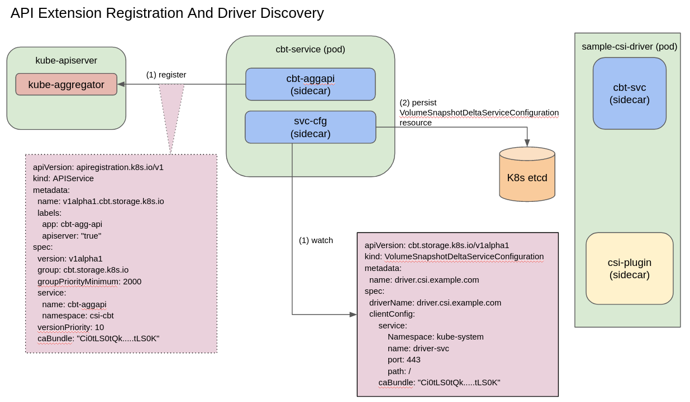
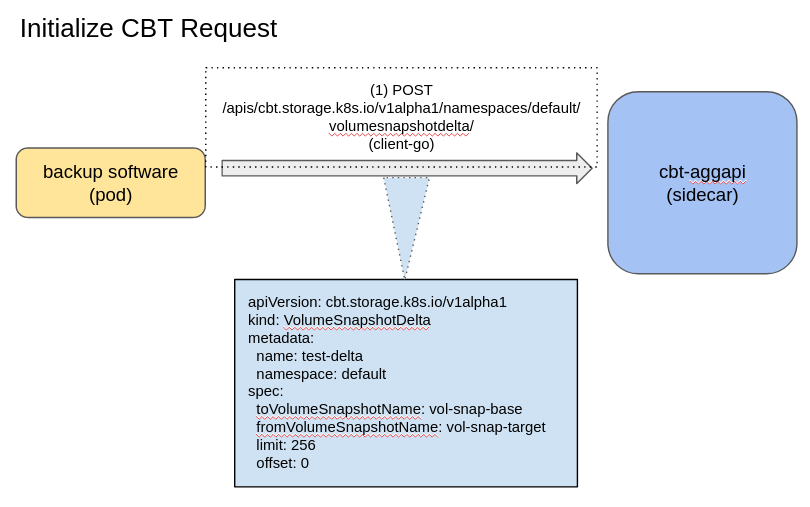
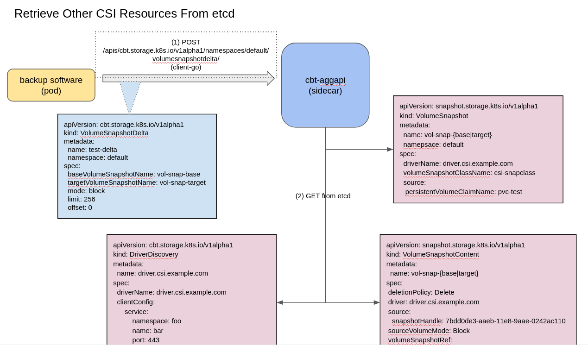
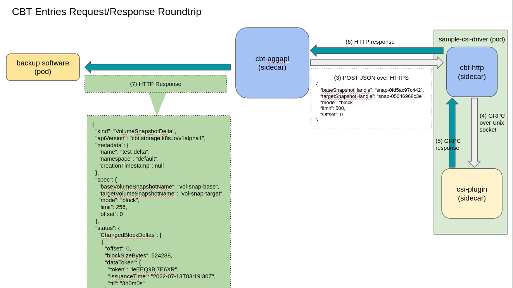

<!--
**Note:** When your KEP is complete, all of these comment blocks should be removed.

To get started with this template:

- [x] **Pick a hosting SIG.**
  Make sure that the problem space is something the SIG is interested in taking
  up. KEPs should not be checked in without a sponsoring SIG.
- [x] **Create an issue in kubernetes/enhancements**
  When filing an enhancement tracking issue, please make sure to complete all
  fields in that template. One of the fields asks for a link to the KEP. You
  can leave that blank until this KEP is filed, and then go back to the
  enhancement and add the link.
- [x] **Make a copy of this template directory.**
  Copy this template into the owning SIG's directory and name it
  `NNNN-short-descriptive-title`, where `NNNN` is the issue number (with no
  leading-zero padding) assigned to your enhancement above.
- [x] **Fill out this file as best you can.**
  At minimum, you should fill in the "Summary" and "Motivation" sections.
  These should be easy if you've preflighted the idea of the KEP with the
  appropriate SIG(s).
- [x] **Create a PR for this KEP.**
  Assign it to people in the SIG who are sponsoring this process.
- [ ] **Merge early and iterate.**
  Avoid getting hung up on specific details and instead aim to get the goals of
  the KEP clarified and merged quickly. The best way to do this is to just
  start with the high-level sections and fill out details incrementally in
  subsequent PRs.

Just because a KEP is merged does not mean it is complete or approved. Any KEP
marked as `provisional` is a working document and subject to change. You can
denote sections that are under active debate as follows:

```
<<[UNRESOLVED optional short context or usernames ]>>
Stuff that is being argued.
<<[/UNRESOLVED]>>
```

When editing KEPS, aim for tightly-scoped, single-topic PRs to keep discussions
focused. If you disagree with what is already in a document, open a new PR
with suggested changes.

One KEP corresponds to one "feature" or "enhancement" for its whole lifecycle.
You do not need a new KEP to move from beta to GA, for example. If
new details emerge that belong in the KEP, edit the KEP. Once a feature has become
"implemented", major changes should get new KEPs.

The canonical place for the latest set of instructions (and the likely source
of this file) is [here](/keps/NNNN-kep-template/README.md).

**Note:** Any PRs to move a KEP to `implementable`, or significant changes once
it is marked `implementable`, must be approved by each of the KEP approvers.
If none of those approvers are still appropriate, then changes to that list
should be approved by the remaining approvers and/or the owning SIG (or
SIG Architecture for cross-cutting KEPs).
-->
# KEP-3314: Changed Block Tracking With CSI VolumeSnapshotDelta

<!--
A table of contents is helpful for quickly jumping to sections of a KEP and for
highlighting any additional information provided beyond the standard KEP
template.

Ensure the TOC is wrapped with
  <code>&lt;!-- toc --&rt;&lt;!-- /toc --&rt;</code>
tags, and then generate with `hack/update-toc.sh`.
-->

<!-- toc -->
- [Release Signoff Checklist](#release-signoff-checklist)
- [Summary](#summary)
- [Motivation](#motivation)
  - [Goals](#goals)
  - [Non-Goals](#non-goals)
- [Proposal](#proposal)
  - [Risks and Mitigations](#risks-and-mitigations)
    - [Kubernetes API Server - flow control and response latency](#kubernetes-api-server---flow-control-and-response-latency)
    - [Aggregated API Server - denial of service](#aggregated-api-server---denial-of-service)
    - [APIService Resource - CA bundle expiry](#apiservice-resource---ca-bundle-expiry)
- [Design Details](#design-details)
  - [CBT Datapath Worklow](#cbt-datapath-worklow)
  - [High Availability Mode](#high-availability-mode)
  - [API Specification](#api-specification)
    - [VolumeSnapshotDelta Resource](#volumesnapshotdelta-resource)
    - [DriverDiscovery Resource](#driverdiscovery-resource)
  - [Test Plan](#test-plan)
      - [Prerequisite testing updates](#prerequisite-testing-updates)
      - [Unit tests](#unit-tests)
      - [Integration tests](#integration-tests)
      - [e2e tests](#e2e-tests)
  - [Graduation Criteria](#graduation-criteria)
    - [Alpha](#alpha)
  - [Upgrade / Downgrade Strategy](#upgrade--downgrade-strategy)
  - [Version Skew Strategy](#version-skew-strategy)
- [Production Readiness Review Questionnaire](#production-readiness-review-questionnaire)
  - [Feature Enablement and Rollback](#feature-enablement-and-rollback)
  - [Rollout, Upgrade and Rollback Planning](#rollout-upgrade-and-rollback-planning)
  - [Monitoring Requirements](#monitoring-requirements)
  - [Dependencies](#dependencies)
  - [Scalability](#scalability)
  - [Troubleshooting](#troubleshooting)
- [Implementation History](#implementation-history)
- [Drawbacks](#drawbacks)
- [Alternatives](#alternatives)
- [Infrastructure Needed (Optional)](#infrastructure-needed-optional)
<!-- /toc -->

## Release Signoff Checklist

<!--
**ACTION REQUIRED:** In order to merge code into a release, there must be an
issue in [kubernetes/enhancements] referencing this KEP and targeting a release
milestone **before the [Enhancement Freeze](https://git.k8s.io/sig-release/releases)
of the targeted release**.

For enhancements that make changes to code or processes/procedures in core
Kubernetes—i.e., [kubernetes/kubernetes], we require the following Release
Signoff checklist to be completed.

Check these off as they are completed for the Release Team to track. These
checklist items _must_ be updated for the enhancement to be released.
-->

Items marked with (R) are required *prior to targeting to a milestone / release*.

- [x] (R) Enhancement issue in release milestone, which links to KEP dir in [kubernetes/enhancements] (not the initial KEP PR)
- [ ] (R) KEP approvers have approved the KEP status as `implementable`
- [x] (R) Design details are appropriately documented
- [x] (R) Test plan is in place, giving consideration to SIG Architecture and SIG Testing input (including test refactors)
  - [ ] e2e Tests for all Beta API Operations (endpoints)
  - [ ] (R) Ensure GA e2e tests for meet requirements for [Conformance Tests](https://github.com/kubernetes/community/blob/master/contributors/devel/sig-architecture/conformance-tests.md)
  - [ ] (R) Minimum Two Week Window for GA e2e tests to prove flake free
- [x] (R) Graduation criteria is in place
  - [ ] (R) [all GA Endpoints](https://github.com/kubernetes/community/pull/1806) must be hit by [Conformance Tests](https://github.com/kubernetes/community/blob/master/contributors/devel/sig-architecture/conformance-tests.md)
- [ ] (R) Production readiness review completed
- [ ] (R) Production readiness review approved
- [ ] "Implementation History" section is up-to-date for milestone
- [ ] User-facing documentation has been created in [kubernetes/website], for publication to [kubernetes.io]
- [ ] Supporting documentation—e.g., additional design documents, links to mailing list discussions/SIG meetings, relevant PRs/issues, release notes

<!--
**Note:** This checklist is iterative and should be reviewed and updated every time this enhancement is being considered for a milestone.
-->

[kubernetes.io]: https://kubernetes.io/
[kubernetes/enhancements]: https://git.k8s.io/enhancements
[kubernetes/kubernetes]: https://git.k8s.io/kubernetes
[kubernetes/website]: https://git.k8s.io/website

## Summary

<!--
This section is incredibly important for producing high-quality, user-focused
documentation such as release notes or a development roadmap. It should be
possible to collect this information before implementation begins, in order to
avoid requiring implementors to split their attention between writing release
notes and implementing the feature itself. KEP editors and SIG Docs
should help to ensure that the tone and content of the `Summary` section is
useful for a wide audience.

A good summary is probably at least a paragraph in length.

Both in this section and below, follow the guidelines of the [documentation
style guide]. In particular, wrap lines to a reasonable length, to make it
easier for reviewers to cite specific portions, and to minimize diff churn on
updates.

[documentation style guide]: https://github.com/kubernetes/community/blob/master/contributors/guide/style-guide.md
-->

Changed block tracking (CBT) techniques have been used by backup systems to
efficiently back up large amount of data in block volumes. They identify
block-level changes between two arbitrary pair of snapshots of the same block
volume, and selectively capture what has changed between the two checkpoints.
This type of differential backup approach is a lot more efficient than backing
up the entire volume. This KEP proposes a new CSI API that can be used to
identify the list of changed blocks between a pair of CSI volume snapshots.

## Motivation

<!--
This section is for explicitly listing the motivation, goals, and non-goals of
this KEP.  Describe why the change is important and the benefits to users. The
motivation section can optionally provide links to [experience reports] to
demonstrate the interest in a KEP within the wider Kubernetes community.

[experience reports]: https://github.com/golang/go/wiki/ExperienceReports
-->

Efficient and reliable backup of data is intrinsic to production-grade backup
systems. Since majority of the data in a volume does not change in between
backups, being able to identify and back up only what has changed can
drastically improve backup bottlenecks and streamline the user's data protection
workflows.

Many storage providers already have the ability to detect block-level changes
for efficient data backup and restoration. This KEP proposes a design to extend
the Kubernetes CSI framework to utilize these CBT features to bring efficient,
cloud-native data protection to Kubernetes users.

### Goals

<!--
List the specific goals of the KEP. What is it trying to achieve? How will we
know that this has succeeded?
-->

* Provide a secure, idiomatic CSI API to efficiently identify changes between
two arbitrary pairs of CSI volume snapshots of the same block volume.
* The API can efficiently and reliably relay large amount of changed block data
from the storage provider back to the user, without exhausting cluster resources,
nor introducing flaky resource spikes and leaks.
* The blast radius of component failure should be sufficiently isolated from the
rest of the cluster.
* This API remains an optional component of the CSI framework. Storage providers
can opt in to expose their CBT functionality to Kubernetes via this new API.
* Provide CBT support for both block as well as file system mode (backed by
block volume) persistent volumes.

### Non-Goals

<!--
What is out of scope for this KEP? Listing non-goals helps to focus discussion
and make progress.
-->

* Retrieval of the actual data blocks is outside the scope of this KEP. The
proposed API returns only the metadata of the changed blocks.
* Changed list support for file storage system are slated for future KEP.

## Proposal

<!--
This is where we get down to the specifics of what the proposal actually is.
This should have enough detail that reviewers can understand exactly what
you're proposing, but should not include things like API designs or
implementation. What is the desired outcome and how do we measure success?.
The "Design Details" section below is for the real
nitty-gritty.
-->

This KEP introduces two new custom resources called `VolumeSnapshotDelta` and
`DriverDiscovery` to the CSI framework.

The `VolumeSnapshotDelta` resource abstracts away the details around interacting
with the storage providers' CBT endpoints. Essentially, this new API allows a
Kubernetes user to say,

> Find all the data blocks that have changed between these two snapshots.

**Note that the proposed API is used to retrieve the changed blocks metadata
only. Retrieval of the actual data blocks is out of the scope of this KEP.**

The new component that serves the `VolumeSnapshotDelta` API must be able to
handle large amount of data returned by the storage providers, without
contesting with or starving the rest of the cluster. Specifically, the CBT
datapath should not burden the Kubernetes' etcd with heavy IOPS operations.

The `VolumeSnapshotDelta` API is owned and handled by an [aggregated API
server][0]. This aggregation extension mechanism provides more control over the
registry and storage implementation, than a [custom resource controller][11].

The Kubernetes API server and [metrics server][12] are the two main
implementations that inspired this aggregated extension design, recognizing that
the CBT payloads are no worse (in size and bandwidth) than the metrics or [pod
logs][13] served by these two API servers.

The `DriverDiscovery` resource is implemented as a [Custom Resource Definition
(CRD)][2], owned and handled by a new custom resource controller. The aggregated
API server uses this resource to discover CSI drivers that support CBT
functionalities.

### Risks and Mitigations

<!--
What are the risks of this proposal, and how do we mitigate? Think broadly.
For example, consider both security and how this will impact the larger
Kubernetes ecosystem.

How will security be reviewed, and by whom?

How will UX be reviewed, and by whom?

Consider including folks who also work outside the SIG or subproject.
-->

#### Kubernetes API Server - flow control and response latency

The proposed aggregation extension model relies on the Kubernetes API server to
proxy all the CBT requests to the aggregated API server. To protect the
Kubernetes API server from being overwhelmed by the CBT payloads, flow controls
policy enforced by Kubernetes [API Priority and Fairness][4] will be bundled
with the CBT deployment manifest, with the default priority level set to
[`workload-low`][5].

To ensure [low latency between the Kubernetes API server and the aggregated API
server][6]:

* The aggregated API server will enforce overridable pagination behaviour such
as limiting the response payload to 256 CBT entries
* The deployment manifests will include configurable pod affinity, taint and
toleration properties to provide control over scheduling and placement of the
aggregated API server

The latency incurred by discovery requests is expected to be relatively
insignificant as the aggregated API server exposes only one API, to serve the
`VolumeSnapshotDelta` resource.

#### Aggregated API Server - denial of service

The CBT aggregated API server must be protected from a series of continuous
expensive requests, e.g., from rogue retries or malicious DOS attempts targeting
the storage provider's backend CBT endpoints.

To mitigate this, the aggregated API server can enforce server-side rate
limiting using constructs found in the `k8s.io/apiserver/pkg/util/flowcontrol`
package and its sub-packages.

A caching layer to serve subsequent requests with the same input parameters can
also be considered. Given the complexity associated with caching, more design
consideration will be needed to determine cache invalidation period, persistence
mechanism, cache key scheme etc.

#### APIService Resource - CA bundle expiry

The [`APIService` resource][8] provides information on the in-cluster target
`Service` resource that fronts the aggregated API server. The `spec.caBundle`
property defines the PEM bundle needed to establish the TLS trust between the
Kubernetes API server and the service. If expired, the communication between the
Kubernetes API server and the aggregated API server can be disrupted.

This KEP deems the bundling of certificate management tools with the CBT
components to be out-of-scope. User should incorprate the management of this CA
bundle into their overall cluster PKI strategy.

## Design Details

<!--
This section should contain enough information that the specifics of your
change are understandable. This may include API specs (though not always
required) or even code snippets. If there's any ambiguity about HOW your
proposal will be implemented, this is the place to discuss them.
-->

The proposed design involves extending CSI with the `VolumeSnapshotDelta` and
`DriverDiscovery` custom resources. Storage providers can opt in to support this
feature by implementing the `LIST_BLOCK_SNAPSHOT_DELTAS` capability in their
CSI drivers.

The `VolumeSnapshotDelta` resource is a namespace-scoped resource. It must be
created in the same namespace as the base and target CSI `VolumeSnapshot`s. On
the other hand, the `DriverDiscovery` resource will be implemented as a
cluster-scoped resource.

### CBT Datapath Worklow

The CSI CBT is made up of three components:

* An aggregated API server to serve CBT requests, initiated by the creation of
`VolumeSnapshotDelta` resources
* A CRD controller that watches and reconciles `DriverDiscovery` resources
* A [CSI CBT sidecar][9] that makes a CSI driver discoverable by the aggregated
API server



When CSI CBT is deployed on a Kubernetes cluster, the `cbt-aggapi` aggregated
API server registers itself with the `kube-aggregator` to claim the URL path
of the `v1alpha1.cbt.storage.k8s.io` group version, as defined in the
`APIService` resource.

The `driver-discovery` CRD controller starts a reconciler to watch and
reconcile `DriverDiscovery` resources.

A storage provider that supports CBT functionalities needs to embeds the
`cbt-http` sidecar in its CSI driver. As the CSI driver initializes, the
`cbt-http` sidecar publishes itself by creating a `DriverDiscovery` resource
with information on where the CSI driver's `cbt-http` endpoint is.

With CSI CBT in-place, a user can initiate the datapath workflow by creating a
new `VolumeSnapshotDelta` resource:



Following the [storage implementation pattern][3] of the `authorization.k8s.io`
group, the `VolumeSnapshotDelta` is treated as "virtual resource" (like
`SubjectAccessReview`), where it is created without being persisted in the
Kubernetes etcd.

The `cbt-aggapi` depends on the Kubernetes API server to authenticate and
authorize the new request. For more information on how this delegation works,
see the aggregated API server authentication flow [documentation][10].

To fulfill the CBT request associated to this new `VolumeSnapshotDelta` resource
, the `cbt-aggapi` will need to retrieve:

* The `VolumeSnaphot` resources referenced by the `spec.baseVolumeSnapshotName` and
`spec.targetVolumeSnapshotName` properties,
* The bounded `VolumeSnapshotContent` resources referenced by the
`status.BoundVolumeSnapshotContentName` properties of the `VolumeSnapshot`
resources,
* The `DriverDiscovery` resource corresponds to the `spec.driverName` of the
`VolumeSnapshot` resources



If any of these resources don't exist in the cluster, the `cbt-aggapi` service
fails the request.

The snapshot handles (i.e. snapshot IDs) from the `VolumeSnapshotContent`
resources along with the pagination parameters found in the
`VolumeSnapshotDelta` resources are sent to the `cbt-http` sidecar in the CSI
driver as JSON payload over HTTP:



The `DriverDiscovery` resource has the endpoint information of the `Service`
resource that fronts the `cbt-http` sidecar in its `spec.clientConfig`
property.

The `cbt-http` sidecar then issues a GRPC call to the storage provider's
`csi-plugin` container, over the host's local Unix socket.

The `csi-plugin` is responsible for invoking the storage provider's
backend CBT endpoints to fulfill the request. It also takes care of the
authentication with the storage provider's backend, freeing CSI CBT from this
concern.

The CBT entries are then returned to the user, as JSON payload, through the
`cbt-http` sidecar and then the `cbt-aggapi` aggregated API server, without
persisting any of them in the Kubernetes etcd.

The CBT entries are appended to the `status` of the original
`VolumeSnapshotDelta` resource:

```json
{
  "kind": "VolumeSnapshotDelta",
  "apiVersion": "cbt.storage.k8s.io/v1alpha1",
  "metadata": {
    "name": "test-delta",
    "namespace": "default",
    "creationTimestamp": null
  },
  "spec": {
    "baseVolumeSnapshotName": "vol-snap-base",
    "targetVolumeSnapshotName": "vol-snap-target",
    "limit": 256,
    "mode": "block",
    "offset": 0
  },
  "status": {
    "limit": 256,
    "offset": 0,
    "continue": 3,
    "changedBlockDeltas": [
      {
        "offset": 0,
        "blockSizeBytes": 524288,
        "dataToken": {
          "token": "ieEEQ9Bj7E6XR",
          "issuanceTime": "2022-07-13T03:19:30Z",
          "ttl": "3h0m0s"
        }
      },
      {
        "offset": 1,
        "blockSizeBytes": 524288,
        "dataToken": {
          "token": "widvSdPYZCyLB",
          "issuanceTime": "2022-07-13T03:19:30Z",
          "ttl": "3h0m0s"
        }
      },
      {
        "offset": 2,
        "blockSizeBytes": 524288,
        "dataToken": {
          "token": "VtSebH83xYzvB",
          "issuanceTime": "2022-07-13T03:19:30Z",
          "ttl": "3h0m0s"
        }
      }
    ]
  }
}
```

Any pagination parameters from the storage provider needed to fetch additional
data will also be included in the response payload to the user. The user will be
responsible for coordinating subsequent paginated requests, including managing
the pagination session including recovery from interruption and partition.

### High Availability Mode

To ensure high availability, CSI CBT can be scaled to run multiple replicas of
the `cbt-aggapi` aggregated API server.

In setup where there may be multiple replicas of the CSI driver, an active/
passive leader election process will be used to elect a single leader instance
of the `cbt-http` sidecar, while idling other non-leader instances. Non-leader
instances will voluntarily fail their readiness probe to remove themselves from
the `Service`'s request path.

### API Specification

#### VolumeSnapshotDelta Resource

The section describes the specification of `VolumeSnapshotDelta` resource:

```go
// VolumeSnapshotDelta represents a VolumeSnapshotDelta resource.
type VolumeSnapshotDelta struct {
  metav1.TypeMeta `json:",inline"`

  // Standard object's metadata.
  // More info: https://git.k8s.io/community/contributors/devel/sig-architecture/api-conventions.md#metadata
  // +optional
  metav1.ObjectMeta `json:"metadata,omitempty"`

  // spec defines the desired characteristics of a snapshot delta requested by a user.
  // Required.
  Spec VolumeSnapshotDeltaSpec `json:"spec"`

  // status represents the current information of a snapshot delta.
  // +optional
  Status VolumeSnapshotDeltaStatus `json:"status,omitempty"`
}

// VolumeSnapshotDeltaSpec is the spec of a VolumeSnapshotDelta resource.
type VolumeSnapshotDeltaSpec struct {
  // The name of the base CSI volume snapshot to use for comparison.
  // If not specified, return all changed blocks.
  // +optional
  BaseVolumeSnapshotName string `json:"baseVolumeSnapshotName,omitempty"`

  // The name of the target CSI volume snapshot to use for comparison.
  // Required.
  TargetVolumeSnapshotName string `json:"targetVolumeSnapshotName"`

  // VolumeSnapshotDeltaRef is a reference to the secret object containing
  // sensitive information to pass to the CSI driver to complete the CSI
  // calls for VolumeSnapshotDelta.
  // This field is optional, and may be empty if no secret is required. If the
  // secret object contains more than one secret, all secrets are passed.
  // +optional
  VolumeSnapshotDeltaSecretRef *SecretReference

  // Define the maximum number of entries to return in the response.
  Limit uint64 `json:"limit"`

  // Defines the start of the block index in the response.
  Offset uint64 `json:"offset"`
}

// VolumeSnapshotDeltaStatus is the status for a VolumeSnapshotDelta resource
type VolumeSnapshotDeltaStatus struct {
  // The list of CBT entries.
  ChangedBlocks []*ChangedBlocks `json:"changedBlocks;omitempty"`

  // Captures any error encountered.
  Error string `json:"error,omitempty"`

  // A very brief description to communicate the current state of the CBT
  // operation.
  State VolumeSnapshotDeltaState `json:"state"`

  // The limit defined in the request.
  Limit uint64 `json:"limit"`

  // The offset defined in the request.
  Offset uint64 `json:"offset"`

  // The starting block index of the next request.
  Continue uint64 `json:"continue"`
}

// ChangedBlock represents a CBT entry returned by the storage provider.
type ChangedBlock struct {
  // Offset defines the start of the block index in the response.
  Offset uint64 `json:"offset"`

  // The size of the blocks.
  BlockSizeBytes unit64 `json:"blockSizeBytes"`

  // The optional token used to retrieve the actual data block at the given
  // offset.
  DataToken *DataToken `json:"dataToken,omitempty"`
}

type VolumeSnaphotDeltaState int

const (
  // Successfully retrieved chunks of CBT entries starting at offset, and ending
  // at offset + limit, with no more data left.
  Completed VolumeSnapshotDeltaState = iota

  // Similar to `Completed`, but with more data available.
  Continue

  // Something went wrong while retrieving the CBT entries.
  // `status.error` should have the error message.
  Failed VolumeSnapshotDeltaState = iota
)

// VolumeSnapshotDeltaList is a list of VolumeSnapshotDelta resources
type VolumeSnapshotDeltaList struct {
  metav1.TypeMeta `json:",inline"`

  // +optional
  metav1.ListMeta `json:"metadata"`

  // List of VolumeSnapshotDeltas.
  Items []VolumeSnapshotDelta `json:"items"`
}
```

The corresponding CSI RPC and message definition are as follows:

```proto
syntax = "proto3";

import "google/protobuf/timestamp.proto";
import "google/protobuf/duration.proto";

// to be added to the Controller
rpc ListSnapshotDeltas(ListSnapshotDeltasRequest)
  returns (ListSnapshotDeltasResponse) {
    option (alpha_method) = true;
  }

// List the deltas between two snapshots on the storage system
// regardless of how they were created
message ListSnapshotDeltasRequest {
  option (alpha_message) = true;

  // The ID of the base snapshot handle to use for comparison. If
  // not specified, return all changed blocks up to the target
  // specified by snapshot_target. This field is OPTIONAL.
  string from_snapshot_id = 1;

  // The ID of the target snapshot handle to use for comparison. If
  // not specified, an error is returned. This field is REQUIRED.
  string to_snapshot_id = 2;

  // Secrets required by plugin to complete list snapshot deltas
  // request.
  // This field is OPTIONAL. Refer to the `Secrets Requirements`
  // section on how to use this field.
  map<string, string> secrets = 3 [(csi_secret) = true];

  // If specified (non-zero value), the Plugin MUST NOT return more
  // entries than this number in the response. If the actual number of
  // entries is more than this number, the Plugin MUST set `next_token`
  // in the response which can be used to get the next page of entries
  // in the subsequent `ListSnapshotDeltas` call. This field is
  // OPTIONAL. If not specified (zero value), it means there is no
  // restriction on the number of entries that can be returned.
  // The value of this field MUST NOT be negative.
  int32 max_entries = 4;

  // A token to specify where to start paginating. Set this field to
  // `next_token` returned by a previous `ListSnapshotDeltas` call to
  // get the next page of entries. This field is OPTIONAL.
  // An empty string is equal to an unspecified field value.
  string starting_token = 5;
}

message ListSnapshotDeltasResponse {
  option (alpha_message) = true;

  // The volume size in bytes. This field is OPTIONAL.
  uint64 volume_size_bytes = 1;

  // This token allows you to get the next page of entries for
  // `ListSnapshotDeltas` request. If the number of entries is larger
  // than `max_entries`, use the `next_token` as a value for the
  // `starting_token` field in the next `ListSnapshotDeltas` request.
  // This field is OPTIONAL.
  // An empty string is equal to an unspecified field value.
  string next_token = 2;

  // Changed block deltas between the source and target snapshots. An
  // empty list means there is no difference between the two. Leave
  // unspecified if the volume isn't of block type. This field is
  // OPTIONAL.
  repeated BlockSnapshotChangedBlock changed_blocks = 3;
}

message BlockSnapshotChangedBlock {
  option (alpha_message) = true;

  // The block logical offset on the volume. This field is REQUIRED.
  uint64 offset = 1;

  // The size of the block in bytes. This field is REQUIRED.
  uint64 block_size_bytes = 2;

  // The token and other information needed to retrieve the actual
  // data block at the given offset. If the provider doesn't support
  // token-based data blocks retrieval, this should be left
  // unspecified. This field is OPTIONAL.
  BlockSnapshotChangedBlockToken token = 3;
}

message BlockSnapshotChangedBlockToken {
  option (alpha_message) = true;

  // The token to use to retrieve the actual data block at the given
  // offset. This field is REQUIRED.
  string token = 1;

  // Timestamp when the token is issued. This field is REQUIRED.
  .google.protobuf.Timestamp issuance_time = 2;

  // The TTL of the token in seconds. The expiry time is calculated by
  // adding the time of issuance with this value. This field is
  // REQUIRED.
  int32 ttl_seconds = 3;
}
```

#### DriverDiscovery Resource

The section describes the specification of `DriverDiscovery` resource:

```go
// DriverDiscovery represents a DriverDiscovery resource.
type DriverDiscovery struct {
  metav1.TypeMeta `json:",inline"`

  // Standard object's metadata.
  // More info: https://git.k8s.io/community/contributors/devel/sig-architecture/api-conventions.md#metadata
  // +optional
  metav1.ObjectMeta `json:"metadata,omitempty"`

  // spec defines the desired characteristics of the driver discovery resource.
  // Required.
  Spec DriverDiscoverySpec `json:"spec"`

  // status represents the current information of a snapshot delta.
  // +optional
  Status DriverDiscoveryStatus `json:"status,omitempty"`
}

// DriverDiscoverySpec is the spec of a DriverDiscovery resource.
type DriverDiscoverySpec struct {
  // Name of the CSI driver.
  DriverName string `json: "driverName"`

  // Service endpoint configuration of the CBT CSI driver. The CBT aggregated
  // API server sends the CBT request to this service.
  ClientConfig ClientConfig `json:"clientConfig"`
}

// ClientConfig contains the service endpoint configuration of the CBT CSI
// driver. The CBT aggregated API server sends the CBT request to this service.
type ClientConfig struct {
  // `url` gives the location of the CBT-enabled CSI driver, in standard URL
  // form (`scheme://host:port/path`). Exactly one of `url` or `service`
  // must be specified.
  //
  // The `host` should not refer to a service running in the cluster; use
  // the `service` field instead. The host might be resolved via external
  // DNS in some apiservers (e.g., `kube-apiserver` cannot resolve
  // in-cluster DNS as that would be a layering violation). `host` may
  // also be an IP address.
  //
  // The scheme must be "https"; the URL must begin with "https://".
  // +optional
  URL *string `json:"url,omitempty"`

  // `service` is a reference to the service of the CSI driver. Either `service`
  // or `url` must be specified.
  //
  // If the webhook is running within the cluster, then you should use `service`.
  // +optional
  Service *ServiceReference `json:"service,omitempty"`

  // `caBundle` is a PEM encoded CA bundle which will be used to validate the
  // CSI driver's server certificate.
  // +optional
  CABundle []byte `json:"caBundle"`
}


// ServiceReference holds a reference to the Service resource that fronts the
// CSI driver.
type ServiceReference struct {
  // `namespace` is the namespace of the service.
  // Required
  Namespace string `json:"namespace"`

  // `name` is the name of the service.
  // Required
  Name string `json:"name"`

  // `path` is an optional URL path which will be sent in any request to
  // this service.
  // +optional
  Path *string `json:"path,omitempty"`

  // If specified, the port on the service that hosting webhook.
  // Default to 443 for backward compatibility.
  // `port` should be a valid port number (1-65535, inclusive).
  // +optional
  Port *int32 `json:"port,omitempty"`
}
```

### Test Plan

<!--
**Note:** *Not required until targeted at a release.*
The goal is to ensure that we don't accept enhancements with inadequate testing.

All code is expected to have adequate tests (eventually with coverage
expectations). Please adhere to the [Kubernetes testing guidelines][testing-guidelines]
when drafting this test plan.

[testing-guidelines]: https://git.k8s.io/community/contributors/devel/sig-testing/testing.md
-->

[x] I/we understand the owners of the involved components may require updates to
existing tests to make this code solid enough prior to committing the changes necessary
to implement this enhancement.

##### Prerequisite testing updates

<!--
Based on reviewers feedback describe what additional tests need to be added prior
implementing this enhancement to ensure the enhancements have also solid foundations.
-->

##### Unit tests

<!--
In principle every added code should have complete unit test coverage, so providing
the exact set of tests will not bring additional value.
However, if complete unit test coverage is not possible, explain the reason of it
together with explanation why this is acceptable.
-->

<!--
Additionally, for Alpha try to enumerate the core package you will be touching
to implement this enhancement and provide the current unit coverage for those
in the form of:
- <package>: <date> - <current test coverage>
The data can be easily read from:
https://testgrid.k8s.io/sig-testing-canaries#ci-kubernetes-coverage-unit

This can inform certain test coverage improvements that we want to do before
extending the production code to implement this enhancement.
-->

All unit tests will be included in the out-of-tree CSI repositories, with no
impact on the test coverage of the core packages.

##### Integration tests

<!--
This question should be filled when targeting a release.
For Alpha, describe what tests will be added to ensure proper quality of the enhancement.

For Beta and GA, add links to added tests together with links to k8s-triage for those tests:
https://storage.googleapis.com/k8s-triage/index.html
-->

The integration tests will cover the lifecycle of the `VolumeSnapshotDelta` and
`DriverDiscovery` resources. Test cases will be included to ensure that the
`VolumeSnapshotDelta` resource works only with the `CREATE` operation. The
typical CRUD operations of a CRD will work with the `DriverDiscovery` resource.

The validation logic of the `VolumeSnapshotDelta` resource will also be covered,
to ensure the aggregated API server serves the CBT request only if the required
`VolumeSnapshot` and `DriverDiscovery` resources exist. If they don't, the
request will fail.

The integration tests setup will require the following fixtures:

* The `VolumeSnapshot` [controller][16]
* The CSI [host path driver][14]
* Inject a mock handler in the `cbt-aggapi` aggregated API server to return mock
CBT entries.

##### e2e tests

<!--
This question should be filled when targeting a release.
For Alpha, describe what tests will be added to ensure proper quality of the enhancement.

For Beta and GA, add links to added tests together with links to k8s-triage for those tests:
https://storage.googleapis.com/k8s-triage/index.html

We expect no non-infra related flakes in the last month as a GA graduation criteria.
-->

The e2e tests will extend the integration tests to run on an actual Kubernetes
cluster, set up with `kubetest` per the sig-testing [e2e tests
documentation][15].

A sample client will be used to create a `VolumeSnapshotDelta` resource to
initiate the CBT request to the aggregated API server. The aggregated API server
discovers the mock CSI driver using its `DriverDiscovery` resource. The CBT
request is then forwarded to the mock CSI driver where the CSI GRPC invocation
happens. The mock response payload is then returned to the sample client for
verification.

The e2e tests setup will require the following fixtures:

* The `VolumeSnapshot` [controller][16]
* The CSI [host path driver][14]
* The sample client
* The mock CSI driver

### Graduation Criteria

<!--
**Note:** *Not required until targeted at a release.*

Define graduation milestones.

These may be defined in terms of API maturity, [feature gate] graduations, or as
something else. The KEP should keep this high-level with a focus on what
signals will be looked at to determine graduation.

Consider the following in developing the graduation criteria for this enhancement:
- [Maturity levels (`alpha`, `beta`, `stable`)][maturity-levels]
- [Feature gate][feature gate] lifecycle
- [Deprecation policy][deprecation-policy]

Clearly define what graduation means by either linking to the [API doc
definition](https://kubernetes.io/docs/concepts/overview/kubernetes-api/#api-versioning)
or by redefining what graduation means.

In general we try to use the same stages (alpha, beta, GA), regardless of how the
functionality is accessed.

[feature gate]: https://git.k8s.io/community/contributors/devel/sig-architecture/feature-gates.md
[maturity-levels]: https://git.k8s.io/community/contributors/devel/sig-architecture/api_changes.md#alpha-beta-and-stable-versions
[deprecation-policy]: https://kubernetes.io/docs/reference/using-api/deprecation-policy/

Below are some examples to consider, in addition to the aforementioned [maturity levels][maturity-levels].

#### Alpha

- Feature implemented behind a feature flag
- Initial e2e tests completed and enabled

#### Beta

- Gather feedback from developers and surveys
- Complete features A, B, C
- Additional tests are in Testgrid and linked in KEP

#### GA

- N examples of real-world usage
- N installs
- More rigorous forms of testing—e.g., downgrade tests and scalability tests
- Allowing time for feedback

**Note:** Generally we also wait at least two releases between beta and
GA/stable, because there's no opportunity for user feedback, or even bug reports,
in back-to-back releases.

**For non-optional features moving to GA, the graduation criteria must include
[conformance tests].**

[conformance tests]: https://git.k8s.io/community/contributors/devel/sig-architecture/conformance-tests.md

#### Deprecation

- Announce deprecation and support policy of the existing flag
- Two versions passed since introducing the functionality that deprecates the flag (to address version skew)
- Address feedback on usage/changed behavior, provided on GitHub issues
- Deprecate the flag
-->

#### Alpha

- Approved specification of the `VolumeSnapshotDelta` and `DriverDiscovery`
custom resources
- Approved specification of the CSI CBT GRPC services and messages
- Can create `VolumeSnapshotDelta` resource and return CBT payload to user
- Can discover opt-in CSI drivers using the `DriverDiscovery` resources
- Initial e2e tests completed and enabled

Since this is an out-of-tree CSI component, no feature flag is required.

### Upgrade / Downgrade Strategy

<!--
If applicable, how will the component be upgraded and downgraded? Make sure
this is in the test plan.

Consider the following in developing an upgrade/downgrade strategy for this
enhancement:
- What changes (in invocations, configurations, API use, etc.) is an existing
  cluster required to make on upgrade, in order to maintain previous behavior?
- What changes (in invocations, configurations, API use, etc.) is an existing
  cluster required to make on upgrade, in order to make use of the enhancement?
-->

### Version Skew Strategy

<!--
If applicable, how will the component handle version skew with other
components? What are the guarantees? Make sure this is in the test plan.

Consider the following in developing a version skew strategy for this
enhancement:
- Does this enhancement involve coordinating behavior in the control plane and
  in the kubelet? How does an n-2 kubelet without this feature available behave
  when this feature is used?
- Will any other components on the node change? For example, changes to CSI,
  CRI or CNI may require updating that component before the kubelet.
-->

## Production Readiness Review Questionnaire

<!--

Production readiness reviews are intended to ensure that features merging into
Kubernetes are observable, scalable and supportable; can be safely operated in
production environments, and can be disabled or rolled back in the event they
cause increased failures in production. See more in the PRR KEP at
https://git.k8s.io/enhancements/keps/sig-architecture/1194-prod-readiness.

The production readiness review questionnaire must be completed and approved
for the KEP to move to `implementable` status and be included in the release.

In some cases, the questions below should also have answers in `kep.yaml`. This
is to enable automation to verify the presence of the review, and to reduce review
burden and latency.

The KEP must have a approver from the
[`prod-readiness-approvers`](http://git.k8s.io/enhancements/OWNERS_ALIASES)
team. Please reach out on the
[#prod-readiness](https://kubernetes.slack.com/archives/CPNHUMN74) channel if
you need any help or guidance.
-->

### Feature Enablement and Rollback

<!--
This section must be completed when targeting alpha to a release.
-->

###### How can this feature be enabled / disabled in a live cluster?

<!--
Pick one of these and delete the rest.

Documentation is available on [feature gate lifecycle] and expectations, as
well as the [existing list] of feature gates.

[feature gate lifecycle]: https://git.k8s.io/community/contributors/devel/sig-architecture/feature-gates.md
[existing list]: https://kubernetes.io/docs/reference/command-line-tools-reference/feature-gates/
-->

- [ ] Feature gate (also fill in values in `kep.yaml`)
  - Feature gate name:
  - Components depending on the feature gate:
- [x] Other
  - Describe the mechanism: The new components will be implemented as part of
the out-of-tree CSI framework. Storage providers can embed the CBT sidecar
component in their CSI drivers, if they choose to support this feature. Users
will also need to install the CBT aggregated API server.
  - Will enabling / disabling the feature require downtime of the control
    plane? No.
  - Will enabling / disabling the feature require downtime or reprovisioning
    of a node? (Do not assume `Dynamic Kubelet Config` feature is enabled). No.

###### Does enabling the feature change any default behavior?

<!--
Any change of default behavior may be surprising to users or break existing
automations, so be extremely careful here.
-->

No.

###### Can the feature be disabled once it has been enabled (i.e. can we roll back the enablement)?

<!--
Describe the consequences on existing workloads (e.g., if this is a runtime
feature, can it break the existing applications?).

Feature gates are typically disabled by setting the flag to `false` and
restarting the component. No other changes should be necessary to disable the
feature.

NOTE: Also set `disable-supported` to `true` or `false` in `kep.yaml`.
-->

Users disable the CBT feature by uninstalling the CBT aggregated API servers
from their cluster. No feature gate is involved.

###### What happens if we reenable the feature if it was previously rolled back?

The CBT feature can be re-enabled by re-installing the CSI CBT components on
their cluster. There will be no unintended side-effects because resources from
the previous installation would have been deleted during the previous
uninstallation. Also, the `VolumeSnapshotDelta` resources are not persisted in
etcd, per the design proposal.

###### Are there any tests for feature enablement/disablement?

<!--
The e2e framework does not currently support enabling or disabling feature
gates. However, unit tests in each component dealing with managing data, created
with and without the feature, are necessary. At the very least, think about
conversion tests if API types are being modified.

Additionally, for features that are introducing a new API field, unit tests that
are exercising the `switch` of feature gate itself (what happens if I disable a
feature gate after having objects written with the new field) are also critical.
You can take a look at one potential example of such test in:
https://github.com/kubernetes/kubernetes/pull/97058/files#diff-7826f7adbc1996a05ab52e3f5f02429e94b68ce6bce0dc534d1be636154fded3R246-R282
-->

No.

### Rollout, Upgrade and Rollback Planning

<!--
This section must be completed when targeting beta to a release.
-->

###### How can a rollout or rollback fail? Can it impact already running workloads?

<!--
Try to be as paranoid as possible - e.g., what if some components will restart
mid-rollout?

Be sure to consider highly-available clusters, where, for example,
feature flags will be enabled on some API servers and not others during the
rollout. Similarly, consider large clusters and how enablement/disablement
will rollout across nodes.
-->

###### What specific metrics should inform a rollback?

<!--
What signals should users be paying attention to when the feature is young
that might indicate a serious problem?
-->

###### Were upgrade and rollback tested? Was the upgrade->downgrade->upgrade path tested?

<!--
Describe manual testing that was done and the outcomes.
Longer term, we may want to require automated upgrade/rollback tests, but we
are missing a bunch of machinery and tooling and can't do that now.
-->

###### Is the rollout accompanied by any deprecations and/or removals of features, APIs, fields of API types, flags, etc.?

<!--
Even if applying deprecation policies, they may still surprise some users.
-->

### Monitoring Requirements

<!--
This section must be completed when targeting beta to a release.

For GA, this section is required: approvers should be able to confirm the
previous answers based on experience in the field.
-->

###### How can an operator determine if the feature is in use by workloads?

<!--
Ideally, this should be a metric. Operations against the Kubernetes API (e.g.,
checking if there are objects with field X set) may be a last resort. Avoid
logs or events for this purpose.
-->

###### How can someone using this feature know that it is working for their instance?

<!--
For instance, if this is a pod-related feature, it should be possible to determine if the feature is functioning properly
for each individual pod.
Pick one more of these and delete the rest.
Please describe all items visible to end users below with sufficient detail so that they can verify correct enablement
and operation of this feature.
Recall that end users cannot usually observe component logs or access metrics.
-->

- [ ] Events
  - Event Reason:
- [ ] API .status
  - Condition name:
  - Other field:
- [ ] Other (treat as last resort)
  - Details:

###### What are the reasonable SLOs (Service Level Objectives) for the enhancement?

<!--
This is your opportunity to define what "normal" quality of service looks like
for a feature.

It's impossible to provide comprehensive guidance, but at the very
high level (needs more precise definitions) those may be things like:
  - per-day percentage of API calls finishing with 5XX errors <= 1%
  - 99% percentile over day of absolute value from (job creation time minus expected
    job creation time) for cron job <= 10%
  - 99.9% of /health requests per day finish with 200 code

These goals will help you determine what you need to measure (SLIs) in the next
question.
-->

###### What are the SLIs (Service Level Indicators) an operator can use to determine the health of the service?

<!--
Pick one more of these and delete the rest.
-->

- [ ] Metrics
  - Metric name:
  - [Optional] Aggregation method:
  - Components exposing the metric:
- [ ] Other (treat as last resort)
  - Details:

###### Are there any missing metrics that would be useful to have to improve observability of this feature?

<!--
Describe the metrics themselves and the reasons why they weren't added (e.g., cost,
implementation difficulties, etc.).
-->

### Dependencies

<!--
This section must be completed when targeting beta to a release.
-->

###### Does this feature depend on any specific services running in the cluster?

<!--
Think about both cluster-level services (e.g. metrics-server) as well
as node-level agents (e.g. specific version of CRI). Focus on external or
optional services that are needed. For example, if this feature depends on
a cloud provider API, or upon an external software-defined storage or network
control plane.

For each of these, fill in the following—thinking about running existing user workloads
and creating new ones, as well as about cluster-level services (e.g. DNS):
  - [Dependency name]
    - Usage description:
      - Impact of its outage on the feature:
      - Impact of its degraded performance or high-error rates on the feature:
-->

### Scalability

<!--
For alpha, this section is encouraged: reviewers should consider these questions
and attempt to answer them.

For beta, this section is required: reviewers must answer these questions.

For GA, this section is required: approvers should be able to confirm the
previous answers based on experience in the field.
-->

###### Will enabling / using this feature result in any new API calls?

<!--
Describe them, providing:
  - API call type (e.g. PATCH pods)
  - estimated throughput
  - originating component(s) (e.g. Kubelet, Feature-X-controller)
Focusing mostly on:
  - components listing and/or watching resources they didn't before
  - API calls that may be triggered by changes of some Kubernetes resources
    (e.g. update of object X triggers new updates of object Y)
  - periodic API calls to reconcile state (e.g. periodic fetching state,
    heartbeats, leader election, etc.)
-->

The CBT aggregated API server  will be interacting with the APIs associated
with these GVRs:

```yaml
- apiGroups: ["cbt.storage.k8s.io"]
  resources: ["volumesnapshotdeltas"]
  verbs: ["create"]
- apiGroups: ["cbt.storage.k8s.io"]
  resources: ["driverdiscovery"]
  verbs: ["get", "list", "watch"]
- apiGroups: ["snapshot.storage.k8s.io"]
  resources: ["volumesnapshotcontents", "volumesnapshots", "volumesnapshotclasses"]
  verbs: ["get", "list", "watch"]
```

###### Will enabling / using this feature result in introducing new API types?

<!--
Describe them, providing:
  - API type
  - Supported number of objects per cluster
  - Supported number of objects per namespace (for namespace-scoped objects)
-->

The `VolumeSnapshotDelta` and `DriverDiscovery` custom resources will be added
to the CSI `cbt.storage.k8s.io` group.

###### Will enabling / using this feature result in any new calls to the cloud provider?

<!--
Describe them, providing:
  - Which API(s):
  - Estimated increase:
-->

Not by the CSI. All external calls to storage provider endpoints will be handled
by the provider's CSI drivers.

###### Will enabling / using this feature result in increasing size or count of the existing API objects?

<!--
Describe them, providing:
  - API type(s):
  - Estimated increase in size: (e.g., new annotation of size 32B)
  - Estimated amount of new objects: (e.g., new Object X for every existing Pod)
-->

No.

###### Will enabling / using this feature result in increasing time taken by any operations covered by existing SLIs/SLOs?

<!--
Look at the [existing SLIs/SLOs].

Think about adding additional work or introducing new steps in between
(e.g. need to do X to start a container), etc. Please describe the details.

[existing SLIs/SLOs]: https://git.k8s.io/community/sig-scalability/slos/slos.md#kubernetes-slisslos
-->

No.

###### Will enabling / using this feature result in non-negligible increase of resource usage (CPU, RAM, disk, IO, ...) in any components?

<!--
Things to keep in mind include: additional in-memory state, additional
non-trivial computations, excessive access to disks (including increased log
volume), significant amount of data sent and/or received over network, etc.
This through this both in small and large cases, again with respect to the
[supported limits].

[supported limits]: https://git.k8s.io/community//sig-scalability/configs-and-limits/thresholds.md
-->

The Kubernetes API server proxies the CBT payloads between the user and the
aggregated API server. See the [Risks and Mitigations](#risks-and-mitigations)
section on using flow control to protect the Kubernetes API server.

### Troubleshooting

<!--
This section must be completed when targeting beta to a release.

For GA, this section is required: approvers should be able to confirm the
previous answers based on experience in the field.

The Troubleshooting section currently serves the `Playbook` role. We may consider
splitting it into a dedicated `Playbook` document (potentially with some monitoring
details). For now, we leave it here.
-->

###### How does this feature react if the API server and/or etcd is unavailable?

###### What are other known failure modes?

<!--
For each of them, fill in the following information by copying the below template:
  - [Failure mode brief description]
    - Detection: How can it be detected via metrics? Stated another way:
      how can an operator troubleshoot without logging into a master or worker node?
    - Mitigations: What can be done to stop the bleeding, especially for already
      running user workloads?
    - Diagnostics: What are the useful log messages and their required logging
      levels that could help debug the issue?
      Not required until feature graduated to beta.
    - Testing: Are there any tests for failure mode? If not, describe why.
-->

###### What steps should be taken if SLOs are not being met to determine the problem?

## Implementation History

<!--
Major milestones in the lifecycle of a KEP should be tracked in this section.
Major milestones might include:
- the `Summary` and `Motivation` sections being merged, signaling SIG acceptance
- the `Proposal` section being merged, signaling agreement on a proposed design
- the date implementation started
- the first Kubernetes release where an initial version of the KEP was available
- the version of Kubernetes where the KEP graduated to general availability
- when the KEP was retired or superseded
-->

## Drawbacks

<!--
Why should this KEP _not_ be implemented?
-->

## Alternatives

<!--
What other approaches did you consider, and why did you rule them out? These do
not need to be as detailed as the proposal, but should include enough
information to express the idea and why it was not acceptable.
-->

The previous alternate design which involves generating and returning a callback
endpoint to the caller has been superceded by the aggregation extension
mechanism described in this KEP. The aggregation extension design provides a
tighter integration with the Kubernetes API server, enabling the re-use of the
existing Kubernetes machinery of GVR and GVK binding, URL registration and
delegated authentication and authorization.

Another alternative that allows user to provide the callback URL to send the
CBT response payload to has also been rejected due to concerns around the lack
of control over the authenticity of the remote URLs.

Some consideration was given to associating the CBT requests with the [`LIST`
verb][17] to match the "collection of CBT entries" semantic, without introducing
the `VolumeSnapshotDelta` resource. Since this approach doesn't provide the kind
of structured request that the [`CREATE` verb][18] does, it is rejected. This
KEP proposes the introduction of the `VolumeSnapshotDelta` custom resources to
allow for cleaner encapsulation and extension of the supported CBT request
parameters.

Another alternative which involves implementing the the CBT entry response as a
subresource of the `VolumeSnapshotDelta` resource is also discussed. In this
scenario, a CBT request is initiated through the creation of a
`VolumeSnapshotDelta` resource. A second `GET` request can then be issued to
retrieve the list of CBT entries. A non-empty response list will be appended to
the `VolumeSnaphotDelta` resource's `blocks` subresource. For this to work, the
`VolumeSnapshotDelta` resource must first be persisted in the K8s etcd before
the `GET` request can be issued. Depending on the setup of K8s, the CBT
aggregated API server may not have direct access or sufficient permissions to
write to the K8s etcd. Hence, this approach is also rejected.

## Infrastructure Needed (Optional)

<!--
Use this section if you need things from the project/SIG. Examples include a
new subproject, repos requested, or GitHub details. Listing these here allows a
SIG to get the process for these resources started right away.
-->

[0]: https://kubernetes.io/docs/concepts/extend-kubernetes/api-extension/apiserver-aggregation/
[1]: https://kubernetes-csi.github.io/docs/sidecar-containers.html
[2]: https://kubernetes.io/docs/concepts/extend-kubernetes/api-extension/custom-resources/
[3]: https://github.com/kubernetes/kubernetes/blob/cb057985ce2c1366eb7bf6adbcaa8af63a212bb8/pkg/registry/authorization/subjectaccessreview/rest.go#L55-L83
[4]: https://kubernetes.io/docs/concepts/cluster-administration/flow-control/
[5]: https://kubernetes.io/docs/concepts/cluster-administration/flow-control/#suggested-configuration-objects
[6]: https://kubernetes.io/docs/concepts/extend-kubernetes/api-extension/apiserver-aggregation/#response-latency
[7]: https://en.wikipedia.org/wiki/Thundering_herd_problem
[8]: https://kubernetes.io/docs/tasks/extend-kubernetes/configure-aggregation-layer/#register-apiservice-objects
[9]: https://kubernetes-csi.github.io/docs/sidecar-containers.html
[10]: https://kubernetes.io/docs/tasks/extend-kubernetes/configure-aggregation-layer/#authentication-flow
[11]: https://kubernetes.io/docs/concepts/extend-kubernetes/api-extension/custom-resources/#custom-controllers
[12]: https://github.com/kubernetes-sigs/metrics-server
[13]: https://kubernetes.io/docs/concepts/cluster-administration/logging/
[14]: https://github.com/kubernetes-csi/csi-driver-host-path
[15]: https://github.com/kubernetes/community/blob/master/contributors/devel/sig-testing/e2e-tests.md#building-kubernetes-and-running-the-tests
[16]: https://github.com/kubernetes-csi/external-snapshotter
[17]: https://kubernetes.io/docs/reference/using-api/api-concepts/#collections
[18]: https://kubernetes.io/docs/reference/using-api/api-concepts/#api-verbs
