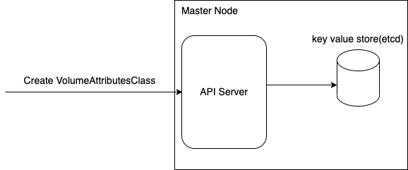
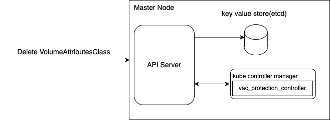
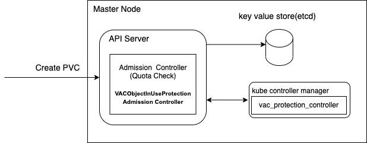
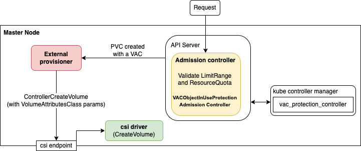
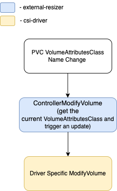
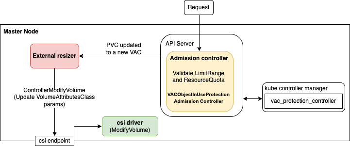
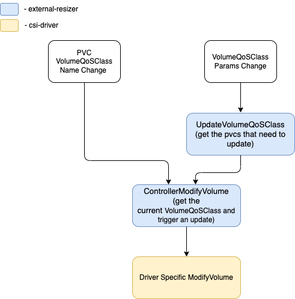

# KEP-3751: Kubernetes Volume Provisioned IO

<!-- toc -->
- [Release Signoff Checklist](#release-signoff-checklist)
- [Summary](#summary)
- [Motivation](#motivation)
  - [Goals](#goals)
  - [Non-Goals](#non-goals)
- [Proposal](#proposal)
  - [Kubernetes API](#kubernetes-api)
    - [Quota](#quota)
  - [CSI API](#csi-api)
  - [User Stories (Optional)](#user-stories-optional)
    - [Default VolumeAttributesClass](#default-volumeattributesclass)
    - [Pre-provisioned Volume](#pre-provisioned-volume)
    - [Provisioned Create](#provisioned-create)
    - [Volume Attributes Updates](#volume-attributes-updates)
    - [Administrator Quota Restrictions](#administrator-quota-restrictions)
  - [Notes/Constraints/Caveats (Optional)](#notesconstraintscaveats-optional)
  - [Risks and Mitigations](#risks-and-mitigations)
- [Proposed Changes](#proposed-changes)
  - [1. Add Create/Delete VolumeAttributesClass support in Kubernetes including vac_admission_controller and vac_protection_controller for deletion protection.](#1-add-createdelete-volumeattributesclass-support-in-kubernetes-including-vac_admission_controller-and-vac_protection_controller-for-deletion-protection)
  - [2. Update quota code to include and validate VolumeAttributesClass usage of PVCs.](#2-update-quota-code-to-include-and-validate-volumeattributesclass-usage-of-pvcs)
  - [3. Add new statuses in PVC API to indicate changes of VolumeAttributesClass and the status of the ModifyVolume operation.](#3-add-new-statuses-in-pvc-api-to-indicate-changes-of-volumeattributesclass-and-the-status-of-the-modifyvolume-operation)
  - [4. Add new CSI API ControllerModifyVolume, when there is a change of VolumeAttributesClass in PVC, external-resizer triggers a ControllerModifyVolume operation against a CSI endpoint. A Controller Plugin MUST implement this RPC call if it has MODIFY_VOLUME capability.](#4-add-new-csi-api-controllermodifyvolume-when-there-is-a-change-of-volumeattributesclass-in-pvc-external-resizer-triggers-a-controllermodifyvolume-operation-against-a-csi-endpoint-a-controller-plugin-must-implement-this-rpc-call-if-it-has-modify_volume-capability)
  - [5. Add new operation metrics for ModifyVolume operations](#5-add-new-operation-metrics-for-modifyvolume-operations)
- [Design Details](#design-details)
    - [Binding of PV and PVC](#binding-of-pv-and-pvc)
      - [Find a PV matching the PVC](#find-a-pv-matching-the-pvc)
      - [Perform the binding](#perform-the-binding)
    - [VolumeAttributesClass Deletion Protection](#volumeattributesclass-deletion-protection)
    - [Create VolumeAttributesClass](#create-volumeattributesclass)
    - [Delete VolumeAttributesClass](#delete-volumeattributesclass)
    - [Create PVC and Create Volume](#create-pvc-and-create-volume)
    - [Delete PVC](#delete-pvc)
    - [Modify PVC](#modify-pvc)
  - [Implementation &amp; Handling Failure](#implementation--handling-failure)
  - [Test Plan](#test-plan)
      - [Prerequisite testing updates](#prerequisite-testing-updates)
      - [Unit tests](#unit-tests)
      - [Integration tests](#integration-tests)
      - [e2e tests](#e2e-tests)
      - [Stress tests](#stress-tests)
  - [Graduation Criteria](#graduation-criteria)
    - [Alpha](#alpha)
    - [Alpha -&gt; Beta](#alpha---beta)
    - [Beta](#beta)
    - [GA](#ga)
  - [Upgrade / Downgrade Strategy](#upgrade--downgrade-strategy)
  - [Version Skew Strategy](#version-skew-strategy)
  - [Feature Flag Combinations](#feature-flag-combinations)
- [Production Readiness Review Questionnaire](#production-readiness-review-questionnaire)
  - [Feature Enablement and Rollback](#feature-enablement-and-rollback)
  - [Rollout, Upgrade and Rollback Planning](#rollout-upgrade-and-rollback-planning)
  - [Monitoring Requirements](#monitoring-requirements)
  - [Dependencies](#dependencies)
  - [Scalability](#scalability)
  - [Troubleshooting](#troubleshooting)
- [Implementation History](#implementation-history)
- [Drawbacks](#drawbacks)
- [Alternatives](#alternatives)
  - [Other Solutions:](#other-solutions)
  - [Option 1: First class only Iops and throughput](#option-1-first-class-only-iops-and-throughput)
    - [Kubernetes API](#kubernetes-api-1)
      - [CSI API](#csi-api-1)
      - [Pros:](#pros)
      - [Cons:](#cons)
    - [Option 2: Opaque map in CreateVolume and ModifyVolume requests by end users](#option-2-opaque-map-in-createvolume-and-modifyvolume-requests-by-end-users)
      - [Pros:](#pros-1)
      - [Cons:](#cons-1)
    - [Option 3: A cluster administrator modifies the VolumeAttributesClass parameters which will cause all PVCs using that performance class to be updated.](#option-3-a-cluster-administrator-modifies-the-volumeattributesclass-parameters-which-will-cause-all-pvcs-using-that-performance-class-to-be-updated)
    - [CreateVolume](#createvolume)
    - [ModifyVolume](#modifyvolume)
      - [Pros:](#pros-2)
      - [Cons:](#cons-2)
  - [Appendix - Current SPs Case Study](#appendix---current-sps-case-study)
- [Infrastructure Needed (Optional)](#infrastructure-needed-optional)
<!-- /toc -->

## Release Signoff Checklist

Items marked with (R) are required *prior to targeting to a milestone / release*.

- [X] (R) Enhancement issue in release milestone, which links to KEP dir in [kubernetes/enhancements] (not the initial KEP PR)
- [ ] (R) KEP approvers have approved the KEP status as `implementable`
- [X] (R) Design details are appropriately documented
- [ ] (R) Test plan is in place, giving consideration to SIG Architecture and SIG Testing input (including test refactors)
    - [ ] e2e Tests for all Beta API Operations (endpoints)
    - [ ] (R) Ensure GA e2e tests for meet requirements for [Conformance Tests](https://github.com/kubernetes/community/blob/master/contributors/devel/sig-architecture/conformance-tests.md)
    - [ ] (R) Minimum Two Week Window for GA e2e tests to prove flake free
- [ ] (R) Graduation criteria is in place
    - [ ] (R) [all GA Endpoints](https://github.com/kubernetes/community/pull/1806) must be hit by [Conformance Tests](https://github.com/kubernetes/community/blob/master/contributors/devel/sig-architecture/conformance-tests.md)
- [ ] (R) Production readiness review completed
- [ ] (R) Production readiness review approved
- [X] "Implementation History" section is up-to-date for milestone
- [X] User-facing documentation has been created in [kubernetes/website], for publication to [kubernetes.io]
- [ ] Supporting documentation—e.g., additional design documents, links to mailing list discussions/SIG meetings, relevant PRs/issues, release notes

[kubernetes.io]: https://kubernetes.io/
[kubernetes/enhancements]: https://git.k8s.io/enhancements
[kubernetes/kubernetes]: https://git.k8s.io/kubernetes
[kubernetes/website]: https://git.k8s.io/website

## Summary

Cloud providers and storage vendors offer volumes which allow specifying IO quality of service (Performance) parameters like IOPS or throughput and tuning them as workloads operate. ([1](https://docs.aws.amazon.com/AWSEC2/latest/UserGuide/requesting-ebs-volume-modifications.html), [2](https://cloud.google.com/blog/products/storage-data-transfer/learn-about-google-clouds-latest-storage-product-innovations), [3](https://cloud.google.com/compute/docs/disks/extreme-persistent-disk), [4](https://learn.microsoft.com/en-us/azure/virtual-machines/disks-types#premium-ssd-v2), [5](https://learn.microsoft.com/en-us/azure/virtual-machines/disks-types#ultra-disk-performance), [6](https://www.alibabacloud.com/help/en/elastic-compute-service/latest/essd-autopl)). While these parameters can be specified as storage class parameters to be set at provisioning time, Kubernetes has no API which allows changing them. Only capacity can be changed through the volume expansion API. This KEP proposes an extension to the Kubernetes Persistent Volume API to allow users to dynamically control these volume options.

## Motivation

In practice, workloads may scale vertically up to a certain point but then must partition horizontally. The system scales up and down horizontally with partition and at the same time provides a software layer to manage key attributes such as iops/throughput independently from capacity.

Currently after CreateVolume with provider specific parameters pass in storage class, Kubernetes does not handle update of volume attributes other than capacity. The only way to achieve this is to use the cloud provider's API directly to modify iops and throughput. This creates frictions of managing storage resources on k8s. Allowing Resources to be changed without managing it through different provider's APIs directly simplifies this whole process.

### Goals

* Cloud-provider and storage vendor independent specification of basic volume attributes parameters
* Volume attributes enforcement performed by the storage
* Specifying volume attributes at volume creation
* Changing volume attributes parameters on-line for existing volumes
* Volume attributes modifiable non disruptively by workload developers
* ResourceQuota enforcement by VolumeAttributesClass

### Non-Goals

* OS-level IO volume attributes, for example cgroup policy
* Inter-pod volume attributes. This KEP is restricted to what attributes can be defined on a volume.
* Scheduling based on total specific volume attributes limits of a node. For example, total throughput for many cloud provider network attached storage volumes is limited by instance network bandwidth and may prevent achieving the provisioned IO. Scheduling to mitigate these factors is out of scope but it should be considered as a future extension of this KEP.

## Proposal

### Kubernetes API
We need to add a new resource object VolumeAttributesClass to Kubernetes API, also a new admission controller and vac protection controller. Please see more in [Design Details](#bookmark=id.wtvwymf8202g).

The reason why we cannot use StorageClass.parameters is because StorageClass is immutable today. The design is to introduce a VolumeAttributesClass with parameters. Although these parameters are still immutable within a VolumeAttributesClass, the name of VolumeAttributesClass in a PVC can be modified. This allows the parameters representing volume attributes to be updated after a volume is created.

If there is conflict between StorageClass.parameters and VolumeAttributesClass.parameters, the driver should return an error.

```
type VolumeAttributesClass struct {
  metav1.TypeMeta
  // +optional
  metav1.ObjectMeta

  // Name of the CSI driver
  // This field is immutable.
  DriverName string

  // parameters hold volume attributes defined by the CSI driver. These values
  // are opaque to the Kubernetes and are passed directly to the CSI driver.
  // The underlying storage provider supports changing these attributes on an
  // existing volume, however the parameters field itself is immutable. To
  // invoke a volume update, a new VolumeAttributesClass should be created with
  // new parameters, and the PersistentVolumeClaim should be updated to reference
  // the new VolumeAttributesClass.
  // 
  // This field is required and must contain at least one key/value pair.
  // The keys cannot be empty, and the maximum number of parameters is 512, with
  // a cumulative max size of 256K. If the CSI driver rejects invalid parameters,
  // the target PersistentVolumeClaim will be set to an "Infeasible" state in the
  // modifyVolumeStatus field.
  Parameters map[string]string
}

type PersistentVolumeSpec struct {
  ...
  // Name of VolumeAttributesClass to which this persistent volume belongs. Empty value
  // is not allowed. Use nil to indicate that this volume does not belong to any 
  // VolumeAttributesClass.
  // +optional
  VolumeAttributesClassName *string
  ...
}

type PersistentVolumeClaimSpec struct {
  ...
  // Name of the VolumeAttributesClass required by the claim.
  // The VolumeAttributesClassName string cannot be empty
  // More info: https://kubernetes.io/docs/concepts/storage/persistent-volumes/#class-1
  // +optional
  VolumeAttributesClassName *string
  ...
}

// Add the PersistentVolumeClaimModifyVolume condition to existing PersistentVolumeClaimConditionType
// Condition is used to document the last error controller sees
const (
  ...
  // Applying the target VolumeAttributesClass encountered an error
  PersistentVolumeClaimVolumeModifyVolumeError PersistentVolumeClaimConditionType = "ModifyVolumeError"
  // Volume is being modified
  PersistentVolumeClaimVolumeModifyingVolume PersistentVolumeClaimConditionType = "ModifyingVolume"
  ...
)


// PersistentVolumeClaimStatus represents the status of PV claim
type PersistentVolumeClaimStatus struct {
  ...
  // CurrentVolumeAttributesClassName is the current name of the VolumeAttributesClass the PVC is using
  CurrentVolumeAttributesClassName *string
  // ModifyVolumeStatus represents the status object of ControllerModifyVolume operation
  ModifyVolumeStatus *ModifyVolumeStatus
  ...
}

// ModifyVolumeStatus represents the status object of ControllerModifyVolume operation
type ModifyVolumeStatus struct {
  // TargetVolumeAttributesClassName is the name of the VolumeAttributesClass the PVC currently being reconciled
  TargetVolumeAttributesClassName string
  // Status is the status of the ControllerModifyVolume operation
  Status PersistentVolumeClaimModifyVolumeStatus
}

// +enum
// New statuses can be added in the future. Consumers should check for unknown statuses and fail appropriately
type PersistentVolumeClaimModifyVolumeStatus string

const (
  // Pending indicates that the PersistentVolumeClaim cannot be modified due to unmet requirements, such as 
  // the specified VolumeAttributesClass not existing
  PersistentVolumeClaimModifyVolumePending PersistentVolumeClaimModifyVolumeStatus = "Pending"
  // InProgress indicates that the volume is being modified
  PersistentVolumeClaimModifyVolumeInProgress PersistentVolumeClaimModifyVolumeStatus = "InProgress"
  // Infeasible indicates that the request has been rejected as invalid by the CSI driver. To
  // resolve the error, a valid VolumeAttributesClass needs to be specified
  PersistentVolumeClaimModifyVolumeInfeasible PersistentVolumeClaimModifyVolumeStatus = "Infeasible"
)

```

#### Quota

Cluster administrators can use K8s quota to specify how many PVCs can use a specific VolumeAttributesClass. There is no fine grained parameter specific quota control for this feature. Fine grained attributes key-value pair quota is not in scope of this KEP.

### CSI API
The CSI create request will be extended to add mutable parameters. A new ControllerModifyVolume RPC will be added. More details in [CSI Spec PR](https://github.com/container-storage-interface/spec/pull/544).


### User Stories (Optional)

#### Default VolumeAttributesClass

A default VolumeAttributesClass can be specified for the Kubernetes cluster. This default VolumeAttributesClass is then used to dynamically provision storage for PersistentVolumeClaims that do not require any specific VolumeAttributesClass. A cluster admin can use annotation to manage default VolumeAttributesClass. The default VolumeAttributesClass has an annotation volumeattributesclass.kubernetes.io/is-default-class set to true. Any other value or absence of the annotation is interpreted as false. 

Note: For Kubernetes versions ≤ v1.31, the VolumeAttributesClass feature does not support a default VolumeAttributesClass. This is because there is already a natural default for VolumeAttributesClass: no VolumeAttributesClass associated with the PersistentVolumeClaim. Furthermore, with a default, there would be added overhead for cluster operators in making sure a cluster's default StorageClass and default VolumeAttributesClass are compatible. Use-cases and support for Default VolumeAttributesClass will be re-evaluated during this feature's beta in Kubernetes v1.31.

#### Pre-provisioned Volume

The cluster admin has created a group of PVs with VolumeAttributesClass and an end user is binding PVCs to pre-provisioned PVs. The PVCs will honor the VolumeAttributesClass. It is up to the cluster admin to make sure the parameters in the PVs matching the parameters in the VolumeAttributesClass. This behavior is similar to StorageClass.

#### Provisioned Create

A customer knows the performance requirements for a database application they are deploying on a kubernetes cluster. In the StatefulSet volume template they specify the known performance requirements. When provisioning this volume, the cloud provider sets this provisioned performance value.

For creating volume, there are two different ways to configure the related parameters. Only **cluster administrators** should be able to create StorageClass and/or VolumeAttributesClass.

*   From storage class parameters(existing today):

```
apiVersion: storage.k8s.io/v1
kind: StorageClass
metadata:
  name: csi-sc-example
provisioner: pd.csi.storage.gke.io
parameters:
  ...
  provisioned-iops-on-create: '10000'
  provisioned-throughput-on-create: '100MiB/s'
volumeBindingMode: WaitForFirstConsumer
```


*   From VolumeAttributesClass(from this KEP)

```
apiVersion: storage.k8s.io/v1alpha1
kind: VolumeAttributesClass
metadata:
  name: silver
driverName: pd.csi.storage.gke.io
parameters:
  iops: "500"
  throughput: "50MiB/s"
```


```
apiVersion: storage.k8s.io/v1
kind: StorageClass
metadata:
  name: csi-gcepd
provisioner: pd.csi.storage.gke.io
volumeBindingMode: WaitForFirstConsumer
```

The driver is responsible for parsing and validating these parameters and making sure duplicate configuration is not allowed. End users will specify  the VolumeAttributesClass in the PVC object:

```
apiVersion: v1
kind: PersistentVolumeClaim
metadata:
  name: test-pv-claim
spec:
  storageClassName: csi-sc-example
  VolumeAttributesClassName: silver
  accessModes:
    - ReadWriteOnce
  resources:
    requests:
      storage: 64Gi
```

#### Volume Attributes Updates

A customer monitors the performance of a Cassandra cluster. They notice that volume IO is causing a bottleneck in performance. They update the PVCs in question by changing to a higher tier VolumeAttributesClass managed by the cluster administrator to increase the provisioned IO and realize improved performance.

Before:

```
apiVersion: storage.k8s.io/v1alpha1
kind: VolumeAttributesClass
metadata:
  name: silver
driverName: pd.csi.storage.gke.io
parameters:
  iops: "500"
  throughput: "50MiB/s"
```

```
apiVersion: v1
kind: PersistentVolumeClaim
metadata:
  name: test-pv-claim
spec:
  storageClassName: csi-sc-example
  VolumeAttributesClassName: silver
  accessModes:
    - ReadWriteOnce
  resources:
    requests:
      storage: 64Gi
```

After:

```
apiVersion: storage.k8s.io/v1alpha1
kind: VolumeAttributesClass
metadata:
  name: gold
driverName: pd.csi.storage.gke.io
parameters:
  iops: "1000"
  throughput: "100MiB/s"
```

```
apiVersion: v1
kind: PersistentVolumeClaim
metadata:
  name: test-pv-claim
spec:
  storageClassName: csi-sc-example
  VolumeAttributesClassName: gold
  accessModes:
    - ReadWriteOnce
  resources:
    requests:
      storage: 64Gi
```

#### Administrator Quota Restrictions

A cluster admin wants to control costs while giving application developers the freedom to optimize their applications. They set a per VolumeAttributesClass limit to the maximum count of PVCs that can be specified in a cluster ResourceQuota. When an application dev modifies a PVC to request a higher tier of VolumeAttributesClass but there is no quota, the request is rejected. As the ResourceQuota is a namespaced object, only the cluster admin and not application devs can change limits.

An example of defining ResourceQuota with [Scope](https://kubernetes.io/docs/concepts/policy/resource-quotas/#quota-scopes) for VolumeAttributesClass:

```
apiVersion: v1
kind: ResourceQuota
metadata:
  name: gold-pvcs
spec:
  hard:
    requests.storage: "10Gi"
    count/persistentvolumeclaims: "10"
  scopeSelector:
    matchExpressions:
    - operator : In
      scopeName: VolumeAttributesClass # Match persistentvolumesclaims that references the specified volume attributes class.
      values: ["gold"]
```

The VolumeAttributesClass scope restricts a quota to track the following resource: PVCs in a VolumeAttributesClass and capacity. We are calculating spec.volumeAttributesClass, status.currentVolumeAttributesClass and status.modifyVolumeStatus.targetVolumeAttributesClassName with support of matchExpressions(In, NotIn, Exists, DoesNotExist).

Note: 
1. The quota check is only happening at the spec.volumeAttributesClass update. Thus quota check will NOT block status(status.currentVolumeAttributesClass and status.modifyVolumeStatus.targetVolumeAttributesClassName) update in external-resizer.
2. These Administrator Quota Restrictions are not available for Kubernetes versions ≤ v1.31, due to a [bug](https://github.com/kubernetes/kubernetes/issues/124436) in the implementation of the `scopeSelector` feature. Because there is no default quota, we will be able to add quota support in a future version of Kubernetes without breaking existing workloads.

### Notes/Constraints/Caveats (Optional)

The parameters in VolumeAttributesClass are opaque and immutable. This gives different cloud providers flexibility but at the same time it is up to the specific driver to verify the values set in the parameters. The parameters from VolumeAttributesClass associated with a volume are mutable because they are coming from different VolumeAttributesClasses.

### Risks and Mitigations

Users may configure both parameters in StorageClass and parameters in VolumeAttributesClass differently. The mitigation here is to provide a guideline of solving conflicts. Drivers should return an error if they are conflicting. If the MODIFY_VOLUME capability is present, VolumeAttributesClass should be honored.

## Proposed Changes

As part of this proposal, we are proposing:


### 1. Add Create/Delete VolumeAttributesClass support in Kubernetes including vac_admission_controller and vac_protection_controller for deletion protection. 

### 2. Update quota code to include and validate VolumeAttributesClass usage of PVCs.

The ResourceQuota plug-in introspects all incoming admission requests. If acceptance of the resource would cause the total usage of a named resource to exceed its limit, the request is denied. In our case we need to introduce a new scope name `VolumeAttributesClass`, and then count the total of PVCs with spec.volumeAttributesClass, status.currentVolumeAttributesClass and status.modifyVolumeStatus.targetVolumeAttributesClassName equal a VolumeAttributesClass.

The resource quota controller is the only component capable of monitoring and recording usage updates after a DELETE operation since admission control is incapable of guaranteeing a DELETE request actually succeeded.

### 3. Add new statuses in PVC API to indicate changes of VolumeAttributesClass and the status of the ModifyVolume operation.

Please see session "Kubernetes API" above.

### 4. Add new CSI API ControllerModifyVolume, when there is a change of VolumeAttributesClass in PVC, external-resizer triggers a ControllerModifyVolume operation against a CSI endpoint. A Controller Plugin MUST implement this RPC call if it has MODIFY_VOLUME capability. 

### 5. Add new operation metrics for ModifyVolume operations

A. Count of bound/unbound PVCs per VolumeAttributesClass similar to [existing PV Collector metrics](https://github.com/kubernetes/kubernetes/blob/666fc23fe4d6c84b1dde2b8d4ebf75fce466d338/pkg/controller/volume/persistentvolume/metrics/metrics.go#L98). 

Prior to this enhancement, we loop through all PVCs, check if `pvc.Status.Phase == v1.VolumeBound` and increment the relevant metric only on `namespace` dimension. When the feature flag is enabled, new metrics will take into account `namespace`, `storage_class`, and `volume_attribute_class`. 

With these additional labels, cluster operators can alarm on these new metrics to detect PVCs that are not able to bind. With the additional StorageClass and VolumeAttributesClass name labels, cluster operators can more easily check whether VolumeAttributeClass or StorageClass object misconfiguration is the cause of these binding issues.

```
boundPVCCountWithVACDesc = metrics.NewDesc(
	metrics.BuildFQName("", pvControllerSubsystem, boundPVCWithVACKey),
	"Gauge measuring number of persistent volume claims currently bound",
	[]string{namespaceLabel, storageClassLabel, volumeAttributesClassLabel}, nil,
	metrics.ALPHA, "")
unboundPVCCountWithVACDesc = metrics.NewDesc(
	metrics.BuildFQName("", pvControllerSubsystem, unboundPVCWithVACKey),
	"Gauge measuring number of persistent volume claims currently unbound",
	[]string{namespaceLabel, storageClassLabel, volumeAttributesClassLabel}, nil,
	metrics.ALPHA, "")
```

B. Operation metrics for ControllerModifyVolume 

The metrics `controller_modify_volume_total` `controller_modify_volume_errors_total` can be used to issues in volume modification.

There are operation metrics from [csiOperationsLatencyMetric](https://github.com/kubernetes-csi/csi-lib-utils/blob/597d128ce3a24d9e3fd5ff5b8d1ff4fd862e543a/metrics/metrics.go#LL250C6-L250C32) for the ModifyVolume operation to report latencies.

Finally, CSI Driver Plugin maintainers can expose their own metrics.  

## Design Details

#### Binding of PV and PVC

Creating the bidirectional binding between a PV and PVC is delicate, because
there is no transaction support in the kubernetes API to do the whole thing
atomically. Binding with volume attributes adds to this process but does not
fundamentally change the 4 steps performed. To support the VolumeAttributesClass
the binding process will become the following.

A key assumption is that the PVC needs to be immutable until binding is
complete. This is to avoid race conditions that could, among other things,
violate quota. For example, suppose there are two VACs, `fast` and `slow`. The
latter is cheap and unrestricted, but `fast` has limited quota requirements. It
is not possible to downgrade `fast` to `slow`. If
VAC could be changed before binding is complete, a user could create a PVC with
`fast` and change it to `slow` during the binding process. This race with
binding could end up with a `fast` PV bound to the PVC with a `slow` VAC;
because it is not possible to downgrade the PV will remain `fast`. But since VAC
quota only looks at the PVC's VAC, the user is now able to create additional
`fast` volumes beyond their quota.

An alternative of requiring VAC to match at all steps of binding means that if
the VAC is changed by mistake, a PVC and PV could be incompletely bound (for
example, succeed steps 1-3 below but fail at step 4). There is no way to undo
binding, so even if the PV is deleted the PV would be unavailable until the
cluster administrator manually intervenes.

##### Find a PV matching the PVC

In the matching process, a PVC is only matched with a PV if their VACs match:
they are the same class, or are both unspecified. Either a nil or an empty VAC
is considered unspecified, so for example a PVC with a nil VAC **can** match
with a PV whose VAC is the empty string.

The matching process then become the following.

If the PVC is pre-bound to a PV, check if node affinity is satisfied, and the
PVC VAC matches the PV VAC. If so select it, otherwise no PV is selected.

Otherwise, iterate through all unbound PVs. Check if the storage class and
volume attributes class of the PV matches the PVC, and the capacity is equal to
or greater than that requested by the PVC. If so, add it to the list of
candidates. After all unbound PVs have been examined, select the candidate with
the smallest capacity.

##### Perform the binding

1. Bind the PV to the PVC by updating `pv.Spec.ClaimRef` to point to the PVC.
1. Update the PV volume phase to Bound.
1. Bind the PVC to the PV by updating `pvc.Spec.VolumeName` to point to the PV.
1. Update the PVC claim status, including current volume attributes class, phase
and capacity.

The changes from when there was no VolumeAttributesClass are:
* Change the matching algorithm to be aware of volume attributes.
* Change the last step in binding to update the PVC status indicating the
  current volume attributes.
  
Otherwise the algorithm is unchanged.

As discussed above, this assumes the PVC VAC is immutable until it is bound to a
PVC. If a PVC cannot be bound due to an otherwise matching PV having the wrong
VAC, the PVC must be deleted and re-created.

#### VolumeAttributesClass Deletion Protection

While a VolumeAttributesClass is referenced by any PVC, we will prevent the object from being deleted by adding a finalizer `kubernetes.io/vac-protection`. It's a best effort to prevent users from making mistakes. It may not be accurate in all cases.

The **vac_finalizer_controller** sets/removes the finalizer on all VolumeAttributesClasses. It has PVC/PV informers with a custom indexer which is used to list all PVCs/PVs for a given VolumeAttributesClass name. 

There are a few conditions that will trigger add/remove the finalizer in the VolumeAttributesClass:

1. PVC created with a VolumeAttributesClass
    The **vac_finalizer_controller**:
    * If the VolumeAttributesClassName is nil or empty, do nothing.
    * Check if the VolumeAttributesClass exists. If not, do nothing.
    * Check if this VolumeAttributesClass already has a protection finalizer
    * Add the finalizer to the VolumeAttributesClass if there is none 
2. PVC updated to a different VolumeAttributesClass
    * The **vac_finalizer_controller** will remove finalizer in the VolumeAttributesClass only if after listing all the PVCs/PVs from informers via a custom indexer and confirm that this PVC/PV is the last one that is consuming the VolumeAttributesClass in the vac_finalizer_controller cache
    * Check if the new VolumeAttributesClass already has a protection finalizer
    * Add the finalizer to the new VolumeAttributesClass if there is nones
3. PVC has a VolumeAttributesClass and this PVC is deleted
    * The **vac_finalizer_controller** will remove finalizer in the VolumeAttributesClass only if after listing all the PVCs/PVs from informers via a custom indexer and confirm that this PVC/PV is the last one that is consuming the VolumeAttributesClass in the informer(a cache of VolumeAttributesClass) **only**
4. Delete a VolumeAttributesClass while there is **kubernetes.io/vac-protection** finalizer associated with this VolumeAttributesClass
    * Remove the finalizer only if there is no PVC/PV using this VolumeAttributesClass anymore. The check logic is the same as above.

For PVs referencing a VAC:

1. Unbound PV created with a VolumeAttributesClass
    The **vac_finalizer_controller**:
    * If the VolumeAttributesClassName is nil or empty, do nothing
    * Check if this VolumeAttributesClass already has a protection finalizer
    * Add the finalizer to the VolumeAttributesClass if there is none
2. PV has a VolumeAttributesClass and this PV is deleted
    * The **vac_finalizer_controller** will remove finalizer in the VolumeAttributesClass only if after listing all the PVCs/PVs from informers via a custom indexer and confirm that this PVC/PV is the last one that is consuming the VolumeAttributesClass in the informer(a cache of VolumeAttributesClass) **only**

Only the **vac_finalizer_controller** will remove finalizers on VolumeAttributesClass. If the **vac_finalizer_controller** fails at the step of removing finalizer even there is no PVC/PV using the VolumeAttributesClass anymore, the **vac_finalizer_controller** should retry it in next reconcile loop.

The vac_finalizer_controller will use only informers and therefore it may remove the finalizer too early. One scenario is:

1. There is a VolumeAttributesClass that is not used by any PVC. This VolumeAttributesClass is synced to all informers (external-provisioner, external-resizer, KCM)
2. At the same time:
  * User creates a PVC that uses this VolumeAttributesClass
  * Another user deletes the VolumeAttributesClass
3. VolumeAttributesClass deletion event with DeletionTimestamp reaches vac_finalizer_controller. Because the PVC creation event has not yet reached KCM informers, the controller lets the VolumeAttributesClass to be deleted by removing the finalizer. PVC creation event reaches the external-provisioner, before VolumeAttributesClass update. The external-provisioner will try to provision a new volume using the VolumeAttributesClass that will get deleted soon.
  * If the external-provisioner gets the VolumeAttributesClass before deletion in the informer, the provisioning will succeed
  * Otherwise the external-prosivioner will fail the provisioning

Solving this scenario properly requires to Get/List requests to the API server, which will cause performance issue in larger cluster similar to the existing PVC protection controller - [related issue](https://github.com/kubernetes/kubernetes/issues/109282).

Since finalizer is more of a best effort instead of accuracy to prevent users making mistakes. The cluster admin can still force add/delete finalizers to the VAC when needed.

#### Create VolumeAttributesClass

A new Kubernetes resource object VolumeAttributesClass will be added.

```
// Example VolumeAttributesClass
apiVersion: storage.k8s.io/v1alpha1
kind: VolumeAttributesClass
metadata:
  name: silver
driverName: pd.csi.storage.gke.io
parameters:
  iops: "500"
  throughput: "50MiB/s"
```



#### Delete VolumeAttributesClass

[Finalizers](https://kubernetes.io/docs/concepts/overview/working-with-objects/finalizers/#:~:text=Finalizers%20are%20namespaced%20keys%20that,resources%20the%20deleted%20object%20owned.) manage the deletion of a VolumeAttributesClass. Refer to [pvc_protection_controller](https://github.com/kubernetes/kubernetes/pull/55824/files), we will add a vacProtectionController in kube-controller-manager/app/core.go. It will have pvcLister/pvcInformer and vacLister/vacInformer.


```
vacInformer.Informer().AddEventHandler(cache.ResourceEventHandlerFuncs{
        AddFunc: e.vacAddedUpdated,
        UpdateFunc: func(old, new interface{}) {
                e.vacAddedUpdated(new)
        },
})

pvcInformer.Informer().AddEventHandler(cache.ResourceEventHandlerFuncs{
        AddFunc: func(obj interface{}) {
                e.pvcAddedDeletedUpdated(nil, obj, false)
        },
        DeleteFunc: func(obj interface{}) {
                e.pvcAddedDeletedUpdated(nil, obj, true)
        },
        UpdateFunc: func(old, new interface{}) {
                e.pvcAddedDeletedUpdated(old, new, false)
        },
})

```

After a delete VolumeAttributesClass request is made, it will add a deletionTimestamp and then confirm with the vac_protection_controller to see if there are any finalizers of that VolumeAttributesClass. The VolumeAttributesClass will only be deleted if there are no more finalizers.

If the user decides to create a new VolumeAttributesClass with the exact same name, the creation will fail because the Kubernetes API server will refuse creating new objects with the same name until the old objects are deleted.



#### Create PVC and Create Volume

The pvc config will have a new field VolumeAttributesClassName.

A new finalizer **kubernetes.io/vac-protection** will be added to the VolumeAttributesClass the PVC is consuming from a new vacProtectionController. We also need a new admission controller [vacobjectinuseprotection](https://github.com/kubernetes/kubernetes/tree/master/plugin/pkg/admission/storage)/admission.go.



The components involved in CreateVolume:




#### Delete PVC

Deleting a PVC will trigger a list PVCs call and decide if we need to remove the finalizer **[kubernetes.io/vac-protection](kubernetes.io/vpc-protection) **via the vac_protection_controller.


#### Modify PVC



Since VolumeAttributesClass is **immutable**, to update the parameters, the end
user can modify the PVC object to set a different VolumeAttributesClass. If the
existing VolumeAttributesClass cannot satisfy the end user’s use case, the end
user needs to contact the cluster administrator to create a new
VolumeAttributesClass. The VAC cannot be changed until the PVC is bound to a PV
(see [binding](#binding-of-pv-and-pvc), above). This is enforced in API
validation in the same way as storage capacity, see
[ValidatePersistentVolumeClaimUpdate](https://github.com/kubernetes/kubernetes/blob/master/pkg/apis/core/validation/validation.go#L2389).


**Watching changes in the PVC object**, if the PVC’s VolumeAttributesClass changes, it will trigger a ModifyVolume call.

```
apiVersion: storage.k8s.io/v1alpha1
kind: VolumeAttributesClass
metadata:
  name: gold
driverName: pd.csi.storage.gke.io
parameters:
  iops: "1000"
  throughput: "100MiB/s"
```

```
apiVersion: v1
kind: PersistentVolumeClaim
metadata:
  name: test-pv-claim
spec:
  storageClassName: csi-sc-example
  VolumeAttributesClassName: gold
  accessModes:
    - ReadWriteOnce
  resources:
    requests:
      storage: 64Gi
```



ModifyVolume is only allowed on bound PVCs. Under the ModifyVolume call, it will pass in the mutable parameters and do the update operation based on the `VolumeAttributesClass` parameters.


### Implementation & Handling Failure

VolumeAttributesClass parameters can be considered as best-effort parameters, the CSI driver should report the status of bad parameters as INVALID_ARGUMENT and the volume would fall back to a workable default configuration.

### Test Plan

* Basic unit tests for performance and quota system.
* API conformance tests
* E2E tests with happy tests in the [K8s storage framework](https://github.com/kubernetes/kubernetes/tree/master/test/e2e/storage/testsuites) for different drivers testing
* E2E tests using mock driver to cause failure on create, update and recovering cases
  * [K8s storage framework](https://github.com/kubernetes/kubernetes/tree/master/test/e2e/storage/testsuites)
  * [csi-tes](https://github.com/kubernetes-csi/csi-test)
* Test coverage of quota usage with ResourceQuota and LimitRange
* Measure latency impact to CreateVolume during beta and provide feedback to operators
* Upgrade and rollback test when the feature gate changes to beta

##### Prerequisite testing updates

##### Unit tests

For three components: external-provisioner, external-resizer, kube-apiserver, kube-controller-manager.

##### Integration tests

<!--
This question should be filled when targeting a release.
For Alpha, describe what tests will be added to ensure proper quality of the enhancement.

For Beta and GA, add links to added tests together with links to k8s-triage for those tests:
https://storage.googleapis.com/k8s-triage/index.html
-->

- The behavior with feature gate and API turned on/off and mix match
- The happy path with creating and modifying volume successfully with VolumeAttributesClass
  - [E2E CSI Test PR](https://github.com/kubernetes/kubernetes/pull/124151/)
  - [k8s-triage](https://storage.googleapis.com/k8s-triage/index.html?sig=storage&test=%5C%5BFeature%3AVolumeAttributesClass%5C%5D)
  - [Testgrid](https://testgrid.k8s.io/sig-storage-kubernetes#kind-alpha-features&include-filter-by-regex=%5BFeature%3AVolumeAttributesClass%5D&include-filter-by-regex=%5BFeature%3AVolumeAttributesClass%5D&include-filter-by-regex=%5C%5BFeature%3AVolumeAttributesClass%5C%5D)

##### e2e tests

<!--
This question should be filled when targeting a release.
For Alpha, describe what tests will be added to ensure proper quality of the enhancement.

For Beta and GA, add links to added tests together with links to k8s-triage for those tests:
https://storage.googleapis.com/k8s-triage/index.html

We expect no non-infra related flakes in the last month as a GA graduation criteria.
-->

- Create VolumeAttributesClass successfully
- Delete VolumeAttributesClass with finalizer fails
- Delete VolumeAttributesClass without finalizer succeeds
- For CreateVolume, CSI volume exceeds VolumeAttributesClass quota limit should not be created.
- Give a driver that supports ControllerModifyVolume, CSI volume should be modified and able to complete successfully.
- Give a driver that does not ControllerModifyVolume, CSI volume should not be modified.
- If ControllerModifyVolume fails, PVC should have appropriate events.

[API Conformance Test PR](https://github.com/kubernetes/kubernetes/pull/121849)

##### Stress tests

- VAC protection controller with large lists of PVCs (2000)
- Creating a large amount of PVCs (2000) using the same VolumeAttributesClass

### Graduation Criteria

#### Alpha

- Feature in 1.29 behind the VolumeAttributesClass feature gate which is set to a default of false
- Add basic unit tests
- An issue board will be created to track issues, and resolving them at the same time

#### Alpha -> Beta
- Unit tests and e2e tests outlined in design proposal implemented

#### Beta

- Beta in 1.31: Since this feature is an extension of the external-resizer/external-provisioner usage flow, we are going to move this to beta with enhanced e2e and test coverage. Test cases are covered in sessions above: ``e2e tests``, ``Integration tests`` etc. Controllers will handle VolumeAttributesClass feature gates being on by default, but beta API itself being disabled on cluster by default. 
- Involve 3 different CSI drivers to participate in testing
- Stress test before GA

#### GA

- GA in 1.3x, all major issues in the issue board should be fixed before GA.
- No users complaining about the new behavior

### Upgrade / Downgrade Strategy

No change in cluster upgrade / downgrade process.

### Version Skew Strategy

N/A

### Feature Flag Combinations

This feature is implemented only in the API server and KCM and controlled by
`VolumeAttributesClass` feature gate. Following cases may happen:

| API server | external-provisioner/external-resizer | Behavior                                                                                                                         |
|------------|-----|----------------------------------------------------------------------------------------------------------------------------------|
| off | off | Existing Kubernetes behavior.                                                                                                    |
| on | off| Existing Kubernetes behavior, API server gets requests of modify parameters in VolumeAttributesClass but does not act on it
| off | on | external-provisioner/external-resizer should not get any event to create PVC with VolumeAttributesClass/update VolumeAttributesClass, the current resize flow stays the same |
| on | on | New behavior.                                                                                                                    |

## Production Readiness Review Questionnaire

### Feature Enablement and Rollback

###### How can this feature be enabled / disabled in a live cluster?

- [x] Feature gate (also fill in values in `kep.yaml`)
    - Feature gate name: VolumeAttributesClass
    - Components depending on the feature gate: kube-apiserver,
      kube-controller-manager, external-provisioner, external-resizer
- [ ] Other
    - Describe the mechanism:

###### Does enabling the feature change any default behavior?

No. 

###### Can the feature be disabled once it has been enabled (i.e. can we roll back the enablement)?

Yes. It should be disabled in a reverse order of enabling the feature - 
first disable the feature in external-provisioner/external-resizer then in API server. See "Feature Flag Combinations" section above for more details.


###### What happens if we reenable the feature if it was previously rolled back?

No issues are expected. The ModifyVolume call is triggered by the change of VolumeAttributesClassName in the PVC, for existing PVC there is no update even the feature is reenabled. However after reenable the feature, the end user can create a PVC or modify a PVC with this preexisting VolumeAttributesClassName.

###### Are there any tests for feature enablement/disablement?

There are two new fields that needs to be handled in a special way. The feature 
gate just enables/disables a code path in external-provisioner/external-resizer which is covered
by a unit test that verifies the feature is properly disabled when the feature flag is turned off.

### Rollout, Upgrade and Rollback Planning

###### How can a rollout or rollback fail? Can it impact already running workloads?

In case the feature is not enabled during rollout due to a failure there
should be no impact and the behavior of StorageClass assignment will not change.
If the feature is rolled out partially on API servers, there will be no impact on running workloads because the request will
be processed as if the feature is disabled, the external-provisioner/external-resizer is not acting on the event created yet - that means nothing happens and PVC
will not be changed with the iops/throughput until external-provisioner/external-resizer is deployed.


###### What specific metrics should inform a rollback?

A metric `controller_modify_volume_errors_total` will indicate a problem with the feature.

###### Were upgrade and rollback tested? Was the upgrade->downgrade->upgrade path tested?

TODO Upgrade and rollback will be tested when the feature gate will change to beta.

###### Is the rollout accompanied by any deprecations and/or removals of features, APIs, fields of API types, flags, etc.?

No.

### Monitoring Requirements

###### How can an operator determine if the feature is in use by workloads?

A counter metric will be present in external-provisioner/external-resizer metric endpoint, it will show total
count of successful and failed ControllerModifyVolume.

###### How can someone using this feature know that it is working for their instance?

By inspecting a `controller_modify_volume_total` metric value. If the counter
is increasing while letting PVCs being updated retroactively the feature is enabled. And at the same time if
`controller_modify_volume_errors_total` counter does not increase the feature
works as expected.

###### What are the reasonable SLOs (Service Level Objectives) for the enhancement?

<!--
This is your opportunity to define what "normal" quality of service looks like
for a feature.

It's impossible to provide comprehensive guidance, but at the very
high level (needs more precise definitions) those may be things like:
  - per-day percentage of API calls finishing with 5XX errors <= 1%
  - 99% percentile over day of absolute value from (job creation time minus expected
    job creation time) for cron job <= 10%
  - 99.9% of /health requests per day finish with 200 code

These goals will help you determine what you need to measure (SLIs) in the next
question.
-->

- Ratio of `controller_modify_volume_errors_total`/`controller_modify_volume_total` <= 1%. (Exclude errors with `UNAVAILABLE` code which indicate some quota has been exhausted.) 
- CreateVolume `csi_sidecar_operations_seconds_sum` does not increase by more than 5% when feature flags are enabled. 

###### What are the SLIs (Service Level Indicators) an operator can use to determine the health of the service?

- [X] Metrics
    - Metric name: `controller_modify_volume_total` and `controller_modify_volume_errors_total`
    - [Optional] Aggregation method:
    - Components exposing the metric: external-resizer

###### Are there any missing metrics that would be useful to have to improve observability of this feature?

<!--
Describe the metrics themselves and the reasons why they weren't added (e.g., cost,
implementation difficulties, etc.).
-->
No.

### Dependencies

<!--
This section must be completed when targeting beta to a release.
-->

###### Does this feature depend on any specific services running in the cluster?

external-provisioner, external-resizer. 

### Scalability

<!--
For alpha, this section is encouraged: reviewers should consider these questions
and attempt to answer them.

For beta, this section is required: reviewers must answer these questions.

For GA, this section is required: approvers should be able to confirm the
previous answers based on experience in the field.
-->

###### Will enabling / using this feature result in any new API calls?

Yes. The VAC protection controller will be expensive because it needs to LIST PVCs/PVs but the call volume should be low.

- API call type: PATCH PVC
- estimated throughput: low, only once for PVCs that have
  VolumeAttributesClass field gets updated in PVC
- originating component(s): kube-controller-manager, external-resizer


###### Will enabling / using this feature result in introducing new API types?

Yes. VolumeAttributesClass.


###### Will enabling / using this feature result in any new calls to the cloud provider?

Yes. ControllerModifyVolume.

###### Will enabling / using this feature result in increasing size or count of the existing API objects?

Yes because this is adding new fields to PVC and PV.

###### Will enabling / using this feature result in increasing time taken by any operations covered by existing SLIs/SLOs?

Yes, the feature may impact CreateVolume. We will measure this impact during beta and provide feedback to operators.

###### Will enabling / using this feature result in non-negligible increase of resource usage (CPU, RAM, disk, IO, ...) in any components?

Using this feature may result in non-negligible increase of resource usage IF customers batch modify many volumes at once and CSI Controller Pod has high API Priority.
- external-resizer CPU and memory will see a non-negligible increase if users increased the number of concurrent operations via the `--workers` flag. We follow the strategy of sharing that limit between `ControllerExpandVolume` and `ControllerModifyVolume` RPCs, similar to how external-provisioner functions. 
- The API-Server may see a spike of CPU when processing relevant changes.

Stress tests will determine increase in resource usage at varying amounts of concurrent volume modifications. 

### Troubleshooting

<!--
This section must be completed when targeting beta to a release.

For GA, this section is required: approvers should be able to confirm the
previous answers based on experience in the field.

The Troubleshooting section currently serves the `Playbook` role. We may consider
splitting it into a dedicated `Playbook` document (potentially with some monitoring
details). For now, we leave it here.
-->

###### How does this feature react if the API server and/or etcd is unavailable?

No change from today's volume provisioning workflow if API Server / etcd are unavailable.

If API server and/or etcd is unavailable, there are two scenarios for volume modification workflow

1. External-resizer detects volume needing modification before API Server is made unavailable. Calls ControllerModifyVolume. Cloud provider will modify volume, report success to external resizer. External-resizer will be unable to update PVC object until API Server back online. Error will be logged. 

2. External-resizer does NOT detect volume needing modification before API Server is made unavailable. Volume modification will not take place until API Server back online. 

In both cases the PVC has not been updated to reflect new VolumeAttributesClass until API Server back online. 

###### What are other known failure modes?


<!--
For each of them, fill in the following information by copying the below template:
  - [Failure mode brief description]
    - Detection: How can it be detected via metrics? Stated another way:
      how can an operator troubleshoot without logging into a master or worker node?
    - Mitigations: What can be done to stop the bleeding, especially for already
      running user workloads?
    - Diagnostics: What are the useful log messages and their required logging
      levels that could help debug the issue?
      Not required until feature graduated to beta.
    - Testing: Are there any tests for failure mode? If not, describe why.
    -->
-->
- ControllerModifyVolume cannot modify volume to reflect new VolumeAttributesClass due to user misconfiguration or cloudprovider backend error/limits. Volume would fall back to workable default configuration but external-resizer will requeue with longer `Infeasible` interval. 
    - Detection: See event on PVC object. See increase in `controller_modify_volume_errors_total`
    - Mitigations: No serious mitigation needed because volume would fall back to previous configuration. Can edit PVC to previous VolumeAttributesClass to prevent retry ControllerModifyVolume calls. 
    - Diagnostics: 
        - Events on PVC which include the associated [ControllerModifyVolume error](https://github.com/container-storage-interface/spec/blob/master/spec.md#controllermodifyvolume-errors) and message
        - external-resizer container logs: Logs similar to "ModifyVolume failed..." (At Log Levels 2&3)
    - Testing: Are there any tests for failure mode? If not, describe why.
        - There are tests to that validate appropriate events/errors propagate.
    - Note: See [Modify Design](https://github.com/kubernetes/enhancements/tree/master/keps/sig-storage/3751-volume-attributes-class#modify-pvc) to see flow. 


###### What steps should be taken if SLOs are not being met to determine the problem?

When SLOs are not being met, PVC events should be observed. Debug level logging should be enabled on the appropriate containers (external-resizer for volume modifications, external-provisioner for volume creations, relevant CSI Driver plugin). If problem is not determined from PVC events, operator must look at debug logs to narrow problem to CSI Driver plugin or external sidecars. It may be helpful to see if volume was modified on storage backend. If problem is in CSI Driver plugin, must reach out to CSI Driver maintainers. Storage admin can requested for help finding root cause. 

## Implementation History

<!--
Major milestones in the lifecycle of a KEP should be tracked in this section.
Major milestones might include:
- the `Summary` and `Motivation` sections being merged, signaling SIG acceptance
- the `Proposal` section being merged, signaling agreement on a proposed design
- the date implementation started
- the first Kubernetes release where an initial version of the KEP was available
- the version of Kubernetes where the KEP graduated to general availability
- when the KEP was retired or superseded
-->
- 2023-06-15 SIG Acceptance of KEP and Agreement on proposed Volume Attributes Class design ([link](https://github.com/kubernetes/enhancements/commit/8929cf618f056e447d0b2bed562af3fc134c8cbb))
- 2023-06-26 Original demo of VolumeAttributesClass proof-of-concept
- 2023-10-31 VolumeAttributesClass API changes merged in kubernetes/kubernetes
- 2023-10-26 Implementation merged in kubernetes-csi/external-provisioner
- 2023-11-09 Implementation merged in kubernetes-csi/external-resizer
- First available release: Alpha in Kubernetes 1.29
- 2024-08-14: Beta in Kubernetes 1.31

Implementations in CSI Drivers:
- [AWS EBS CSI Driver](https://github.com/kubernetes-sigs/aws-ebs-csi-driver/blob/a402256d03ab3008f642e70253acb4b41d674af0/pkg/driver/controller.go#L581)
- [GCP PD CSI Driver](https://github.com/kubernetes-sigs/gcp-compute-persistent-disk-csi-driver/blob/a1ed4e4635274497b2cd0d87af2417c456b59b3a/pkg/gce-pd-csi-driver/controller.go#L765)

## Drawbacks

None that we are aware of

## Alternatives

### Other Solutions:

*   Modify the storage class in the PVC. See [this document](https://docs.google.com/document/d/1d5Ch54t8-uyORh56AP7rN9AkQfKuLBsCrrBjOohbWLA/edit?usp=sharing).
*   Pod Resources with existing [ResourceClaim KEP](https://github.com/kubernetes/enhancements/tree/master/keps/sig-node/3063-dynamic-resource-allocation).


### Option 1: First class only Iops and throughput

More details in [KEP-3751: Kubernetes Volume Provisioned IO - Revision 2](https://github.com/kubernetes/enhancements/pull/3780/commits/7e702c909383f01fdc7d3e6729b948aeeae63e49).

#### Kubernetes API

Add two well-known ResourceName keys to the existing ResourceList type used in PersistentVolumeClaim.Spec.Resources.{Limits,Requests} and PersistentVolume.Spec.Capacity:

*   (ReadWrite) IOPS independent from capacity
*   (ReadWrite) Throughput These values can be changed on a PersistentVolumeClaim, and will be reconciled against the storage provider in the same way as storage capacity resizing. The status of a PVC will reflect the currently provisioned IO as reported by the storage provider (in the same way that the status states the current size of the volume during a resize operation).

```
// Example:
kind: PersistentVolumeClaim
...
spec:
  ...
  resources:
requests:
  storage: 1024Gi
  throughput: 100 // MiB/s as unit
  iops: 1000     // IO/s as unit
// Vendors may add additional resources using Device Plugin syntax: vendor-domain/resourcetype
```

[Device Plugin](https://kubernetes.io/docs/concepts/extend-kubernetes/compute-storage-net/device-plugins/) is out of scope for this KEP and it is one of the options for configure vendor specific storage options.

Add PVC Status field; change ResizeStatus alpha field to AllocatedResourceStatus map.


##### CSI API

The CSI create request will be extended to add provisioned IO parameters. For volume creation, cloud providers can add iops and throughput field in parameters and process in the csi driver, an example:


```
apiVersion: storage.k8s.io/v1
kind: StorageClass
metadata:
  name: csi-gcepd
provisioner: pd.csi.storage.gke.io
parameters:
  type: hyperdisk-balanced
  provisioned-iops-on-create: '1000'
  provisioned-throughput-on-create: '100Mi'
volumeBindingMode: WaitForFirstConsumer
```


You can request iops and throughput similar to storage for a pvc:


```
apiVersion: v1
kind: PersistentVolumeClaim
metadata:
  name: example-pv-claim
spec:
  storageClassName: csi-gcepd
  accessModes:
    - ReadWriteOnce
  resources:
    requests:
      storage: 2048Gi
      iops: 1000
      throughput: 50Mi
```


A new ControllerModifyVolume RPC will be added. The current spec requires ["If a volume corresponding to the specified volume ID is already larger than or equal to the target capacity of the expansion request, the plugin SHOULD reply 0 OK"](https://github.com/container-storage-interface/spec/blob/master/spec.md). The change here will be if the capacity change is for iops and throughput, we will not require that to be larger than the current configuration.

**ControllerModifyVolume**

A Controller plugin SHALL implement this RPC call. This RPC allows the CO to change key QoS parameters(iops and throughput) of a volume.

This operation MUST be idempotent. The requested iops and throughput values can be greater than or less than the current values.

In physically-limited environments, updating performance parameters independently from capacity may result in underutilized resources. The SP MAY enforce limits on the allowed values. If the requested iops, throughput and capacity are not compatible with each other, the SP MUST return the OUT_OF_RANGE error code.

The provider SHOULD provide independent performance fine tuning of read/write iops and read/write throughput defined in this API. Current cloud providers like AWS, GCP and Azure have already provided APIs to fine tune independent iops and throughput. An example is iops per GB. A provider may link these parameters but this is not encouraged due to the change cannot be counted for k8s quota and limit. Instead they should use capacity like it is done today.


```
// ControllerServer is the server API for Controller service.
type ControllerServer interface {
        ...
        ControllerModifyVolume(context.Context, *ControllerModifyVolumeRequest) (*ControllerModifyVolumeResponse, error)
        ...
}

message ModifyVolumeRequest {
  // Contains identity information for the existing volume.
  // This field is REQUIRED.
  int64 volume_id = 1
  // This field is OPTIONAL.This allows the CO to specify the
  // iops of the volume to be updated to. The unit is IO per
  // second per volume. 
  // If specified it MUST always be honored.
  // A value of 0 is equal to an unspecified field value.
  int64 iops = 2
  // This field is OPTIONAL.This allows the CO to specify the
  // throughput of the volume to be updated to. The unit is Mib per
  // second per volume. 
  // If specified it MUST always be honored.
  // A value of 0 is equal to an unspecified field value.
  string throughput = 3
}
message ModifyVolumeResponse {
  // The iops of the volume is set. This field is OPTIONAL.
  google.protobuf.Int64Value iops = 1
  // The throughput of the volume is set. This field is OPTIONAL.
  google.protobuf.Int64Value throughput = 2
}
```

The according errors:

**Quota**

Resize quota works by using Kubernetes resource quotas, which makes sure the cluster administrators and operators can restrict consumption and creation of cluster resources (such as CPU time, memory, and persistent storage) within a specified namespace. The LimitRange admission controller tracks usage to ensure the storage resource does not exceed resource minimum, maximum and ratio defined in any LimitRange present in the namespace.

The current configuration of iops and throughput in GCP, AWS and Azure maps to the concept of request and limit in Kubernetes LimitRanger.


```
apiVersion: v1
kind: ResourceQuota
metadata:
  name: quota
spec:
  hard:
    limits.iops: "200000"    // max for all containers in the namespace
    limits.throughput: 200
    requests.iops: "2000"    // max per request 
    requests.throughput: 20
    pods: "10"    // max number of pods allowed in the namespace
apiVersion: v1
kind: LimitRange
metadata:
  name: sample
spec:
  limits:
  - max:
      iops: 1500
      throughput: 10
    min:
      iops: 10
      throughput: 1
    default:
      iops: 100
      throughput: 5
    defaultRequest:
      iops: 100
      throughput: 20
    type: Container  
```


IO provisioning should have similar issues to resize (except that we have to solve reducing IO). Please see limit storage consumption. Quota validation should be part of [func ValidatePersistentVolumeClaimUpdate](https://github.com/kubernetes/kubernetes/blob/master/pkg/apis/core/validation/validation.go#L2209) flow by using [func ValidateResourceQuota](https://github.com/kubernetes/kubernetes/blob/master/pkg/apis/core/validation/validation.go#L5758) and [func ValidateLimitRange](https://github.com/kubernetes/kubernetes/blob/master/pkg/apis/core/validation/validation.go#L5800).

For ResourceQuota, we will verify that sum of spec.resources[iops] and spec.resources[throughput] for all PVCs in the Namespace from DSW don't exceed quota, for LimitRanger we check that a modify request does not violate the min and max limits specified in LimitRange for the pvc's namespace.


##### Pros:

*   Simplify user experience by giving only restricted, well defined controls

##### Cons:


*   Difficult to get consensus of what is iops/throughput among different storage providers
*   Not all the storage providers support independently configurable iops/throughput


#### Option 2: Opaque map in CreateVolume and ModifyVolume requests by end users

The users will set the volume performance parameters directly in the PVC:


```
apiVersion: v1
kind: PersistentVolumeClaim
metadata:
  name: test-pv-claim
spec:
  storageClassName: csi-sc-example
  volumePerformanceParameters:
    iops: "10000"
    throughput: "100Mib/s"
  accessModes:
    - ReadWriteOnce
  resources:
    requests:
      storage: 64Gi
```


The ModifyVolumeRequest in CSI spec will stay as:


```
message ModifyVolumeRequest {
  // Contains identity information for the existing volume.
  // This field is REQUIRED.
  string volume_id = 1
  // This field is OPTIONAL.This allows the CO to specify the
  // opaque volume parameters. 
  map<string, string> volume_parameters = 2;
}
```


##### Pros:

*   Flexible to fit into all the cloud providers
*   More flexibility to end users and no cluster administrator needs to be involved(also a con)


##### Cons:

*   More unpredictable behaviors because it is an opaque map. Compared to the recommended approach that the cluster administrator actually has the control over the values.
* Not portable across different cloud providers.


#### Option 3: A cluster administrator modifies the VolumeAttributesClass parameters which will cause all PVCs using that performance class to be updated.



*   Watching changes in existing `VolumeAttributesClass`

```
apiVersion: storage.k8s.io/v1alpha1
kind: VolumeAttributesClass
metadata:
  name: silver
parameters:
  iops: "500"
  throughput: "100MiB/s" // This has changed from "50MiB/s" to "100MiB/s"
```


If there is a change in parameters, an event will trigger the following func in the external-resizer:


```
func (ctrl *resizeController) updateVolumeAttributesClass(vqc *v1.VolumeAttributesClass) (error, bool) {...}
```

Under this operation, it will get all the pvcs consuming the volume Performance class and call expandAndRecover to update the volume Performance parameters. The update the volume Performance parameters will overlap with the following path “**Watching changes in the PVC object**”


#### CreateVolume

For creating volume, there are two different ways to configure the related parameters. Only **cluster administrators** should be able to create StorageClass and/or VolumeAttributesClass.


*   From storage class parameters(existing today):

```
apiVersion: storage.k8s.io/v1
kind: StorageClass
metadata:
  name: csi-sc-example
provisioner: pd.csi.storage.gke.io
parameters:
  ...
  provisioned-iops-on-create: '10000'
  provisioned-throughput-on-create: '100MiB/s'
volumeBindingMode: WaitForFirstConsumer
```

*   From VolumeAttributesClass(from this KEP)

```
apiVersion: storage.k8s.io/v1alpha1
kind: VolumeAttributesClass
driverName: pd.csi.storage.gke.io
metadata:
  name: silver
parameters:
  iops: "500"
  throughput: "50MiB/s"
```

```
apiVersion: storage.k8s.io/v1
kind: StorageClass
metadata:
  name: csi-gcepd
provisioner: pd.csi.storage.gke.io
volumeBindingMode: WaitForFirstConsumer
```

The driver is responsible for parsing and validating these parameters and making sure duplicate configuration is not allowed. End users will specify  the VolumeAttributesClass in the PVC object:

```
apiVersion: v1
kind: PersistentVolumeClaim
metadata:
  name: test-pv-claim
spec:
  storageClassName: csi-sc-example
  VolumeAttributesClassName: silver
  accessModes:
    - ReadWriteOnce
  resources:
    requests:
      storage: 64Gi
```

#### ModifyVolume


Since VolumeAttributesClass is **immutable**, to update the performance parameters, the end user can modify the PVC object to set a different VolumeAttributesClass. If the existing VolumeAttributesClass cannot satisfy the end user’s use case, the end user needs to contact the cluster administrator to create a new VolumeAttributesClass.

**Watching changes in the PVC object**, if the VolumeAttributesClass changes, it will trigger a ModifyVolume call.

```
apiVersion: storage.k8s.io/v1alpha1
kind: VolumeAttributesClass
metadata:
  name: gold
parameters:
  iops: "1000"
  throughput: "100MiB/s"
```

```
apiVersion: v1
kind: PersistentVolumeClaim
metadata:
  name: test-pv-claim
spec:
  storageClassName: csi-sc-example
  VolumeAttributesClassName: gold
  accessModes:
    - ReadWriteOnce
  resources:
    requests:
      storage: 64Gi
```

Under the modify volume call, it will pass in the `VolumeAttributesClass `object and do the update operation based on the `VolumeAttributesClass` parameters.

##### Pros:

*   Provide an automation of updating all PVCs with the new set of performance related parameters 


##### Cons:

*   Unknown scaling problems for clusters with large numbers of volumes
*   Partial update failures are difficult to communicate with the overall system

### Appendix - Current SPs Case Study

The following storage providers participated in the discussion:

* AWS EBS Volume
* Azure Managed Disk
* GCP Persistent Disk
* NetApp
* EMC
* Portworx
* vSphere
* Ceph

More details in Google doc [CSI Spec for ModifyVolume](https://docs.google.com/document/d/1wu9_S68iieMUu2izzocq7Kqk01aqoI9L7B4mIv9GcWY/edit?resourcekey=0-01rKzqHtd9ilVH9k92Ml0w#heading=h.44nznsbb22rj)

## Infrastructure Needed (Optional)

Not needed.
