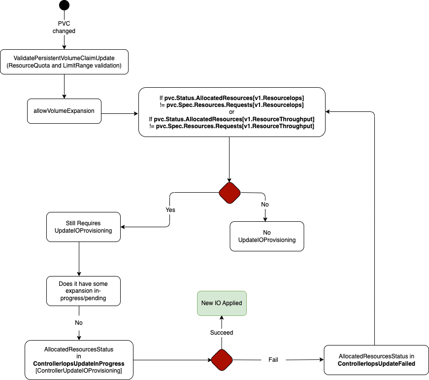

# KEP-3751: Kubernetes Volume Provisioned IO

<!-- toc -->
- [Release Signoff Checklist](#release-signoff-checklist)
- [Summary](#summary)
- [Motivation](#motivation)
  - [Goals](#goals)
  - [Non-Goals](#non-goals)
- [Proposal](#proposal)
  - [Kubernetes API](#kubernetes-api)
  - [CSI API](#csi-api)
  - [Quota](#quota)
  - [User Stories (Optional)](#user-stories-optional)
    - [Provisioned Create](#provisioned-create)
    - [Volume QoS Updates](#volume-qos-updates)
    - [Administrator Quota Restrictions](#administrator-quota-restrictions)
  - [Notes/Constraints/Caveats (Optional)](#notesconstraintscaveats-optional)
  - [Risks and Mitigations](#risks-and-mitigations)
- [Design Details](#design-details)
  - [Test Plan](#test-plan)
      - [Prerequisite testing updates](#prerequisite-testing-updates)
      - [Unit tests](#unit-tests)
      - [Integration tests](#integration-tests)
      - [e2e tests](#e2e-tests)
  - [Graduation Criteria](#graduation-criteria)
    - [Alpha](#alpha)
    - [Beta](#beta)
    - [GA](#ga)
  - [Upgrade / Downgrade Strategy](#upgrade--downgrade-strategy)
  - [Version Skew Strategy](#version-skew-strategy)
- [Production Readiness Review Questionnaire](#production-readiness-review-questionnaire)
  - [Feature Enablement and Rollback](#feature-enablement-and-rollback)
  - [Rollout, Upgrade and Rollback Planning](#rollout-upgrade-and-rollback-planning)
  - [Monitoring Requirements](#monitoring-requirements)
  - [Dependencies](#dependencies)
  - [Scalability](#scalability)
  - [Troubleshooting](#troubleshooting)
- [Implementation History](#implementation-history)
- [Drawbacks](#drawbacks)
- [Alternatives](#alternatives)
- [Infrastructure Needed (Optional)](#infrastructure-needed-optional)
- [Open Items](#open-items)
<!-- /toc -->

## Release Signoff Checklist

Items marked with (R) are required *prior to targeting to a milestone / release*.

- [X] (R) Enhancement issue in release milestone, which links to KEP dir in [kubernetes/enhancements] (not the initial KEP PR)
- [ ] (R) KEP approvers have approved the KEP status as `implementable`
- [X] (R) Design details are appropriately documented
- [ ] (R) Test plan is in place, giving consideration to SIG Architecture and SIG Testing input (including test refactors)
    - [ ] e2e Tests for all Beta API Operations (endpoints)
    - [ ] (R) Ensure GA e2e tests for meet requirements for [Conformance Tests](https://github.com/kubernetes/community/blob/master/contributors/devel/sig-architecture/conformance-tests.md)
    - [ ] (R) Minimum Two Week Window for GA e2e tests to prove flake free
- [ ] (R) Graduation criteria is in place
    - [ ] (R) [all GA Endpoints](https://github.com/kubernetes/community/pull/1806) must be hit by [Conformance Tests](https://github.com/kubernetes/community/blob/master/contributors/devel/sig-architecture/conformance-tests.md)
- [ ] (R) Production readiness review completed
- [ ] (R) Production readiness review approved
- [ ] "Implementation History" section is up-to-date for milestone
- [ ] User-facing documentation has been created in [kubernetes/website], for publication to [kubernetes.io]
- [ ] Supporting documentation—e.g., additional design documents, links to mailing list discussions/SIG meetings, relevant PRs/issues, release notes

[kubernetes.io]: https://kubernetes.io/
[kubernetes/enhancements]: https://git.k8s.io/enhancements
[kubernetes/kubernetes]: https://git.k8s.io/kubernetes
[kubernetes/website]: https://git.k8s.io/website

## Summary

Cloud providers and storage vendors offer volumes which allow specifying IO performance parameters like IOPS or throughput and tuning them as workloads operate. ([1](https://docs.aws.amazon.com/AWSEC2/latest/UserGuide/requesting-ebs-volume-modifications.html), [2](https://cloud.google.com/compute/docs/disks/extreme-persistent-disk), [3](https://learn.microsoft.com/en-us/azure/virtual-machines/disks-types#premium-ssd-v2), [4](https://www.alibabacloud.com/help/en/elastic-compute-service/latest/essd-autopl)). While these parameters can be specified as storage class parameters to be set at provisioning time, Kubernetes has no API which allows changing them. Only capacity can be changed through the volume expansion API. This KEP proposes an extension to the Kubernetes Persistent Volume API to allow users to dynamically control these volume options.

## Motivation


### Goals

* Cloud-provider and storage vendor independent specification of basic QoS parameters
* Specifying QoS at volume creation
* Changing QoS parameters on-line for existing volumes
* Specify quotas in a similar way to that of volume capacity

### Non-Goals

* OS-level IO QoS, for example cgroup policy
* Inter-pod QoS. This KEP is restricted to what QoS can be defined on a volume.
* Volume QoS classes. This proposal is for fine-grained provisioned IO control, and not for defining general classes of volume performance. Currently, storage vendors may accomplish this by adding custom parameters to a storage class. A future KEP may codify such behavior with common storage class parameter names, but that is out of scope of this KEP.
* Scheduling based on total IO limits of a node. For example, total throughput for many cloud provider network attached storage volumes is limited by instance network bandwidth and may prevent achieving the provisioned IO. Scheduling to mitigate these factors is out of scope but it should be considered as a future extension of this KEP.

## Proposal

### Kubernetes API
Add two well-known ResourceName keys to the existing ResourceList type used in PersistentVolumeClaim.Spec.Resources.{Limits,Requests} and PersistentVolume.Spec.Capacity:
* ProvisionedIOPS
* ProvisionedThroughput
These values can be changed on a PersistentVolumeClaim, and will be reconciled against the storage provider in the same way as storage capacity resizing. The status of a PVC will reflect the currently provisioned IO as reported by the storage provider (in the same way that the status states the current size of the volume during a resize operation).

```
// Example:
kind: PersistentVolumeClaim
...
spec:
  ...
  resources:
requests:
  storage: 4Gi
  throughput: "1.2M" // MiB/s as unit
  iops: "160000"     // IO/s as unit
// Vendors may add additional resources using Device Plugin syntax: vendor-domain/resourcetype
```

[Device Plugin](https://kubernetes.io/docs/concepts/extend-kubernetes/compute-storage-net/device-plugins/) is out of scope for this KEP and it is one of the options for configure vendor specific storage options.

Add PVC Status field; change ResizeStatus alpha field to AllocatedResourceStatus map.

### CSI API
The CSI create request will be extended to add provisioned IO parameters. A new ControllerUpdateIOProvisioning RPC will be added.

```
// ControllerServer is the server API for Controller service.
type ControllerServer interface {
        ...
        ControllerUpdateIOProvisioning(context.Context, *ControllerUpdateIOProvisioningRequest) (*ControllerUpdateIOProvisioningResponse, error)
        ...
}

type ControllerUpdateIOProvisioningRequest struct {
        // The ID of the volume to expand. This field is REQUIRED.
        VolumeId string
        Iops string 
        Throughput string
}
type ControllerUpdateIOProvisioningResponse struct {
        Iops int64
        Throughput int64
}
```

The according errors:

| Condition | gRPC Code | Description | Recovery Behavior |
|-----------|-----------|-------------|-------------------|
| Exceeds capabilities | 3 INVALID_ARGUMENT | Indicates that the CO has specified capabilities not supported by the volume. | Caller MAY verify volume capabilities by calling ValidateVolumeCapabilities and retry with matching capabilities. |
| Volume does not exist | 5 NOT FOUND | Indicates that a volume corresponding to the specified volume_id does not exist. | Caller MUST verify that the volume_id is correct and that the volume is accessible and has not been deleted before retrying with exponential back off. |
| Volume in use | 9 FAILED_PRECONDITION | Indicates that the volume corresponding to the specified `volume_id` could not be updated because it is currently published on a node but the plugin does not have ONLINE expansion capability. | Caller SHOULD ensure that volume is not published and retry with exponential back off. |
| Unsupported `capacity_range` | 11 OUT_OF_RANGE | Indicates that the capacity range is not allowed by the Plugin. More human-readable information MAY be provided in the gRPC `status.message` field. | Caller MUST fix the capacity range before retrying. |

The current spec requires ["If a volume corresponding to the specified volume ID is already larger than or equal to the target capacity of the expansion request, the plugin SHOULD reply 0 OK"](https://github.com/container-storage-interface/spec/blob/master/spec.md). The change here will be if the capacity change is for iops and throughput, we will not require that to be larger than the current configuration.

### Quota
Resize quota works by using Kubernetes resource quotas, which makes sure the cluster administrators and operators can restrict consumption and creation of cluster resources (such as CPU time, memory, and persistent storage) within a specified namespace. The LimitRange admission controller tracks usage to ensure the storage resource does not exceed resource minimum, maximum and ratio defined in any LimitRange present in the namespace.

```
apiVersion: v1
kind: ResourceQuota
metadata:
  name: quota
spec:
  hard:
    limits.iops: "200000"    // max for all containers in the namespace
    limits.throughput: 200
    requests.iops: "2000"    // max per request 
    requests.throughput: 20
    pods: "10"    // max number of pods allowed in the namespace
```

```
apiVersion: v1
kind: LimitRange
metadata:
  name: sample
spec:
  limits:
  - max:
      iops: 1500
      throughput: 10
    min:
      iops: 10
      throughput: 1
    default:
      iops: 100
      throughput: 5
    defaultRequest:
      iops: 100
      throughput: 20
    type: Container   
```

IO provisioning should have similar issues to resize (except that we have to solve reducing IO). Please see [limit storage consumption](https://kubernetes.io/docs/tasks/administer-cluster/limit-storage-consumption/). Quota validation should be part of [`func ValidatePersistentVolumeClaimUpdate`](https://github.com/kubernetes/kubernetes/blob/master/pkg/apis/core/validation/validation.go#L2257) flow by using [func ValidateResourceQuota](https://github.com/kubernetes/kubernetes/blob/5bb7326c3643f52a7b615e6f63911add4bbcab3b/pkg/apis/core/validation/validation.go#L6113) and [func ValidateLimitRange](https://github.com/kubernetes/kubernetes/blob/5bb7326c3643f52a7b615e6f63911add4bbcab3b/pkg/apis/core/validation/validation.go#L5594). 


### User Stories (Optional)

#### Provisioned Create

A customer knows the IO requirements for a database application they are deploying on a kubernetes cluster. In the StatefulSet volume template they specify the known IOPS requirements. When provisioning this volume, the cloud provider sets this provisioned IOPS value.

#### Volume QoS Updates

A customer monitors the performance of a Cassandra cluster. They notice that volume IO is causing a bottleneck in performance. They update the PVCs in question to increase the provisioned IO and realize improved performance.

#### Administrator Quota Restrictions
A cluster admin wants to control costs while giving application developers the freedom to optimize their applications. They set a per-namespace, per-volume limit to the maximum throughput that can be specified in a cluster ResourceQuota. When an application dev modifies a PVC to request higher throughput, the request is ignored and an event is created on the PVC. As the ResourceQuota is a cluster-scoped object, only the cluster admin and not application devs can change limits.

ResourceQuota works and will ignore pods in the namespace without setting a limit or request for provision IO. It means that you can create a new pod without limit/request the iops/throughput. You can use a LimitRange to automatically set a default request for provision IO resources.


### Notes/Constraints/Caveats (Optional)

While the terms IOPS and Throughput are broadly understood, the details differ by storage provider. Storage vendors should respect these conventions and treat these values as a capacity.

Actual IOPS and throughput depend on factors like the block size chosen by an application. Provisioned IO may not be achievable if storage vendor block size guidelines are not followed. Kubernetes or this API will not monitor or affect such decisions. Provisioned IO requests will be made to the storage vendor, but whether those are achieved depends on the application workload and the specifics of the storage product.

In addition to the IO provisioned per-volume, there may be per-instance IO limits. See the non-goals section for more details.

### Risks and Mitigations

Currently, most cloud storage services provide updates of [size/iops/throughput](https://docs.google.com/document/d/1x19sofRvRNmQ15E0pj8OygSevkTVhtv_H8zDJ9CqERM/edit#heading=h.dd9ldgf6fddu).
The proposed integration here is only covering first class, non provider-specific QoS parameters(capacity, iops, throughput). It does not cover changing provider-specific parameters and first class QoS parameters all at once. The mitigation proposed is that providers can create their own CRD to address provider-specific change logic.

## Design Details

As part of this proposal, we are mainly proposing the following changes:

1. Add new resources ResourceProvisionedIOPS and ResourceProvisionedThroughput in the existing PVC API called - pvc.Status.AllocatedResources for the purpose of tracking ProvisionedIOPS and ProvisionedThroughput. By default only the api-server or resize-controller can set this field.

2. Relax API validation on PVC update so that updating ResourceProvisionedIOPS and ResourceProvisionedThroughput pvc.Spec.Resoures is allowed, as long as requested size is within the range specified by the cluster admin. This includes the current ``ValidateVolumeCapabilities`` to allow increase/decrease iops and throughput.

3. Add new statuses in PVC API called - pvc.Status.AllocatedResourceStatus for the purpose of tracking status of ProvisionedIOPS and ProvisionedThroughput change. Existing fields can be found [here](https://github.com/kubernetes/kubernetes/blob/master/pkg/apis/core/types.go#L520-L534). The new statuses will be added are:

```go
type ClaimResourceStatus string
const (
    PersistentVolumeClaimControllerUpdateIopsProgress ClaimResourceStatus = "ControllerUpdateIopsInProgress"
    PersistentVolumeClaimControllerUpdateIopsPending ClaimResourceStatus = "ControllerUpdateIopsPending"
    PersistentVolumeClaimControllerUpdateIopsFailed ClaimResourceStatus = "ControllerUpdateIopsFailed"
    PersistentVolumeClaimControllerUpdateThroughputInProgress ClaimResourceStatus = "ControllerUpdateThroughputInProgress"
    PersistentVolumeClaimControllerUpdateThroughputPending ClaimResourceStatus = "ControllerUpdateThroughputPending"
    PersistentVolumeClaimControllerUpdateThroughputFailed ClaimResourceStatus = "ControllerUpdateThroughputFailed"
)
// PersistentVolumeClaimStatus represents the status of PV claim
type PersistentVolumeClaimStatus struct {
    ...
    // AllocatedResourceStatus stores a map of resource that is being expanded
    // and possible status that the resource exists in.
    // Some examples may be:
    //  pvc.status.allocatedResourceStatus["storage"] = "ControllerResizeInProgress"
    //  pvc.status.allocatedResourceStatus["iops"] = "ControllerUpdateIopsInProgress/ControllerUpdateIopsPending/ControllerUpdateIopsFailed"
    //  pvc.status.allocatedResourceStatus["throughput"] = "ControllerUpdateThroughputInProgress/ControllerUpdateThroughputPending/ControllerUpdateThroughputFailed"
    AllocatedResourceStatus map[ResourceName]ClaimResourceStatus
}
```

4. Add new CSI API ControllerUpdateIOProvisioning, when there is a change of iops/throughput in PVC, external-resizer triggers a ControllerUpdateIOProvisioning operations against a CSI endpoint.

5. Update quota code to use min and max(pvc.Spec.Resources, pvc.Status.AllocatedResources) for ProvisionedIOPS and ProvisionedThroughput when evaluating usage for PVC.



Whenever resize controller or kubelet modifies pvc.Status (such as when setting both AllocatedResources and AllocatedResourceStatus) - it is expected that all changes to pvc.Status are submitted as part of same patch request to avoid race conditions.

IO provisioning parameters can be considered as best-effort parameters, we should report the status of bad parameters and the volume would fall back to a workable default configuration.

6. Add new operational and usage metrics to NodeGetVolumeStats:

```go

type Metrics struct {
  // Existing
  Time metav1.Time
  Used *resource.Quantity
  Capacity *resource.Quantity
  Available *resource.Quantity

  InodesUsed *resource.Quantity
  Inodes *resource.Quantity
  InodesFree *resource.Quantity

  Abnormal *bool
  Message *string

  // For Provisioned IO KEP
  IopsUsed *resource.Quantity
  IopsAvailable *resource.Quantity

  ThroughputUsed *resource.Quantity
  ThroughputAvailable *resource.Quantity
}

```

### Test Plan

* Basic unit tests for QoS and quota system.
* E2e tests using mock driver to cause failure on create, update and recovering cases
* Test coverage of quota usage with ResourceQuota and LimitRange


##### Prerequisite testing updates

##### Unit tests

##### Integration tests

<!--
This question should be filled when targeting a release.
For Alpha, describe what tests will be added to ensure proper quality of the enhancement.

For Beta and GA, add links to added tests together with links to k8s-triage for those tests:
https://storage.googleapis.com/k8s-triage/index.html
-->

##### e2e tests

<!--
This question should be filled when targeting a release.
For Alpha, describe what tests will be added to ensure proper quality of the enhancement.

For Beta and GA, add links to added tests together with links to k8s-triage for those tests:
https://storage.googleapis.com/k8s-triage/index.html

We expect no non-infra related flakes in the last month as a GA graduation criteria.
-->

### Graduation Criteria

#### Alpha

- Feature in 1.28 behind the VolumeProvisionedIO feature gate which is set to a default of false

#### Beta

- Beta in 1.29: Since this feature is an expansion of the existing capacity usage flow, we are going to move this to beta with enhanced e2e and test coverage 

#### GA

- GA in 1.30, an issue board will be created to track issues
- No users complaining about the new behavior

### Upgrade / Downgrade Strategy

No change in cluster upgrade / downgrade process.

### Version Skew Strategy

This feature is implemented only in the API server and KCM and controlled by
`VolumeProvisionedIO` feature gate. Following cases may happen:

| API server | external-resizer | Behavior                                                                                                                         |
|------------|-----|----------------------------------------------------------------------------------------------------------------------------------|
| off | off | Existing Kubernetes behavior.                                                                                                    |
| on | off| Existing Kubernetes behavior, API server gets requests of iops/throughput but does not act on it
| off | on | external-resizer should not get any event to update iops/throughput, the current resize flow stays the same |
| on | on | New behavior.                                                                                                                    |

## Production Readiness Review Questionnaire

### Feature Enablement and Rollback

###### How can this feature be enabled / disabled in a live cluster?

- [ ] Feature gate (also fill in values in `kep.yaml`)
    - Feature gate name: VolumeProvisionedIO
    - Components depending on the feature gate: kube-apiserver, 
      external-resizer
- [ ] Other
    - Describe the mechanism:

###### Does enabling the feature change any default behavior?

No. 

###### Can the feature be disabled once it has been enabled (i.e. can we roll back the enablement)?

Yes. It should be disabled in a reverse order of enabling the feature - 
first disable the feature in external-resizer then in API server. See "Version Skew 
Strategy" section above for more details.


###### What happens if we reenable the feature if it was previously rolled back?

No issues are expected. The case is exactly the same as when the feature is 
enabled for the first time.

###### Are there any tests for feature enablement/disablement?

There is two new fields that needs to be handled in a special way. The feature 
gate just enables/disables a code path in external-resizer which is covered
by new unit tests to add with the feature.

### Rollout, Upgrade and Rollback Planning

###### How can a rollout or rollback fail? Can it impact already running workloads?

In case the feature is not enabled during rollout due to a failure there
should be no impact and the behavior of StorageClass assignment will not change.
If the feature is rolled out partially on API servers, there will be no impact on running workloads because the request will
be processed as if the feature is disabled, the external-resizer is not acting on the event created yet - that means nothing happens and PVC
will not be changed with the iops/throughput until external-resizer is deployed.


###### What specific metrics should inform a rollback?

A metric `controller_update_io_provisioning_errors_total` will indicate a problem with the feature.

###### Were upgrade and rollback tested? Was the upgrade->downgrade->upgrade path tested?

Upgrade and rollback will be tested when the feature gate will change to beta.

###### Is the rollout accompanied by any deprecations and/or removals of features, APIs, fields of API types, flags, etc.?

No.

### Monitoring Requirements

###### How can an operator determine if the feature is in use by workloads?

A counter metric will be present in external-resizer metric endpoint, it will show total
count of successful and failed ControllerUpdateIOProvisioning.

###### How can someone using this feature know that it is working for their instance?

By inspecting a `controller_update_io_provisioning_total` metric value. If the counter
is increasing while letting PVCs being updated retroactively the feature is enabled. And at the same time if
`controller_update_io_provisioning_total` counter does not increase the feature
works as expected.

###### What are the reasonable SLOs (Service Level Objectives) for the enhancement?

<!--
This is your opportunity to define what "normal" quality of service looks like
for a feature.

It's impossible to provide comprehensive guidance, but at the very
high level (needs more precise definitions) those may be things like:
  - per-day percentage of API calls finishing with 5XX errors <= 1%
  - 99% percentile over day of absolute value from (job creation time minus expected
    job creation time) for cron job <= 10%
  - 99.9% of /health requests per day finish with 200 code

These goals will help you determine what you need to measure (SLIs) in the next
question.
-->

###### What are the SLIs (Service Level Indicators) an operator can use to determine the health of the service?

- [ ] Metrics
    - Metric name: `controller_update_io_provisioning_errors_total` and `controller_update_io_provisioning_errors_total`
    - [Optional] Aggregation method:
    - Components exposing the metric: external-resizer

###### Are there any missing metrics that would be useful to have to improve observability of this feature?

<!--
Describe the metrics themselves and the reasons why they weren't added (e.g., cost,
implementation difficulties, etc.).
-->

### Dependencies

<!--
This section must be completed when targeting beta to a release.
-->

###### Does this feature depend on any specific services running in the cluster?

No.

### Scalability

<!--
For alpha, this section is encouraged: reviewers should consider these questions
and attempt to answer them.

For beta, this section is required: reviewers must answer these questions.

For GA, this section is required: approvers should be able to confirm the
previous answers based on experience in the field.
-->

###### Will enabling / using this feature result in any new API calls?

Yes.

- API call type: PATCH PVC
- estimated throughput: low, only once for PVCs that have
  iops/throughput field gets updated in PVC
- originating component(s): kube-controller-manager


###### Will enabling / using this feature result in introducing new API types?

Yes. ControllerUpdateIOProvisioning.


###### Will enabling / using this feature result in any new calls to the cloud provider?

Yes. ControllerUpdateIOProvisioning.

###### Will enabling / using this feature result in increasing size or count of the existing API objects?


###### Will enabling / using this feature result in increasing time taken by any operations covered by existing SLIs/SLOs?


###### Will enabling / using this feature result in non-negligible increase of resource usage (CPU, RAM, disk, IO, ...) in any components?


### Troubleshooting

<!--
This section must be completed when targeting beta to a release.

For GA, this section is required: approvers should be able to confirm the
previous answers based on experience in the field.

The Troubleshooting section currently serves the `Playbook` role. We may consider
splitting it into a dedicated `Playbook` document (potentially with some monitoring
details). For now, we leave it here.
-->

###### How does this feature react if the API server and/or etcd is unavailable?


###### What are other known failure modes?


<!--
For each of them, fill in the following information by copying the below template:
  - [Failure mode brief description]
    - Detection: How can it be detected via metrics? Stated another way:
      how can an operator troubleshoot without logging into a master or worker node?
    - Mitigations: What can be done to stop the bleeding, especially for already
      running user workloads?
    - Diagnostics: What are the useful log messages and their required logging
      levels that could help debug the issue?
      Not required until feature graduated to beta.
    - Testing: Are there any tests for failure mode? If not, describe why.
-->

###### What steps should be taken if SLOs are not being met to determine the problem?


## Implementation History

<!--
Major milestones in the lifecycle of a KEP should be tracked in this section.
Major milestones might include:
- the `Summary` and `Motivation` sections being merged, signaling SIG acceptance
- the `Proposal` section being merged, signaling agreement on a proposed design
- the date implementation started
- the first Kubernetes release where an initial version of the KEP was available
- the version of Kubernetes where the KEP graduated to general availability
- when the KEP was retired or superseded
-->

## Drawbacks


## Alternatives

* Modify the storage class in the PVC. See this [document](https://docs.google.com/document/d/1d5Ch54t8-uyORh56AP7rN9AkQfKuLBsCrrBjOohbWLA/edit?usp=sharing).
* Pod Resources with existing [ResourceClaim KEP](https://github.com/kubernetes/enhancements/tree/master/keps/sig-node/3063-dynamic-resource-allocation).

## Infrastructure Needed (Optional)

Not needed.

## Open Items

* Create a diagram of which components are responsible for handing which parts of the flow
* Error handling - where and how do errors get reported
* Clarify expected behavior in case of unsupported configurations
* Cover how to solve the shrink case in detailed design
* Cover how to expand first class QoS parameters in the future
* Cover the flow of updating both first class QoS parameters and cloud provider specific parameters
* Update QoS staus according to [pr#116335](https://github.com/kubernetes/kubernetes/pull/116335)