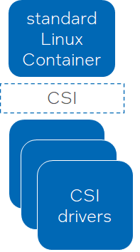
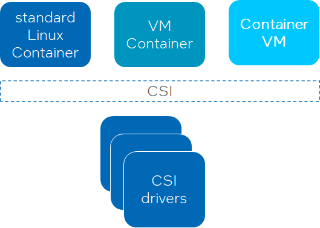
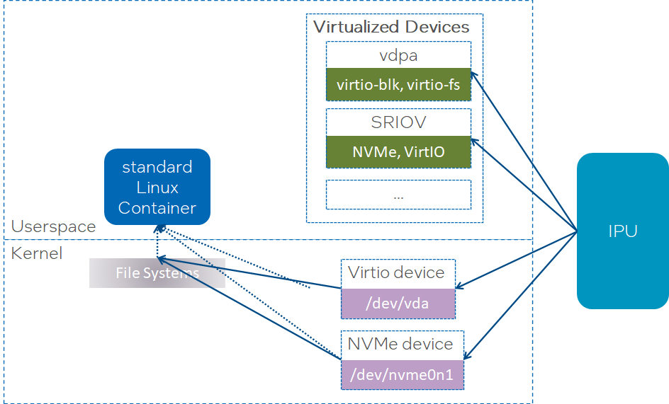
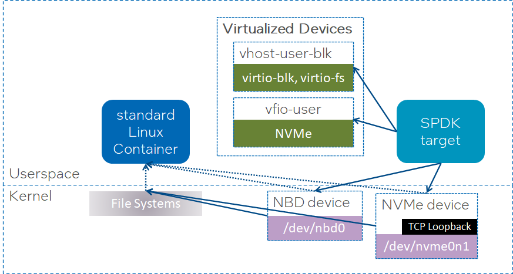
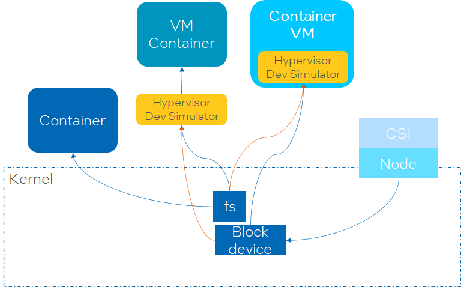
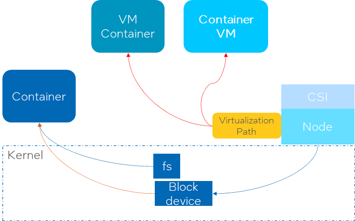

<!--
**Note:** When your KEP is complete, all of these comment blocks should be removed.

To get started with this template:

- [ ] **Pick a hosting SIG.**
  Make sure that the problem space is something the SIG is interested in taking
  up. KEPs should not be checked in without a sponsoring SIG.
- [ ] **Create an issue in kubernetes/enhancements**
  When filing an enhancement tracking issue, please make sure to complete all
  fields in that template. One of the fields asks for a link to the KEP. You
  can leave that blank until this KEP is filed, and then go back to the
  enhancement and add the link.
- [ ] **Make a copy of this template directory.**
  Copy this template into the owning SIG's directory and name it
  `NNNN-short-descriptive-title`, where `NNNN` is the issue number (with no
  leading-zero padding) assigned to your enhancement above.
- [ ] **Fill out as much of the kep.yaml file as you can.**
  At minimum, you should fill in the "Title", "Authors", "Owning-sig",
  "Status", and date-related fields.
- [ ] **Fill out this file as best you can.**
  At minimum, you should fill in the "Summary" and "Motivation" sections.
  These should be easy if you've preflighted the idea of the KEP with the
  appropriate SIG(s).
- [ ] **Create a PR for this KEP.**
  Assign it to people in the SIG who are sponsoring this process.
- [ ] **Merge early and iterate.**
  Avoid getting hung up on specific details and instead aim to get the goals of
  the KEP clarified and merged quickly. The best way to do this is to just
  start with the high-level sections and fill out details incrementally in
  subsequent PRs.

Just because a KEP is merged does not mean it is complete or approved. Any KEP
marked as `provisional` is a working document and subject to change. You can
denote sections that are under active debate as follows:

```
<<[UNRESOLVED optional short context or usernames ]>>
Stuff that is being argued.
<<[/UNRESOLVED]>>
```

When editing KEPS, aim for tightly-scoped, single-topic PRs to keep discussions
focused. If you disagree with what is already in a document, open a new PR
with suggested changes.

One KEP corresponds to one "feature" or "enhancement" for its whole lifecycle.
You do not need a new KEP to move from beta to GA, for example. If
new details emerge that belong in the KEP, edit the KEP. Once a feature has become
"implemented", major changes should get new KEPs.

The canonical place for the latest set of instructions (and the likely source
of this file) is [here](/keps/NNNN-kep-template/README.md).

**Note:** Any PRs to move a KEP to `implementable`, or significant changes once
it is marked `implementable`, must be approved by each of the KEP approvers.
If none of those approvers are still appropriate, then changes to that list
should be approved by the remaining approvers and/or the owning SIG (or
SIG Architecture for cross-cutting KEPs).
-->
# KEP-3909: Virtualize CSI volume for container virtualization

<!--
This is the title of your KEP. Keep it short, simple, and descriptive. A good
title can help communicate what the KEP is and should be considered as part of
any review.
-->

<!--
A table of contents is helpful for quickly jumping to sections of a KEP and for
highlighting any additional information provided beyond the standard KEP
template.

Ensure the TOC is wrapped with
  <code>&lt;!-- toc --&rt;&lt;!-- /toc --&rt;</code>
tags, and then generate with `hack/update-toc.sh`.
-->

<!-- toc -->
- [Release Signoff Checklist](#release-signoff-checklist)
- [Summary](#summary)
- [Motivation](#motivation)
  - [Goals](#goals)
  - [Non-Goals](#non-goals)
- [Proposal](#proposal)
  - [User Stories (Optional)](#user-stories-optional)
    - [Story 1](#story-1)
    - [Story 2](#story-2)
  - [Notes/Constraints/Caveats (Optional)](#notesconstraintscaveats-optional)
  - [Risks and Mitigations](#risks-and-mitigations)
- [Design Details](#design-details)
  - [Test Plan](#test-plan)
      - [Prerequisite testing updates](#prerequisite-testing-updates)
      - [Unit tests](#unit-tests)
      - [Integration tests](#integration-tests)
      - [e2e tests](#e2e-tests)
  - [Graduation Criteria](#graduation-criteria)
  - [Upgrade / Downgrade Strategy](#upgrade--downgrade-strategy)
  - [Version Skew Strategy](#version-skew-strategy)
- [Production Readiness Review Questionnaire](#production-readiness-review-questionnaire)
  - [Feature Enablement and Rollback](#feature-enablement-and-rollback)
  - [Rollout, Upgrade and Rollback Planning](#rollout-upgrade-and-rollback-planning)
  - [Monitoring Requirements](#monitoring-requirements)
  - [Dependencies](#dependencies)
  - [Scalability](#scalability)
  - [Troubleshooting](#troubleshooting)
- [Implementation History](#implementation-history)
- [Drawbacks](#drawbacks)
- [Alternatives](#alternatives)
- [Infrastructure Needed (Optional)](#infrastructure-needed-optional)
<!-- /toc -->

## Release Signoff Checklist

<!--
**ACTION REQUIRED:** In order to merge code into a release, there must be an
issue in [kubernetes/enhancements] referencing this KEP and targeting a release
milestone **before the [Enhancement Freeze](https://git.k8s.io/sig-release/releases)
of the targeted release**.

For enhancements that make changes to code or processes/procedures in core
Kubernetes—i.e., [kubernetes/kubernetes], we require the following Release
Signoff checklist to be completed.

Check these off as they are completed for the Release Team to track. These
checklist items _must_ be updated for the enhancement to be released.
-->

Items marked with (R) are required *prior to targeting to a milestone / release*.

- [ ] (R) Enhancement issue in release milestone, which links to KEP dir in [kubernetes/enhancements] (not the initial KEP PR)
- [ ] (R) KEP approvers have approved the KEP status as `implementable`
- [ ] (R) Design details are appropriately documented
- [ ] (R) Test plan is in place, giving consideration to SIG Architecture and SIG Testing input (including test refactors)
  - [ ] e2e Tests for all Beta API Operations (endpoints)
  - [ ] (R) Ensure GA e2e tests meet requirements for [Conformance Tests](https://github.com/kubernetes/community/blob/master/contributors/devel/sig-architecture/conformance-tests.md) 
  - [ ] (R) Minimum Two Week Window for GA e2e tests to prove flake free
- [ ] (R) Graduation criteria is in place
  - [ ] (R) [all GA Endpoints](https://github.com/kubernetes/community/pull/1806) must be hit by [Conformance Tests](https://github.com/kubernetes/community/blob/master/contributors/devel/sig-architecture/conformance-tests.md) 
- [ ] (R) Production readiness review completed
- [ ] (R) Production readiness review approved
- [ ] "Implementation History" section is up-to-date for milestone
- [ ] User-facing documentation has been created in [kubernetes/website], for publication to [kubernetes.io]
- [ ] Supporting documentation—e.g., additional design documents, links to mailing list discussions/SIG meetings, relevant PRs/issues, release notes

<!--
**Note:** This checklist is iterative and should be reviewed and updated every time this enhancement is being considered for a milestone.
-->

[kubernetes.io]: https://kubernetes.io/
[kubernetes/enhancements]: https://git.k8s.io/enhancements
[kubernetes/kubernetes]: https://git.k8s.io/kubernetes
[kubernetes/website]: https://git.k8s.io/website

## Summary

<!--
This section is incredibly important for producing high-quality, user-focused
documentation such as release notes or a development roadmap. It should be
possible to collect this information before implementation begins, in order to
avoid requiring implementors to split their attention between writing release
notes and implementing the feature itself. KEP editors and SIG Docs
should help to ensure that the tone and content of the `Summary` section is
useful for a wide audience.

A good summary is probably at least a paragraph in length.

Both in this section and below, follow the guidelines of the [documentation
style guide]. In particular, wrap lines to a reasonable length, to make it
easier for reviewers to cite specific portions, and to minimize diff churn on
updates.

[documentation style guide]: https://github.com/kubernetes/community/blob/master/contributors/guide/style-guide.md
-->

This documentation presents the urgency and consideration for assigning virtualized storage
resources to container virtualization. And propose design about how to standardize the operation
within CSI coordination.

## Terminology

The following terms are used throughout this KEP.

1)	**Virtual Machine Container**: container instance launched in a virtual machine instance.
Corresponding to running containers directly on an operating system installed on bare metal -- standard Linux container,
some secure container runtime like **Kata Containers** would like to run container instance inside a micro virtual machine (microVM) to provide stronger workload isolation.

2)	**Container Virtual Machine**: virtual machine instance launched in a container instance.
Adopt container orchestrator to possess Virtual Machine-based workloads, like **Kubevirt**.
The virtual machines launched by Kubevirt can be operated by container orchestrator, like K8S.

3)	**Container Virtualization**: virtualization layer introduced into container technology,
like both Virtual Machine Container and Container Virtual Machine.

4)	**Virtualized Device Type**: In order to improve performance and isolation, devices will not berecognized by compute node OS.
They will be skipped by compute node OS and directly assigned to hypervisor then recognized inside virtual machine.
There are serval typical types of virtualized devices. Hardware virtualized device type includes SRIOV, VDPA.
Software virtualized device type includes vhost-user, vfio-user.
Device in virtualized type always has a specific symbol link.
For example, vhost-user and vfio-user takes a UNIX domain socket as their entries;
SRIOV takes virtual function PCI bus address as its entry.

5)	**Virtualized Volume**: Storage resources presented as virtualized device type.
Both block volume and filesystem volume can be exported as virtualized storage device.
For example, filesystem volume internally can be a virtiofs device and virtualized as vhost-user or vdpa-vhost.

## Motivation

<!--
This section is for explicitly listing the motivation, goals, and non-goals of
this KEP.  Describe why the change is important and the benefits to users. The
motivation section can optionally provide links to [experience reports] to
demonstrate the interest in a KEP within the wider Kubernetes community.

[experience reports]: https://github.com/golang/go/wiki/ExperienceReports
-->

In Kubernetes, virtualization layer was introduced into container in two main types:
virtual machine container or container virtual machine.

Storage infrastructures both of hardware add-ons, like IPU, and software data plane engines, like SPDK,
have the ability to directly publish virtualized storage device types in compute node.

There is increasing demand for assigning virtualized storage device directly into the virtualization
layer in container virtualization:

1) Performance: virtualized storage devices achieve higher IOPS and throughput than current
compute node transition solutions.
2) Efficiency: Compute node OS is liberated from storage IO transition. Previous related compute
resource can be dedicated to more workload applications.

This direct assignment can be implemented by extra configuration and operations when create volumes
from storage infrastructure and when attach volume to container with virtualization.
But it is also critical to make this easy and standardized to plugin in and get started with CSI.


### Goals

<!--
List the specific goals of the KEP. What is it trying to achieve? How will we
know that this has succeeded?
-->

1)	Allow a CSI driver and container runtime to get coordinated about their virtualized storage device capabilities
2)	Allow CSI driver to expose block or filesystem volume in virtualized device type
3)	Allow container runtime to skip the process of volume staging and mounting on compute node OS
4)	Allow secure container runtime with lightweight virtual machines to recognize and connect virtualized storage
devices by its hypervisor
5)	Allow container runtime without virtualization but going to launch virtual machine inside pod to passthrough virtualized
storage device into pod, and hypervisor application inside pod can recognize and connect the virtualized storage device.


### Non-Goals

<!--
What is out of scope for this KEP? Listing non-goals helps to focus discussion
and make progress.
-->
1)	How a CSI driver interacts with its software data engine or hardware offloader
2)	How a CSI driver provisions storage resource into virtualize device
3)	How hypervisor in container virtualization layer recognize and connect to virtualized devices

## Background

Container virtualization becomes common.
On the one hand, considering security vulnerability and not-well workload isolation in standard Linux container,
secure container runtime based on virtual machine, like Kata Containers, is already widely deployed by many CSPs.
And it is used to deliver container service with a second layer of defense.
On the other hand, teams with a reliance on existing virtual machine-based workloads are seeking technology to
containerize their applications. Container virtual machine, like KubeVirt, is applied to rapidly containerize
traditional applications running in virtual machine.

CSI drivers need to provide storage services not only to standard Linux container, but also containers with virtualization.


=>



This KEP is inspired both from Top-Down and Bottom-Up.
Top refers to storage workload generated from container;
Down refers to storage devices provided by infrastructure.

On the top side, kinds of applications in container requires high performance storage.
But with the extra virtualization layer in both Virtual Machine Container(VM container) and Container Virtual Machine(container VM),
there is always obvious performance and efficiency drop.
End users would like to get consistent performance as standard Linux containers.

On the bottom side, storage resources are not limited to only present devices on compute node OS.
Some storage infrastructures built by both hardware and software have virtualization capability.
**IPU**, which is the most popular hardware infrastructure in datacenter, could present virtualized storage devices,
like SR-IOV, SIOV or vDPA.



**SPDK**, which is a popular userspace high performance software, could present storage device directly into
virtualization layer via vhost-user or vfio-user.



It is necessary to build a highly efficient data path between the application workloads and storage infrastructures
without the performance tax of virtual machines.
This can be implemented by exposing storage resources as virtualized device type, then bypass the Linux kernel of
compute node and connect to container virtualization layer directly.

In order to keep operation simplicity and generality, the way to expose and assign virtualized storage devices
to container virtualization layer should be standardized under CSI.
It is of course preferred to deploy and manage virtualized storage resources via CSI drivers.
And CSI should coordinate CSI driver and container runtime.
Then CSI drivers built on top of IPU, SPDK, or any other virtualization capable data engine,
can extend to be compatible with container virtualization.

### Limitations of current CSI volumes

In general, these virtualized devices couldn’t be utilized directly by the compute node OS.
In other words, processes can’t operate or use these types of virtualized devices via compute node’s
kernel filesystem or block device interface.
This is because types of virtualized devices can’t be mounted or staged by compute node’s kernel.

Currently when CSI drivers, built on top of hardware like IPU or software like SPDK, want to provide block or
fs volume to container virtualization, CSI driver should first present a corresponding storage device to
compute node OSas block or fs device.
For VM container, like Kata containers, the hypervisor in container runtime should simulate out a block device
or fs device based on the host kernel device into its microVM, then mount and stage it to the container instance.

For container VM, like Kubevirt, container runtime will mount and stage the device into container instance,
hypervisor inside container instance then simulate out a block or fs device into its VM.
 


The data path between workload application and device built by the existing approach (without any changes to Kubelet and CSI)
involves both hypervisor simulation and compute node OS.
That’s why there is always obvious performance and efficiency drop.

But from the view of virtualization technology, the most efficient and performant data path should be to
passthrough virtual storage device directly to VM via hypervisor.
Then hypervisor and compute node OS will not get involved in the data path between workload appliation and device.
Workload application will get a best performance from storage device.




## Proposal

<!--
This is where we get down to the specifics of what the proposal actually is.
This should have enough detail that reviewers can understand exactly what
you're proposing, but should not include things like API designs or
implementation. What is the desired outcome and how do we measure success?.
The "Design Details" section below is for the real
nitty-gritty.
-->

This KEP proposes a set of enhancements to overcome the above drawbacks and enable a CSI driver and a container runtime
to coordinate the device type of a volume and bridge the CSI driver to export virtualized storage device passthrough
to container virtualization layer.

Coordination between a CSI driver and a container runtime around mounting virtualized volumes directly
in container virtualization layer can be accomplished in various ways.
This section provides an overview of one primary enhancements detailed in this KEP.

The overall mechanism relies on a new field in the pod, and a new virtualization capability in CSI controller capabilities.
It requires virtualized device enhancement in container runtime, including the recognition in microVM container runtime,
the passthrough in standard Linux container runtime, and the coordination between CSI driver and container runtime.

The new field in the pod spec (associated with PVCs, ephemeral PVC specs and inline CSI volumes)
specifies whether the pod accepts virtualized volume and what types of virtualized device it wants.
For VM container, recognition is required. its mircoVM container runtime knows the virtualization ability of its micro VM.
If its micro VM doesn’t accept virtualized volume or specified types of virtualized device, it could deny the pod spec.
For Container VM, passthrough is required. The standard Linux container runtime needs to check
whether it can passthrough the symbol link of virtualized device.
Then the hypervisor application in pod can pick up the passed through virtual device.

The new virtualization capability in CSI controller capabilities will be replied by CSI driver
if it supports exposing some kinds of virtual storage device types.
Coordination between CSI driver and container runtime is required. Kubelet will pass this new pod spec field to CSI driver
when invoking CSI APIs for a volume in the context of the pod if the CSI driver has virtualization capability.
CSI driver matches the virtualized device type it suppors and the virtualized device type pod volume is requested.

If matched, CSI driver, Kubelet and container runtime should together make some agreed hard coding.
The hard coding should be practiced and reviewed as a standard which can be applied to
kinds of VM container, kinds of container VM, and kinds of CSI drivers.

CSI driver exposes the symbol link of virtualized volume at somewhere.
Kubelet checks the volume with additional assistance by virtualization tool.
The microVM container runtime recognizes and imports the device symbol link,
stage and mount the volume inside its microVM.
The standard Linux container runtime passes through it by containing the symbol link in specified path in pod. 
Various alternatives can achieve the propose. They could be listed further below in the Alternatives section.
Details of the new APIs will be outlined depending on the progress.


### User Stories (Optional)

<!--
Detail the things that people will be able to do if this KEP is implemented.
Include as much detail as possible so that people can understand the "how" of
the system. The goal here is to make this feel real for users without getting
bogged down.
-->

#### Setting “Virtualization” field in Pod Specification

The new `Virtualization` field in a pod can be “Auto” or a list of supported virtualized device type
depending on the capability of container virtualization layer.

The workload operator can manually set the ` Virtualization` field in pods (or pod templates in controller specs/custom resources)
based on awareness of the capabilities of the CSI drivers' backing storage classes and container runtime configured for the pods.

If a CSI driver doesn’t support storage resource virtualization, or a container runtime is not able to recognize
or passthrough virtualized storage device, the CSI driver and container runtime should be considered
incompatible with storage resource virtualization improvement.

#### Coordination of Virtualization between CSI driver and Container Runtime

We consider a variety of user stories below to explore how virtualized storage device assignment
take place in the context of different capabilities of CSI drivers and container runtimes
along with different pod spec settings around volumes.

In the scenarios below, we assume there are two clusters: **Cluster A** and **Cluster B**.
Each of them has two container runtimes, standard Linux container, and microVM container runtime – Kata containers.
But only in Cluster A, its standard Linux container has the ability to passthrough specified virtualized storage device,
its Kata container runtime has the ability to recognize and load specified virtualized storage device.
There are two CSI drivers named “plugin-normal.example.com” and ”plugin-virt.example.com”. As their names indicate, only plugin ”plugin-virt.example.com” has the ability to export several types of virtualized devices.

#### Story 1: Export virtualized fs volume from ”plugin-virt.example.com” into microVM container runtime in Cluster A

A pod is created in the cluster, with:
*	runtimeClassName set to microVM
*	One persistentVolumeClaims referring to a PVC whose storageClass is about fs volume from “plugin-virt.example.com”.
The `Virtualization` field of the storageClass is set to “vhost-fs”

The following sequence of steps take place around mounting the file system on persistent volumes
(bound to the PVCs specified by the pod):
*	CSI plugin “plugin-virt.example.com” prepares a fs volume, but exposes it as a Unix Domain Socket
at the conventional path on a scheduled node.
*	The pod is schedule on that node and the microVM runtime finds the socket at the conventional path.
*	The microVM runtime recognizes the socket as a vhost-fs device, and load it into the microVM as a virtiofs device
*	The microVM runtime stages and mount the virtiofs device as a filesystem folder at pointed path for the pod inside microVM.

#### Story 2: Export virtualized fs volume from ”plugin-virt.example.com” into Kubevirt application pod in Cluster A

A pod is created in the cluster, with:
*	The pod image set to Kubevirt
*	runtimeClassName set to standard Linux container
*	One persistentVolumeClaims referring to a PVC whose storageClass is about fs volume from “plugin-virt.example.com”.
The `Virtualization` field of the storageClass is set to “vhost-fs”

The following sequence of steps take place around mounting the file system on persistent volumes
(bound to the PVCs specified by the pod):
*	CSI plugin “plugin-virt.example.com” prepares a fs volume, but exposes it as a Unix Domain Socket at the conventional path on a scheduled node.
*	The pod is schedule on that node and the standard Linux container runtime finds the socket at the conventional path.
*	The standard Linux container runtime passes through the socket inside the pod instance.
*	The hypervisor launched by Kubevirt finds the socket at specified path, recognize and load the socket as vhost-fs device into the virtual machine instance.
*	The virtual machine instance has one virtiofs device inside for end-user to use as filesystem.

#### Story 3: Export virtualized fs volume from ”plugin-virt.example.com” into standard Linux container runtime pod in Cluster A

A pod is created in the cluster, with:
*	runtimeClassName set to standard Linux container
*	One persistentVolumeClaims referring to a PVC whose storageClass is about fs volume from “plugin-virt.example.com”.
The `Virtualization` field of the storageClass is set to “vhost-fs”

The following sequence of steps take place around mounting the file system on persistent volumes
(bound to the PVCs specified by the pod):
*	CSI plugin “plugin-virt.example.com” prepares a fs volume, but exposes it as a Unix Domain Socket at the conventional path on a scheduled node.
*	The pod is schedule on that node and the standard Linux container runtime finds the socket at the conventional path.
*	The standard Linux container runtime passes through the socket inside the pod instance.
*	The pod instance can’t find a valid fs volume because the application inside the pod instance can’t recognize the vhost-fs socket.

#### Story 4: Export virtualized fs volume from ”plugin-normal.example.com” to a pod in Cluster A

A pod is created in the cluster, with:
*	One persistentVolumeClaims referring to a PVC whose storageClass is about fs volume from “plugin-normal.example.com”.
The `Virtualization` field of the storageClass is set to “vhost-fs”。

Since CSI plugin “plugin-normal.example.com” doesn’t has the virtualization ability to expose “vhost-fs” device,
K8S failed to schedule and launch the pod.

#### Story 5: Export virtualized fs volume from ”plugin-virt.example.com” to a pod in Cluster B

A pod is created in the cluster, with:
*	One persistentVolumeClaims referring to a PVC whose storageClass is about fs volume from “plugin-virt.example.com”.
The `Virtualization` field of the storageClass is set to “vhost-fs”

Since the container runtimes in Cluster B all have no virtualization ability to recognize or passthrough
virtualized storage device, K8S failed to schedule and launch the pod.

#### Story 6: Export virtualized fs volume from ”plugin-normal.example.com” to a pod in Cluster B

A pod is created in the cluster, with:
*	One persistentVolumeClaims referring to a PVC whose storageClass is about fs volume from “plugin-virt.example.com”.
The `Virtualization` field of the storageClass is set to “vhost-fs”

Both CSI plugin and container runtimes has no virtualization ability, K8S failed to schedule and launch the pod.


### Notes/Constraints/Caveats (Optional)

<!--
What are the caveats to the proposal?
What are some important details that didn't come across above?
Go in to as much detail as necessary here.
This might be a good place to talk about core concepts and how they relate.
-->

### Risks and Mitigations

<!--
What are the risks of this proposal, and how do we mitigate? Think broadly.
For example, consider both security and how this will impact the larger
Kubernetes ecosystem.

How will security be reviewed, and by whom?

How will UX be reviewed, and by whom?

Consider including folks who also work outside the SIG or subproject.
-->

There are some major risks of using this feature:

* For microVM container runtime, it can be enhanced transparently to users that is to say
enduser doesn’t need to consider how to process the virtualized devices.
The virtualization is controlled by infrastructure.
But for standard Linux container runtime, it’s the pod image’s responsibility to do the recognition
on virtualized device passed through by container runtime. For example in Kubevirt, the hypervisor
in its image should find and recognize the symbol links of virtualized devices.
How the image operates on virtualized device is unknown or not determined by infrastructure.

* Although Virtualization technology is already well developed, but new initiatives are still constantly emerging.
There may be new virtualized device type accepted in related virtualization communities.

## Design Details

<!--
This section should contain enough information that the specifics of your
change are understandable. This may include API specs (though not always
required) or even code snippets. If there's any ambiguity about HOW your
proposal will be implemented, this is the place to discuss them.
-->

TBD: An inital draft. More details relies on further discussion and alignment with leading communities -- Kata Containers, KubeVirt, and related the container stacks.

### Test Plan

<!--
**Note:** *Not required until targeted at a release.*
The goal is to ensure that we don't accept enhancements with inadequate testing.

All code is expected to have adequate tests (eventually with coverage
expectations). Please adhere to the [Kubernetes testing guidelines][testing-guidelines]
when drafting this test plan.

[testing-guidelines]: https://git.k8s.io/community/contributors/devel/sig-testing/testing.md
-->

[ ] I/we understand the owners of the involved components may require updates to
existing tests to make this code solid enough prior to committing the changes necessary
to implement this enhancement.


##### Prerequisite testing updates

<!--
Based on reviewers feedback describe what additional tests need to be added prior
implementing this enhancement to ensure the enhancements have also solid foundations.
-->

##### Unit tests

<!--
In principle every added code should have complete unit test coverage, so providing
the exact set of tests will not bring additional value.
However, if complete unit test coverage is not possible, explain the reason of it
together with explanation why this is acceptable.
-->

<!--
Additionally, for Alpha try to enumerate the core package you will be touching
to implement this enhancement and provide the current unit coverage for those
in the form of:
- <package>: <date> - <current test coverage>
The data can be easily read from:
https://testgrid.k8s.io/sig-testing-canaries#ci-kubernetes-coverage-unit

This can inform certain test coverage improvements that we want to do before
extending the production code to implement this enhancement.
-->

- `<package>`: `<date>` - `<test coverage>`

##### Integration tests

<!--
This question should be filled when targeting a release.
For Alpha, describe what tests will be added to ensure proper quality of the enhancement.

For Beta and GA, add links to added tests together with links to k8s-triage for those tests:
https://storage.googleapis.com/k8s-triage/index.html
-->

- <test>: <link to test coverage>

##### e2e tests

<!--
This question should be filled when targeting a release.
For Alpha, describe what tests will be added to ensure proper quality of the enhancement.

For Beta and GA, add links to added tests together with links to k8s-triage for those tests:
https://storage.googleapis.com/k8s-triage/index.html

We expect no non-infra related flakes in the last month as a GA graduation criteria.
-->

- <test>: <link to test coverage>

### Graduation Criteria

<!--
**Note:** *Not required until targeted at a release.*

Define graduation milestones.

These may be defined in terms of API maturity, [feature gate] graduations, or as
something else. The KEP should keep this high-level with a focus on what
signals will be looked at to determine graduation.

Consider the following in developing the graduation criteria for this enhancement:
- [Maturity levels (`alpha`, `beta`, `stable`)][maturity-levels]
- [Feature gate][feature gate] lifecycle
- [Deprecation policy][deprecation-policy]

Clearly define what graduation means by either linking to the [API doc
definition](https://kubernetes.io/docs/concepts/overview/kubernetes-api/#api-versioning)
or by redefining what graduation means.

In general we try to use the same stages (alpha, beta, GA), regardless of how the
functionality is accessed.

[feature gate]: https://git.k8s.io/community/contributors/devel/sig-architecture/feature-gates.md
[maturity-levels]: https://git.k8s.io/community/contributors/devel/sig-architecture/api_changes.md#alpha-beta-and-stable-versions
[deprecation-policy]: https://kubernetes.io/docs/reference/using-api/deprecation-policy/

Below are some examples to consider, in addition to the aforementioned [maturity levels][maturity-levels].

#### Alpha

- Feature implemented behind a feature flag
- Initial e2e tests completed and enabled

#### Beta

- Gather feedback from developers and surveys
- Complete features A, B, C
- Additional tests are in Testgrid and linked in KEP

#### GA

- N examples of real-world usage
- N installs
- More rigorous forms of testing—e.g., downgrade tests and scalability tests
- Allowing time for feedback

**Note:** Generally we also wait at least two releases between beta and
GA/stable, because there's no opportunity for user feedback, or even bug reports,
in back-to-back releases.

**For non-optional features moving to GA, the graduation criteria must include
[conformance tests].**

[conformance tests]: https://git.k8s.io/community/contributors/devel/sig-architecture/conformance-tests.md

#### Deprecation

- Announce deprecation and support policy of the existing flag
- Two versions passed since introducing the functionality that deprecates the flag (to address version skew)
- Address feedback on usage/changed behavior, provided on GitHub issues
- Deprecate the flag
-->

### Upgrade / Downgrade Strategy

<!--
If applicable, how will the component be upgraded and downgraded? Make sure
this is in the test plan.

Consider the following in developing an upgrade/downgrade strategy for this
enhancement:
- What changes (in invocations, configurations, API use, etc.) is an existing
  cluster required to make on upgrade, in order to maintain previous behavior?
- What changes (in invocations, configurations, API use, etc.) is an existing
  cluster required to make on upgrade, in order to make use of the enhancement?
-->

### Version Skew Strategy

<!--
If applicable, how will the component handle version skew with other
components? What are the guarantees? Make sure this is in the test plan.

Consider the following in developing a version skew strategy for this
enhancement:
- Does this enhancement involve coordinating behavior in the control plane and
  in the kubelet? How does an n-2 kubelet without this feature available behave
  when this feature is used?
- Will any other components on the node change? For example, changes to CSI,
  CRI or CNI may require updating that component before the kubelet.
-->

## Production Readiness Review Questionnaire

<!--

Production readiness reviews are intended to ensure that features merging into
Kubernetes are observable, scalable and supportable; can be safely operated in
production environments, and can be disabled or rolled back in the event they
cause increased failures in production. See more in the PRR KEP at
https://git.k8s.io/enhancements/keps/sig-architecture/1194-prod-readiness.

The production readiness review questionnaire must be completed and approved
for the KEP to move to `implementable` status and be included in the release.

In some cases, the questions below should also have answers in `kep.yaml`. This
is to enable automation to verify the presence of the review, and to reduce review
burden and latency.

The KEP must have a approver from the
[`prod-readiness-approvers`](http://git.k8s.io/enhancements/OWNERS_ALIASES)
team. Please reach out on the
[#prod-readiness](https://kubernetes.slack.com/archives/CPNHUMN74) channel if
you need any help or guidance.
-->

### Feature Enablement and Rollback

<!--
This section must be completed when targeting alpha to a release.
-->

###### How can this feature be enabled / disabled in a live cluster?

<!--
Pick one of these and delete the rest.

Documentation is available on [feature gate lifecycle] and expectations, as
well as the [existing list] of feature gates.

[feature gate lifecycle]: https://git.k8s.io/community/contributors/devel/sig-architecture/feature-gates.md
[existing list]: https://kubernetes.io/docs/reference/command-line-tools-reference/feature-gates/
-->

- [ ] Feature gate (also fill in values in `kep.yaml`)
  - Feature gate name:
  - Components depending on the feature gate:
- [ ] Other
  - Describe the mechanism:
  - Will enabling / disabling the feature require downtime of the control
    plane?
  - Will enabling / disabling the feature require downtime or reprovisioning
    of a node?

###### Does enabling the feature change any default behavior?

<!--
Any change of default behavior may be surprising to users or break existing
automations, so be extremely careful here.
-->

###### Can the feature be disabled once it has been enabled (i.e. can we roll back the enablement)?

<!--
Describe the consequences on existing workloads (e.g., if this is a runtime
feature, can it break the existing applications?).

Feature gates are typically disabled by setting the flag to `false` and
restarting the component. No other changes should be necessary to disable the
feature.

NOTE: Also set `disable-supported` to `true` or `false` in `kep.yaml`.
-->

###### What happens if we reenable the feature if it was previously rolled back?

###### Are there any tests for feature enablement/disablement?

<!--
The e2e framework does not currently support enabling or disabling feature
gates. However, unit tests in each component dealing with managing data, created
with and without the feature, are necessary. At the very least, think about
conversion tests if API types are being modified.

Additionally, for features that are introducing a new API field, unit tests that
are exercising the `switch` of feature gate itself (what happens if I disable a
feature gate after having objects written with the new field) are also critical.
You can take a look at one potential example of such test in:
https://github.com/kubernetes/kubernetes/pull/97058/files#diff-7826f7adbc1996a05ab52e3f5f02429e94b68ce6bce0dc534d1be636154fded3R246-R282
-->

### Rollout, Upgrade and Rollback Planning

<!--
This section must be completed when targeting beta to a release.
-->

###### How can a rollout or rollback fail? Can it impact already running workloads?

<!--
Try to be as paranoid as possible - e.g., what if some components will restart
mid-rollout?

Be sure to consider highly-available clusters, where, for example,
feature flags will be enabled on some API servers and not others during the
rollout. Similarly, consider large clusters and how enablement/disablement
will rollout across nodes.
-->

###### What specific metrics should inform a rollback?

<!--
What signals should users be paying attention to when the feature is young
that might indicate a serious problem?
-->

###### Were upgrade and rollback tested? Was the upgrade->downgrade->upgrade path tested?

<!--
Describe manual testing that was done and the outcomes.
Longer term, we may want to require automated upgrade/rollback tests, but we
are missing a bunch of machinery and tooling and can't do that now.
-->

###### Is the rollout accompanied by any deprecations and/or removals of features, APIs, fields of API types, flags, etc.?

<!--
Even if applying deprecation policies, they may still surprise some users.
-->

### Monitoring Requirements

<!--
This section must be completed when targeting beta to a release.

For GA, this section is required: approvers should be able to confirm the
previous answers based on experience in the field.
-->

###### How can an operator determine if the feature is in use by workloads?

<!--
Ideally, this should be a metric. Operations against the Kubernetes API (e.g.,
checking if there are objects with field X set) may be a last resort. Avoid
logs or events for this purpose.
-->

###### How can someone using this feature know that it is working for their instance?

<!--
For instance, if this is a pod-related feature, it should be possible to determine if the feature is functioning properly
for each individual pod.
Pick one more of these and delete the rest.
Please describe all items visible to end users below with sufficient detail so that they can verify correct enablement
and operation of this feature.
Recall that end users cannot usually observe component logs or access metrics.
-->

- [ ] Events
  - Event Reason: 
- [ ] API .status
  - Condition name: 
  - Other field: 
- [ ] Other (treat as last resort)
  - Details:

###### What are the reasonable SLOs (Service Level Objectives) for the enhancement?

<!--
This is your opportunity to define what "normal" quality of service looks like
for a feature.

It's impossible to provide comprehensive guidance, but at the very
high level (needs more precise definitions) those may be things like:
  - per-day percentage of API calls finishing with 5XX errors <= 1%
  - 99% percentile over day of absolute value from (job creation time minus expected
    job creation time) for cron job <= 10%
  - 99.9% of /health requests per day finish with 200 code

These goals will help you determine what you need to measure (SLIs) in the next
question.
-->

###### What are the SLIs (Service Level Indicators) an operator can use to determine the health of the service?

<!--
Pick one more of these and delete the rest.
-->

- [ ] Metrics
  - Metric name:
  - [Optional] Aggregation method:
  - Components exposing the metric:
- [ ] Other (treat as last resort)
  - Details:

###### Are there any missing metrics that would be useful to have to improve observability of this feature?

<!--
Describe the metrics themselves and the reasons why they weren't added (e.g., cost,
implementation difficulties, etc.).
-->

### Dependencies

<!--
This section must be completed when targeting beta to a release.
-->

###### Does this feature depend on any specific services running in the cluster?

<!--
Think about both cluster-level services (e.g. metrics-server) as well
as node-level agents (e.g. specific version of CRI). Focus on external or
optional services that are needed. For example, if this feature depends on
a cloud provider API, or upon an external software-defined storage or network
control plane.

For each of these, fill in the following—thinking about running existing user workloads
and creating new ones, as well as about cluster-level services (e.g. DNS):
  - [Dependency name]
    - Usage description:
      - Impact of its outage on the feature:
      - Impact of its degraded performance or high-error rates on the feature:
-->

### Scalability

<!--
For alpha, this section is encouraged: reviewers should consider these questions
and attempt to answer them.

For beta, this section is required: reviewers must answer these questions.

For GA, this section is required: approvers should be able to confirm the
previous answers based on experience in the field.
-->

###### Will enabling / using this feature result in any new API calls?

<!--
Describe them, providing:
  - API call type (e.g. PATCH pods)
  - estimated throughput
  - originating component(s) (e.g. Kubelet, Feature-X-controller)
Focusing mostly on:
  - components listing and/or watching resources they didn't before
  - API calls that may be triggered by changes of some Kubernetes resources
    (e.g. update of object X triggers new updates of object Y)
  - periodic API calls to reconcile state (e.g. periodic fetching state,
    heartbeats, leader election, etc.)
-->

###### Will enabling / using this feature result in introducing new API types?

<!--
Describe them, providing:
  - API type
  - Supported number of objects per cluster
  - Supported number of objects per namespace (for namespace-scoped objects)
-->

###### Will enabling / using this feature result in any new calls to the cloud provider?

<!--
Describe them, providing:
  - Which API(s):
  - Estimated increase:
-->

###### Will enabling / using this feature result in increasing size or count of the existing API objects?

<!--
Describe them, providing:
  - API type(s):
  - Estimated increase in size: (e.g., new annotation of size 32B)
  - Estimated amount of new objects: (e.g., new Object X for every existing Pod)
-->

###### Will enabling / using this feature result in increasing time taken by any operations covered by existing SLIs/SLOs?

<!--
Look at the [existing SLIs/SLOs].

Think about adding additional work or introducing new steps in between
(e.g. need to do X to start a container), etc. Please describe the details.

[existing SLIs/SLOs]: https://git.k8s.io/community/sig-scalability/slos/slos.md#kubernetes-slisslos
-->

###### Will enabling / using this feature result in non-negligible increase of resource usage (CPU, RAM, disk, IO, ...) in any components?

<!--
Things to keep in mind include: additional in-memory state, additional
non-trivial computations, excessive access to disks (including increased log
volume), significant amount of data sent and/or received over network, etc.
This through this both in small and large cases, again with respect to the
[supported limits].

[supported limits]: https://git.k8s.io/community//sig-scalability/configs-and-limits/thresholds.md
-->

###### Can enabling / using this feature result in resource exhaustion of some node resources (PIDs, sockets, inodes, etc.)?

<!--
Focus not just on happy cases, but primarily on more pathological cases
(e.g. probes taking a minute instead of milliseconds, failed pods consuming resources, etc.).
If any of the resources can be exhausted, how this is mitigated with the existing limits
(e.g. pods per node) or new limits added by this KEP?

Are there any tests that were run/should be run to understand performance characteristics better
and validate the declared limits?
-->

### Troubleshooting

<!--
This section must be completed when targeting beta to a release.

For GA, this section is required: approvers should be able to confirm the
previous answers based on experience in the field.

The Troubleshooting section currently serves the `Playbook` role. We may consider
splitting it into a dedicated `Playbook` document (potentially with some monitoring
details). For now, we leave it here.
-->

###### How does this feature react if the API server and/or etcd is unavailable?

###### What are other known failure modes?

<!--
For each of them, fill in the following information by copying the below template:
  - [Failure mode brief description]
    - Detection: How can it be detected via metrics? Stated another way:
      how can an operator troubleshoot without logging into a master or worker node?
    - Mitigations: What can be done to stop the bleeding, especially for already
      running user workloads?
    - Diagnostics: What are the useful log messages and their required logging
      levels that could help debug the issue?
      Not required until feature graduated to beta.
    - Testing: Are there any tests for failure mode? If not, describe why.
-->

###### What steps should be taken if SLOs are not being met to determine the problem?

## Implementation History

<!--
Major milestones in the lifecycle of a KEP should be tracked in this section.
Major milestones might include:
- the `Summary` and `Motivation` sections being merged, signaling SIG acceptance
- the `Proposal` section being merged, signaling agreement on a proposed design
- the date implementation started
- the first Kubernetes release where an initial version of the KEP was available
- the version of Kubernetes where the KEP graduated to general availability
- when the KEP was retired or superseded
-->

## Drawbacks

<!--
Why should this KEP _not_ be implemented?
-->

## Alternatives

<!--
What other approaches did you consider, and why did you rule them out? These do
not need to be as detailed as the proposal, but should include enough
information to express the idea and why it was not acceptable.
-->

## Infrastructure Needed (Optional)

<!--
Use this section if you need things from the project/SIG. Examples include a
new subproject, repos requested, or GitHub details. Listing these here allows a
SIG to get the process for these resources started right away.
-->
