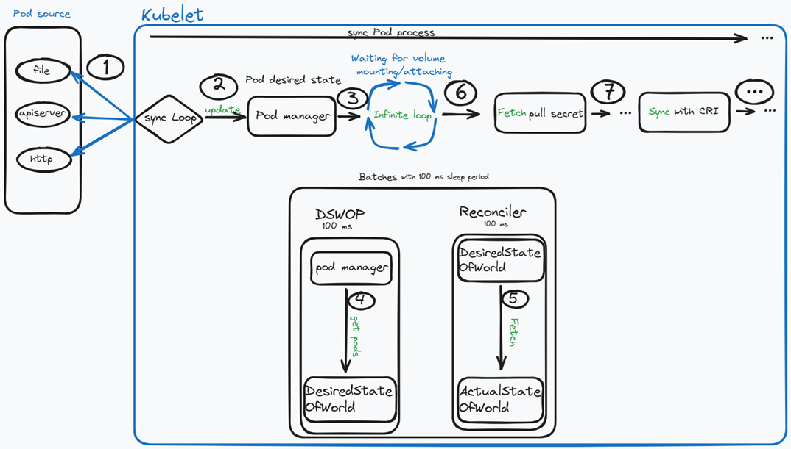
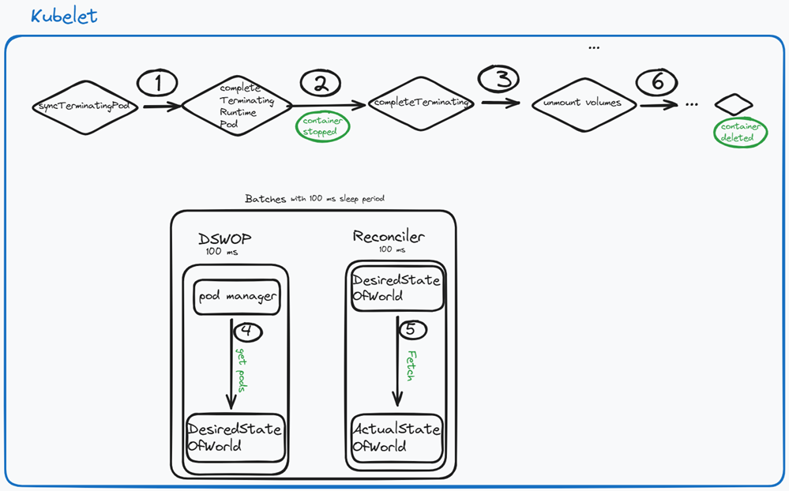
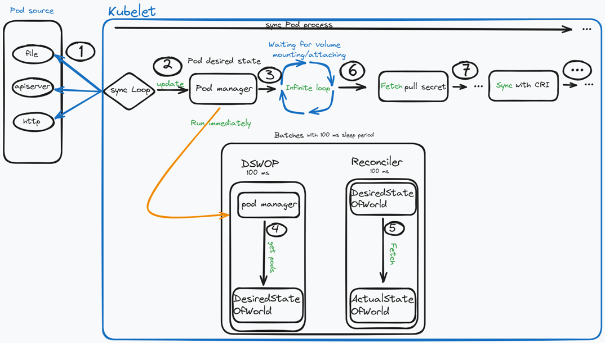
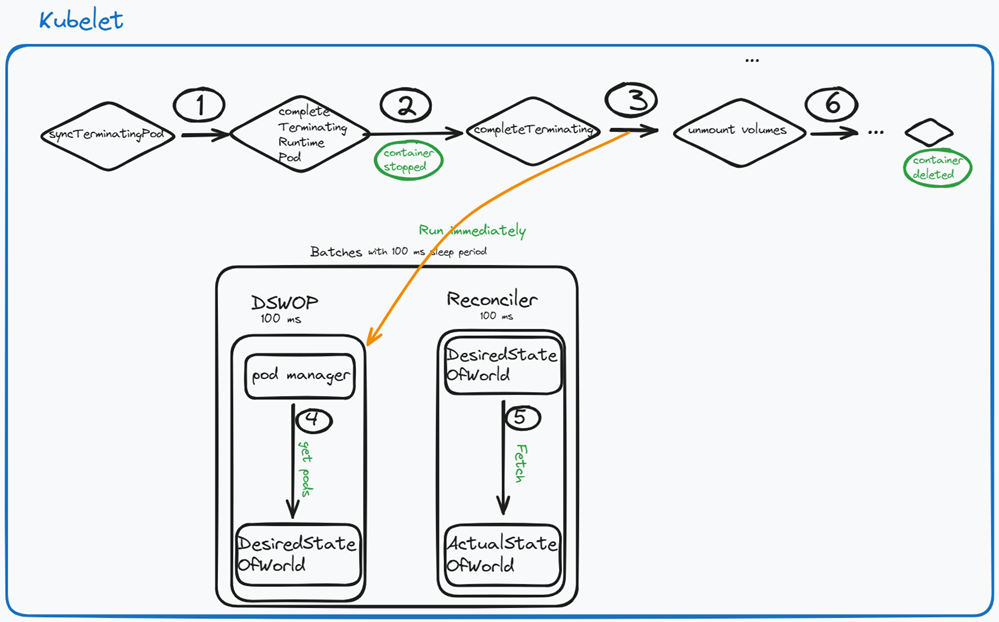

# KEP-4979: Evented desired state of world populator in kubelet volume manager 

<!--
This is the title of your KEP. Keep it short, simple, and descriptive. A good
title can help communicate what the KEP is and should be considered as part of
any review.
-->

<!--
A table of contents is helpful for quickly jumping to sections of a KEP and for
highlighting any additional information provided beyond the standard KEP
template.

Ensure the TOC is wrapped with
  <code>&lt;!-- toc --&rt;&lt;!-- /toc --&rt;</code>
tags, and then generate with `hack/update-toc.sh`.
-->

<!-- toc -->
- [Release Signoff Checklist](#release-signoff-checklist)
- [Summary](#summary)
- [Motivation](#motivation)
  - [Goals](#goals)
  - [Non-Goals](#non-goals)
- [Proposal](#proposal)
  - [Risks and Mitigations](#risks-and-mitigations)
- [Design Details](#design-details)
  - [Test Plan](#test-plan)
      - [Unit tests](#unit-tests)
      - [Integration tests](#integration-tests)
      - [e2e tests](#e2e-tests)
  - [Graduation Criteria](#graduation-criteria)
    - [Alpha](#alpha)
    - [Beta](#beta)
    - [GA](#ga)
    - [Deprecation](#deprecation)
  - [Upgrade / Downgrade Strategy](#upgrade--downgrade-strategy)
  - [Version Skew Strategy](#version-skew-strategy)
- [Production Readiness Review Questionnaire](#production-readiness-review-questionnaire)
  - [Feature Enablement and Rollback](#feature-enablement-and-rollback)
  - [Rollout, Upgrade and Rollback Planning](#rollout-upgrade-and-rollback-planning)
  - [Monitoring Requirements](#monitoring-requirements)
  - [Dependencies](#dependencies)
  - [Scalability](#scalability)
  - [Troubleshooting](#troubleshooting)
- [Implementation History](#implementation-history)
- [Drawbacks](#drawbacks)
- [Alternatives](#alternatives)
- [Infrastructure Needed (Optional)](#infrastructure-needed-optional)
<!-- /toc -->

## Release Signoff Checklist

<!--
**ACTION REQUIRED:** In order to merge code into a release, there must be an
issue in [kubernetes/enhancements] referencing this KEP and targeting a release
milestone **before the [Enhancement Freeze](https://git.k8s.io/sig-release/releases)
of the targeted release**.

For enhancements that make changes to code or processes/procedures in core
Kubernetes—i.e., [kubernetes/kubernetes], we require the following Release
Signoff checklist to be completed.

Check these off as they are completed for the Release Team to track. These
checklist items _must_ be updated for the enhancement to be released.
-->

Items marked with (R) are required *prior to targeting to a milestone / release*.

- [ ] (R) Enhancement issue in release milestone, which links to KEP dir in [kubernetes/enhancements] (not the initial KEP PR)
- [ ] (R) KEP approvers have approved the KEP status as `implementable`
- [ ] (R) Design details are appropriately documented
- [ ] (R) Test plan is in place, giving consideration to SIG Architecture and SIG Testing input (including test refactors)
  - [ ] e2e Tests for all Beta API Operations (endpoints)
  - [ ] (R) Ensure GA e2e tests meet requirements for [Conformance Tests](https://github.com/kubernetes/community/blob/master/contributors/devel/sig-architecture/conformance-tests.md) 
  - [ ] (R) Minimum Two Week Window for GA e2e tests to prove flake free
- [ ] (R) Graduation criteria is in place
  - [ ] (R) [all GA Endpoints](https://github.com/kubernetes/community/pull/1806) must be hit by [Conformance Tests](https://github.com/kubernetes/community/blob/master/contributors/devel/sig-architecture/conformance-tests.md) 
- [ ] (R) Production readiness review completed
- [ ] (R) Production readiness review approved
- [ ] "Implementation History" section is up-to-date for milestone
- [ ] User-facing documentation has been created in [kubernetes/website], for publication to [kubernetes.io]
- [ ] Supporting documentation—e.g., additional design documents, links to mailing list discussions/SIG meetings, relevant PRs/issues, release notes

<!--
**Note:** This checklist is iterative and should be reviewed and updated every time this enhancement is being considered for a milestone.
-->

[kubernetes.io]: https://kubernetes.io/
[kubernetes/enhancements]: https://git.k8s.io/enhancements
[kubernetes/kubernetes]: https://git.k8s.io/kubernetes
[kubernetes/website]: https://git.k8s.io/website

## Summary

This KEP proposes optimizing the loop iteration period (currently fixed at 100ms) in the Desired State of the World Populator (DSWP) in kubelet volume manager. The enhancement involves dynamically increasing the sleep period when no changes are detected and reacting to state pod manager and pod worker channels .

## Motivation

In the volume manager, the Desired State of the World executes a populator loop every 100ms, regardless of whether any changes have occurred. This fixed frequency may result in unnecessary CPU cycles during idle periods and also increasing the waiting period during the pod sync loop iteration. By adopting an event-based approach, the kubelet can respond precisely when changes occur, improving performance and reducing system overhead.

The diagram below illustrates how a kubelet sync loop iteration works, with a focus on Volume Manager behavior : 


On the other hand, the Unmount process follows this flow:



### Goals

1. Reducing the waiting period during the sync loop iteration allows pods to start and delete more quickly.
2. Dynamically adjust the populator loop interval based on system activity.
3. Respond promptly to events, ensuring up-to-date DSWP cache.
4. Maintain existing functionality as a fallback to ensure reliability.

### Non-Goals
 
1. Completely remove the batch loop period.
2. Change the existing DSWP logic.

## Proposal

The Desired State of the World Populator will listen to pod manager and pod worker channel . Every changes made by pod manager(add and update actions) and pod worker ( completeTerminating action ) will trigger the populator loop immediately .
During periods of inactivity, the populator loop interval will increase by 100ms increments after the third execution, up to a maximum of 1 second. If an event is detected, the interval resets to the default 100ms. This approach ensures responsiveness while reducing CPU usage.


### Risks and Mitigations

Since the event is emitted by the Kubelet (Pod Manager/pod worker) for the Kubelet (DSWP), the loss of the event poses a minimal risk.

## Design Details

Trigger the existing DSWP implementation using a channel provided by the Pod Manager and pod worker. The Pod Manager acts as the source of truth for DSWP, and its channel listens for all changes made by it.

On the Pod Manager side , these functions will emit an event on state channel whenever there is a change in its state.

kubernetes/pkg/kubelet/pod/pod_manager.go
```go
type Manager interface {
  ....
	SetPods(pods []*v1.Pod)
	AddPod(pod *v1.Pod)
	UpdatePod(pod *v1.Pod)
	RemovePod(pod *v1.Pod) // Unmount is triggered on the pod worker side
``` 

On the Pod worker side , this function will emit an event on state channel whenever there is a change in its state.

kubernetes/pkg/kubelet/pod_workers.go
```go
func (p *podWorkers) completeTerminating(podUID types.UID){
  //...
}
``` 

Gradually increase after the third execution (to no impact the existing retry logic ) ( +100ms on each iteration) the sleep period to a 1 second maximum. If any event is detected, reset the interval back to the initial value (100ms).

The new diagram reflects the changes after enabling the feature : 


On the Unmount side : 


### Test Plan

[X] I/we understand the owners of the involved components may require updates to
existing tests to make this code solid enough prior to committing the changes necessary
to implement this enhancement.

##### Unit tests

- [X] Dynamic sleep period unit tests
- [X] Increase the sleep period unit tests

##### Integration tests

1. [ ] Verify the desired state of the world cache is updated correctly when the Pod manager/pod worker events are received.
2. [ ] Generate a large number of pod manager events within a short period of time and check if the desired state of the world loop is triggered correctly within a short period.

##### e2e tests

- [ ] The existing `node e2e` tests and integration tests for DSWP must pass. All validation tests are designed and implemented during the integration test phase.

### Graduation Criteria
#### Alpha

- Feature implemented behind a feature flag
- Existing `node e2e` tests and integration tests around DSWP must pass

#### Beta
- [ ] Add integration tests

#### GA

- [ ] Allowing time for feedback
- [ ] Wait two releases before going to GA

#### Deprecation
N/A

Since the batch mode will cohexist with the event mode,so no depcrecation is needed. 

### Upgrade / Downgrade Strategy

N/A

### Version Skew Strategy

N/A.

Since this feature alters only the way kubelet determines DSWP sleep period, this section is irrelevant to this feature.

## Production Readiness Review Questionnaire

<!--
This section must be completed when targeting alpha to a release.
-->
### Feature Enablement and Rollback

###### How can this feature be enabled / disabled in a live cluster?

- [X] Feature gate (also fill in values in `kep.yaml`)
  - Feature gate name: EventedDesiredStateOfWorldPopulator

###### Does enabling the feature change any default behavior?

This feature does not introduce any user facing changes. Although users should notice increased performance of the kubelet.

###### Can the feature be disabled once it has been enabled (i.e. can we roll back the enablement)?

Yes, kubelet needs to be restarted to disable this feature.

###### What happens if we reenable the feature if it was previously rolled back?

If reenabled, kubelet will again start updating the DSWP sleep period based on pod manager/pod worker events. Everytime this feature is enabled or disabled, the kubelet will need to be restarted.

###### Are there any tests for feature enablement/disablement?

Current unit tests are checked without enabling/disabling FG, but for integration and e2e testing, FG (beta graduation) will need to be enabled.

### Rollout, Upgrade and Rollback Planning

<!--
This section must be completed when targeting beta to a release.
-->

###### How can a rollout or rollback fail? Can it impact already running workloads?

This feature relies on a channel provided by the  pod manager/pod worker to dynamically adjust the DSWP sleep period. So no external component(CRI for example) involved at this stage . 

Failures during rollout or rollback are unlikely to impact already running workloads, as the core functionality of the DSWP remains unchanged, and the system defaults to the original polling behavior.

###### What specific metrics should inform a rollback?

N/A.

###### Were upgrade and rollback tested? Was the upgrade->downgrade->upgrade path tested?

Yes, I tested this feature locally using `./hack/local-up-cluster.sh`.

###### Is the rollout accompanied by any deprecations and/or removals of features, APIs, fields of API types, flags, etc.?

No.

### Monitoring Requirements

<!--
This section must be completed when targeting beta to a release.

For GA, this section is required: approvers should be able to confirm the
previous answers based on experience in the field.
-->

###### How can an operator determine if the feature is in use by workloads?

Whenever a pod is updated (added, updated or removed) the kubelet metric `evented_pod_manager_update_count` is increased consistently.

###### How can someone using this feature know that it is working for their instance?

Observe the `pod_manager_update_count` metric.

###### What are the reasonable SLOs (Service Level Objectives) for the enhancement?

The DSWP runs immediately or at least <= 100ms after the desired(pod manager/pod worker) state of the pod has been changed.

###### What are the SLIs (Service Level Indicators) an operator can use to determine the health of the service?

- [X] Metrics
  - Metric name: pod_manager_update_count
  - Components exposing the metric: kubelet

###### Are there any missing metrics that would be useful to have to improve observability of this feature?

- [ ] Metrics
  - Metric name: evented_dswp_process_event_processing_delay
  - Metric description:  exposing the delay period between the event emitted by  pod manager/pod worker and the exact time of DSWP has been executed.
  - Components exposing the metric: kubelet

### Dependencies

N/A.

###### Does this feature depend on any specific services running in the cluster?

<!--
Think about both cluster-level services (e.g. metrics-server) as well
as node-level agents (e.g. specific version of CRI). Focus on external or
optional services that are needed. For example, if this feature depends on
a cloud provider API, or upon an external software-defined storage or network
control plane.

For each of these, fill in the following—thinking about running existing user workloads
and creating new ones, as well as about cluster-level services (e.g. DNS):
  - [Dependency name]
    - Usage description:
      - Impact of its outage on the feature:
      - Impact of its degraded performance or high-error rates on the feature:
-->
No.

### Scalability

<!--
For alpha, this section is encouraged: reviewers should consider these questions
and attempt to answer them.

For beta, this section is required: reviewers must answer these questions.

For GA, this section is required: approvers should be able to confirm the
previous answers based on experience in the field.
-->

###### Will enabling / using this feature result in any new API calls?

No.

###### Will enabling / using this feature result in introducing new API types?

No.

###### Will enabling / using this feature result in any new calls to the cloud provider?

No.

###### Will enabling / using this feature result in increasing size or count of the existing API objects?

No.

###### Will enabling / using this feature result in increasing time taken by any operations covered by existing SLIs/SLOs?

No.

###### Will enabling / using this feature result in non-negligible increase of resource usage (CPU, RAM, disk, IO, ...) in any components?

No.

###### Can enabling / using this feature result in resource exhaustion of some node resources (PIDs, sockets, inodes, etc.)?

No.

### Troubleshooting

<!--
This section must be completed when targeting beta to a release.

For GA, this section is required: approvers should be able to confirm the
previous answers based on experience in the field.

The Troubleshooting section currently serves the `Playbook` role. We may consider
splitting it into a dedicated `Playbook` document (potentially with some monitoring
details). For now, we leave it here.
-->

###### How does this feature react if the API server and/or etcd is unavailable?
The feature does not depend directly on the API server / etcd but on the pod manager/pod worker(kubelet) behavior.

###### What are other known failure modes?

N/A

###### What steps should be taken if SLOs are not being met to determine the problem?

## Implementation History

<!--
Major milestones in the lifecycle of a KEP should be tracked in this section.
Major milestones might include:
- the `Summary` and `Motivation` sections being merged, signaling SIG acceptance
- the `Proposal` section being merged, signaling agreement on a proposed design
- the date implementation started
- the first Kubernetes release where an initial version of the KEP was available
- the version of Kubernetes where the KEP graduated to general availability
- when the KEP was retired or superseded
-->

## Drawbacks

<!--
Why should this KEP _not_ be implemented?
-->

## Alternatives

1. Proposal 1 : https://github.com/kubernetes/kubernetes/pull/126450  : the PR allows users to customize or override the loop period configuration using the kubelet conf file  : 

Reason/suggestion ( sig node ) : move to event-based approach: https://github.com/kubernetes/kubernetes/issues/126049#issuecomment-2278659439 

2. Proposal 2: https://github.com/kubernetes/kubernetes/pull/126668 : This proposal increases the timer without the event-based approach. If a change is detected, the function resets the sleep period. However, this PR will likely be closed since changes are detected late.

3. Proposal 3: React based on CRI event : the container creation (CRI event) does not precede volume mounting.

## Infrastructure Needed (Optional)

<!--
Use this section if you need things from the project/SIG. Examples include a
new subproject, repos requested, or GitHub details. Listing these here allows a
SIG to get the process for these resources started right away.
-->
