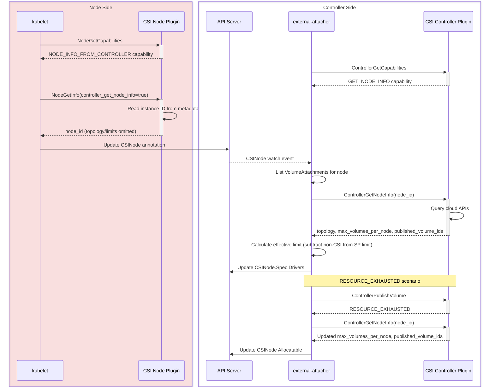

# KEP-6011: CSI ControllerGetNodeInfo

<!-- toc -->
- [Release Signoff Checklist](#release-signoff-checklist)
- [Summary](#summary)
- [Motivation](#motivation)
  - [Goals](#goals)
  - [Non-Goals](#non-goals)
- [Proposal](#proposal)
  - [User Stories](#user-stories)
    - [Story 1: Security-hardened Environment](#story-1-security-hardened-environment)
    - [Story 2: Accurate Non-CSI Volume Accounting](#story-2-accurate-non-csi-volume-accounting)
    - [Story 3: Large Cluster Scalability](#story-3-large-cluster-scalability)
  - [Risks and Mitigations](#risks-and-mitigations)
  - [Notes/Constraints/Caveats](#notesconstraintscaveats)
- [Design Details](#design-details)
  - [CSI Spec Changes](#csi-spec-changes)
    - [NodeGetInfo Request Flag](#nodegetinfo-request-flag)
    - [ControllerGetNodeInfo RPC](#controllergetnodeinfo-rpc)
    - [New Capabilities](#new-capabilities)
  - [Kubernetes Integration](#kubernetes-integration)
    - [kubelet Changes](#kubelet-changes)
    - [external-attacher Changes](#external-attacher-changes)
    - [Race Condition Mitigation](#race-condition-mitigation)
    - [Workflow](#workflow)
  - [API Changes](#api-changes)
    - [CSINode Annotation](#csinode-annotation)
  - [Test Plan](#test-plan)
      - [Prerequisite testing updates](#prerequisite-testing-updates)
      - [Unit tests](#unit-tests)
      - [Integration tests](#integration-tests)
      - [e2e tests](#e2e-tests)
  - [Graduation Criteria](#graduation-criteria)
    - [Alpha](#alpha)
    - [Beta](#beta)
    - [GA](#ga)
  - [Upgrade / Downgrade Strategy](#upgrade--downgrade-strategy)
  - [Version Skew Strategy](#version-skew-strategy)
- [Production Readiness Review Questionnaire](#production-readiness-review-questionnaire)
  - [Feature Enablement and Rollback](#feature-enablement-and-rollback)
  - [Rollout, Upgrade and Rollback Planning](#rollout-upgrade-and-rollback-planning)
  - [Monitoring Requirements](#monitoring-requirements)
  - [Dependencies](#dependencies)
  - [Scalability](#scalability)
  - [Troubleshooting](#troubleshooting)
- [Implementation History](#implementation-history)
- [Drawbacks](#drawbacks)
- [Alternatives](#alternatives)
  - [Alternative 1: Private CRD and Controller](#alternative-1-private-crd-and-controller)
  - [Alternative 2: Instance Metadata Enhancement](#alternative-2-instance-metadata-enhancement)
  - [Alternative 3: Node Label Patching (e.g., AWS metadata-labeler)](#alternative-3-node-label-patching-eg-aws-metadata-labeler)
  - [Alternative 4: CRD-based Topology Retrieval (e.g., vSphere CSINodeTopology)](#alternative-4-crd-based-topology-retrieval-eg-vsphere-csinodetopology)
  - [Alternative 5: Hardcoded Instance-Type Tables in the Driver Binary](#alternative-5-hardcoded-instance-type-tables-in-the-driver-binary)
  - [Alternative 6: Separate NodeGetID RPC](#alternative-6-separate-nodegetid-rpc)
  - [Alternative 7: Combine Node and Controller Values](#alternative-7-combine-node-and-controller-values)
  - [Alternative 8: Reactive-Only Discovery](#alternative-8-reactive-only-discovery)
  - [Alternative 9: Static Node Context Object](#alternative-9-static-node-context-object)
- [Infrastructure Needed](#infrastructure-needed)
<!-- /toc -->

## Release Signoff Checklist

Items marked with (R) are required *prior to targeting to a milestone / release*.

- [ ] (R) Enhancement issue in release milestone, which links to KEP dir in [kubernetes/enhancements] (not the initial KEP PR)
- [ ] (R) KEP approvers have approved the KEP status as `implementable`
- [ ] (R) Design details are appropriately documented
- [ ] (R) Test plan is in place, giving consideration to SIG Architecture and SIG Testing input
  - [ ] e2e Tests for all Beta API Operations
  - [ ] (R) Ensure GA e2e tests meet requirements for [Conformance Tests]
  - [ ] (R) Minimum Two Week Window for GA e2e tests to prove flake free
- [ ] (R) Graduation criteria is in place
  - [ ] (R) [all GA Endpoints] must be hit by [Conformance Tests] within one minor version of promotion to GA
- [ ] (R) Production readiness review completed
- [ ] (R) Production readiness review approved
- [ ] "Implementation History" section is up-to-date for milestone
- [ ] User-facing documentation has been created in [kubernetes/website]
- [ ] Supporting documentation—e.g., additional design documents, links to mailing list discussions/SIG meetings, relevant PRs/issues, release notes

[kubernetes.io]: https://kubernetes.io/
[kubernetes/enhancements]: https://git.k8s.io/enhancements
[kubernetes/kubernetes]: https://git.k8s.io/kubernetes
[kubernetes/website]: https://git.k8s.io/website

## Summary

This KEP introduces a new optional CSI RPC, `ControllerGetNodeInfo`, and a companion request flag on the existing `NodeGetInfo`, that together allow a CSI driver to split node registration into two phases: a lightweight node-side identity call and a controller-side lookup for topology and capacity. This eliminates the need for cloud API credentials on worker nodes while preserving full topology-aware scheduling and accurate volume limit tracking.

## Motivation

Today, the CSI `NodeGetInfo` RPC is the single entry point for a node to report its identity, topology, and volume capacity to the Container Orchestrator (CO). In practice, some CSI driver implementations require cloud API credentials on the node to fully populate this response, for example to query the instance's availability zone or the maximum number of attachable volumes. Other implementations work around this by using hardcoded tables or local instance metadata, but these approaches sacrifice accuracy: they cannot account for non-CSI volume attachments, they cannot dynamically adjust when conditions change, and hardcoded tables require a new driver release whenever the cloud provider introduces new instance types.

This creates several problems:

1. **Security**: Organizations with strict security postures, particularly in financial services and government, prohibit distributing cloud API credentials to worker nodes. These users must choose between security and full CSI functionality.

2. **Accuracy**: The scheduler only counts CSI volumes when enforcing `max_volumes_per_node`. Non-CSI attachments (boot volumes, manually attached disks, network interfaces consuming shared device slots) are invisible to it. So the SP must subtract non-CSI attachments from the instance-type limit before reporting `max_volumes_per_node`. The node side can only approximate this, using static configuration or stale metadata. The controller side can do it precisely, because it knows which volumes are CSI-managed (via `VolumeAttachment` objects) and can query the cloud for actual attachments.

3. **Scalability**: In large clusters, every node independently calls cloud APIs during registration. A 5000-node cluster startup produces 5000 concurrent API calls, risking throttling and slow registration. A controller-side approach enables batching, caching, and coordinated rate limiting.

4. **Accuracy of dynamic updates**: KEP-4876 made `CSINode.Spec.Drivers[*].Allocatable.Count` mutable and introduced periodic and failure-triggered updates via `NodeGetInfo`. This KEP builds on that foundation by moving the update source to the controller side, which lets CSI drivers define precisely which attachments are CSI-managed and which are not. The node-side `NodeGetInfo` RPC doesn't have this context, so drivers today must approximate non-CSI attachments using static reservations or metadata heuristics.

This KEP addresses all four problems by introducing a clean split: the node reports only its identity (cheap, local, no credentials), and the controller fills in topology and capacity (where credentials and `VolumeAttachment` context already exist).

### Goals

- Enable CSI node registration without cloud API credentials on the node
- Provide accurate volume capacity tracking by leveraging controller-side `VolumeAttachment` knowledge to account for non-CSI attachments
- Improve scalability through controller-side batching and caching of cloud API calls
- Maintain full backward compatibility; drivers that do not adopt the new flow continue to work unchanged

### Non-Goals

- Modifying Kubernetes core scheduling logic
- Requiring changes to CSI drivers that do not need this feature
- Implementing cloud provider-specific solutions within Kubernetes core

## Proposal

### User Stories

#### Story 1: Security-hardened Environment

A financial services company prohibits cloud API credentials on worker nodes. Today, their CSI driver's `NodeGetInfo` either returns incomplete data (no topology, inaccurate limits) or requires a provider-specific workaround. With this proposal, the node answers `NodeGetInfo` with only its `node_id` from local instance metadata, and the controller calls `ControllerGetNodeInfo` with existing credentials. Full functionality, no credentials on nodes, no custom workarounds.

#### Story 2: Accurate Non-CSI Volume Accounting

An operator's nodes have boot volumes, manually attached disks, and network interfaces consuming shared device slots, none of which are managed by CSI. The scheduler doesn't know about these; it only counts CSI volumes. So the SP must subtract non-CSI attachments from the instance-type limit before reporting `max_volumes_per_node`. Today, some CSI drivers handle this with static configuration (e.g., AWS EBS CSI driver's `--reserved-volume-attachments`) or provider-specific sidecars (e.g., AWS EBS CSI driver's metadata-labeler). With this proposal, the controller queries actual cloud attachments, compares against `VolumeAttachment` objects to identify non-CSI volumes, and reports an accurate limit, dynamically, with no manual configuration.

#### Story 3: Large Cluster Scalability

A 5000-node cluster startup triggers 5000 concurrent cloud API calls from `NodeGetInfo`. With this proposal, the controller can batch instance queries, cache results by instance type, and apply coordinated rate limiting, significantly reducing cloud API load and registration time.

### Risks and Mitigations

| Risk | Mitigation |
|------|------------|
| Node registration latency increases | The node-side `NodeGetInfo` becomes faster (no cloud API). The controller-side roundtrip adds seconds, but node registration is a one-time event. Net impact is minimal. |
| Controller becomes a bottleneck | The controller already handles `ControllerPublishVolume` for every attach. `ControllerGetNodeInfo` adds one call per node registration, which is negligible overhead. Batching and caching further reduce load. |
| Race between `ControllerGetNodeInfo` and concurrent attach/detach | CO records volume IDs processed during the call and considers them CSI-managed. See [Race Condition Mitigation](#race-condition-mitigation). |
| Version skew | Feature gates on both kubelet and external-attacher. Capability detection provides graceful fallback. See [Version Skew Strategy](#version-skew-strategy). |

### Notes/Constraints/Caveats

- **CSI Spec Dependency**: This KEP requires [CSI spec PR #603](https://github.com/container-storage-interface/spec/pull/603) to be merged first. Kubernetes implementation cannot proceed until the spec changes land.

- **Upgrade Order**: External-attacher must be upgraded before nodes. When kubelet sets the request flag but external-attacher doesn't yet support `ControllerGetNodeInfo`, nodes register with only a `node_id` annotation, and topology and allocatable remain unset until external-attacher catches up. This is a transient state, not a failure.

- **Backward Compatibility**: Drivers that do not adopt the new flow continue to use `NodeGetInfo` unchanged. No breaking changes.

## Design Details

### CSI Spec Changes

This KEP depends on [CSI spec PR #603](https://github.com/container-storage-interface/spec/pull/603).

#### NodeGetInfo Request Flag

A new optional field is added to `NodeGetInfoRequest`:

```protobuf
message NodeGetInfoRequest {
  // When true, the CO will obtain accessible_topology and
  // max_volumes_per_node from ControllerGetNodeInfo. The SP MAY omit
  // those two fields from NodeGetInfoResponse and return only node_id.
  // The CO MUST NOT consume accessible_topology or max_volumes_per_node
  // from a response to a request with this field set.
  // The CO MUST NOT set this field to true unless the SP has the
  // NODE_INFO_FROM_CONTROLLER node capability.
  // This field is OPTIONAL.
  bool controller_get_node_info = 1 [(alpha_field) = true];
}
```

The CO sets `controller_get_node_info` only when the driver advertises the `NODE_INFO_FROM_CONTROLLER` node capability (see [New Capabilities](#new-capabilities)).
The `node_id` returned in this mode comes from local instance metadata and requires no cloud API credentials — for example, `http://169.254.169.254/latest/meta-data/instance-id` (AWS) or `http://100.100.100.200/latest/meta-data/instance-id` (Alibaba Cloud).

**Why a request flag rather than always deferring**: the flag is a handshake.
Under the new workflow an SP may want to skip fetching topology and limits itself,
either to avoid storing credentials on the node or to reduce API traffic to the cloud or Kubernetes.
Without the flag, such an SP would have to either:
- Omit topology and limits unconditionally, assuming every CO supports the new workflow.
  But `NodeGetInfoResponse` has no safe "I don't know yet" value for these fields —
  `max_volumes_per_node = 0` means "no limit" and empty `accessible_topology` means "no constraint" —
  so an old CO would silently mis-schedule.
- Always return them, incurring useless API traffic even where the CO ignores the result.

The flag resolves this: the SP omits those fields only when the CO has signaled it will
source them authoritatively from `ControllerGetNodeInfo`, so the node side is never misread.

**Why not a separate `NodeGetID` RPC**: reusing `NodeGetInfo` requires only a capability plus one optional request field,
so the existing CSI drivers add support incrementally instead of implementing a new RPC.
`node_id` also flows to the controller side in this design (see below); a shared node-produced field has one natural home on `NodeGetInfoResponse`, whereas a subset RPC would duplicate it.
See [Alternative 6](#alternative-6-separate-nodegetid-rpc).

#### ControllerGetNodeInfo RPC

```protobuf
rpc ControllerGetNodeInfo(ControllerGetNodeInfoRequest) returns (ControllerGetNodeInfoResponse) {
    option (alpha_method) = true;
}
```

Retrieves topology, attached volumes, and instance limit from the controller side, where cloud API credentials are already available.

**Input**: `node_id` (from `NodeGetInfo`)
**Output**: `accessible_topology` (zone, region, etc.), `max_volumes_per_node` (volume attachment limit calculated by SP), `published_volume_ids` (volumes attached according to cloud API)

**Design: volume classification**. The scheduler treats `allocatable.count` in `CSINode` as the number of CSI-managed volumes the node can support, then subtracts the CSI volumes it already knows about to determine available slots. The scheduler has no awareness of non-CSI attachments (boot volumes, network interfaces consuming shared device slots, manually attached disks). So non-CSI volumes must be accounted for.

Today, CSI drivers handle this on the node side with approximations. For example, the AWS EBS CSI driver computes `instance_limit - reserved_attachments - ENIs` (see [`getVolumesLimit()`](https://github.com/kubernetes-sigs/aws-ebs-csi-driver/blob/master/pkg/driver/node.go)), using static configuration (`--reserved-volume-attachments`) or metadata heuristics. But the node side cannot dynamically distinguish CSI-managed from non-CSI attachments.

The CO has the `VolumeAttachment` context needed to classify volumes, while the SP only has cloud API results. The SP calculates the volume attachment limit (accounting for ENIs etc.) and reports the attached volumes. The CO identifies non-CSI volumes from the attachment list and subtracts them:

```
volume_limit     = max_volumes_per_node (SP calculated, accounting for ENIs etc.)
total_attached   = published_volume_ids (from SP response)
csi_managed      = VolumeAttachment objects (CO knows)
non_csi_attached = total_attached - intersection(total_attached, csi_managed)
effective_limit  = volume_limit - non_csi_attached
```

**Example**: Instance type limit is 25. Node has 2 ENIs (consuming 2 slots on shared-limit types). SP calculates attachment limit = 23. Cloud API shows 10 attached volumes (`published_volume_ids`). CO has 8 CSI volumes in `VolumeAttachment`. CO identifies 2 non-CSI volumes (boot volume + manually attached disk) → effective limit = 23 - 2 = 21. Scheduler subtracts 8 CSI volumes → 13 available. Correct: 25 - 2 (ENIs) - 10 (attached) = 13 real remaining.

CO avoids a race condition by recording all volume IDs processed during the `ControllerGetNodeInfo` call and considers them CSI-managed.

**Example implementations**:
- **AWS EBS**: `DescribeInstances` for AZ/region and current block device mappings, `DescribeInstanceTypes` for attachment limit. SP calculates volume attachment limit accounting for ENI-consumed slots on shared-limit instance types, returns this limit and all attached volume IDs. This would replace the existing [metadata-labeler](https://github.com/kubernetes-sigs/aws-ebs-csi-driver/blob/master/pkg/cloud/metadata/labels.go) sidecar and the `--reserved-volume-attachments` CLI flag.
- **Alibaba Cloud**: `DescribeInstances` for zone/region, `DescribeAvailableResource` for disk categories, `DescribeDisks` for current attachments, `DescribeInstanceTypes` for limits.

#### New Capabilities

- `NodeServiceCapability.RPC.NODE_INFO_FROM_CONTROLLER`: the node plugin supports the `controller_get_node_info` request flag and may omit topology/limits when it is set. kubelet needs this node-side signal because it cannot observe controller capabilities.
- `ControllerServiceCapability.RPC.GET_NODE_INFO`: indicates support for `ControllerGetNodeInfo`

**Invariant**: If a driver advertises `NODE_INFO_FROM_CONTROLLER`, it MUST also advertise `GET_NODE_INFO`. This is enforced by the CSI spec. Without this invariant, a node could register with only a `node_id` annotation and never have topology or allocatable populated, because the SP omits them once kubelet sets the flag.

**Topology key consistency**: `ControllerGetNodeInfo` MUST return the same topology keys as the driver's `NodeGetInfo` would. Existing PersistentVolumes have `nodeAffinity` rules referencing these keys (e.g., `topology.ebs.csi.aws.com/zone`). Inconsistent keys would break scheduling for already-provisioned volumes.

### Kubernetes Integration

#### kubelet Changes

When the `CSIControllerGetNodeInfo` feature gate is enabled and the CSI node plugin advertises `NODE_INFO_FROM_CONTROLLER`:

1. Call `NodeGetInfo` with `controller_get_node_info = true`
2. Store the `node_id` in a CSINode annotation: `csi.volume.kubernetes.io/nodeid` (JSON map of driver name → node ID)
3. Do NOT populate topology or allocatable from the response, even if present; external-attacher handles this via `ControllerGetNodeInfo`
4. Skip periodic `NodeGetInfo` calls (KEP-4876) for this driver, as external-attacher takes over
5. If `NodeGetInfo` fails or returns an empty `node_id`, fail registration
6. If `NODE_INFO_FROM_CONTROLLER` is not advertised, use the existing `NodeGetInfo` flow unchanged

```go
req := &csi.NodeGetInfoRequest{}
if hasNodeInfoFromControllerCapability(driver) {
    req.ControllerGetNodeInfo = true
}
info, err := nodePlugin.NodeGetInfo(req)
if err != nil {
    return fmt.Errorf("NodeGetInfo failed: %w", err)
}
if req.ControllerGetNodeInfo {
    // Read-modify-write with resourceVersion conflict detection.
    // topology/allocatable are ignored; external-attacher supplies them.
    nodeIDMap := json.Unmarshal(csiNode.Annotations["csi.volume.kubernetes.io/nodeid"])
    nodeIDMap[driverName] = info.NodeId
    csiNode.Annotations["csi.volume.kubernetes.io/nodeid"] = json.Marshal(nodeIDMap)
} else {
    // ... existing flow: populate topology and allocatable from info ...
}
```

When driver unregisters, also remove the driver from the annotation.

#### external-attacher Changes

When the `CSIControllerGetNodeInfo` feature gate is enabled, driver is present in CSINode object `csi.volume.kubernetes.io/nodeid` annotation, and the CSI controller plugin advertises `GET_NODE_INFO`:

1. Call `ControllerGetNodeInfo` when a driver appears in the annotation but has no corresponding `CSINode.Spec.Drivers` entry (initial registration)
2. Call `ControllerGetNodeInfo` after `ControllerPublishVolume` returns `RESOURCE_EXHAUSTED` (capacity correction, building on KEP-4876)
3. Call `ControllerGetNodeInfo` periodically if `CSIDriver.Spec.NodeAllocatableUpdatePeriodSeconds` is set (periodic refresh, building on KEP-4876)
4. Calculate effective `max_volumes_per_node` by comparing `published_volume_ids` from SP response against `VolumeAttachment` objects
5. Update `CSINode.Spec.Drivers` with topology and calculated capacity

```go
type nodeInfoProcessor struct {
    pendingNodes sync.Map // nodeName -> Set[string] (all volume IDs related to the node during processing)
}

func (p *nodeInfoProcessor) processNode(csiNode *CSINode) {
    nodeIDMap := json.Unmarshal(csiNode.Annotations["csi.volume.kubernetes.io/nodeid"])
    nodeID, ok := nodeIDMap[driverName]
    if !ok {
        return
    }
    if driverInSpec(csiNode) && !periodicUpdateDue() {
        return
    }
    csiPublished := listVolumeAttachments(nodeName)

    p.pendingNodes.Store(nodeName, csiPublished)
    defer h.pendingNodes.Delete(nodeName)

    info := ControllerGetNodeInfo(nodeID)

    // Calculate effective limit:
    // SP already accounted for ENIs etc. in maxVolumesPerNode.
    // CO subtracts non-CSI volumes (attached but not in VolumeAttachment).
    nonCsi := info.publishedVolumeIDs.Difference(csiPublished)
    effectiveLimit := info.maxVolumesPerNode - len(nonCsi)

    updateCSINode(csiNode, info.accessibleTopology, effectiveLimit)
}
```

**Integration with KEP-4876**: When a driver supports `ControllerGetNodeInfo`, external-attacher takes over the responsibilities that KEP-4876 assigns to kubelet:

| Responsibility | KEP-4876 (kubelet) | KEP-6011 (external-attacher) |
|---|---|---|
| Periodic updates | `NodeGetInfo` at `NodeAllocatableUpdatePeriodSeconds` interval | `ControllerGetNodeInfo` at same interval |
| RESOURCE_EXHAUSTED handling | kubelet detects error, calls `NodeGetInfo` | external-attacher detects error, calls `ControllerGetNodeInfo` |

The key advantage: external-attacher has accurate `VolumeAttachment` context, enabling precise non-CSI volume classification and accurate capacity calculation.

**Periodic update scalability**: External-attacher uses a rate-limited work queue with jitter (±20% of the configured period) rather than per-node timers. This prevents thundering herd on restart and provides natural rate limiting for cloud API calls.

**Idempotency**: All CSI RPCs are idempotent. Repeated `ControllerGetNodeInfo` calls with the same parameters return the same result, making retries and duplicate processing safe.

#### Race Condition Mitigation

A race exists between `ControllerGetNodeInfo` and concurrent attach/detach: if an attach completes between listing `VolumeAttachment` objects and the cloud API query, the newly attached volume appears in SP's `published_volume_ids` but not in the CO's CSI records, causing the CO to misclassify it as non-CSI.

**Mitigation**: The CO records all volume IDs processed during the `ControllerGetNodeInfo` call and considers them CSI-managed:

```go
func (p *nodeInfoProcessor) recordPublish(va *VolumeAttachment) {
    volumeIDs, ok := p.pendingNodes.Load(va.Spec.NodeName)
    if !ok {
        return // Node not being processed, no need to record
    }
    volumeIDs.Add(va.Spec.VolumeHandle)
}

func (h *csiHandler) syncAttach(va) {
    h.nodeInfoProcessor.recordPublish(va)
    // ... normal attach logic ...
}
```

The `recordPublish` call adds the volume ID to `pendingNodes`. When classifying volumes, the CO considers any volume ID in `pendingNodes` as CSI-managed.

This approach handles all edge cases:
- volumes that have `VolumeAttachment` before the call, including those with uncertain status (in-progress or failed attaches)
- volumes attached during the call,
- volumes detached during the call,
- and even volumes that were attached then detached during the call.

All are correctly classified as CSI-managed.
We never misclassify CSI as non-CSI, assuming SP will not return any successfully unpublished volumes in subsequent `ControllerGetNodeInfo` calls.
Over-counting already detached CSI volume is safe, this will not affect non-CSI volume count.

#### Workflow



### API Changes

#### CSINode Annotation

A new annotation on `CSINode` objects stores node IDs for drivers using the controller-side flow:

```
csi.volume.kubernetes.io/nodeid: '{"disk.csi.alibabacloud.com": "i-xxx", "ebs.csi.aws.com": "i-yyy"}'
```

The annotation carries `node_id` from kubelet (which calls `NodeGetInfo`) to external-attacher (which calls `ControllerGetNodeInfo`).

This reuses the same key as the existing Node annotation intentionally. The format is identical (JSON map of driver name → node ID). The two live on different objects and serve different consumers:
- **Node annotation** (existing): set during the default `NodeGetInfo` flow, consumed by legacy code paths
- **CSINode annotation** (new): set during the controller-side flow, consumed by external-attacher

External-attacher watches CSINode objects, not Node objects, so there is no ambiguity.

**Why a JSON map?** CSI driver names can be up to 63 characters. A per-driver annotation key like `csi.volume.kubernetes.io/nodeid.{driver}` could reach 95 characters, exceeding the 63-character annotation key name segment limit. The JSON map keeps the key fixed at 31 characters.

**Annotation Lifecycle**: kubelet owns the `CSINode` annotation. On driver unregistration (`UninstallCSIDriver`), kubelet removes the driver's entry from the JSON map (and removes the annotation entirely if the map is empty), removes the `CSINode.Spec.Drivers` entry, and removes the Node annotation entry. On re-registration, kubelet calls `NodeGetInfo` again, setting the annotation and triggering external-attacher to call `ControllerGetNodeInfo`.

**Concurrent Annotation Updates**: Multiple drivers registering on the same node update the same JSON map annotation. kubelet uses read-modify-write with `resourceVersion` conflict detection, retrying on conflict. This is consistent with existing Node annotation handling.

### Test Plan

[X] I/we understand the owners of the involved components may require updates to existing tests.

##### Prerequisite testing updates

- CSI mock driver updated to support the `controller_get_node_info` request flag and the `ControllerGetNodeInfo` RPC

##### Unit tests

- `k8s.io/kubernetes/pkg/volume/csi`: Capability detection, `NodeGetInfo` with the request flag, annotation JSON handling, `resourceVersion` conflict retry
- `k8s.io/kubernetes/pkg/kubelet`: `NodeGetInfo` failure blocks registration, default flow when `NODE_INFO_FROM_CONTROLLER` absent, periodic update responsibility switching
- `external-attacher`: Annotation detection and `ControllerGetNodeInfo` trigger, effective limit calculation (comparing `published_volume_ids` from SP against VolumeAttachments), race condition mitigation (recording processed volume IDs), `RESOURCE_EXHAUSTED` → `ControllerGetNodeInfo` → CSINode update flow, multi-driver coexistence (one driver uses the new flow, another does not), periodic update work queue with jitter, partial response handling, external-attacher restart recovery

##### Integration tests

- Node registration end-to-end with the controller-side flow
- `NodeGetInfo` failure blocks registration
- Capacity update after `RESOURCE_EXHAUSTED`

##### e2e tests

- End-to-end workflow with CSI driver supporting the controller-side flow
- Backward compatibility with drivers not supporting the controller-side flow
- Topology-aware scheduling with controller-side topology
- Capacity update after volume limit reached

### Graduation Criteria

#### Alpha

- Feature implemented behind the `CSIControllerGetNodeInfo` feature gate (kubelet and external-attacher)
- CSI spec PR #603 merged (alpha)
- kubelet: `controller_get_node_info` request flag with default `NodeGetInfo` flow when the capability is absent
- external-attacher: `ControllerGetNodeInfo` support
- Unit and integration tests passing

#### Beta

- CSI spec RPCs promoted to beta
- Feedback incorporated from at least two CSI driver implementations
- All e2e tests passing
- Scalability validated in clusters with 1000+ nodes
- CSI driver developer documentation published

#### GA

- CSI spec RPCs stable
- Multiple CSI drivers using the feature in production
- No critical issues for two consecutive releases
- Documentation complete in [kubernetes/website]

### Upgrade / Downgrade Strategy

**Upgrade**: Controller-first. Upgrade external-attacher (with feature gate enabled), then upgrade nodes incrementally. The controller is ready to process annotations before nodes start producing them. No coordination beyond ordering is required.

**Downgrade**: Reverse order. Downgrade nodes first (they revert to the default `NodeGetInfo` flow), then downgrade external-attacher. Existing `CSINode` objects remain valid throughout.

### Version Skew Strategy

| Scenario | Behavior |
|---|---|
| kubelet has feature, CSI driver lacks `NODE_INFO_FROM_CONTROLLER` | kubelet detects missing capability, calls `NodeGetInfo` without the flag |
| CSI driver has `NODE_INFO_FROM_CONTROLLER`, kubelet lacks feature | capability ignored, `NodeGetInfo` called without the flag; SP returns full node-side info |
| external-attacher has feature, CSI controller lacks `GET_NODE_INFO` | external-attacher detects missing capability, skips `ControllerGetNodeInfo` |
| CSI controller has `GET_NODE_INFO`, external-attacher lacks feature | `GET_NODE_INFO` capability ignored |
| Node side has feature, controller side does not | Annotation written but not consumed; topology/allocatable unset until controller upgraded |

## Production Readiness Review Questionnaire

### Feature Enablement and Rollback

###### How can this feature be enabled / disabled in a live cluster?

- [X] Feature gate
  - Feature gate name: `CSIControllerGetNodeInfo`
  - Components depending on the feature gate: kubelet, external-attacher

###### Does enabling the feature change any default behavior?

No. kubelet checks for the `NODE_INFO_FROM_CONTROLLER` capability first. If the CSI driver does not advertise it, the existing `NodeGetInfo` flow is used unchanged.

###### Can the feature be disabled once it has been enabled?

Yes. Set feature gates to `false` and restart components. kubelet reverts to calling `NodeGetInfo` without the flag. Existing `CSINode` objects remain valid.

###### What happens if we reenable the feature if it was previously rolled back?

kubelet re-checks capabilities and uses the controller-side flow if supported. External-attacher re-processes any pending annotations.

###### Are there any tests for feature enablement/disablement?

Yes, unit tests cover capability detection, fallback logic, and behavior with feature gate on/off.

### Rollout, Upgrade and Rollback Planning

###### How can a rollout or rollback fail? Can it impact already running workloads?

Running workloads are not affected. Failure scenarios affect only new node registrations and new scheduling decisions:
- kubelet enabled but external-attacher not upgraded: nodes register with annotation only, topology/allocatable unset. Mitigated by upgrading controller first.
- `NodeGetInfo` fails: node registration fails for that driver. Mitigated by fixing the driver or disabling the feature gate.

###### What specific metrics should inform a rollback?

- `csi_operations_seconds{method_name="NodeGetInfo",grpc_status_code!="OK"}`: high error rate indicates node-side registration failures
- `csi_sidecar_operations_seconds{method_name="ControllerGetNodeInfo",grpc_status_code!="OK"}`: high error rate indicates controller-side failures
- Increase in pods stuck in `ContainerCreating` or `Pending` due to missing topology or incorrectly scheduled.

###### Were upgrade and rollback tested? Was the upgrade->downgrade->upgrade path tested?

Manual testing during alpha: enable feature gates → verify controller-side flow used → disable feature gates → verify default `NodeGetInfo` flow → re-enable → verify controller-side flow resumes.

###### Is the rollout accompanied by any deprecations and/or removals of features, APIs, fields of API types, flags, etc.?

No.

### Monitoring Requirements

###### How can an operator determine if the feature is in use by workloads?

Check for `csi.volume.kubernetes.io/nodeid` annotation on CSINode objects. If present, the driver is using the new flow.

###### How can someone using this feature know that it is working?

- [X] Events
  - Event Reason: `CSINodeInfoUpdated`, emitted by external-attacher when topology/allocatable is populated
- [X] API .status
  - `CSINode.Spec.Drivers[*].Topology` and `CSINode.Spec.Drivers[*].Allocatable.Count` populated for drivers using the new flow

###### What are the reasonable SLOs?

- Node registration with topology populated: < 30 seconds after kubelet starts
- Capacity correction after `RESOURCE_EXHAUSTED`: < 10 seconds

###### What are the SLIs (Service Level Indicators) an operator can use to determine the health of the service?

- [X] Metrics
  - `csi_operations_seconds{method_name="NodeGetInfo"}`: kubelet-side latency and error rate
  - `csi_sidecar_operations_seconds{method_name="ControllerGetNodeInfo"}`: external-attacher-side latency and error rate
  - Both are existing histogram metrics with new `method_name` label values. Error rate derived via `grpc_status_code!="OK"`.

###### Are there any missing metrics that would be useful to have to improve observability of this feature?

No. The existing `csi_operations_seconds` and `csi_sidecar_operations_seconds` histograms provide success/failure tracking, latency, and adoption visibility through the new `method_name` label values.

### Dependencies

###### Does this feature depend on any specific services running in the cluster?

- **CSI drivers supporting the controller-side flow**: Required for the feature to activate. Drivers without the `NODE_INFO_FROM_CONTROLLER` capability use the default `NodeGetInfo` flow with no impact.
- **external-attacher sidecar**: Must be deployed with the `CSIControllerGetNodeInfo` feature gate enabled. If external-attacher is down, nodes register with annotation only, and topology and allocatable remain unset until it recovers and processes pending annotations.

### Scalability

###### Will enabling / using this feature result in any new API calls?

One `ControllerGetNodeInfo` gRPC call per node registration, plus additional calls on `RESOURCE_EXHAUSTED` and periodic updates (if configured). One CSINode PATCH per node to write the annotation, one to update `Spec.Drivers`.

###### Will enabling / using this feature result in introducing new API types?

No.

###### Will enabling / using this feature result in any new calls to cloud provider?

No net new calls. The cloud API calls move from node to controller. Controller-side batching and caching can reduce total call volume in large clusters.

###### Will enabling / using this feature result in increasing size or count of the existing API objects?

CSINode gains one annotation (~100-200 bytes per driver). `Spec.Drivers` fields are unchanged in size, just populated by external-attacher instead of kubelet.

###### Will enabling / using this feature result in increasing time taken by any operations covered by existing SLIs/SLOs?

Node registration time may increase slightly due to the controller-side roundtrip, offset by the node-side `NodeGetInfo` no longer calling cloud APIs. Overall impact expected < 1 second.

###### Will enabling / using this feature result in non-negligible increase of resource usage (CPU, RAM, disk, IO, ...) in any components?

Minimal. The node-side `NodeGetInfo` becomes lighter (no cloud API). External-attacher handles annotation processing and `ControllerGetNodeInfo` calls, plus a small map for pending node tracking.

###### Can enabling / using this feature result in resource exhaustion of some node resources (PIDs, sockets, inodes, etc.)?

No. `NodeGetInfo` remains a single gRPC call on the existing CSI socket. No new processes, files, or connections.

### Troubleshooting

###### How does this feature react if the API server and/or etcd is unavailable?

kubelet and external-attacher retry until available. Existing workloads are unaffected. New scheduling may be delayed.

###### How does this feature work if the external-attacher / CSI controller is down?

Nodes will register with only `node_id` annotation. Topology and allocatable will not be populated in `CSINode.Spec.Drivers`.

**Topology impact**: Pods with PV nodeAffinity requiring topology labels (e.g., `topology.kubernetes.io/zone`) may fail to schedule if the node lacks those labels. This is expected behavior -— the scheduler cannot place pods without proper topology matching.

**Allocatable impact**: If `Allocatable.Count` is not set, the scheduler's CSI volume limits plugin currently treats this as "no limit" and may schedule pods that exceed the node's actual volume capacity.

When external-attacher recovers:
1. It processes pending CSINode annotations, calls `ControllerGetNodeInfo` to populate `Allocatable.Count`
2. It processes pending VolumeAttachments, calls `ControllerPublishVolume`
3. If the node's actual capacity is exhausted (due to pods scheduled during the degraded period), `ControllerPublishVolume` returns `RESOURCE_EXHAUSTED`
4. The pod is rejected and rescheduled to other nodes with available capacity

This self-correcting mechanism ensures the cluster eventually reaches a consistent state.

**KEP-5030**: This KEP proposes to close the gap in the scheduler's `NodeVolumeLimits` plugin, so that scheduler will not place pods on nodes which aren't reporting CSI driver information. When implemented, the degraded state will be more graceful -— pods will simply not schedule until topology/allocatable is populated.

###### What are other known failure modes?

- **`NodeGetInfo` RPC fails during registration**
  - Detection: `csi_operations_seconds{method_name="NodeGetInfo",grpc_status_code!="OK"}`
  - Mitigation: Fix driver or disable feature gate. Node retries on restart.
  - Diagnostics: kubelet error log: "NodeGetInfo failed: ..."

- **external-attacher cannot reach CSI controller**
  - Detection: `csi_sidecar_operations_seconds{method_name="ControllerGetNodeInfo",grpc_status_code!="OK"}`
  - Mitigation: Fix the underlying issue, then restart external-attacher. Pending annotations are re-processed on recovery.
  - Diagnostics: external-attacher error logs with RPC failure details.

- **Cloud API throttling during large cluster startup**
  - Detection: High latency in `csi_sidecar_operations_seconds{method_name="ControllerGetNodeInfo"}`
  - Mitigation: CSI driver implements retry with backoff. Increase cloud API quotas if needed.

###### What steps should be taken if SLOs are not being met to determine the problem?

1. Check error rate metrics for `NodeGetInfo` (kubelet) and `ControllerGetNodeInfo` (external-attacher)
2. Check latency metrics for both RPCs
3. Review kubelet and external-attacher logs for RPC failures
4. Verify CSI driver advertises the expected capabilities
5. Verify feature gates are enabled on both components
6. Check CSINode objects for missing topology/allocatable entries

## Implementation History

- 2026-03-21: CSI spec PR [#603](https://github.com/container-storage-interface/spec/pull/603) opened
- 2026-04-08: Discussed in SIG Storage meeting
- 2026-04-14: KEP drafted

## Drawbacks

- Adds one new RPC and a request flag to the CSI spec, increasing spec surface area
- Requires coordination between kubelet and external-attacher during upgrade
- Adds one roundtrip to node registration (offset by lighter node-side call)

## Alternatives

### Alternative 1: Private CRD and Controller

A new CRD (`CSINodeInfo`) and controller to store and populate node info.

**Why not**: Replaces cloud API credentials with CR read permissions, which doesn't fundamentally solve the security problem. Adds more roundtrips (cloud → controller → API server → node → kubelet → API server → scheduler). Harder to handle `RESOURCE_EXHAUSTED`. Kubernetes-specific, doesn't help other COs.

### Alternative 2: Instance Metadata Enhancement

Enhance cloud instance metadata services to provide all required information.

**Why not**: Metadata services typically provide only basic info (instance ID, zone). They don't provide attachment limits, supported disk categories, or the list of CSI-managed volumes needed to infer non-CSI attachments. Requires coordination with every cloud provider. Not feasible for all environments.

### Alternative 3: Node Label Patching (e.g., AWS metadata-labeler)

The AWS EBS CSI driver implements a [metadata-labeler](https://github.com/kubernetes-sigs/aws-ebs-csi-driver/blob/master/pkg/cloud/metadata/labels.go) sidecar that runs on the controller, queries EC2 APIs for ENI and block device counts, and patches Node labels.
The node-side driver reads these labels via the Kubernetes API.

The GCP PD CSI driver independently arrived at the same pattern:
a [`gce-pd-node-labeler`](https://github.com/kubernetes-sigs/gcp-compute-persistent-disk-csi-driver/blob/master/pkg/nodelabeler/reconciler.go) controller sidecar watches Node objects
and patches `disk-type.gke.io/<type>` labels indicating which disk types each machine family supports,
which the node-side driver reads back via the Kubernetes API to populate `NodeGetInfoResponse`'s accessible topology.

The Alibaba Cloud CSI driver did the same a third time:
a [controller-side `csi-metadata-labeler`](https://github.com/kubernetes-sigs/alibaba-cloud-csi-driver/blob/master/pkg/labeler/reconcile.go) queries ECS APIs for the disk categories and attach limit supported by each instance type,
then patches `node.csi.alibabacloud.com/disktype.<type>` labels and a `max-disk` annotation onto the Node;
the node plugin runs with `--use-labeler=true` to consume them.

**Why not**: Provider-specific, every driver needs its own solution — AWS, GCP, and Alibaba Cloud each independently reinvented the controller-side label-patching sidecar.
Mixes storage info into Node labels.
Not portable to other COs.
Cannot leverage `VolumeAttachment` objects to distinguish CSI-managed vs non-CSI volumes.
When the source metadata is unavailable and labels haven't been patched yet, the node-side driver falls back to less accurate sources.

### Alternative 4: CRD-based Topology Retrieval (e.g., vSphere CSINodeTopology)

The vSphere CSI driver uses a [`CSINodeTopology`](https://github.com/kubernetes-sigs/vsphere-csi-driver/blob/master/pkg/internalapis/csinodetopology/v1alpha1/csinodetopology_types.go) CRD. The node creates a CR, the controller populates topology via vCenter API, and the node watches for completion before returning `NodeGetInfoResponse`.

**Why not**: Provider-specific. Node registration blocks until the controller updates the CR, and if the controller is slow or down, the node waits until timeout. Requires additional CRD and controller. Not portable to other COs.

### Alternative 5: Hardcoded Instance-Type Tables in the Driver Binary

Because the node-side driver often lacks cloud credentials, several drivers ship static per-instance-type lookup tables compiled into the binary to answer `max_volumes_per_node`.
The AWS EBS CSI driver embeds a [~800-line table](https://github.com/kubernetes-sigs/aws-ebs-csi-driver/blob/master/pkg/cloud/volume_limits_table.go) that is regenerated from the EC2 `DescribeInstanceTypes` API [at build time](https://github.com/kubernetes-sigs/aws-ebs-csi-driver/blob/master/hack/generate-volume-limits-table/main.go).
The GCP PD CSI driver similarly [hardcodes per-machine-family attach-limit tables](https://github.com/kubernetes-sigs/gcp-compute-persistent-disk-csi-driver/blob/master/pkg/constants/constants.go), but maintains them by hand.

**Why not**: Provider-specific, every driver needs its own table.
The table is a frozen snapshot: it must be updated and the driver re-released for every new instance type or limit change, and a stale binary silently returns wrong limits.
Notably, the underlying data *is* available from the cloud provider's API (AWS regenerates its table from that very API) — the only reason it is baked into the binary is that the node lacks credentials to query it at runtime.
A controller-side RPC, which runs where credentials already exist, can query the live API directly and eliminate the static table entirely.
The Alibaba Cloud CSI driver already demonstrates this in practice: rather than hardcoding a table, its controller-side labeler queries ECS APIs at runtime for both the attach limit and the supported disk types of each instance type.

This proposal provides a standardized CSI spec approach that all drivers can adopt, avoiding provider-specific implementations.

### Alternative 6: Separate NodeGetID RPC

Instead of a request flag on `NodeGetInfo`, add a dedicated `NodeGetID` RPC that returns only `node_id`.
The CO calls `NodeGetID` (not `NodeGetInfo`) when a driver advertises a `GET_ID` node capability, which serves the same handshake role as the flag.

This is a clean design — the response type structurally cannot carry topology or limits, so there is nothing for the CO to ignore.
It was the original proposal for this KEP.

**Why not**:

1. **Higher adoption cost**: A new RPC must be implemented, tested, and versioned across the 100+ existing CSI drivers.
   The request flag requires only a capability plus one optional field, so drivers adopt it incrementally.

2. **Two node-side RPCs with overlapping purpose**: `NodeGetInfo` is not deprecated, so drivers and readers face two node identity RPCs where `NodeGetID` returns a strict subset of `NodeGetInfo`.
   This is confusing for new implementers, since CSI's other capability-gated RPCs each add a distinct operation rather than a subset of an existing one.

3. **Duplicates shared node-produced fields**: `node_id` is produced by the node but consumed by the controller side, so it must live on a message the node returns.
   A future node-produced field needed by both flows (e.g. a node context relayed to `ControllerPublishVolume`) has the same property.
   With the flag, such fields have one home on `NodeGetInfoResponse`; with `NodeGetID`, they must be duplicated on both messages and kept in sync.

The trade-off is that `NodeGetInfoResponse` now has two fields whose validity depends on the request flag.

### Alternative 7: Combine Node and Controller Values

Instead of the controller being the sole authority for topology and limits when the flag is set,
let the node still report what it can (e.g. its zone from local metadata, or a coarse limit) and
have the values combined with the controller's — for example `min(node_count, controller_count)` for the limit and a union of topology keys.

**Why not**:

1. **No CO-agnostic combination rule**: `min` for the limit and union for topology are one specific policy.
   Other drivers may want `max`, "controller wins unless zero", or a per-key rule.
   The CO cannot know a driver's intended semantic, so any rule the CO hard-codes is wrong for some driver.

2. **Correct combination belongs in the SP, which reintroduces the transport it was meant to avoid**: doing it right means relaying the node's partial values as *input* to `ControllerGetNodeInfo` so the SP combines them.
   That grows the annotation into arbitrary node-side state and adds request fields and SP-side merge logic — significant complexity for a marginal gain.

The sole-authority design is simpler and has no rule-policy problem: the node reports only `node_id`, and the controller owns topology and limits.
Combination remains addable later if a concrete case shows the controller genuinely cannot determine a value the node can.
We may also consider the node context described in alternative 6.

### Alternative 8: Reactive-Only Discovery

Skip upfront reporting entirely and let Kubernetes learn capacity from `RESOURCE_EXHAUSTED` failures.

**Why not**: Learning from failures is expensive — by the time an error occurs, Kubernetes has already created a volume (especially in WaitForFirstConsumer mode), scheduled a pod, and potentially started containers. Teardown involves expensive cloud operations. Additionally, this approach is one-sided: there is no mechanism to detect when capacity *increases*, only failures signal capacity decrease. Furthermore, most use cases do not have dynamic out-of-band attachment, so the effective volume limit is basically static. Designing a complex estimation algorithm (handling cold start, parallel attachment, multiple scheduler instances, etc.) to discover a static value is overkill.

However, reactive error handling remains necessary as a complement to proactive reporting. Out-of-band volume attachments (manually attached disks, network interfaces) can always occur, so the CO must handle violations after the fact. The existing `RESOURCE_EXHAUSTED` → re-query mechanism (KEP-4876) serves this purpose and is unchanged by this KEP.

### Alternative 9: Static Node Context Object

Store controller-side information in a "node context" (similar to volume context or publish context) — call the controller once per node, persist the result, and have kubelet pass it to the node plugin on subsequent calls so the node can answer `NodeGetInfo` accurately.

**Why not**: This approach is fundamentally misaligned with the information flow. The CO must call the node first to obtain `node_id`, then call the controller with that ID. The controller's output (topology, limits, attached volumes) is consumed by the CO itself for scheduling — there is no reason to route it back to the node plugin. The node plugin is not the consumer of this information; the scheduler and external-attacher are.

Additionally, even if we could pass controller context to the node, the data needed for accurate volume limit calculation (the list of attached volumes) is dynamic and constantly changing. A one-time-populate approach only works for static data, but the set-difference calculation for non-CSI volumes requires current state. This would require continuous polling and re-population, making it no simpler than the proposed design while adding an unnecessary extra hop.

## Infrastructure Needed

- CSI spec update: [PR #603](https://github.com/container-storage-interface/spec/pull/603)
- CSI mock driver updated with the `controller_get_node_info` flag and `ControllerGetNodeInfo` RPC for testing
