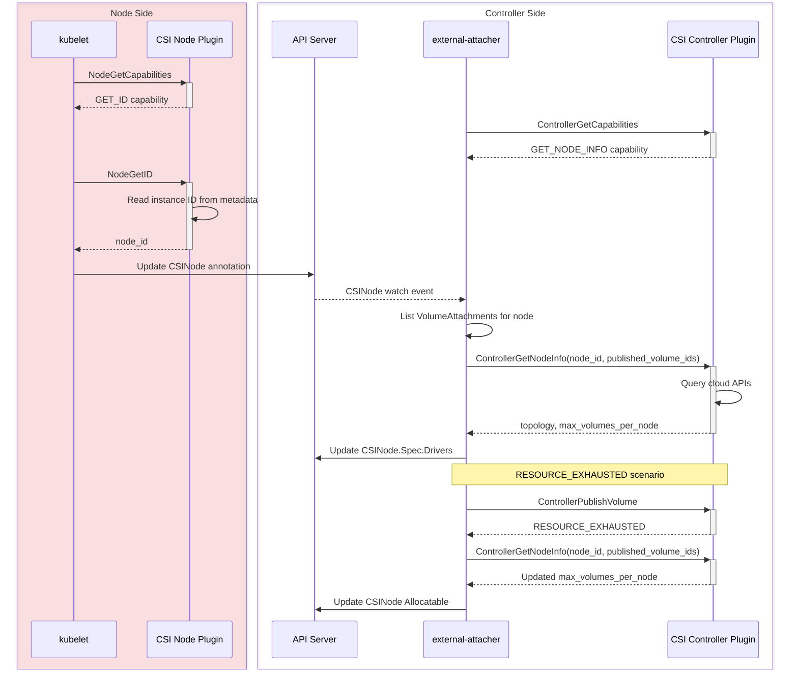

# KEP-6011: CSI ControllerGetNodeInfo

<!-- toc -->
- [Release Signoff Checklist](#release-signoff-checklist)
- [Summary](#summary)
- [Motivation](#motivation)
  - [Goals](#goals)
  - [Non-Goals](#non-goals)
- [Proposal](#proposal)
  - [User Stories](#user-stories)
    - [Story 1: Security-hardened Environment](#story-1-security-hardened-environment)
    - [Story 2: Accurate Non-CSI Volume Accounting](#story-2-accurate-non-csi-volume-accounting)
    - [Story 3: Large Cluster Scalability](#story-3-large-cluster-scalability)
  - [Risks and Mitigations](#risks-and-mitigations)
  - [Notes/Constraints/Caveats](#notesconstraintscaveats)
- [Design Details](#design-details)
  - [CSI Spec Changes](#csi-spec-changes)
    - [NodeGetID RPC](#nodegetid-rpc)
    - [ControllerGetNodeInfo RPC](#controllergetnodeinfo-rpc)
    - [New Capabilities](#new-capabilities)
  - [Kubernetes Integration](#kubernetes-integration)
    - [kubelet Changes](#kubelet-changes)
    - [external-attacher Changes](#external-attacher-changes)
    - [Race Condition Mitigation](#race-condition-mitigation)
    - [Workflow](#workflow)
  - [API Changes](#api-changes)
    - [CSINode Annotation](#csinode-annotation)
  - [Test Plan](#test-plan)
      - [Prerequisite testing updates](#prerequisite-testing-updates)
      - [Unit tests](#unit-tests)
      - [Integration tests](#integration-tests)
      - [e2e tests](#e2e-tests)
  - [Graduation Criteria](#graduation-criteria)
    - [Alpha](#alpha)
    - [Beta](#beta)
    - [GA](#ga)
  - [Upgrade / Downgrade Strategy](#upgrade--downgrade-strategy)
  - [Version Skew Strategy](#version-skew-strategy)
- [Production Readiness Review Questionnaire](#production-readiness-review-questionnaire)
  - [Feature Enablement and Rollback](#feature-enablement-and-rollback)
  - [Rollout, Upgrade and Rollback Planning](#rollout-upgrade-and-rollback-planning)
  - [Monitoring Requirements](#monitoring-requirements)
  - [Dependencies](#dependencies)
  - [Scalability](#scalability)
  - [Troubleshooting](#troubleshooting)
- [Implementation History](#implementation-history)
- [Drawbacks](#drawbacks)
- [Alternatives](#alternatives)
  - [Alternative 1: Private CRD and Controller](#alternative-1-private-crd-and-controller)
  - [Alternative 2: Instance Metadata Enhancement](#alternative-2-instance-metadata-enhancement)
  - [Alternative 3: Node Label Patching (e.g., AWS metadata-labeler)](#alternative-3-node-label-patching-eg-aws-metadata-labeler)
  - [Alternative 4: CRD-based Topology Retrieval (e.g., vSphere CSINodeTopology)](#alternative-4-crd-based-topology-retrieval-eg-vsphere-csinodetopology)
- [Infrastructure Needed](#infrastructure-needed)
<!-- /toc -->

## Release Signoff Checklist

Items marked with (R) are required *prior to targeting to a milestone / release*.

- [ ] (R) Enhancement issue in release milestone, which links to KEP dir in [kubernetes/enhancements] (not the initial KEP PR)
- [ ] (R) KEP approvers have approved the KEP status as `implementable`
- [ ] (R) Design details are appropriately documented
- [ ] (R) Test plan is in place, giving consideration to SIG Architecture and SIG Testing input
  - [ ] e2e Tests for all Beta API Operations
  - [ ] (R) Ensure GA e2e tests meet requirements for [Conformance Tests]
  - [ ] (R) Minimum Two Week Window for GA e2e tests to prove flake free
- [ ] (R) Graduation criteria is in place
  - [ ] (R) [all GA Endpoints] must be hit by [Conformance Tests] within one minor version of promotion to GA
- [ ] (R) Production readiness review completed
- [ ] (R) Production readiness review approved
- [ ] "Implementation History" section is up-to-date for milestone
- [ ] User-facing documentation has been created in [kubernetes/website]
- [ ] Supporting documentation—e.g., additional design documents, links to mailing list discussions/SIG meetings, relevant PRs/issues, release notes

[kubernetes.io]: https://kubernetes.io/
[kubernetes/enhancements]: https://git.k8s.io/enhancements
[kubernetes/kubernetes]: https://git.k8s.io/kubernetes
[kubernetes/website]: https://git.k8s.io/website

## Summary

This KEP introduces two new optional CSI RPCs, `NodeGetID` and `ControllerGetNodeInfo`, that together allow a CSI driver to split node registration into two phases: a lightweight node-side identity call and a controller-side lookup for topology and capacity. This eliminates the need for cloud API credentials on worker nodes while preserving full topology-aware scheduling and accurate volume limit tracking.

## Motivation

Today, the CSI `NodeGetInfo` RPC is the single entry point for a node to report its identity, topology, and volume capacity to the Container Orchestrator (CO). In practice, some CSI driver implementations require cloud API credentials on the node to fully populate this response, for example to query the instance's availability zone or the maximum number of attachable volumes. Other implementations work around this by using hardcoded tables or local instance metadata, but these approaches sacrifice accuracy: they cannot account for non-CSI volume attachments, they cannot dynamically adjust when conditions change, and hardcoded tables require a new driver release whenever the cloud provider introduces new instance types.

This creates several problems:

1. **Security**: Organizations with strict security postures, particularly in financial services and government, prohibit distributing cloud API credentials to worker nodes. These users must choose between security and full CSI functionality.

2. **Accuracy**: The scheduler only counts CSI volumes when enforcing `max_volumes_per_node`. Non-CSI attachments (boot volumes, manually attached disks, network interfaces consuming shared device slots) are invisible to it. So the SP must subtract non-CSI attachments from the instance-type limit before reporting `max_volumes_per_node`. The node side can only approximate this, using static configuration or stale metadata. The controller side can do it precisely, because it knows which volumes are CSI-managed (via `VolumeAttachment` objects) and can query the cloud for actual attachments.

3. **Scalability**: In large clusters, every node independently calls cloud APIs during registration. A 5000-node cluster startup produces 5000 concurrent API calls, risking throttling and slow registration. A controller-side approach enables batching, caching, and coordinated rate limiting.

4. **Accuracy of dynamic updates**: KEP-4876 made `CSINode.Spec.Drivers[*].Allocatable.Count` mutable and introduced periodic and failure-triggered updates via `NodeGetInfo`. This KEP builds on that foundation by moving the update source to the controller side, which lets CSI drivers define precisely which attachments are CSI-managed and which are not. The node-side `NodeGetInfo` RPC doesn't have this context, so drivers today must approximate non-CSI attachments using static reservations or metadata heuristics.

This KEP addresses all four problems by introducing a clean split: the node reports only its identity (cheap, local, no credentials), and the controller fills in topology and capacity (where credentials and `VolumeAttachment` context already exist).

### Goals

- Enable CSI node registration without cloud API credentials on the node
- Provide accurate volume capacity tracking by leveraging controller-side `VolumeAttachment` knowledge to account for non-CSI attachments
- Improve scalability through controller-side batching and caching of cloud API calls
- Maintain full backward compatibility; drivers that do not implement the new RPCs continue to work unchanged

### Non-Goals

- Modifying Kubernetes core scheduling logic
- Requiring changes to CSI drivers that do not need this feature
- Implementing cloud provider-specific solutions within Kubernetes core

## Proposal

### User Stories

#### Story 1: Security-hardened Environment

A financial services company prohibits cloud API credentials on worker nodes. Today, their CSI driver's `NodeGetInfo` either returns incomplete data (no topology, inaccurate limits) or requires a provider-specific workaround. With this proposal, the node calls `NodeGetID` using only local instance metadata, and the controller calls `ControllerGetNodeInfo` with existing credentials. Full functionality, no credentials on nodes, no custom workarounds.

#### Story 2: Accurate Non-CSI Volume Accounting

An operator's nodes have boot volumes, manually attached disks, and network interfaces consuming shared device slots, none of which are managed by CSI. The scheduler doesn't know about these; it only counts CSI volumes. So the SP must subtract non-CSI attachments from the instance-type limit before reporting `max_volumes_per_node`. Today, some CSI drivers handle this with static configuration (e.g., AWS EBS CSI driver's `--reserved-volume-attachments`) or provider-specific sidecars (e.g., AWS EBS CSI driver's metadata-labeler). With this proposal, the controller queries actual cloud attachments, compares against `VolumeAttachment` objects to identify non-CSI volumes, and reports an accurate limit, dynamically, with no manual configuration.

#### Story 3: Large Cluster Scalability

A 5000-node cluster startup triggers 5000 concurrent cloud API calls from `NodeGetInfo`. With this proposal, the controller can batch instance queries, cache results by instance type, and apply coordinated rate limiting, significantly reducing cloud API load and registration time.

### Risks and Mitigations

| Risk | Mitigation |
|------|------------|
| Node registration latency increases | `NodeGetID` is faster than `NodeGetInfo` (no cloud API). The controller-side roundtrip adds seconds, but node registration is a one-time event. Net impact is minimal. |
| Controller becomes a bottleneck | The controller already handles `ControllerPublishVolume` for every attach. `ControllerGetNodeInfo` adds one call per node registration, which is negligible overhead. Batching and caching further reduce load. |
| Race between `ControllerGetNodeInfo` and concurrent attach/detach | External-attacher defers attach/detach for the specific node during processing. See [Race Condition Mitigation](#race-condition-mitigation). |
| Version skew | Feature gates on both kubelet and external-attacher. Capability detection provides graceful fallback. See [Version Skew Strategy](#version-skew-strategy). |

### Notes/Constraints/Caveats

- **CSI Spec Dependency**: This KEP requires [CSI spec PR #603](https://github.com/container-storage-interface/spec/pull/603) to be merged first. Kubernetes implementation cannot proceed until the spec changes land.

- **Upgrade Order**: External-attacher must be upgraded before nodes. When kubelet uses `NodeGetID` but external-attacher doesn't yet support `ControllerGetNodeInfo`, nodes register with only a `node_id` annotation, and topology and allocatable remain unset until external-attacher catches up. This is a transient state, not a failure.

- **Backward Compatibility**: Drivers that do not implement the new RPCs continue to use `NodeGetInfo` unchanged. No breaking changes.

- **Annotation Lifecycle**: kubelet owns the `CSINode` annotation. On driver unregistration (`UninstallCSIDriver`), kubelet removes the driver's entry from the JSON map (and removes the annotation entirely if the map is empty), removes the `CSINode.Spec.Drivers` entry, and removes the Node annotation entry. On re-registration, kubelet calls `NodeGetID` again, setting the annotation and triggering external-attacher to call `ControllerGetNodeInfo`.

- **Concurrent Annotation Updates**: Multiple drivers registering on the same node update the same JSON map annotation. kubelet uses read-modify-write with `resourceVersion` conflict detection, retrying on conflict. This is consistent with existing Node annotation handling.

## Design Details

### CSI Spec Changes

This KEP depends on [CSI spec PR #603](https://github.com/container-storage-interface/spec/pull/603).

#### NodeGetID RPC

```protobuf
rpc NodeGetID(NodeGetIDRequest) returns (NodeGetIDResponse) {
    option (alpha_method) = true;
}
```

Returns only the node identifier, obtainable locally without cloud API credentials (e.g., from instance metadata).

| | |
|-|-|
| **Input** | None |
| **Output** | `node_id` (string), e.g. EC2 instance ID, ECS instance ID |

**Example implementations**:
- **AWS EBS**: `http://169.254.169.254/latest/meta-data/instance-id`, no IAM credentials needed
- **Alibaba Cloud**: `http://100.100.100.200/latest/meta-data/instance-id`, no cloud API credentials needed

#### ControllerGetNodeInfo RPC

```protobuf
rpc ControllerGetNodeInfo(ControllerGetNodeInfoRequest) returns (ControllerGetNodeInfoResponse) {
    option (alpha_method) = true;
}
```

Retrieves topology and capacity from the controller side, where cloud API credentials are already available.

| | |
|-|-|
| **Input** | `node_id` (from `NodeGetID`), `published_volume_ids` (volumes the CO believes are published to this node) |
| **Output** | `accessible_topology` (zone, region, etc.), `max_volumes_per_node` |

**Why `published_volume_ids`?** To understand this field, consider how the scheduler uses `max_volumes_per_node`: it treats it as the number of CSI-managed volumes the node can support, then subtracts the CSI volumes it already knows about to determine available slots. The scheduler has no awareness of non-CSI attachments (boot volumes, network interfaces consuming shared device slots, manually attached disks). So the SP must account for them; it cannot simply report the raw instance-type limit, or the scheduler will over-schedule.

Today, CSI drivers handle this on the node side with approximations. For example, the AWS EBS CSI driver computes `instance_limit - reserved_attachments - ENIs` (see [`getVolumesLimit()`](https://github.com/kubernetes-sigs/aws-ebs-csi-driver/blob/master/pkg/driver/node.go)), using static configuration (`--reserved-volume-attachments`) or metadata heuristics. But the node side cannot dynamically distinguish CSI-managed from non-CSI attachments.

The controller side can. It queries the cloud API for actual attachments and needs to subtract the CSI-managed ones to isolate non-CSI attachments. `published_volume_ids` provides exactly this: the list of volumes the CO believes are CSI-managed on this node (from `VolumeAttachment` objects). The SP then computes:

```
total_attached       = cloud API query
non_csi_attached     = total_attached - intersection(total_attached, published_volume_ids)
max_volumes_per_node = instance_type_limit - non_csi_attached
```

**Example**: Instance limit is 25. Cloud API shows 10 attached. CO reports 8 CSI volumes via `published_volume_ids`. SP infers 2 non-CSI → reports `max_volumes_per_node = 23`. Scheduler subtracts 8 CSI volumes → 15 available. Correct: 25 - 10 = 15 real remaining.

The list should include all volumes the CO considers published, including those with uncertain status (in-progress or failed attaches where the `VolumeAttachment` still exists). The SP classifies any volume in both the cloud results and `published_volume_ids` as CSI-managed; the rest as non-CSI.

**Example implementations**:
- **AWS EBS**: `DescribeInstances` for AZ/region and current block device mappings, `DescribeInstanceTypes` for attachment limit. Compares attachments against `published_volume_ids` to infer non-CSI volumes (boot volumes, ENI-consumed slots on shared-limit instance types, manually attached EBS volumes). This would replace the existing [metadata-labeler](https://github.com/kubernetes-sigs/aws-ebs-csi-driver/blob/master/pkg/cloud/metadata/labels.go) sidecar and the `--reserved-volume-attachments` CLI flag.
- **Alibaba Cloud**: `DescribeInstances` for zone/region, `DescribeAvailableResource` for disk categories, `DescribeDisks` for current attachments, `DescribeInstanceTypes` for limits.

#### New Capabilities

- `NodeServiceCapability.RPC.GET_ID`: indicates support for `NodeGetID`
- `ControllerServiceCapability.RPC.GET_NODE_INFO`: indicates support for `ControllerGetNodeInfo`

**Invariant**: If a driver advertises `GET_ID`, it MUST also advertise `GET_NODE_INFO`. This is enforced by the CSI spec. Without this invariant, a node could register with only a `node_id` annotation and never have topology or allocatable populated, because kubelet skips `NodeGetInfo` when `GET_ID` is present.

**Topology key consistency**: `ControllerGetNodeInfo` MUST return the same topology keys as the driver's `NodeGetInfo` would. Existing PersistentVolumes have `nodeAffinity` rules referencing these keys (e.g., `topology.ebs.csi.aws.com/zone`). Inconsistent keys would break scheduling for already-provisioned volumes.

### Kubernetes Integration

#### kubelet Changes

When the `CSINodeGetID` feature gate is enabled and the CSI node plugin advertises `GET_ID`:

1. Call `NodeGetID` instead of `NodeGetInfo`
2. Store the `node_id` in a CSINode annotation: `csi.volume.kubernetes.io/nodeid` (JSON map of driver name → node ID)
3. Do NOT populate topology or allocatable; external-attacher handles this via `ControllerGetNodeInfo`
4. Skip periodic `NodeGetInfo` calls (KEP-4876) for this driver, as external-attacher takes over
5. If `NodeGetID` fails, fail registration (no fallback to `NodeGetInfo` since the driver claims to support `GET_ID`, so it must work)
6. If `GET_ID` is not advertised, use existing `NodeGetInfo` flow unchanged

```go
if hasGetIDCapability(driver) {
    nodeID, err := nodePlugin.NodeGetID()
    if err != nil {
        return fmt.Errorf("NodeGetID failed: %w", err)
    }
    // Read-modify-write with resourceVersion conflict detection
    nodeIDMap := json.Unmarshal(csiNode.Annotations["csi.volume.kubernetes.io/nodeid"])
    nodeIDMap[driverName] = nodeID
    csiNode.Annotations["csi.volume.kubernetes.io/nodeid"] = json.Marshal(nodeIDMap)
} else {
    nodeInfo, err := nodePlugin.NodeGetInfo()
    // ... existing flow ...
}
```

#### external-attacher Changes

When the `CSIControllerGetNodeInfo` feature gate is enabled and the CSI controller plugin advertises `GET_NODE_INFO`:

1. Watch CSINode objects for the `csi.volume.kubernetes.io/nodeid` annotation
2. Call `ControllerGetNodeInfo` when a driver appears in the annotation but has no corresponding `CSINode.Spec.Drivers` entry (initial registration)
3. Call `ControllerGetNodeInfo` after `ControllerPublishVolume` returns `RESOURCE_EXHAUSTED` (capacity correction, building on KEP-4876)
4. Call `ControllerGetNodeInfo` periodically if `CSIDriver.Spec.NodeAllocatableUpdatePeriodSeconds` is set (periodic refresh, building on KEP-4876)
5. Update `CSINode.Spec.Drivers` with topology and `Allocatable.Count` from the response

```go
func processCSINode(csiNode) {
    nodeIDMap := json.Unmarshal(csiNode.Annotations["csi.volume.kubernetes.io/nodeid"])
    for driverName, nodeID := range nodeIDMap {
        if driverInSpec(csiNode, driverName) && !periodicUpdateDue(driverName) {
            continue
        }
        publishedVolumeIDs := getPublishedVolumes(driverName, csiNode.Name)
        info := ControllerGetNodeInfo(nodeID, publishedVolumeIDs)
        updateCSINodeDriver(csiNode, driverName, nodeID, info)
    }
}
```

**Integration with KEP-4876**: When a driver supports `ControllerGetNodeInfo`, external-attacher takes over the responsibilities that KEP-4876 assigns to kubelet:

| Responsibility | KEP-4876 (kubelet) | KEP-6011 (external-attacher) |
|---|---|---|
| Periodic updates | `NodeGetInfo` at `NodeAllocatableUpdatePeriodSeconds` interval | `ControllerGetNodeInfo` at same interval |
| RESOURCE_EXHAUSTED handling | kubelet detects error, calls `NodeGetInfo` | external-attacher detects error, calls `ControllerGetNodeInfo` |

The key advantage: external-attacher has accurate `published_volume_ids` from `VolumeAttachment` objects, enabling precise non-CSI volume accounting that the node side cannot achieve.

**Periodic update scalability**: External-attacher uses a rate-limited work queue with jitter (±20% of the configured period) rather than per-node timers. This prevents thundering herd on restart and provides natural rate limiting for cloud API calls.

**Partial responses**: If `max_volumes_per_node` is 0, the CSI spec convention is "no limit imposed." External-attacher follows this convention and does not set `Allocatable.Count` (the scheduler treats unset `Allocatable.Count` as unlimited, which is consistent). If `accessible_topology` is empty, only `Allocatable.Count` is updated. This allows drivers to implement only the subset they need.

**Idempotency**: All CSI RPCs are idempotent. Repeated `ControllerGetNodeInfo` calls with the same parameters return the same result, making retries and duplicate processing safe.

#### Race Condition Mitigation

A race exists between `ControllerGetNodeInfo` and concurrent attach/detach: if an attach completes between listing `VolumeAttachment` objects and the cloud API query, the newly attached volume appears in cloud results but not in `published_volume_ids`, causing the SP to misclassify it as non-CSI.

**Mitigation**: External-attacher defers `ControllerPublishVolume`/`ControllerUnpublishVolume` for the specific node being processed:

```go
type nodeInfoProcessor struct {
    pendingNodes sync.Map // nodeName -> struct{}
}

func (p *nodeInfoProcessor) processNode(nodeName string) {
    p.pendingNodes.Store(nodeName, struct{}{})
    defer p.pendingNodes.Delete(nodeName)

    publishedVolumeIDs := listVolumeAttachments(nodeName)
    info := ControllerGetNodeInfo(nodeID, publishedVolumeIDs)
    updateCSINode(csiNode, info)
    requeueVolumeAttachments(nodeName) // re-queue deferred VAs
}

func (h *csiHandler) syncAttach(va) {
    if h.nodeInfoProcessor.isPending(va.Spec.NodeName) {
        return // deferred: will be re-queued after ControllerGetNodeInfo completes
    }
    // ... normal attach logic ...
}
```

Only operations for the specific node are deferred; other nodes proceed normally. The deferral window is bounded by the `ControllerGetNodeInfo` RPC timeout (typically a few seconds). On timeout or failure, deferred VAs are re-queued immediately.

#### Workflow



### API Changes

#### CSINode Annotation

A new annotation on `CSINode` objects stores node IDs for drivers using `NodeGetID`:

```
csi.volume.kubernetes.io/nodeid: '{"disk.csi.alibabacloud.com": "i-xxx", "ebs.csi.aws.com": "i-yyy"}'
```

This reuses the same key as the existing Node annotation intentionally. The format is identical (JSON map of driver name → node ID). The two live on different objects and serve different consumers:
- **Node annotation** (existing): set during `NodeGetInfo` flow, consumed by legacy code paths
- **CSINode annotation** (new): set during `NodeGetID` flow, consumed by external-attacher

External-attacher watches CSINode objects, not Node objects, so there is no ambiguity.

**Why a JSON map?** CSI driver names can be up to 63 characters. A per-driver annotation key like `csi.volume.kubernetes.io/nodeid.{driver}` could reach 95 characters, exceeding the 63-character annotation key name segment limit. The JSON map keeps the key fixed at 31 characters.

### Test Plan

[X] I/we understand the owners of the involved components may require updates to existing tests.

##### Prerequisite testing updates

- CSI mock driver updated to support `NodeGetID` and `ControllerGetNodeInfo` RPCs

##### Unit tests

- `k8s.io/kubernetes/pkg/volume/csi`: Capability detection, `NodeGetID` call, annotation JSON handling, `resourceVersion` conflict retry
- `k8s.io/kubernetes/pkg/kubelet`: `NodeGetID` failure (no fallback), `NodeGetInfo` fallback when `GET_ID` absent, periodic update responsibility switching
- `external-attacher`: Annotation detection and `ControllerGetNodeInfo` trigger, `published_volume_ids` construction from VolumeAttachments (including uncertain-status VAs), race condition mitigation (pending node deferral and re-queue), `RESOURCE_EXHAUSTED` → `ControllerGetNodeInfo` → CSINode update flow, multi-driver coexistence (one driver uses new RPCs, another does not), periodic update work queue with jitter, partial response handling, external-attacher restart recovery

##### Integration tests

- Node registration end-to-end with new RPCs
- `NodeGetID` failure blocks registration
- Capacity update after `RESOURCE_EXHAUSTED`

##### e2e tests

- End-to-end workflow with CSI driver supporting new RPCs
- Backward compatibility with drivers not supporting new RPCs
- Topology-aware scheduling with controller-side topology
- Capacity update after volume limit reached

### Graduation Criteria

#### Alpha

- Feature implemented behind `CSINodeGetID` (kubelet) and `CSIControllerGetNodeInfo` (external-attacher) feature gates
- CSI spec PR #603 merged with new RPCs (alpha)
- kubelet: `NodeGetID` support with `NodeGetInfo` fallback
- external-attacher: `ControllerGetNodeInfo` support
- Unit and integration tests passing

#### Beta

- CSI spec RPCs promoted to beta
- Feedback incorporated from at least two CSI driver implementations
- All e2e tests passing
- Scalability validated in clusters with 1000+ nodes
- CSI driver developer documentation published

#### GA

- CSI spec RPCs stable
- Multiple CSI drivers using the feature in production
- No critical issues for two consecutive releases
- Documentation complete in [kubernetes/website]

### Upgrade / Downgrade Strategy

**Upgrade**: Controller-first. Upgrade external-attacher (with feature gate enabled), then upgrade nodes incrementally. The controller is ready to process annotations before nodes start producing them. No coordination beyond ordering is required.

**Downgrade**: Reverse order. Downgrade nodes first (they revert to `NodeGetInfo`), then downgrade external-attacher. Existing `CSINode` objects remain valid throughout.

### Version Skew Strategy

| Scenario | Behavior |
|---|---|
| kubelet has feature, CSI driver lacks `GET_ID` | kubelet detects missing capability, uses `NodeGetInfo` |
| CSI driver has `GET_ID`, kubelet lacks feature | `GET_ID` capability ignored, `NodeGetInfo` called |
| external-attacher has feature, CSI controller lacks `GET_NODE_INFO` | external-attacher detects missing capability, skips `ControllerGetNodeInfo` |
| CSI controller has `GET_NODE_INFO`, external-attacher lacks feature | `GET_NODE_INFO` capability ignored |
| Node side has feature, controller side does not | Annotation written but not consumed; topology/allocatable unset until controller upgraded |

## Production Readiness Review Questionnaire

### Feature Enablement and Rollback

###### How can this feature be enabled / disabled in a live cluster?

- [X] Feature gate
  - Feature gate name: `CSINodeGetID` (kubelet), `CSIControllerGetNodeInfo` (external-attacher)
  - Components depending on the feature gate: kubelet, external-attacher

###### Does enabling the feature change any default behavior?

No. kubelet checks for `GET_ID` capability first. If the CSI driver does not advertise it, the existing `NodeGetInfo` flow is used unchanged.

###### Can the feature be disabled once it has been enabled?

Yes. Set feature gates to `false` and restart components. kubelet reverts to `NodeGetInfo`. Existing `CSINode` objects remain valid.

###### What happens if we reenable the feature if it was previously rolled back?

kubelet re-checks capabilities and uses the new RPCs if supported. External-attacher re-processes any pending annotations.

###### Are there any tests for feature enablement/disablement?

Yes, unit tests cover capability detection, fallback logic, and behavior with feature gate on/off.

### Rollout, Upgrade and Rollback Planning

###### How can a rollout or rollback fail? Can it impact already running workloads?

Running workloads are not affected. Failure scenarios affect only new node registrations and new scheduling decisions:
- kubelet enabled but external-attacher not upgraded: nodes register with annotation only, topology/allocatable unset. Mitigated by upgrading controller first.
- `NodeGetID` RPC fails: node registration fails for that driver. Mitigated by fixing the driver or disabling the feature gate.

###### What specific metrics should inform a rollback?

- `csi_operations_seconds{method_name="NodeGetID",grpc_status_code!="OK"}`: high error rate indicates `NodeGetID` failures
- `csi_sidecar_operations_seconds{method_name="ControllerGetNodeInfo",grpc_status_code!="OK"}`: high error rate indicates controller-side failures
- Increase in pods stuck in `ContainerCreating` due to missing topology

###### Were upgrade and rollback tested? Was the upgrade->downgrade->upgrade path tested?

Manual testing during alpha: enable feature gates → verify new RPCs used → disable feature gates → verify `NodeGetInfo` fallback → re-enable → verify new RPCs resume.

###### Is the rollout accompanied by any deprecations and/or removals of features, APIs, fields of API types, flags, etc.?

No.

### Monitoring Requirements

###### How can an operator determine if the feature is in use by workloads?

Check for `csi.volume.kubernetes.io/nodeid` annotation on CSINode objects. If present, the driver is using the new flow.

###### How can someone using this feature know that it is working?

- [X] Events
  - Event Reason: `CSINodeInfoUpdated`, emitted by external-attacher when topology/allocatable is populated
- [X] API .status
  - `CSINode.Spec.Drivers[*].Topology` and `CSINode.Spec.Drivers[*].Allocatable.Count` populated for drivers using the new flow

###### What are the reasonable SLOs?

- Node registration with topology populated: < 30 seconds after kubelet starts
- Capacity correction after `RESOURCE_EXHAUSTED`: < 10 seconds

###### What are the SLIs (Service Level Indicators) an operator can use to determine the health of the service?

- [X] Metrics
  - `csi_operations_seconds{method_name="NodeGetID"}`: kubelet-side latency and error rate
  - `csi_sidecar_operations_seconds{method_name="ControllerGetNodeInfo"}`: external-attacher-side latency and error rate
  - Both are existing histogram metrics with new `method_name` label values. Error rate derived via `grpc_status_code!="OK"`.

###### Are there any missing metrics that would be useful to have to improve observability of this feature?

No. The existing `csi_operations_seconds` and `csi_sidecar_operations_seconds` histograms provide success/failure tracking, latency, and adoption visibility through the new `method_name` label values.

### Dependencies

###### Does this feature depend on any specific services running in the cluster?

- **CSI drivers supporting the new RPCs**: Required for the feature to activate. Drivers without the new RPCs fall back to `NodeGetInfo` with no impact.
- **external-attacher sidecar**: Must be deployed with the `CSIControllerGetNodeInfo` feature gate enabled. If external-attacher is down, nodes register with annotation only, and topology and allocatable remain unset until it recovers and processes pending annotations.

### Scalability

###### Will enabling / using this feature result in any new API calls?

One `ControllerGetNodeInfo` gRPC call per node registration, plus additional calls on `RESOURCE_EXHAUSTED` and periodic updates (if configured). One CSINode PATCH per node to write the annotation, one to update `Spec.Drivers`.

###### Will enabling / using this feature result in introducing new API types?

No.

###### Will enabling / using this feature result in any new calls to cloud provider?

No net new calls. The cloud API calls move from node to controller. Controller-side batching and caching can reduce total call volume in large clusters.

###### Will enabling / using this feature result in increasing size or count of the existing API objects?

CSINode gains one annotation (~100-200 bytes per driver). `Spec.Drivers` fields are unchanged in size, just populated by external-attacher instead of kubelet.

###### Will enabling / using this feature result in increasing time taken by any operations covered by existing SLIs/SLOs?

Node registration time may increase slightly due to the controller-side roundtrip, offset by `NodeGetID` being faster than `NodeGetInfo`. Overall impact expected < 1 second.

###### Will enabling / using this feature result in non-negligible increase of resource usage (CPU, RAM, disk, IO, ...) in any components?

Minimal. kubelet makes one lighter RPC (`NodeGetID`). External-attacher handles annotation processing and `ControllerGetNodeInfo` calls, plus a small map for pending node tracking.

###### Can enabling / using this feature result in resource exhaustion of some node resources (PIDs, sockets, inodes, etc.)?

No. `NodeGetID` is a single gRPC call on the existing CSI socket. No new processes, files, or connections.

### Troubleshooting

###### How does this feature react if the API server and/or etcd is unavailable?

kubelet and external-attacher retry until available. Existing workloads are unaffected. New scheduling may be delayed.

###### What are other known failure modes?

- **`NodeGetID` RPC fails**
  - Detection: `csi_operations_seconds{method_name="NodeGetID",grpc_status_code!="OK"}`
  - Mitigation: Fix driver or disable feature gate. Node uses `NodeGetInfo` on restart.
  - Diagnostics: kubelet error log: "NodeGetID failed: ..."

- **external-attacher cannot reach CSI controller**
  - Detection: `csi_sidecar_operations_seconds{method_name="ControllerGetNodeInfo",grpc_status_code!="OK"}`
  - Mitigation: Restart external-attacher. Pending annotations are re-processed on recovery.
  - Diagnostics: external-attacher error logs with RPC failure details.

- **Cloud API throttling during large cluster startup**
  - Detection: High latency in `csi_sidecar_operations_seconds{method_name="ControllerGetNodeInfo"}`
  - Mitigation: CSI driver implements retry with backoff. Increase cloud API quotas if needed.

###### What steps should be taken if SLOs are not being met to determine the problem?

1. Check error rate metrics for `NodeGetID` (kubelet) and `ControllerGetNodeInfo` (external-attacher)
2. Check latency metrics for both RPCs
3. Review kubelet and external-attacher logs for RPC failures
4. Verify CSI driver advertises the expected capabilities
5. Verify feature gates are enabled on both components
6. Check CSINode objects for missing topology/allocatable entries

## Implementation History

- 2026-03-21: CSI spec PR [#603](https://github.com/container-storage-interface/spec/pull/603) opened
- 2026-04-08: Discussed in SIG Storage meeting
- 2026-04-14: KEP drafted

## Drawbacks

- Adds two new RPCs to the CSI spec, increasing spec surface area
- Requires coordination between kubelet and external-attacher during upgrade
- Adds one roundtrip to node registration (offset by lighter node-side call)

## Alternatives

### Alternative 1: Private CRD and Controller

A new CRD (`CSINodeInfo`) and controller to store and populate node info.

**Why not**: Replaces cloud API credentials with CR read permissions, which doesn't fundamentally solve the security problem. Adds more roundtrips (cloud → controller → API server → node → kubelet → API server → scheduler). Harder to handle `RESOURCE_EXHAUSTED`. Kubernetes-specific, doesn't help other COs.

### Alternative 2: Instance Metadata Enhancement

Enhance cloud instance metadata services to provide all required information.

**Why not**: Metadata services typically provide only basic info (instance ID, zone). They don't provide attachment limits, supported disk categories, or the list of CSI-managed volumes needed to infer non-CSI attachments. Requires coordination with every cloud provider. Not feasible for all environments.

### Alternative 3: Node Label Patching (e.g., AWS metadata-labeler)

The AWS EBS CSI driver implements a [metadata-labeler](https://github.com/kubernetes-sigs/aws-ebs-csi-driver/blob/master/pkg/cloud/metadata/labels.go) sidecar that runs on the controller, queries EC2 APIs for ENI and block device counts, and patches Node labels. The node-side driver reads these labels via the Kubernetes API.

**Why not**: Provider-specific, every driver needs its own solution. Mixes storage info into Node labels. Not portable to other COs. Cannot leverage `VolumeAttachment` objects to distinguish CSI-managed vs non-CSI volumes. When IMDS is unavailable and labels haven't been patched yet, the node-side driver falls back to less accurate metadata sources.

### Alternative 4: CRD-based Topology Retrieval (e.g., vSphere CSINodeTopology)

The vSphere CSI driver uses a [`CSINodeTopology`](https://github.com/kubernetes-sigs/vsphere-csi-driver/blob/master/pkg/internalapis/csinodetopology/v1alpha1/csinodetopology_types.go) CRD. The node creates a CR, the controller populates topology via vCenter API, and the node watches for completion before returning `NodeGetInfoResponse`.

**Why not**: Provider-specific. Node registration blocks until the controller updates the CR, and if the controller is slow or down, the node waits until timeout. Requires additional CRD and controller. Not portable to other COs.

This proposal provides a standardized CSI spec approach that all drivers can adopt, avoiding provider-specific implementations.

## Infrastructure Needed

- CSI spec update: [PR #603](https://github.com/container-storage-interface/spec/pull/603)
- CSI mock driver updated with new RPCs for testing