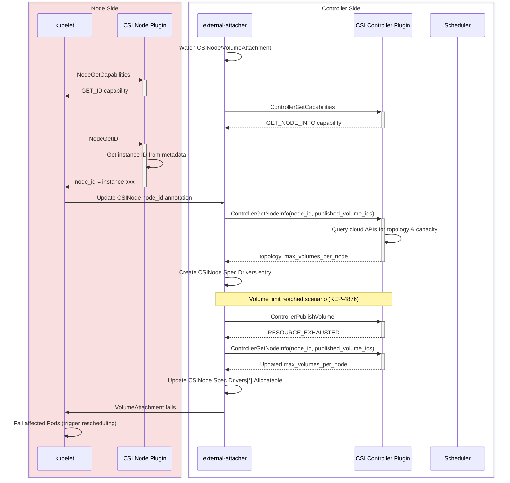

# KEP-6011: Controller-side Node Info Retrieval for CSI Drivers

<!-- toc -->
- [Release Signoff Checklist](#release-signoff-checklist)
- [Summary](#summary)
- [Motivation](#motivation)
  - [Goals](#goals)
  - [Non-Goals](#non-goals)
- [Proposal](#proposal)
  - [User Stories](#user-stories)
    - [Story 1: Security-hardened Environment](#story-1-security-hardened-environment)
    - [Story 2: Non-CSI Volume Attachments](#story-2-non-csi-volume-attachments)
    - [Story 3: Dynamic Capacity Updates](#story-3-dynamic-capacity-updates)
  - [Risks and Mitigations](#risks-and-mitigations)
  - [Race Condition Mitigation](#race-condition-mitigation)
  - [Notes/Constraints/Caveats (Optional)](#notesconstraintscaveats-optional)
- [Design Details](#design-details)
  - [CSI Spec Changes](#csi-spec-changes)
    - [NodeGetID RPC](#nodegetid-rpc)
    - [ControllerGetNodeInfo RPC](#controllergetnodeinfo-rpc)
    - [New Capabilities](#new-capabilities)
  - [Kubernetes Integration](#kubernetes-integration)
    - [kubelet Changes](#kubelet-changes)
    - [external-attacher Changes](#external-attacher-changes)
    - [Workflow Diagram](#workflow-diagram)
  - [API Changes](#api-changes)
    - [CSINode Annotation](#csinode-annotation)
    - [Relationship with Existing Node Annotation](#relationship-with-existing-node-annotation)
  - [Test Plan](#test-plan)
      - [Prerequisite testing updates](#prerequisite-testing-updates)
      - [Unit tests](#unit-tests)
      - [Integration tests](#integration-tests)
      - [e2e tests](#e2e-tests)
  - [Graduation Criteria](#graduation-criteria)
    - [Alpha](#alpha)
    - [Beta](#beta)
    - [GA](#ga)
  - [Upgrade / Downgrade Strategy](#upgrade--downgrade-strategy)
    - [Upgrade Paths](#upgrade-paths)
    - [Downgrade Paths](#downgrade-paths)
  - [Version Skew Strategy](#version-skew-strategy)
- [Production Readiness Review Questionnaire](#production-readiness-review-questionnaire)
  - [Feature Enablement and Rollback](#feature-enablement-and-rollback)
  - [Rollout, Upgrade and Rollback Planning](#rollout-upgrade-and-rollback-planning)
  - [Monitoring Requirements](#monitoring-requirements)
  - [Dependencies](#dependencies)
  - [Scalability](#scalability)
  - [Troubleshooting](#troubleshooting)
- [Implementation History](#implementation-history)
- [Drawbacks](#drawbacks)
- [Alternatives](#alternatives)
  - [Alternative 1: Private CRD and Controller](#alternative-1-private-crd-and-controller)
  - [Alternative 2: Instance Metadata Enhancement](#alternative-2-instance-metadata-enhancement)
  - [Alternative 3: Node Label Patching (e.g., AWS metadata-labeler)](#alternative-3-node-label-patching-eg-aws-metadata-labeler)
  - [Alternative 4: CRD-based Topology Retrieval (e.g., vSphere CSINodeTopology)](#alternative-4-crd-based-topology-retrieval-eg-vsphere-csinodetopology)
- [Infrastructure Needed](#infrastructure-needed)
<!-- /toc -->

## Release Signoff Checklist

Items marked with (R) are required *prior to targeting to a milestone / release*.

- [ ] (R) Enhancement issue in release milestone, which links to KEP dir in [kubernetes/enhancements] (not the initial KEP PR)
- [ ] (R) KEP approvers have approved the KEP status as `implementable`
- [ ] (R) Design details are appropriately documented
- [ ] (R) Test plan is in place, giving consideration to SIG Architecture and SIG Testing input
  - [ ] e2e Tests for all Beta API Operations
  - [ ] (R) Ensure GA e2e tests meet requirements for [Conformance Tests]
  - [ ] (R) Minimum Two Week Window for GA e2e tests to prove flake free
- [ ] (R) Graduation criteria is in place
  - [ ] (R) [all GA Endpoints] must be hit by [Conformance Tests] within one minor version of promotion to GA
- [ ] (R) Production readiness review completed
- [ ] (R) Production readiness review approved
- [ ] "Implementation History" section is up-to-date for milestone
- [ ] User-facing documentation has been created in [kubernetes/website]
- [ ] Supporting documentation—e.g., additional design documents, links to mailing list discussions/SIG meetings, relevant PRs/issues, release notes

[kubernetes.io]: https://kubernetes.io/
[kubernetes/enhancements]: https://git.k8s.io/enhancements
[kubernetes/kubernetes]: https://git.k8s.io/kubernetes
[kubernetes/website]: https://git.k8s.io/website

## Summary

This KEP proposes changes to enable CSI drivers to retrieve node topology and capacity information from the controller side, eliminating the need for cloud API credentials on worker nodes. This is achieved through two new CSI RPCs:

1. **NodeGetID** - A lightweight RPC that returns only the node identifier, which can be obtained locally without cloud API access.
2. **ControllerGetNodeInfo** - An RPC that retrieves node topology and capacity information from the controller side, where cloud API credentials are already available.

This proposal addresses strict security requirements that prohibit distributing cloud API credentials to node components, while maintaining full functionality for topology-aware scheduling and capacity tracking.

## Motivation

Some users have strict security requirements that prohibit distributing cloud API credentials to node components. However, the current CSI `NodeGetInfo` RPC requires cloud API access to retrieve:

1. **Topology information** (zone, region, supported disk categories)
2. **max_volumes_per_node** (requires querying currently attached disks, including those not managed by CSI)

This creates a fundamental conflict between security requirements and CSI functionality. Users who cannot provide cloud API credentials to nodes are unable to use topology-aware scheduling and proper capacity tracking, leading to:
- Pods being scheduled on nodes without proper topology constraints
- Volume attachment failures due to capacity mismatches
- Reduced security posture when credentials must be distributed

Additionally, this proposal improves scalability for large clusters. In a cluster with 5000 nodes, the current approach requires each node to independently call cloud APIs to retrieve topology and capacity information. With this proposal, the controller side can aggregate and cache these calls, significantly reducing the number of API requests to the cloud provider and improving overall cluster startup time.

Furthermore, accurate calculation of `max_volumes_per_node` requires knowledge of currently attached volumes, including non-CSI volumes (e.g., boot volumes, manually attached cloud disks, volumes managed by other systems). The list of CSI-managed volumes attached to a node is only accurately known by the controller side (via `VolumeAttachment` objects), not by the node side. Although `Node.status.volumesAttached` exists, this information may not have propagated to the node via watch mechanisms, making it potentially stale or incomplete. By moving volume limit calculation to the controller side, the SP can accurately compare CSI-managed volumes against actual cloud API results to infer non-CSI attachments and calculate the correct remaining capacity.

### Goals

- Enable node registration without requiring cloud API credentials on the node side
- Maintain full topology-aware scheduling functionality
- Maintain accurate capacity tracking for volume limits by leveraging controller-side knowledge of CSI-managed volumes (via `VolumeAttachment` objects) to accurately infer and account for non-CSI attachments
- Provide backward compatibility with existing CSI drivers
- Support dynamic capacity updates after volume attachment failures
- Improve scalability by enabling aggregation and caching of cloud API calls on the controller side

### Non-Goals

- Modifying the core scheduling logic of Kubernetes
- Requiring changes to CSI drivers that do not need this feature
- Implementing cloud provider-specific solutions within Kubernetes core

## Proposal

### User Stories

#### Story 1: Security-hardened Environment

A financial services company has a strict security policy that prohibits distributing cloud API credentials to worker nodes. Their security baseline requires that:
- Node components cannot access cloud provider APIs
- All cloud API calls must be made from centralized control plane components

With this proposal, they can deploy CSI drivers that:
- Use `NodeGetID` on nodes (no cloud API access needed)
- Use `ControllerGetNodeInfo` from the control plane (where credentials are centralized)
- Maintain full functionality with enhanced security

without requiring provider-specific solutions like AWS EBS metadata-labeler

#### Story 2: Non-CSI Volume Attachments

Users may manually attach volumes to nodes outside of Kubernetes CSI management (e.g., boot volumes, manually attached cloud disks, or volumes managed by other systems). These non-CSI attachments consume volume attachment slots but are invisible to the CO.

Currently, CSI drivers like AWS EBS CSI driver provide `--reserved-volume-attachments` CLI option to reserve slots for non-CSI volumes, but this requires manual configuration and cannot dynamically adjust when non-CSI attachments change.

With this proposal, the controller side can query actual attachments from cloud APIs and accurately calculate remaining capacity without manual configuration. This provides a standardized CSI spec approach that all CSI drivers can adopt.

#### Story 3: Dynamic Capacity Updates

When a `ControllerPublishVolume` operation returns `RESOURCE_EXHAUSTED`, indicating the node has reached its volume limit, the current system has no mechanism to update the capacity information. Pods continue to be scheduled on the node, resulting in stuck workloads.

With this proposal, the external-attacher can:
- Call `ControllerGetNodeInfo` immediately after a `RESOURCE_EXHAUSTED` error
- Update `CSINode` with the accurate capacity
- Prevent further scheduling errors on that node
- Like KEP-4876 but update from controller side

### Risks and Mitigations

| Risk | Mitigation |
|------|------------|
| Increased latency for node registration | The controller-side query adds one additional roundtrip. This is acceptable because node registration is a one-time operation per node startup. |
| Controller-side scalability | The controller already has cloud API access for other operations. `ControllerGetNodeInfo` adds minimal overhead. Additionally, aggregation and caching can reduce overall API calls in large clusters. |
| Race condition during capacity updates | See "Race Condition Mitigation" section below. |
| Version skew between CSI spec and Kubernetes | Feature gates allow gradual rollout. Fallback to `NodeGetInfo` when new RPCs are not supported. Cluster admins should update CSI driver controller before nodes. |

### Race Condition Mitigation

There is a race condition between `ControllerGetNodeInfo` and concurrent attach/detach operations:

1. External-attacher lists `VolumeAttachment` objects to get `published_volume_ids`
2. External-attacher calls `ControllerGetNodeInfo(node_id, published_volume_ids)`
3. CSI driver queries cloud APIs to get actual attached volumes
4. **Race**: A concurrent attach operation may complete between step 1 and step 3. The CSI driver sees the newly attached volume from cloud API, but it's not in `published_volume_ids`. The driver may incorrectly classify this as a non-CSI volume, leading to wrong `max_volumes_per_node` calculation.

**Mitigation**: External-attacher tracks nodes currently being processed by `ControllerGetNodeInfo`:

```go
// Track nodes being processed by ControllerGetNodeInfo
type nodeInfoProcessor struct {
    pendingNodes sync.Map  // nodeName -> struct{}
}

// Before calling ControllerGetNodeInfo
func (p *nodeInfoProcessor) processNode(nodeName) {
    p.pendingNodes.Store(nodeName, struct{}{})
    publishedVolumeIDs = listVolumeAttachments(nodeName)
    info = ControllerGetNodeInfo(nodeID, publishedVolumeIDs)
    // ... update CSINode ...
    p.pendingNodes.Delete(nodeName)
    // Re-queue all VAs for this node to process any skipped operations
    requeueVolumeAttachments(nodeName)
}

// In VA handler - skip attach/detach for nodes being processed
func (h *csiHandler) syncAttach(va) {
    if h.nodeInfoProcessor.isPending(va.Spec.NodeName) {
        // Skip this VA, will be re-queued after ControllerGetNodeInfo completes
        return
    }
    // ... normal attach logic ...
}
```

This ensures:
- Attach/detach operations for the node are paused during `ControllerGetNodeInfo`
- After `ControllerGetNodeInfo` completes (success or failure), all VAs for that node are re-queued
- No race between capacity calculation and concurrent volume operations

### Notes/Constraints/Caveats (Optional)

<!--
What are the caveats to the proposal?
What are some important details that didn't come across above?
Go in to as much detail as necessary here.
This might be a good place to talk about core concepts and how they relate.
-->

- **CSI Spec Dependency**: This KEP requires changes to the CSI specification. The Kubernetes implementation cannot proceed until the CSI spec PR is merged and CSI drivers adopt the new RPCs.

- **Coordination Required**: kubelet and external-attacher must be upgraded in a coordinated manner. external-attacher should be upgraded first, then nodes can be upgraded incrementally. When kubelet enables `NodeGetID` but external-attacher does not support `ControllerGetNodeInfo`, nodes will register with only `node_id` annotation, leaving topology and allocatable unset until external-attacher is upgraded.

- **No Breaking Changes**: The fallback mechanism ensures backward compatibility. CSI drivers that do not implement the new RPCs will continue to work with the existing `NodeGetInfo` flow.

- **Annotation Lifecycle**: The `node_id` annotation follows the same lifecycle as the existing Node annotation. When a CSI plugin unregisters (e.g., during plugin restart or node drain), kubelet's `UninstallCSIDriver` function deletes all related data:
  1. **Node annotation** (existing behavior): Removes the driver's entry from `csi.volume.kubernetes.io/nodeid` annotation on Node object
  2. **CSINode annotation** (new behavior): Removes the driver's entry from `csi.volume.kubernetes.io/nodeid` annotation on CSINode object
  3. **CSINode.Spec.Drivers**: Removes the driver entry from the spec

  When the plugin re-registers, kubelet calls `NodeGetID` again and sets the annotation, triggering external-attacher to call `ControllerGetNodeInfo` and populate `CSINode.Spec.Drivers`. This "delete-then-recreate" pattern during plugin restart ensures clean state and is compatible with the existing CSI driver lifecycle.

## Design Details

### CSI Spec Changes

This KEP depends on changes to the CSI specification, proposed in [CSI spec PR #603](https://github.com/container-storage-interface/spec/pull/603).

#### NodeGetID RPC

A new RPC in the Node service:

```protobuf
rpc NodeGetID(NodeGetIDRequest)
    returns (NodeGetIDResponse) {
    option (alpha_method) = true;
}
```

- **Input**: None
- **Output**: `node_id` (e.g., cloud instance ID)
- **Purpose**: Returns only the node identifier, which can be obtained locally (e.g., from instance metadata service) without cloud API credentials

Example implementation for Alibaba Cloud ECS:
- Returns the ECS instance ID from `http://100.100.100.200/latest/meta-data/instance-id`
- No cloud API credentials required

#### ControllerGetNodeInfo RPC

A new RPC in the Controller service:

```protobuf
rpc ControllerGetNodeInfo(ControllerGetNodeInfoRequest)
    returns (ControllerGetNodeInfoResponse) {
    option (alpha_method) = true;
}
```

- **Input**:
  - `node_id`: The node identifier from `NodeGetID`
  - `published_volume_ids`: Volumes the CO believes are published to the node (for accurate capacity calculation)
- **Output**:
  - `accessible_topology`: Topology information (zone, region, etc.)
  - `max_volumes_per_node`: Maximum number of volumes that can be attached
- **Purpose**: Fetches node topology and capacity information from the controller side, where cloud API credentials are already available

**Why `published_volume_ids` from the controller side?**

The `published_volume_ids` field is crucial for accurate `max_volumes_per_node` calculation. The list of CSI-managed volumes attached to a node is only accurately known by the controller side (via `VolumeAttachment` objects), not by the node side:

- The controller side (external-attacher) watches `VolumeAttachment` objects and maintains an accurate, up-to-date list of volumes it believes are published to each node.
- The node side has no direct access to this information. Although `Node.status.volumesAttached` exists, this information is propagated via watch mechanisms and may be stale or incomplete at the node.
- Even if the node could access attachment information, it would require additional RBAC permissions and network roundtrips.

The `published_volume_ids` should include all volumes the CO considers published, including those with uncertain status (e.g., volumes where the publish RPC failed). This ensures the SP can make accurate capacity decisions even during transient failures.

By passing `published_volume_ids` from the controller side, the SP can:
1. Query actual disk attachments from cloud APIs
2. Compare against the CO-reported CSI volumes
3. Infer non-CSI attachments (e.g., boot volumes, manually attached disks)
4. Calculate accurate `max_volumes_per_node = total_limit - non_csi_attachments`

For example, if a node has a maximum of 16 attachable volumes, 10 are actually attached, but the CO only reports 8 CSI-managed volumes, the SP should infer 2 non-CSI attachments and report `max_volumes_per_node = 14`.

This ensures the volume limit reflects the actual state, including volumes not managed by CSI.

Example implementation for Alibaba Cloud ECS:
- Queries Zone ID and Region ID via `DescribeInstances` API
- Queries supported disk categories via `DescribeAvailableResource` API
- Queries current disk attachments via `DescribeDisks` API
- Queries total attachable disk count via `DescribeInstanceTypes` API

#### New Capabilities

Two new capability flags:

- `NodeServiceCapability.RPC.GET_ID` - Indicates support for `NodeGetID`
- `ControllerServiceCapability.RPC.GET_NODE_INFO` - Indicates support for `ControllerGetNodeInfo`

### Kubernetes Integration

#### kubelet Changes

When the CSI node plugin advertises `GET_ID` capability:

1. Call `NodeGetID` instead of `NodeGetInfo`
2. Store the `node_id` in a `CSINode` annotation using JSON map format: `csi.volume.kubernetes.io/nodeid`
3. Do NOT populate topology and allocatable count (leave for external-attacher)
4. Maintain backward compatibility: use `NodeGetInfo` if `GET_ID` is not supported
5. No fallback on RPC failure: If `NodeGetID` RPC fails, node registration fails. This ensures driver behavior consistency.

```go
// In kubelet CSI plugin initialization
if hasGetIDCapability(driver) {
    nodeID, err := nodePlugin.NodeGetID()
    if err != nil {
        // No fallback to NodeGetInfo - fail registration
        // Driver claims to support GET_ID, so it must work correctly
        return fmt.Errorf("NodeGetID failed: %w", err)
    }
    // Store node_id in CSINode annotation using JSON map format
    nodeIDMap := json.Unmarshal(csiNode.Annotations["csi.volume.kubernetes.io/nodeid"])
    nodeIDMap[driverName] = nodeID
    csiNode.Annotations["csi.volume.kubernetes.io/nodeid"] = json.Marshal(nodeIDMap)
} else {
    // Driver does not support GET_ID capability, use existing NodeGetInfo flow
    nodeInfo, err := nodePlugin.NodeGetInfo()
    // ... existing logic
}
```

**Periodic Update Responsibility Switching**: When the annotation exists for a driver, kubelet skips periodic `NodeGetInfo` calls (KEP-4876). The external-attacher takes over the responsibility via `ControllerGetNodeInfo`:

#### external-attacher Changes

The external-attacher will be extended with a new feature gate `CSIControllerGetNodeInfo` to enable support for the new RPC. When enabled, it will:

1. Watch for `CSINode` annotations indicating nodes that need `ControllerGetNodeInfo`
2. Call `ControllerGetNodeInfo` when:
   - A new node registers with `node_id` in annotation but **no corresponding entry in `spec.drivers`**
   - `RESOURCE_EXHAUSTED` error is returned from `ControllerPublishVolume`
3. Update `CSINode` with topology and allocatable count from the response
4. Do not manage annotation lifecycle - kubelet handles annotation creation and deletion during plugin registration/unregistration
5. Coordinate with attach/detach operations to ensure consistent `published_volume_ids` list

```go
// In external-attacher - watch CSINode and process pending node info requests

// Process CSINode updates: detect annotation with nodeID but no spec.Drivers entry
func processCSINode(csiNode) {
    nodeIDMap := json.Unmarshal(csiNode.Annotations["csi.volume.kubernetes.io/nodeid"])

    for driverName, nodeID := range nodeIDMap {
        if driverInSpec(csiNode, driverName) && !periodicUpdateRequired(driverName, csiNode) {
            continue
        }
        publishedVolumeIDs := getPublishedVolumes(driverName, csiNode.Name)
        info := ControllerGetNodeInfo(nodeID, publishedVolumeIDs)
        createCSINodeDriverEntry(csiNode, driverName, nodeID, info)
    }
}

// Handle RESOURCE_EXHAUSTED: update allocatable count (KEP-4876)
func handleResourceExhausted(nodeName, driverName) {
    nodeID := csiNode.Spec.Drivers[driverName].NodeID
    publishedVolumeIDs := getPublishedVolumes(driverName, nodeName)
    info := ControllerGetNodeInfo(nodeID, publishedVolumeIDs)
    updateCSINodeAllocatable(csiNode, driverName, info.MaxVolumesPerNode)
}
```

**Error handling for RESOURCE_EXHAUSTED**: When `ControllerGetNodeInfo` fails or returns unchanged `max_volumes_per_node`, the kubelet still rejects the pod (same behavior as current kubelet implementation). This means:

- If other nodes have available capacity, the pod will be scheduled elsewhere
- If all nodes are at capacity, the pod may be rescheduled back to the same node, triggering another RESOURCE_EXHAUSTED cycle

This behavior is identical to the existing kubelet implementation (`pkg/volume/csi/csi_plugin.go:192`): `updateCSIDriver` (calling `NodeGetInfo`) may fail, but `VerifyExhaustedResource` still returns `true`, causing kubelet to reject the pod. The infinite loop scenario is not introduced by this KEP—it's inherent to the RESOURCE_EXHAUSTED handling design when cluster-wide capacity is exhausted.

**Integration with KEP-4876 (Mutable CSINode Allocatable)**: KEP-4876 introduces the ability to periodically update `CSINode.Spec.Drivers[*].Allocatable.Count` to reflect current volume attachment capacity. When a CSI driver supports `ControllerGetNodeInfo`, the external-attacher takes over these responsibilities from kubelet:

| Responsibility | KEP-4876 (kubelet) | KEP-6011 (external-attacher) |
|----------------|---------------------|-------------------------------|
| Periodic updates | `NodeGetInfo` at interval `CSIDriver.Spec.NodeAllocatableUpdatePeriodSeconds` | `ControllerGetNodeInfo` at same interval |
| RESOURCE_EXHAUSTED handling | kubelet detects error, calls `NodeGetInfo` | external-attacher detects error, calls `ControllerGetNodeInfo` |

**Key differences**:
- **Controller-side has accurate published_volume_ids**: External-attacher knows exactly which volumes are attached via `VolumeAttachment` objects, enabling accurate capacity calculation including non-CSI volumes
- **Centralized rate limiting**: All node info queries go through a single controller, enabling better API rate limit management (see Scalability Benefits section)

**Implementation**: The external-attacher will watch `CSIDriver` objects and manage periodic update timers based on `NodeAllocatableUpdatePeriodSeconds`. For drivers supporting `ControllerGetNodeInfo`, the attacher performs updates instead of kubelet. The kubelet's mechanism (KEP-4876) remains unchanged for drivers that do not support `ControllerGetNodeInfo`.

**Note**: All CSI RPC calls are idempotent. Repeated calls to `ControllerGetNodeInfo` with the same parameters will return the same result, so retry mechanisms and potential duplicate processing are safe.

#### Workflow Diagram



### API Changes

#### CSINode Annotation

A new annotation will be used on `CSINode` objects to store node IDs for drivers using the new `NodeGetID` RPC:

```
csi.volume.kubernetes.io/nodeid: '{"disk.csi.alibabacloud.com": "i-xxx", "ebs.csi.aws.com": "vol-yyy"}'
```

The value is a JSON map of driver names to node IDs. This format is chosen for consistency with the existing Node annotation format (see below).

This annotation:
- Is set by kubelet when using `NodeGetID`
- Is read by external-attacher to determine if `ControllerGetNodeInfo` is needed (check: `nodeID in annotation AND not in spec`)

#### Relationship with Existing Node Annotation

There is an existing annotation on Node objects with the same key:

**Historical context**: This Node annotation was introduced in 2018 when `CSINodeInfo` was a CRD that might not be installed. The Node annotation served as a fallback storage location. Today, `CSINode` is a core API, and external-attacher reads nodeID from `CSINode.Spec.Drivers[*].NodeID`, not from the Node annotation.

The Node annotation is no longer consumed by any Kubernetes core component.
We could consider removing the Node annotation, but this may affect third-party tools that still read from it.

**Why not use `csi.volume.kubernetes.io/nodeid.{driver}` format**: CSI driver names can be up to 63 characters (CSI spec). The key prefix `csi.volume.kubernetes.io/nodeid.` is 32 characters. Combined: 32 + 63 = 95 characters, exceeding the 63-character limit for annotation key name segment. The JSON map format avoids this by keeping the key fixed at 31 characters.

### Test Plan

[X] I/we understand the owners of the involved components may require updates to existing tests.

##### Prerequisite testing updates

- Ensure CSI mock driver supports new RPCs for testing

##### Unit tests

- `k8s.io/kubernetes/pkg/kubelet`: Test `NodeGetID` capability detection and RPC call
- `k8s.io/kubernetes/pkg/kubelet`: Test `NodeGetID` failure handling (no fallback to `NodeGetInfo`)
- `k8s.io/kubernetes/pkg/kubelet`: Test `NodeGetInfo` fallback when `GET_ID` capability not supported
- `k8s.io/kubernetes/pkg/kubelet`: Test periodic update responsibility switching based on annotation
- `k8s.io/kubernetes/pkg/volume/csi`: Test annotation handling and JSON parsing
- `external-attacher`: Test idempotency check (skip when `spec.drivers` entry exists)
- `external-attacher`: Test annotation-based periodic update responsibility detection

##### Integration tests

- Test node registration with new RPCs end-to-end
- Test node registration when `NodeGetID` fails (node fails to join)
- Test capacity update after `RESOURCE_EXHAUSTED`
- Test controller-first upgrade path
- Test downgrade and re-upgrade path

##### e2e tests

- Test end-to-end workflow with CSI driver supporting new RPCs
- Test backward compatibility with drivers not supporting new RPCs
- Test topology-aware scheduling with controller-side info
- Test capacity update after volume limit reached
- Test multi-driver scenario (some drivers support new RPCs, some don't)

### Graduation Criteria

#### Alpha

- Feature implemented behind feature gates
- CSI spec PR merged with new RPCs (alpha)
- kubelet supports `NodeGetID` with fallback to `NodeGetInfo`
- external-attacher supports `ControllerGetNodeInfo`
- Unit and integration tests completed

#### Beta

- CSI spec RPCs promoted to beta
- Gather feedback from multiple CSI driver implementations
- e2e tests for all scenarios
- Scalability testing in large clusters (1000+ nodes)
- Documentation for CSI driver developers

#### GA

- CSI spec RPCs stable
- Multiple CSI drivers using the feature in production
- No critical issues reported
- Documentation complete

### Upgrade / Downgrade Strategy

#### Upgrade Paths

The design supports **controller-first upgrade**, allowing controller to be upgraded before nodes. This enables incremental rollout without requiring simultaneous upgrades.

On node side, this feature is not enabled until both kubelet and csi-driver node side are upgraded with the feature gate enabled.

Controller is required to be upgraded before this feature is enabled on node side. This ensures:
1. Controller side is ready to process annotations before nodes start using them
2. Nodes can be upgraded one-by-one without further coordination
3. No downtime or degraded scheduling during upgrade

#### Downgrade Paths

Should follow the reverse of the upgrade path.
Downgrade nodes first, then controller.

### Version Skew Strategy

| Scenario | Behavior |
|----------|----------|
| kubelet supports new RPCs, CSI driver does not | kubelet detects missing capability, falls back to `NodeGetInfo` |
| CSI driver supports new RPCs, kubelet does not | CSI driver's `GET_ID` capability is ignored, `NodeGetInfo` is called |
| external-attacher supports new RPCs, CSI controller does not | external-attacher detects missing capability, does not call `ControllerGetNodeInfo` |
| CSI controller supports new RPCs, external-attacher does not | CSI controller's `GET_NODE_INFO` capability is ignored |
| Controller side supports new RPCs, Node side does not | external-attacher detects no annotation, does not call `ControllerGetNodeInfo` |

## Production Readiness Review Questionnaire

### Feature Enablement and Rollback

###### How can this feature be enabled / disabled in a live cluster?

- [X] Feature gate (also fill in values in `kep.yaml`)
  - Feature gate name: `CSINodeGetID` (kubelet), `CSIControllerGetNodeInfo` (external-attacher)
  - Components depending on the feature gate: kubelet, external-attacher

###### Does enabling the feature change any default behavior?

No. When enabled, kubelet checks for `GET_ID` capability first. If not supported by the CSI driver, it falls back to the existing `NodeGetInfo` behavior.

###### Can the feature be disabled once it has been enabled?

Yes. Setting the feature gate to `false` and restarting components will revert to `NodeGetInfo` behavior. Existing `CSINode` objects remain valid.

###### What happens if we reenable the feature if it was previously rolled back?

kubelet will re-check capabilities and use the new RPCs if supported.

###### Are there any tests for feature enablement/disablement?

Yes, unit tests will cover the capability detection and fallback logic.

### Rollout, Upgrade and Rollback Planning

###### How can a rollout or rollback fail? Can it impact already running workloads?

- Rollout failure scenarios:
  - If kubelet enables the feature but external-attacher does not, nodes may register with only `node_id` annotation, leaving topology unset. This would not affect running workloads but may impact new scheduling decisions.
  - If CSI driver advertises `GET_ID` capability but `NodeGetID` RPC fails, node registration fails. This affects new node joins but not already running workloads.
- Mitigation: Follow the recommended upgrade order: upgrade controller first, then upgrade nodes incrementally. This ensures controller side is ready before nodes start using the new RPCs.

###### What specific metrics should inform a rollback?

- High error rate in `csi_operations_seconds{method_name="NodeGetID",grpc_status_code!="OK"}` (kubelet)
- High error rate in `csi_sidecar_operations_seconds{method_name="ControllerGetNodeInfo",grpc_status_code!="OK"}` (external-attacher)
- Increase in pods stuck in `ContainerCreating` due to topology issues

###### Were upgrade and rollback tested? Was the upgrade->downgrade->upgrade path tested?

<!--
Describe manual testing that was done and the outcomes.
Longer term, we may want to require automated upgrade/rollback tests, but we
are missing a bunch of machinery and tooling and can't do that now.
-->

Manual testing will be performed during alpha. The upgrade->downgrade->upgrade path will be tested:

1. **Upgrade**: Enable feature gates on kubelet and external-attacher, verify nodes register with new RPCs
2. **Downgrade**: Disable feature gates, verify fallback to `NodeGetInfo` works correctly
3. **Re-upgrade**: Enable feature gates again, verify nodes re-adopt new RPCs

###### Is the rollout accompanied by any deprecations and/or removals of features, APIs, fields of API types, flags, etc.?

<!--
Even if applying deprecation policies, they may still surprise some users.
-->

No.

### Monitoring Requirements

###### How can an operator determine if the feature is in use by workloads?

- Check `CSINode` annotations for `csi.volume.kubernetes.io/nodeid` containing driver entries
- Check `CSINode.Spec.Drivers[*].Allocatable` is populated

###### How can someone using this feature know that it is working?

- [X] Events
  - Event Reason: `CSINodeInfoUpdated` when topology is updated by external-attacher
- [X] API .status
  - `CSINode.Spec.Drivers[*].Topology` populated
  - `CSINode.Spec.Drivers[*].Allocatable.Count` populated

###### What are the reasonable SLOs?

- Node registration with topology: < 30 seconds after kubelet starts (longer if the image of CSI driver is large)
- Capacity update after `RESOURCE_EXHAUSTED`: < 10 seconds

###### What are the SLIs (Service Level Indicators) an operator can use to determine the health of the service?

<!--
Pick one more of these and delete the rest.
-->

- [X] Metrics
  - Metric name:
    - `csi_operations_seconds{method_name="NodeGetID"}` - kubelet CSI operation latency histogram (existing metric, new method_name label value)
    - `csi_sidecar_operations_seconds{method_name="ControllerGetNodeInfo"}` - external-attacher CSI operation latency histogram (existing metric, new method_name label value)
  - [Optional] Aggregation method: Histogram with labels `driver_name`, `method_name`, `grpc_status_code`, `migrated`. Error rate can be derived by filtering `grpc_status_code!="OK"`.
  - Components exposing the metric: kubelet, external-attacher
- [ ] Other (treat as last resort)
  - Details:

###### Are there any missing metrics that would be useful to have to improve observability of this feature?

<!--
Describe the metrics themselves and the reasons why they weren't added (e.g., cost,
implementation difficulties, etc.).
-->

No additional metrics needed. The existing `csi_operations_seconds` and `csi_sidecar_operations_seconds` histograms already provide:
- Success/failure tracking via `grpc_status_code` label
- Latency tracking via histogram buckets
- Adoption tracking via `method_name` label (new RPCs will appear as `NodeGetID` and `ControllerGetNodeInfo`)

CSI drivers may implement their own caching metrics (e.g., `csi_plugin_node_info_cache_hits_total`), but these are driver-specific and not exposed by Kubernetes components.

### Dependencies

<!--
This section must be completed when targeting beta to a release.
-->

###### Does this feature depend on any specific services running in the cluster?

<!--
Think about both cluster-level services (e.g. metrics-server) as well
as node-level agents (e.g. specific version of CRI). Focus on external or
optional services that are needed. For example, if this feature depends on
a cloud provider API, or upon an external software-defined storage or network
control plane.

For each of these, fill in the following—thinking about running existing user workloads
and creating new ones, as well as about cluster-level services (e.g. DNS):
  - [Dependency name]
    - Usage description:
      - Impact of its outage on the feature:
      - Impact of its degraded performance or high-error rates on the feature:
-->

- **CSI drivers supporting the new RPCs**
  - Usage description: CSI drivers must implement `NodeGetID` and `ControllerGetNodeInfo` RPCs for the feature to work. Drivers without these RPCs will fall back to `NodeGetInfo`.
  - Impact of its outage on the feature: If a CSI driver does not support the new RPCs, nodes using that driver will continue to use `NodeGetInfo` with no impact on existing functionality. If a driver supports the new RPCs but crashes, node registration may fail with errors logged.
  - Impact of its degraded performance or high-error rates on the feature: Slow `NodeGetID` responses will delay node registration. Slow `ControllerGetNodeInfo` responses will delay topology population in `CSINode`, potentially affecting scheduling decisions.

- **external-attacher sidecar**
  - Usage description: external-attacher must be deployed with the CSI driver and configured with the `CSIControllerGetNodeInfo` feature gate enabled. It watches `CSINode` annotations and calls `ControllerGetNodeInfo` to populate topology and allocatable.
  - Impact of its outage on the feature: If external-attacher is down, nodes will register with only `node_id` annotation. Topology and allocatable will not be populated. Pods with topology requirements may fail to schedule. Pods may be scheduled on nodes exceeding volume capacity, leading to `RESOURCE_EXHAUSTED` errors during attach.
  - Impact of its degraded performance or high-error rates on the feature: Slow processing of `CSINode` annotations will delay topology population. High error rates in `ControllerGetNodeInfo` calls will cause repeated retries and potential backoff, further delaying topology updates.

### Scalability

###### Will enabling / using this feature result in any new API calls?

- One additional `ControllerGetNodeInfo` call per node registration
- Additional calls when `RESOURCE_EXHAUSTED` occurs

###### Will enabling / using this feature result in introducing new API types?

No new Kubernetes API types.

###### Will enabling / using this feature result in any new calls to cloud provider?

No new calls beyond what CSI drivers already make. The calls are just moved from node to controller. Note that cloud API rate limits are typically enforced at the account or region level, not per-process. Centralizing calls to a single controller process does not increase the risk of hitting rate limits.

**Scalability Benefits**: In large clusters (e.g., 5000 nodes), moving cloud API calls to the controller side enables optimizations implemented by CSI drivers:
- **Aggregation**: Batch multiple node info requests into fewer cloud API calls. For example, Alibaba Cloud CSI driver can use `DescribeInstances` to query multiple nodes in a single API call, and `DescribeInstanceTypes` to query machine types with results cached and reused across nodes of the same type.
- **Caching**: Cache topology and capacity information to reduce repeated queries for nodes with identical configurations.
- **Rate limiting**: Centralized control enables coordinated rate limiting, preventing thundering herd issues during cluster startup.

This significantly reduces the load on cloud provider APIs compared to each node independently calling the APIs.

###### Will enabling / using this feature result in increasing size or count of the existing API objects?

<!--
Describe them, providing:
  - API type(s):
  - Estimated increase in size: (e.g., new annotation of size 32B)
  - Estimated amount of new objects: (e.g., new Object X for every existing Pod)
-->

- **CSINode**: One new annotation `csi.volume.kubernetes.io/nodeid` with JSON map value. Estimated size: ~100-200 bytes per driver (driver name + node ID). For a node with 3 CSI drivers, ~300-600 bytes.
- **CSINode.Spec.Drivers[*]**: Already exists, no size increase for existing fields. The topology and allocatable are populated by external-attacher instead of kubelet, but the field sizes remain the same.

###### Will enabling / using this feature result in increasing time taken by any operations covered by existing SLIs/SLOs?

<!--
Look at the [existing SLIs/SLOs].

Think about adding additional work or introducing new steps in between
(e.g., need to do X to start a container), etc. Please describe the details.

[existing SLIs/SLOs]: https://git.k8s.io/community/sig-scalability/slos/slos.md#kubernetes-slisslos
-->

- **Node registration time**: Slightly increased due to the additional roundtrip for `ControllerGetNodeInfo` from external-attacher. However, this is offset by:
  - `NodeGetID` is faster than `NodeGetInfo` (no cloud API calls on node side)
  - Controller-side aggregation and caching can batch multiple nodes
  - Overall impact is expected to be minimal (< 1 second increase)

- **Pod scheduling time**: No direct impact. Topology information is pre-populated during node registration.

###### Will enabling / using this feature result in non-negligible increase of resource usage (CPU, RAM, disk, IO, ...) in any components?

<!--
Things to keep in mind include: additional in-memory state, additional
non-trivial computations, excessive access to disks (including increased log
volume), significant amount of data sent and/or received over network, etc.
This through this both in small and large cases, again with respect to the
[supported limits].

[supported limits]: https://git.k8s.io/community//sig-scalability/configs-and-limits/thresholds.md
-->

- **kubelet**: Minimal increase. One additional RPC call (`NodeGetID`) during initialization, which is lighter than `NodeGetInfo`. No significant CPU/RAM increase.
- **external-attacher**: Moderate increase. Watches `CSINode` objects (already watched), processes annotations, calls `ControllerGetNodeInfo` for each new node. Additional memory for tracking pending nodes (small map). Additional CPU for processing annotations and making RPC calls.
- **CSI controller**: No significant increase. `ControllerGetNodeInfo` is similar in complexity to existing operations like `ControllerGetCapabilities`.

###### Can enabling / using this feature result in resource exhaustion of some node resources (PIDs, sockets, inodes, etc.)?

<!--
Focus not just on happy cases, but primarily on more pathological cases
(e.g. probes taking a minute instead of milliseconds, failed pods consuming resources, etc.).
If any of the resources can be exhausted, how this is mitigated with the existing limits
(e.g. pods per node) or new limits added by this KEP?

Are there any tests that were run/should be run to understand performance characteristics better
and validate the declared limits?
-->

No. The feature does not create additional processes, sockets, or files on nodes. The `NodeGetID` RPC is a single gRPC call handled by the existing CSI node plugin process. No new resource consumption patterns are introduced.

### Troubleshooting

###### How does this feature react if the API server and/or etcd is unavailable?

kubelet / external-attacher should retry, until it is available again.
In the meantime, new pods may fail to schedule.

###### How does this feature work if the external-attacher / CSI controller is down?

Nodes will register with only `node_id` annotation. Topology and allocatable will not be populated in `CSINode.Spec.Drivers`.

**Topology impact**: Pods with PV nodeAffinity requiring topology labels (e.g., `topology.kubernetes.io/zone`) may fail to schedule if the node lacks those labels. This is expected behavior—the scheduler cannot place pods without proper topology matching.

**Allocatable impact**: If `Allocatable.Count` is not set, the scheduler's CSI volume limits plugin currently treats this as "no limit" and may schedule pods that exceed the node's actual volume capacity. However, since external-attacher is down, `ControllerPublishVolume` will not be called either—VolumeAttachments will remain pending. Pods will be stuck in `ContainerCreating` state waiting for attach.

When external-attacher recovers:
1. It processes pending CSINode annotations, calls `ControllerGetNodeInfo` to populate `Allocatable.Count`
2. It processes pending VolumeAttachments, calls `ControllerPublishVolume`
3. If the node's actual capacity is exhausted (due to pods scheduled during the degraded period), `ControllerPublishVolume` returns `RESOURCE_EXHAUSTED`
4. The pod is rejected and rescheduled to other nodes with available capacity

This self-correcting mechanism ensures the cluster eventually reaches a consistent state.

**KEP-5030**: This KEP proposes to close the gap in the scheduler's `NodeVolumeLimits` plugin, so that scheduler will not place pods on nodes which aren't reporting CSI driver information. When implemented, the degraded state will be more graceful—pods will simply not schedule until topology/allocatable is populated.

###### What are other known failure modes?

<!--
For each of them, fill in the following information by copying the below template:
  - [Failure mode brief description]
    - Detection: How can it be detected via metrics? Stated another way:
      how can an operator troubleshoot without logging into a master or worker node?
    - Mitigations: What can be done to stop the bleeding, especially for already
      running user workloads?
    - Diagnostics: What are the useful log messages and their required logging
      levels that could help debug the issue?
      Not required until feature graduated to beta.
    - Testing: Are there any tests for failure mode? If not, describe why.
-->

- **CSI driver advertises GET_ID capability but NodeGetID RPC fails**
  - Detection: Node registration fails. kubelet logs show "NodeGetID failed" error. Check `csi_operations_seconds{method_name="NodeGetID",grpc_status_code!="OK"}` metric.
  - Mitigations: Fix the CSI driver's `NodeGetID` implementation, or downgrade driver to remove `GET_ID` capability advertisement. Node will then use `NodeGetInfo` on restart.
  - Diagnostics: kubelet log at Error level: "NodeGetID failed: <error details>". CSI driver logs may show more details.
  - Testing: Unit tests cover `NodeGetID` failure handling (no fallback).

- **external-attacher crashes during `ControllerGetNodeInfo` processing**
  - Detection: High error rate in `csi_sidecar_operations_seconds{method_name="ControllerGetNodeInfo",grpc_status_code!="OK"}`. Check external-attacher pod status.
  - Mitigations: Restart external-attacher pod. It will re-process pending `CSINode` annotations on restart.
  - Diagnostics: external-attacher logs at Error level showing RPC failure details.
  - Testing: Integration tests cover error handling and retry logic.

- **Race condition causes incorrect `max_volumes_per_node`**
  - Detection: Volume attach succeeds but scheduler reports capacity exceeded. Or pods scheduled on node exceed actual volume limit.
  - Mitigations: Trigger `ControllerGetNodeInfo` refresh by:
    1. Triggering a `RESOURCE_EXHAUSTED` error (attempt another attach)
    2. Waiting for periodic update (if configured via `CSIDriver.Spec.NodeAllocatableUpdatePeriodSeconds`)
    3. Restarting external-attacher to re-process pending annotations
  - Diagnostics: Compare `CSINode.Spec.Drivers[*].Allocatable.Count` with actual attached volumes from cloud API.
  - Testing: Integration tests cover race condition mitigation (pending node tracking).

- **Cloud API rate limiting during large cluster startup**
  - Detection: High latency or error rate in `ControllerGetNodeInfo` calls. Cloud API errors in CSI driver logs.
  - Mitigations: CSI driver should implement retry with backoff. Consider increasing cloud API quotas.
  - Diagnostics: CSI driver logs showing rate limit errors. `csi_sidecar_operations_seconds{method_name="ControllerGetNodeInfo"}` histogram showing increased latency.
  - Testing: Scalability tests in large clusters (1000+ nodes) during beta phase.

###### What steps should be taken if SLOs are not being met to determine the problem?

1. Check metrics for error rates: `csi_operations_seconds{method_name="NodeGetID",grpc_status_code!="OK"}` (kubelet), `csi_sidecar_operations_seconds{method_name="ControllerGetNodeInfo",grpc_status_code!="OK"}` (external-attacher)
2. Check latency metrics: `csi_operations_seconds{method_name="NodeGetID"}`, `csi_sidecar_operations_seconds{method_name="ControllerGetNodeInfo"}`
3. Check kubelet logs for `NodeGetID` failures
4. Check external-attacher logs for `ControllerGetNodeInfo` failures
5. Check CSI driver logs for cloud API errors
6. Verify CSI driver supports the new RPCs by checking capabilities
7. Verify external-attacher feature gate is enabled
8. Check `CSINode` objects for missing topology/allocatable entries

## Implementation History

- 2026-03-21: CSI spec PR [Add ControllerGetNodeInfo and NodeGetID RPCs (alpha)](https://github.com/container-storage-interface/spec/pull/603) opened
- 2026-04-14: KEP drafted

## Drawbacks

- Adds complexity to the CSI spec
- Requires coordination between kubelet and external-attacher
- One additional roundtrip for node registration

## Alternatives

### Alternative 1: Private CRD and Controller

Create a new CRD to store node info and a controller to populate it:

```yaml
apiVersion: storage.k8s.io/v1alpha1
kind: CSINodeInfo
metadata:
  name: node-xxx-driver-yyy
spec:
  nodeID: instance-xxx
  driverName: driver-yyy
status:
  topology: {...}
  maxVolumesPerNode: 10
```

A new controller would:
1. Watch for new nodes
2. Fetch info from cloud APIs
3. Store in CRD
4. Node watches CRD to get info

**Drawbacks**:
- Permission to invoke Cloud API is replaced with service account with CR read permission, which does not fundamentally solve the security issue
- More network roundtrips: Cloud -> new controller -> APIServer(CR) -> csi-node -> kubelet -> APIServer(CSINode) -> scheduler
- Harder to handle `RESOURCE_EXHAUSTED` scenario (node needs write permission to trigger update)
- Kubernetes-specific, not resolving the security requirement for other COs

### Alternative 2: Instance Metadata Enhancement

Enhance instance metadata services to provide all required information.

**Drawbacks**:
- Instance metadata typically only provides basic info (instance-id, zone)
- Does not provide disk attachment limits or supported disk categories
- Cannot provide the list of CSI-managed volumes needed to infer non-CSI attachments (this information is only available at the controller side via `VolumeAttachment` objects)
- Requires coordination with all cloud providers
- Not feasible for all environments

### Alternative 3: Node Label Patching (e.g., AWS metadata-labeler)

Some CSI drivers implement provider-specific solutions. For example, AWS EBS CSI driver provides a `metadata-labeler` sidecar that:
1. Runs on the controller side with cloud API credentials
2. Queries EC2 `DescribeInstances` API for ENI and block device mapping counts
3. Patches Node labels with the information (`ebs.csi.aws.com/volumes`, `ebs.csi.aws.com/enis`)
4. Node-side CSI driver reads these labels via Kubernetes API

See: [AWS EBS CSI driver - metadata-labeler implementation](https://github.com/kubernetes-sigs/aws-ebs-csi-driver/blob/master/pkg/cloud/metadata/labels.go) (controller side patches labels) and [node getVolumesLimit](https://github.com/kubernetes-sigs/aws-ebs-csi-driver/blob/master/pkg/driver/node.go) (node side reads labels).

**Drawbacks**:
- Provider-specific, not part of CSI spec - each driver needs to implement its own solution
- Requires additional sidecar component (metadata-labeler)
- Uses Node labels instead of CSINode, mixing storage info with general node metadata
- Not portable to other Container Orchestration (CO) systems
- Does not leverage `VolumeAttachment` information to distinguish CSI-managed vs non-CSI volumes
- **Reliability dependency**: If the sidecar fails to patch labels, node registration fails. The node-side driver depends on the sidecar's availability, creating a tight coupling that can block node registration during sidecar outages.

### Alternative 4: CRD-based Topology Retrieval (e.g., vSphere CSINodeTopology)

vSphere CSI driver implements a CRD-based approach using `CSINodeTopology`:
1. Node side `NodeGetInfo` creates a `CSINodeTopology` CR (if not exists) with `NodeUUID`
2. Node side watches the CR, waiting for `Status` to become `Success`
3. Controller side (syncer) has a `csinodetopology_controller` that:
   - Reconciles the CR when created/updated
   - Queries vCenter API (via tagManager) for VM topology info (zone, region, tags)
   - Updates `TopologyLabels` and sets `Status` to `Success`
4. Node side reads topology from CR and returns `NodeGetInfoResponse`

See: [vSphere CSI driver - CSINodeTopology CRD definition](https://github.com/kubernetes-sigs/vsphere-csi-driver/blob/master/pkg/internalapis/csinodetopology/v1alpha1/csinodetopology_types.go), [controller implementation](https://github.com/kubernetes-sigs/vsphere-csi-driver/blob/master/pkg/syncer/cnsoperator/controller/csinodetopology/csinodetopology_controller.go), and [NodeGetInfo watching CR](https://github.com/kubernetes-sigs/vsphere-csi-driver/blob/master/pkg/csi/service/common/commonco/k8sorchestrator/topology.go).

**Drawbacks**:
- Provider-specific, not part of CSI spec
- Node registration is blocked until controller updates the CR - if controller is slow or fails, node waits until timeout (`NODEGETINFO_WATCH_TIMEOUT_MINUTES`)
- Requires additional CRD and controller implementation
- Tight coupling between node registration and controller availability
- Not portable to other CO systems

This proposal provides a standardized CSI spec approach that all CSI drivers can adopt, avoiding the need for provider-specific implementations.

## Infrastructure Needed

- CSI spec update: [PR #603 - Add ControllerGetNodeInfo and NodeGetID RPCs (alpha)](https://github.com/container-storage-interface/spec/pull/603)
- Mock CSI driver with new RPCs for testing