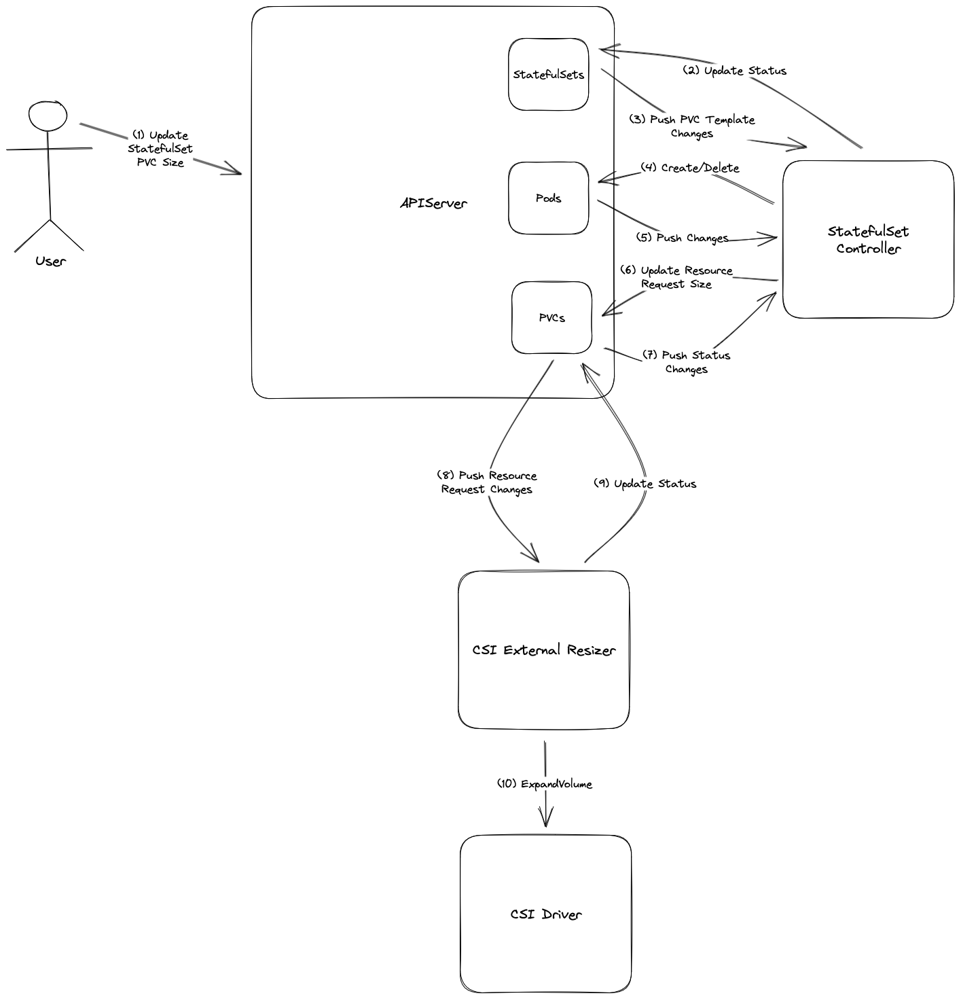
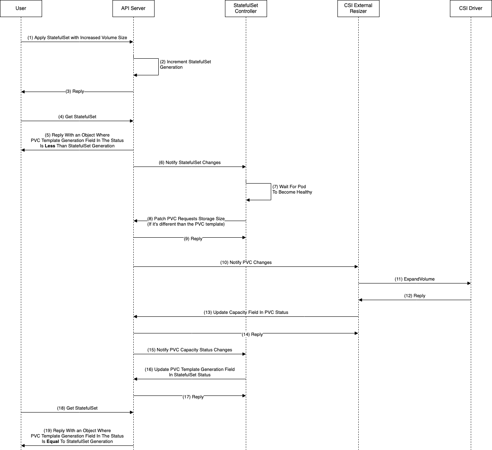

<!--
**Note:** When your KEP is complete, all of these comment blocks should be removed.

To get started with this template:

- [x] **Create an issue in kubernetes/enhancements**
  When filing an enhancement tracking issue, please make sure to complete all
  fields in that template. One of the fields asks for a link to the KEP. You
  can leave that blank until this KEP is filed, and then go back to the
  enhancement and add the link.
- [x] **Make a copy of this template directory.**
  Copy this template into the owning SIG's directory and name it
  `NNNN-short-descriptive-title`, where `NNNN` is the issue number (with no
  leading-zero padding) assigned to your enhancement above.
- [x] **Fill out as much of the kep.yaml file as you can.**
  At minimum, you should fill in the "Title", "Authors", "Owning-sig",
  "Status", and date-related fields.
- [x] **Fill out this file as best you can.**
  At minimum, you should fill in the "Summary" and "Motivation" sections.
  These should be easy if you've preflighted the idea of the KEP with the
  appropriate SIG(s).
- [ ] **Create a PR for this KEP.**
  Assign it to people in the SIG who are sponsoring this process.
- [ ] **Merge early and iterate.**
  Avoid getting hung up on specific details and instead aim to get the goals of
  the KEP clarified and merged quickly. The best way to do this is to just
  start with the high-level sections and fill out details incrementally in
  subsequent PRs.

Just because a KEP is merged does not mean it is complete or approved. Any KEP
marked as `provisional` is a working document and subject to change. You can
denote sections that are under active debate as follows:

```
<<[UNRESOLVED optional short context or usernames ]>>
Stuff that is being argued.
<<[/UNRESOLVED]>>
```

When editing KEPS, aim for tightly-scoped, single-topic PRs to keep discussions
focused. If you disagree with what is already in a document, open a new PR
with suggested changes.

One KEP corresponds to one "feature" or "enhancement" for its whole lifecycle.
You do not need a new KEP to move from beta to GA, for example. If
new details emerge that belong in the KEP, edit the KEP. Once a feature has become
"implemented", major changes should get new KEPs.

The canonical place for the latest set of instructions (and the likely source
of this file) is [here](/keps/NNNN-kep-template/README.md).

**Note:** Any PRs to move a KEP to `implementable`, or significant changes once
it is marked `implementable`, must be approved by each of the KEP approvers.
If none of those approvers are still appropriate, then changes to that list
should be approved by the remaining approvers and/or the owning SIG (or
SIG Architecture for cross-cutting KEPs).
-->
# KEP-0661: StatefulSet volume resize

<!--
This is the title of your KEP. Keep it short, simple, and descriptive. A good
title can help communicate what the KEP is and should be considered as part of
any review.
-->

<!--
A table of contents is helpful for quickly jumping to sections of a KEP and for
highlighting any additional information provided beyond the standard KEP
template.

Ensure the TOC is wrapped with
  <code>&lt;!-- toc --&rt;&lt;!-- /toc --&rt;</code>
tags, and then generate with `hack/update-toc.sh`.
-->

<!-- toc -->
- [Release Signoff Checklist](#release-signoff-checklist)
- [Summary](#summary)
- [Motivation](#motivation)
  - [Goals](#goals)
  - [Non-Goals](#non-goals)
- [Proposal](#proposal)
  - [Error indications to user](#error-indications-to-user)
  - [Revision control](#revision-control)
  - [User Stories (Optional)](#user-stories-optional)
    - [Story 1](#story-1)
    - [Story 2](#story-2)
  - [Notes/Constraints/Caveats (Optional)](#notesconstraintscaveats-optional)
  - [Risks and Mitigations](#risks-and-mitigations)
- [Design Details](#design-details)
  - [API server validation relaxation](#api-server-validation-relaxation)
  - [StatefulSet controller changes](#statefulset-controller-changes)
  - [RBAC changes.](#rbac-changes)
  - [Test Plan](#test-plan)
  - [Graduation Criteria](#graduation-criteria)
  - [Upgrade / Downgrade Strategy](#upgrade--downgrade-strategy)
  - [Version Skew Strategy](#version-skew-strategy)
- [Production Readiness Review Questionnaire](#production-readiness-review-questionnaire)
  - [Feature Enablement and Rollback](#feature-enablement-and-rollback)
  - [Rollout, Upgrade and Rollback Planning](#rollout-upgrade-and-rollback-planning)
  - [Monitoring Requirements](#monitoring-requirements)
  - [Dependencies](#dependencies)
  - [Scalability](#scalability)
  - [Troubleshooting](#troubleshooting)
- [Implementation History](#implementation-history)
- [Drawbacks](#drawbacks)
- [Alternatives](#alternatives)
- [Infrastructure Needed (Optional)](#infrastructure-needed-optional)
<!-- /toc -->

## Release Signoff Checklist

<!--
**ACTION REQUIRED:** In order to merge code into a release, there must be an
issue in [kubernetes/enhancements] referencing this KEP and targeting a release
milestone **before the [Enhancement Freeze](https://git.k8s.io/sig-release/releases)
of the targeted release**.

For enhancements that make changes to code or processes/procedures in core
Kubernetes—i.e., [kubernetes/kubernetes], we require the following Release
Signoff checklist to be completed.

Check these off as they are completed for the Release Team to track. These
checklist items _must_ be updated for the enhancement to be released.
-->

Items marked with (R) are required *prior to targeting to a milestone / release*.

- [ ] (R) Enhancement issue in release milestone, which links to KEP dir in [kubernetes/enhancements] (not the initial KEP PR)
- [ ] (R) KEP approvers have approved the KEP status as `implementable`
- [ ] (R) Design details are appropriately documented
- [ ] (R) Test plan is in place, giving consideration to SIG Architecture and SIG Testing input (including test refactors)
    - [ ] e2e Tests for all Beta API Operations (endpoints)
    - [ ] (R) Ensure GA e2e tests for meet requirements for [Conformance Tests](https://github.com/kubernetes/community/blob/master/contributors/devel/sig-architecture/conformance-tests.md)
    - [ ] (R) Minimum Two Week Window for GA e2e tests to prove flake free
- [ ] (R) Graduation criteria is in place
    - [ ] (R) [all GA Endpoints](https://github.com/kubernetes/community/pull/1806) must be hit by [Conformance Tests](https://github.com/kubernetes/community/blob/master/contributors/devel/sig-architecture/conformance-tests.md)
- [ ] (R) Production readiness review completed
- [ ] (R) Production readiness review approved
- [ ] "Implementation History" section is up-to-date for milestone
- [ ] User-facing documentation has been created in [kubernetes/website], for publication to [kubernetes.io]
- [ ] Supporting documentation—e.g., additional design documents, links to mailing list discussions/SIG meetings, relevant PRs/issues, release notes

<!--
**Note:** This checklist is iterative and should be reviewed and updated every time this enhancement is being considered for a milestone.
-->

[kubernetes.io]: https://kubernetes.io/
[kubernetes/enhancements]: https://git.k8s.io/enhancements
[kubernetes/kubernetes]: https://git.k8s.io/kubernetes
[kubernetes/website]: https://git.k8s.io/website

## Summary

<!--
This section is incredibly important for producing high-quality, user-focused
documentation such as release notes or a development roadmap. It should be
possible to collect this information before implementation begins, in order to
avoid requiring implementors to split their attention between writing release
notes and implementing the feature itself. KEP editors and SIG Docs
should help to ensure that the tone and content of the `Summary` section is
useful for a wide audience.

A good summary is probably at least a paragraph in length.

Both in this section and below, follow the guidelines of the [documentation
style guide]. In particular, wrap lines to a reasonable length, to make it
easier for reviewers to cite specific portions, and to minimize diff churn on
updates.

[documentation style guide]: https://github.com/kubernetes/community/blob/master/contributors/guide/style-guide.md
-->

Kubernetes has supported volume expansion as a beta feature since v1.16. However,
this feature support is only limited to standalone pods and deployments. Expansion of 
volumes associated with a Statefulset is not supported. This enhancement proposes to add 
the ability to resize volumes associated with a StatefulSet via modifications to its specification.

## Motivation

<!--
This section is for explicitly listing the motivation, goals, and non-goals of
this KEP.  Describe why the change is important and the benefits to users. The
motivation section can optionally provide links to [experience reports] to
demonstrate the interest in a KEP within the wider Kubernetes community.

[experience reports]: https://github.com/golang/go/wiki/ExperienceReports
-->

Stable persistent volumes can be created by specifying `.spec.volumeClaimTemplates`
for a [StatefulSet](https://kubernetes.io/docs/concepts/workloads/controllers/statefulset/).
Currently, StatefulSets do not allow the associated volumes to be resized directly by modifying the
`.spec.volumeClaimTemplates`. Instead users have to modify each PVC one by one to achieve this. In such cases, 
when the statefulset scales up, the new PVC(s) will be created with the older size and this again needs 
manual intervention. The intent of this proposal is to avoid this user overhead and simplify the 
process of resizing StatefulSet volumes.

### Goals

<!--
List the specific goals of the KEP. What is it trying to achieve? How will we
know that this has succeeded?
-->

Allow users to resize the volumes associated with `StatefulSet` by modifying the size of
PVC in the `.spec.volumeClaimTemplates`.

* Minimize the amount of unexpected errors/failures that the user might experience during volume resize by having as much validation as we can on the API server.
* In case errors do happen during resize, we shouldn't get in the way of the user trying to remediate those errors
* Provide a feedback mechanism for when a volume finished resizing fully, so that users can build detection mechanisms around that for their automated CI/CD processes.

### Non-Goals

<!--
What is out of scope for this KEP? Listing non-goals helps to focus discussion
and make progress.
-->

This proposal does not try to address the following scenarios but relies on the
underlying PVC resize logic to take the appropriate action or indicate error as needed.
- Shrinking of volume is not allowed.
- Few environments require Pod restarts in order to get access to the resized volume (meaning that the underlying CSI driver doesn't support online expansions). This KEP won't support such scenarios.
- Modifying anything but the `resources.request.storage` field of the `persistentVolumeClaim` (eg, `storageClassName`, `labels`, `annotations`).
- Resizing a PVC associated with a statefulset directly by modifying the PVC spec will not affect the 
  Statefulset `.spec.volumeClaimTemplates`. 
- Resizing ephemeral volumes.
- Correcting failures resulting from bad input or environmental issues (such as insufficient capacity/quota). We'll make an attempt to do as much validation as we can in the API server, but cases of errors/failures past admission will have to be handled by the user. This KEP will discuss the different failures that could happen past admission.

  

## Proposal

<!--
This is where we get down to the specifics of what the proposal actually is.
This should have enough detail that reviewers can understand exactly what
you're proposing, but should not include things like API designs or
implementation. What is the desired outcome and how do we measure success?.
The "Design Details" section below is for the real
nitty-gritty.
-->

Before we proceed to the proposal it is imperative to layout the various components involved
in creating and managing the persistent volumes associated with `StatefulSet`. 

- StatefulSet controller creates the PVCs from `volumeClaimTemplates` and associates them with the pods
spawned from it. Reconciliation logic runs for every change made to the StatefulSet
`Spec` and `Status` reflects the progress towards making the real world state equal to the
`Spec`.
- The validation logic in the API server is responsible for restricting the fields
which can be edited in a StatefulSet specification.
  - Part of the validation that the API server performs for objects (eg StatefulSet, PVC) happens in the object API server code and part happens in an admission plugin.
- The RBAC specification in the controller policy is responsible for adding the required 
RBAC permission for StatefulSet.
- The StatefulSet controller also supports revision control.

The following changes are proposed to achieve the goal:
1. Make the `volumeClaimTemplates` storage size (`.spec.resources.request.storage`) editable by modification to the api server
   validation. We should allow the user to both increase or decrease the storage size. Allowing the user to decrease the storage size will give them the ability to address failed expansions, as described in [KEP 1790](../1790-recover-resize-failure/README.md).
2. Add reconciliation of the associated PVC's size and the individual `volumeClaimTemplates` size into the 
   StatefulSet controller reconciliation.
3. Add PVC `patch` privilege to the StatefulSet controller's clusterrole RBAC.

Once the above changes are made, modification to any of the `volumeClaimTemplates` storage
size (specifically to the `.spec.resources.request.storage` field) by user will update (patch) the underlying PVC via the reconciliation performed by (2) above.
The existing PVC resize workflow kicks in at this point and attempts to resize the volume.



Two things to note about the diagram above
* It's an oversimpflication of the volume resize process or of how StatefulSet reconciliation works - but it should suffice in the context of this discussion.
* The numbers I denote on the arrows do not indicate the order in which operations happen. They are there for easier identification.

### Possible Errors/Failures

There are multiple real or potential places where errors/failures could happen when a user attempts to resize a volume claim template in a StatefulSet.

#### During Validation/Admission

These are potential failures that could arise during validation or submission that the API server performs when sending the modified StatefulSet object. In the diagram above, it refers to the arrow denoted with `(1)`.  

We won't expand on any of the errors that could happen during this phase right now, as we'll talk about it during [Validation](###-Validation)
But it's worth noting that this is the ideal place that errors could happen in - as it'll give the user immediate feedback. 

#### When Patching The PVC Object

These are errors that could happen when the reconciliation logic in the StatefulSet controller attempts to perform a `patch` operation on the PVC object. These errors arise from either the PVC validation logic in the API server or its admission plugin. In the diagram above, it refers to the arrow denoted with `(6)`.

* The storage class of the volume we're trying to resize doesn't allow for expansions.
  * It shouldn't be a problem to have this validation in the StatefulSet validation/admission and we'll talk about it during [Validation](###-Validation).
* We are trying to decrease the size of the volume.
  * Specifically, we're trying to decrease the size of the volume to a size that's less (or equal) than it's capacity. Decreasing the size of the volume to a size that's greater than its current capacity is allowed, as its part of the recovery from failed expansions mechanism, described in [KEP 1790](../1790-recover-resize-failure/README.md).
* The volume we're trying to resize is not bound.
  * This shouldn't be an issue because as we'll discuss later, we'll apply to reconciliation logic to the PVCs only when the pod that they're bound to is healthy and running.

#### Asynchronous Errors/Failures

This refers to a class of errors that could happen after the StatefulSet controller has successfully performed a `patch` operation on the PVC object. These errors are asynchronous in nature and can happen at any time after the `patch` operation. In the diagram above, it refers to the arrow denoted with `(10)`. (Though in reality, `kubelet` is involved in the resize as well, when an online expansion is performed, but we leave it out of the diagram).

* The CSI driver doesn't support online expansions.
  * This is a scenario where the driver cannot do an expansion while the volume is published to a node/the pod that's using it is up. When this happens, the CSI driver will return an error when the CSI resizer calls it (eg `FailedPrecondition`). In this proposal we won't be supporting the scenario of not supporting online expansions. Ideally, we'd want to know ahead of time (during StatefulSet admission/validation) if the CSI driver supports online expansion or not - but it might not be so simple. We'll discuss it in details when we talk about [Validation](###-Validation).
* The CSI driver doesn't support offline expansions.
  * This is a scenario where the volume must be published to a node/the pod that's using it must be up in order to perform an expansion. This is not exactly an error. The expansion process will be stuck until the volume is published on a node. This could happen in scenarios where a user attempts to resize a PVC that's not currently attached to a pod (eg a PVC is bound to a pod of the StatefulSet and then the user downscales the StatefulSet). We'll have to make sure to not get in the way of the user when try try to recover from this scenario.
* No space left/exceeding quota
  * This is a scenario where the driver returns an error to the resizer (eg `ResourceExhaused`/`OutOfRange`) because there's no space left for the resize process, or the user exceeds a quota on the provider they are using for storage. There is nothing we can do in this scenario other than not getting in the way of the user when they try to recover from it, and, continue reconciliation once they apply successful recovery. The recovery could involve steps like
    * Using the mechanisms that are described in [KEP 1790](../1790-recover-resize-failure/README.md)
    * Requesting more quota from the provider
  * It's important to note, that it's possible for partial failures to occur as well - which might be more tricky for the user to handle. For example, a user could do a resize in a StatefulSet that has 3 replicas and the resize could succeed on 2 of them and fail only on the last.
    * In such case, the user won't be able to apply the mechanisms in [KEP 1790](../1790-recover-resize-failure/README.md) and their only recourse would be to request more quota from the provider, or downsize their StatefulSet (number of replicas).

### Validation

We'd ideally want as much validation to happen as early as possible, ie during StatefulSet admission/validation. In reality, perfect validation during StatefulSet admission might be very hard to achieve as it involves communication with parts that the StatefulSet admission plugin won't have direct access to, like the CSI driver. Non the less, we'll discuss all the possible validation that we could potentially be performing during admission whether or not we'll actually end up performing them in the final implementation.

#### Validation Of The Storage Class

We'd want to validate that the storage class of the volume we're trying to resize allows for expansions. This validation can be performed easily by creating a plugin admission for the StatefulSet object. 
The plugin will use an [informer](https://pkg.go.dev/k8s.io/client-go/informers) to get the storage class object that the `.spec.storageClassName` field points to, and check its `allowVolumeExpansion` field. This should be similar to [how the PVC admission plugin does it today](https://github.com/kubernetes/kubernetes/blob/d89d5ab2680bc74fe4487ad71e514f4e0812d9ce/plugin/pkg/admission/storage/persistentvolume/resize/admission.go#L107)

#### Validation Of CSI Driver Capabilities

As mentioned earlier, we won't be supporting the scenario of drivers not supporting online expansion in the scope of this proposal. Thus, it would be ideal if we can validate durign StatefulSet admission that the CSI driver supports online expansions. However, this could be a lot more tricky than validating whether or not the storage class supports expansions, during admission.  

According to the [CSI Spec](https://github.com/container-storage-interface/spec/blob/master/spec.md#getplugincapabilities) - A driver must publish whether or not it supports online expansion via `GetPluginCapabilities`.  

However, that API won't be accessible to us from the API server, during StatefulSet admission, because it's part of the CSI driver's deployment/StatefulSet and not necessarily exposed externally via a LoadBalancer or an Ingress.  

One alternative would be to have the CSI driver publish its capabilities through the `CSIDriver` object. This could be done in two ways
* The CSI driver author would manually put the list of capabilities in the [`CSIPlugin` object](https://github.com/kubernetes-csi/csi-driver-host-path/blob/3d7b5eac9659bb2d436d4ed4d17b10020bc2677c/deploy/kubernetes-1.24/hostpath/csi-hostpath-driverinfo.yaml).
* We'd have a plugin in the [driver's deployment](https://github.com/kubernetes-csi/csi-driver-host-path/blob/master/deploy/kubernetes-1.24/hostpath/csi-hostpath-plugin.yaml) that would automatically populate the `CSIDriver` object with the capabilities of the driver by calling `GetPluginCapabilities`.
  * We could also modify one of the existing plugins (eg `csi-resizer`, `csi-provisioner`) - but none of them looks like a good candidate for this purpose.

The two options have the same drawbacks

* It will require modifying existing CSI drivers to support this feature.
* I noticed that some drivers don't explicitly specify support for online expansion when calling `GetPluginCapabilities`. Here's an example from the [EBS CSI Driver](https://github.com/kubernetes-sigs/aws-ebs-csi-driver/blob/7db7d1a745abd1473eb86e63383c119209dcfc80/pkg/driver/identity.go#L36)

Given the above, this kind of validation won't be handled as part of this KEP.

#### Validating That The Volume Size Doesn't Decrease

We don't want to prevent users from decreasing the size of the volume in the StatefulSet PVC templates. Because, we want to support recovery from expansion failures as discussed in [KEP 1790](../1790-recover-resize-failure/README.md). 

However, we'd ideally want to prevent users from decreasing the size of the StatefulSet PVC templates below (or equal) to the current capacity of the volume (`.status.capacity.storage`). 
This is similar to a validation that performed by the [PVC API server validation code](https://github.com/kubernetes/kubernetes/blob/d89d5ab2680bc74fe4487ad71e514f4e0812d9ce/pkg/apis/core/validation/validation.go#L2256) today. 

There are two problems with performing this kind of validation during StatefulSet admission though.

* The validation logic will have to be informed of and access all of the different PVC objects that exist for the StatefulSet. This might involve a lot of logic that is owned by the StatefulSet controller today (eg PVC naming convensions, ordinals, etc)
* There could be a race condition where at the time of admission, we see the requested size as being less than the capacity of a PVC - but by the time that the StatefulSet controller tries to reconcole the PVC's request size to that of the template, the capabity of the PVC has already increased.

Given the above, this kind of validation won't be handled as part of this KEP.

* That being said, At the time of writing this document, I believe that [KEP 1790](../1790-recover-resize-failure/README.md) is still disabled behind a feature flag. In that case, one validation that we can do (and will do if it's still the case during implementation), is validate that as long as the feature flag for [KEP 1790](../1790-recover-resize-failure/README.md) is disabled, the request size of the modified PVC template cannot be less than the request size of the old PVC template.

### Error Indications To The User

Errors that happen during validation are trivial so we won't cover them in this section. 

The two classes of errors we've like to have error indication than happen 
* [When Patching The PVC Object](###-When-Patching-The-PVC-Object)
* [Asynchronous Errors/Failures](###-Asynchronous-Errors/Failures)

The main mechanism for error reporting will be via [events](https://kubernetes.io/docs/reference/kubernetes-api/cluster-resources/event-v1/) on either the StatefulSet object or the PVC objects. From a UX standpoint, having errors as events on the StatefulSet object, instead of spreading them across the PVC objects, might seem more deseriable - but in some cases, could introduce additional complexity and only marginal benefits.  

For errors that happen [When Patching The PVC Object](###-When-Patching-The-PVC-Object), reporting on the StatefulSet object is fairly straightforward, since those errors arise from within the StatefulSet controller.

For example, an error that arises when trying to patch the PVC object to a size that's less or equal to its capacity, can result in the following event on the StatefulSet object. 

`kubectl describe sts ex1`
```
Events:
  Type     Reason            Age                From                    Message
  ----     ------            ----               ----                    -------
   ..       ....              ..                 ..                      .....
  Warning  FailedToPatchPVC  1s (x11 over 6s)   statefulset-controller  StatefulSet default/ex1 failed to patch PVC vol1-ex1-2 of Pod 2: PersistentVolumeClaim "vol1-ex1-2" is invalid: spec.resources.requests.storage: Forbidden: field can not be less than previous value
````

However, for errors that happen [asynchronously](###-Asynchronous-Errors/Failures), reporting on the StatefulSet object is not as straightforward. For example, if the CSI driver fails to resize the volume, the error will be reported as an event on the PVC object.

`kubectl describe pvc vol1-ex1-2`
```
Events:
  Type     Reason                      Age                    From                                                                           Message
  ----     ------                      ----                   ----                                                                           -------
   ..       ....                        ..                     ..                                                                             .....
  Warning  VolumeResizeFailed          4s (x6 over 9s)        external-resizer hostpath.csi.k8s.io                                           resize volume "pvc-8f38134a-ee99-4e70-8658-3cb492b8b11e" by resizer "hostpath.csi.k8s.io" failed: rpc error: code = OutOfRange desc = Requested capacity 9223372036854775807 exceeds maximum allowed 1125899906842624
```

In order to propagate that event to the StatefulSet object, we would have to subscribe to events from all namespaces (since the StatefulSet controller is namespace agnostic) `kubeClient.CoreV1().Events("").Watch()` and filter out events that are attached to PVC objects. Then, we'd also have to filter out irrelevant events that weren't generated due to a fault in the resize operation.  

This adds extra complication to the StatefulSet controller and could potentially hinder performance. The benefit is marginal improvement in UX (concentration of all error events under the StatefulSet object). 

* The impovement is marginal because
  * As we'll describe in later section, [Events](https://kubernetes.io/docs/reference/kubernetes-api/cluster-resources/event-v1/) is not a reliable mechanism for getting feedback on the resize operation, and the user will benefit more from relying on the feedback mechanisms described [here](###-Feedback).
  * Even though events might not be realiable for gathering feedback (especially during an automated deployment process, eg a CI/CD pipeline), the user could still rely on them for troubleshooting - but in that case, the user could just get/subscribe (`kubectl get events -w`) to events from the entire namespace.
    * It should also be possible to create tooling that will allow the user to aggregate events from multiple PVCs that were created by the same StatefulSet/template.
* It will be inconsistent with how events are reported on the StatefulSet pod.
  * Error events that are generated by kubelet on a pod (eg `Failed to pull image`) are not propagated to the pod's StatefulSet object.

### Feedback



It is useful to provide feedback to the user about the status of the resize operation. This main benefits are

* For errors that we can't properly report via an event on the StatefulSet object - a delay in feedback could prompt the user to investigate the issue, instead of leaving them oblivious to it. 
* Even for scenarios where there are no errors, it could be useful to provide feedback to the user that the resize operation has completed or is still in progress. If the user has multiple StatefulSets and/or cluster they are resizing, this will give them the option to decide if they want to wait for the resize operation to complete before proceeding with other operations.
* Feedback is especially useful if the resize happens as part of an automated deployment mechanism (ie a CI/CD pipeline). In such cases, the user doesn't necessarily keep an eye on the deployment process so proper feedback is really important.  

We propose to provide feedback by adding a new field to the StatefulSet status object. The new field will be an array that contains
* The name of the PVC template
* The current number of replicas for which the size of that PVC template is fully reconciled with the capacity of the PVC object (the `.status.capacity.storage` field) 
* The last generation (pertains to the `.metadata.generation` field on the StatefulSet object) in which the size of that PVC template was fully reconciled with the capacity of the PVC object for all replicas.  

Here's an example of what the StatefulSet status object with the new field will look like

```yaml
status:
  availableReplicas: 3
  collisionCount: 0
  currentReplicas: 3
  currentRevision: ex1-54c5bd476c
  observedGeneration: 3
  readyReplicas: 3
  replicas: 3
  updateRevision: ex1-54c5bd476c
  updatedReplicas: 3
  volumeClaimTemplates:
  - finishedReconciliationGeneration: 2
    readyReplicas: 1
    templateName: vol1
  - finishedReconciliationGeneration: 3
    readyReplicas: 3
    templateName: vol2
```

Some notes about the new fields
* The `finishedReconciliationGeneration` field is optional and won't appear if the PVC template is newly created and isn't reconciled yet.
* The `readyReplicas` will reset to 0 when the size of the PVC template is changed. It will increase only as the new pods become healthy and ready.
* The `readyReplicas` field also pertains to updates to the StatefulSet that are not related to the PVC templates. (eg if you modify the pod image, `readyReplicas` will reset to 0 and increase only as the new pods become healthy and ready)

In the example above, the size of the `vol1` PVC template has been recently resized (while the size of the `vol2` PVC template has not). At the time of capturing it, only 1 PVC of that template has been fully reconciled with the capacity of the PVC object.  

With the feedback mechanism, the user will be able to wait for partial feedback as well (eg, only 1 of the PVC templates has been fully reconciled, or, only 80% of the replicas for a given PVC template have been fully reconciled).  

This new feedback functionality will be able to be integrated into existing deployment tools that already have the ability to poll the status of the StatefulSet object for feedback (eg wait until all the pods in the StatefulSet are fully ready).  
For example, [Helm](https://github.com/helm/helm/blob/eea2f27babb0fddd9fb1907f4d8531c8f5c73c66/pkg/kube/ready.go#L353)

### Revision control

StatefulSet supports [revision control](https://kubernetes.io/blog/2017/09/kubernetes-statefulsets-daemonsets/).
The storage size change will not be added to the fields supporting revision control. Any change in
revision - going forward to a new version or going back to an older version would not make any
changes to the persistent volume size. Any changes requiring resize of the volume will need editing
of the StatefulSet storage size specification.

### Risks and Mitigations

<!--
What are the risks of this proposal, and how do we mitigate? Think broadly.
For example, consider both security and how this will impact the larger
Kubernetes ecosystem.

How will security be reviewed, and by whom?

How will UX be reviewed, and by whom?

Consider including folks who also work outside the SIG or subproject.
-->

#### Change In StatefulSet Reconciliation Logic

We are going to change how the StatefulSet reconciliation logic works. Since this is a change to a very central component, to mitigate it, we'd have to introduce a feature flag. The feature flag will be disabled by default. When disabled, the reconciliation logic in the StatefulSet should behave exactly as it behaves today. And, the validation logic that prevents user from modifying the size of a PVC template of a StatefulSet today, should be kept as is as long as the feature flag is disabled.

#### API Changes

We are adding a new array field to the StatefulSet status object (###-Feedback). I don't believe this change will impact any existing clients/tools - but to be careful, we should not expose this field in the API server as long as the feature flag described above is disabled. (We technically can't put a struct field behind a feature flag - but, by marking it as `omitempty` and putting the logic that populates it in the StatefulSet controller, behind a feature flag, we can effectively hide it from the API server)

Apart from mitigating the risk of breaking changes, the new [feedback](###-Feedback) machanism might not be immediately intuitive to all users and/or immediately be adapted by all deployment tools. We'll have to provide documentation and examples for how to use it and push for adaption by deployment tools. (such as Helm)

#### Changes To Revision Control

We are technically not making any changes to the revision control logic. But, the fact that changes to the PVC template won't be part of revision control, could cause confusion to user. To mitigate this, we should add documentation that explains this behavior.

#### Unreliability of [Events](https://kubernetes.io/docs/reference/kubernetes-api/cluster-resources/event-v1/)

The error reporting mechanisms that we describe [here](###-Error-Indications-To-The-User), suffer from [known reliability issues](https://kubernetes.io/docs/reference/kubernetes-api/cluster-resources/event-v1/#Event). The event reporting mechanisms works in a fire/forget fashion. The controller tries to push an event into a channel but will abort if the channel is full. 

We'll need to document the fact that the user should probably use events as a troubleshooting mechanism, and rely on the [feedback](###-Feedback) mechanism for reliable feedback, especially when deploying from an automated CI/CD pipeline.

#### Provide Clarity On Failure Scenarios

This proposal introduces multiple failure scenarios that are going to be handled at the different places, and reported in different manner. Some will be caught during validation, other will be reported as an error event and will require troubleshooting by the user.  

We'll have to provide clear documentation on the different failure scenarios, what the user can expect to be caught during valiation (eg storage class not supporting expansion) and what will be caught only during the reconciliation logic (eg user is trying to decrease size below or equal to PVC capacity; the CSI driver doesn't support online expansion). 

## Implementation Details

<!--
This section should contain enough information that the specifics of your
change are understandable. This may include API specs (though not always
required) or even code snippets. If there's any ambiguity about HOW your
proposal will be implemented, this is the place to discuss them.
-->

### API changes

The only API changes we'll make, is to add the `volumeClaimTemplates` array field to the StatefulSet status object as described in the [Feedback](###-Feedback) section.

### API server validation relaxation
Modifications would be made to `ValidateStatefulSetUpdate` in order to allow changes in the
storage size of the volume (`.spec.resources.requests.storage`) in the `VolumeClaimTemplates`.

### RBAC changes.
Now that StatefulSet controller needs to patch the PVC, `patch` will be added to the `statefulset-controller` role in the buildControllerRoles.

### StatefulSet controller changes

#### PVC Capacity Notifications

In order to be notified of capacity changes in PVC objects (arrow `(15)` in the diagram [here](###-Feedback)), which is necessary for the [feedback mechanism](###-Feedback), we'll perform the following changes

* When [creating a new a PVC object during StatefulSet reconciliation](https://github.com/kubernetes/kubernetes/blob/d89d5ab2680bc74fe4487ad71e514f4e0812d9ce/pkg/controller/statefulset/stateful_pod_control.go#L342), we'll add an annotations to the PVC object, denoting the namespace and name of the StatefulSet object.
  * We don't want to use the [`ownerReference`](https://kubernetes.io/docs/concepts/overview/working-with-objects/owners-dependents/#owner-references-in-object-specifications)  in this case, because that field is already utilized by the [StatefulSet PVC retention mechanism](https://kubernetes.io/blog/2021/12/16/kubernetes-1-23-statefulset-pvc-auto-deletion/).
* We'll start listening to PVC update (not add/delete) events in the [StatefulSet controller](https://github.com/kubernetes/kubernetes/blob/d89d5ab2680bc74fe4487ad71e514f4e0812d9ce/pkg/controller/statefulset/stateful_set.go#L80). When an update happens, we'll extract the StatefulSet object that we should do reconciliation for from the annotation we added in the previous step.
  * We'll also verify that only the `.status` field has changed in the PVC object. Otherwise, we won't continue reconciliation.

#### Main Reconciliation Logic

We would want to perform PVC reconciliation only for replicas that are in the latest revision of the StatefulSet object, and are running, but not necessarily ready (pass readiness checks). 

* The reason for only performing reconciliation on running and up to date (match to the latest revision), is that we don't want to do unecessary reconciliation works on replicas that are not running and might never run again as far as we're concerned.
  * Another reason is that we want for the PVC reconciliation to match the cadence of pod creation/modification in the StatefulSet. If the user uses monotonic (`OrderedReadyPodManagement`) roll out strategy, we'd want the PVC reconciliation process to respect that strategy. This is especially important considering that PVC reconciliation could fail asynchronically (eg, due to out of space/exceeding quota issues) and we want the failure to be predictable.
  * Another reason is that some CSI drivers don't support offline expansion (meaning, the volume has to be published/attached to a pod)
  * This means that if the StatefulSet is scaled to 0, and the user resizes one of the PVC templates, the change won't be reconciled (even if the PVC objects exist), until the StatefulSet is scaled up again.
* The reason for only waiting for the replicas/pods to be in a running state, and not necessarily in a ready state, is that the user might have readiness checks that will fail until the PVC is resized. Waiting for the pod to become fully ready, might put us in a deadlock.
  * For example, imagine a readiness check that tests that the filesystem has at least 10% space left.

On top of it, when we ecnounter an error during patching the PVC 
  * If the error is transient (not part of [Errors When Patching The PVC Object](###-When-Patching-The-PVC-Object)), record it on the StatefulSet object, and return the error immediately (this will stop the reconciliation process from progressing to other replicas and will trigger a retry).
  * If the error is not transient (part of [Errors When Patching The PVC Object](###-When-Patching-The-PVC-Object)), record it on the StatefulSet object, and
    * If the roll out strategy of the StatefulSet is monotonic (`OrderedReadyPodManagement`), return immediately - but do not return the error, because if the error is not transient, we do not want to retry.
    * If the roll out strategy is burst (not monotonic), continue.

```
for pvcTemplate in statefulset {
  statefulset.status.pvcTemplateStatus[pvcTemplate.name].readyReplicas = 0
}

for replica in replicas {
  // this is part of the existing replicas loop in the StatefulSet reconciliation process (https://github.com/kubernetes/kubernetes/blob/d89d5ab2680bc74fe4487ad71e514f4e0812d9ce/pkg/controller/statefulset/stateful_set_control.go#L397)
  // ...
  if getPodRevision(replica) == statefulset.revision && replica.Status.Phase == PodRunning && replica.DeletionTimestamp == nil {
    for pvcTemplate in statefulset {
      pvc, err = getPodPVC(replica, pvcTemplate)
      if err != nil {
        // this is either a transient error, or an error that shouldn't happen, because the pod is running and the PVC should exist
        recordError(statefulset, err)
        return err
      }

      if requestStorage(pvcTemplate) != requestStorage(pvc) {
        err = patchPVC(pvc, requestStorage(pvcTemplate))
        if err != nil {
          recordError(statefulset, err)
          if isTransientError(err) {
            return err
          } else if monotonic {
            return nil
          }
        }
      }

      if requestStorage(pvcTemplate) == capacityStorage(pvc) {
        statefulset.status.pvcTemplateStatus[pvcTemplate.name].readyReplicas++
      }
    }
  }
  // ...
}

for pvcTemplate in statefulset {
  if statefulset.status.pvcTemplateStatus[pvcTemplate.name].readyReplicas == statefulset.spec.replicas {
    statefulset.status.pvcTemplateStatus[pvcTemplate.name].finishedReconciliationGeneration = statefulset.generation
  }
}
```

### Test Plan

<!--
**Note:** *Not required until targeted at a release.*

Consider the following in developing a test plan for this enhancement:
- Will there be e2e and integration tests, in addition to unit tests?
- How will it be tested in isolation vs with other components?

No need to outline all of the test cases, just the general strategy. Anything
that would count as tricky in the implementation, and anything particularly
challenging to test, should be called out.

All code is expected to have adequate tests (eventually with coverage
expectations). Please adhere to the [Kubernetes testing guidelines][testing-guidelines]
when drafting this test plan.

[testing-guidelines]: https://git.k8s.io/community/contributors/devel/sig-testing/testing.md
-->

- E2E tests for volume expansion of PVC associated with statefulsets.
- Ensure statefulset controller revision works properly after resize.
- Test resize failure recovery after [KEP 1790](../1790-recover-resize-failure/README.md) has been implemented.

### Graduation Criteria

<!--
**Note:** *Not required until targeted at a release.*

Define graduation milestones.

These may be defined in terms of API maturity, or as something else. The KEP
should keep this high-level with a focus on what signals will be looked at to
determine graduation.

Consider the following in developing the graduation criteria for this enhancement:
- [Maturity levels (`alpha`, `beta`, `stable`)][maturity-levels]
- [Deprecation policy][deprecation-policy]

Clearly define what graduation means by either linking to the [API doc
definition](https://kubernetes.io/docs/concepts/overview/kubernetes-api/#api-versioning)
or by redefining what graduation means.

In general we try to use the same stages (alpha, beta, GA), regardless of how the
functionality is accessed.

[maturity-levels]: https://git.k8s.io/community/contributors/devel/sig-architecture/api_changes.md#alpha-beta-and-stable-versions
[deprecation-policy]: https://kubernetes.io/docs/reference/using-api/deprecation-policy/

Below are some examples to consider, in addition to the aforementioned [maturity levels][maturity-levels].

#### Alpha

- Feature implemented behind a feature flag
- Initial e2e tests completed and enabled

#### Beta

- Gather feedback from developers and surveys
- Complete features A, B, C
- Additional tests are in Testgrid and linked in KEP

#### GA

- N examples of real-world usage
- N installs
- More rigorous forms of testing—e.g., downgrade tests and scalability tests
- Allowing time for feedback

**Note:** Generally we also wait at least two releases between beta and
GA/stable, because there's no opportunity for user feedback, or even bug reports,
in back-to-back releases.

**For non-optional features moving to GA, the graduation criteria must include
[conformance tests].**

[conformance tests]: https://git.k8s.io/community/contributors/devel/sig-architecture/conformance-tests.md

#### Deprecation

- Announce deprecation and support policy of the existing flag
- Two versions passed since introducing the functionality that deprecates the flag (to address version skew)
- Address feedback on usage/changed behavior, provided on GitHub issues
- Deprecate the flag
-->

* *Alpha* in 1.24 behind `StatefulSetVolumeExpansion` feature gate which will be set to `false` by default. Statefulset controller revision behavior will be explained in the documentation.
* *Beta* in 1.25: We are going to move this to beta with enhanced e2e and more stability improvements.
* *GA* in 1.26  

### Upgrade / Downgrade Strategy

<!--
If applicable, how will the component be upgraded and downgraded? Make sure
this is in the test plan.

Consider the following in developing an upgrade/downgrade strategy for this
enhancement:
- What changes (in invocations, configurations, API use, etc.) is an existing
  cluster required to make on upgrade, in order to maintain previous behavior?
- What changes (in invocations, configurations, API use, etc.) is an existing
  cluster required to make on upgrade, in order to make use of the enhancement?
-->

### Version Skew Strategy

<!--
If applicable, how will the component handle version skew with other
components? What are the guarantees? Make sure this is in the test plan.

Consider the following in developing a version skew strategy for this
enhancement:
- Does this enhancement involve coordinating behavior in the control plane and
  in the kubelet? How does an n-2 kubelet without this feature available behave
  when this feature is used?
- Will any other components on the node change? For example, changes to CSI,
  CRI or CNI may require updating that component before the kubelet.
-->

## Production Readiness Review Questionnaire

<!--

Production readiness reviews are intended to ensure that features merging into
Kubernetes are observable, scalable and supportable; can be safely operated in
production environments, and can be disabled or rolled back in the event they
cause increased failures in production. See more in the PRR KEP at
https://git.k8s.io/enhancements/keps/sig-architecture/1194-prod-readiness.

The production readiness review questionnaire must be completed and approved
for the KEP to move to `implementable` status and be included in the release.

In some cases, the questions below should also have answers in `kep.yaml`. This
is to enable automation to verify the presence of the review, and to reduce review
burden and latency.

The KEP must have a approver from the
[`prod-readiness-approvers`](http://git.k8s.io/enhancements/OWNERS_ALIASES)
team. Please reach out on the
[#prod-readiness](https://kubernetes.slack.com/archives/CPNHUMN74) channel if
you need any help or guidance.
-->

### Feature Enablement and Rollback

<!--
This section must be completed when targeting alpha to a release.
-->

###### How can this feature be enabled / disabled in a live cluster?

<!--
Pick one of these and delete the rest.
-->

- [ x ] Feature gate (also fill in values in `kep.yaml`)
    - Feature gate name: StatefulSetVolumeExpansion
    - Components depending on the feature gate:
      - kube-controller-manager
      - kube-apiserver, to relax the restriction on editing VolumeClaimTemplate size.

###### Does enabling the feature change any default behavior?

<!--
Any change of default behavior may be surprising to users or break existing
automations, so be extremely careful here.
-->
Yes, users will now be able to modify the requested size in the VolumeClaimsTemplate section of the statefulset spec.

###### Can the feature be disabled once it has been enabled (i.e. can we roll back the enablement)?

<!--
Describe the consequences on existing workloads (e.g., if this is a runtime
feature, can it break the existing applications?).

NOTE: Also set `disable-supported` to `true` or `false` in `kep.yaml`.
-->
Yes. If the feature is disabled, the user will not be able to resize PVCs associated with a statefulset anymore. Any existing statefulset reconciliation operations might be affected if feature is disabled while the volume is being resized.

###### What happens if we reenable the feature if it was previously rolled back?
Statefulset reconciliation process for volume size will remove any anomalies which were left behind during disabling the feature. Volumes associated with statefulsets will be allowed to resize.

###### Are there any tests for feature enablement/disablement?

<!--
The e2e framework does not currently support enabling or disabling feature
gates. However, unit tests in each component dealing with managing data, created
with and without the feature, are necessary. At the very least, think about
conversion tests if API types are being modified.
-->
Unit tests to test behaviour of code when feature gate is enabled and disabled will be written to test both behaviors.

### Rollout, Upgrade and Rollback Planning

<!--
This section must be completed when targeting beta to a release.
-->

###### How can a rollout or rollback fail? Can it impact already running workloads?

<!--
Try to be as paranoid as possible - e.g., what if some components will restart
mid-rollout?

Be sure to consider highly-available clusters, where, for example,
feature flags will be enabled on some API servers and not others during the
rollout. Similarly, consider large clusters and how enablement/disablement
will rollout across nodes.
-->

###### What specific metrics should inform a rollback?

<!--
What signals should users be paying attention to when the feature is young
that might indicate a serious problem?
-->

###### Were upgrade and rollback tested? Was the upgrade->downgrade->upgrade path tested?

<!--
Describe manual testing that was done and the outcomes.
Longer term, we may want to require automated upgrade/rollback tests, but we
are missing a bunch of machinery and tooling and can't do that now.
-->

###### Is the rollout accompanied by any deprecations and/or removals of features, APIs, fields of API types, flags, etc.?

<!--
Even if applying deprecation policies, they may still surprise some users.
-->

### Monitoring Requirements

<!--
This section must be completed when targeting beta to a release.
-->

###### How can an operator determine if the feature is in use by workloads?

<!--
Ideally, this should be a metric. Operations against the Kubernetes API (e.g.,
checking if there are objects with field X set) may be a last resort. Avoid
logs or events for this purpose.
-->

###### How can someone using this feature know that it is working for their instance?

<!--
For instance, if this is a pod-related feature, it should be possible to determine if the feature is functioning properly
for each individual pod.
Pick one more of these and delete the rest.
Please describe all items visible to end users below with sufficient detail so that they can verify correct enablement
and operation of this feature.
Recall that end users cannot usually observe component logs or access metrics.
-->

- [ ] Events
    - Event Reason:
- [ ] API .status
    - Condition name:
    - Other field:
- [ ] Other (treat as last resort)
    - Details:

###### What are the reasonable SLOs (Service Level Objectives) for the enhancement?

<!--
This is your opportunity to define what "normal" quality of service looks like
for a feature.

It's impossible to provide comprehensive guidance, but at the very
high level (needs more precise definitions) those may be things like:
  - per-day percentage of API calls finishing with 5XX errors <= 1%
  - 99% percentile over day of absolute value from (job creation time minus expected
    job creation time) for cron job <= 10%
  - 99.9% of /health requests per day finish with 200 code

These goals will help you determine what you need to measure (SLIs) in the next
question.
-->

###### What are the SLIs (Service Level Indicators) an operator can use to determine the health of the service?

<!--
Pick one more of these and delete the rest.
-->

- [ ] Metrics
    - Metric name:
    - [Optional] Aggregation method:
    - Components exposing the metric:
- [ ] Other (treat as last resort)
    - Details:

###### Are there any missing metrics that would be useful to have to improve observability of this feature?

<!--
Describe the metrics themselves and the reasons why they weren't added (e.g., cost,
implementation difficulties, etc.).
-->

### Dependencies

<!--
This section must be completed when targeting beta to a release.
-->

###### Does this feature depend on any specific services running in the cluster?

<!--
Think about both cluster-level services (e.g. metrics-server) as well
as node-level agents (e.g. specific version of CRI). Focus on external or
optional services that are needed. For example, if this feature depends on
a cloud provider API, or upon an external software-defined storage or network
control plane.

For each of these, fill in the following—thinking about running existing user workloads
and creating new ones, as well as about cluster-level services (e.g. DNS):
  - [Dependency name]
    - Usage description:
      - Impact of its outage on the feature:
      - Impact of its degraded performance or high-error rates on the feature:
-->

### Scalability

<!--
For alpha, this section is encouraged: reviewers should consider these questions
and attempt to answer them.

For beta, this section is required: reviewers must answer these questions.

For GA, this section is required: approvers should be able to confirm the
previous answers based on experience in the field.
-->

###### Will enabling / using this feature result in any new API calls?

<!--
Describe them, providing:
  - API call type (e.g. PATCH pods)
  - estimated throughput
  - originating component(s) (e.g. Kubelet, Feature-X-controller)
Focusing mostly on:
  - components listing and/or watching resources they didn't before
  - API calls that may be triggered by changes of some Kubernetes resources
    (e.g. update of object X triggers new updates of object Y)
  - periodic API calls to reconcile state (e.g. periodic fetching state,
    heartbeats, leader election, etc.)
-->

###### Will enabling / using this feature result in introducing new API types?

<!--
Describe them, providing:
  - API type
  - Supported number of objects per cluster
  - Supported number of objects per namespace (for namespace-scoped objects)
-->

###### Will enabling / using this feature result in any new calls to the cloud provider?

<!--
Describe them, providing:
  - Which API(s):
  - Estimated increase:
-->

###### Will enabling / using this feature result in increasing size or count of the existing API objects?

<!--
Describe them, providing:
  - API type(s):
  - Estimated increase in size: (e.g., new annotation of size 32B)
  - Estimated amount of new objects: (e.g., new Object X for every existing Pod)
-->

###### Will enabling / using this feature result in increasing time taken by any operations covered by existing SLIs/SLOs?

<!--
Look at the [existing SLIs/SLOs].

Think about adding additional work or introducing new steps in between
(e.g. need to do X to start a container), etc. Please describe the details.

[existing SLIs/SLOs]: https://git.k8s.io/community/sig-scalability/slos/slos.md#kubernetes-slisslos
-->

###### Will enabling / using this feature result in non-negligible increase of resource usage (CPU, RAM, disk, IO, ...) in any components?

<!--
Things to keep in mind include: additional in-memory state, additional
non-trivial computations, excessive access to disks (including increased log
volume), significant amount of data sent and/or received over network, etc.
This through this both in small and large cases, again with respect to the
[supported limits].

[supported limits]: https://git.k8s.io/community//sig-scalability/configs-and-limits/thresholds.md
-->

### Troubleshooting

<!--
This section must be completed when targeting beta to a release.

The Troubleshooting section currently serves the `Playbook` role. We may consider
splitting it into a dedicated `Playbook` document (potentially with some monitoring
details). For now, we leave it here.
-->

###### How does this feature react if the API server and/or etcd is unavailable?

###### What are other known failure modes?

<!--
For each of them, fill in the following information by copying the below template:
  - [Failure mode brief description]
    - Detection: How can it be detected via metrics? Stated another way:
      how can an operator troubleshoot without logging into a master or worker node?
    - Mitigations: What can be done to stop the bleeding, especially for already
      running user workloads?
    - Diagnostics: What are the useful log messages and their required logging
      levels that could help debug the issue?
      Not required until feature graduated to beta.
    - Testing: Are there any tests for failure mode? If not, describe why.
-->

###### What steps should be taken if SLOs are not being met to determine the problem?

## Implementation History

<!--
Major milestones in the lifecycle of a KEP should be tracked in this section.
Major milestones might include:
- the `Summary` and `Motivation` sections being merged, signaling SIG acceptance
- the `Proposal` section being merged, signaling agreement on a proposed design
- the date implementation started
- the first Kubernetes release where an initial version of the KEP was available
- the version of Kubernetes where the KEP graduated to general availability
- when the KEP was retired or superseded
-->

## Drawbacks

<!--
Why should this KEP _not_ be implemented?
-->

## Alternatives

<!--
What other approaches did you consider, and why did you rule them out? These do
not need to be as detailed as the proposal, but should include enough
information to express the idea and why it was not acceptable.
-->

An alternative approach considered with respect to the revision control is to add the
volume size as part of the revision control. In such a case, if we did an expand
volume, users will not be able to rollback to previous versions since volume shrink
is not yet supported. Hence we take a pragmatic path and keep the volume size separate
from controller revision changes.

## Infrastructure Needed (Optional)

<!--
Use this section if you need things from the project/SIG. Examples include a
new subproject, repos requested, or GitHub details. Listing these here allows a
SIG to get the process for these resources started right away.
-->